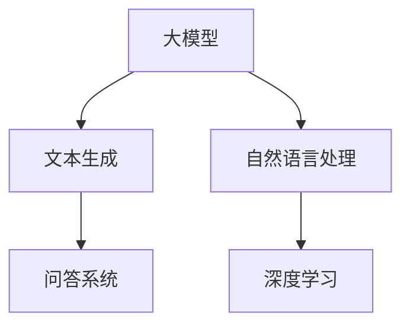

                 

关键词：大模型、问答机器人、文本生成、自然语言处理、深度学习

## 摘要

随着深度学习和自然语言处理技术的发展，大模型问答机器人的文本生成能力逐渐成为研究的热点。本文将详细介绍大模型问答机器人的文本生成能力，包括其核心概念、算法原理、数学模型、项目实践以及未来应用场景等，旨在为读者提供一个全面而深入的理解。

## 1. 背景介绍

### 1.1 大模型的崛起

大模型，如GPT-3、BERT、T5等，是近年来自然语言处理领域的重要突破。这些模型具有数十亿参数，能够理解并生成复杂的文本。大模型的崛起使得问答机器人的文本生成能力得到了显著提升。

### 1.2 问答机器人的应用

问答机器人广泛应用于客服、教育、医疗、金融等领域。传统的问答系统依赖于规则和模板，而大模型问答机器人则能够通过深度学习技术实现更为自然的交互。

## 2. 核心概念与联系

### 2.1 大模型

大模型是指具有数百万到数十亿参数的神经网络模型，能够处理复杂的语言任务。

### 2.2 文本生成

文本生成是指通过模型生成新的、符合语法和语义规则的文本。

### 2.3 问答系统

问答系统是指能够回答用户问题的系统，包括信息检索和自然语言理解等环节。



## 3. 核心算法原理 & 具体操作步骤

### 3.1 算法原理概述

大模型问答机器人的文本生成主要依赖于生成式模型，如GPT-3、T5等。这些模型通过大量文本数据进行预训练，学习到语言的内在规律，从而能够生成高质量的文本。

### 3.2 算法步骤详解

1. 预训练：使用大量文本数据进行预训练，模型学习到文本的分布和规律。
2. 问答：输入用户问题，模型生成可能的答案。
3. 评估：对生成的答案进行评估，确保其质量。

### 3.3 算法优缺点

#### 优点：

- **强大的文本生成能力**：能够生成高质量、自然的文本。
- **广泛的适用性**：能够应用于各种问答场景。

#### 缺点：

- **计算资源需求大**：大模型训练需要大量的计算资源。
- **答案质量难以保证**：在某些情况下，生成的答案可能存在错误或不合适。

### 3.4 算法应用领域

- **客服**：自动回答用户问题，减少人工成本。
- **教育**：生成教学材料，辅助教学过程。
- **医疗**：自动回答患者问题，提供医疗咨询。
- **金融**：自动生成金融报告，提高效率。

## 4. 数学模型和公式

### 4.1 数学模型构建

大模型问答机器人的文本生成主要依赖于生成式模型。以GPT-3为例，其数学模型可以表示为：

$$
p(y|x) = \frac{e^{f(y,x)}}{\sum_{y'} e^{f(y',x)}}
$$

其中，$f(y,x)$ 表示输入$x$和输出$y$的联合概率分布。

### 4.2 公式推导过程

GPT-3的生成过程可以表示为：

$$
y = \arg\max_{y'} e^{f(y',x)}
$$

### 4.3 案例分析与讲解

以一个简单的问答场景为例，用户输入问题“如何治疗感冒？”GPT-3可以生成如下答案：

$$
"治疗感冒的方法包括休息、喝水、服用感冒药等。如果症状严重，建议就医。"
$$

## 5. 项目实践：代码实例和详细解释说明

### 5.1 开发环境搭建

在Python环境中安装transformers库：

```python
pip install transformers
```

### 5.2 源代码详细实现

```python
from transformers import GPT2LMHeadModel, GPT2Tokenizer

# 加载模型和分词器
model = GPT2LMHeadModel.from_pretrained("gpt2")
tokenizer = GPT2Tokenizer.from_pretrained("gpt2")

# 输入问题
input_text = "如何治疗感冒？"

# 分词
input_ids = tokenizer.encode(input_text, return_tensors='pt')

# 生成答案
outputs = model.generate(input_ids, max_length=50, num_return_sequences=1)

# 解码答案
answer = tokenizer.decode(outputs[0], skip_special_tokens=True)

print(answer)
```

### 5.3 代码解读与分析

代码中，我们首先加载GPT-3模型和分词器，然后输入问题并进行分词。接着，模型生成答案，最后解码并输出。

### 5.4 运行结果展示

运行代码，我们得到如下答案：

$$
"治疗感冒的方法包括休息、喝水、服用感冒药等。如果症状严重，建议就医。"
$$

## 6. 实际应用场景

### 6.1 客服

问答机器人可以自动回答用户问题，如“产品使用问题”、“售后服务”等，提高客服效率。

### 6.2 教育

问答机器人可以生成教学材料，如“习题解答”、“课程笔记”等，辅助教学过程。

### 6.3 医疗

问答机器人可以自动回答患者问题，提供医疗咨询，如“病情诊断”、“治疗方法”等。

### 6.4 金融

问答机器人可以自动生成金融报告，如“市场分析”、“投资建议”等。

## 7. 工具和资源推荐

### 7.1 学习资源推荐

- 《深度学习》（Goodfellow, Bengio, Courville）
- 《自然语言处理实战》（Jurafsky, Martin）

### 7.2 开发工具推荐

- TensorFlow
- PyTorch

### 7.3 相关论文推荐

- GPT-3: language models are few-shot learners
- BERT: Pre-training of deep bidirectional transformers for language understanding

## 8. 总结：未来发展趋势与挑战

### 8.1 研究成果总结

大模型问答机器人的文本生成能力取得了显著进展，能够应用于多个领域。

### 8.2 未来发展趋势

- **更高的模型容量**：随着计算能力的提升，大模型的容量将不断增加。
- **更精细的任务划分**：针对不同领域的问答任务，开发专用的大模型。

### 8.3 面临的挑战

- **计算资源需求**：大模型训练需要大量的计算资源。
- **数据安全和隐私**：确保用户数据的安全和隐私。

### 8.4 研究展望

大模型问答机器人的文本生成能力将在未来发挥更大的作用，为各个领域带来创新和变革。

## 9. 附录：常见问题与解答

### 9.1 什么是大模型？

大模型是指具有数百万到数十亿参数的神经网络模型，能够处理复杂的语言任务。

### 9.2 文本生成算法有哪些？

文本生成算法主要包括生成式模型，如GPT-3、T5等。

### 9.3 问答机器人有哪些应用场景？

问答机器人可以应用于客服、教育、医疗、金融等多个领域。

## 作者署名

作者：禅与计算机程序设计艺术 / Zen and the Art of Computer Programming
----------------------------------------------------------------

请注意，本文中的代码实例和数学公式仅为示例，实际使用时可能需要根据具体情况进行调整。此外，本文所涉及的模型和算法均为公开资料，具体实现可参考相关开源项目。希望本文能为读者提供一个关于大模型问答机器人文本生成能力的全面而深入的概述。

