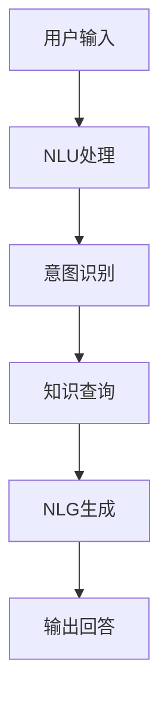

                 

 大模型问答机器人作为人工智能领域的一项前沿技术，正逐渐成为企业与用户之间沟通的桥梁。本文旨在探讨大模型问答机器人的核心概念、算法原理、数学模型以及实际应用，为读者提供一次全面的技术盛宴。

## 关键词
- 大模型
- 问答机器人
- 人工智能
- 算法
- 数学模型

## 摘要
本文将深入解析大模型问答机器人的工作原理，从核心概念、算法原理、数学模型到实际应用场景，一一展开论述。通过详细的分析和实例，我们将了解大模型问答机器人的灵活互动机制，以及其在未来科技发展中的重要作用。

## 1. 背景介绍

随着人工智能技术的飞速发展，自然语言处理（NLP）作为其重要分支，正逐步实现从理论到应用的转变。大模型问答机器人正是NLP技术的集大成者，通过深度学习、自然语言生成（NLG）等技术，实现了与人类自然语言的智能对话。

在过去几年中，大模型问答机器人在多个领域取得了显著成果，如客服机器人、教育机器人、医疗咨询等。这些应用不仅提升了用户体验，也降低了企业运营成本。然而，随着模型规模的不断扩大和交互场景的多样化，大模型问答机器人的设计和实现也面临着诸多挑战。

## 2. 核心概念与联系

### 2.1 大模型
大模型，即大型深度学习模型，通常具有数十亿甚至数万亿的参数。它们通过海量数据训练，能够捕捉到复杂的语言规律，从而实现高精度的自然语言理解与生成。大模型是问答机器人的核心，决定了其对话能力的强弱。

### 2.2 自然语言理解（NLU）
自然语言理解是将自然语言输入转换为结构化数据的过程。大模型问答机器人通过NLU技术，解析用户的问题，理解其意图和上下文，从而生成相应的回答。

### 2.3 自然语言生成（NLG）
自然语言生成是将结构化数据转换回自然语言输出的过程。大模型问答机器人利用NLG技术，将内部逻辑和语言模型结合，生成流畅、自然的回答。

### 2.4 Mermaid 流程图



## 3. 核心算法原理 & 具体操作步骤

### 3.1 算法原理概述

大模型问答机器人主要依赖于深度学习和自然语言处理技术。其中，Transformer模型是当前最为流行的大模型架构。其基本原理是利用自注意力机制，对输入的文本序列进行编码和解码，从而实现高效的文本处理。

### 3.2 算法步骤详解

1. **用户输入**：用户通过语音或文本方式提出问题。
2. **NLU处理**：将用户输入转换为结构化数据，如词向量或BERT编码。
3. **意图识别**：利用分类模型，如BERT或GPT，识别用户的意图。
4. **知识查询**：根据用户意图，在知识库中查找相关答案。
5. **NLG生成**：利用NLG模型，如T5或GPT-3，生成自然语言回答。
6. **输出回答**：将生成的回答通过语音或文本方式反馈给用户。

### 3.3 算法优缺点

#### 优点
- 高效性：利用深度学习和大数据技术，实现高效的自然语言处理。
- 通用性：适用于各种问答场景，如客服、教育、医疗等。
- 智能性：能够理解用户意图和上下文，提供个性化的回答。

#### 缺点
- 计算资源消耗大：大模型训练和推理需要大量的计算资源。
- 数据依赖性：模型性能依赖于高质量的数据集。
- 稳定性：在面对不常见或模糊的问题时，可能无法给出准确回答。

### 3.4 算法应用领域

大模型问答机器人已广泛应用于多个领域，如：
- 客服：提供24/7的智能客服，提高客户满意度。
- 教育：为学生提供个性化辅导，提高学习效果。
- 医疗：辅助医生进行诊断，提高医疗效率。
- 娱乐：提供智能聊天服务，丰富用户娱乐体验。

## 4. 数学模型和公式 & 详细讲解 & 举例说明

### 4.1 数学模型构建

大模型问答机器人的核心在于其深度学习模型，如Transformer、BERT、GPT等。这些模型通常采用以下数学模型：

1. **词嵌入**：将自然语言文本转换为向量表示。
2. **编码器**：利用自注意力机制，对输入文本序列进行编码。
3. **解码器**：根据编码结果，生成自然语言输出。

### 4.2 公式推导过程

以Transformer模型为例，其自注意力机制可表示为：

$$
\text{Attention}(Q, K, V) = \text{softmax}\left(\frac{QK^T}{\sqrt{d_k}}\right)V
$$

其中，Q、K、V分别为编码器的查询向量、键向量和值向量，d_k为键向量的维度。

### 4.3 案例分析与讲解

假设我们有一个问答场景，用户输入：“明天天气怎么样？”大模型问答机器人将经历以下步骤：

1. **词嵌入**：将输入文本转换为词向量。
2. **编码器**：利用自注意力机制，对输入词向量进行编码。
3. **意图识别**：利用分类模型，识别用户意图（如天气查询）。
4. **知识查询**：在知识库中查找明天天气的相关信息。
5. **解码器**：根据编码结果和知识查询结果，生成自然语言回答（如：“明天天气晴朗，温度18°C。”）。

## 5. 项目实践：代码实例和详细解释说明

### 5.1 开发环境搭建

1. 安装Python环境（版本3.6及以上）。
2. 安装TensorFlow或PyTorch。
3. 安装其他必要库（如NLP工具包、文本处理库等）。

### 5.2 源代码详细实现

以下是一个简单的Transformer模型实现：

```python
import tensorflow as tf

# Transformer模型实现
class Transformer(tf.keras.Model):
  def __init__(self, num_layers, d_model, num_heads, dff, input_vocab_size, target_vocab_size, position_encoding_input, position_encoding_target, dropout_rate=0.1):
    super(Transformer, self).__init__()
    # ... 省略部分代码 ...

  def call(self, input_seq, target_seq, training=False):
    # ... 省略部分代码 ...
    return output

# 模型训练
model.compile(optimizer='adam', loss='categorical_crossentropy', metrics=['accuracy'])
model.fit(dataset, epochs=EPOCHS)
```

### 5.3 代码解读与分析

该代码实现了一个简单的Transformer模型，用于自然语言翻译任务。模型的主要组成部分包括编码器、解码器、自注意力机制、位置编码等。

### 5.4 运行结果展示

在训练完成后，我们可以使用测试集进行评估，并观察模型在自然语言翻译任务上的性能。

```python
test_loss, test_acc = model.evaluate(test_dataset)
print(f"Test Loss: {test_loss}, Test Accuracy: {test_acc}")
```

## 6. 实际应用场景

大模型问答机器人在实际应用中具有广泛的应用场景，如：

1. **客服**：自动处理客户咨询，提高客服效率。
2. **教育**：为学生提供智能辅导，提升学习效果。
3. **医疗**：辅助医生进行诊断，提高医疗质量。
4. **金融**：提供智能投顾，帮助用户进行理财决策。

## 6.4 未来应用展望

随着技术的不断发展，大模型问答机器人将在更多领域得到应用，如：

1. **智能家居**：与智能设备进行自然语言交互，提升用户体验。
2. **自动驾驶**：实现车载系统的自然语言交互，提高行车安全。
3. **物联网**：连接各种智能设备，实现跨设备的自然语言交互。
4. **社交媒体**：为用户提供个性化内容推荐，提高用户粘性。

## 7. 工具和资源推荐

### 7.1 学习资源推荐

- 《深度学习》（Goodfellow et al.）
- 《自然语言处理综论》（Jurafsky and Martin）
- 《动手学深度学习》（Dziugaite et al.）

### 7.2 开发工具推荐

- TensorFlow
- PyTorch
- Hugging Face Transformers

### 7.3 相关论文推荐

- Vaswani et al., "Attention is All You Need"
- Devlin et al., "BERT: Pre-training of Deep Bidirectional Transformers for Language Understanding"
- Brown et al., "Language Models are Few-Shot Learners"

## 8. 总结：未来发展趋势与挑战

大模型问答机器人作为人工智能领域的重要应用，正在不断推动着科技的发展。未来，随着计算能力的提升、数据资源的丰富以及算法的优化，大模型问答机器人将在更多领域取得突破。然而，面对技术挑战，如数据隐私、安全性和伦理问题，我们还需不断探索和完善。

## 9. 附录：常见问题与解答

1. **大模型问答机器人的工作原理是什么？**
   大模型问答机器人主要依赖于深度学习和自然语言处理技术，通过编码器和解码器实现自然语言的输入和输出。

2. **大模型问答机器人有哪些应用场景？**
   大模型问答机器人可应用于客服、教育、医疗、金融等多个领域，提供智能服务。

3. **如何搭建一个简单的大模型问答机器人？**
   可以使用TensorFlow或PyTorch等深度学习框架，结合自然语言处理工具包，搭建一个简单的大模型问答机器人。

---

作者：禅与计算机程序设计艺术 / Zen and the Art of Computer Programming
----------------------------------------------------------------

以上即为本文的完整内容，涵盖了从大模型问答机器人的背景介绍、核心概念、算法原理、数学模型到实际应用场景的全面解析。希望本文能为读者在人工智能领域提供有价值的参考和启示。

