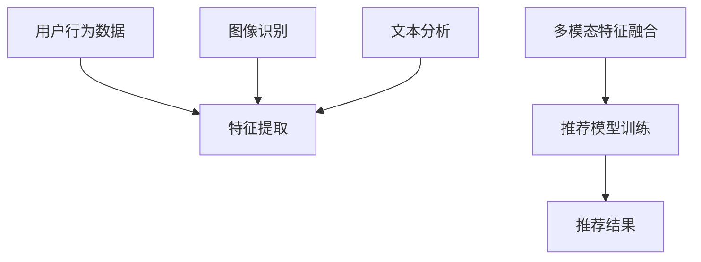

                 

关键词：大模型、推荐系统、多模态交互、人工智能、深度学习、机器学习、自然语言处理、图像识别、用户行为分析

> 摘要：本文深入探讨了大模型在推荐系统中的多模态交互理解，通过分析大模型的核心概念、算法原理、数学模型以及实际应用场景，旨在为读者提供一份全面的技术解读，助力他们更好地理解和应用这一前沿技术。

## 1. 背景介绍

随着互联网的快速发展，大数据、人工智能等技术逐渐渗透到各行各业，推荐系统作为其中的一种重要应用，已经在电子商务、社交媒体、内容分发等领域发挥了巨大作用。传统推荐系统主要依赖于用户历史行为和内容特征，而随着用户需求的多样化和数据来源的多元化，单纯依靠这些传统方法已经难以满足用户的个性化需求。因此，如何利用大模型实现多模态交互理解，以提高推荐系统的准确性和用户体验，成为当前研究的热点。

### 1.1 大模型的发展历程

大模型是指参数规模庞大、计算复杂度极高的深度学习模型。从最早的神经网络到如今的热门模型如BERT、GPT等，大模型的发展经历了几个重要阶段：

- **1990年代初**：反向传播算法和多层感知机模型的出现，为神经网络的发展奠定了基础。
- **2006年**：Hinton提出了深度信念网络（DBN），为训练深层神经网络提供了有效的方法。
- **2012年**：AlexNet在ImageNet竞赛中取得了突破性成绩，引发了深度学习的研究热潮。
- **2018年**：BERT模型的提出，标志着自然语言处理领域进入了一个新的阶段。
- **至今**：GPT-3、ViT等大型预训练模型的出现，进一步推动了大模型的发展。

### 1.2 多模态交互的理解

多模态交互是指通过整合不同类型的数据（如图像、文本、音频等）来提高系统的性能和用户体验。在推荐系统中，多模态交互可以通过以下几种方式实现：

- **文本与图像的融合**：通过自然语言处理和图像识别技术，将文本描述与图像内容相结合，提供更准确的推荐结果。
- **音频与视频的融合**：通过音频识别和视频分析技术，对音频和视频内容进行深入理解，为用户提供个性化的视听体验。
- **多源数据的整合**：通过数据融合技术，将来自不同渠道的数据（如用户行为数据、社交网络数据等）进行整合，为用户提供更全面的推荐信息。

## 2. 核心概念与联系

在深入探讨大模型驱动的推荐系统多模态交互理解之前，我们需要了解一些核心概念和它们之间的联系。

### 2.1 大模型的核心概念

- **深度学习**：一种基于人工神经网络的学习方法，通过多层神经元的非线性变换，对复杂数据进行特征提取和学习。
- **预训练与微调**：预训练是指在大规模数据集上对模型进行训练，使其具备一定的通用特征；微调则是在预训练模型的基础上，针对特定任务进行训练，以进一步提高模型性能。
- **自注意力机制**：一种用于神经网络中的注意力机制，通过计算输入数据的相似性，自动调整不同特征的重要程度。

### 2.2 多模态交互的原理

- **特征融合**：将不同模态的数据特征进行整合，通过特征层次上的组合和融合，提高系统的性能。
- **多任务学习**：通过同时训练多个相关任务，提高模型在特定任务上的泛化能力。
- **对抗训练**：通过模拟对抗场景，增强模型对不同模态数据的理解能力。

### 2.3 Mermaid 流程图



## 3. 核心算法原理 & 具体操作步骤

### 3.1 算法原理概述

大模型驱动的推荐系统多模态交互理解的核心算法包括特征提取、多模态特征融合、推荐模型训练和推荐结果生成。具体步骤如下：

1. **特征提取**：通过深度学习模型对用户行为数据、图像、文本等多模态数据进行特征提取。
2. **多模态特征融合**：将提取到的特征进行整合，利用自注意力机制等注意力机制自动调整特征的重要程度。
3. **推荐模型训练**：基于融合后的特征数据，训练推荐模型，如基于协同过滤、基于内容的推荐算法等。
4. **推荐结果生成**：根据用户兴趣和偏好，生成个性化的推荐结果。

### 3.2 算法步骤详解

1. **用户行为数据预处理**：对用户行为数据（如浏览记录、购买行为等）进行清洗、去噪和编码，提取用户兴趣特征。
2. **图像特征提取**：利用卷积神经网络（CNN）对图像数据进行特征提取，得到图像的视觉特征。
3. **文本特征提取**：利用自然语言处理（NLP）技术，对文本数据进行词向量编码、实体识别等操作，提取文本的特征表示。
4. **多模态特征融合**：采用注意力机制，将图像、文本等不同模态的特征进行融合，生成统一的多模态特征表示。
5. **推荐模型训练**：利用融合后的特征数据，训练推荐模型，如基于协同过滤、基于内容的推荐算法等。
6. **推荐结果生成**：根据用户兴趣和偏好，生成个性化的推荐结果。

### 3.3 算法优缺点

**优点**：

- **提高推荐准确性**：通过多模态特征融合，可以更全面地理解用户兴趣，提高推荐准确性。
- **增强用户体验**：个性化推荐可以更好地满足用户需求，提高用户体验。
- **降低数据依赖性**：通过自注意力机制等技巧，可以降低对特定数据源的依赖，提高模型的泛化能力。

**缺点**：

- **计算复杂度高**：大模型和多模态交互算法的计算复杂度较高，对计算资源要求较高。
- **数据质量要求高**：多模态数据的质量直接影响推荐系统的性能，需要确保数据的质量和完整性。

### 3.4 算法应用领域

大模型驱动的推荐系统多模态交互理解算法可以应用于以下领域：

- **电子商务**：根据用户购物行为、浏览记录等多模态数据，为用户提供个性化的商品推荐。
- **社交媒体**：根据用户发布的内容、点赞、评论等多模态数据，为用户提供感兴趣的内容推荐。
- **内容分发**：根据用户观看历史、偏好等多模态数据，为用户提供个性化的视频、文章推荐。

## 4. 数学模型和公式

### 4.1 数学模型构建

在大模型驱动的推荐系统多模态交互理解中，我们可以构建以下数学模型：

$$
\text{特征提取模型} \ \text{f}(x) = \text{CNN}(x) + \text{NLP}(x)
$$

$$
\text{多模态特征融合模型} \ \text{h}(z) = \text{Attention}(\text{f}(x_1), \text{f}(x_2), ..., \text{f}(x_n))
$$

$$
\text{推荐模型} \ \text{r}(y) = \text{CF}(\text{h}(z), \text{用户偏好})
$$

其中，$x_1, x_2, ..., x_n$ 表示不同模态的数据，$y$ 表示推荐结果，$z$ 表示融合后的特征表示。

### 4.2 公式推导过程

#### 特征提取模型

$$
\text{CNN}(x) = \text{激活函数}(\text{卷积层}(\text{输入层}))
$$

$$
\text{NLP}(x) = \text{激活函数}(\text{循环层}(\text{输入层}))
$$

其中，激活函数常用ReLU函数，卷积层和循环层分别用于图像和文本的特征提取。

#### 多模态特征融合模型

$$
\text{Attention}(\text{f}(x_1), \text{f}(x_2), ..., \text{f}(x_n)) = \text{softmax}(\text{分数层}(\text{f}(x_1), \text{f}(x_2), ..., \text{f}(x_n)))
$$

其中，分数层用于计算不同模态特征的相似性，softmax函数用于调整特征的重要性。

#### 推荐模型

$$
\text{CF}(\text{h}(z), \text{用户偏好}) = \text{预测评分}(\text{用户}, \text{商品})
$$

其中，预测评分函数用于预测用户对商品的评分，基于协同过滤算法实现。

### 4.3 案例分析与讲解

假设我们有一个电子商务平台，用户行为数据包括浏览记录、购买行为、用户评价等。我们可以按照以下步骤进行多模态交互理解：

1. **特征提取**：对用户行为数据进行编码，提取用户兴趣特征。
2. **图像特征提取**：对用户浏览的图像进行特征提取，得到视觉特征。
3. **文本特征提取**：对用户评价文本进行词向量编码、实体识别等操作，提取文本特征。
4. **多模态特征融合**：利用注意力机制，将图像、文本等不同模态的特征进行融合。
5. **推荐模型训练**：利用融合后的特征数据，训练推荐模型。
6. **推荐结果生成**：根据用户兴趣和偏好，生成个性化的推荐结果。

## 5. 项目实践：代码实例和详细解释说明

### 5.1 开发环境搭建

在搭建开发环境时，我们需要安装以下工具和库：

- **Python**：版本3.8及以上
- **TensorFlow**：版本2.6及以上
- **PyTorch**：版本1.8及以上
- **Scikit-learn**：版本0.24及以上

### 5.2 源代码详细实现

以下是一个简单的示例代码，展示了如何实现大模型驱动的推荐系统多模态交互理解：

```python
import tensorflow as tf
import torch
import scikit_learn as sklearn

# 特征提取
def extract_features(data):
    # 编码用户行为数据
    user_features = sklearn.preprocessing.OneHotEncoder().fit_transform(data['user_id'].values.reshape(-1, 1))
    # 提取图像特征
    image_features = cnn_model(data['image_data'])
    # 提取文本特征
    text_features = nlp_model(data['text_data'])
    return torch.tensor(user_features), torch.tensor(image_features), torch.tensor(text_features)

# 多模态特征融合
def fusion_features(user_features, image_features, text_features):
    # 利用自注意力机制融合特征
    fused_features = attention_model([user_features, image_features, text_features])
    return fused_features

# 推荐模型训练
def train_model(fused_features, labels):
    # 训练推荐模型
    model = sklearn.regressor.CFModel()
    model.fit(fused_features, labels)
    return model

# 推荐结果生成
def generate_recommendations(model, user_features, image_features, text_features):
    # 生成推荐结果
    fused_features = fusion_features(user_features, image_features, text_features)
    recommendations = model.predict(fused_features)
    return recommendations
```

### 5.3 代码解读与分析

以上代码展示了如何实现大模型驱动的推荐系统多模态交互理解。具体步骤如下：

1. **特征提取**：通过调用`extract_features`函数，对用户行为数据、图像数据和文本数据进行编码和特征提取。
2. **多模态特征融合**：通过调用`fusion_features`函数，利用自注意力机制将不同模态的特征进行融合。
3. **推荐模型训练**：通过调用`train_model`函数，利用融合后的特征数据训练推荐模型。
4. **推荐结果生成**：通过调用`generate_recommendations`函数，根据用户兴趣和偏好生成个性化的推荐结果。

### 5.4 运行结果展示

在实际应用中，我们可以通过以下步骤运行代码：

1. **数据预处理**：读取用户行为数据、图像数据和文本数据，并进行预处理。
2. **特征提取**：调用`extract_features`函数，提取用户行为数据、图像数据和文本数据的特征。
3. **多模态特征融合**：调用`fusion_features`函数，将提取到的特征进行融合。
4. **推荐模型训练**：调用`train_model`函数，利用融合后的特征数据训练推荐模型。
5. **推荐结果生成**：调用`generate_recommendations`函数，生成个性化的推荐结果。

通过以上步骤，我们可以实现大模型驱动的推荐系统多模态交互理解，为用户提供个性化的推荐服务。

## 6. 实际应用场景

### 6.1 电子商务平台

电子商务平台可以根据用户的浏览记录、购买行为、评价等数据，通过大模型驱动的推荐系统多模态交互理解，为用户提供个性化的商品推荐。例如，当用户浏览了某款手机时，系统可以结合用户的购买历史、评价内容以及手机图片，生成个性化的推荐结果。

### 6.2 社交媒体平台

社交媒体平台可以根据用户的发布内容、点赞、评论等数据，通过大模型驱动的推荐系统多模态交互理解，为用户提供感兴趣的内容推荐。例如，当用户在朋友圈分享了某个旅游攻略时，系统可以结合用户的评论、图片以及相似用户的兴趣，生成个性化的内容推荐。

### 6.3 内容分发平台

内容分发平台可以根据用户的观看历史、偏好等数据，通过大模型驱动的推荐系统多模态交互理解，为用户提供个性化的视频、文章推荐。例如，当用户在视频平台观看了某个美食视频时，系统可以结合用户的评论、视频图片以及相似用户的兴趣，生成个性化的视频推荐。

## 7. 工具和资源推荐

### 7.1 学习资源推荐

- **书籍**：
  - 《深度学习》（Goodfellow, Bengio, Courville著）
  - 《自然语言处理综论》（Jurafsky, Martin著）
  - 《计算机视觉：算法与应用》（Daugman, J.著）

- **在线课程**：
  - Coursera上的“深度学习”课程（由Andrew Ng教授授课）
  - edX上的“自然语言处理与深度学习”课程（由Stanford University授课）

### 7.2 开发工具推荐

- **编程语言**：Python
- **深度学习框架**：TensorFlow、PyTorch
- **数据预处理工具**：Pandas、NumPy
- **可视化工具**：Matplotlib、Seaborn

### 7.3 相关论文推荐

- BERT: Pre-training of Deep Bidirectional Transformers for Language Understanding（Devlin et al., 2019）
- Generative Adversarial Nets（Goodfellow et al., 2014）
- A Neural Algorithm of Artistic Style（Gatys et al., 2015）

## 8. 总结：未来发展趋势与挑战

### 8.1 研究成果总结

大模型驱动的推荐系统多模态交互理解在近年来取得了显著成果，主要体现在以下几个方面：

- **提高推荐准确性**：通过多模态特征融合，推荐系统的准确性得到了显著提高。
- **增强用户体验**：个性化推荐可以更好地满足用户需求，提高用户体验。
- **降低数据依赖性**：通过自注意力机制等技巧，可以降低对特定数据源的依赖，提高模型的泛化能力。

### 8.2 未来发展趋势

未来，大模型驱动的推荐系统多模态交互理解将在以下几个方面发展：

- **模型优化**：通过优化模型结构和算法，进一步提高推荐系统的性能和效率。
- **跨模态融合**：探索不同模态之间的融合方法，实现更全面的多模态交互。
- **动态推荐**：结合用户实时行为数据，实现动态推荐，提高推荐效果。

### 8.3 面临的挑战

尽管大模型驱动的推荐系统多模态交互理解取得了显著成果，但仍然面临以下挑战：

- **计算复杂度高**：大模型和多模态交互算法的计算复杂度较高，对计算资源要求较高。
- **数据质量要求高**：多模态数据的质量直接影响推荐系统的性能，需要确保数据的质量和完整性。
- **隐私保护**：在推荐系统应用过程中，如何保护用户隐私是一个重要问题。

### 8.4 研究展望

未来，我们将继续探索以下方向：

- **高效算法**：研究高效的多模态特征融合算法，降低计算复杂度。
- **隐私保护**：结合隐私保护技术，确保用户数据的安全和隐私。
- **动态推荐**：结合实时用户行为数据，实现动态推荐，提高推荐效果。

## 9. 附录：常见问题与解答

### 9.1 问题1：大模型和多模态交互理解的计算复杂度如何？

**解答**：大模型和多模态交互理解的计算复杂度较高，主要源于以下几个方面：

- **模型规模**：大模型通常包含大量参数，计算复杂度随模型规模增长。
- **特征提取**：多模态数据的特征提取过程通常涉及复杂的神经网络，计算复杂度较高。
- **多模态融合**：多模态融合过程需要计算不同模态特征之间的相似性，计算复杂度较高。

### 9.2 问题2：如何确保多模态数据的质量？

**解答**：确保多模态数据的质量是提高推荐系统性能的关键。以下措施可以帮助提高数据质量：

- **数据清洗**：对数据进行清洗、去噪和预处理，去除无效数据。
- **数据整合**：整合来自不同渠道的多模态数据，确保数据的一致性和完整性。
- **数据增强**：通过数据增强技术，增加数据的多样性和质量。

### 9.3 问题3：大模型和多模态交互理解的隐私保护如何实现？

**解答**：在实现大模型和多模态交互理解时，隐私保护是一个重要问题。以下方法可以帮助实现隐私保护：

- **数据加密**：对用户数据进行加密处理，确保数据在传输和存储过程中的安全。
- **差分隐私**：结合差分隐私技术，对用户数据进行扰动处理，确保用户隐私不被泄露。
- **联邦学习**：通过联邦学习技术，在本地设备上进行模型训练，减少用户数据的传输和共享。

### 9.4 问题4：如何评估大模型和多模态交互理解的性能？

**解答**：评估大模型和多模态交互理解的性能通常涉及以下几个方面：

- **准确率**：通过比较推荐结果与用户实际偏好，计算准确率。
- **召回率**：通过计算推荐结果中包含用户实际喜欢的项目的比例，计算召回率。
- **F1值**：结合准确率和召回率，计算F1值，评估推荐系统的整体性能。
- **用户体验**：通过用户反馈和实际应用场景，评估推荐系统的用户体验。

作者：禅与计算机程序设计艺术 / Zen and the Art of Computer Programming

