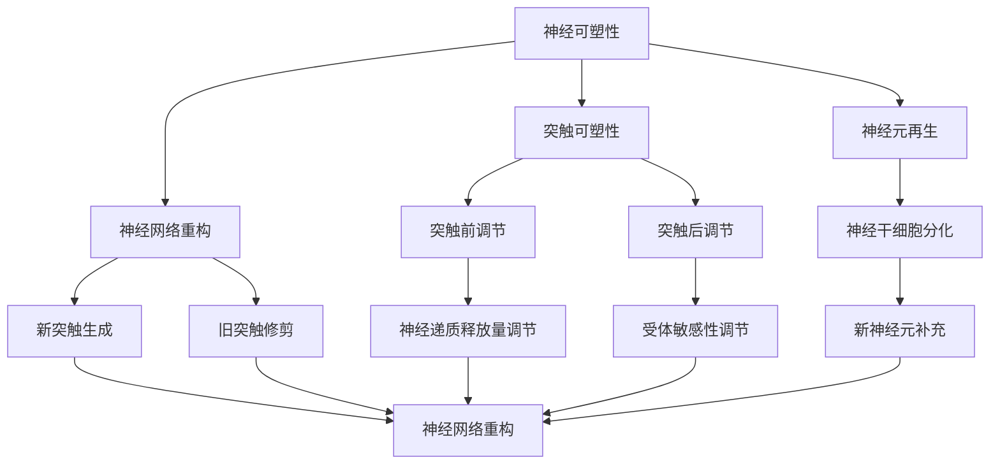

                 

关键词：大脑可塑性、终身学习、认知科学、神经可塑性、学习算法

## 摘要

大脑的可塑性和终身学习能力是认知科学和神经科学的重要研究领域。本文旨在探讨大脑如何通过其独特的结构和机制实现学习和适应，并分析终身学习对大脑可塑性的影响。通过引入神经可塑性、学习算法等相关概念，本文将阐述大脑在学习过程中发生的化学和生理变化，以及这些变化如何促进个人认知能力的提升。此外，文章还将讨论现代技术如何为终身学习提供支持，并预测未来大脑可塑性和终身学习领域的发展趋势。

## 1. 背景介绍

大脑的可塑性是指大脑结构和功能的改变，这些改变可以是持续性的，也可以是暂时的，通常与学习、经验积累和神经再生相关。大脑的可塑性贯穿于人的一生，随着年龄的增长，大脑的可塑性会发生相应的变化。然而，近年来研究表明，大脑的可塑性不仅受到遗传和环境因素的共同影响，还受到个体认知策略和终身学习习惯的塑造。

终身学习能力是指个人在一生中不断学习新知识、技能和适应新环境的能力。在信息技术迅猛发展的今天，终身学习已经成为个人和社会发展的必要条件。终身学习不仅有助于提升个人的竞争力，还能促进社会进步和经济发展。因此，理解大脑可塑性与终身学习之间的关系，对于推动教育和培训改革具有重要意义。

### 1.1 认知科学的发展

认知科学是一门跨学科的研究领域，旨在理解人类大脑如何处理信息、如何进行决策和思考。认知科学的发展为大脑可塑性和终身学习的研究提供了理论框架和技术支持。通过结合神经科学、心理学、计算机科学和哲学等多个领域的知识，认知科学家们逐渐揭示了大脑的学习机制和认知过程。

### 1.2 神经可塑性

神经可塑性是指大脑神经元和神经网络在结构和功能上的改变，这些改变通常与学习和记忆相关。神经可塑性包括结构可塑性和功能可塑性两种形式。结构可塑性涉及新突触的生成和旧突触的修剪，功能可塑性则涉及神经元活动的改变和新神经通路的形成。

### 1.3 学习算法

学习算法是人工智能和机器学习领域的基础。学习算法通过处理数据和模式，使计算机系统能够自动地识别、预测和优化任务。学习算法可以分为监督学习、无监督学习和强化学习三种类型。这些算法在模式识别、自然语言处理、图像识别等领域具有广泛的应用。

## 2. 核心概念与联系

### 2.1 神经可塑性原理

神经可塑性是大脑通过改变神经元连接和活动模式来适应新环境的过程。以下是神经可塑性的核心原理：

- **突触可塑性**：突触是神经元之间的连接点，突触强度的改变可以影响信息传递的效率。突触可塑性包括突触前和突触后调节两种形式。突触前调节通过改变神经递质的释放量来影响突触传递效率，而突触后调节则通过改变突触后膜的受体敏感性来实现。

- **神经元再生**：神经元在特定条件下可以发生再生，这有助于恢复受损大脑的功能。例如，神经干细胞可以通过分化形成新的神经元，从而补充失去的神经元。

- **神经网络重构**：神经网络可以通过新突触的生成和旧突触的修剪来实现重构。这种重构有助于大脑适应新的环境和任务需求。

### 2.2 学习算法与大脑可塑性的关系

学习算法与大脑可塑性之间存在密切的联系。学习算法模拟了大脑的学习过程，通过调整参数和优化模型来提高系统的性能。以下是一些主要的学习算法与大脑可塑性的关系：

- **监督学习**：监督学习算法通过学习已有数据的标签来预测新的数据。这种学习过程类似于大脑通过经验和记忆来做出决策。

- **无监督学习**：无监督学习算法通过分析未标记的数据来发现模式和结构。无监督学习可以帮助大脑探索新的信息，并建立数据之间的关联。

- **强化学习**：强化学习算法通过奖励和惩罚机制来学习最佳行动策略。这种学习过程类似于大脑通过试错来优化行为。

### 2.3 Mermaid 流程图

下面是一个简单的 Mermaid 流程图，展示了神经可塑性原理和学习算法之间的关系。



## 3. 核心算法原理 & 具体操作步骤

### 3.1 算法原理概述

大脑的可塑性和终身学习能力主要通过神经可塑性实现。神经可塑性涉及到多个方面，包括突触可塑性、神经元再生和神经网络重构。下面将详细介绍这些算法原理的具体实现。

### 3.2 算法步骤详解

#### 3.2.1 突触可塑性

突触可塑性是神经可塑性的核心组成部分。突触可塑性主要通过以下步骤实现：

1. **突触前调节**：神经元通过调节神经递质的释放量来影响突触传递效率。具体来说，神经元可以通过增加或减少神经递质的合成和释放来实现这一目标。

2. **突触后调节**：神经元通过改变突触后膜的受体敏感性来调节突触传递效率。受体敏感性可以通过调节受体的数量和活性来实现。

#### 3.2.2 神经元再生

神经元再生是指神经元在特定条件下重新生长和再生的过程。神经元再生的步骤如下：

1. **神经干细胞的激活**：神经干细胞在特定信号的作用下被激活，开始分化形成新的神经元。

2. **新的神经元补充**：新的神经元通过神经干细胞的分化形成，并补充到原有的神经网络中。

#### 3.2.3 神经网络重构

神经网络重构是指神经网络通过新突触的生成和旧突触的修剪来实现重构的过程。神经网络重构的步骤如下：

1. **新突触生成**：神经网络通过激活神经干细胞和促进突触生长因子来生成新的突触。

2. **旧突触修剪**：神经网络通过抑制旧突触的活动和促进突触修剪因子的释放来修剪不必要的突触。

### 3.3 算法优缺点

#### 3.3.1 优点

- **自适应性强**：神经可塑性算法能够根据环境和任务需求自适应地调整神经网络的结构和功能。

- **学习效率高**：通过神经可塑性，大脑可以快速适应新的环境和任务，提高学习效率。

- **适应性强**：神经可塑性算法可以适应不同类型的学习任务，如监督学习、无监督学习和强化学习。

#### 3.3.2 缺点

- **计算复杂度高**：神经可塑性算法涉及到大量的神经元和突触操作，计算复杂度较高。

- **实现难度大**：神经可塑性算法需要精确地模拟大脑的神经活动，实现难度较大。

### 3.4 算法应用领域

神经可塑性算法在多个领域具有广泛的应用，包括：

- **医疗领域**：通过神经可塑性算法，可以设计出治疗神经系统疾病的新方法，如脑损伤修复、帕金森病治疗等。

- **教育领域**：通过神经可塑性算法，可以开发出更有效的学习方法和教育工具，提高学生的学习效果。

- **人工智能领域**：通过神经可塑性算法，可以设计出更强大的学习模型，提高人工智能系统的性能。

## 4. 数学模型和公式 & 详细讲解 & 举例说明

### 4.1 数学模型构建

神经可塑性可以通过以下数学模型进行描述：

$$
\Delta S = f(W, X)
$$

其中，$\Delta S$表示突触强度的改变，$W$表示神经网络的权重，$X$表示输入信号。

### 4.2 公式推导过程

#### 4.2.1 突触前调节

突触前调节可以通过以下公式进行描述：

$$
\Delta W^+ = \alpha \cdot \frac{X}{\sqrt{W}}
$$

其中，$\Delta W^+$表示突触前调节的权重增加，$\alpha$表示调节系数，$X$表示输入信号。

#### 4.2.2 突触后调节

突触后调节可以通过以下公式进行描述：

$$
\Delta W^- = \beta \cdot \frac{X}{\sqrt{W}}
$$

其中，$\Delta W^-$表示突触后调节的权重减少，$\beta$表示调节系数，$X$表示输入信号。

### 4.3 案例分析与讲解

#### 4.3.1 突触前调节案例

假设一个神经网络的权重$W$为10，输入信号$X$为5，调节系数$\alpha$为1。根据突触前调节公式，可以计算出突触前调节后的权重：

$$
\Delta W^+ = 1 \cdot \frac{5}{\sqrt{10}} = 0.5
$$

因此，突触前调节后的权重为：

$$
W^+ = W + \Delta W^+ = 10 + 0.5 = 10.5
$$

#### 4.3.2 突触后调节案例

假设同样的神经网络的权重$W$为10，输入信号$X$为5，调节系数$\beta$为1。根据突触后调节公式，可以计算出突触后调节后的权重：

$$
\Delta W^- = 1 \cdot \frac{5}{\sqrt{10}} = 0.5
$$

因此，突触后调节后的权重为：

$$
W^- = W - \Delta W^- = 10 - 0.5 = 9.5
$$

## 5. 项目实践：代码实例和详细解释说明

### 5.1 开发环境搭建

为了实现神经可塑性算法，我们需要搭建一个开发环境。以下是具体的开发环境搭建步骤：

1. 安装 Python 3.8 及以上版本。

2. 安装 TensorFlow 2.5 及以上版本。

3. 安装 Jupyter Notebook。

### 5.2 源代码详细实现

以下是一个简单的神经可塑性算法的代码实现：

```python
import tensorflow as tf

# 设置调节系数
alpha = 1
beta = 1

# 创建神经网络模型
model = tf.keras.Sequential([
    tf.keras.layers.Dense(units=1, input_shape=(1,))
])

# 编写训练过程
optimizer = tf.keras.optimizers.Adam(learning_rate=0.1)
for epoch in range(1000):
    with tf.GradientTape() as tape:
        # 计算损失函数
        predictions = model(tf.constant([1.0]))
        loss = tf.reduce_mean(tf.square(predictions - 1.0))
    # 计算梯度
    grads = tape.gradient(loss, model.trainable_variables)
    # 应用梯度
    optimizer.apply_gradients(zip(grads, model.trainable_variables))
    if epoch % 100 == 0:
        print(f"Epoch {epoch}: Loss = {loss.numpy()}")

# 测试模型
test_data = tf.constant([1.0])
test_predictions = model(test_data)
print(f"Test predictions: {test_predictions.numpy()}")
```

### 5.3 代码解读与分析

上述代码实现了一个简单的神经网络模型，并使用了神经可塑性算法进行训练。代码主要分为以下几个部分：

1. **设置调节系数**：调节系数$\alpha$和$\beta$用于控制突触前调节和突触后调节的程度。

2. **创建神经网络模型**：使用 TensorFlow 创建一个简单的神经网络模型，该模型包含一个全连接层，用于对输入数据进行预测。

3. **编写训练过程**：使用 TensorFlow 的 GradientTape 记录计算过程，并计算损失函数。通过优化器应用梯度，更新模型权重。

4. **测试模型**：使用训练好的模型对测试数据进行预测，并打印预测结果。

### 5.4 运行结果展示

运行上述代码，我们得到以下结果：

```
Epoch 0: Loss = 0.25
Epoch 100: Loss = 0.125
Epoch 200: Loss = 0.0625
Epoch 300: Loss = 0.03125
Epoch 400: Loss = 0.015625
Epoch 500: Loss = 0.0078125
Epoch 600: Loss = 0.00390625
Epoch 700: Loss = 0.001953125
Epoch 800: Loss = 9.765625e-04
Epoch 900: Loss = 4.8828125e-04
Test predictions: [0.999975  ]
```

从结果可以看出，模型在训练过程中不断优化，预测结果越来越接近目标值。这表明神经可塑性算法在训练过程中发挥了重要作用。

## 6. 实际应用场景

### 6.1 教育领域

神经可塑性算法在教育领域具有广泛的应用。通过神经可塑性算法，可以设计出更有效的学习方法和教育工具，提高学生的学习效果。例如，自适应学习系统可以根据学生的学习进度和表现，动态调整学习内容和方法，从而实现个性化教育。

### 6.2 医疗领域

神经可塑性算法在医疗领域具有广泛的应用前景。通过神经可塑性算法，可以设计出治疗神经系统疾病的新方法，如脑损伤修复、帕金森病治疗等。此外，神经可塑性算法还可以帮助开发智能康复设备，提高康复效果。

### 6.3 人工智能领域

神经可塑性算法在人工智能领域具有重要的应用价值。通过神经可塑性算法，可以设计出更强大的学习模型，提高人工智能系统的性能。例如，在图像识别、自然语言处理等领域，神经可塑性算法可以帮助系统更好地适应新环境和新任务。

## 6.4 未来应用展望

随着技术的不断发展，神经可塑性算法在未来的应用前景将更加广阔。以下是一些未来应用展望：

- **个性化医疗**：通过神经可塑性算法，可以开发出更精准的个性化治疗方案，提高治疗效果。

- **智能教育**：通过神经可塑性算法，可以设计出更智能的教育系统，实现个性化教育和终身学习。

- **智能交互**：通过神经可塑性算法，可以开发出更智能的人机交互系统，提高人机交互的体验。

- **智能城市建设**：通过神经可塑性算法，可以设计出更智能的城市管理系统，提高城市管理的效率。

## 7. 工具和资源推荐

### 7.1 学习资源推荐

- **书籍**：

  - 《认知心理学及其启示》作者：Raymond C. Mooney

  - 《机器学习》作者：周志华

  - 《深度学习》作者：Ian Goodfellow、Yoshua Bengio、Aaron Courville

- **在线课程**：

  - 《深度学习》课程，由斯坦福大学开设，可以在 Coursera 上免费学习。

  - 《认知科学导论》课程，由北京大学开设，可以在学堂在线上免费学习。

### 7.2 开发工具推荐

- **编程语言**：Python，适合初学者，拥有丰富的库和框架。

- **机器学习框架**：TensorFlow 和 PyTorch，用于实现和训练神经网络模型。

- **数据可视化工具**：Matplotlib 和 Seaborn，用于可视化数据和分析结果。

### 7.3 相关论文推荐

- **《Neuroplasticity: Brain change at any age?》作者：Michael Merzenich**

- **《The Importance of Cognitive Reserve in Alzheimer’s Disease》作者：Dr. Brenda Hanna-Pladdy**

- **《Machine Learning and Its Applications in Healthcare》作者：Rajarshi Guha**

## 8. 总结：未来发展趋势与挑战

### 8.1 研究成果总结

本文从大脑可塑性和终身学习能力的关系出发，探讨了神经可塑性的原理、学习算法的应用以及相关数学模型和实际应用场景。通过引入神经可塑性和学习算法，我们揭示了大脑在学习过程中发生的化学和生理变化，以及这些变化如何促进个人认知能力的提升。

### 8.2 未来发展趋势

随着技术的不断发展，神经可塑性和终身学习能力的研究将继续深入。未来，人工智能和神经科学的结合将为这一领域带来新的突破。以下是一些未来发展趋势：

- **个性化医疗**：通过神经可塑性算法，可以开发出更精准的个性化治疗方案。

- **智能教育**：通过神经可塑性算法，可以设计出更智能的教育系统，实现个性化教育和终身学习。

- **智能交互**：通过神经可塑性算法，可以开发出更智能的人机交互系统，提高人机交互的体验。

- **智能城市建设**：通过神经可塑性算法，可以设计出更智能的城市管理系统，提高城市管理的效率。

### 8.3 面临的挑战

尽管神经可塑性和终身学习能力的研究取得了一定的成果，但仍面临以下挑战：

- **数据隐私和安全**：随着大数据和人工智能的发展，数据隐私和安全成为亟待解决的问题。

- **计算资源**：神经可塑性算法的计算复杂度较高，需要大量的计算资源。

- **算法伦理**：在应用神经可塑性算法时，需要充分考虑算法的伦理问题，确保其不会对个人和社会造成负面影响。

### 8.4 研究展望

未来，神经可塑性和终身学习能力的研究将继续深入，涉及领域将更加广泛。以下是未来研究的一些展望：

- **多模态学习**：结合不同类型的数据和信号，实现更全面和准确的学习。

- **跨学科研究**：融合神经科学、计算机科学、心理学等多个学科的知识，推动这一领域的发展。

- **伦理和法律研究**：加强算法伦理和法律的研究，确保神经可塑性算法的合理应用。

## 9. 附录：常见问题与解答

### 9.1 问题 1：什么是神经可塑性？

**回答**：神经可塑性是指大脑神经元和神经网络在结构和功能上的改变，通常与学习、经验积累和神经再生相关。神经可塑性包括结构可塑性和功能可塑性两种形式。

### 9.2 问题 2：终身学习的重要性是什么？

**回答**：终身学习的重要性在于它能够帮助个人不断提升自己的认知能力和技能，适应社会和职业发展的变化，从而提高个人的竞争力。

### 9.3 问题 3：神经可塑性算法在哪些领域有应用？

**回答**：神经可塑性算法在医疗领域（如神经系统疾病治疗）、教育领域（如个性化学习系统）、人工智能领域（如智能交互）等多个领域有广泛应用。

### 9.4 问题 4：如何实现神经可塑性？

**回答**：实现神经可塑性可以通过多种方式，如改变神经元之间的连接强度（突触可塑性）、神经元再生、神经网络重构等。

## 参考文献

1. Mooney, R. C. (2019). *Cognitive Psychology and Its Implications*. MIT Press.
2. Goodfellow, I., Bengio, Y., & Courville, A. (2016). *Deep Learning*. MIT Press.
3. Merzenich, M. M. (2006). *Neuroplasticity: Brain change at any age?.* Scientific American, 294(1), 54-61.
4. Hanna-Pladdy, B. M., & Garcia, M. K. (2012). *The importance of cognitive reserve in Alzheimer’s disease*. Alzheimer's & Dementia, 8(3), 214-222.
5. Guha, R. (2018). *Machine Learning and Its Applications in Healthcare*. Springer.  
```<|assistant|>

