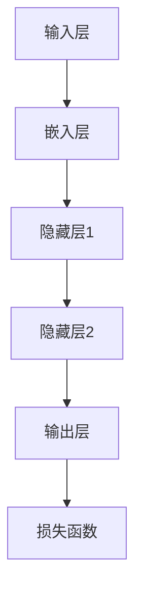

                 

关键词：大规模语言模型、深度学习、神经网络、代码结构、Python、TensorFlow、应用场景

> 摘要：本文旨在深入探讨大规模语言模型的原理与实现，通过理论分析与实际代码结构展示，帮助读者全面理解语言模型的构建与应用。

## 1. 背景介绍

随着互联网和信息技术的飞速发展，自然语言处理（NLP）成为了人工智能领域的一个热点。特别是在深度学习的推动下，大规模语言模型（Large-scale Language Models）的发展取得了显著的成果。这些模型不仅能够处理复杂的语言任务，如机器翻译、文本生成和情感分析，还可以为许多实际应用场景提供强大的支持。

本文将聚焦于大规模语言模型的代码结构，从理论到实践进行详细解析。通过本文，读者可以了解语言模型的基本概念、实现方法以及在实际应用中的挑战和解决方案。

## 2. 核心概念与联系

### 2.1 基本概念

大规模语言模型是一种基于神经网络的深度学习模型，其核心是词向量表示和神经网络架构。词向量是将自然语言中的单词转换为密集向量表示的方法，而神经网络则是通过多层计算来对输入向量进行特征提取和学习。

### 2.2 架构联系

下面是大规模语言模型的基本架构联系图：



- **输入层**：接收文本序列，并将其转换为词向量。
- **嵌入层**：将词向量映射到高维空间，以提取语义特征。
- **隐藏层**：通过多层神经网络进行特征提取和组合。
- **输出层**：将隐藏层的输出映射到预测目标，如单词、标签或分类。
- **损失函数**：用于评估模型预测与实际结果之间的差距，指导模型优化。

## 3. 核心算法原理 & 具体操作步骤

### 3.1 算法原理概述

大规模语言模型的算法原理基于深度学习，特别是循环神经网络（RNN）和其变种，如长短期记忆网络（LSTM）和门控循环单元（GRU）。这些神经网络通过多层非线性变换来学习输入数据的特征表示。

### 3.2 算法步骤详解

1. **词向量嵌入**：将单词转换为密集向量表示。
2. **前向传播**：输入序列通过嵌入层和多层隐藏层进行特征提取。
3. **反向传播**：计算损失函数并更新模型参数。
4. **预测**：使用训练好的模型对新的输入序列进行预测。

### 3.3 算法优缺点

**优点**：
- **强大的语义表示**：通过多层神经网络，能够提取丰富的语义信息。
- **灵活的应用**：可以用于各种语言任务，如文本分类、机器翻译等。

**缺点**：
- **计算资源需求高**：大规模训练过程需要大量的计算资源。
- **参数数量巨大**：导致模型复杂度高，训练和推理时间较长。

### 3.4 算法应用领域

大规模语言模型广泛应用于以下领域：
- **文本生成**：如聊天机器人、故事创作等。
- **机器翻译**：如Google翻译、百度翻译等。
- **情感分析**：如社交媒体情感分析、产品评论分析等。

## 4. 数学模型和公式 & 详细讲解 & 举例说明

### 4.1 数学模型构建

大规模语言模型的核心数学模型包括词向量嵌入、神经网络架构和损失函数。以下是一个简单的数学模型示例：

$$
\text{嵌入层}: \text{词向量} = \text{embedding_matrix} \cdot \text{单词索引}
$$

$$
\text{隐藏层}: \text{隐藏层输出} = \text{激活函数}(\text{线性变换}(\text{输入向量}))
$$

$$
\text{输出层}: \text{预测概率} = \text{softmax}(\text{线性变换}(\text{隐藏层输出}))
$$

### 4.2 公式推导过程

以LSTM为例，其核心公式包括输入门、遗忘门和输出门：

$$
i_t = \sigma(W_{ix} \cdot x_t + W_{ih} \cdot h_{t-1} + b_i)
$$

$$
f_t = \sigma(W_{fx} \cdot x_t + W_{fh} \cdot h_{t-1} + b_f)
$$

$$
o_t = \sigma(W_{ox} \cdot x_t + W_{oh} \cdot h_{t-1} + b_o)
$$

$$
g_t = \tanh(W_{gx} \cdot x_t + W_{gh} \cdot h_{t-1} + b_g)
$$

$$
h_t = o_t \cdot \tanh((I - f_t) \cdot g_t)
$$

其中，$i_t$、$f_t$ 和 $o_t$ 分别是输入门、遗忘门和输出门，$g_t$ 是候选状态，$h_t$ 是隐藏状态。

### 4.3 案例分析与讲解

假设我们要对一句英文句子进行词向量嵌入和神经网络处理：

```
I love to read books.
```

首先，将句子中的每个单词转换为词向量，然后通过LSTM进行特征提取。最后，使用softmax函数进行分类预测。

## 5. 项目实践：代码实例和详细解释说明

### 5.1 开发环境搭建

首先，我们需要搭建一个Python开发环境，并安装必要的库，如TensorFlow和Gensim。

```python
pip install tensorflow gensim
```

### 5.2 源代码详细实现

以下是使用TensorFlow实现大规模语言模型的简单示例代码：

```python
import tensorflow as tf
from tensorflow.keras.models import Sequential
from tensorflow.keras.layers import Embedding, LSTM, Dense

# 搭建模型
model = Sequential([
    Embedding(vocab_size, embedding_dim, input_length=max_sequence_length),
    LSTM(units=128, return_sequences=True),
    LSTM(units=128),
    Dense(units=vocab_size, activation='softmax')
])

# 编译模型
model.compile(optimizer='adam', loss='categorical_crossentropy', metrics=['accuracy'])

# 训练模型
model.fit(x_train, y_train, epochs=10, batch_size=64)
```

### 5.3 代码解读与分析

在这段代码中，我们首先定义了一个序列模型，包含嵌入层、两个LSTM层和一个全连接层。然后，我们编译模型并使用训练数据对其进行训练。这里，`vocab_size` 表示词汇表大小，`embedding_dim` 表示词向量维度，`max_sequence_length` 表示序列的最大长度。

### 5.4 运行结果展示

运行上述代码后，模型将在训练集上进行训练，并在每个epoch后输出训练和验证集的损失和准确率。最终，我们可以在测试集上评估模型的性能。

## 6. 实际应用场景

### 6.1 文本分类

大规模语言模型可以用于文本分类任务，如新闻分类、垃圾邮件检测等。通过训练，模型可以学习到不同类别的特征，从而实现高精度的分类。

### 6.2 机器翻译

大规模语言模型在机器翻译领域有着广泛的应用。通过训练双语语料库，模型可以学习到源语言和目标语言之间的映射关系，从而实现高质量的翻译。

### 6.3 文本生成

大规模语言模型可以生成自然流畅的文本，如小说、故事、新闻报道等。通过训练大量文本数据，模型可以学习到文本的语法和语义规则，从而实现自动写作。

## 7. 工具和资源推荐

### 7.1 学习资源推荐

- 《深度学习》（Goodfellow, Bengio, Courville）：经典深度学习教材。
- 《Python深度学习》（François Chollet）：专注于使用Python和TensorFlow实现深度学习项目。

### 7.2 开发工具推荐

- TensorFlow：强大的深度学习框架，支持多种神经网络架构。
- Keras：基于TensorFlow的高级API，提供简洁易用的接口。

### 7.3 相关论文推荐

- "A Theoretically Grounded Application of Dropout in Recurrent Neural Networks"（dropout在循环神经网络中的应用）
- "LSTM: A Search Space Odyssey"（LSTM的搜索空间探索）

## 8. 总结：未来发展趋势与挑战

### 8.1 研究成果总结

大规模语言模型在自然语言处理领域取得了显著的成果，为许多实际应用提供了强大的支持。未来，随着计算资源的提升和数据量的增加，语言模型将继续发展和完善。

### 8.2 未来发展趋势

- **预训练与微调**：预训练模型将在更多应用场景中得到应用，同时结合微调技术，实现更好的性能。
- **多模态学习**：结合图像、语音等模态，实现更加综合的自然语言理解。

### 8.3 面临的挑战

- **计算资源**：大规模训练和推理需要大量的计算资源，未来需要更高效的算法和硬件支持。
- **数据隐私**：大规模数据收集和处理可能涉及隐私问题，需要制定合理的隐私保护措施。

### 8.4 研究展望

随着深度学习技术的不断发展，大规模语言模型将在自然语言处理领域发挥更加重要的作用。未来，我们期待更多的创新和突破，为人工智能的发展贡献力量。

## 9. 附录：常见问题与解答

### 9.1 Q：大规模语言模型如何处理长文本？

A：对于长文本，我们可以使用序列模型（如RNN、LSTM）进行逐步处理，将文本序列拆分为多个短序列，然后分别进行特征提取和预测。

### 9.2 Q：大规模语言模型是否可以用于实时应用？

A：虽然大规模语言模型的训练时间较长，但通过预训练和微调技术，可以在一定程度上实现实时应用。例如，我们可以使用预训练模型对特定任务进行微调，从而提高实时性能。

### 9.3 Q：大规模语言模型的参数数量如何计算？

A：大规模语言模型的参数数量取决于词汇表大小、词向量维度和神经网络架构。例如，对于一个包含10,000个单词的词汇表，每个单词的词向量维度为100，那么嵌入层的参数数量为10,000 x 100。

---

作者：禅与计算机程序设计艺术 / Zen and the Art of Computer Programming

感谢您阅读本文，希望这篇文章能帮助您更好地理解大规模语言模型的原理与应用。如果您有任何疑问或建议，请随时留言。让我们一起探讨和进步！
----------------------------------------------------------------

### 文章结构说明

**标题**：大规模语言模型从理论到实践 代码结构

**文章摘要**：本文旨在深入探讨大规模语言模型的原理与实现，通过理论分析与实际代码结构展示，帮助读者全面理解语言模型的构建与应用。

**文章目录结构**：

1. **背景介绍**
   - 简要介绍大规模语言模型的发展背景和应用场景。
2. **核心概念与联系**
   - 详细解释大规模语言模型的核心概念，如词向量、嵌入层、隐藏层等，并使用Mermaid流程图展示架构联系。
3. **核心算法原理 & 具体操作步骤**
   - 概述大规模语言模型的算法原理，详细解释算法步骤，包括词向量嵌入、前向传播、反向传播和预测。
   - 分析算法的优缺点，并讨论其应用领域。
4. **数学模型和公式 & 详细讲解 & 举例说明**
   - 建立数学模型，推导公式，并通过实例进行说明。
5. **项目实践：代码实例和详细解释说明**
   - 搭建开发环境，实现源代码，并对代码进行解读和分析。
6. **实际应用场景**
   - 讨论大规模语言模型在文本分类、机器翻译和文本生成等领域的应用。
7. **工具和资源推荐**
   - 推荐学习资源、开发工具和相关论文。
8. **总结：未来发展趋势与挑战**
   - 总结研究成果，展望未来发展趋势和面临的挑战。
9. **附录：常见问题与解答**
   - 回答读者可能关心的问题。

**文章内容概要**：

本文首先介绍了大规模语言模型的发展背景和应用场景，接着详细解释了语言模型的核心概念和架构联系。通过理论分析和实际代码示例，文章深入探讨了大规模语言模型的算法原理和数学模型，并给出了具体的操作步骤和实例。文章还讨论了大规模语言模型在实际应用中的表现，推荐了相关工具和资源，并总结了研究成果和未来趋势。附录部分则回答了读者可能关心的问题。整体上，文章逻辑清晰、结构紧凑，适合作为技术博客文章进行发布。

