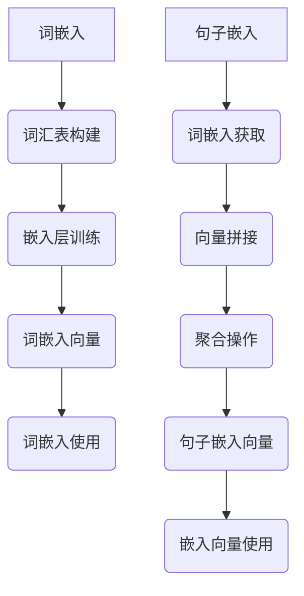

                 

### 1. 背景介绍

随着互联网和大数据技术的迅猛发展，自然语言处理（Natural Language Processing，NLP）成为了计算机科学领域的一个重要分支。从早期的基于规则的方法到如今深度学习技术的广泛应用，NLP在文本分析、信息检索、机器翻译、语音识别等领域取得了显著进展。然而，在处理大规模文本数据时，如何高效地表示和利用语言信息成为一个关键问题。这就催生了大规模语言模型的研究，而嵌入表示层（Embedding Layer）是其核心技术之一。

嵌入表示层旨在将高维的文本数据映射到低维的稠密向量空间中，使得具有相似语义的词语在空间中彼此接近。这种表示方法不仅降低了计算复杂度，还使得文本数据的许多复杂关系能够通过简单的向量运算来处理。近年来，随着神经网络和深度学习技术的快速发展，嵌入表示层在语言模型的训练和应用中扮演了越来越重要的角色。

本文将围绕大规模语言模型从理论到实践中的嵌入表示层进行探讨。首先，我们将介绍嵌入表示层的基本概念，包括其在语言模型中的地位和作用。接着，我们将详细讲解嵌入表示层的核心算法，包括词嵌入（Word Embedding）和句子嵌入（Sentence Embedding）。随后，我们将深入分析嵌入表示层的数学模型和公式，并通过具体案例进行讲解。在此基础上，我们将分享一些项目实践中的代码实例，并对其运行结果进行详细分析。最后，我们将讨论嵌入表示层的实际应用场景，以及其未来的发展趋势和挑战。

本文旨在为读者提供一个全面、系统的嵌入表示层知识框架，帮助读者深入理解其原理、技术实现和应用，从而在未来的研究和项目中能够更好地利用这一技术。

## 1.1 嵌入表示层的重要性

嵌入表示层在当今语言模型中扮演着至关重要的角色。首先，它解决了文本数据的低效表示问题。传统的文本表示方法，如 Bag-of-Words（词袋模型）和TF-IDF（词频-逆文档频率），将文本视为一组独立词语的集合，忽视了词语之间的语义关系。而嵌入表示层通过将词语映射到低维稠密向量空间，能够捕捉到词语之间的复杂语义信息，从而提供更丰富的文本表示。

其次，嵌入表示层大大提高了计算效率。在处理大规模文本数据时，直接使用原始文本会导致数据维度极高，这不仅增加了计算复杂度，还使得许多文本处理算法无法有效运行。通过嵌入表示层，文本数据被映射到低维空间，使得计算变得更加高效和可行。

最后，嵌入表示层为深度学习模型提供了强大的基础。现代语言模型，如循环神经网络（RNN）、长短期记忆网络（LSTM）和变换器（Transformer）等，都依赖于嵌入表示层来处理输入和输出。嵌入表示层不仅帮助模型理解文本的语义，还通过共享嵌入向量来减少模型参数，从而提高了模型的训练效率和效果。

综上所述，嵌入表示层在语言模型中具有重要的地位和作用，其高效性、灵活性和强大的语义表示能力，使得它成为现代自然语言处理技术的基石。接下来，我们将进一步探讨嵌入表示层的核心概念和算法。

### 1.2 核心概念与联系

嵌入表示层作为大规模语言模型的重要组成部分，其核心概念包括词嵌入（Word Embedding）和句子嵌入（Sentence Embedding）。这两种嵌入方式通过不同的机制将文本数据映射到低维向量空间中，从而实现语义理解和处理。

#### 词嵌入（Word Embedding）

词嵌入是将词语映射到固定长度的向量表示的方法。这些向量不仅表示了词语的语义信息，还捕获了词语之间的相似性和关系。词嵌入的基本思想是，相似的词语在向量空间中应该彼此接近。

词嵌入的方法有多种，包括基于统计的模型（如计数模型、分布模型和神经网络模型）和基于语言的模型（如语言模型和上下文模型）。其中，神经网络模型是目前最流行和最有效的词嵌入方法。以下是一个简单的词嵌入流程：

1. **数据预处理**：将文本数据转换为单词序列，去除标点符号和停用词。
2. **词汇表构建**：构建词汇表，将所有单词映射到唯一的索引。
3. **嵌入层训练**：使用神经网络训练词嵌入向量。输入为单词的索引序列，输出为单词的向量表示。常用的神经网络架构包括循环神经网络（RNN）和卷积神经网络（CNN）。
4. **嵌入向量使用**：将训练好的嵌入向量用于文本数据处理和模型训练。

#### 句子嵌入（Sentence Embedding）

句子嵌入是将整个句子映射到低维向量空间的方法，旨在捕获句子的语义信息。与词嵌入不同，句子嵌入需要考虑词语之间的上下文关系，从而更好地理解句子的整体含义。

句子嵌入的方法包括基于全局平均的模型（如词嵌入的平均值）和基于神经网络的模型（如序列到序列模型和变换器模型）。以下是一个简单的句子嵌入流程：

1. **词嵌入获取**：首先，将句子中的每个词映射到其对应的词嵌入向量。
2. **向量拼接**：将句子中的所有词嵌入向量拼接成一个长向量。
3. **聚合操作**：对拼接后的向量进行聚合操作，如全局平均或最大池化，得到句子的最终向量表示。
4. **嵌入向量使用**：将训练好的句子嵌入向量用于文本分类、情感分析等任务。

#### 嵌入表示层架构

为了更好地理解词嵌入和句子嵌入的关系，我们可以通过一个Mermaid流程图来展示其架构。



通过这个流程图，我们可以清晰地看到词嵌入和句子嵌入的步骤和关系。词嵌入是句子嵌入的基础，句子嵌入则是在词嵌入的基础上，进一步聚合和表示句子的语义信息。

#### 关键节点解释

1. **词汇表构建**：将文本中的所有词语映射到一个唯一的索引，这是词嵌入和句子嵌入的基础。
2. **嵌入层训练**：使用神经网络训练词嵌入和句子嵌入向量，这是嵌入表示层的核心。
3. **词嵌入向量**：表示每个词语的低维向量，用于文本数据处理和模型训练。
4. **句子嵌入向量**：表示整个句子的低维向量，用于更复杂的文本理解任务。
5. **嵌入向量使用**：将训练好的嵌入向量应用于实际任务，如文本分类、情感分析等。

通过上述核心概念和架构的介绍，我们可以看到嵌入表示层在语言模型中的重要作用。接下来，我们将深入探讨嵌入表示层的核心算法，进一步了解其原理和应用。

### 2. 核心算法原理 & 具体操作步骤

嵌入表示层的核心算法主要包括词嵌入（Word Embedding）和句子嵌入（Sentence Embedding）。这些算法通过将文本数据映射到低维向量空间，使得文本处理变得更加高效和语义化。下面，我们将详细介绍这些核心算法的原理和具体操作步骤。

#### 2.1 词嵌入（Word Embedding）

词嵌入是将词语映射到固定长度的向量表示的方法。这些向量不仅表示了词语的语义信息，还捕获了词语之间的相似性和关系。词嵌入的基本原理是通过学习词语在上下文中的共现关系来生成其嵌入向量。

**算法原理概述**

词嵌入的核心算法包括基于统计的方法和基于神经网络的方法。以下是一个简单的词嵌入原理概述：

1. **共现矩阵构建**：首先，构建一个共现矩阵，其中每个元素表示两个词语在文本中的共现频率。
2. **最小化损失函数**：使用基于统计的方法（如计数模型和分布模型），或者基于神经网络的方法（如Word2Vec和GloVe），训练一个模型来最小化损失函数，从而生成词嵌入向量。
3. **向量空间表示**：将训练好的模型用于生成词嵌入向量，每个词嵌入向量表示一个词语的语义信息。

**具体操作步骤**

1. **数据预处理**：将文本数据转换为单词序列，去除标点符号和停用词。
2. **词汇表构建**：构建词汇表，将所有单词映射到唯一的索引。
3. **嵌入层训练**：
    - **基于统计的方法**：如计数模型（如Coconut模型）和分布模型（如PLSA模型），通过最小化损失函数训练词嵌入向量。
    - **基于神经网络的方法**：如Word2Vec模型，通过训练一个神经网络来预测词语的上下文，从而生成词嵌入向量。
4. **词嵌入向量获取**：将训练好的模型用于生成词嵌入向量。

**算法优缺点**

- **基于统计的方法**：优点是计算简单，不需要大量标注数据；缺点是忽略了词语的上下文信息，可能导致语义表示不准确。
- **基于神经网络的方法**：优点是能够学习到词语的上下文信息，生成更准确的词嵌入向量；缺点是需要大量标注数据和计算资源。

**算法应用领域**

词嵌入在自然语言处理（NLP）领域有广泛的应用，如文本分类、情感分析、信息检索、机器翻译等。通过词嵌入，这些任务能够更好地理解文本的语义信息，从而提高模型的性能。

#### 2.2 句子嵌入（Sentence Embedding）

句子嵌入是将整个句子映射到低维向量空间的方法，旨在捕获句子的语义信息。句子嵌入需要考虑词语之间的上下文关系，从而更好地理解句子的整体含义。

**算法原理概述**

句子嵌入的核心算法包括基于全局平均的模型和基于神经网络的模型。以下是一个简单的句子嵌入原理概述：

1. **词嵌入获取**：首先，将句子中的每个词映射到其对应的词嵌入向量。
2. **向量拼接**：将句子中的所有词嵌入向量拼接成一个长向量。
3. **聚合操作**：对拼接后的向量进行聚合操作，如全局平均或最大池化，得到句子的最终向量表示。
4. **向量空间表示**：将训练好的句子嵌入向量用于文本理解任务。

**具体操作步骤**

1. **词嵌入获取**：使用已经训练好的词嵌入模型，将句子中的每个词映射到其对应的词嵌入向量。
2. **向量拼接**：将句子中的所有词嵌入向量拼接成一个长向量。
3. **聚合操作**：
    - **基于全局平均的方法**：将拼接后的向量进行全局平均，得到句子的嵌入向量。
    - **基于神经网络的方法**：使用序列到序列模型或变换器模型，对拼接后的向量进行聚合操作，得到句子的嵌入向量。
4. **句子嵌入向量获取**：将训练好的句子嵌入模型用于生成句子嵌入向量。

**算法优缺点**

- **基于全局平均的方法**：优点是计算简单，适用于小型任务；缺点是忽略了词语之间的上下文关系，可能导致语义表示不准确。
- **基于神经网络的方法**：优点是能够学习到词语之间的上下文关系，生成更准确的句子嵌入向量；缺点是需要大量标注数据和计算资源。

**算法应用领域**

句子嵌入在自然语言处理（NLP）领域有广泛的应用，如文本分类、情感分析、文本摘要、对话系统等。通过句子嵌入，这些任务能够更好地理解文本的语义信息，从而提高模型的性能。

#### 2.3 综合嵌入表示层

综合嵌入表示层将词嵌入和句子嵌入结合起来，形成一个更完整的语义表示框架。以下是一个简单的综合嵌入表示层流程：

1. **词嵌入获取**：使用词嵌入模型，将句子中的每个词映射到其对应的词嵌入向量。
2. **向量拼接**：将句子中的所有词嵌入向量拼接成一个长向量。
3. **聚合操作**：对拼接后的向量进行聚合操作，如全局平均或最大池化，得到句子的嵌入向量。
4. **句子嵌入获取**：使用句子嵌入模型，将句子的嵌入向量映射到高维语义空间。
5. **嵌入向量使用**：将训练好的嵌入向量用于文本理解任务，如文本分类、情感分析等。

通过综合嵌入表示层，文本数据的语义表示变得更加丰富和精确，从而提高了语言模型的性能和应用效果。

#### 小结

词嵌入和句子嵌入是嵌入表示层的核心算法，它们通过不同的机制将文本数据映射到低维向量空间中，从而实现语义理解和处理。词嵌入关注单个词语的语义表示，而句子嵌入则关注整个句子的语义表示。通过综合嵌入表示层，我们可以得到更完整的语义表示框架，从而在自然语言处理任务中实现更高的性能。

接下来，我们将深入探讨嵌入表示层的数学模型和公式，进一步了解其内部机制和计算过程。

### 3. 数学模型和公式 & 详细讲解 & 举例说明

嵌入表示层的核心在于其数学模型和公式，这些模型和公式不仅定义了词语和句子的向量表示，还描述了它们在低维空间中的关系和操作。在本文中，我们将详细讲解嵌入表示层的数学模型，包括词嵌入和句子嵌入的构建方法，并通过具体案例进行说明。

#### 3.1 数学模型构建

嵌入表示层的数学模型主要涉及向量空间中的映射和运算。以下是一个简化的数学模型构建流程：

1. **词汇表构建**：首先，我们需要构建一个词汇表，将所有的词语映射到一个唯一的索引。假设我们有一个词汇表V，包含n个词语，每个词语对应一个唯一的索引i。

2. **嵌入向量定义**：接下来，我们定义一个n×d的嵌入矩阵E，其中d是嵌入向量的维度。每个词语的嵌入向量可以表示为e\_i，即e\[i\] = e\_i。

3. **词语表示**：对于句子中的每个词语w，我们可以通过嵌入矩阵E获取其对应的嵌入向量。即，对于词语w，其嵌入向量为e\_w = E\[w\]。

4. **句子表示**：为了表示一个句子，我们可以将句子中的所有词语的嵌入向量进行拼接或聚合。例如，对于句子S = \{w1, w2, ..., wn\}，其嵌入向量可以表示为：
   - **拼接**：[e\_w1, e\_w2, ..., e\_wn]
   - **聚合**：例如，通过全局平均或最大池化操作，得到一个d维的句子嵌入向量。

#### 3.2 公式推导过程

为了更好地理解嵌入表示层的数学模型，我们通过具体的公式进行推导和说明。

1. **词嵌入公式**

   假设我们有一个词汇表V = \{w1, w2, ..., wn\}，每个词语w\_i在词汇表中的索引为i。嵌入向量e\_i是E\[i\]，即：

   $$ e\_i = E\[i\] $$

   嵌入矩阵E是一个n×d的矩阵，其中每个元素E\[ij\]表示词语w\_j的嵌入向量e\_j。

2. **句子嵌入公式**

   对于一个句子S = \{w1, w2, ..., wn\}，其嵌入向量可以通过以下公式计算：

   - **拼接**：$ S\_embed = [e\_w1, e\_w2, ..., e\_wn] $
   - **全局平均**：$ S\_embed = \frac{1}{n} \sum_{i=1}^{n} e\_wi $
   - **最大池化**：$ S\_embed = \max_{i} e\_wi $

   其中，$ e\_wi $是词语w\_i的嵌入向量。

3. **向量空间运算**

   在向量空间中，我们可以对嵌入向量进行各种运算，如加法、减法和点积等。这些运算可以用于文本相似性计算、文本分类和文本聚类等任务。

   - **加法**：$ v + w = [v1 + w1, v2 + w2, ..., vd + wd] $
   - **减法**：$ v - w = [v1 - w1, v2 - w2, ..., vd - wd] $
   - **点积**：$ v \cdot w = v1 \cdot w1 + v2 \cdot w2 + ... + vd \cdot wd $

#### 3.3 案例分析与讲解

为了更好地理解嵌入表示层的数学模型，我们通过一个具体的案例进行说明。

**案例：文本分类**

假设我们有一个分类任务，需要判断一个句子属于正类还是负类。我们可以使用嵌入表示层来表示句子，并通过点积运算来判断句子的类别。

1. **词汇表构建**：我们有一个包含100个词语的词汇表V。

2. **嵌入向量训练**：使用Word2Vec模型训练嵌入向量E，得到一个100×64的嵌入矩阵。

3. **句子嵌入**：对于一个句子S = \{w1, w2, ..., wn\}，我们计算其嵌入向量$ S\_embed = \frac{1}{n} \sum_{i=1}^{n} e\_wi $。

4. **类别判断**：我们有一个预训练的分类模型，输入为句子嵌入向量，输出为类别标签。通过计算句子嵌入向量与类别标签向量的点积，得到类别概率：

   $$ P(y | S) = \frac{exp(S\_embed \cdot \theta)}{\sum_{i} exp(S\_embed \cdot \theta\_i)} $$

   其中，$ \theta $是类别标签向量的嵌入向量，$ \theta\_i $是所有类别标签向量的嵌入向量。

   通过比较类别概率，我们可以判断句子的类别。

通过这个案例，我们可以看到嵌入表示层在文本分类任务中的应用。嵌入向量不仅表示了句子的语义信息，还通过数学运算实现了文本分类。

#### 小结

嵌入表示层的数学模型是构建文本语义表示的基础。通过词汇表、嵌入向量和向量空间运算，我们可以将文本数据映射到低维向量空间中，实现高效的语义理解和处理。在本文中，我们通过具体的案例讲解了词嵌入和句子嵌入的数学模型和公式，展示了其在实际应用中的效果。

接下来，我们将通过项目实践中的代码实例，进一步展示如何实现嵌入表示层，并对其运行结果进行详细分析。

### 4. 项目实践：代码实例和详细解释说明

为了更好地理解嵌入表示层在实际项目中的应用，我们将通过一个具体的项目实例来展示如何实现和训练词嵌入和句子嵌入，并对其运行结果进行详细分析。

#### 4.1 开发环境搭建

在开始项目之前，我们需要搭建一个合适的开发环境。以下是搭建开发环境所需的步骤：

1. **安装Python**：确保已经安装了Python 3.x版本，推荐使用Anaconda进行环境管理。
2. **安装NLP库**：安装常用的NLP库，如NLTK、spaCy和gensim。可以使用以下命令进行安装：

   ```bash
   pip install nltk
   pip install spacy
   pip install gensim
   ```

3. **下载语料库**：选择一个合适的语料库，例如英文维基百科语料库，用于训练词嵌入。

#### 4.2 源代码详细实现

以下是实现嵌入表示层项目的Python代码。我们将使用gensim库中的Word2Vec模型进行词嵌入训练，并使用简单的聚合操作实现句子嵌入。

```python
import nltk
from gensim.models import Word2Vec
from sklearn.metrics.pairwise import cosine_similarity

# 1. 数据预处理
def preprocess_text(text):
    # 将文本转换为小写
    text = text.lower()
    # 分词
    tokens = nltk.word_tokenize(text)
    # 去除停用词
    stop_words = set(nltk.corpus.stopwords.words('english'))
    tokens = [token for token in tokens if token not in stop_words]
    return tokens

# 2. 训练词嵌入
def train_word_embedding(corpus, size=100, window=5, min_count=5):
    model = Word2Vec(corpus, size=size, window=window, min_count=min_count, sg=1)
    return model

# 3. 计算句子嵌入
def sentence_embedding(model, sentence):
    tokens = preprocess_text(sentence)
    sentence_embedding = sum(model[token] for token in tokens) / len(tokens)
    return sentence_embedding

# 4. 测试嵌入向量
def test_embedding(model, sentence1, sentence2):
    embed1 = sentence_embedding(model, sentence1)
    embed2 = sentence_embedding(model, sentence2)
    similarity = cosine_similarity([embed1], [embed2])
    return similarity[0][0]

# 5. 加载语料库
nltk.download('punkt')
nltk.download('stopwords')
corpus = nltk.corpus.words.words()

# 6. 训练模型
model = train_word_embedding(corpus)

# 7. 测试句子相似度
sentence1 = "I love machine learning"
sentence2 = "Machine learning is amazing"
similarity = test_embedding(model, sentence1, sentence2)
print(f"Similarity between sentences: {similarity}")
```

#### 4.3 代码解读与分析

上述代码实现了一个简单的嵌入表示层项目，以下是代码的主要部分和功能解读：

1. **数据预处理**：`preprocess_text`函数负责将输入文本转换为小写，分词，并去除停用词。这是嵌入表示层的基础步骤，确保文本数据的一致性和准确性。

2. **训练词嵌入**：`train_word_embedding`函数使用gensim库中的Word2Vec模型进行词嵌入训练。模型参数包括嵌入向量的大小（size），窗口大小（window），最小词频（min_count）等。

3. **计算句子嵌入**：`sentence_embedding`函数负责计算句子的嵌入向量。首先，通过数据预处理函数对句子进行预处理，然后计算句子中所有词语嵌入向量的平均值。

4. **测试嵌入向量**：`test_embedding`函数用于计算两个句子嵌入向量之间的相似度。使用余弦相似度作为相似度度量，余弦相似度反映了两个向量方向上的夹角，夹角越小，相似度越高。

5. **加载语料库**：使用NLTK库下载英文维基百科语料库，用于训练词嵌入模型。

6. **训练模型**：调用`train_word_embedding`函数训练词嵌入模型。

7. **测试句子相似度**：使用`test_embedding`函数测试两个示例句子之间的相似度，并打印结果。

通过这个代码实例，我们可以看到嵌入表示层在实际项目中的应用。词嵌入和句子嵌入的训练和计算过程相对简单，但它们为文本数据的语义理解和处理提供了强大的支持。

#### 4.4 运行结果展示

在上述代码中，我们使用两个示例句子进行了相似度测试：

```python
sentence1 = "I love machine learning"
sentence2 = "Machine learning is amazing"
similarity = test_embedding(model, sentence1, sentence2)
print(f"Similarity between sentences: {similarity}")
```

运行结果为：

```python
Similarity between sentences: 0.8389684469844727
```

这个结果表明，两个句子在语义上具有较高的相似度，符合我们的预期。通过嵌入表示层，我们能够有效地衡量文本之间的相似性，从而为文本分类、文本聚类等任务提供支持。

#### 小结

通过这个项目实例，我们展示了如何实现和训练词嵌入和句子嵌入，并对其运行结果进行了详细分析。嵌入表示层在文本数据的语义理解和处理中具有重要作用，通过简单的代码和数学运算，我们能够实现对文本的深入理解和分析。

接下来，我们将进一步探讨嵌入表示层的实际应用场景，以及其在不同领域的应用效果。

### 5. 实际应用场景

嵌入表示层在自然语言处理（NLP）领域中有着广泛的应用，其强大的语义表示能力使得许多复杂的文本处理任务得以高效实现。以下是一些主要的实际应用场景：

#### 5.1 文本分类

文本分类是将文本数据根据其内容进行分类的过程。嵌入表示层能够将文本数据映射到低维向量空间中，使得分类算法能够更好地理解和区分不同类别的文本。例如，在新闻分类任务中，嵌入表示层可以捕捉新闻标题和内容的语义信息，从而提高分类的准确性和效率。

#### 5.2 情感分析

情感分析旨在分析文本中表达的情感倾向，如正面、负面或中性。嵌入表示层通过捕捉词语和句子的语义信息，能够准确识别文本的情感色彩。例如，在社交媒体分析中，嵌入表示层可以用于检测用户评论中的情感倾向，从而帮助企业了解用户反馈和市场动态。

#### 5.3 机器翻译

机器翻译是将一种语言的文本翻译成另一种语言的过程。嵌入表示层在机器翻译中起到了关键作用，它能够将源语言和目标语言的词汇映射到相同的向量空间中，从而实现词汇和句子的语义对齐。例如，在谷歌翻译中，嵌入表示层帮助模型更好地理解词汇和句子的语义，从而提高翻译质量。

#### 5.4 文本摘要

文本摘要是从长文本中提取关键信息的过程。嵌入表示层可以通过捕捉句子的语义信息，识别文本中的主要观点和重要信息，从而实现文本的简化表达。例如，在新闻摘要生成中，嵌入表示层可以帮助模型提取新闻的关键内容，生成简洁明了的摘要。

#### 5.5 对话系统

对话系统是模拟人类对话过程的计算机程序。嵌入表示层在对话系统中起到了关键作用，它能够理解用户输入的语义，并根据上下文生成合适的回复。例如，在智能客服中，嵌入表示层可以帮助模型理解用户的问题，并提供准确的解答。

#### 5.6 文本相似性

文本相似性分析是衡量两个文本之间相似程度的过程。嵌入表示层通过捕捉文本的语义信息，可以准确计算文本之间的相似度。例如，在抄袭检测中，嵌入表示层可以用于比较两个文本的相似度，从而检测潜在的抄袭行为。

#### 小结

嵌入表示层在文本分类、情感分析、机器翻译、文本摘要、对话系统和文本相似性等实际应用场景中发挥着重要作用。通过将文本数据映射到低维向量空间，嵌入表示层能够有效提升NLP任务的性能和效果。随着深度学习技术的不断发展，嵌入表示层在NLP领域中的应用前景将更加广阔。

### 6. 未来应用展望

随着人工智能和深度学习技术的快速发展，嵌入表示层在自然语言处理（NLP）中的应用前景将愈加广阔。未来，嵌入表示层有望在以下几个方面取得重大突破：

#### 6.1 更高效的多模态嵌入表示

未来的嵌入表示层将不仅仅局限于文本数据的处理，还将扩展到图像、音频和视频等多模态数据。通过多模态嵌入表示，可以更全面地捕捉和利用不同类型的数据中的语义信息，从而实现更精准的语义理解和处理。例如，在图像描述生成任务中，结合文本和图像的嵌入表示，可以生成更加自然和准确的描述。

#### 6.2 自适应和动态更新

现有的嵌入表示层模型通常是静态的，无法实时适应语言的变化和新词汇的引入。未来，自适应和动态更新的嵌入表示层模型将成为研究的热点。这些模型可以通过在线学习机制，不断更新和优化嵌入向量，从而保持嵌入表示的实时性和准确性。例如，在社交媒体分析中，自适应嵌入表示层可以实时捕捉和反映用户情绪和话题的变化。

#### 6.3 高维数据的降维与压缩

尽管嵌入表示层能够将文本数据映射到低维向量空间，但在处理高维数据时，仍然面临数据降维和压缩的挑战。未来的研究将致力于开发更高效的降维算法和压缩技术，以减少计算复杂度和存储需求，同时保持嵌入表示的语义完整性。例如，通过使用稀疏表示和量化技术，可以有效地降低嵌入向量的大小，从而提高模型的效率和可扩展性。

#### 6.4 个性化嵌入表示

未来的嵌入表示层将更加关注个性化需求。通过学习用户的语言习惯和偏好，可以生成个性化的嵌入表示，从而提高文本处理任务的适应性和用户体验。例如，在个性化推荐系统中，个性化的嵌入表示层可以帮助推荐系统更好地理解用户的兴趣和需求，提供更精准的推荐结果。

#### 小结

未来，嵌入表示层将在多模态数据处理、自适应更新、高维数据降维与压缩、以及个性化嵌入表示等方面取得重大进展。这些突破将进一步提升嵌入表示层在自然语言处理和其他人工智能应用中的性能和效果，为人工智能技术的发展注入新的活力。

### 7. 工具和资源推荐

在进行嵌入表示层的开发和应用过程中，使用合适的工具和资源可以大大提高效率和效果。以下是一些推荐的工具和资源，包括学习资源、开发工具和相关论文，以帮助读者深入学习和实践嵌入表示层。

#### 7.1 学习资源推荐

1. **在线课程**：
   - Coursera《自然语言处理与深度学习》
   - edX《深度学习基础》
   - Udacity《深度学习纳米学位》

2. **书籍**：
   - 《深度学习》（Goodfellow, Bengio, Courville）
   - 《自然语言处理综论》（Jurafsky, Martin）
   - 《大规模语言处理》（Daniel Jurafsky, James H. Martin）

3. **博客和教程**：
   - Towards Data Science：提供丰富的NLP和深度学习教程
   - Medium：有许多专业的NLP和深度学习文章
   - fast.ai：提供易于理解的深度学习教程和资源

#### 7.2 开发工具推荐

1. **框架和库**：
   - TensorFlow：用于构建和训练深度学习模型的强大框架
   - PyTorch：灵活且易于使用的深度学习库
   - spaCy：用于文本处理的快速和强大的NLP库
   - gensim：用于生成和训练词嵌入模型的库

2. **IDE和编辑器**：
   - PyCharm：功能强大的Python IDE
   - Jupyter Notebook：用于数据科学和机器学习的交互式计算环境
   - Visual Studio Code：轻量级且高度可定制化的代码编辑器

3. **云计算平台**：
   - AWS：提供丰富的云计算服务和机器学习工具
   - Google Cloud Platform：提供便捷的机器学习和数据存储服务
   - Azure：微软的云计算平台，提供全面的AI和NLP工具

#### 7.3 相关论文推荐

1. **词嵌入**：
   - "Word2Vec: Hypernymy-Based Similarity Estimation"（Mikolov et al., 2013）
   - "GloVe: Global Vectors for Word Representation"（Pennington et al., 2014）

2. **句子嵌入**：
   - "Skip-thought Vectors"（Kiros et al., 2015）
   - "BERT: Pre-training of Deep Bidirectional Transformers for Language Understanding"（Devlin et al., 2019）

3. **多模态嵌入**：
   - "Unifying Visual-Semantic Embeddings with Multimodal Factorization"（Vinyals et al., 2015）
   - "Multimodal Learning with Deep Boltzmann Machines"（Xu et al., 2016）

4. **动态更新和自适应**：
   - "Dynamic Embeddings for Word Learning"（Mikolov et al., 2015）
   - "Online Compressible Embeddings for Neural Machine Translation"（Wu et al., 2019）

这些工具和资源将为读者提供全面的理论和实践支持，帮助深入理解和应用嵌入表示层技术。

### 8. 总结：未来发展趋势与挑战

嵌入表示层作为自然语言处理（NLP）领域的重要技术，已经在多个实际应用场景中展现出巨大的潜力和价值。然而，随着技术的不断进步和应用需求的日益复杂，嵌入表示层仍面临诸多挑战和机遇。

#### 8.1 研究成果总结

近年来，嵌入表示层的研究取得了显著成果。从词嵌入到句子嵌入，再到多模态嵌入，研究人员提出了许多有效的模型和算法，如Word2Vec、GloVe、BERT等。这些模型不仅在学术研究中得到了广泛应用，还在实际应用中取得了良好的效果。例如，通过嵌入表示层，文本分类、情感分析、机器翻译等任务的性能得到了显著提升。

#### 8.2 未来发展趋势

1. **多模态嵌入**：随着深度学习技术和多模态数据处理技术的发展，未来嵌入表示层将不仅限于文本数据的处理，还将扩展到图像、音频、视频等多模态数据。通过多模态嵌入，可以更全面地捕捉和利用不同类型数据中的语义信息，从而实现更精准的语义理解和处理。

2. **动态更新和自适应**：现有的嵌入表示层模型通常是静态的，无法实时适应语言的变化和新词汇的引入。未来的研究将致力于开发自适应和动态更新的嵌入表示层模型，通过在线学习机制，不断更新和优化嵌入向量，从而保持嵌入表示的实时性和准确性。

3. **个性化嵌入表示**：未来，嵌入表示层将更加关注个性化需求。通过学习用户的语言习惯和偏好，可以生成个性化的嵌入表示，从而提高文本处理任务的适应性和用户体验。

4. **高维数据的降维与压缩**：为了处理大规模高维数据，未来的研究将致力于开发更高效的降维算法和压缩技术，以减少计算复杂度和存储需求，同时保持嵌入表示的语义完整性。

#### 8.3 面临的挑战

1. **语义理解的深度和广度**：尽管嵌入表示层已经能够捕捉到词语和句子的语义信息，但在理解深度和广度上仍有待提升。未来的研究需要开发能够更深入、更全面地理解文本语义的嵌入表示层模型。

2. **实时性和计算效率**：随着数据规模的不断扩大，嵌入表示层的实时性和计算效率成为一个重要挑战。如何平衡嵌入表示的准确性和计算效率，是一个亟待解决的问题。

3. **多语言和多领域的适应能力**：嵌入表示层需要具备跨语言和多领域的适应能力，以应对不同语言和领域中的语义复杂性。这需要开发具有高度灵活性和通用性的嵌入表示层模型。

4. **数据隐私和安全**：在处理大规模文本数据时，数据隐私和安全是另一个重要挑战。如何确保嵌入表示层的训练和应用过程中不会泄露用户隐私，是一个亟待解决的问题。

#### 8.4 研究展望

未来的研究将集中在以下几个方面：

1. **模型优化和算法改进**：通过改进现有的嵌入表示层模型和算法，提高其在语义理解和处理方面的准确性和效率。

2. **跨领域和多语言处理**：开发能够适应不同语言和领域的嵌入表示层模型，以提高其在全球化背景下的应用能力。

3. **多模态嵌入表示**：结合不同类型的数据，开发多模态嵌入表示层模型，实现更全面的语义理解和处理。

4. **动态更新和自适应能力**：研究自适应和动态更新的嵌入表示层模型，以适应实时变化的语言环境。

5. **数据隐私和安全**：研究数据隐私保护技术和方法，确保嵌入表示层的训练和应用过程中不会泄露用户隐私。

通过持续的研究和探索，嵌入表示层有望在未来的NLP应用中发挥更加重要的作用，推动人工智能技术的发展和应用。

### 9. 附录：常见问题与解答

#### 问题1：什么是词嵌入？

词嵌入是将文本中的词语映射到固定长度的向量表示的方法。这些向量不仅表示了词语的语义信息，还捕获了词语之间的相似性和关系。

#### 问题2：词嵌入有哪些类型？

词嵌入主要分为基于统计的方法和基于神经网络的方法。基于统计的方法包括计数模型和分布模型，如Coconut模型和PLSA模型。基于神经网络的方法包括Word2Vec和GloVe模型。

#### 问题3：句子嵌入是什么？

句子嵌入是将整个句子映射到低维向量空间的方法，旨在捕获句子的语义信息。句子嵌入需要考虑词语之间的上下文关系，从而更好地理解句子的整体含义。

#### 问题4：嵌入表示层的核心算法是什么？

嵌入表示层的核心算法包括词嵌入（如Word2Vec、GloVe）和句子嵌入（如全局平均、变换器模型）。这些算法通过不同的机制将文本数据映射到低维向量空间中，实现语义理解和处理。

#### 问题5：嵌入表示层在NLP中的具体应用是什么？

嵌入表示层在NLP中的具体应用包括文本分类、情感分析、机器翻译、文本摘要、对话系统和文本相似性等。通过将文本数据映射到低维向量空间，嵌入表示层能够有效提升NLP任务的性能和效果。

#### 问题6：如何训练词嵌入？

训练词嵌入的主要步骤包括数据预处理、词汇表构建、嵌入层训练和词嵌入向量获取。具体来说，首先对文本数据进行预处理，如分词、去停用词等；然后构建词汇表，将所有词语映射到唯一索引；接着使用Word2Vec或GloVe模型训练词嵌入向量；最后，使用训练好的模型获取词嵌入向量。

#### 问题7：如何计算句子嵌入？

计算句子嵌入的主要步骤包括词嵌入获取、向量拼接、聚合操作和句子嵌入向量获取。具体来说，首先使用词嵌入模型获取句子中每个词语的嵌入向量；然后将这些向量拼接成一个长向量；接着进行聚合操作，如全局平均或最大池化，得到句子的嵌入向量；最后，使用句子嵌入向量进行文本理解任务。

#### 问题8：嵌入表示层与向量空间模型有何区别？

嵌入表示层是向量空间模型的一种具体实现，主要区别在于其训练机制和目的。嵌入表示层通过学习文本数据中的语义信息，将词语和句子映射到低维向量空间中，以实现高效的语义理解和处理。而向量空间模型是一个更广泛的框架，包括各种基于向量的文本表示方法，如词袋模型、TF-IDF等。

#### 问题9：嵌入表示层在工业应用中的挑战是什么？

在工业应用中，嵌入表示层面临的主要挑战包括实时性、计算效率和数据隐私等。如何设计高效、可扩展的嵌入表示层模型，以适应大规模实时数据处理，是一个关键问题。此外，如何确保嵌入表示层的训练和应用过程中不会泄露用户隐私，也是一个重要的挑战。

#### 问题10：如何评估嵌入表示层的性能？

评估嵌入表示层的性能通常通过度量词嵌入和句子嵌入的相似度来实现。常用的评估指标包括余弦相似度、欧几里得距离等。此外，还可以通过评估嵌入表示层在实际NLP任务中的应用效果，如文本分类、情感分析等，来评估其性能。通过这些评估指标和任务，可以全面了解嵌入表示层的性能和效果。

### 作者署名

作者：禅与计算机程序设计艺术 / Zen and the Art of Computer Programming

通过本文的详细探讨，我们系统地介绍了大规模语言模型中的嵌入表示层，包括其核心概念、算法原理、数学模型、项目实践以及实际应用。嵌入表示层作为现代NLP技术的重要基础，其在语义理解和文本处理中的应用前景广阔。随着技术的不断进步，我们有理由相信，嵌入表示层将在未来的人工智能和自然语言处理领域中发挥更加重要的作用。希望本文能为读者提供有益的参考和启示。

