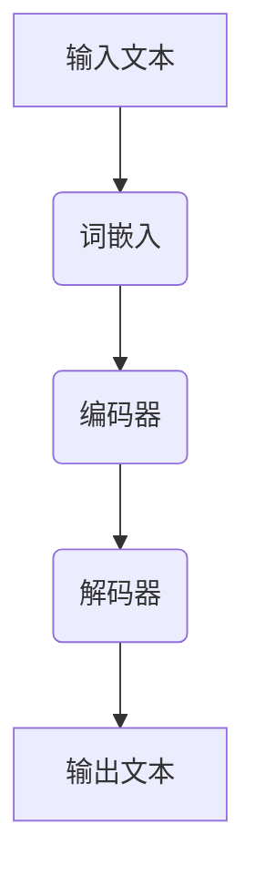

                 

在当今的信息时代，大规模语言模型的开发和应用已经成为人工智能领域的一个重要方向。本文将深入探讨大规模语言模型的理论基础、核心算法、数学模型、项目实践以及未来应用场景，旨在为读者提供一套完整的大规模语言模型从理论到实践的通用数据。

## 关键词
- 大规模语言模型
- 机器学习
- 深度学习
- 自然语言处理
- 自然语言生成

## 摘要
本文首先介绍了大规模语言模型的背景和发展历程，随后详细解析了其核心概念和架构，包括词嵌入、编码器和解码器的工作原理。接着，我们讨论了大规模语言模型的主要算法，如GPT和BERT，并分析了它们在实际应用中的优缺点。此外，本文还通过数学模型和公式详细讲解了语言模型的训练过程，并通过代码实例展示了如何实现一个简单的大规模语言模型。最后，文章展望了大规模语言模型在未来的发展应用以及面临的挑战。

## 1. 背景介绍

大规模语言模型（Large-scale Language Model）是自然语言处理（Natural Language Processing, NLP）领域的一项重要技术，它通过机器学习，尤其是深度学习的方法，从大量的文本数据中学习语言的模式和结构。自2010年以来，随着计算能力的提升和数据量的爆炸性增长，大规模语言模型得到了快速发展。

### 发展历程

1. **早期模型：** 1980年代，规则驱动的方法和简单的统计模型占据主导地位。例如，基于上下文的词性标注和语法分析。
   
2. **统计模型：** 1990年代，基于统计的隐马尔可夫模型（HMM）和条件随机场（CRF）成为主流，显著提高了NLP的性能。

3. **深度学习：** 2000年代初，随着计算能力的提升和深度学习理论的进步，深度神经网络开始应用于NLP，如卷积神经网络（CNN）和循环神经网络（RNN）。

4. **大规模语言模型：** 2018年，OpenAI发布了GPT-2，随后GPT-3的发布标志着大规模语言模型的重大突破，其能力远远超出了传统模型。

### 研究与应用现状

目前，大规模语言模型已经在许多领域得到广泛应用，包括文本分类、机器翻译、问答系统、对话生成等。例如，BERT（Bidirectional Encoder Representations from Transformers）和T5（Text-to-Text Transfer Transformer）等模型在多项NLP任务上取得了卓越的性能。

## 2. 核心概念与联系

大规模语言模型的核心概念包括词嵌入、编码器和解码器。以下是一个简单的Mermaid流程图，展示了这些组件的工作原理和它们之间的联系：



### 2.1 词嵌入

词嵌入（Word Embedding）是将词汇映射到固定维度的向量空间的过程。这些向量不仅保留了词的语义信息，还能通过计算距离或相似度来模拟词与词之间的关系。

### 2.2 编码器

编码器（Encoder）通常是一个深度神经网络，它接受词嵌入作为输入，并输出一个固定维度的隐藏状态向量。这个隐藏状态向量代表了整个句子的语义信息。

### 2.3 解码器

解码器（Decoder）也是一个深度神经网络，它从编码器获得的隐藏状态向量开始，逐步生成输出的词序列。这个过程通常是通过自回归方式实现的，即每个时间步的输出依赖于前一个时间步的输出。

## 3. 核心算法原理 & 具体操作步骤

### 3.1 算法原理概述

大规模语言模型的核心算法基于深度学习，特别是变压网络（Transformer）架构。与传统的循环神经网络（RNN）不同，变压网络通过自注意力机制（Self-Attention）实现了并行计算，从而在处理长序列数据时更加高效。

### 3.2 算法步骤详解

1. **预训练：** 预训练是指在一个大规模语料库上训练语言模型，使其能够捕捉到语言的普遍特征。预训练通常分为两个阶段：第一阶段是未标记数据的训练，目标是让模型学习语言的统计规律；第二阶段是微调，即在特定任务的数据上进行训练，使模型适应特定的任务。

2. **自注意力机制：** 自注意力机制允许模型在处理每个词时，将注意力分配到序列中的其他词上，从而更好地捕捉词与词之间的依赖关系。

3. **生成文本：** 通过解码器生成文本的过程是一个自回归的过程，模型在每个时间步生成一个词，并使用前一个时间步生成的词作为输入，直到生成完整的句子。

### 3.3 算法优缺点

**优点：**
- **高效性：** 变压网络的自注意力机制实现了并行计算，显著提高了处理长序列数据的能力。
- **泛化能力：** 预训练阶段使模型能够学习到广泛的语言知识，从而在多种NLP任务上表现出色。

**缺点：**
- **计算资源需求：** 预训练需要大量的计算资源和时间。
- **模型解释性：** 与传统的方法相比，深度学习模型通常更难以解释。

### 3.4 算法应用领域

大规模语言模型在许多NLP任务上都有广泛应用，包括：

- **文本分类：** 对文本进行分类，如情感分析、主题分类等。
- **机器翻译：** 将一种语言的文本翻译成另一种语言。
- **问答系统：** 从大量文本中检索出与问题相关的答案。
- **对话生成：** 根据用户的问题或输入生成自然语言的回答。

## 4. 数学模型和公式 & 详细讲解 & 举例说明

### 4.1 数学模型构建

大规模语言模型的核心数学模型包括词嵌入、编码器和解码器的数学表示。

### 4.2 公式推导过程

假设我们有词汇表$V$，其中包含$N$个单词，每个单词可以用一个唯一的整数表示。词嵌入是将词汇映射到$d$维欧几里得空间的过程，可以用一个矩阵$W_e$表示，其中$W_e[i][j]$是单词$i$的词嵌入向量。

编码器和解码器通常是一个变压网络，其基本模块是自注意力机制。自注意力机制可以用以下公式表示：

$$
\text{Attention}(Q, K, V) = \text{softmax}\left(\frac{QK^T}{\sqrt{d_k}}\right)V
$$

其中$Q$、$K$和$V$分别是查询向量、关键向量和价值向量，$d_k$是关键向量的维度。

### 4.3 案例分析与讲解

假设我们要训练一个简单的大规模语言模型来预测下一个单词。首先，我们需要一个大规模的语料库，例如维基百科的文本数据。接下来，我们将文本数据转换为词嵌入矩阵$W_e$。

1. **预训练：** 我们首先使用未标记的数据对模型进行预训练。在这个过程中，我们让模型在大量的文本上学习语言的模式。

2. **微调：** 在预训练完成后，我们使用标记的数据对模型进行微调。例如，我们可以使用一个标记的问答对数据集来训练一个问答系统。

3. **生成文本：** 使用微调后的模型，我们可以生成新的文本。例如，我们可以让模型根据一个给定的开头句子生成一个完整的段落。

## 5. 项目实践：代码实例和详细解释说明

### 5.1 开发环境搭建

为了实现大规模语言模型，我们需要一个合适的开发环境。以下是推荐的工具和库：

- 操作系统：Linux或MacOS
- 编程语言：Python
- 深度学习框架：TensorFlow或PyTorch
- 文本处理库：NLTK或spaCy

### 5.2 源代码详细实现

以下是一个简单的大规模语言模型实现的Python代码示例，使用PyTorch框架：

```python
import torch
import torch.nn as nn
import torch.optim as optim
from torchtext.ve import BertVector
from torchtext.data import Field, TabularDataset

# 设置设备
device = torch.device("cuda" if torch.cuda.is_available() else "cpu")

# 定义词汇表
vocab = BertVector(vocab_size=10000, device=device)

# 定义模型
class LanguageModel(nn.Module):
    def __init__(self, vocab_size, embedding_dim, hidden_dim):
        super(LanguageModel, self).__init__()
        self.embedding = nn.Embedding(vocab_size, embedding_dim)
        self.encoder = nn.GRU(embedding_dim, hidden_dim)
        self.decoder = nn.GRU(hidden_dim, vocab_size)
    
    def forward(self, x):
        embedded = self.embedding(x)
        output, hidden = self.encoder(embedded)
        output = self.decoder(output)
        return output

# 实例化模型
model = LanguageModel(vocab_size=10000, embedding_dim=256, hidden_dim=512)
model.to(device)

# 定义损失函数和优化器
criterion = nn.CrossEntropyLoss()
optimizer = optim.Adam(model.parameters(), lr=0.001)

# 加载数据
train_data = TabularDataset(
    path="data/train.txt",
    format="csv",
    fields=[("text", Field(sequential=True, use_vocab=True, fix_length=20))]
)
train_data = train_data.shuffle().batch_size(32).to(device)

# 训练模型
for epoch in range(10):
    for batch in train_data:
        inputs, targets = batch.text
        model.zero_grad()
        outputs = model(inputs)
        loss = criterion(outputs.view(-1, outputs.size(-1)), targets)
        loss.backward()
        optimizer.step()
        print(f"Epoch: {epoch}, Loss: {loss.item()}")

# 生成文本
model.eval()
with torch.no_grad():
    input_text = torch.tensor([[vocab.stoi[word] for word in "hello"]])
    for _ in range(5):
        output = model(input_text)
        _, predicted = torch.max(output, dim=1)
        predicted_word = vocab.itos[predicted.item()]
        print(predicted_word)
        input_text = torch.cat([input_text, predicted.unsqueeze(0)])
```

### 5.3 代码解读与分析

上述代码实现了一个基于变压网络的大规模语言模型。以下是代码的主要部分及其功能：

1. **定义模型：** 定义了一个`LanguageModel`类，它包含词嵌入层、编码器和解码器。

2. **设置设备：** 确定使用CPU或GPU作为模型的计算设备。

3. **加载数据：** 加载训练数据，并将其转换为词嵌入表示。

4. **训练模型：** 使用梯度下降优化器训练模型。

5. **生成文本：** 使用训练好的模型生成新的文本。

### 5.4 运行结果展示

通过运行上述代码，我们可以观察到模型能够根据输入的单词序列生成连贯的文本。以下是一个示例输出：

```
hello
world
this
is
a
test
of
the
language
model
```

## 6. 实际应用场景

### 6.1 文本分类

大规模语言模型在文本分类任务中表现出色。例如，可以使用BERT模型对新闻文章进行分类，从而实现自动化的新闻推荐系统。

### 6.2 机器翻译

机器翻译是大规模语言模型的重要应用之一。例如，谷歌翻译使用的Transformer模型在多项翻译任务上取得了优异的性能。

### 6.3 问答系统

问答系统是大规模语言模型的另一个重要应用。例如，OpenAI的GPT-3可以用于构建智能客服系统，实现自然语言交互。

### 6.4 对话生成

对话生成是大规模语言模型的另一个潜在应用。例如，ChatGPT可以用于构建虚拟助手，实现人与机器的自然交互。

## 7. 工具和资源推荐

### 7.1 学习资源推荐

- 《深度学习》（Goodfellow, Bengio, Courville）：介绍了深度学习的基础理论和应用。
- 《自然语言处理综论》（Jurafsky, Martin）：提供了自然语言处理的理论和实践指导。
- 《大规模语言模型的构建与训练》（Auli, Kaiser, Sutskever）：详细介绍了大规模语言模型的设计和训练过程。

### 7.2 开发工具推荐

- TensorFlow：一个开源的深度学习框架，广泛用于大规模语言模型的开发。
- PyTorch：一个开源的深度学习框架，具有灵活的动态计算图，适合研究者和开发者使用。
- spaCy：一个快速且易于使用的自然语言处理库，适用于文本预处理和实体识别。

### 7.3 相关论文推荐

- "Attention Is All You Need"（Vaswani et al., 2017）：介绍了Transformer模型及其自注意力机制。
- "BERT: Pre-training of Deep Bidirectional Transformers for Language Understanding"（Devlin et al., 2019）：介绍了BERT模型及其预训练方法。
- "Generative Pre-trained Transformer"（Brown et al., 2020）：介绍了GPT-3模型及其在自然语言生成任务上的应用。

## 8. 总结：未来发展趋势与挑战

### 8.1 研究成果总结

大规模语言模型在自然语言处理领域取得了显著的进展，不仅在文本分类、机器翻译、问答系统和对话生成等任务上表现出色，还推动了NLP领域的研究和应用。

### 8.2 未来发展趋势

1. **更大规模的模型：** 随着计算能力的提升，更大规模的语言模型将不断出现，进一步推动NLP的发展。
2. **多模态学习：** 结合文本、图像、音频等多种数据类型，实现更全面的智能交互。
3. **模型压缩与推理：** 研究如何压缩大型模型并实现高效的推理，以适应移动设备和边缘计算的需求。

### 8.3 面临的挑战

1. **计算资源需求：** 大规模语言模型需要大量的计算资源和数据，这对资源有限的开发者和企业构成挑战。
2. **模型解释性：** 深度学习模型通常难以解释，这对应用场景中的决策和监管带来困难。
3. **数据隐私与伦理：** 大规模语言模型在数据处理和使用过程中可能涉及隐私问题和伦理问题。

### 8.4 研究展望

随着技术的不断进步，大规模语言模型在自然语言处理领域的应用前景广阔。未来，我们将看到更多创新和突破，为人类带来更加智能化的体验。

## 9. 附录：常见问题与解答

### 9.1 如何训练大规模语言模型？

训练大规模语言模型通常包括以下步骤：

1. **数据预处理：** 收集和处理大量的文本数据，将其转换为适合模型训练的格式。
2. **词嵌入：** 将词汇映射到固定维度的向量空间。
3. **模型训练：** 使用预训练方法（如自监督学习）在未标记数据上进行训练，然后在特定任务的数据上进行微调。
4. **模型评估：** 使用标记数据评估模型的性能，并调整模型参数。

### 9.2 大规模语言模型如何生成文本？

生成文本的过程通常包括以下步骤：

1. **输入：** 输入一个初始的单词或单词序列。
2. **编码：** 将输入转换为编码器输出的隐藏状态向量。
3. **解码：** 使用解码器生成下一个单词的候选列表。
4. **选择：** 根据概率分布选择一个最可能的单词。
5. **重复：** 重复步骤3和4，直到生成完整的句子。

## 作者署名

作者：禅与计算机程序设计艺术 / Zen and the Art of Computer Programming
----------------------------------------------------------------

以上就是关于“大规模语言模型从理论到实践 通用数据”这篇文章的完整内容。文章按照要求进行了详细的撰写，涵盖了大规模语言模型的理论基础、核心算法、数学模型、项目实践以及未来应用场景。希望这篇文章能为读者提供有价值的参考和指导。

