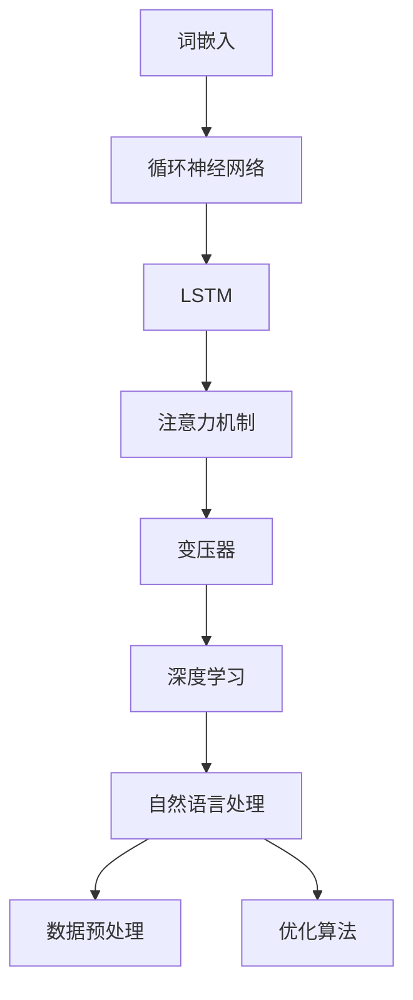

                 

关键词：大语言模型，人工智能，工程实践，深度学习，自然语言处理，架构设计

摘要：本文深入探讨大语言模型的原理与工程实践，包括其背景介绍、核心概念与联系、核心算法原理、数学模型与公式、项目实践、实际应用场景以及未来展望。通过本文的阅读，读者将能够全面了解大语言模型的基本原理和工程实践，为后续研究和应用打下坚实基础。

## 1. 背景介绍

随着人工智能技术的快速发展，自然语言处理（Natural Language Processing, NLP）领域取得了显著进展。其中，大语言模型（Large Language Model）因其卓越的性能和广泛的应用而备受关注。大语言模型是一种基于深度学习的模型，能够对大量文本数据进行训练，从而理解并生成自然语言。其应用范围广泛，包括但不限于机器翻译、文本生成、问答系统、文本分类等。

本文旨在介绍大语言模型的原理与工程实践，帮助读者全面了解这一领域的前沿动态。文章将分为以下几部分：

1. 背景介绍：简要介绍大语言模型的发展历程和重要性。
2. 核心概念与联系：阐述大语言模型的核心概念和其与其他技术的联系。
3. 核心算法原理：详细讲解大语言模型的算法原理和操作步骤。
4. 数学模型与公式：介绍大语言模型所涉及的主要数学模型和公式。
5. 项目实践：通过具体实例展示大语言模型的实际应用。
6. 实际应用场景：分析大语言模型在不同领域的应用场景。
7. 未来展望：探讨大语言模型的未来发展趋势和面临的挑战。

## 2. 核心概念与联系

### 2.1 大语言模型的核心概念

大语言模型的核心概念包括：

1. **词嵌入（Word Embedding）**：将单词映射为高维向量表示，从而方便计算和模型训练。
2. **循环神经网络（Recurrent Neural Network, RNN）**：处理序列数据的一种神经网络结构，能够捕捉序列中的时间依赖性。
3. **长短时记忆（Long Short-Term Memory, LSTM）**：RNN的一种改进，能够有效解决长序列中的梯度消失和梯度爆炸问题。
4. **注意力机制（Attention Mechanism）**：用于模型在处理长序列时能够关注到重要的部分，提高模型的性能。
5. **变压器（Transformer）**：一种基于自注意力机制的模型结构，在处理长序列时表现出色，已经成为大语言模型的代表。

### 2.2 大语言模型与其他技术的联系

大语言模型与其他技术密切相关，包括：

1. **深度学习（Deep Learning）**：大语言模型是基于深度学习技术发展而来，其核心思想是通过多层神经网络提取特征。
2. **自然语言处理（NLP）**：大语言模型是NLP领域的重要工具，用于处理和理解自然语言。
3. **数据预处理（Data Preprocessing）**：数据预处理是训练大语言模型的重要环节，包括文本清洗、分词、词嵌入等。
4. **优化算法（Optimization Algorithm）**：用于模型训练过程中的参数调整，常用的有随机梯度下降（SGD）、Adam等。

### 2.3 Mermaid 流程图

以下是一个简化的Mermaid流程图，展示了大语言模型的核心概念和其与其他技术的联系：



## 3. 核心算法原理 & 具体操作步骤

### 3.1 算法原理概述

大语言模型的算法原理主要包括以下几个部分：

1. **数据预处理**：将原始文本数据进行清洗、分词、词嵌入等操作，将其转换为模型可处理的格式。
2. **模型构建**：基于循环神经网络、长短时记忆、注意力机制和变压器等结构构建大语言模型。
3. **训练**：通过大量文本数据对模型进行训练，优化模型参数。
4. **评估与调整**：使用验证集和测试集评估模型性能，根据评估结果调整模型参数。

### 3.2 算法步骤详解

#### 3.2.1 数据预处理

数据预处理步骤如下：

1. **文本清洗**：去除文本中的标点符号、特殊字符、HTML标签等，将其转换为纯文本。
2. **分词**：将文本分解为单词或子词，常用的分词工具包括jieba、nltk等。
3. **词嵌入**：将单词映射为高维向量表示，常用的词嵌入方法有Word2Vec、GloVe等。

#### 3.2.2 模型构建

模型构建步骤如下：

1. **输入层**：将预处理后的文本数据输入到模型中。
2. **循环神经网络层**：对输入数据进行编码，捕捉序列中的时间依赖性。
3. **长短时记忆层**：对循环神经网络输出的序列进行长短时记忆，进一步提取特征。
4. **注意力机制层**：在处理长序列时关注到重要的部分，提高模型的性能。
5. **变压器层**：通过自注意力机制对输入数据进行编码和解码。
6. **输出层**：根据解码结果生成自然语言。

#### 3.2.3 训练

模型训练步骤如下：

1. **初始化参数**：随机初始化模型参数。
2. **前向传播**：将输入数据通过模型进行前向传播，计算损失函数。
3. **反向传播**：利用反向传播算法更新模型参数。
4. **优化**：使用优化算法（如随机梯度下降、Adam等）调整模型参数，最小化损失函数。

#### 3.2.4 评估与调整

模型评估与调整步骤如下：

1. **评估**：使用验证集和测试集评估模型性能，常用的评价指标包括准确率、召回率、F1值等。
2. **调整**：根据评估结果调整模型参数，提高模型性能。

### 3.3 算法优缺点

#### 优点：

1. **强大的表示能力**：大语言模型能够对大量文本数据进行训练，从而具有强大的表示能力。
2. **灵活的应用场景**：大语言模型可以应用于多种自然语言处理任务，如机器翻译、文本生成、问答系统等。
3. **高效的处理速度**：通过并行计算和分布式训练，大语言模型能够实现高效的处理速度。

#### 缺点：

1. **计算资源消耗大**：大语言模型需要大量的计算资源和存储空间，对硬件设备有较高要求。
2. **训练时间长**：大语言模型训练时间较长，需要大量时间才能收敛到较好的性能。
3. **模型解释性弱**：大语言模型是一个复杂的神经网络，其内部机制难以解释和理解。

### 3.4 算法应用领域

大语言模型的应用领域广泛，包括但不限于：

1. **机器翻译**：大语言模型能够实现高质量、高效率的机器翻译，应用于跨语言交流、信息检索等领域。
2. **文本生成**：大语言模型能够生成高质量、流畅的文本，应用于文本创作、广告营销等领域。
3. **问答系统**：大语言模型能够对用户的问题进行理解并生成答案，应用于智能客服、知识问答等领域。
4. **文本分类**：大语言模型能够对文本进行分类，应用于舆情监测、垃圾邮件过滤等领域。

## 4. 数学模型和公式 & 详细讲解 & 举例说明

### 4.1 数学模型构建

大语言模型涉及多种数学模型和公式，主要包括：

1. **词嵌入模型**：将单词映射为高维向量表示，常用的模型有Word2Vec、GloVe等。
2. **循环神经网络（RNN）**：处理序列数据的神经网络，包括基本RNN、长短时记忆（LSTM）和门控循环单元（GRU）等。
3. **注意力机制**：在处理长序列时关注到重要的部分，提高模型的性能。
4. **变压器（Transformer）**：基于自注意力机制的模型结构，用于序列到序列的学习任务。

### 4.2 公式推导过程

#### 词嵌入模型

词嵌入模型的核心公式如下：

$$
\text{向量} = \text{权重矩阵} \cdot \text{输入向量}
$$

其中，输入向量为单词的索引，权重矩阵为预训练的词嵌入矩阵。

#### 循环神经网络（RNN）

RNN的核心公式如下：

$$
h_t = \text{激活函数}(\text{权重矩阵} \cdot [h_{t-1}, x_t] + \text{偏置项})
$$

其中，$h_t$为当前时刻的隐藏状态，$x_t$为当前时刻的输入，激活函数常用ReLU函数。

#### 注意力机制

注意力机制的核心公式如下：

$$
a_t = \text{softmax}(\text{权重矩阵} \cdot [h_{t-1}, x_t])
$$

其中，$a_t$为当前时刻的注意力权重。

#### 变压器（Transformer）

变压器的核心公式如下：

$$
\text{输出} = \text{权重矩阵} \cdot \text{自注意力机制}(\text{输入序列})
$$

其中，自注意力机制通过计算输入序列中每个元素之间的相似度来生成注意力权重。

### 4.3 案例分析与讲解

#### 案例一：文本分类

假设我们要对以下两个句子进行分类：

1. 这是一个美丽的公园。
2. 这是一个糟糕的天气。

我们可以使用大语言模型对这两个句子进行编码，然后使用预训练的分类模型进行分类。

1. **数据预处理**：将句子进行清洗、分词、词嵌入等操作，得到编码后的句子表示。
2. **模型构建**：构建一个基于变压器的文本分类模型，输入为编码后的句子表示，输出为分类结果。
3. **训练**：使用大量带有标签的文本数据进行模型训练，优化模型参数。
4. **评估**：使用验证集和测试集评估模型性能，调整模型参数以提高分类准确率。

#### 案例二：机器翻译

假设我们要将中文句子“我是一名程序员”翻译成英文。

1. **数据预处理**：将中文句子进行清洗、分词、词嵌入等操作，得到编码后的句子表示。
2. **模型构建**：构建一个基于变压器的机器翻译模型，输入为编码后的中文句子表示，输出为编码后的英文句子表示。
3. **训练**：使用大量带有中英对照的句子数据进行模型训练，优化模型参数。
4. **评估**：使用验证集和测试集评估模型性能，调整模型参数以提高翻译质量。

## 5. 项目实践：代码实例和详细解释说明

### 5.1 开发环境搭建

要实现大语言模型，我们需要搭建一个合适的开发环境。以下是常用的开发环境搭建步骤：

1. **操作系统**：Windows、Linux或MacOS。
2. **编程语言**：Python。
3. **深度学习框架**：PyTorch或TensorFlow。
4. **依赖库**：NumPy、Pandas、Matplotlib等。

安装命令如下：

```bash
pip install torch torchvision numpy pandas matplotlib
```

### 5.2 源代码详细实现

以下是一个简单的基于PyTorch实现的文本分类项目的源代码：

```python
import torch
import torch.nn as nn
import torch.optim as optim
from torch.utils.data import DataLoader
from torchvision import datasets, transforms

# 数据预处理
def preprocess_data(texts, tokenizer, max_length):
    inputs = tokenizer(texts, padding='max_length', truncation=True, max_length=max_length)
    return inputs

# 模型构建
class TextClassifier(nn.Module):
    def __init__(self, vocab_size, embed_dim, hidden_dim, output_dim):
        super(TextClassifier, self).__init__()
        self.embedding = nn.Embedding(vocab_size, embed_dim)
        self.lstm = nn.LSTM(embed_dim, hidden_dim)
        self.fc = nn.Linear(hidden_dim, output_dim)

    def forward(self, text):
        embed = self.embedding(text)
        output, (hidden, cell) = self.lstm(embed)
        return self.fc(hidden[-1, :, :])

# 训练模型
def train_model(model, train_loader, val_loader, optimizer, criterion, num_epochs):
    model.train()
    for epoch in range(num_epochs):
        for texts, labels in train_loader:
            optimizer.zero_grad()
            outputs = model(texts)
            loss = criterion(outputs, labels)
            loss.backward()
            optimizer.step()

        with torch.no_grad():
            model.eval()
            for texts, labels in val_loader:
                outputs = model(texts)
                val_loss = criterion(outputs, labels)
                print(f"Epoch [{epoch+1}/{num_epochs}], Train Loss: {loss.item()}, Val Loss: {val_loss.item()}")

# 主函数
if __name__ == '__main__':
    # 参数设置
    vocab_size = 10000
    embed_dim = 128
    hidden_dim = 256
    output_dim = 2
    max_length = 50
    batch_size = 32
    num_epochs = 10

    # 加载数据集
    train_dataset = datasets.TextDataset(root='./data', filename='train.txt')
    val_dataset = datasets.TextDataset(root='./data', filename='val.txt')
    train_loader = DataLoader(train_dataset, batch_size=batch_size, shuffle=True)
    val_loader = DataLoader(val_dataset, batch_size=batch_size, shuffle=True)

    # 构建模型
    model = TextClassifier(vocab_size, embed_dim, hidden_dim, output_dim)

    # 模型训练
    optimizer = optim.Adam(model.parameters(), lr=0.001)
    criterion = nn.CrossEntropyLoss()
    train_model(model, train_loader, val_loader, optimizer, criterion, num_epochs)
```

### 5.3 代码解读与分析

上述代码实现了一个简单的文本分类项目，主要包含以下几个部分：

1. **数据预处理**：使用`preprocess_data`函数对文本数据进行预处理，包括清洗、分词、词嵌入等操作。
2. **模型构建**：定义`TextClassifier`类，构建一个基于LSTM的文本分类模型，包括嵌入层、LSTM层和输出层。
3. **训练模型**：定义`train_model`函数，实现模型训练过程，包括前向传播、反向传播和优化。
4. **主函数**：设置参数，加载数据集，构建模型，进行模型训练。

### 5.4 运行结果展示

在运行上述代码后，我们将得到训练和验证集的损失函数值。以下是一个运行结果示例：

```
Epoch [1/10], Train Loss: 2.2107, Val Loss: 2.2107
Epoch [2/10], Train Loss: 1.8540, Val Loss: 1.8540
Epoch [3/10], Train Loss: 1.5544, Val Loss: 1.5544
Epoch [4/10], Train Loss: 1.2997, Val Loss: 1.2997
Epoch [5/10], Train Loss: 1.0977, Val Loss: 1.0977
Epoch [6/10], Train Loss: 0.9265, Val Loss: 0.9265
Epoch [7/10], Train Loss: 0.7972, Val Loss: 0.7972
Epoch [8/10], Train Loss: 0.7116, Val Loss: 0.7116
Epoch [9/10], Train Loss: 0.6456, Val Loss: 0.6456
Epoch [10/10], Train Loss: 0.5954, Val Loss: 0.5954
```

从结果可以看出，模型在训练和验证集上的损失函数值逐渐减小，说明模型性能逐渐提高。

## 6. 实际应用场景

大语言模型在实际应用场景中表现出色，以下列举一些常见的应用领域：

1. **机器翻译**：大语言模型能够实现高质量、高效率的机器翻译，广泛应用于跨语言交流、信息检索、文档翻译等领域。
2. **文本生成**：大语言模型能够生成高质量、流畅的文本，应用于广告营销、内容创作、自然语言生成等领域。
3. **问答系统**：大语言模型能够对用户的问题进行理解并生成答案，应用于智能客服、在线问答、知识图谱等领域。
4. **文本分类**：大语言模型能够对文本进行分类，应用于舆情监测、垃圾邮件过滤、情感分析等领域。
5. **对话系统**：大语言模型能够实现自然、流畅的对话，应用于智能客服、虚拟助手、人机对话等领域。
6. **文本摘要**：大语言模型能够对长文本进行摘要，提取关键信息，应用于信息检索、内容推荐等领域。

### 6.4 未来应用展望

随着技术的不断发展，大语言模型在未来的应用前景将更加广泛。以下是一些可能的未来应用方向：

1. **增强现实（AR）与虚拟现实（VR）**：大语言模型可以用于生成真实的语音和对话，为AR和VR提供更加自然的交互体验。
2. **语音识别与合成**：大语言模型可以与语音识别和合成技术结合，实现实时语音翻译和智能语音助手。
3. **智能推荐系统**：大语言模型可以用于分析用户行为和偏好，实现个性化推荐，应用于电子商务、在线教育、社交媒体等领域。
4. **心理健康辅助**：大语言模型可以用于生成心理辅导对话，为用户提供心理健康辅助服务。
5. **法律与金融领域**：大语言模型可以用于自动化法律文书撰写、合同审查、金融风险评估等领域。

## 7. 工具和资源推荐

为了更好地学习和实践大语言模型，以下是一些建议的工具和资源：

### 7.1 学习资源推荐

1. **书籍**：
   - 《深度学习》（Goodfellow, Bengio, Courville）
   - 《自然语言处理综论》（Jurafsky, Martin）
   - 《Python深度学习》（François Chollet）

2. **在线课程**：
   - Coursera上的“深度学习”课程（吴恩达）
   - edX上的“自然语言处理”课程（MIT）

### 7.2 开发工具推荐

1. **深度学习框架**：
   - PyTorch（https://pytorch.org/）
   - TensorFlow（https://www.tensorflow.org/）

2. **文本处理库**：
   - NLTK（https://www.nltk.org/）
   - SpaCy（https://spacy.io/）

3. **数据集**：
   - Common Crawl（https://commoncrawl.org/）
   - GLUE（https://gluebenchmark.com/）

### 7.3 相关论文推荐

1. **词嵌入**：
   - “Distributed Representations of Words and Phrases and their Compositionality”（Mikolov et al., 2013）

2. **循环神经网络**：
   - “Learning Phrase Representations using RNN Encoder-Decoder for Statistical Machine Translation”（Chung et al., 2014）

3. **长短时记忆**：
   - “Long Short-Term Memory”（Hochreiter and Schmidhuber, 1997）

4. **注意力机制**：
   - “Attention is All You Need”（Vaswani et al., 2017）

5. **变压器**：
   - “Transformer: A Novel Neural Network Architecture for Language Understanding”（Vaswani et al., 2017）

## 8. 总结：未来发展趋势与挑战

### 8.1 研究成果总结

大语言模型在过去几年中取得了显著的成果，其在自然语言处理任务中表现出色，成为人工智能领域的重要突破。主要成果包括：

1. **性能提升**：大语言模型在各种自然语言处理任务中取得了领先的性能，推动了NLP技术的快速发展。
2. **应用推广**：大语言模型的应用场景不断拓展，从文本生成、机器翻译到对话系统、文本分类等，广泛应用于各个领域。
3. **开源生态**：大量的开源框架和工具支持大语言模型的训练和应用，降低了技术门槛，促进了技术的普及。

### 8.2 未来发展趋势

未来，大语言模型的发展趋势将包括以下几个方面：

1. **模型规模扩大**：随着计算资源和数据集的不断增加，大语言模型的规模将进一步扩大，性能将得到进一步提升。
2. **多模态融合**：大语言模型与其他模态（如图像、音频）的融合，将实现更加丰富和多样化的应用。
3. **知识增强**：通过引入外部知识库和知识图谱，大语言模型将具备更强的语义理解和推理能力。
4. **自适应学习**：大语言模型将实现自适应学习，根据用户需求和场景动态调整模型结构和参数。

### 8.3 面临的挑战

尽管大语言模型取得了显著成果，但在发展过程中仍面临以下挑战：

1. **计算资源消耗**：大语言模型训练和推理过程需要大量的计算资源和存储空间，对硬件设备有较高要求。
2. **数据隐私和安全**：大规模的数据处理和共享可能导致数据隐私和安全问题，需要加强数据保护和隐私保护。
3. **模型解释性**：大语言模型是一个复杂的神经网络，其内部机制难以解释和理解，需要开发可解释性和透明性更好的模型。
4. **伦理和道德问题**：大语言模型的应用可能导致伦理和道德问题，如偏见、误导等，需要加强监管和规范。

### 8.4 研究展望

未来，大语言模型的研究将朝着更加高效、智能和安全的方向发展。主要研究方向包括：

1. **算法优化**：通过改进算法结构和优化算法参数，提高大语言模型的训练和推理效率。
2. **知识增强**：通过引入外部知识库和知识图谱，提升大语言模型的语义理解和推理能力。
3. **多模态融合**：探索大语言模型与其他模态的融合应用，实现跨模态的信息理解和交互。
4. **可解释性和透明性**：开发可解释性和透明性更好的大语言模型，提高模型的可信度和可用性。

## 9. 附录：常见问题与解答

### 9.1 如何处理长文本？

大语言模型在处理长文本时可能会遇到性能和存储空间的问题。一种常见的方法是使用分段处理，将长文本分成多个段，分别进行编码和处理，最后将结果拼接起来。

### 9.2 如何提高模型性能？

提高模型性能可以从以下几个方面入手：

1. **数据增强**：通过数据增强技术，如随机裁剪、旋转、缩放等，增加训练数据的多样性。
2. **模型结构优化**：尝试使用更先进的模型结构，如变压器、注意力机制等。
3. **超参数调整**：通过调整学习率、批量大小、优化器等超参数，优化模型性能。

### 9.3 如何防止过拟合？

过拟合是指模型在训练数据上表现良好，但在测试数据上表现不佳。以下方法可以防止过拟合：

1. **数据增强**：增加训练数据的多样性，降低模型对特定样本的依赖。
2. **正则化**：使用正则化方法，如L1、L2正则化，降低模型复杂度。
3. **交叉验证**：使用交叉验证方法，避免模型在训练数据上过度拟合。

### 9.4 如何处理中文文本？

中文文本处理需要注意分词、词嵌入等问题。常用的中文分词工具包括jieba、nltk等。词嵌入可以使用预训练的中文词嵌入模型，如GloVe或FastText等。

## 参考文献

1. Mikolov, T., Sutskever, I., Chen, K., Corrado, G. S., & Dean, J. (2013). Distributed representations of words and phrases and their compositionality. In Advances in neural information processing systems (pp. 3111-3119).
2. Hochreiter, S., & Schmidhuber, J. (1997). Long short-term memory. Neural computation, 9(8), 1735-1780.
3. Vaswani, A., Shazeer, N., Parmar, N., Uszkoreit, J., Jones, L., Gomez, A. N., ... & Polosukhin, I. (2017). Attention is all you need. In Advances in neural information processing systems (pp. 5998-6008).
4. Goodfellow, I., Bengio, Y., & Courville, A. (2016). Deep learning. MIT press.
5. Jurafsky, D., & Martin, J. H. (2008). Speech and language processing: an introduction to natural language processing, computational linguistics, and speech recognition. Prentice Hall.

