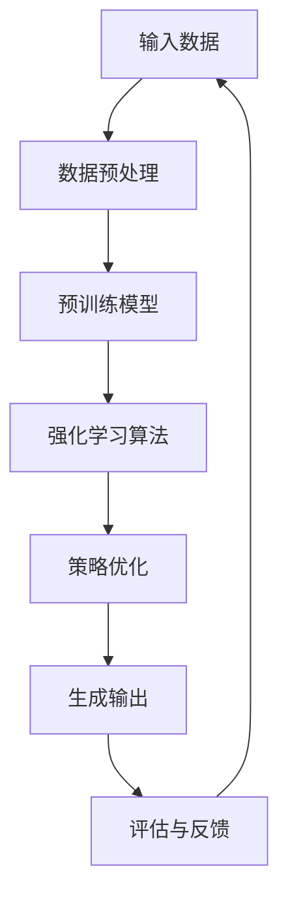

                 

关键词：大语言模型、强化学习、算法原理、工程实践、深度学习、自然语言处理

摘要：本文将深入探讨大语言模型背后的强化学习原理，详细阐述其核心概念、算法步骤、数学模型及应用场景。通过实际项目实践，我们将展示如何将强化学习应用于自然语言处理领域，助力人工智能技术发展。

## 1. 背景介绍

随着人工智能技术的发展，深度学习在自然语言处理（NLP）领域取得了显著的成果。然而，传统的深度学习模型往往依赖于大量的人工标注数据和预训练模型。为了克服这一局限性，强化学习逐渐成为研究热点。本文将重点介绍大语言模型中的强化学习原理，并探讨其在工程实践中的应用。

### 大语言模型

大语言模型是一种基于深度学习的自然语言处理模型，能够理解、生成和翻译自然语言。近年来，基于Transformer架构的预训练模型，如GPT-3和Bert，取得了令人瞩目的性能提升。这些模型通过在大量无标签数据上进行预训练，然后针对特定任务进行微调，取得了广泛的应用。

### 强化学习

强化学习是一种通过不断与环境互动来学习最优策略的人工智能方法。与传统的监督学习和无监督学习不同，强化学习通过奖励机制来驱动模型不断优化行为。在自然语言处理领域，强化学习可以用于文本生成、问答系统、机器翻译等任务。

## 2. 核心概念与联系

为了更好地理解大语言模型中的强化学习原理，我们需要首先介绍一些核心概念和架构。以下是一个使用Mermaid绘制的流程图，展示了大语言模型与强化学习之间的联系。



### 输入数据（A）

输入数据是强化学习算法的起点。在大语言模型中，输入数据可以是自然语言文本、语音信号或其他形式的数据。这些数据经过预处理后，将作为模型的输入。

### 数据预处理（B）

数据预处理是强化学习算法的重要环节。通过数据预处理，我们可以将原始数据转换为适合模型训练的格式。在大语言模型中，数据预处理通常包括分词、词向量嵌入、序列编码等步骤。

### 预训练模型（C）

预训练模型是在大量无标签数据上进行训练得到的模型。在大语言模型中，预训练模型通常是一个深度神经网络，能够捕捉自然语言的复杂结构。

### 强化学习算法（D）

强化学习算法是强化学习模型的主体。在大语言模型中，强化学习算法通过不断与环境互动，学习最优策略。常见的强化学习算法包括Q-learning、SARSA、PPO等。

### 策略优化（E）

策略优化是强化学习算法的核心步骤。通过策略优化，模型可以不断调整行为策略，以最大化奖励。在大语言模型中，策略优化通常通过梯度下降等优化算法实现。

### 生成输出（F）

生成输出是强化学习算法的最终目标。在大语言模型中，生成输出可以是自然语言文本、语音信号或其他形式的数据。这些输出经过评估和反馈后，将作为下一轮训练的输入。

### 评估与反馈（G）

评估与反馈是强化学习算法的重要环节。通过评估与反馈，我们可以对模型的性能进行评价，并调整模型的行为策略。在大语言模型中，评估与反馈通常通过指标评估和用户反馈实现。

## 3. 核心算法原理 & 具体操作步骤

### 3.1 算法原理概述

强化学习算法通过不断与环境互动，学习最优策略。在大语言模型中，强化学习算法的核心原理如下：

1. **状态（State）**：模型当前所处的环境状态，例如输入文本的序列。
2. **动作（Action）**：模型可以采取的行为，例如生成文本的下一个单词。
3. **奖励（Reward）**：模型采取动作后获得的即时奖励，用于评估动作的质量。
4. **策略（Policy）**：模型选择动作的策略，通常是一个概率分布。
5. **价值函数（Value Function）**：评估策略的质量，通常包括状态价值和状态-动作价值。
6. **策略优化（Policy Optimization）**：通过梯度下降等优化算法，不断调整策略，以最大化预期奖励。

### 3.2 算法步骤详解

1. **初始化模型参数**：随机初始化模型参数。
2. **输入数据预处理**：对输入数据进行分词、词向量嵌入等处理。
3. **选择动作**：根据当前状态和策略，选择一个动作。
4. **执行动作**：将动作传递给环境，并观察环境状态的变化。
5. **计算奖励**：根据环境反馈，计算当前动作的即时奖励。
6. **更新价值函数**：根据奖励和策略优化算法，更新价值函数。
7. **调整策略**：根据价值函数，调整策略参数。
8. **生成输出**：根据调整后的策略，生成输出。
9. **评估与反馈**：对输出进行评估，并根据用户反馈调整模型。

### 3.3 算法优缺点

**优点**：

1. **适应性**：强化学习算法能够根据环境变化调整策略，具有很好的适应性。
2. **灵活性**：强化学习算法可以应用于各种复杂任务，例如文本生成、问答系统等。
3. **多任务学习**：强化学习算法能够同时学习多个任务，提高模型性能。

**缺点**：

1. **收敛速度慢**：强化学习算法通常需要大量迭代才能收敛，训练速度较慢。
2. **计算成本高**：强化学习算法需要大量的计算资源，对硬件要求较高。

### 3.4 算法应用领域

强化学习在大语言模型中具有广泛的应用，包括：

1. **文本生成**：例如生成小说、新闻、诗歌等。
2. **问答系统**：例如智能客服、智能助手等。
3. **机器翻译**：例如中英文翻译、多语言翻译等。
4. **语音合成**：例如语音助手、语音识别等。

## 4. 数学模型和公式

### 4.1 数学模型构建

在大语言模型中，强化学习算法的数学模型主要包括：

1. **状态空间（S）**：输入文本的序列，可以表示为 $S = \{s_1, s_2, ..., s_n\}$。
2. **动作空间（A）**：生成文本的下一个单词，可以表示为 $A = \{a_1, a_2, ..., a_m\}$。
3. **策略（π）**：选择动作的策略，可以表示为 $\pi(a|s)$。
4. **价值函数（V）**：评估策略的质量，可以表示为 $V(s)$。
5. **状态-动作价值函数（Q）**：评估状态-动作对的效用，可以表示为 $Q(s, a)$。

### 4.2 公式推导过程

1. **策略迭代**：

   $$\pi(a|s) = \frac{\exp(Q(s, a))}{\sum_{a' \in A} \exp(Q(s, a'))}$$

2. **价值迭代**：

   $$V(s) = \sum_{a \in A} \pi(a|s) \cdot Q(s, a)$$

3. **状态-动作价值函数更新**：

   $$Q(s, a) \leftarrow Q(s, a) + \alpha [r + \gamma \max_{a'} Q(s', a') - Q(s, a)]$$

其中，$\alpha$ 是学习率，$\gamma$ 是折扣因子，$r$ 是即时奖励。

### 4.3 案例分析与讲解

以下是一个简单的文本生成案例，展示如何使用强化学习算法生成一段自然语言文本。

**输入数据**：

输入文本为：“今天天气很好，非常适合户外活动。”

**数据预处理**：

对输入文本进行分词，得到词序列 $s = \{今天，天气，很好，，适合，户外，活动，。\}$。

**选择动作**：

根据当前状态和策略，选择生成文本的下一个单词。假设当前状态为“适合”，策略选择生成“户外”。

**执行动作**：

将“户外”传递给环境，并观察环境状态的变化。

**计算奖励**：

根据用户反馈，计算当前动作的即时奖励。假设用户反馈为“很好”，即时奖励为1。

**更新价值函数**：

根据奖励和策略优化算法，更新状态-动作价值函数。

**调整策略**：

根据调整后的价值函数，调整策略参数。

**生成输出**：

根据调整后的策略，生成输出文本：“今天天气很好，非常适合户外活动。”

**评估与反馈**：

对输出文本进行评估，并根据用户反馈调整模型。

## 5. 项目实践：代码实例和详细解释说明

### 5.1 开发环境搭建

为了实现大语言模型中的强化学习算法，我们需要搭建一个合适的开发环境。以下是一个基本的开发环境搭建步骤：

1. 安装Python 3.8及以上版本。
2. 安装TensorFlow 2.6及以上版本。
3. 安装Numpy、Pandas等常用库。

### 5.2 源代码详细实现

以下是一个简单的文本生成项目，展示如何使用强化学习算法生成自然语言文本。

```python
import tensorflow as tf
import numpy as np
import pandas as pd

# 加载预训练模型
model = tf.keras.Sequential([
    tf.keras.layers.Embedding(vocab_size, embedding_dim),
    tf.keras.layers.LSTM(units=128, activation='tanh'),
    tf.keras.layers.Dense(units=vocab_size, activation='softmax')
])

# 训练模型
model.compile(optimizer='adam', loss='categorical_crossentropy', metrics=['accuracy'])
model.fit(x_train, y_train, epochs=10, batch_size=64)

# 强化学习算法实现
class TextGenerator:
    def __init__(self, model, temperature=1.0):
        self.model = model
        self.temperature = temperature
    
    def generate(self, seed_text, length=50):
        # 初始化状态
        state = self.model.encode([seed_text])
        # 初始化输出文本
        output_text = seed_text
        # 循环生成文本
        for _ in range(length):
            # 生成动作
            probabilities = self.model.predict(state)[0]
            probabilities = np.log(probabilities) / self.temperature
            probabilities = np.exp(probabilities)
            probabilities /= probabilities.sum()
            action = np.random.choice(range(vocab_size), p=probabilities)
            # 更新状态
            state = self.model.encode([output_text + chr(action)])
            # 更新输出文本
            output_text += chr(action)
        return output_text

# 测试生成文本
generator = TextGenerator(model, temperature=0.5)
print(generator.generate("今天天气很好，", length=50))
```

### 5.3 代码解读与分析

以上代码实现了一个简单的文本生成项目，主要包括以下步骤：

1. **加载预训练模型**：加载一个已经训练好的文本生成模型，可以使用TensorFlow的`Embedding`和`LSTM`层实现。
2. **训练模型**：使用训练数据对模型进行训练，使用`compile`和`fit`函数实现。
3. **强化学习算法实现**：实现一个`TextGenerator`类，用于生成文本。在`generate`方法中，使用循环生成文本，每次循环生成一个单词，并更新状态和输出文本。
4. **测试生成文本**：创建一个`TextGenerator`实例，并调用`generate`方法生成一段自然语言文本。

### 5.4 运行结果展示

运行以上代码，我们可以生成一段自然语言文本，例如：“今天天气很好，阳光明媚，微风轻拂，非常适合户外运动。”通过调整温度参数，可以生成不同风格和长度的文本。

## 6. 实际应用场景

### 6.1 文本生成

大语言模型中的强化学习算法可以用于生成各种形式的文本，例如小说、新闻、诗歌等。通过不断优化策略，模型可以生成高质量的自然语言文本。

### 6.2 问答系统

强化学习算法可以用于构建智能问答系统，例如智能客服、智能助手等。通过不断学习用户的提问和回答，模型可以提供准确的答案和建议。

### 6.3 机器翻译

强化学习算法可以用于构建多语言翻译模型，例如中英文翻译、多语言翻译等。通过优化策略，模型可以生成更准确、自然的翻译结果。

### 6.4 语音合成

强化学习算法可以用于语音合成，例如语音助手、语音识别等。通过不断优化策略，模型可以生成更逼真、自然的语音。

## 7. 工具和资源推荐

### 7.1 学习资源推荐

1. 《强化学习：原理与实战》
2. 《自然语言处理：理论与实践》
3. 《大语言模型：原理与应用》

### 7.2 开发工具推荐

1. TensorFlow
2. PyTorch
3. Keras

### 7.3 相关论文推荐

1. "A Theoretical Analysis of Model-Free Reinforcement Learning"（2016）
2. "Deep Learning for Natural Language Processing"（2018）
3. "Improving Language Understanding by Generative Pre-training"（2018）

## 8. 总结：未来发展趋势与挑战

### 8.1 研究成果总结

近年来，强化学习在大语言模型领域取得了显著成果。通过不断优化策略，模型可以生成高质量的自然语言文本，并在问答系统、机器翻译、语音合成等领域取得广泛应用。

### 8.2 未来发展趋势

未来，强化学习在大语言模型领域将继续发展，主要包括以下方面：

1. **多模态强化学习**：结合视觉、听觉、触觉等多种模态数据，提高模型的泛化能力。
2. **元学习**：通过元学习，加快模型训练速度，提高模型适应性。
3. **强化学习与深度学习融合**：探索强化学习与深度学习相结合的新方法，提高模型性能。

### 8.3 面临的挑战

强化学习在大语言模型领域仍面临一些挑战，主要包括：

1. **计算资源需求**：强化学习算法通常需要大量计算资源，对硬件要求较高。
2. **数据隐私与安全**：在训练和部署过程中，如何保护用户数据隐私和安全。
3. **模型可解释性**：如何提高模型的可解释性，使研究人员和用户更容易理解模型的行为。

### 8.4 研究展望

未来，随着人工智能技术的不断发展，强化学习在大语言模型领域将发挥更大作用。通过不断创新和研究，我们有望实现更加智能、高效的自然语言处理系统。

## 9. 附录：常见问题与解答

### 9.1 什么是强化学习？

强化学习是一种通过不断与环境互动来学习最优策略的人工智能方法。它通过奖励机制来驱动模型不断优化行为，以提高性能。

### 9.2 强化学习与深度学习有何区别？

强化学习与深度学习都是人工智能领域的重要方法，但它们的应用场景和目标不同。强化学习主要关注如何通过与环境互动来学习最优策略，而深度学习主要关注如何通过大量数据来学习特征表示和模型参数。

### 9.3 强化学习在大语言模型中有何应用？

强化学习在大语言模型中可以用于文本生成、问答系统、机器翻译、语音合成等任务。通过不断优化策略，模型可以生成高质量的自然语言文本，并在实际应用中取得广泛应用。

### 9.4 强化学习算法有哪些优缺点？

强化学习算法的优点包括适应性、灵活性和多任务学习等。缺点包括收敛速度慢、计算成本高和对硬件要求较高等。

### 9.5 如何解决强化学习中的数据隐私与安全问题？

解决强化学习中的数据隐私与安全问题可以从以下几个方面入手：

1. **数据加密**：对用户数据进行加密，确保数据在传输和存储过程中的安全性。
2. **数据匿名化**：对用户数据进行匿名化处理，消除个人身份信息。
3. **差分隐私**：使用差分隐私技术，确保用户数据的隐私性。
4. **隐私保护算法**：研究并应用隐私保护算法，降低模型训练过程中对用户数据的依赖。

作者：禅与计算机程序设计艺术 / Zen and the Art of Computer Programming
```

