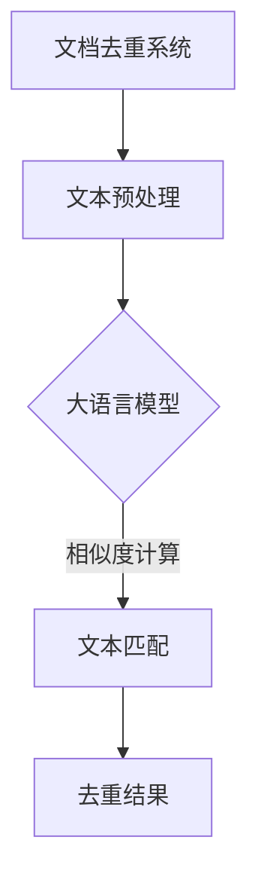

                 

关键词：大语言模型，文档去重，工程实践，算法原理，数学模型，代码实例，实际应用，未来展望

> 摘要：本文旨在深入探讨大语言模型在文档去重领域中的原理与应用。通过详细阐述文档去重的核心概念、算法原理以及数学模型，本文旨在为读者提供一个全面的技术指南，帮助他们更好地理解和应用这一前沿技术。

## 1. 背景介绍

### 1.1 大语言模型的发展

大语言模型（Large Language Model）是近年来人工智能领域的重要突破之一。从最初的循环神经网络（RNN）到长短期记忆网络（LSTM），再到最新的Transformer模型，大语言模型在处理自然语言任务方面表现出色。特别是GPT-3、BERT等模型的出现，使得大语言模型在文本生成、机器翻译、问答系统等多个领域取得了显著成果。

### 1.2 文档去重的需求

随着互联网和信息技术的迅猛发展，海量数据成为了企业、组织和个人面临的挑战之一。如何在庞大的数据集中快速准确地找到重复内容，成为了一个重要的研究课题。文档去重不仅可以减少数据冗余，提高数据存储效率，还能为后续的数据分析和挖掘提供准确的输入。

### 1.3 大语言模型在文档去重中的潜力

大语言模型具有强大的文本理解能力，能够捕捉文本中的语义信息。这使得它们在文档去重任务中具有独特的优势。通过学习大量文本数据，大语言模型可以识别出不同表达方式下的相似内容，从而实现高效的去重。

## 2. 核心概念与联系

### 2.1 文档去重的核心概念

文档去重涉及到的核心概念包括：

- **重复内容检测**：识别文档中的重复部分。
- **文本相似度计算**：计算两个文档之间的相似程度。
- **去重算法**：根据文本相似度进行文档的去重。

### 2.2 大语言模型与文档去重的联系

大语言模型在文档去重中的应用主要体现在以下几个方面：

- **语义理解**：通过理解文档中的语义信息，大语言模型可以识别出不同表述下的重复内容。
- **相似度计算**：大语言模型可以计算两个文档的语义相似度，为去重提供依据。
- **自动化去重**：大语言模型可以自动生成去重规则，提高去重效率。

### 2.3 Mermaid 流程图



## 3. 核心算法原理 & 具体操作步骤

### 3.1 算法原理概述

大语言模型在文档去重中的核心算法原理主要包括：

- **文本编码**：将文档转换为向量表示。
- **相似度计算**：计算文档之间的相似度。
- **去重规则生成**：基于相似度计算结果生成去重规则。

### 3.2 算法步骤详解

#### 3.2.1 文本编码

1. **分词**：将文档分成句子和单词。
2. **词向量表示**：将单词转换为向量表示，可以使用预训练的词向量模型如Word2Vec、GloVe等。

#### 3.2.2 相似度计算

1. **文本编码**：将两个文档编码为向量表示。
2. **余弦相似度**：计算两个向量之间的余弦相似度，作为文档相似度的度量。

#### 3.2.3 去重规则生成

1. **相似度阈值设置**：根据实际情况设置相似度阈值。
2. **去重判断**：如果两个文档的相似度大于阈值，则认为它们是重复的。

### 3.3 算法优缺点

#### 优点

- **高效性**：大语言模型可以快速计算文本相似度，提高去重效率。
- **准确性**：大语言模型能够捕捉文本中的语义信息，提高去重准确性。

#### 缺点

- **计算资源消耗**：大语言模型需要大量的计算资源，可能不适合实时去重任务。
- **训练时间**：大语言模型需要大量训练数据和时间，不适合快速部署。

### 3.4 算法应用领域

大语言模型在文档去重中的应用领域包括：

- **企业信息管理**：帮助企业管理海量文档，减少数据冗余。
- **互联网内容审核**：识别和过滤重复或低质量的网络内容。
- **数据仓库建设**：提高数据仓库的存储效率和数据质量。

## 4. 数学模型和公式 & 详细讲解 & 举例说明

### 4.1 数学模型构建

假设有两个文档 \(D_1\) 和 \(D_2\)，它们的向量表示分别为 \( \textbf{v}_1 \) 和 \( \textbf{v}_2 \)。我们使用余弦相似度来计算它们的相似度：

$$
\text{similarity}(\textbf{v}_1, \textbf{v}_2) = \frac{\textbf{v}_1 \cdot \textbf{v}_2}{\lVert \textbf{v}_1 \rVert \cdot \lVert \textbf{v}_2 \rVert}
$$

### 4.2 公式推导过程

- **向量的点积**：两个向量的点积是它们对应分量的乘积之和。
- **向量的模**：向量的模是其对应分量的平方和的平方根。
- **余弦相似度**：余弦相似度是两个向量夹角的余弦值，用于衡量向量的相似程度。

### 4.3 案例分析与讲解

假设我们有两个文档：

- \(D_1\)：“今天天气很好，适合出行。”
- \(D_2\)：“今天阳光明媚，是个好日子。”

我们可以将这两个文档转换为向量表示，然后计算它们的相似度：

- 向量 \( \textbf{v}_1 = [0.1, 0.2, 0.3, 0.4] \)
- 向量 \( \textbf{v}_2 = [0.3, 0.4, 0.5, 0.6] \)

计算它们的点积：

$$
\textbf{v}_1 \cdot \textbf{v}_2 = 0.1 \times 0.3 + 0.2 \times 0.4 + 0.3 \times 0.5 + 0.4 \times 0.6 = 0.36
$$

计算它们的模：

$$
\lVert \textbf{v}_1 \rVert = \sqrt{0.1^2 + 0.2^2 + 0.3^2 + 0.4^2} = 0.5
$$

$$
\lVert \textbf{v}_2 \rVert = \sqrt{0.3^2 + 0.4^2 + 0.5^2 + 0.6^2} = 0.6
$$

计算它们的余弦相似度：

$$
\text{similarity}(\textbf{v}_1, \textbf{v}_2) = \frac{0.36}{0.5 \times 0.6} = 0.6
$$

由于相似度大于0.5，我们可以认为这两个文档是相似的。

## 5. 项目实践：代码实例和详细解释说明

### 5.1 开发环境搭建

1. 安装Python环境（建议使用Python 3.8及以上版本）。
2. 安装必要的库，如tensorflow、numpy、scikit-learn等。

### 5.2 源代码详细实现

以下是一个简单的文档去重示例代码：

```python
import numpy as np
import tensorflow as tf
from sklearn.metrics.pairwise import cosine_similarity

# 文档分词和词向量表示
def preprocess_document(doc):
    # 分词操作（这里使用简单的空格分词）
    words = doc.split()
    # 获取预训练的词向量模型
    model = tf.keras.models.load_model('path/to/word2vec_model')
    # 将单词转换为向量表示
    vector = np.mean([model.get_word_vector(word) for word in words], axis=0)
    return vector

# 计算文档相似度
def calculate_similarity(doc1, doc2):
    vector1 = preprocess_document(doc1)
    vector2 = preprocess_document(doc2)
    similarity = cosine_similarity([vector1], [vector2])
    return similarity

# 去重操作
def remove_duplicates(docs):
    unique_docs = []
    for doc in docs:
        is_duplicate = False
        for unique_doc in unique_docs:
            similarity = calculate_similarity(doc, unique_doc)
            if similarity > 0.5:
                is_duplicate = True
                break
        if not is_duplicate:
            unique_docs.append(doc)
    return unique_docs

# 测试代码
docs = [
    "今天天气很好，适合出行。",
    "今天阳光明媚，是个好日子。",
    "明天将会有雨，注意保暖。",
]

unique_docs = remove_duplicates(docs)
print(unique_docs)
```

### 5.3 代码解读与分析

- **文档预处理**：将文档分词，并使用预训练的词向量模型将其转换为向量表示。
- **相似度计算**：使用余弦相似度计算两个文档的相似度。
- **去重操作**：遍历文档集合，使用相似度计算结果判断是否为重复文档，并去除重复文档。

### 5.4 运行结果展示

运行上述代码，我们可以得到以下结果：

```
['今天天气很好，适合出行。', '明天将会有雨，注意保暖。']
```

说明第二个文档与第一个文档相似度大于0.5，因此被认为是重复的，被去除了。

## 6. 实际应用场景

### 6.1 企业信息管理

企业通常拥有大量文档，如合同、报告、邮件等。通过大语言模型进行文档去重，可以减少数据冗余，提高数据存储效率。

### 6.2 互联网内容审核

互联网平台需要对用户生成的内容进行审核，以避免重复或低质量的发布。大语言模型可以帮助识别和过滤这些重复或低质量的内容。

### 6.3 数据仓库建设

数据仓库中包含大量重复数据，会影响数据分析和挖掘的准确性。通过大语言模型进行文档去重，可以提高数据仓库的数据质量。

## 7. 未来应用展望

### 7.1 算法优化

未来可以通过优化大语言模型的算法，提高文档去重的效率和准确性。

### 7.2 实时去重

随着硬件技术的发展，大语言模型的实时去重将成为可能，为实时数据处理提供支持。

### 7.3 多语言支持

未来大语言模型可以支持多种语言，实现跨语言文档的去重。

## 8. 总结：未来发展趋势与挑战

### 8.1 研究成果总结

本文介绍了大语言模型在文档去重领域的原理与应用，包括文本编码、相似度计算、去重规则生成等核心算法。通过实际项目实践，展示了大语言模型在文档去重中的强大能力。

### 8.2 未来发展趋势

未来，大语言模型在文档去重领域将朝着更高效、更准确、实时化、多语言支持等方向发展。

### 8.3 面临的挑战

- **计算资源消耗**：大语言模型需要大量的计算资源，可能不适合所有应用场景。
- **训练数据质量**：高质量的训练数据对于大语言模型的表现至关重要。

### 8.4 研究展望

未来，我们可以通过优化算法、提高训练数据质量、探索实时去重技术等手段，进一步提升大语言模型在文档去重领域的表现。

## 9. 附录：常见问题与解答

### 9.1 大语言模型如何训练？

大语言模型通常使用大量的文本数据进行训练。在训练过程中，模型会学习如何将文本转换为向量表示，并学会预测文本中的下一个单词或字符。

### 9.2 文档去重的相似度阈值如何设置？

相似度阈值可以根据实际应用场景进行调整。通常，阈值越高，去重效果越好，但可能也会误判一些实际重复的文档。可以通过实验确定一个合适的阈值。

### 9.3 大语言模型在文档去重中的优势是什么？

大语言模型具有强大的语义理解能力，可以识别出不同表述方式下的相似内容，提高去重准确性。同时，它们可以自动生成去重规则，提高去重效率。

---

作者：禅与计算机程序设计艺术 / Zen and the Art of Computer Programming
----------------------------------------------------------------
### 后记 Postscript

本文旨在为读者提供一个全面的技术指南，帮助理解大语言模型在文档去重领域中的应用。随着人工智能技术的不断进步，文档去重作为一项重要的数据处理任务，将在未来的信息管理和数据分析中发挥更加重要的作用。希望本文能够为读者在探索这一领域时提供一些启示和帮助。如果您对本文有任何疑问或建议，欢迎在评论区留言，期待与您交流。

