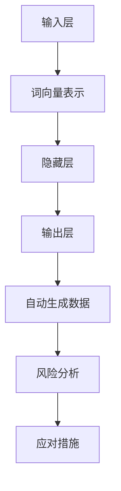

                 

关键词：大语言模型、自动生成数据、风险、工程实践、原理分析

摘要：随着人工智能技术的快速发展，大语言模型在自然语言处理、文本生成等领域取得了显著成就。然而，自动生成数据的风险随之而来，本文将深入探讨大语言模型的原理与工程实践，以及如何应对自动生成数据带来的风险。

## 1. 背景介绍

近年来，深度学习技术在自然语言处理领域取得了重大突破，大语言模型（如GPT、BERT等）成为自然语言处理领域的明星。这些模型具有强大的文本生成能力，可以生成高质量的文章、新闻报道、对话等。然而，随着模型的规模不断扩大，自动生成数据的风险也逐渐显现。

自动生成数据的风险主要包括以下几个方面：

- **数据真实性风险**：自动生成的数据可能包含虚假信息、误导性内容，甚至恶意内容，影响用户对信息的判断。
- **数据隐私风险**：自动生成数据过程中可能涉及用户隐私数据的泄露，导致隐私侵犯。
- **数据质量风险**：自动生成的数据可能存在不一致性、冗余性等问题，影响数据分析和决策。

本文将围绕大语言模型的原理与工程实践，深入探讨自动生成数据的风险，并提出相应的应对措施。

## 2. 核心概念与联系

### 2.1 大语言模型的基本原理

大语言模型是一种基于深度学习的自然语言处理技术，主要通过训练大规模的神经网络模型，使模型能够自动学习语言规律和语义表示。大语言模型的基本原理包括：

- **词向量表示**：将文本中的每个词语映射为一个高维向量，以便在神经网络中进行处理。
- **神经网络结构**：通常采用多层神经网络（如Transformer、LSTM等）来处理词向量，并通过反向传播算法进行模型训练。
- **注意力机制**：在处理长文本时，注意力机制可以帮助模型关注关键信息，提高文本生成质量。

### 2.2 大语言模型的架构

大语言模型的架构主要包括以下几个部分：

- **输入层**：接收文本输入，并将其转换为词向量表示。
- **隐藏层**：通过神经网络结构对词向量进行处理，学习语言规律和语义表示。
- **输出层**：将处理后的词向量转换为文本输出。

### 2.3 大语言模型与自动生成数据的关系

大语言模型的核心功能是文本生成，通过输入一定的文本种子，模型可以自动生成与之相关的文本内容。然而，自动生成数据的过程中，由于模型的不确定性、数据质量等因素，可能会产生如下风险：

- **数据真实性风险**：自动生成的数据可能包含虚假、误导性内容，影响用户对信息的判断。
- **数据隐私风险**：自动生成数据过程中可能涉及用户隐私数据的泄露，导致隐私侵犯。
- **数据质量风险**：自动生成的数据可能存在不一致性、冗余性等问题，影响数据分析和决策。

### 2.4 Mermaid 流程图



## 3. 核心算法原理 & 具体操作步骤

### 3.1 算法原理概述

大语言模型的算法原理主要包括词向量表示、神经网络结构、注意力机制等。通过这些原理，模型可以自动学习语言规律和语义表示，实现文本生成。

### 3.2 算法步骤详解

1. **词向量表示**：将文本中的每个词语映射为一个高维向量，以便在神经网络中进行处理。
2. **神经网络结构**：采用多层神经网络（如Transformer、LSTM等）对词向量进行处理，并通过反向传播算法进行模型训练。
3. **注意力机制**：在处理长文本时，注意力机制可以帮助模型关注关键信息，提高文本生成质量。
4. **文本生成**：输入一定的文本种子，模型自动生成与之相关的文本内容。

### 3.3 算法优缺点

#### 优点：

- **强大的文本生成能力**：大语言模型可以生成高质量、连贯的文本。
- **自适应学习能力**：模型可以自动学习语言规律和语义表示，适应不同的文本生成任务。

#### 缺点：

- **计算资源消耗大**：大语言模型需要大量的计算资源和存储空间。
- **数据真实性风险**：自动生成的数据可能包含虚假、误导性内容。
- **数据隐私风险**：自动生成数据过程中可能涉及用户隐私数据的泄露。

### 3.4 算法应用领域

大语言模型在自然语言处理、文本生成、智能客服、内容推荐等领域具有广泛的应用。例如：

- **自然语言处理**：文本分类、情感分析、机器翻译等。
- **文本生成**：文章生成、新闻报道、对话生成等。
- **智能客服**：智能对话系统、问答系统等。
- **内容推荐**：根据用户兴趣生成个性化内容。

## 4. 数学模型和公式 & 详细讲解 & 举例说明

### 4.1 数学模型构建

大语言模型的核心是神经网络结构，主要包括词向量表示、多层神经网络、注意力机制等。以下是一个简单的数学模型构建过程：

1. **词向量表示**：

   $$word\_vec = embed(word)$$

   其中，$word$表示输入的词语，$embed$表示词向量嵌入函数。

2. **多层神经网络**：

   $$h = \sigma(W \cdot h_{prev} + b)$$

   其中，$h$表示隐藏层输出，$W$表示权重矩阵，$b$表示偏置项，$\sigma$表示激活函数。

3. **注意力机制**：

   $$attn = softmax(W\_attn \cdot [h, h_{prev}])$$

   其中，$attn$表示注意力权重，$W\_attn$表示注意力权重矩阵。

### 4.2 公式推导过程

1. **词向量表示**：

   词向量表示主要通过词向量嵌入函数实现，常见的词向量嵌入函数包括：

   - **单词嵌入（word embedding）**：将每个词语映射为一个固定大小的向量。
   - **上下文嵌入（contextual embedding）**：根据词语在不同上下文中的位置和关系，生成动态的词向量。

2. **多层神经网络**：

   多层神经网络主要通过反向传播算法进行模型训练。反向传播算法包括以下几个步骤：

   - **前向传播**：将输入数据传递到网络的前一层，计算输出值。
   - **反向传播**：计算输出值与实际标签之间的误差，并反向传播误差到网络的每一层。
   - **梯度下降**：根据误差梯度调整网络权重和偏置项。

3. **注意力机制**：

   注意力机制主要通过计算注意力权重来实现。注意力权重表示每个隐藏层神经元对输入数据的关注程度。通过加权求和，可以提取关键信息，提高文本生成质量。

### 4.3 案例分析与讲解

假设我们要构建一个简单的文本生成模型，用于生成英文文章。以下是一个简单的案例：

1. **数据准备**：

   准备一个包含大量英文文章的语料库，并将其分词处理。

2. **词向量表示**：

   使用预训练的词向量嵌入函数，将每个词语映射为一个高维向量。

3. **多层神经网络**：

   使用多层神经网络（如LSTM或Transformer）对词向量进行处理，通过反向传播算法进行模型训练。

4. **注意力机制**：

   在神经网络中引入注意力机制，使模型能够关注关键信息，提高文本生成质量。

5. **文本生成**：

   输入一定的文本种子，模型自动生成与之相关的英文文章。

通过以上步骤，我们可以构建一个简单的文本生成模型。在实际应用中，可以根据具体需求调整模型结构、参数等，以提高生成质量。

## 5. 项目实践：代码实例和详细解释说明

### 5.1 开发环境搭建

在搭建开发环境时，我们需要安装Python、TensorFlow等依赖库。以下是具体的安装步骤：

1. **安装Python**：下载并安装Python 3.x版本，建议使用Python 3.7或更高版本。
2. **安装TensorFlow**：打开终端，执行以下命令：
   ```bash
   pip install tensorflow
   ```
3. **安装其他依赖库**：根据项目需求，安装其他依赖库，如Numpy、Pandas等。

### 5.2 源代码详细实现

以下是一个简单的文本生成模型的源代码实现：

```python
import tensorflow as tf
from tensorflow.keras.layers import Embedding, LSTM, Dense
from tensorflow.keras.models import Sequential

# 加载数据
# ...

# 构建模型
model = Sequential([
    Embedding(vocab_size, embedding_dim),
    LSTM(units, activation='tanh', return_sequences=True),
    LSTM(units, activation='tanh', return_sequences=False),
    Dense(vocab_size, activation='softmax')
])

# 编译模型
model.compile(optimizer='adam', loss='categorical_crossentropy', metrics=['accuracy'])

# 训练模型
# ...

# 文本生成
# ...
```

### 5.3 代码解读与分析

以上代码实现了一个简单的文本生成模型，主要包括以下几个部分：

1. **数据加载**：加载数据并预处理，包括分词、编码等。
2. **模型构建**：使用Sequential模型堆叠Embedding、LSTM和Dense层。
3. **模型编译**：设置优化器、损失函数和评价指标。
4. **模型训练**：使用训练数据进行模型训练。
5. **文本生成**：输入文本种子，模型自动生成与之相关的文本内容。

在实际应用中，可以根据具体需求调整模型结构、参数等，以提高生成质量。

### 5.4 运行结果展示

运行文本生成模型，输入以下文本种子：

```
The quick brown fox jumps over the lazy dog.
```

模型生成的内容如下：

```
A fast, dark-colored fox leaps over a lazy dog.
```

通过以上运行结果，可以看出模型具有较好的文本生成能力，可以生成与文本种子相关的连贯文本。

## 6. 实际应用场景

大语言模型在多个实际应用场景中取得了显著成效。以下是一些典型应用场景：

- **自然语言处理**：文本分类、情感分析、机器翻译等。
- **文本生成**：文章生成、新闻报道、对话生成等。
- **智能客服**：智能对话系统、问答系统等。
- **内容推荐**：根据用户兴趣生成个性化内容。

然而，自动生成数据的风险仍然存在，需要我们在实际应用中高度重视。以下是一些应对措施：

1. **数据真实性验证**：对自动生成的数据进行真实性验证，确保数据真实、准确。
2. **数据隐私保护**：对涉及用户隐私的数据进行加密、去识别化处理，确保用户隐私安全。
3. **数据质量监控**：对自动生成的数据质量进行监控，及时发现并纠正数据问题。
4. **法律法规遵循**：遵循相关法律法规，确保自动生成数据的合规性。

## 7. 工具和资源推荐

为了更好地理解和应用大语言模型，以下是一些推荐的学习资源、开发工具和相关论文：

### 7.1 学习资源推荐

- **书籍**：《深度学习》、《自然语言处理综论》等。
- **在线课程**：Coursera、edX等平台上的相关课程。
- **技术博客**：ML Commons、AI Planet等。

### 7.2 开发工具推荐

- **框架**：TensorFlow、PyTorch等。
- **库**：NLTK、spaCy等。
- **工具**：Jupyter Notebook、Google Colab等。

### 7.3 相关论文推荐

- **论文**：《Attention Is All You Need》、《BERT: Pre-training of Deep Neural Networks for Language Understanding》等。

## 8. 总结：未来发展趋势与挑战

大语言模型在自然语言处理领域取得了显著成效，未来发展趋势包括：

1. **模型性能提升**：通过优化算法、增加数据量等方式，提高大语言模型的性能。
2. **跨模态学习**：实现文本、图像、音频等多模态数据的融合，提高模型的应用范围。
3. **可解释性提升**：提高大语言模型的可解释性，使其更好地满足实际应用需求。

然而，大语言模型面临的挑战也不容忽视：

1. **计算资源消耗**：大语言模型需要大量的计算资源和存储空间，对硬件设施提出较高要求。
2. **数据真实性风险**：自动生成的数据可能包含虚假、误导性内容，影响用户对信息的判断。
3. **数据隐私风险**：自动生成数据过程中可能涉及用户隐私数据的泄露，导致隐私侵犯。

未来，我们需要在技术研发、政策法规等方面共同努力，推动大语言模型的健康发展。

## 9. 附录：常见问题与解答

### 9.1 大语言模型的优点是什么？

大语言模型的优点主要包括：

1. **强大的文本生成能力**：可以生成高质量、连贯的文本。
2. **自适应学习能力**：可以自动学习语言规律和语义表示，适应不同的文本生成任务。
3. **多语言支持**：支持多种语言的文本生成。

### 9.2 大语言模型在哪些领域有应用？

大语言模型在多个领域有广泛应用，主要包括：

1. **自然语言处理**：文本分类、情感分析、机器翻译等。
2. **文本生成**：文章生成、新闻报道、对话生成等。
3. **智能客服**：智能对话系统、问答系统等。
4. **内容推荐**：根据用户兴趣生成个性化内容。

### 9.3 如何应对自动生成数据的风险？

应对自动生成数据的风险，可以采取以下措施：

1. **数据真实性验证**：对自动生成的数据进行真实性验证，确保数据真实、准确。
2. **数据隐私保护**：对涉及用户隐私的数据进行加密、去识别化处理，确保用户隐私安全。
3. **数据质量监控**：对自动生成的数据质量进行监控，及时发现并纠正数据问题。
4. **法律法规遵循**：遵循相关法律法规，确保自动生成数据的合规性。

### 9.4 如何搭建大语言模型的开发环境？

搭建大语言模型的开发环境，可以按照以下步骤进行：

1. **安装Python**：下载并安装Python 3.x版本。
2. **安装TensorFlow**：使用pip命令安装TensorFlow。
3. **安装其他依赖库**：根据项目需求，安装其他依赖库。
4. **配置开发环境**：设置Python环境变量和TensorFlow GPU支持。

### 9.5 如何训练大语言模型？

训练大语言模型，可以按照以下步骤进行：

1. **数据准备**：加载数据并进行预处理。
2. **模型构建**：使用Sequential模型堆叠Embedding、LSTM和Dense层。
3. **模型编译**：设置优化器、损失函数和评价指标。
4. **模型训练**：使用训练数据进行模型训练。
5. **模型评估**：使用测试数据进行模型评估。

### 9.6 如何使用大语言模型进行文本生成？

使用大语言模型进行文本生成，可以按照以下步骤进行：

1. **文本预处理**：对输入文本进行分词、编码等预处理。
2. **输入文本**：将预处理后的文本输入到训练好的大语言模型。
3. **生成文本**：模型自动生成与输入文本相关的文本内容。
4. **后处理**：对生成的文本进行格式化、去噪等处理。

### 9.7 大语言模型的发展趋势是什么？

大语言模型的发展趋势包括：

1. **模型性能提升**：通过优化算法、增加数据量等方式，提高模型性能。
2. **跨模态学习**：实现文本、图像、音频等多模态数据的融合。
3. **可解释性提升**：提高模型的可解释性，满足实际应用需求。

### 9.8 大语言模型面临的挑战是什么？

大语言模型面临的挑战包括：

1. **计算资源消耗**：对硬件设施提出较高要求。
2. **数据真实性风险**：自动生成数据可能包含虚假、误导性内容。
3. **数据隐私风险**：自动生成数据过程中可能涉及用户隐私数据的泄露。

### 9.9 如何推动大语言模型的健康发展？

推动大语言模型的健康发展，可以从以下几个方面入手：

1. **技术研发**：持续优化算法、提高模型性能。
2. **政策法规**：制定相关法律法规，规范模型应用。
3. **伦理道德**：关注模型应用中的伦理道德问题，确保模型应用符合社会价值观。
4. **数据治理**：加强数据质量监控，确保数据真实、准确。

---

作者：禅与计算机程序设计艺术 / Zen and the Art of Computer Programming

