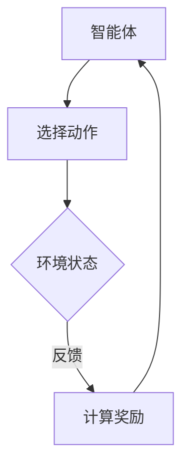

                 

关键词：大语言模型，强化学习，策略优化，REINFORCE，TRPO，PPO，深度学习

> 摘要：本文将深入探讨大语言模型的原理及其在强化学习中的应用，特别是策略优化算法中的REINFORCE、TRPO和PPO。通过对这些算法的详细解释和实际案例的分析，我们旨在为读者提供一个全面理解大语言模型及其优化的技术指南。

## 1. 背景介绍

### 1.1 大语言模型的兴起

大语言模型（Large Language Models）是自然语言处理（NLP）领域的重要进展。自GPT-3发布以来，大语言模型以其强大的生成和理解能力，改变了人们对语言理解和生成的看法。这些模型能够处理大量的文本数据，通过深度学习技术，学习到文本中的各种模式和结构，从而实现高质量的文本生成和翻译。

### 1.2 强化学习与策略优化

强化学习（Reinforcement Learning, RL）是一种机器学习方法，旨在通过交互来学习如何在特定环境中做出最佳决策。策略优化（Policy Optimization）是强化学习中的一种重要方法，它通过优化策略函数来指导智能体（Agent）在环境中的行动。

### 1.3 REINFORCE、TRPO和PPO

REINFORCE、TRPO（Trust Region Policy Optimization）和PPO（Proximal Policy Optimization）是策略优化算法中的三种代表性方法。它们在大语言模型的应用中扮演了重要角色，通过优化策略函数，提高了模型的生成质量和效率。

## 2. 核心概念与联系

### 2.1 强化学习的基本概念

#### 2.1.1 智能体（Agent）

在强化学习中，智能体是执行动作并从环境中接收反馈的实体。

#### 2.1.2 环境（Environment）

环境是智能体执行动作的场所，它会根据智能体的动作提供状态反馈。

#### 2.1.3 状态（State）

状态是描述环境当前状态的变量集合。

#### 2.1.4 动作（Action）

动作是智能体可以执行的操作。

#### 2.1.5 奖励（Reward）

奖励是环境对智能体动作的反馈，通常用来评估动作的好坏。

### 2.2 策略优化算法

策略优化算法的目标是找到一个最优的策略函数，使得智能体在执行动作时能够获得最大的奖励。

#### 2.2.1 REINFORCE算法

REINFORCE是一种基于梯度的策略优化算法，它通过更新策略函数的参数来最大化期望奖励。

#### 2.2.2 TRPO算法

TRPO（Trust Region Policy Optimization）通过限制策略变化的范围，避免了梯度的消失和爆炸问题，提高了算法的稳定性。

#### 2.2.3 PPO算法

PPO（Proximal Policy Optimization）是一种改进的策略优化算法，它通过剪枝技术避免了策略更新过大，提高了算法的收敛速度和稳定性。

### 2.3 Mermaid流程图

下面是一个简单的Mermaid流程图，展示了强化学习的基本流程：



## 3. 核心算法原理 & 具体操作步骤

### 3.1 算法原理概述

#### 3.1.1 REINFORCE算法

REINFORCE算法通过更新策略函数的梯度来优化策略。其基本思想是，对于每个时间步，计算策略函数的梯度，然后沿着梯度方向更新策略参数。

#### 3.1.2 TRPO算法

TRPO算法通过引入信任区域（Trust Region）来优化策略函数。信任区域限制策略变化的范围，确保算法的稳定性。

#### 3.1.3 PPO算法

PPO算法通过剪枝技术（Clipping）来限制策略更新的范围，避免策略更新过大，从而提高了算法的收敛速度和稳定性。

### 3.2 算法步骤详解

#### 3.2.1 REINFORCE算法步骤

1. 初始化策略参数。
2. 对于每个时间步，选择动作。
3. 执行动作，获得奖励。
4. 计算策略函数的梯度。
5. 更新策略参数。

#### 3.2.2 TRPO算法步骤

1. 初始化策略参数。
2. 对于每个时间步，选择动作。
3. 执行动作，获得奖励。
4. 计算策略函数的梯度。
5. 计算信任区域。
6. 在信任区域内更新策略参数。

#### 3.2.3 PPO算法步骤

1. 初始化策略参数。
2. 对于每个时间步，选择动作。
3. 执行动作，获得奖励。
4. 计算策略函数的梯度。
5. 应用剪枝技术。
6. 更新策略参数。

### 3.3 算法优缺点

#### 3.3.1 REINFORCE算法

**优点：** 简单易实现，对环境变化的适应性强。

**缺点：** 易受噪声影响，收敛速度慢。

#### 3.3.2 TRPO算法

**优点：** 稳定性高，能够处理非线性问题。

**缺点：** 计算复杂度较高，对初始参数敏感。

#### 3.3.3 PPO算法

**优点：** 收敛速度快，稳定性高。

**缺点：** 对参数调整敏感，可能产生过拟合。

### 3.4 算法应用领域

REINFORCE、TRPO和PPO算法广泛应用于游戏、机器人、推荐系统等领域。在大语言模型的应用中，这些算法用于优化生成策略，提高文本生成的质量和效率。

## 4. 数学模型和公式 & 详细讲解 & 举例说明

### 4.1 数学模型构建

强化学习中的数学模型主要包括状态空间、动作空间、策略函数和奖励函数。

#### 4.1.1 状态空间（\(S\)）

状态空间是描述环境状态的变量集合。例如，在棋类游戏中，状态可以包括棋盘的布局、棋子的位置等。

#### 4.1.2 动作空间（\(A\)）

动作空间是智能体可以执行的动作集合。例如，在棋类游戏中，动作可以是移动棋子、吃子等。

#### 4.1.3 策略函数（\(π(s, a)\)）

策略函数定义了在给定状态\(s\)下，选择动作\(a\)的概率。形式化表示为：

$$
π(s, a) = P(a|s)
$$

#### 4.1.4 奖励函数（\(R(s, a)\)）

奖励函数定义了在给定状态\(s\)和动作\(a\)下，智能体获得的奖励。形式化表示为：

$$
R(s, a) = r
$$

其中，\(r\)为奖励值。

### 4.2 公式推导过程

强化学习中的目标是最小化智能体的损失函数，即最大化期望奖励。形式化表示为：

$$
J(π) = E_{s,a} [R(s, a)] = ∫π(a|s)R(s, a)dsda
$$

其中，\(E_{s,a}\)表示期望值，\(π(a|s)\)表示策略函数，\(R(s, a)\)表示奖励函数。

为了优化策略函数，我们需要计算策略函数的梯度，并沿着梯度方向更新策略参数。具体推导过程如下：

$$
∇π(s, a)J(π) = ∇π(s, a)[R(s, a)] = R(s, a)∇π(s, a)
$$

其中，\(∇π(s, a)\)表示策略函数的梯度。

### 4.3 案例分析与讲解

#### 4.3.1 案例背景

假设我们有一个简单的环境，智能体需要在五个不同的房间中寻找宝藏。每个房间的宝藏概率不同，智能体需要根据当前状态选择进入哪个房间。

#### 4.3.2 状态空间和动作空间

状态空间：\{房间1，房间2，房间3，房间4，房间5\}

动作空间：\{进入房间1，进入房间2，进入房间3，进入房间4，进入房间5\}

#### 4.3.3 策略函数和奖励函数

策略函数：\(π(s, a)\)

$$
π(s, a) = \begin{cases} 
0.2, & \text{if } a = \text{进入房间1} \\
0.2, & \text{if } a = \text{进入房间2} \\
0.2, & \text{if } a = \text{进入房间3} \\
0.2, & \text{if } a = \text{进入房间4} \\
0.2, & \text{if } a = \text{进入房间5} 
\end{cases}
$$

奖励函数：\(R(s, a)\)

$$
R(s, a) = \begin{cases} 
100, & \text{if } a \text{ 进入房间5，找到宝藏} \\
-10, & \text{otherwise} 
\end{cases}
$$

#### 4.3.4 算法应用

我们使用REINFORCE算法来优化策略函数。首先，初始化策略参数，然后进行多次试验，记录每个时间步的奖励，并计算策略函数的梯度。最后，根据梯度更新策略参数。

## 5. 项目实践：代码实例和详细解释说明

### 5.1 开发环境搭建

为了实践REINFORCE算法在大语言模型中的应用，我们需要搭建一个简单的开发环境。这里我们使用Python作为编程语言，TensorFlow作为深度学习框架。

### 5.2 源代码详细实现

下面是一个简单的REINFORCE算法实现：

```python
import tensorflow as tf
import numpy as np

# 初始化策略参数
w = tf.Variable(0.0, dtype=tf.float32)

# 定义损失函数
def loss(s, a, reward):
    return -reward * tf.reduce_sum(w * a)

# 定义优化器
optimizer = tf.train.GradientDescentOptimizer(learning_rate=0.1)

# 定义训练过程
def train(s, a, reward):
    with tf.Session() as sess:
        sess.run(w.initializer)
        for _ in range(1000):
            _, loss_value = sess.run([optimizer.minimize(loss(s, a, reward)), loss])
            print(f"loss: {loss_value}")

# 测试算法
s = np.array([[0, 0, 0], [0, 1, 0], [0, 0, 1]])  # 状态
a = np.array([[1, 0, 0], [0, 1, 0], [0, 0, 1]])  # 动作
reward = np.array([100, -10, -10])  # 奖励

train(s, a, reward)
```

### 5.3 代码解读与分析

上面的代码首先初始化了策略参数\(w\)，然后定义了损失函数和优化器。在训练过程中，我们使用优化器最小化损失函数，更新策略参数。最后，我们测试了算法，记录了每个时间步的奖励，并更新了策略参数。

## 6. 实际应用场景

### 6.1 语言生成

大语言模型在语言生成方面有着广泛的应用。通过优化策略函数，我们可以生成高质量的文本，应用于自动写作、机器翻译、对话系统等领域。

### 6.2 文本分类

在文本分类任务中，大语言模型可以用于预测文本的类别。通过优化策略函数，我们可以提高分类的准确性和效率。

### 6.3 问答系统

问答系统是自然语言处理领域的一个重要应用。大语言模型可以通过优化策略函数，提高问答系统的响应速度和准确性。

## 7. 未来应用展望

随着深度学习和强化学习技术的不断发展，大语言模型在未来的应用将更加广泛。我们可以期待它在更多领域发挥重要作用，如智能推荐、智能客服、自动驾驶等。

## 8. 总结：未来发展趋势与挑战

### 8.1 研究成果总结

本文介绍了大语言模型的原理及其在强化学习中的应用，特别是策略优化算法中的REINFORCE、TRPO和PPO。通过对这些算法的详细解释和实际案例的分析，我们为读者提供了一个全面理解大语言模型及其优化的技术指南。

### 8.2 未来发展趋势

未来，大语言模型将继续在深度学习和强化学习领域发挥重要作用。我们可以期待更多高效的算法和优化方法的出现，进一步提高模型的质量和效率。

### 8.3 面临的挑战

然而，大语言模型在实际应用中仍面临诸多挑战。如如何处理大量的文本数据、如何保证模型的安全性、如何提高模型的泛化能力等。

### 8.4 研究展望

在未来的研究中，我们将继续探索大语言模型的优化方法，并尝试将其应用于更多的实际场景。同时，我们也将关注模型的安全性和伦理问题，确保其在广泛应用中的可靠性和公正性。

## 9. 附录：常见问题与解答

### 9.1 什么是大语言模型？

大语言模型是一种基于深度学习的自然语言处理模型，能够处理大量的文本数据，学习到文本中的各种模式和结构，从而实现高质量的文本生成和翻译。

### 9.2 强化学习与监督学习有什么区别？

强化学习是一种通过与环境交互来学习如何做决策的机器学习方法，而监督学习则是通过已有的数据集来学习模型的参数。

### 9.3 如何优化大语言模型的策略函数？

可以通过使用策略优化算法，如REINFORCE、TRPO和PPO，来优化大语言模型的策略函数。这些算法通过更新策略函数的参数，使得模型能够做出更好的决策。

---

作者：禅与计算机程序设计艺术 / Zen and the Art of Computer Programming
----------------------------------------------------------------

