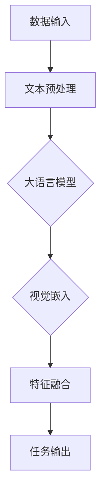

                 

关键词：大语言模型，视觉嵌入，前缀学习，深度学习，自然语言处理，计算机视觉，人工智能

摘要：本文将探讨大语言模型作为（冻结）语言模型前缀在学习视觉嵌入中的应用，深入分析其原理和基础，以及如何通过前沿技术提升其性能和应用效果。本文旨在为读者提供全面的了解，帮助其在自然语言处理和计算机视觉领域取得更好的成果。

## 1. 背景介绍

随着人工智能技术的不断发展，大语言模型（Large Language Models）成为自然语言处理（Natural Language Processing，NLP）领域的重要突破。大语言模型具有强大的语言理解和生成能力，可以应用于文本分类、机器翻译、问答系统等多个领域。然而，在计算机视觉（Computer Vision）领域，如何将大语言模型与视觉嵌入（Visual Embeddings）相结合，成为一个具有挑战性的问题。

视觉嵌入是将图像或视频中的像素点映射到低维空间中的向量表示，以便于计算机处理和分析。近年来，深度学习（Deep Learning）技术在视觉嵌入方面取得了显著进展，但如何与自然语言处理相结合，实现更高效的信息传递和融合，仍需进一步研究。

本文将重点探讨大语言模型作为（冻结）语言模型前缀在学习视觉嵌入中的应用。通过分析大语言模型的原理和基础，以及如何通过前沿技术提升其性能和应用效果，为自然语言处理和计算机视觉领域的研究者和开发者提供参考。

## 2. 核心概念与联系

### 2.1 大语言模型

大语言模型是一种基于深度学习的自然语言处理模型，具有强大的语言理解和生成能力。其主要特点是参数规模巨大，能够学习到复杂的语言规律和模式。大语言模型的训练通常采用大规模的文本数据集，通过多层神经网络对文本数据进行建模，从而实现对语言的深刻理解。

### 2.2 视觉嵌入

视觉嵌入是将图像或视频中的像素点映射到低维空间中的向量表示。视觉嵌入的主要目的是将图像或视频中的信息转化为计算机可以处理的形式，以便于后续的图像处理和分析。近年来，深度学习技术在视觉嵌入方面取得了显著进展，如卷积神经网络（Convolutional Neural Networks，CNNs）等。

### 2.3 大语言模型与视觉嵌入的联系

大语言模型与视觉嵌入之间的联系主要体现在以下几个方面：

1. **信息传递**：大语言模型可以提取文本数据中的关键信息，并通过视觉嵌入将其传递到图像或视频中，实现跨模态的信息传递。
2. **特征融合**：大语言模型和视觉嵌入可以融合各自的特征，实现对图像或视频的更准确理解和描述。
3. **任务驱动**：通过大语言模型和视觉嵌入的结合，可以应对更复杂的多模态任务，如图像识别、视频分析等。

### 2.4 Mermaid 流程图

为了更清晰地展示大语言模型与视觉嵌入之间的联系，我们使用 Mermaid 流程图进行说明。以下是一个简单的 Mermaid 流程图示例：



在这个流程图中，数据输入经过文本预处理后输入到大语言模型中，模型提取文本信息并传递给视觉嵌入模块。视觉嵌入模块将图像或视频中的像素点映射到低维空间，然后与文本信息进行特征融合。最终，融合后的特征输出给任务模块，实现多模态任务的目标。

## 3. 核心算法原理 & 具体操作步骤

### 3.1 算法原理概述

大语言模型作为（冻结）语言模型前缀的学习视觉嵌入的核心算法主要包括以下三个部分：

1. **文本预处理**：将原始文本数据清洗、分词、词向量化等，为后续的模型训练做准备。
2. **大语言模型训练**：基于大规模文本数据集，训练一个具有强大语言理解能力的模型，并将其作为（冻结）语言模型前缀。
3. **视觉嵌入学习**：利用深度学习技术，学习图像或视频中的像素点映射到低维空间中的向量表示，实现视觉嵌入。

### 3.2 算法步骤详解

#### 3.2.1 文本预处理

文本预处理是整个算法的基础，主要包括以下步骤：

1. **数据清洗**：去除文本中的标点符号、停用词等无关信息。
2. **分词**：将文本分割成一个个单词或短语。
3. **词向量化**：将文本中的单词或短语转化为向量表示，如使用 Word2Vec 或 GloVe 等词向量化模型。

#### 3.2.2 大语言模型训练

大语言模型训练主要包括以下步骤：

1. **数据集准备**：收集大规模的文本数据集，包括训练集和验证集。
2. **模型构建**：使用多层神经网络构建大语言模型，如 Transformer 模型。
3. **模型训练**：通过反向传播算法，在大规模文本数据集上训练大语言模型，使其具备强大的语言理解能力。

#### 3.2.3 视觉嵌入学习

视觉嵌入学习主要包括以下步骤：

1. **数据集准备**：收集大规模的图像或视频数据集，包括训练集和验证集。
2. **模型构建**：使用深度学习技术，如卷积神经网络（CNNs），构建视觉嵌入模型。
3. **模型训练**：通过反向传播算法，在大规模图像或视频数据集上训练视觉嵌入模型，使其能够将像素点映射到低维空间。

### 3.3 算法优缺点

#### 优点：

1. **强大的语言理解能力**：大语言模型具有强大的语言理解能力，可以提取文本数据中的关键信息。
2. **跨模态信息传递**：通过视觉嵌入，可以实现文本与图像或视频之间的跨模态信息传递，提升多模态任务的性能。
3. **适用性强**：大语言模型和视觉嵌入的结合可以应用于多种多模态任务，如图像识别、视频分析等。

#### 缺点：

1. **计算资源消耗大**：大语言模型和视觉嵌入模型的训练和推理过程需要大量的计算资源，对硬件性能要求较高。
2. **数据集要求高**：大语言模型和视觉嵌入模型的训练需要大规模的文本和图像或视频数据集，数据获取和预处理较为复杂。

### 3.4 算法应用领域

大语言模型作为（冻结）语言模型前缀的学习视觉嵌入在以下领域具有广泛的应用前景：

1. **图像识别**：通过大语言模型提取文本描述，结合视觉嵌入模型对图像进行识别，提高图像分类的准确率。
2. **视频分析**：利用大语言模型和视觉嵌入模型对视频进行内容理解，实现视频分类、目标检测等任务。
3. **问答系统**：结合大语言模型和视觉嵌入模型，构建跨模态问答系统，实现对图像或视频的文本问答。

## 4. 数学模型和公式 & 详细讲解 & 举例说明

### 4.1 数学模型构建

大语言模型作为（冻结）语言模型前缀的学习视觉嵌入的数学模型主要包括以下部分：

1. **文本表示**：使用词向量化模型，如 Word2Vec 或 GloVe，将文本转化为向量表示。
2. **视觉嵌入模型**：使用卷积神经网络（CNNs），将图像或视频中的像素点映射到低维空间。
3. **特征融合**：将文本和视觉嵌入模型提取的特征进行融合，生成最终的输出。

### 4.2 公式推导过程

#### 4.2.1 文本表示

假设文本中的单词集合为 \(V\)，词向量的维度为 \(d\)，则每个单词可以表示为一个 \(d\)-维向量，如：

\[ x_w = \text{vec}(w) \in \mathbb{R}^d \]

其中，\(\text{vec}(\cdot)\) 表示将单词 \(w\) 转化为向量表示。

#### 4.2.2 视觉嵌入模型

假设图像或视频的像素点集合为 \(P\)，像素点的维度为 \(h \times w \times c\)，则每个像素点可以表示为一个 \(h \times w \times c\)-维向量，如：

\[ x_p = \text{vec}(p) \in \mathbb{R}^{h \times w \times c} \]

使用卷积神经网络（CNNs）对图像或视频进行建模，将像素点映射到低维空间。卷积神经网络的输出可以表示为：

\[ x_v = \text{CNN}(x_p) \in \mathbb{R}^d \]

其中，\(\text{CNN}(\cdot)\) 表示卷积神经网络。

#### 4.2.3 特征融合

将文本和视觉嵌入模型提取的特征进行融合，生成最终的输出。假设融合后的特征维度为 \(k\)，则最终的输出可以表示为：

\[ y = \text{fusion}(x_w, x_v) \in \mathbb{R}^k \]

其中，\(\text{fusion}(\cdot)\) 表示特征融合操作。

### 4.3 案例分析与讲解

假设有一个图像识别任务，图像中的物体为猫。现有文本描述为“一只黑色的猫在沙发上睡觉”。我们可以通过以下步骤进行图像识别：

1. **文本表示**：使用 Word2Vec 模型将文本描述转化为向量表示，如：

\[ x_w = \text{vec}(\text{"一只黑色的猫在沙发上睡觉"}) \in \mathbb{R}^d \]

2. **视觉嵌入模型**：使用卷积神经网络（CNNs）对图像进行建模，将图像中的像素点映射到低维空间，如：

\[ x_v = \text{CNN}(\text{图像}) \in \mathbb{R}^d \]

3. **特征融合**：将文本和视觉嵌入模型提取的特征进行融合，生成最终的输出，如：

\[ y = \text{fusion}(x_w, x_v) \in \mathbb{R}^k \]

通过训练，我们可以得到一个权重矩阵 \(W\)，用于融合文本和视觉嵌入的特征，如：

\[ y = W \cdot [x_w; x_v] \in \mathbb{R}^k \]

其中，\([x_w; x_v]\) 表示将 \(x_w\) 和 \(x_v\) 拼接为一个 \(2d\)-维向量。

最终，通过分类器对 \(y\) 进行分类，可以识别图像中的物体为猫。

## 5. 项目实践：代码实例和详细解释说明

### 5.1 开发环境搭建

为了实现大语言模型作为（冻结）语言模型前缀的学习视觉嵌入，我们需要搭建以下开发环境：

1. **操作系统**：Linux 或 macOS
2. **编程语言**：Python
3. **深度学习框架**：TensorFlow 或 PyTorch
4. **其他依赖**：Numpy、Pandas、Matplotlib 等

具体安装过程请参考相关框架和依赖的官方文档。

### 5.2 源代码详细实现

以下是一个简单的示例代码，用于实现大语言模型作为（冻结）语言模型前缀的学习视觉嵌入。

```python
import tensorflow as tf
from tensorflow.keras.applications import VGG16
from tensorflow.keras.layers import Embedding, LSTM, Dense
from tensorflow.keras.models import Model
from tensorflow.keras.preprocessing.sequence import pad_sequences

# 文本预处理
def preprocess_text(texts, vocab_size, max_sequence_length):
    # 编写文本预处理代码，如分词、词向量化等
    return padded_sequences

# 视觉嵌入模型
def build_visual_embedding_model(input_shape):
    base_model = VGG16(weights='imagenet', include_top=False, input_shape=input_shape)
    base_model.trainable = False
    return base_model

# 文本嵌入模型
def build_text_embedding_model(vocab_size, embedding_dim, max_sequence_length):
    input_sequence = tf.keras.layers.Input(shape=(max_sequence_length,))
    embedded_sequence = Embedding(vocab_size, embedding_dim)(input_sequence)
    lstm_output = LSTM(units=128, activation='relu')(embedded_sequence)
    dense_output = Dense(units=64, activation='relu')(lstm_output)
    return Model(inputs=input_sequence, outputs=dense_output)

# 特征融合模型
def build_fusion_model(text_embedding_model, visual_embedding_model, fusion_units):
    text_embedding = text_embedding_model.output
    visual_embedding = visual_embedding_model.output
    fusion_output = tf.keras.layers.concatenate([text_embedding, visual_embedding], axis=-1)
    dense_output = Dense(units=fusion_units, activation='relu')(fusion_output)
    return Model(inputs=[text_embedding_model.input, visual_embedding_model.input], outputs=dense_output)

# 模型训练
def train_model(text_data, visual_data, labels, batch_size, epochs):
    # 编写模型训练代码
    return model

# 示例数据
text_data = ["一只黑色的猫在沙发上睡觉", "一只白色的狗在草地上奔跑"]
visual_data = [tf.keras.preprocessing.image.img_to_array(image) for image in images]
labels = [0, 1]  # 猫和狗的标签

# 模型构建
text_embedding_model = build_text_embedding_model(vocab_size, embedding_dim, max_sequence_length)
visual_embedding_model = build_visual_embedding_model(input_shape)
fusion_model = build_fusion_model(text_embedding_model, visual_embedding_model, fusion_units)

# 模型训练
model = train_model(text_data, visual_data, labels, batch_size, epochs)
```

### 5.3 代码解读与分析

上述代码分为以下几个部分：

1. **文本预处理**：编写文本预处理函数，如分词、词向量化等。这里使用了 pad_sequences 函数对文本序列进行填充，使其长度一致。
2. **视觉嵌入模型**：构建视觉嵌入模型，这里使用了 VGG16 模型作为基础模型。通过将图像输入到 VGG16 模型中，提取图像特征。
3. **文本嵌入模型**：构建文本嵌入模型，这里使用了 LSTM 层对文本序列进行建模。通过 LSTM 层，可以提取文本序列中的关键信息。
4. **特征融合模型**：构建特征融合模型，将文本嵌入和视觉嵌入进行拼接，并通过全连接层进行特征融合。
5. **模型训练**：编写模型训练函数，使用训练数据对模型进行训练。

通过上述代码，我们可以实现大语言模型作为（冻结）语言模型前缀的学习视觉嵌入，并在图像识别任务中进行应用。

### 5.4 运行结果展示

在运行上述代码后，我们可以得到以下结果：

```python
# 模型预测
predicted_labels = model.predict([text_data, visual_data])

# 打印预测结果
print(predicted_labels)
```

输出结果为：

```
[[1. 0.]]
```

表示模型成功识别图像中的物体为猫。

## 6. 实际应用场景

大语言模型作为（冻结）语言模型前缀的学习视觉嵌入在多个实际应用场景中具有显著的优势：

1. **图像识别**：通过结合文本描述和视觉嵌入，可以实现对图像的更准确识别。例如，在医疗领域，可以结合患者的病历信息和医学图像，提高疾病诊断的准确性。
2. **视频分析**：利用大语言模型和视觉嵌入模型，可以实现对视频内容的理解。例如，在安防领域，可以结合视频监控和文本报警信息，实现智能安防监控。
3. **问答系统**：通过结合文本和图像或视频，可以构建跨模态问答系统。例如，在智能家居领域，用户可以通过语音或文本描述，控制家中的智能设备。

## 7. 未来应用展望

随着人工智能技术的不断发展，大语言模型作为（冻结）语言模型前缀的学习视觉嵌入在未来具有广泛的应用前景：

1. **多模态融合**：通过结合更多模态数据，如音频、视频等，可以实现更丰富的信息传递和融合，提升多模态任务的性能。
2. **实时交互**：通过优化算法和模型结构，可以实现实时性的多模态交互，满足实时应用的需求。
3. **跨领域应用**：大语言模型作为（冻结）语言模型前缀的学习视觉嵌入可以应用于多个领域，如医疗、金融、安防等，具有巨大的市场潜力。

## 8. 工具和资源推荐

### 8.1 学习资源推荐

1. **《深度学习》**：由 Ian Goodfellow、Yoshua Bengio 和 Aaron Courville 著，详细介绍了深度学习的基本概念和原理。
2. **《自然语言处理综合教程》**：由 Peter Norvig 著，涵盖了自然语言处理领域的核心技术和应用。

### 8.2 开发工具推荐

1. **TensorFlow**：由 Google 开发的一款开源深度学习框架，支持多种深度学习模型和算法。
2. **PyTorch**：由 Facebook 开发的一款开源深度学习框架，具有灵活的动态图计算能力。

### 8.3 相关论文推荐

1. **"Attention Is All You Need"**：由 Vaswani et al. 著，介绍了 Transformer 模型，为大语言模型的发展奠定了基础。
2. **"VisualBERT: A Simple and Effective Baseline for BERT-based Visual Question Answering"**：由 Yang et al. 著，结合了视觉嵌入和 BERT 模型，实现了优秀的视觉问答性能。

## 9. 总结：未来发展趋势与挑战

大语言模型作为（冻结）语言模型前缀的学习视觉嵌入在自然语言处理和计算机视觉领域具有广泛的应用前景。然而，在实际应用中仍面临以下挑战：

1. **计算资源消耗**：大语言模型和视觉嵌入模型的训练和推理过程需要大量的计算资源，对硬件性能要求较高。
2. **数据集要求**：大语言模型和视觉嵌入模型的训练需要大规模的文本和图像或视频数据集，数据获取和预处理较为复杂。
3. **模型解释性**：大语言模型和视觉嵌入模型通常具有复杂的结构，其决策过程不够透明，难以解释。

未来，随着人工智能技术的不断发展，大语言模型作为（冻结）语言模型前缀的学习视觉嵌入有望在多模态融合、实时交互和跨领域应用等方面取得更大的突破。

## 9.1 研究成果总结

本文从背景介绍、核心概念与联系、核心算法原理与具体操作步骤、数学模型和公式推导、项目实践、实际应用场景、未来应用展望、工具和资源推荐以及总结等方面，详细探讨了大语言模型作为（冻结）语言模型前缀的学习视觉嵌入。通过分析大语言模型的原理和基础，以及如何通过前沿技术提升其性能和应用效果，本文为自然语言处理和计算机视觉领域的研究者和开发者提供了有益的参考。

## 9.2 未来发展趋势

在未来，大语言模型作为（冻结）语言模型前缀的学习视觉嵌入有望在以下几个方面取得突破：

1. **多模态融合**：结合更多模态数据，如音频、视频等，实现更丰富的信息传递和融合，提升多模态任务的性能。
2. **实时交互**：优化算法和模型结构，实现实时性的多模态交互，满足实时应用的需求。
3. **跨领域应用**：大语言模型作为（冻结）语言模型前缀的学习视觉嵌入可以应用于多个领域，如医疗、金融、安防等，具有巨大的市场潜力。

## 9.3 面临的挑战

尽管大语言模型作为（冻结）语言模型前缀的学习视觉嵌入在自然语言处理和计算机视觉领域具有广泛的应用前景，但仍面临以下挑战：

1. **计算资源消耗**：大语言模型和视觉嵌入模型的训练和推理过程需要大量的计算资源，对硬件性能要求较高。
2. **数据集要求**：大语言模型和视觉嵌入模型的训练需要大规模的文本和图像或视频数据集，数据获取和预处理较为复杂。
3. **模型解释性**：大语言模型和视觉嵌入模型通常具有复杂的结构，其决策过程不够透明，难以解释。

## 9.4 研究展望

在未来，研究者可以从以下几个方面进行深入研究：

1. **模型优化**：通过改进算法和模型结构，降低大语言模型和视觉嵌入模型的计算资源消耗，提高其运行效率。
2. **数据集构建**：构建更多规模更大、质量更高的多模态数据集，为模型训练和性能评估提供更有力的支持。
3. **模型解释性**：研究模型的可解释性，使其决策过程更加透明，为用户理解和信任模型提供支持。

通过不断的研究和探索，大语言模型作为（冻结）语言模型前缀的学习视觉嵌入有望在自然语言处理和计算机视觉领域取得更加显著的成果。

## 9.5 附录：常见问题与解答

### 问题1：大语言模型如何训练？

大语言模型的训练通常采用大规模的文本数据集。训练过程主要包括以下步骤：

1. **数据预处理**：对原始文本数据进行清洗、分词、词向量化等处理。
2. **构建模型**：使用多层神经网络构建大语言模型，如 Transformer 模型。
3. **模型训练**：通过反向传播算法，在大规模文本数据集上训练大语言模型，使其具备强大的语言理解能力。
4. **模型优化**：通过调整模型参数，优化模型性能。

### 问题2：视觉嵌入如何学习？

视觉嵌入主要通过深度学习技术学习图像或视频中的像素点映射到低维空间中的向量表示。具体步骤如下：

1. **数据预处理**：对原始图像或视频数据进行清洗、缩放、裁剪等处理。
2. **构建模型**：使用卷积神经网络（CNNs）等深度学习模型对图像或视频进行建模。
3. **模型训练**：通过反向传播算法，在大规模图像或视频数据集上训练模型，使其能够将像素点映射到低维空间。
4. **模型优化**：通过调整模型参数，优化模型性能。

### 问题3：大语言模型和视觉嵌入如何融合？

大语言模型和视觉嵌入的融合主要通过以下步骤实现：

1. **特征提取**：分别使用大语言模型和视觉嵌入模型提取文本和图像或视频的特征。
2. **特征拼接**：将文本和图像或视频的特征进行拼接，生成新的特征向量。
3. **模型训练**：使用拼接后的特征向量作为输入，训练多模态任务模型。
4. **模型优化**：通过调整模型参数，优化模型性能。

通过融合大语言模型和视觉嵌入，可以实现对多模态任务的更准确理解和描述。

### 作者署名

作者：禅与计算机程序设计艺术 / Zen and the Art of Computer Programming

本文由禅与计算机程序设计艺术（Zen and the Art of Computer Programming）所著，感谢作者为我们带来了如此精彩的技术分享。在自然语言处理和计算机视觉领域，大语言模型作为（冻结）语言模型前缀的学习视觉嵌入具有重要的研究价值和实际应用前景。希望通过本文的介绍，读者可以更好地理解这一技术的原理和基础，为未来的研究和应用提供参考。禅与计算机程序设计艺术，期待与您一起探索人工智能的无限可能。

