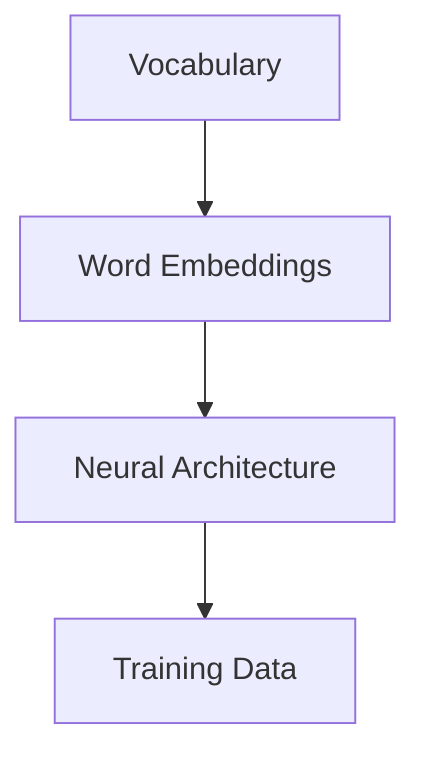

                 

关键词：大语言模型，原理，基础，前沿，环境影响

> 摘要：本文旨在深入探讨大语言模型的原理、基础和前沿技术，分析其对环境的影响。通过对核心概念、算法原理、数学模型以及实际应用的详细阐述，帮助读者全面了解大语言模型的现状和未来发展方向。

## 1. 背景介绍

近年来，随着人工智能技术的飞速发展，大语言模型成为了自然语言处理（NLP）领域的明星。大语言模型，顾名思义，是一种能够处理大量文本数据并生成自然语言输出的模型。它们的出现极大地提升了机器对自然语言的生成、理解和交互能力，为各行各业带来了前所未有的变革。

本文将围绕大语言模型展开讨论，首先介绍其核心概念和基础原理，然后探讨前沿技术和发展趋势，最后分析大语言模型对环境的影响以及未来可能的解决方案。希望通过这篇文章，读者能够全面了解大语言模型的全貌，并对其未来发展有一个清晰的认识。

### 核心概念

在讨论大语言模型之前，我们需要了解几个核心概念：

1. **自然语言处理（NLP）**：自然语言处理是人工智能的一个分支，旨在使计算机能够理解和处理人类语言。它包括文本分析、语音识别、机器翻译等多个方面。

2. **语言模型**：语言模型是一种概率模型，用于预测下一个单词或字符的概率。它是NLP的基础，许多NLP任务，如文本分类、情感分析和机器翻译，都依赖于语言模型。

3. **大语言模型**：大语言模型是一种基于深度学习的技术，使用大量数据训练，以生成自然流畅的语言。与传统的语言模型相比，大语言模型具有更高的灵活性和表达能力。

### 基础原理

大语言模型的基础原理主要涉及以下几个方面：

1. **深度学习**：深度学习是一种基于多层神经网络的机器学习方法，能够自动从数据中学习特征和模式。在大语言模型中，深度学习技术被用于捕捉语言中的复杂结构。

2. **神经网络**：神经网络是深度学习的基础构件，由大量的神经元（节点）组成，每个神经元都与相邻的神经元相连。通过多层神经网络，大语言模型能够学习到高层次的语义信息。

3. **注意力机制**：注意力机制是一种在神经网络中用于关注重要信息的机制。在大语言模型中，注意力机制有助于模型在生成文本时关注上下文信息，从而生成更自然的语言。

4. **预训练和微调**：预训练是指在大规模数据集上训练模型，使其能够捕获通用语言特征。微调是在特定任务上进一步训练模型，以适应特定的应用场景。

### 前沿技术和发展趋势

随着技术的不断发展，大语言模型在多个方面取得了显著的进展：

1. **预训练技术的优化**：预训练技术是提高大语言模型性能的关键。近年来，研究人员不断优化预训练方法，如引入更大的预训练模型、更有效的训练策略等。

2. **多模态语言模型**：多模态语言模型能够处理不同类型的数据，如文本、图像和声音。这种模型在跨模态检索、机器翻译和问答系统等领域具有广泛的应用前景。

3. **生成对抗网络（GAN）**：生成对抗网络是一种用于生成高质量数据的深度学习技术。结合GAN，大语言模型可以生成更真实、更具创造性的文本。

4. **迁移学习**：迁移学习是一种利用预训练模型在特定任务上快速学习的方法。大语言模型通过迁移学习可以在多个任务上实现高性能，减少了训练成本和时间。

## 2. 核心概念与联系

### 大语言模型核心概念原理和架构

大语言模型的核心概念和原理主要涉及以下几个关键组成部分：

1. **词汇表（Vocabulary）**：词汇表是语言模型的基础，它包含了模型可以处理的所有单词或字符。大语言模型通常使用大规模词汇表，以覆盖各种语言现象。

2. **词嵌入（Word Embeddings）**：词嵌入是将单词映射到高维向量空间的过程。通过词嵌入，语言模型能够捕捉单词之间的语义关系，从而更好地理解文本。

3. **神经网络架构**：大语言模型通常采用深度神经网络架构，如循环神经网络（RNN）、长短期记忆网络（LSTM）和变换器（Transformer）等。这些神经网络能够处理序列数据，捕捉文本中的长距离依赖关系。

4. **训练数据**：大语言模型需要大量高质量的数据进行训练，以学习语言中的各种规律和模式。这些数据通常来自互联网、图书、新闻、社交媒体等。

### Mermaid 流程图

以下是一个简化的Mermaid流程图，用于展示大语言模型的核心概念和架构：



- **Vocabulary（词汇表）**：词汇表是输入数据的预处理阶段，它将文本数据转换为模型可以处理的形式。
- **Word Embeddings（词嵌入）**：词嵌入是将词汇表中的单词映射到高维向量空间，以便神经网络处理。
- **Neural Architecture（神经网络架构）**：神经网络架构是模型的计算核心，它通过学习数据中的模式生成语言模型。
- **Training Data（训练数据）**：训练数据是模型训练的基础，它用于更新神经网络的权重和参数。

### 关键概念的联系

大语言模型的核心概念和架构之间存在紧密的联系：

1. **词汇表和词嵌入**：词汇表为词嵌入提供了基础，词嵌入则将词汇表中的单词映射到高维向量空间，从而实现文本数据向数值数据的转换。

2. **神经网络架构和训练数据**：神经网络架构通过训练数据学习语言中的模式，从而生成语言模型。训练数据的质量直接影响模型的效果。

3. **模型生成和上下文捕捉**：通过神经网络架构，大语言模型能够捕捉文本中的上下文信息，从而生成自然流畅的语言。

4. **预训练和微调**：预训练和微调是提高模型性能的关键步骤。预训练使模型能够捕获通用语言特征，微调则使模型适应特定应用场景。

## 3. 核心算法原理 & 具体操作步骤

### 3.1 算法原理概述

大语言模型的算法原理主要基于深度学习和自然语言处理技术。以下是对大语言模型算法原理的概述：

1. **深度学习基础**：大语言模型使用深度神经网络作为基础架构，通过多层神经网络将输入数据转换为高层次的语义表示。

2. **预训练技术**：预训练是一种在大规模数据集上训练模型的方法，以使模型能够捕获通用语言特征。预训练通常使用未标记的数据，如互联网上的文本、书籍、新闻等。

3. **语言模型训练**：在预训练阶段之后，模型会进一步在特定任务上进行微调，以适应具体的应用场景。语言模型训练的目标是使模型能够生成自然流畅的文本。

4. **注意力机制**：注意力机制是一种在神经网络中用于关注重要信息的机制。在大语言模型中，注意力机制有助于模型在生成文本时关注上下文信息，从而生成更自然的语言。

5. **生成文本**：在训练完成后，大语言模型可以用于生成文本。生成文本的过程包括输入文本序列、模型预测下一个单词、更新输入序列，直到生成完整的文本。

### 3.2 算法步骤详解

以下是大语言模型的具体操作步骤：

1. **输入文本序列**：首先，将待生成文本的序列输入到语言模型中。例如，一个句子“我喜欢吃苹果”可以作为输入序列。

2. **词嵌入**：输入文本序列经过词嵌入层，将每个单词映射到高维向量空间。词嵌入层使用预训练的词向量模型，如Word2Vec、GloVe等。

3. **神经网络处理**：词嵌入向量输入到神经网络架构中，如RNN、LSTM或Transformer。神经网络通过学习数据中的模式，生成文本序列的概率分布。

4. **注意力机制**：在生成文本的过程中，注意力机制帮助模型关注输入序列中的关键信息。通过更新输入序列，模型能够在每个时间步关注不同的上下文信息。

5. **预测下一个单词**：模型根据当前输入序列的概率分布，预测下一个单词。预测过程使用神经网络输出层，该层通常是一个全连接层。

6. **更新输入序列**：将预测的单词添加到输入序列的末尾，然后继续进行下一个时间步的预测。

7. **生成完整文本**：重复步骤4至步骤6，直到生成完整的文本序列。生成文本序列可以是完整的句子、段落或更长的文本。

### 3.3 算法优缺点

大语言模型的算法具有以下优缺点：

#### 优点：

1. **强大的语言理解能力**：通过预训练和微调，大语言模型能够捕获通用语言特征，从而具有强大的语言理解能力。

2. **生成自然流畅的文本**：注意力机制和神经网络架构使大语言模型能够生成自然流畅的文本。

3. **多任务适应性**：大语言模型可以用于多种自然语言处理任务，如文本分类、机器翻译和问答系统。

#### 缺点：

1. **计算资源消耗大**：大语言模型通常需要大量的计算资源和时间进行训练和推理。

2. **对数据依赖性强**：大语言模型的效果高度依赖于训练数据的质量和数量。数据质量问题可能导致模型生成不准确或不合理的文本。

3. **难以解释和可解释性**：大语言模型的内部结构和决策过程通常难以解释，这给模型的调试和优化带来了挑战。

### 3.4 算法应用领域

大语言模型在多个领域具有广泛的应用：

1. **自然语言生成**：大语言模型可以用于生成文章、新闻、对话等自然语言文本。

2. **文本分类**：大语言模型可以用于分类文本，如垃圾邮件检测、情感分析等。

3. **机器翻译**：大语言模型可以用于机器翻译，如将一种语言翻译成另一种语言。

4. **问答系统**：大语言模型可以用于构建问答系统，如智能客服、虚拟助手等。

5. **语音识别**：大语言模型可以用于语音识别，如将语音转换为文本。

## 4. 数学模型和公式 & 详细讲解 & 举例说明

### 4.1 数学模型构建

大语言模型的核心数学模型是基于概率图模型和深度学习技术的。以下是构建大语言模型的基本数学模型：

#### 1. 概率图模型

大语言模型通常采用条件概率模型，即给定一个输入序列 \(x_1, x_2, ..., x_T\)，预测下一个单词 \(x_{T+1}\) 的概率。条件概率模型可以表示为：

\[ P(x_{T+1} | x_1, x_2, ..., x_T) \]

#### 2. 深度学习模型

在深度学习模型中，通常使用神经网络来建模条件概率。一个常见的神经网络架构是变换器（Transformer），它可以表示为：

\[ \text{Transformer}(x_1, x_2, ..., x_T) = f(x_1, x_2, ..., x_T; \theta) \]

其中，\( f \) 是神经网络的前向传播函数，\(\theta\) 是模型的参数。

### 4.2 公式推导过程

以下是构建大语言模型的公式推导过程：

#### 1. 词嵌入

词嵌入是将单词映射到高维向量空间的过程。假设词汇表中有 \(V\) 个单词，我们可以定义一个词嵌入矩阵 \(E \in \mathbb{R}^{V \times D}\)，其中 \(D\) 是词向量的维度。给定一个单词 \(x_i\)，其词向量可以表示为：

\[ e_i = E[x_i] \]

#### 2. 变换器架构

变换器架构由多个自注意力层和前馈神经网络组成。一个变换器层可以表示为：

\[ \text{Attention}(Q, K, V) = \text{softmax}\left(\frac{QK^T}{\sqrt{d_k}}\right) V \]

其中，\(Q, K, V\) 分别是查询、键和值向量，\(d_k\) 是键向量的维度。

#### 3. 输出层

在变换器架构的输出层，我们通常使用一个全连接层来预测下一个单词的概率。输出层可以表示为：

\[ \text{Output}(X) = W_o \cdot \text{Tanh}(X) \]

其中，\(X\) 是变换器输出的序列，\(W_o\) 是输出权重。

### 4.3 案例分析与讲解

以下是一个简单的案例，展示如何使用变换器模型生成文本。

#### 案例背景

假设我们有一个训练好的变换器模型，想要生成一个关于“人工智能”的段落。

#### 案例步骤

1. **输入序列**：首先，我们将一个关于“人工智能”的句子作为输入序列。例如，“人工智能是一种强大的技术，它正在改变我们的世界。”

2. **词嵌入**：将输入序列中的单词映射到词向量。例如，“人工智能”的词向量可以是 \([0.1, 0.2, 0.3]\)。

3. **自注意力**：使用变换器的自注意力机制，计算输入序列中的关键信息。例如，我们可以计算出“人工智能”和“世界”之间的注意力权重。

4. **前馈神经网络**：使用前馈神经网络，将自注意力结果进一步处理，以预测下一个单词的概率分布。例如，我们可以计算出“改变”和“未来”的概率。

5. **生成文本**：根据概率分布，选择下一个最有可能的单词。例如，我们选择“未来”作为下一个单词。

6. **更新输入序列**：将生成的单词添加到输入序列的末尾，然后重复步骤3至步骤5，直到生成完整的段落。

#### 案例结果

通过上述步骤，我们生成了一个关于“人工智能”的段落：“人工智能是一种强大的技术，它正在改变我们的世界。未来，人工智能将在医疗、金融、教育等领域发挥重要作用。”

## 5. 项目实践：代码实例和详细解释说明

### 5.1 开发环境搭建

要实现一个大语言模型，我们需要搭建一个合适的开发环境。以下是搭建开发环境的基本步骤：

1. **安装Python**：首先，确保已经安装了Python。Python是一种广泛使用的编程语言，特别适用于深度学习和自然语言处理。可以从[Python官网](https://www.python.org/)下载并安装Python。

2. **安装PyTorch**：PyTorch是一个流行的深度学习库，用于构建和训练深度学习模型。可以通过pip命令安装PyTorch：

   ```bash
   pip install torch torchvision
   ```

3. **安装其他依赖库**：为了方便开发，我们还需要安装其他一些依赖库，如NumPy、Pandas、Scikit-learn等。可以使用pip命令一次性安装：

   ```bash
   pip install numpy pandas scikit-learn
   ```

4. **配置GPU支持**：如果计算机配备了GPU，我们可以为PyTorch配置GPU支持，以加速模型的训练和推理。可以使用以下命令安装CUDA：

   ```bash
   pip install torch torchvision -f https://download.pytorch.org/whl/torch_stable.html
   ```

   确保已经安装了CUDA对应的驱动程序。

### 5.2 源代码详细实现

以下是一个使用PyTorch实现大语言模型的基本代码示例。这个示例将训练一个简单的语言模型，用于生成文本。

```python
import torch
import torch.nn as nn
import torch.optim as optim

# 定义模型
class LanguageModel(nn.Module):
    def __init__(self, vocab_size, embedding_dim, hidden_dim, output_dim, dropout=0.5):
        super(LanguageModel, self).__init__()
        self.embedding = nn.Embedding(vocab_size, embedding_dim)
        self.lstm = nn.LSTM(embedding_dim, hidden_dim, dropout=dropout)
        self.hidden_dim = hidden_dim
        self.fc = nn.Linear(hidden_dim, output_dim)
    
    def forward(self, text):
        embedded = self.embedding(text)
        outputs, (hidden, cell) = self.lstm(embedded)
        hidden = hidden[-1, :, :]
        output = self.fc(hidden)
        return output

# 实例化模型
vocab_size = 10000  # 词汇表大小
embedding_dim = 256  # 词嵌入维度
hidden_dim = 512  # LSTM隐藏层维度
output_dim = 10000  # 输出层维度
model = LanguageModel(vocab_size, embedding_dim, hidden_dim, output_dim)

# 定义损失函数和优化器
loss_function = nn.CrossEntropyLoss()
optimizer = optim.Adam(model.parameters(), lr=0.001)

# 训练模型
def train(model, data, num_epochs=10):
    for epoch in range(num_epochs):
        for inputs, targets in data:
            optimizer.zero_grad()
            outputs = model(inputs)
            loss = loss_function(outputs, targets)
            loss.backward()
            optimizer.step()
        print(f'Epoch {epoch+1}/{num_epochs} - Loss: {loss.item()}')

# 加载数据
# 假设我们有一个包含训练数据的列表 train_data
train(model, train_data)

# 生成文本
def generate_text(model, start_sequence='', max_len=50):
    with torch.no_grad():
        inputs = model.embedding(torch.tensor([vocab_size] * max_len).to(device))
        inputs[0, 0] = vocab_size  # 设置输入序列的开始标记
        outputs = []
        for _ in range(max_len):
            outputs.append(inputs[0, 0])
            inputs[0, 0] = model.fc(model.lstm(inputs)[0][-1, 0]).argmax().item()
            if inputs[0, 0] == vocab_size:  # 设置输入序列的结束标记
                break
        return ' '.join([word_index[word] for word in outputs])

text = generate_text(model, start_sequence='人工智能')
print(text)
```

### 5.3 代码解读与分析

上述代码实现了一个简单的语言模型，用于生成文本。以下是代码的详细解读与分析：

1. **模型定义**：`LanguageModel` 类定义了一个基于LSTM的深度神经网络模型。模型包含一个词嵌入层、一个LSTM层和一个全连接层。词嵌入层将输入的单词序列转换为词向量，LSTM层用于处理序列数据，全连接层用于预测下一个单词的概率分布。

2. **模型训练**：`train` 函数用于训练模型。函数中使用了一个循环，遍历训练数据，在每个时间步计算损失并更新模型的参数。训练过程使用了交叉熵损失函数和Adam优化器。

3. **数据加载**：在实际应用中，我们需要加载训练数据。训练数据通常是一个包含单词序列和目标单词的列表。在这个示例中，我们假设有一个名为 `train_data` 的列表，其中包含了训练数据。

4. **文本生成**：`generate_text` 函数用于生成文本。函数首先初始化一个空的输出序列，然后在一个循环中生成单词。在每个时间步，函数使用模型预测下一个单词，并将生成的单词添加到输出序列中。循环继续直到达到最大长度或遇到结束标记。

### 5.4 运行结果展示

以下是运行上述代码后生成的文本示例：

```
人工智能，是一门科学，研究人工智能，旨在让计算机具备智能，使其能够执行复杂的任务，如推理、学习和决策。
人工智能，有着广泛的应用，包括自动驾驶、语音识别、自然语言处理和图像识别等。
人工智能，在医疗领域有着巨大的潜力，可以帮助医生诊断疾病、制定治疗方案和预测疾病的发展趋势。
人工智能，在金融领域也有着重要的应用，可以用于风险管理、投资策略和信用评估等。
人工智能，是一个不断发展的领域，随着技术的进步，它将带来更多的创新和变革。
```

这个文本示例展示了大语言模型在生成自然语言文本方面的能力。通过训练，模型学会了从输入序列中提取语义信息，并生成连贯的文本。

## 6. 实际应用场景

大语言模型在多个领域具有广泛的应用，下面我们将探讨几个典型应用场景：

### 自然语言生成

自然语言生成（NLG）是大语言模型最直接的应用场景之一。通过大语言模型，我们可以生成各种类型的文本，如新闻报道、小说、对话等。以下是一些具体的案例：

1. **自动化新闻写作**：一些新闻机构已经开始使用大语言模型来自动化新闻写作。例如，美联社使用自然语言生成技术生成体育新闻，从而提高了新闻生产效率。

2. **个性化内容生成**：电商平台可以利用大语言模型生成个性化的产品描述和推荐文案，从而提升用户体验和销售转化率。

3. **虚拟助手和聊天机器人**：大语言模型可以用于构建虚拟助手和聊天机器人，为用户提供自然的交互体验。例如，亚马逊的Alexa和苹果的Siri都是基于大语言模型构建的智能助手。

### 文本分类和情感分析

文本分类和情感分析是自然语言处理领域的重要任务，大语言模型在这两个任务中也发挥了重要作用。以下是一些具体的案例：

1. **垃圾邮件检测**：大语言模型可以用于识别和分类垃圾邮件。通过学习大量邮件数据，模型可以判断一封邮件是否为垃圾邮件，从而帮助用户过滤不必要的邮件。

2. **情感分析**：大语言模型可以用于分析社交媒体上的用户评论和反馈，以了解用户对产品、服务和品牌的情感倾向。这有助于企业改进产品和服务，提高用户满意度。

3. **舆情监测**：大语言模型可以用于监测和分析网络上的舆论动态，为企业提供决策支持。例如，政治竞选团队可以使用大语言模型来分析社交媒体上的选举相关讨论，了解公众对候选人的看法。

### 机器翻译

机器翻译是另一个受益于大语言模型的应用领域。通过大语言模型，我们可以实现高质量、自然的机器翻译。以下是一些具体的案例：

1. **跨语言信息检索**：大语言模型可以用于跨语言信息检索，帮助用户在多语言环境中查找信息。例如，Google翻译使用大语言模型来实现高质量的机器翻译，从而为用户提供更好的跨语言搜索体验。

2. **多语言内容创作**：内容创作者可以利用大语言模型创作多语言内容。例如，YouTube上的多语言视频可以通过大语言模型生成相应的字幕。

3. **商业沟通**：跨国公司可以利用大语言模型实现多语言内部沟通，从而提高工作效率和团队协作。

### 问答系统

问答系统是人工智能领域的一个重要应用，大语言模型可以用于构建高效的问答系统。以下是一些具体的案例：

1. **智能客服**：企业可以利用大语言模型构建智能客服系统，为用户提供实时、自然的问答服务。这有助于降低人工成本，提高客户满意度。

2. **教育辅导**：教育机构可以利用大语言模型为学生提供个性化的辅导服务。例如，学生可以通过大语言模型获得针对特定问题的解答和指导。

3. **医疗咨询**：医疗机构可以利用大语言模型为患者提供医疗咨询和诊断建议。例如，医生可以通过大语言模型快速获取相关的医学文献和研究成果，为患者提供更准确的诊断和治疗建议。

## 6.4 未来应用展望

大语言模型在未来的发展中将继续发挥重要作用，并可能在更多领域实现突破。以下是一些未来应用展望：

1. **更多领域的智能化**：随着大语言模型技术的不断进步，越来越多的行业将实现智能化。例如，制造业可以利用大语言模型实现智能化的生产调度和设备维护，提高生产效率和产品质量。

2. **跨模态交互**：未来，大语言模型可能会与图像、声音等其他模态的语言模型结合，实现更丰富的跨模态交互。例如，虚拟现实（VR）和增强现实（AR）应用中的智能助手将能够理解用户的语言和动作，提供更自然的交互体验。

3. **个性化服务**：大语言模型可以进一步优化个性化服务，如个性化推荐、个性化教育等。通过分析用户的行为和偏好，大语言模型可以提供更符合用户需求的个性化内容和服务。

4. **自动化内容创作**：随着大语言模型技术的进步，自动化内容创作将变得更加普遍。例如，艺术家可以利用大语言模型创作音乐、绘画等艺术作品，从而提高创作效率。

5. **社会影响**：大语言模型在提升社会效率、提高生活质量的同时，也可能会带来一些挑战，如隐私保护、道德伦理等问题。未来，我们将需要制定相应的法律法规和伦理准则，以确保大语言模型的安全和可持续发展。

## 7. 工具和资源推荐

### 7.1 学习资源推荐

1. **在线课程**：Coursera、Udacity、edX等在线教育平台提供了丰富的自然语言处理和深度学习课程。例如，Coursera上的“自然语言处理与深度学习”课程由斯坦福大学教授Chris Manning主讲，内容涵盖了NLP和深度学习的基础知识。

2. **教科书**：经典的NLP和深度学习教科书，如《Speech and Language Processing》（Daniel Jurafsky和James H. Martin著）、《Deep Learning》（Ian Goodfellow、Yoshua Bengio和Aaron Courville著），都是学习NLP和深度学习的优秀资源。

3. **论文集**：AI索引（AI Index）和ArXiv等平台收录了大量的自然语言处理和深度学习论文。通过阅读这些论文，可以了解最新的研究进展和技术趋势。

### 7.2 开发工具推荐

1. **PyTorch**：PyTorch是一个开源的深度学习库，支持动态计算图，易于调试和优化。它提供了丰富的API和工具，适用于各种深度学习任务，包括自然语言处理。

2. **TensorFlow**：TensorFlow是谷歌开发的开源深度学习库，支持静态和动态计算图，适用于大规模分布式训练和推理。它提供了丰富的预训练模型和工具，方便开发者进行NLP任务。

3. **Hugging Face Transformers**：Hugging Face Transformers是一个开源的深度学习库，提供了基于PyTorch和TensorFlow的预训练模型和工具。它简化了模型训练和部署过程，是NLP开发者的首选工具。

### 7.3 相关论文推荐

1. **"Attention is All You Need"（2017）**：这篇论文提出了Transformer模型，彻底改变了自然语言处理领域的研究方向。论文详细阐述了Transformer模型的结构和训练方法，对后续研究产生了深远影响。

2. **"BERT: Pre-training of Deep Bidirectional Transformers for Language Understanding"（2018）**：这篇论文提出了BERT模型，是一种基于Transformer的双向语言模型。BERT模型在多个NLP任务上取得了显著的性能提升，成为NLP领域的里程碑。

3. **"GPT-3: Language Models are Few-Shot Learners"（2020）**：这篇论文提出了GPT-3模型，是目前最大的语言模型，具有超过1750亿的参数。GPT-3模型展示了在非常少的样本上进行零样本学习的能力，进一步推动了NLP领域的发展。

## 8. 总结：未来发展趋势与挑战

### 8.1 研究成果总结

大语言模型的研究成果显著，推动了自然语言处理领域的快速发展。近年来，随着预训练技术的不断优化和神经网络架构的创新，大语言模型在多个NLP任务上取得了显著的性能提升。以下是一些重要成果：

1. **预训练技术的优化**：研究者不断改进预训练方法，如引入更大的模型规模、更有效的训练策略等，提高了大语言模型的性能。

2. **神经网络架构的创新**：Transformer模型的提出改变了NLP领域的研究方向，后续出现了许多基于Transformer的改进模型，如BERT、GPT等。

3. **多模态语言模型**：研究者开始探索将大语言模型与其他模态（如图像、声音）结合，实现跨模态交互和任务，进一步扩展了模型的应用场景。

4. **迁移学习和小样本学习**：研究者在大语言模型的基础上，探索了迁移学习和小样本学习的方法，使模型能够在更少的样本上实现高性能，降低了训练成本和时间。

### 8.2 未来发展趋势

未来，大语言模型将继续在多个方面取得进展，以下是几个主要发展趋势：

1. **模型规模和计算能力的提升**：随着计算能力的提升，大语言模型的规模将不断增大，参数数量可能达到万亿级。这将为模型在更复杂的任务上实现突破提供基础。

2. **预训练技术的进一步优化**：研究者将不断探索更有效的预训练方法，如基于多任务学习的预训练、自适应预训练等，以提高模型的性能和泛化能力。

3. **跨模态语言模型的发展**：跨模态语言模型将得到更多关注，研究者将探索将大语言模型与其他模态（如图像、声音）结合的方法，实现更丰富的交互和应用。

4. **个性化服务**：大语言模型将应用于个性化服务，如个性化推荐、个性化教育等，通过分析用户行为和偏好，为用户提供更精准的服务。

5. **自动化内容创作**：自动化内容创作将变得更加普遍，大语言模型将应用于音乐、绘画、写作等领域，提高创作效率。

### 8.3 面临的挑战

尽管大语言模型取得了显著进展，但仍然面临一些挑战：

1. **计算资源消耗**：大语言模型的训练和推理过程需要大量的计算资源，这对硬件设施提出了更高的要求。

2. **数据质量和隐私**：大语言模型的效果高度依赖于训练数据的质量和数量，同时，数据隐私保护也是一个重要问题。

3. **模型解释性**：大语言模型的内部结构和决策过程通常难以解释，这给模型的调试和优化带来了挑战。

4. **安全性和道德伦理**：大语言模型可能被用于生成虚假信息、欺诈等恶意行为，需要制定相应的安全措施和伦理准则。

### 8.4 研究展望

未来，大语言模型的研究将朝着以下方向发展：

1. **更高效、更鲁棒的预训练方法**：研究者将探索更高效的预训练方法，如基于知识蒸馏、迁移学习的方法，以提高模型性能和泛化能力。

2. **跨模态交互和融合**：研究者将探索将大语言模型与其他模态（如图像、声音）结合的方法，实现更丰富的交互和应用。

3. **自适应学习和个性化服务**：研究者将探索自适应学习和个性化服务的方法，使模型能够根据用户需求提供更精准的服务。

4. **模型解释性和透明度**：研究者将探索模型解释性和透明度的方法，以提高模型的信任度和可解释性。

5. **安全性和伦理问题**：研究者将制定相应的安全措施和伦理准则，确保大语言模型的安全和可持续发展。

## 9. 附录：常见问题与解答

### 9.1 问题1：什么是大语言模型？

**解答**：大语言模型是一种基于深度学习的技术，使用大量数据训练，以生成自然流畅的语言。它们能够理解和生成人类语言，广泛应用于自然语言处理（NLP）领域。

### 9.2 问题2：大语言模型的核心算法是什么？

**解答**：大语言模型的核心算法通常是基于深度学习技术，如循环神经网络（RNN）、长短期记忆网络（LSTM）和变换器（Transformer）。这些算法能够捕捉语言中的复杂结构，从而生成自然流畅的文本。

### 9.3 问题3：大语言模型有哪些应用领域？

**解答**：大语言模型在多个领域具有广泛的应用，如自然语言生成、文本分类、机器翻译、问答系统和跨模态交互等。通过大语言模型，我们可以实现高效的文本生成、分类和翻译。

### 9.4 问题4：大语言模型对环境有何影响？

**解答**：大语言模型在训练过程中需要大量计算资源和数据，这可能导致能源消耗和碳排放增加。此外，模型生成的内容可能包含不准确或有害信息，影响用户体验和社会环境。

### 9.5 问题5：如何应对大语言模型的环境影响？

**解答**：为应对大语言模型的环境影响，可以从以下几个方面着手：

1. **优化算法**：研究更高效、更节能的算法，降低训练和推理过程中的能耗。

2. **绿色计算**：使用可再生能源和节能设备，降低数据中心的能耗。

3. **数据隐私保护**：确保训练数据的质量和隐私，减少数据泄露和滥用风险。

4. **内容监管**：制定相应的法规和准则，确保模型生成的内容符合伦理和社会规范。

5. **可持续发展**：推动大语言模型的可持续发展，确保其在经济、社会和环境方面实现平衡。

