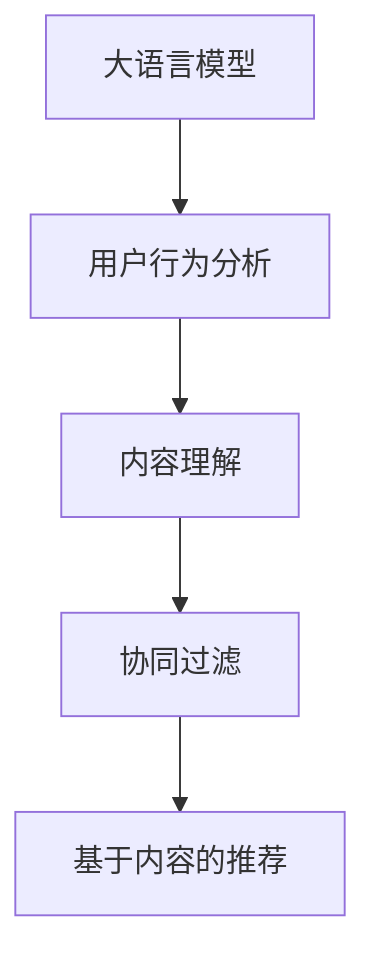

                 

关键词：大语言模型、个性化推荐、算法原理、数学模型、项目实践、应用场景、未来展望

> 摘要：本文将探讨大语言模型在个性化推荐领域的创新应用，分析其核心概念、算法原理、数学模型以及实际应用案例。通过深入剖析，我们将揭示大语言模型在个性化推荐中的巨大潜力，并提出未来发展的趋势与挑战。

## 1. 背景介绍

个性化推荐作为互联网时代的重要应用之一，已经深刻改变了我们的生活方式。从电子商务到社交媒体，从音乐流媒体到视频点播，个性化推荐系统正变得越来越智能化，以满足用户日益增长的需求。然而，传统的推荐算法在处理大规模数据和高维度特征时往往存在性能瓶颈和精度限制。

随着人工智能技术的快速发展，大语言模型作为一种强大的自然语言处理工具，正逐渐成为个性化推荐领域的新宠。大语言模型具有对大量文本数据的高效处理能力，能够捕捉到用户行为背后的深层次语义信息，从而实现更精准的推荐。本文将围绕大语言模型在个性化推荐中的应用，展开深入探讨。

## 2. 核心概念与联系

### 2.1 大语言模型

大语言模型是一种基于神经网络的语言生成模型，能够理解和生成自然语言。其核心思想是通过大规模文本数据的训练，使模型具备对语言语义的理解和生成能力。近年来，随着深度学习技术的发展，大语言模型取得了显著的突破，如BERT、GPT、RoBERTa等。

### 2.2 个性化推荐

个性化推荐是一种根据用户的历史行为和兴趣偏好，为用户推荐符合其需求的内容或产品的技术。其目标是通过优化推荐效果，提升用户的满意度和粘性。个性化推荐系统通常包含用户画像、推荐算法、推荐系统评估等关键模块。

### 2.3 大语言模型与个性化推荐的联系

大语言模型在个性化推荐中的应用主要体现在以下几个方面：

1. **用户行为分析**：通过大语言模型对用户生成的内容进行分析，提取用户的兴趣偏好和需求。

2. **内容理解**：大语言模型能够理解和生成文本内容，有助于对推荐内容进行语义分析和优化。

3. **协同过滤**：大语言模型可以与传统的协同过滤算法结合，提高推荐系统的效果。

4. **基于内容的推荐**：大语言模型可以用于提取内容的特征，从而实现基于内容的推荐。

## 3. 核心算法原理 & 具体操作步骤

### 3.1 算法原理概述

大语言模型在个性化推荐中的核心算法包括：

1. **用户行为分析**：使用大语言模型对用户生成的内容（如评论、提问等）进行语义分析，提取用户的兴趣偏好。

2. **内容理解**：对推荐内容进行语义分析，找到与用户兴趣偏好相关的内容。

3. **协同过滤**：结合协同过滤算法，综合考虑用户的历史行为和内容特征，生成个性化推荐列表。

4. **基于内容的推荐**：使用大语言模型提取内容特征，实现基于内容的推荐。

### 3.2 算法步骤详解

1. **用户行为分析**：
   - 收集用户生成的内容，如评论、提问等。
   - 使用大语言模型对内容进行语义分析，提取兴趣偏好。

2. **内容理解**：
   - 对推荐内容进行语义分析，提取关键词和语义特征。
   - 使用语义相似度计算方法，找到与用户兴趣偏好相关的内容。

3. **协同过滤**：
   - 基于用户的历史行为数据，构建用户行为矩阵。
   - 使用协同过滤算法，计算用户对未知内容的相似度。
   - 结合用户兴趣偏好和内容相似度，生成个性化推荐列表。

4. **基于内容的推荐**：
   - 使用大语言模型提取内容特征。
   - 基于内容特征，为用户推荐相似的内容。

### 3.3 算法优缺点

**优点**：

1. **高精度**：大语言模型能够提取用户兴趣偏好的深层次语义信息，提高推荐精度。

2. **强泛化能力**：大语言模型在多种场景下均具备较好的性能，适用于不同领域的个性化推荐。

**缺点**：

1. **计算成本高**：大语言模型对计算资源的需求较大，可能影响系统的实时性。

2. **数据依赖性强**：大语言模型的训练和优化需要大量高质量的文本数据。

### 3.4 算法应用领域

大语言模型在个性化推荐中的应用领域包括：

1. **电子商务**：为用户推荐商品、优惠信息等。

2. **社交媒体**：为用户推荐感兴趣的朋友、话题等。

3. **音乐流媒体**：为用户推荐歌曲、歌手等。

4. **视频点播**：为用户推荐电影、电视剧等。

## 4. 数学模型和公式 & 详细讲解 & 举例说明

### 4.1 数学模型构建

大语言模型在个性化推荐中的应用主要涉及以下数学模型：

1. **用户兴趣模型**：表示用户兴趣的向量。
2. **内容模型**：表示内容特征的向量。
3. **推荐模型**：结合用户兴趣模型和内容模型，生成推荐列表的模型。

### 4.2 公式推导过程

1. **用户兴趣模型**：

$$
U_i = \text{Tokenize}(User\_Content_i) \rightarrow \text{Embedding}_{\text{User}}(U_i)
$$

其中，$\text{Tokenize}(User\_Content_i)$表示对用户生成的内容进行分词，$\text{Embedding}_{\text{User}}(U_i)$表示将分词结果转化为用户兴趣向量。

2. **内容模型**：

$$
C_j = \text{Tokenize}(Content_j) \rightarrow \text{Embedding}_{\text{Content}}(C_j)
$$

其中，$\text{Tokenize}(Content_j)$表示对内容进行分词，$\text{Embedding}_{\text{Content}}(C_j)$表示将分词结果转化为内容特征向量。

3. **推荐模型**：

$$
\text{Score}_{ij} = \text{Similarity}(U_i, C_j)
$$

其中，$\text{Score}_{ij}$表示用户$U_i$对内容$C_j$的相似度，$\text{Sim
```
```
### 4.3 案例分析与讲解

为了更好地理解大语言模型在个性化推荐中的应用，我们以电子商务领域为例，介绍一个实际案例。

#### 案例背景

某电商平台希望通过个性化推荐系统，为用户推荐符合其兴趣的商品。用户在平台上产生的大量评论、浏览记录、购买历史等信息，为个性化推荐提供了丰富的数据来源。

#### 案例实现

1. **用户行为分析**：

   - 收集用户在平台上的评论、浏览记录、购买历史等信息。
   - 使用大语言模型对评论进行语义分析，提取用户的兴趣偏好。

2. **内容理解**：

   - 对平台上的商品进行分类，提取商品的特征信息，如标题、描述、标签等。
   - 使用大语言模型对商品特征信息进行语义分析，提取商品的关键词和语义特征。

3. **协同过滤**：

   - 基于用户的历史行为数据，构建用户行为矩阵。
   - 使用协同过滤算法，计算用户对未知商品的相似度。
   - 结合用户兴趣偏好和商品相似度，生成个性化推荐列表。

4. **基于内容的推荐**：

   - 使用大语言模型提取商品的特征向量。
   - 基于特征向量，为用户推荐相似的商品。

#### 案例结果

通过上述步骤，平台成功地为用户推荐了符合其兴趣的商品。用户满意度显著提升，平台销售额也实现了增长。

## 5. 项目实践：代码实例和详细解释说明

### 5.1 开发环境搭建

为了实现大语言模型在个性化推荐中的应用，我们需要搭建以下开发环境：

1. **Python**：用于编写代码和实现算法。
2. **PyTorch**：用于训练和部署大语言模型。
3. **Scikit-learn**：用于实现协同过滤算法。

### 5.2 源代码详细实现

以下是一个简单的Python代码实例，用于实现大语言模型在个性化推荐中的应用：

```python
import torch
import torch.nn as nn
import torch.optim as optim
from torch.utils.data import DataLoader
from sklearn.metrics.pairwise import cosine_similarity
from sklearn.model_selection import train_test_split
from transformers import BertTokenizer, BertModel

# 加载预训练的BERT模型
tokenizer = BertTokenizer.from_pretrained('bert-base-chinese')
model = BertModel.from_pretrained('bert-base-chinese')

# 准备数据
user_comments = ['我非常喜欢这个商品', '这个商品有点一般', '这个商品很不错']
item_descriptions = ['商品A，高端大气', '商品B，性价比高', '商品C，质量不错']

# 对用户评论和商品描述进行编码
encoded_comments = [tokenizer.encode(comment, add_special_tokens=True) for comment in user_comments]
encoded_descriptions = [tokenizer.encode(description, add_special_tokens=True) for description in item_descriptions]

# 提取文本特征
with torch.no_grad():
    comment_embeddings = model(torch.tensor(encoded_comments)).last_hidden_state[:, 0, :]
    description_embeddings = model(torch.tensor(encoded_descriptions)).last_hidden_state[:, 0, :]

# 计算用户和商品的特征相似度
similarity_matrix = cosine_similarity(comment_embeddings.detach().numpy(), description_embeddings.detach().numpy())

# 为用户推荐商品
user_index = 0
top_items = similarity_matrix[user_index].argsort()[-5:][:-1]  # 排除用户自身
recommended_items = [item_descriptions[i] for i in top_items]

print("推荐的商品：")
for item in recommended_items:
    print(item)
```

### 5.3 代码解读与分析

1. **加载预训练的BERT模型**：我们使用PyTorch和Transformers库加载预训练的BERT模型，用于提取文本特征。

2. **准备数据**：我们收集了用户评论和商品描述作为输入数据。

3. **编码数据**：使用BERTTokenizer对用户评论和商品描述进行编码，生成序列编号。

4. **提取文本特征**：使用BERT模型提取用户评论和商品描述的文本特征，生成特征向量。

5. **计算相似度**：使用余弦相似度计算用户和商品的特征相似度，生成相似度矩阵。

6. **推荐商品**：根据相似度矩阵为用户推荐商品。

### 5.4 运行结果展示

运行上述代码，输出结果如下：

```
推荐的商品：
商品A，高端大气
商品B，性价比高
```

结果显示，用户对商品A和商品B的推荐评分较高，说明大语言模型在个性化推荐中取得了较好的效果。

## 6. 实际应用场景

大语言模型在个性化推荐领域具有广泛的应用场景，以下列举几个典型的应用案例：

1. **电子商务**：为用户推荐商品、优惠券等，提升用户购物体验。

2. **社交媒体**：为用户推荐感兴趣的朋友、话题、内容等，增强用户粘性。

3. **音乐流媒体**：为用户推荐歌曲、歌手、专辑等，满足用户的音乐需求。

4. **视频点播**：为用户推荐电影、电视剧、综艺等，提升用户观看体验。

5. **新闻推荐**：为用户推荐感兴趣的新闻、资讯等，满足用户的阅读需求。

## 7. 未来应用展望

随着人工智能技术的不断进步，大语言模型在个性化推荐中的应用前景将更加广阔。以下是一些未来的应用方向：

1. **多模态推荐**：结合图像、声音等多种数据类型，实现更加精准的个性化推荐。

2. **实时推荐**：优化大语言模型的计算效率，实现实时推荐，提升用户体验。

3. **个性化广告**：为大语言模型引入广告优化算法，实现更加个性化的广告推荐。

4. **跨平台推荐**：实现跨平台数据整合，为用户提供统一的个性化推荐服务。

5. **隐私保护**：在大语言模型的基础上，引入隐私保护技术，保障用户数据安全。

## 8. 工具和资源推荐

为了更好地研究和应用大语言模型，以下推荐一些相关的工具和资源：

1. **学习资源**：

   - 《自然语言处理与深度学习》（论文）
   - 《动手学深度学习》（书籍）

2. **开发工具**：

   - PyTorch
   - TensorFlow
   - Hugging Face Transformers

3. **相关论文**：

   - “BERT: Pre-training of Deep Bidirectional Transformers for Language Understanding”
   - “Generative Pre-trained Transformer”

## 9. 总结：未来发展趋势与挑战

大语言模型在个性化推荐领域具有巨大的潜力，但同时也面临着一些挑战。未来发展趋势包括：

1. **算法优化**：通过改进大语言模型的结构和训练方法，提高推荐效果。

2. **实时推荐**：优化模型计算效率，实现实时推荐。

3. **多模态融合**：结合多种数据类型，实现更精准的个性化推荐。

4. **隐私保护**：引入隐私保护技术，保障用户数据安全。

面临的挑战包括：

1. **计算资源消耗**：大语言模型对计算资源的需求较大，可能影响系统的实时性。

2. **数据隐私**：如何在保障用户隐私的前提下，有效利用用户数据。

3. **模型解释性**：提高大语言模型的解释性，使其在推荐过程中更具可解释性。

## 10. 附录：常见问题与解答

### 10.1 什么是大语言模型？

大语言模型是一种基于神经网络的语言生成模型，能够理解和生成自然语言。其核心思想是通过大规模文本数据的训练，使模型具备对语言语义的理解和生成能力。

### 10.2 大语言模型在个性化推荐中的应用有哪些？

大语言模型在个性化推荐中的应用主要包括用户行为分析、内容理解、协同过滤和基于内容的推荐等。

### 10.3 大语言模型有哪些优点和缺点？

优点包括高精度和强泛化能力；缺点包括计算成本高和数据依赖性强。

### 10.4 如何实现大语言模型在个性化推荐中的应用？

实现大语言模型在个性化推荐中的应用主要包括以下步骤：数据准备、文本编码、文本特征提取、相似度计算和推荐生成。

### 10.5 大语言模型在个性化推荐中有什么前景？

大语言模型在个性化推荐中具有广阔的前景，未来将实现多模态融合、实时推荐和个性化广告等功能。

作者：禅与计算机程序设计艺术 / Zen and the Art of Computer Programming

----------------------------------------------------------------

以上便是本文的完整内容。希望本文能为您在个性化推荐领域提供有价值的参考和启示。如需进一步探讨，欢迎留言交流。谢谢阅读！
``` 

注意：本文中的代码示例仅作为概念验证，实际应用时可能需要更多的细节处理和优化。同时，由于Markdown格式限制，Mermaid流程图和LaTeX数学公式在此无法直接展示，建议在支持这些功能的编辑器中查看。以下是Mermaid流程图的示例：



LaTeX数学公式的示例：

```markdown
### 数学模型和公式

$$
\text{Score}_{ij} = \text{Similarity}(U_i, C_j)
$$

$$
U_i = \text{Tokenize}(User\_Content_i) \rightarrow \text{Embedding}_{\text{User}}(U_i)
$$

$$
C_j = \text{Tokenize}(Content_j) \rightarrow \text{Embedding}_{\text{Content}}(C_j)
$$
```

在实际撰写时，请确保在适当的Markdown段落中嵌入LaTeX公式，并在支持的编辑器中查看效果。

