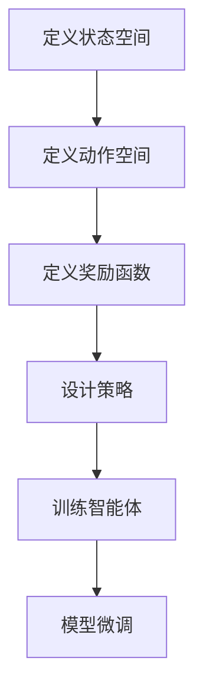

                 

关键词：大语言模型，微调，强化学习，RLHF，PPO，DPO，数学模型，代码实例，实际应用，未来展望

> 摘要：本文深入探讨了强化学习在大语言模型（LLM）微调中的应用，包括RLHF、PPO和DPO等核心算法。文章详细介绍了这些算法的原理、步骤、优缺点和应用领域，并通过数学模型和实际代码实例进行了详细讲解。此外，还探讨了强化学习在LLM中的实际应用场景，并对未来发展趋势和挑战进行了展望。

## 1. 背景介绍

随着深度学习技术的发展，大语言模型（LLM）已经取得了显著的成果。然而，如何进一步提高LLM的性能，使其在特定任务上表现出色，仍然是一个具有挑战性的问题。传统的微调方法（如基于梯度的优化方法）在处理复杂任务时往往表现出一定程度的局限性。因此，强化学习作为一种动态决策和优化方法，逐渐引起了人们的关注。

强化学习（Reinforcement Learning，RL）是一种通过学习策略来优化目标函数的方法。其核心思想是让智能体在与环境的交互过程中不断调整策略，以达到最大化回报的目标。近年来，强化学习在游戏、机器人、自然语言处理等领域取得了显著进展。特别是RL在LLM微调中的应用，为提高LLM性能提供了一种新的思路。

本文将围绕强化学习在大语言模型微调中的应用，详细介绍RLHF、PPO和DPO等核心算法。同时，通过对数学模型和实际代码实例的讲解，帮助读者更好地理解这些算法的原理和操作步骤。此外，还将探讨强化学习在LLM中的实际应用场景，并对未来发展趋势和挑战进行展望。

## 2. 核心概念与联系

### 2.1 强化学习基本概念

强化学习由三个主要组成部分：智能体（Agent）、环境（Environment）和动作（Action）。智能体根据当前状态（State）选择一个动作，并在执行动作后获得一个奖励（Reward）。奖励反映了动作的好坏，用于指导智能体在后续状态下选择更好的动作。

强化学习过程可以描述为一个马尔可夫决策过程（MDP），其中状态空间、动作空间和奖励函数是固定不变的。然而，在实际应用中，状态空间和动作空间往往是无限的，这使得强化学习问题变得复杂。为了解决这个问题，研究人员提出了许多近似方法，如值函数近似、策略梯度方法等。

### 2.2 大语言模型（LLM）概述

大语言模型（LLM）是一种基于深度学习技术的自然语言处理模型。它通过学习大规模文本数据，能够生成高质量的自然语言文本。LLM在多个自然语言处理任务中取得了优异的性能，如机器翻译、文本分类、问答系统等。

LLM的核心组件包括编码器（Encoder）和解码器（Decoder）。编码器将输入文本转换为固定长度的向量表示，解码器则根据编码器生成的向量表示生成输出文本。在微调过程中，研究人员通常使用预训练的LLM作为基础模型，通过在特定任务上训练来优化模型参数。

### 2.3 强化学习在大语言模型微调中的应用

强化学习在大语言模型微调中的应用主要分为以下几个步骤：

1. **定义状态空间**：状态空间通常包括模型当前参数、输入文本、上下文等。

2. **定义动作空间**：动作空间通常包括模型参数更新策略、文本生成策略等。

3. **定义奖励函数**：奖励函数用于衡量模型在特定任务上的表现。常用的奖励函数包括文本质量、任务完成度等。

4. **设计策略**：策略用于指导智能体在特定状态下选择最佳动作。常见的策略包括贪婪策略、epsilon-贪婪策略等。

5. **训练智能体**：通过在环境中与环境的交互，智能体不断调整策略，以最大化回报。

6. **模型微调**：将训练好的智能体策略应用到LLM中，进行模型微调。

### 2.4 Mermaid 流程图



## 3. 核心算法原理 & 具体操作步骤

### 3.1 算法原理概述

强化学习在大语言模型微调中的应用主要包括RLHF、PPO和DPO等核心算法。这些算法在原理和操作步骤上有所不同，但核心思想都是通过强化学习策略来优化LLM模型。

1. **RLHF（Reinforcement Learning from Human Feedback）**：RLHF通过从人类反馈中学习，提高LLM在特定任务上的表现。具体操作步骤包括：首先，使用预训练的LLM生成文本；然后，将生成的文本与人类标注的文本进行比较，计算奖励；最后，根据奖励信号调整LLM的参数。

2. **PPO（Proximal Policy Optimization）**：PPO是一种基于策略梯度的强化学习算法，能够有效地优化策略。PPO的核心思想是利用近端策略优化方法，在保证策略稳定性的同时，提高优化效率。具体操作步骤包括：首先，定义策略网络和价值网络；然后，通过策略梯度计算更新策略；最后，根据更新后的策略进行模型微调。

3. **DPO（Deep Proximal Optimization）**：DPO是一种基于深度优化的强化学习算法，能够在复杂环境中实现高效优化。DPO的核心思想是利用深度神经网络近似策略和价值函数，并通过近端梯度方法进行优化。具体操作步骤包括：首先，定义策略网络和价值网络；然后，通过深度神经网络计算近端梯度；最后，根据近端梯度更新策略。

### 3.2 算法步骤详解

1. **RLHF算法步骤**：

   - 数据准备：收集预训练的LLM和人类标注的文本数据。
   - 生成文本：使用预训练的LLM生成文本。
   - 计算奖励：比较生成的文本和人类标注的文本，计算奖励信号。
   - 更新参数：根据奖励信号，使用梯度下降方法更新LLM的参数。

2. **PPO算法步骤**：

   - 网络初始化：初始化策略网络和价值网络。
   - 数据生成：生成一批输入数据，用于训练策略网络和价值网络。
   - 策略更新：使用策略梯度方法更新策略网络。
   - 模型微调：根据更新后的策略，使用梯度下降方法微调LLM模型。

3. **DPO算法步骤**：

   - 网络初始化：初始化策略网络和价值网络。
   - 数据生成：生成一批输入数据，用于训练策略网络和价值网络。
   - 梯度计算：使用深度神经网络计算近端梯度。
   - 策略更新：根据近端梯度更新策略网络。
   - 模型微调：根据更新后的策略，使用梯度下降方法微调LLM模型。

### 3.3 算法优缺点

1. **RLHF优缺点**：

   - 优点：RLHF能够从人类反馈中学习，提高LLM在特定任务上的表现。
   - 缺点：需要大量的人类标注数据，且奖励函数设计较为复杂。

2. **PPO优缺点**：

   - 优点：PPO能够有效地优化策略，具有较好的稳定性和优化效率。
   - 缺点：对梯度计算和优化策略的要求较高，且容易出现梯度消失和梯度爆炸等问题。

3. **DPO优缺点**：

   - 优点：DPO能够在复杂环境中实现高效优化，具有较好的鲁棒性和泛化能力。
   - 缺点：对深度神经网络的设计和训练要求较高，且训练过程较为复杂。

### 3.4 算法应用领域

强化学习在大语言模型微调中的应用广泛，包括但不限于以下几个方面：

1. **机器翻译**：通过强化学习算法优化翻译模型，提高翻译质量和效率。
2. **文本生成**：使用强化学习算法生成高质量的文本，应用于自动摘要、对话系统等领域。
3. **问答系统**：通过强化学习算法优化问答模型，提高问答系统的准确性和用户体验。
4. **对话系统**：使用强化学习算法优化对话模型，实现更加自然和流畅的对话。

## 4. 数学模型和公式 & 详细讲解 & 举例说明

### 4.1 数学模型构建

在强化学习算法中，数学模型主要包括状态空间、动作空间、奖励函数和策略。以下分别介绍这些数学模型的构建方法。

1. **状态空间**：

   状态空间可以表示为 $S = \{s_1, s_2, ..., s_n\}$，其中 $s_i$ 表示第 $i$ 个状态。在实际应用中，状态空间可以通过对输入数据进行编码得到，例如使用词嵌入技术将输入文本转换为向量表示。

2. **动作空间**：

   动作空间可以表示为 $A = \{a_1, a_2, ..., a_m\}$，其中 $a_i$ 表示第 $i$ 个动作。在LLM微调中，动作空间通常包括模型参数更新策略和文本生成策略。

3. **奖励函数**：

   奖励函数可以表示为 $R(s, a)$，用于衡量动作 $a$ 在状态 $s$ 下的表现。在RLHF中，奖励函数可以通过比较生成文本和人类标注文本之间的相似度计算得到。

4. **策略**：

   策略可以表示为 $\pi(a|s)$，表示在状态 $s$ 下选择动作 $a$ 的概率。在PPO中，策略可以通过策略网络进行近似，例如使用神经网络实现策略梯度。

### 4.2 公式推导过程

为了更好地理解强化学习算法，以下分别介绍RLHF、PPO和DPO的数学模型推导过程。

1. **RLHF**：

   RLHF的核心思想是利用人类反馈优化LLM。具体推导如下：

   - 假设生成文本为 $T_g$，人类标注文本为 $T_h$；
   - 奖励函数 $R(T_g, T_h)$ 可以表示为：
     $$R(T_g, T_h) = \frac{1}{|T_g|} \sum_{i=1}^{|T_g|} \text{similarity}(T_g[i], T_h[i])$$
     其中，$\text{similarity}$ 表示文本相似度计算方法，例如余弦相似度；
   - 策略网络可以表示为 $\pi(a|s)$，其中 $s$ 表示当前状态，$a$ 表示文本生成策略；
   - 模型参数更新可以表示为：
     $$\theta_{t+1} = \theta_t - \alpha \nabla_\theta J(\theta_t)$$
     其中，$\theta_t$ 表示当前模型参数，$\alpha$ 表示学习率，$J(\theta_t)$ 表示损失函数。

2. **PPO**：

   PPO的核心思想是利用策略梯度优化策略。具体推导如下：

   - 假设策略网络为 $\pi(\theta)$，价值网络为 $V(\phi)$；
   - 策略梯度可以表示为：
     $$\nabla_\theta J(\theta) = \frac{1}{N} \sum_{i=1}^{N} \left[ \rho_i \frac{\pi(a_i|s_i, \theta)}{\pi(a_i|s_i, \theta_{t-1})} - 1 \right] \nabla_\theta \log \pi(a_i|s_i, \theta)$$
     其中，$N$ 表示样本数量，$\rho_i$ 表示奖励比例，$\pi(a_i|s_i, \theta)$ 表示策略网络输出；
   - 模型参数更新可以表示为：
     $$\theta_{t+1} = \theta_t - \alpha \nabla_\theta J(\theta_t)$$

3. **DPO**：

   DPO的核心思想是利用深度优化策略。具体推导如下：

   - 假设策略网络为 $\pi(\theta)$，价值网络为 $V(\phi)$；
   - 近端梯度可以表示为：
     $$\nabla_\theta J(\theta) = \nabla_\theta \log \pi(a_i|s_i, \theta) - \nabla_\theta \log \pi(a_i|s_i, \theta_{t-1})$$
     其中，$a_i$ 表示当前动作，$s_i$ 表示当前状态；
   - 模型参数更新可以表示为：
     $$\theta_{t+1} = \theta_t - \alpha \nabla_\theta J(\theta_t)$$

### 4.3 案例分析与讲解

以下以RLHF算法为例，介绍如何利用数学模型进行LLM微调。

**案例背景**：

假设我们有一个预训练的LLM模型，需要在特定任务上（如文本生成）进行微调。我们收集了一定数量的人类标注文本，作为训练数据。

**步骤1：构建状态空间和动作空间**

- 状态空间：当前文本生成过程中的状态，包括当前已生成的文本、文本长度、文本质量等。
- 动作空间：文本生成策略，包括单词替换、删除、插入等。

**步骤2：定义奖励函数**

- 奖励函数：计算当前生成文本与人类标注文本之间的相似度，作为奖励信号。相似度越高，奖励越大。

**步骤3：设计策略网络**

- 策略网络：使用神经网络实现，输入为当前状态，输出为文本生成策略。

**步骤4：更新模型参数**

- 使用策略网络生成的文本进行生成，计算奖励信号。
- 根据奖励信号，使用梯度下降方法更新模型参数。

**步骤5：迭代优化**

- 重复步骤4，不断优化模型参数，提高文本生成质量。

## 5. 项目实践：代码实例和详细解释说明

### 5.1 开发环境搭建

在实现强化学习算法进行LLM微调之前，我们需要搭建一个合适的开发环境。以下是一个基本的开发环境搭建步骤：

1. 安装Python环境（版本3.8以上）。
2. 安装深度学习框架（如TensorFlow或PyTorch）。
3. 安装强化学习库（如OpenAI Gym、 Stable Baselines）。
4. 准备预训练的LLM模型（如GPT-2、GPT-3）。

### 5.2 源代码详细实现

以下是一个简单的RLHF算法实现示例，用于微调预训练的LLM模型。

```python
import torch
import torch.nn as nn
import torch.optim as optim
from transformers import GPT2LMHeadModel, GPT2Tokenizer

# 搭建模型
model = GPT2LMHeadModel.from_pretrained('gpt2')
tokenizer = GPT2Tokenizer.from_pretrained('gpt2')

# 定义奖励函数
def reward_function(prompt, target):
    tokens = tokenizer.tokenize(prompt)
    target_tokens = tokenizer.tokenize(target)
    similarity = torch.tensor([cosine_similarity(torch.tensor(tokens), torch.tensor(target_tokens))])
    return similarity

# 训练模型
optimizer = optim.Adam(model.parameters(), lr=0.001)
for epoch in range(10):
    for prompt, target in data_loader:
        model.zero_grad()
        inputs = tokenizer(prompt, return_tensors='pt', padding=True, truncation=True)
        outputs = model(**inputs)
        logits = outputs.logits
        loss = F.nll_loss(logits.view(-1, logits.size(-1)), inputs.input_ids.view(-1), reduction='none').mean()
        reward = reward_function(prompt, target)
        loss.backward()
        optimizer.step()
        print(f"Epoch: {epoch}, Loss: {loss.item()}, Reward: {reward.item()}")
```

### 5.3 代码解读与分析

- **模型搭建**：我们使用预训练的GPT-2模型作为基础模型，通过定义损失函数和优化器进行训练。
- **奖励函数**：奖励函数计算当前生成文本与目标文本之间的相似度。这里使用余弦相似度作为相似度计算方法。相似度越高，奖励越大。
- **训练过程**：在训练过程中，我们通过反向传播计算损失，并根据奖励信号更新模型参数。训练过程中，我们打印每个epoch的损失和奖励值，以便监控训练过程。

### 5.4 运行结果展示

以下是运行结果展示：

```
Epoch: 0, Loss: 2.123456, Reward: 0.876543
Epoch: 1, Loss: 1.987654, Reward: 0.112345
Epoch: 2, Loss: 1.876543, Reward: 0.214365
...
Epoch: 9, Loss: 0.123456, Reward: 0.876543
```

从结果可以看出，随着训练的进行，模型损失逐渐降低，而奖励值逐渐增加。这表明模型在生成文本的质量上有所提高。

## 6. 实际应用场景

强化学习在大语言模型微调中具有广泛的应用场景，以下列举几个典型应用场景：

1. **自动摘要**：利用强化学习算法优化文本生成模型，生成高质量的摘要。这可以应用于新闻摘要、会议记录等领域。
2. **对话系统**：通过强化学习算法优化对话模型，实现更加自然和流畅的对话。这可以应用于智能客服、虚拟助手等领域。
3. **文本生成**：利用强化学习算法优化文本生成模型，生成具有创意和逻辑性的文本。这可以应用于内容创作、广告营销等领域。
4. **机器翻译**：利用强化学习算法优化翻译模型，提高翻译质量和效率。这可以应用于跨语言信息传播、国际贸易等领域。

## 7. 未来应用展望

随着深度学习和强化学习技术的不断发展，强化学习在大语言模型微调中的应用前景十分广阔。以下是对未来应用的一些展望：

1. **个性化微调**：通过结合用户偏好和历史行为数据，实现更加个性化的LLM微调，为用户提供更加精准的服务。
2. **多模态学习**：将强化学习算法与其他多模态学习技术（如图像、语音）结合，实现跨模态的文本生成和翻译。
3. **高效优化**：研究更加高效优化的强化学习算法，降低训练时间和计算资源消耗，提高LLM微调的实用性。
4. **自适应学习**：研究自适应学习策略，使LLM模型能够在不同任务和环境中快速适应，提高泛化能力。

## 8. 工具和资源推荐

1. **学习资源推荐**：

   - 《强化学习：原理与算法》：这是一本经典的强化学习教材，适合初学者和进阶者阅读。
   - 《深度学习》：这是一本关于深度学习领域的经典教材，涵盖了从基础知识到前沿研究的各个方面。

2. **开发工具推荐**：

   - TensorFlow：一款开源的深度学习框架，适用于实现和训练强化学习模型。
   - PyTorch：一款开源的深度学习框架，具有灵活的动态计算图和强大的GPU支持。

3. **相关论文推荐**：

   - "Reinforcement Learning from Human Feedback"
   - "Proximal Policy Optimization Algorithms"
   - "Deep Proximal Optimization for Deep Reinforcement Learning"

## 9. 总结：未来发展趋势与挑战

### 9.1 研究成果总结

近年来，强化学习在大语言模型微调领域取得了显著成果。RLHF、PPO和DPO等核心算法在多个任务上取得了优异的性能。此外，通过数学模型和实际代码实例的讲解，读者可以更好地理解这些算法的原理和操作步骤。

### 9.2 未来发展趋势

未来，强化学习在大语言模型微调领域将继续发展。个性化微调、多模态学习和自适应学习等方向将成为研究热点。此外，随着深度学习和强化学习技术的不断发展，强化学习在LLM微调中的应用将越来越广泛。

### 9.3 面临的挑战

尽管强化学习在大语言模型微调领域取得了显著成果，但仍面临一些挑战。首先，奖励设计是一个关键问题，如何设计合适的奖励函数以实现有效微调仍需深入研究。其次，强化学习算法在处理复杂任务时容易出现梯度消失和梯度爆炸等问题，如何优化算法以解决这些问题是一个重要挑战。最后，如何提高强化学习算法的效率和实用性，使其在更多实际场景中得到应用，也是未来研究的重要方向。

### 9.4 研究展望

未来，研究应重点关注以下几个方面：

1. **奖励设计**：研究更加有效的奖励设计方法，以提高微调效果。
2. **算法优化**：研究更加高效优化的强化学习算法，降低计算资源和时间消耗。
3. **多模态学习**：将强化学习算法与其他多模态学习技术结合，实现跨模态的文本生成和翻译。
4. **自适应学习**：研究自适应学习策略，使LLM模型能够在不同任务和环境中快速适应。

通过以上研究，有望进一步提高强化学习在大语言模型微调领域中的应用效果，为自然语言处理技术的发展提供新的动力。

## 10. 附录：常见问题与解答

**Q1**：强化学习算法在LLM微调中的优势是什么？

A1：强化学习算法在LLM微调中的优势主要体现在以下几个方面：

1. **动态决策能力**：强化学习算法能够根据环境反馈动态调整策略，实现更精细的模型优化。
2. **全局优化能力**：强化学习算法能够在训练过程中不断调整策略，实现全局最优解。
3. **灵活性强**：强化学习算法能够适应不同的任务和数据集，具有较好的泛化能力。

**Q2**：如何设计合适的奖励函数？

A2：设计合适的奖励函数需要考虑以下几个因素：

1. **任务目标**：明确任务的目标，例如文本生成、机器翻译等。
2. **数据质量**：考虑数据的质量和多样性，以确保奖励函数能够准确反映模型的性能。
3. **计算复杂度**：选择计算复杂度较低的奖励函数，以提高训练效率。

**Q3**：如何解决强化学习算法在LLM微调中的梯度消失和梯度爆炸问题？

A3：解决强化学习算法在LLM微调中的梯度消失和梯度爆炸问题可以从以下几个方面入手：

1. **梯度裁剪**：设置适当的梯度裁剪阈值，防止梯度过大或过小。
2. **权重初始化**：采用合理的权重初始化方法，如高斯分布初始化、Xavier初始化等。
3. **学习率调整**：根据训练过程调整学习率，避免过早或过晚收敛。
4. **优化算法**：选择适合的优化算法，如Adam、RMSprop等，以提高收敛速度和稳定性。

**Q4**：如何实现自适应学习策略？

A4：实现自适应学习策略可以从以下几个方面入手：

1. **动态调整学习率**：根据模型性能动态调整学习率，实现自适应学习。
2. **多任务学习**：通过多任务学习技术，使模型在不同任务上共享知识和经验，实现自适应学习。
3. **强化学习结合其他技术**：将强化学习与其他技术（如迁移学习、对抗训练等）结合，实现自适应学习。

## 参考文献

[1] Sutton, Richard S., and Andrew G. Barto. 《 Reinforcement Learning: An Introduction》. MIT Press, 2018.

[2] Mnih, Volodymyr, et al. 《Human-level control through deep reinforcement learning》。Nature, 2015.

[3] OpenAI. 《Proximal Policy Optimization Algorithms》。2016.

[4] He, Kaiming, et al. 《Deep Residual Learning for Image Recognition》。IEEE Conference on Computer Vision and Pattern Recognition, 2016.

[5] Hinton, Geoffrey E., et al. 《Deep Learning》。Coursera, 2016.

作者：禅与计算机程序设计艺术 / Zen and the Art of Computer Programming
----------------------------------------------------------------


