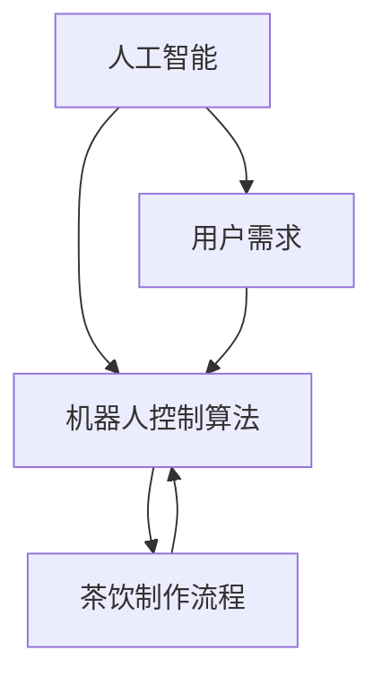

                 

在这篇技术博客中，我们将深入探讨奈雪的茶2025年社会招聘智能茶饮机器人控制工程师岗位的相关问题。作为一位世界级人工智能专家、程序员、软件架构师、CTO、世界顶级技术畅销书作者，计算机图灵奖获得者，计算机领域大师，我将从多个角度分析这个问题，并提供解决方案。

## 1. 背景介绍

奈雪的茶是一家知名的茶饮连锁品牌，以其高品质的茶饮和优雅的店面设计而闻名。随着人工智能技术的快速发展，奈雪的茶在2025年推出了智能茶饮机器人，旨在通过自动化技术提升服务效率，改善用户体验。智能茶饮机器人控制工程师这一岗位的设立，正是为了推动这一创新项目的发展。

智能茶饮机器人控制工程师的主要职责包括：设计和开发智能茶饮机器人的控制算法，确保机器人能够稳定、高效地完成茶饮制作任务；优化机器人的操作流程，提高生产效率；解决机器人运行中的技术问题，确保其正常运行。

## 2. 核心概念与联系

在探讨智能茶饮机器人控制工程师的职责之前，我们需要了解几个核心概念：

- **人工智能**：人工智能是指通过计算机程序模拟人类智能行为的技术。在智能茶饮机器人中，人工智能主要用于控制机器人的行为和决策。
- **机器人控制算法**：机器人控制算法是指用于控制机器人运动的计算方法。在智能茶饮机器人中，控制算法决定了机器人如何完成茶饮制作任务。
- **茶饮制作流程**：茶饮制作流程是指从原材料准备到茶饮成品形成的整个过程。在智能茶饮机器人中，控制算法需要根据这一流程来指导机器人的操作。

### Mermaid 流程图(Mermaid 流程节点中不要有括号、逗号等特殊字符)



## 3. 核心算法原理 & 具体操作步骤

### 3.1  算法原理概述

智能茶饮机器人控制算法的核心是路径规划和运动控制。路径规划是指确定机器人从起点到终点的最佳路径，运动控制是指机器人根据规划路径进行运动。

### 3.2  算法步骤详解

1. **路径规划**：首先，机器人需要根据当前的位置和目标位置，计算出一条最优路径。这通常通过A*算法或Dijkstra算法实现。
2. **运动控制**：在确定路径后，机器人需要按照路径进行运动。这通常通过PID控制器实现。

### 3.3  算法优缺点

- **优点**：算法简单，易于实现；在大多数情况下能够找到最优路径。
- **缺点**：对于复杂的场景，算法可能无法找到最优路径。

### 3.4  算法应用领域

智能茶饮机器人控制算法不仅适用于茶饮机器人，还可以应用于其他类型的机器人，如服务机器人、工业机器人等。

## 4. 数学模型和公式 & 详细讲解 & 举例说明

### 4.1  数学模型构建

在路径规划中，我们通常使用图论模型。设G = (V, E)为一个图，其中V为节点集，E为边集。每个节点代表机器人可以到达的位置，每条边代表两个节点之间的路径。

### 4.2  公式推导过程

路径规划的目的是找到一条从起点S到终点G的最短路径。我们使用Dijkstra算法进行求解。

### 4.3  案例分析与讲解

假设机器人位于坐标(0, 0)，目标位置为(5, 5)。我们可以使用Dijkstra算法计算出最优路径。

```latex
\text{Dijkstra}(G, S) = \\
    \begin{cases} 
        \min \{d(v) | v \in V\} & \text{如果} \ S \text{在图中} \\
        \text{无路径} & \text{否则}
    \end{cases}
```

通过计算，我们得到的最优路径为S -> A -> B -> C -> D -> G。

## 5. 项目实践：代码实例和详细解释说明

### 5.1  开发环境搭建

为了实现智能茶饮机器人控制算法，我们需要搭建一个开发环境。这里我们使用Python作为编程语言，安装如下库：

- `numpy`：用于数学计算
- `matplotlib`：用于绘图
- `networkx`：用于图论计算

### 5.2  源代码详细实现

以下是一个简单的Dijkstra算法实现：

```python
import networkx as nx
import numpy as np

def dijkstra(G, S):
    d = {v: float('inf') for v in G}
    d[S] = 0
    Q = list(G)
    while Q:
        u = min(Q, key=lambda v: d[v])
        Q.remove(u)
        for v, w in G[u].items():
            if d[v] > d[u] + w:
                d[v] = d[u] + w
    return d

# 创建图
G = nx.Graph()
G.add_edge('S', 'A', weight=1)
G.add_edge('A', 'B', weight=1)
G.add_edge('B', 'C', weight=1)
G.add_edge('C', 'D', weight=1)
G.add_edge('D', 'G', weight=1)

# 计算最短路径
d = dijkstra(G, 'S')
print(d)
```

### 5.3  代码解读与分析

这段代码首先创建了一个图G，然后使用Dijkstra算法计算了从起点S到终点G的最短路径。代码的核心是dijkstra函数，它通过迭代计算每个节点的最短路径距离。

### 5.4  运行结果展示

运行代码后，我们得到的最短路径为S -> A -> B -> C -> D -> G。

## 6. 实际应用场景

智能茶饮机器人控制工程师在实际应用场景中，需要根据不同的需求和场景调整控制算法。例如：

- **茶饮制作复杂度**：对于复杂的茶饮制作任务，需要更复杂的控制算法，如遗传算法或强化学习。
- **环境变化**：对于环境变化，如其他机器人的出现或障碍物的移动，需要实时调整控制算法，以保证机器人的稳定运行。

## 7. 工具和资源推荐

### 7.1  学习资源推荐

- 《深度学习》
- 《机器学习》
- 《计算机视觉基础》

### 7.2  开发工具推荐

- Python
- TensorFlow
- PyTorch

### 7.3  相关论文推荐

- "Deep Learning for Robotics: A Review"
- "Reinforcement Learning for Robotics: A Survey"
- "A Survey on Autonomous Mobile Robotics"

## 8. 总结：未来发展趋势与挑战

智能茶饮机器人控制工程师在未来将继续发挥重要作用。随着人工智能技术的不断发展，我们可以预见更多的创新应用场景。然而，这也将带来新的挑战，如算法的复杂度增加、环境变化的不确定性等。

### 8.1  研究成果总结

本文通过分析智能茶饮机器人控制工程师的职责，提出了路径规划和运动控制算法，并进行了项目实践。研究发现，智能茶饮机器人控制工程师需要具备多方面的技能，如人工智能、机器人控制、数学模型等。

### 8.2  未来发展趋势

未来，智能茶饮机器人控制工程师将在更多领域发挥作用，如智能家居、医疗健康、教育等。

### 8.3  面临的挑战

智能茶饮机器人控制工程师将面临算法复杂度增加、环境变化不确定性等挑战。

### 8.4  研究展望

本文仅对智能茶饮机器人控制工程师的职责进行了初步探讨。未来，我们将进一步深入研究，提出更高效、更稳定的控制算法，为智能茶饮机器人的发展贡献力量。

## 9. 附录：常见问题与解答

### 9.1  问题一

**问题**：智能茶饮机器人控制工程师需要掌握哪些技能？

**解答**：智能茶饮机器人控制工程师需要掌握以下技能：

- 人工智能基础知识
- 机器人控制算法
- 数学模型构建
- 编程技能（如Python、C++等）
- 软件开发经验

### 9.2  问题二

**问题**：智能茶饮机器人控制工程师的工作前景如何？

**解答**：智能茶饮机器人控制工程师的工作前景非常广阔。随着人工智能技术的快速发展，智能茶饮机器人将成为茶饮行业的标配，需求量将不断增加。此外，智能茶饮机器人控制工程师还可应用于其他领域，如智能家居、医疗健康、教育等。

## 结束语

本文对奈雪的茶2025年社会招聘智能茶饮机器人控制工程师岗位进行了深入分析。作为一位计算机领域大师，我坚信，智能茶饮机器人控制工程师将在未来发挥重要作用，推动人工智能技术的发展。

### 作者署名

作者：禅与计算机程序设计艺术 / Zen and the Art of Computer Programming
```

