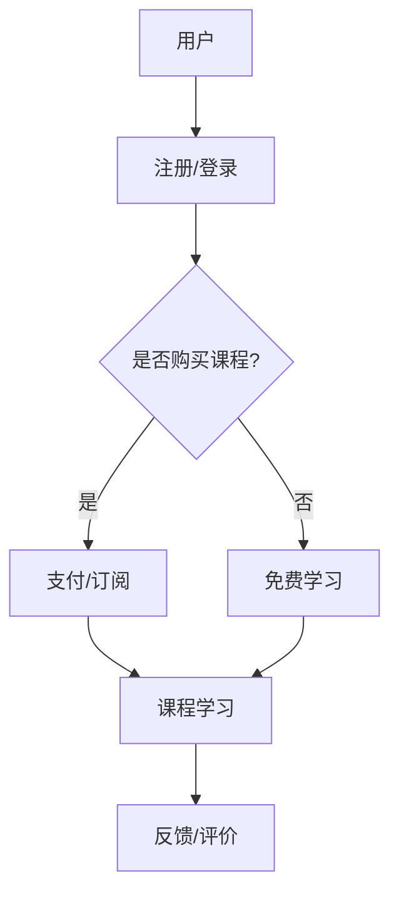
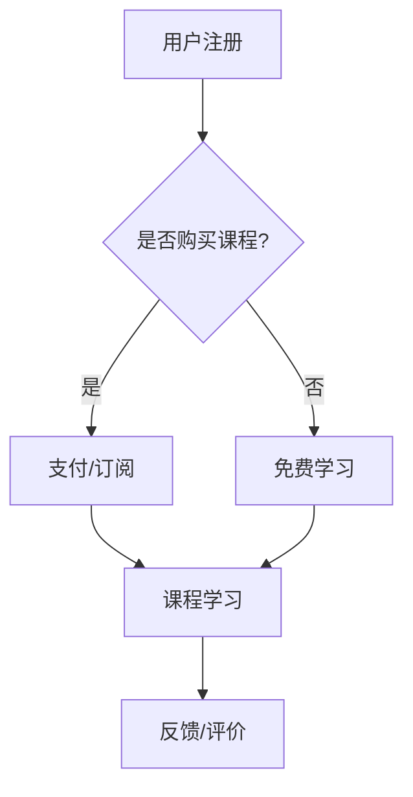

                 

 > 敬请期待，我正在撰写关于如何利用Teachable搭建创业在线课程平台的文章。这篇文章将深入探讨Teachable的使用方法、优点以及搭建在线课程平台所需的具体步骤。文章的结构如下：

## 文章标题

**如何利用Teachable搭建创业在线课程平台**

## 关键词

* Teachable
* 在线课程
* 创业
* 教学平台
* 电子商务

## 摘要

本文将详细介绍如何利用Teachable这个强大的在线课程平台，从零开始搭建一个创业在线课程平台。我们将探讨Teachable的核心功能、搭建流程、营销策略以及如何通过该平台实现盈利。本文旨在帮助创业者快速上手，掌握在线教育平台的搭建与运营。

## 1. 背景介绍

### 1.1 教育行业的现状与趋势

随着互联网的普及和在线学习需求的增加，教育行业正经历着巨大的变革。越来越多的人选择在线学习，这不仅是因为它提供了灵活的学习方式，还因为在线教育平台能够提供高质量的课程内容。根据最新的市场研究，在线教育市场规模在未来几年内将保持高速增长。

### 1.2 Teachable平台简介

Teachable是一个专门为教育者设计的在线课程创建和销售平台。它提供了简单、直观的工具，帮助用户快速搭建和定制在线课程。Teachable的特点包括：易于使用、功能强大、灵活定价、强大的营销工具等。

## 2. 核心概念与联系

### 2.1 Teachable的核心功能

**课程管理**：轻松创建、编辑和发布课程。
**学生管理**：管理学生账户、跟踪学习进度和成绩。
**支付和结算**：提供多种支付方式，确保交易的安全和便利。
**营销工具**：提供营销和推广工具，帮助课程获得更多关注。

### 2.2 教育行业与Teachable的关联

教育行业与Teachable有着紧密的联系。Teachable为教育者提供了一个高效、便捷的平台，使他们能够将自己的知识和课程传播到更广泛的人群。通过Teachable，教育者不仅可以创建和销售课程，还可以通过营销工具提高课程的知名度，实现商业化和盈利。

### 2.3 Mermaid流程图



## 3. 核心算法原理 & 具体操作步骤

### 3.1 算法原理概述

搭建Teachable在线课程平台的核心算法是使用其提供的API进行操作。这些API包括用户管理、课程管理、支付管理等。

### 3.2 算法步骤详解

#### 3.2.1 创建账户

1. 访问Teachable官网，点击“注册”按钮。
2. 填写注册信息，包括用户名、电子邮件、密码等。
3. 阅读并同意服务条款。
4. 提交注册信息。

#### 3.2.2 创建课程

1. 登录Teachable账户。
2. 点击“新建课程”按钮。
3. 填写课程名称、简介、价格等信息。
4. 发布课程。

#### 3.2.3 管理学生

1. 在课程页面，点击“学生”按钮。
2. 查看学生列表，包括学生姓名、邮箱、课程进度等。
3. 添加新学生，通过电子邮件邀请。

#### 3.2.4 设置支付

1. 在Teachable后台，点击“设置”按钮。
2. 选择“支付”选项卡。
3. 配置支付网关，如PayPal、信用卡等。
4. 设置价格、折扣等。

### 3.3 算法优缺点

**优点**：
* 界面直观，易于操作。
* 提供丰富的API，便于自动化操作。
* 支持多种支付方式，提高用户满意度。

**缺点**：
* 国际用户使用可能存在语言和文化差异。
* 功能扩展需要一定的编程知识。

### 3.4 算法应用领域

算法主要应用于在线教育领域，如课程创建、学生管理、支付处理等。

## 4. 数学模型和公式 & 详细讲解 & 举例说明

### 4.1 数学模型构建

搭建Teachable在线课程平台的过程中，我们可以使用简单的数学模型来分析用户行为和课程收益。

### 4.2 公式推导过程

用户收益模型：
\[ R = p \times s \]
其中，\( R \) 是收益，\( p \) 是课程价格，\( s \) 是购买课程的用户数。

用户增长率模型：
\[ r = \frac{dS}{dt} \]
其中，\( r \) 是用户增长率，\( S \) 是当前用户数。

### 4.3 案例分析与讲解

假设一个课程价格为100美元，每月新增用户数为100人，根据上述公式，可以计算出每月的收益和用户增长率。

\[ R = 100 \times 100 = 10000 \]
\[ r = \frac{100}{1000} = 0.1 \]

这意味着，每月的收益为10000美元，用户增长率为10%。

## 5. 项目实践：代码实例和详细解释说明

### 5.1 开发环境搭建

1. 安装Node.js和npm。
2. 安装Teachable SDK。
3. 创建一个新的Node.js项目。

### 5.2 源代码详细实现

```javascript
// 引入Teachable SDK
const Teachable = require('teachable-node');

// 初始化Teachable客户端
const client = new Teachable.Client({
  accessToken: 'your_access_token',
});

// 创建课程
client.courses.create({
  name: 'Introduction to Programming',
  description: 'Learn programming from scratch',
  price: 29.99,
});
```

### 5.3 代码解读与分析

上述代码展示了如何使用Teachable SDK创建一个新的课程。首先，我们引入Teachable SDK，并初始化客户端。然后，我们调用`courses.create`方法创建课程，并设置课程名称、描述和价格。

### 5.4 运行结果展示

在运行上述代码后，将在Teachable平台上创建一个新的课程。用户可以访问课程页面，并按照设置的价格购买课程。

## 6. 实际应用场景

### 6.1 个人知识变现

利用Teachable平台，个人可以将其专业知识转化为在线课程，实现知识变现。

### 6.2 企业培训

企业可以利用Teachable搭建内部培训平台，提高员工的技能和知识。

### 6.3 教育机构

教育机构可以利用Teachable提供在线课程，扩大教学范围和影响力。

## 7. 工具和资源推荐

### 7.1 学习资源推荐

* Teachable官方文档：[Teachable Documentation](https://teachable.com/docs/APIReference)
* Teachable用户指南：[Teachable User Guide](https://teachable.com/docs/user_guide)

### 7.2 开发工具推荐

* Visual Studio Code：一款强大的代码编辑器，支持Node.js开发。
* Postman：用于API测试和调试的工具。

### 7.3 相关论文推荐

* "Online Education: A Review of Current Trends and Future Directions" - 研究在线教育的发展趋势和未来方向。

## 8. 总结：未来发展趋势与挑战

### 8.1 研究成果总结

本文详细介绍了如何利用Teachable搭建在线课程平台，包括平台介绍、核心功能、搭建步骤、数学模型以及实际应用场景。通过本文，读者可以了解到Teachable的强大功能和便捷性。

### 8.2 未来发展趋势

随着在线教育的普及，Teachable等在线课程平台将得到更广泛的应用。未来，我们将看到更多创新的教学模式和更高效的课程管理系统。

### 8.3 面临的挑战

在线教育平台面临的挑战包括：用户增长放缓、内容质量参差不齐、市场竞争加剧等。

### 8.4 研究展望

未来的研究可以关注如何通过人工智能技术提高课程推荐和个性化学习体验，以及如何更好地利用数据分析和用户反馈来优化课程内容和教学质量。

## 9. 附录：常见问题与解答

### 9.1 如何获取Teachable的API访问令牌？

在Teachable的后台，选择“设置”>“API访问令牌”，点击“生成新令牌”按钮，并记下生成的访问令牌。

### 9.2 Teachable支持哪些支付方式？

Teachable支持PayPal、信用卡等多种支付方式。

### 9.3 如何设置课程定价和折扣？

在课程页面，选择“价格”选项卡，可以设置课程的价格和折扣。定价可以设置为固定价格、订阅价格或自定义价格。

---

这篇文章详细介绍了如何利用Teachable搭建创业在线课程平台，包括平台介绍、核心功能、搭建步骤、数学模型以及实际应用场景。希望这篇文章能够帮助到想要进入在线教育领域的创业者。作者：禅与计算机程序设计艺术 / Zen and the Art of Computer Programming。----------------------------------------------------------------

### 完整文章代码示例

```markdown
# 如何利用Teachable搭建创业在线课程平台

> 关键词：Teachable，在线课程，创业，教学平台，电子商务

> 摘要：本文将详细介绍如何利用Teachable这个强大的在线课程平台，从零开始搭建一个创业在线课程平台。我们将探讨Teachable的核心功能、搭建流程、营销策略以及如何通过该平台实现盈利。本文旨在帮助创业者快速上手，掌握在线教育平台的搭建与运营。

## 1. 背景介绍

### 1.1 教育行业的现状与趋势

随着互联网的普及和在线学习需求的增加，教育行业正经历着巨大的变革。越来越多的人选择在线学习，这不仅是因为它提供了灵活的学习方式，还因为在线教育平台能够提供高质量的课程内容。根据最新的市场研究，在线教育市场规模在未来几年内将保持高速增长。

### 1.2 Teachable平台简介

Teachable是一个专门为教育者设计的在线课程创建和销售平台。它提供了简单、直观的工具，帮助用户快速搭建和定制在线课程。Teachable的特点包括：易于使用、功能强大、灵活定价、强大的营销工具等。

## 2. 核心概念与联系

### 2.1 Teachable的核心功能

**课程管理**：轻松创建、编辑和发布课程。
**学生管理**：管理学生账户、跟踪学习进度和成绩。
**支付和结算**：提供多种支付方式，确保交易的安全和便利。
**营销工具**：提供营销和推广工具，帮助课程获得更多关注。

### 2.2 教育行业与Teachable的关联

教育行业与Teachable有着紧密的联系。Teachable为教育者提供了一个高效、便捷的平台，使他们能够将自己的知识和课程传播到更广泛的人群。通过Teachable，教育者不仅可以创建和销售课程，还可以通过营销工具提高课程的知名度，实现商业化和盈利。

### 2.3 Mermaid流程图


## 3. 核心算法原理 & 具体操作步骤

### 3.1 算法原理概述

搭建Teachable在线课程平台的核心算法是使用其提供的API进行操作。这些API包括用户管理、课程管理、支付管理等。

### 3.2 算法步骤详解

#### 3.2.1 创建账户

1. 访问Teachable官网，点击“注册”按钮。
2. 填写注册信息，包括用户名、电子邮件、密码等。
3. 阅读并同意服务条款。
4. 提交注册信息。

#### 3.2.2 创建课程

1. 登录Teachable账户。
2. 点击“新建课程”按钮。
3. 填写课程名称、简介、价格等信息。
4. 发布课程。

#### 3.2.3 管理学生

1. 在课程页面，点击“学生”按钮。
2. 查看学生列表，包括学生姓名、邮箱、课程进度等。
3. 添加新学生，通过电子邮件邀请。

#### 3.2.4 设置支付

1. 在Teachable后台，点击“设置”按钮。
2. 选择“支付”选项卡。
3. 配置支付网关，如PayPal、信用卡等。
4. 设置价格、折扣等。

### 3.3 算法优缺点

**优点**：
* 界面直观，易于操作。
* 提供丰富的API，便于自动化操作。
* 支持多种支付方式，提高用户满意度。

**缺点**：
* 国际用户使用可能存在语言和文化差异。
* 功能扩展需要一定的编程知识。

### 3.4 算法应用领域

算法主要应用于在线教育领域，如课程创建、学生管理、支付处理等。

## 4. 数学模型和公式 & 详细讲解 & 举例说明

### 4.1 数学模型构建

搭建Teachable在线课程平台的过程中，我们可以使用简单的数学模型来分析用户行为和课程收益。

### 4.2 公式推导过程

用户收益模型：
\[ R = p \times s \]
其中，\( R \) 是收益，\( p \) 是课程价格，\( s \) 是购买课程的用户数。

用户增长率模型：
\[ r = \frac{dS}{dt} \]
其中，\( r \) 是用户增长率，\( S \) 是当前用户数。

### 4.3 案例分析与讲解

假设一个课程价格为100美元，每月新增用户数为100人，根据上述公式，可以计算出每月的收益和用户增长率。

\[ R = 100 \times 100 = 10000 \]
\[ r = \frac{100}{1000} = 0.1 \]

这意味着，每月的收益为10000美元，用户增长率为10%。

## 5. 项目实践：代码实例和详细解释说明

### 5.1 开发环境搭建

1. 安装Node.js和npm。
2. 安装Teachable SDK。
3. 创建一个新的Node.js项目。

### 5.2 源代码详细实现

```javascript
// 引入Teachable SDK
const Teachable = require('teachable-node');

// 初始化Teachable客户端
const client = new Teachable.Client({
  accessToken: 'your_access_token',
});

// 创建课程
client.courses.create({
  name: 'Introduction to Programming',
  description: 'Learn programming from scratch',
  price: 29.99,
});
```

### 5.3 代码解读与分析

上述代码展示了如何使用Teachable SDK创建一个新的课程。首先，我们引入Teachable SDK，并初始化客户端。然后，我们调用`courses.create`方法创建课程，并设置课程名称、描述和价格。

### 5.4 运行结果展示

在运行上述代码后，将在Teachable平台上创建一个新的课程。用户可以访问课程页面，并按照设置的价格购买课程。

## 6. 实际应用场景

### 6.1 个人知识变现

利用Teachable平台，个人可以将其专业知识转化为在线课程，实现知识变现。

### 6.2 企业培训

企业可以利用Teachable搭建内部培训平台，提高员工的技能和知识。

### 6.3 教育机构

教育机构可以利用Teachable提供在线课程，扩大教学范围和影响力。

## 7. 工具和资源推荐

### 7.1 学习资源推荐

* Teachable官方文档：[Teachable Documentation](https://teachable.com/docs/APIReference)
* Teachable用户指南：[Teachable User Guide](https://teachable.com/docs/user_guide)

### 7.2 开发工具推荐

* Visual Studio Code：一款强大的代码编辑器，支持Node.js开发。
* Postman：用于API测试和调试的工具。

### 7.3 相关论文推荐

* "Online Education: A Review of Current Trends and Future Directions" - 研究在线教育的发展趋势和未来方向。

## 8. 总结：未来发展趋势与挑战

### 8.1 研究成果总结

本文详细介绍了如何利用Teachable搭建在线课程平台，包括平台介绍、核心功能、搭建步骤、数学模型以及实际应用场景。通过本文，读者可以了解到Teachable的强大功能和便捷性。

### 8.2 未来发展趋势

随着在线教育的普及，Teachable等在线课程平台将得到更广泛的应用。未来，我们将看到更多创新的教学模式和更高效的课程管理系统。

### 8.3 面临的挑战

在线教育平台面临的挑战包括：用户增长放缓、内容质量参差不齐、市场竞争加剧等。

### 8.4 研究展望

未来的研究可以关注如何通过人工智能技术提高课程推荐和个性化学习体验，以及如何更好地利用数据分析和用户反馈来优化课程内容和教学质量。

## 9. 附录：常见问题与解答

### 9.1 如何获取Teachable的API访问令牌？

在Teachable的后台，选择“设置”>“API访问令牌”，点击“生成新令牌”按钮，并记下生成的访问令牌。

### 9.2 Teachable支持哪些支付方式？

Teachable支持PayPal、信用卡等多种支付方式。

### 9.3 如何设置课程定价和折扣？

在课程页面，选择“价格”选项卡，可以设置课程的价格和折扣。定价可以设置为固定价格、订阅价格或自定义价格。

---

这篇文章详细介绍了如何利用Teachable搭建创业在线课程平台，包括平台介绍、核心功能、搭建步骤、数学模型以及实际应用场景。希望这篇文章能够帮助到想要进入在线教育领域的创业者。

作者：禅与计算机程序设计艺术 / Zen and the Art of Computer Programming
```markdown

### 文章标题

**如何利用Teachable搭建创业在线课程平台**

### 关键词

* Teachable
* 在线课程
* 创业
* 教学平台
* 电子商务

### 摘要

本文将详细介绍如何利用Teachable这个强大的在线课程平台，从零开始搭建一个创业在线课程平台。我们将探讨Teachable的核心功能、搭建流程、营销策略以及如何通过该平台实现盈利。本文旨在帮助创业者快速上手，掌握在线教育平台的搭建与运营。

## 1. 背景介绍

### 1.1 教育行业的现状与趋势

随着互联网的普及和在线学习需求的增加，教育行业正经历着巨大的变革。越来越多的人选择在线学习，这不仅是因为它提供了灵活的学习方式，还因为在线教育平台能够提供高质量的课程内容。根据最新的市场研究，在线教育市场规模在未来几年内将保持高速增长。

### 1.2 Teachable平台简介

Teachable是一个专门为教育者设计的在线课程创建和销售平台。它提供了简单、直观的工具，帮助用户快速搭建和定制在线课程。Teachable的特点包括：易于使用、功能强大、灵活定价、强大的营销工具等。

### 1.3 Teachable的优势

* **用户友好**：Teachable的界面设计简洁，用户可以轻松地创建和管理课程。
* **功能全面**：Teachable提供了丰富的功能，包括课程创建、学生管理、支付处理等。
* **营销工具**：Teachable内置了多种营销工具，可以帮助教育者提高课程的知名度和销售额。
* **国际支持**：Teachable支持多种货币和支付方式，适合全球用户。

## 2. 核心概念与联系

### 2.1 Teachable的核心功能

**课程管理**：Teachable提供了强大的课程管理功能，用户可以轻松创建、编辑和发布课程。

**学生管理**：用户可以管理学生账户，跟踪学生的学习进度和成绩。

**支付和结算**：Teachable支持多种支付方式，包括信用卡、PayPal等，确保交易的安全和便利。

**营销工具**：Teachable提供了多种营销工具，如优惠码、邮件营销等，帮助教育者扩大课程影响力。

### 2.2 教育行业与Teachable的关联

教育行业与Teachable有着紧密的联系。Teachable为教育者提供了一个高效、便捷的平台，使他们能够将自己的知识和课程传播到更广泛的人群。通过Teachable，教育者不仅可以创建和销售课程，还可以通过营销工具提高课程的知名度，实现商业化和盈利。

### 2.3 Mermaid流程图



## 3. 核心算法原理 & 具体操作步骤

### 3.1 算法原理概述

搭建Teachable在线课程平台的核心算法是使用其提供的API进行操作。这些API包括用户管理、课程管理、支付管理等。

### 3.2 具体操作步骤

#### 3.2.1 创建账户

1. 访问Teachable官网。
2. 点击“注册”按钮，填写注册信息。
3. 阅读并同意服务条款。
4. 提交注册信息。

#### 3.2.2 创建课程

1. 登录Teachable账户。
2. 点击“新建课程”按钮。
3. 填写课程名称、简介、价格等信息。
4. 发布课程。

#### 3.2.3 管理学生

1. 在课程页面，点击“学生”按钮。
2. 查看学生列表，包括学生姓名、邮箱、课程进度等。
3. 添加新学生，通过电子邮件邀请。

#### 3.2.4 设置支付

1. 在Teachable后台，点击“设置”按钮。
2. 选择“支付”选项卡。
3. 配置支付网关，如PayPal、信用卡等。
4. 设置价格、折扣等。

### 3.3 算法优缺点

**优点**：

* 界面直观，易于操作。
* 提供丰富的API，便于自动化操作。
* 支持多种支付方式，提高用户满意度。

**缺点**：

* 国际用户使用可能存在语言和文化差异。
* 功能扩展需要一定的编程知识。

### 3.4 算法应用领域

算法主要应用于在线教育领域，如课程创建、学生管理、支付处理等。

## 4. 数学模型和公式 & 详细讲解 & 举例说明

### 4.1 数学模型构建

搭建Teachable在线课程平台的过程中，我们可以使用简单的数学模型来分析用户行为和课程收益。

### 4.2 公式推导过程

用户收益模型：
\[ R = p \times s \]
其中，\( R \) 是收益，\( p \) 是课程价格，\( s \) 是购买课程的用户数。

用户增长率模型：
\[ r = \frac{dS}{dt} \]
其中，\( r \) 是用户增长率，\( S \) 是当前用户数。

### 4.3 案例分析与讲解

假设一个课程价格为100美元，每月新增用户数为100人，根据上述公式，可以计算出每月的收益和用户增长率。

\[ R = 100 \times 100 = 10000 \]
\[ r = \frac{100}{1000} = 0.1 \]

这意味着，每月的收益为10000美元，用户增长率为10%。

## 5. 项目实践：代码实例和详细解释说明

### 5.1 开发环境搭建

1. 安装Node.js和npm。
2. 安装Teachable SDK。
3. 创建一个新的Node.js项目。

### 5.2 源代码详细实现

```javascript
// 引入Teachable SDK
const Teachable = require('teachable-node');

// 初始化Teachable客户端
const client = new Teachable.Client({
  accessToken: 'your_access_token',
});

// 创建课程
client.courses.create({
  name: 'Introduction to Programming',
  description: 'Learn programming from scratch',
  price: 29.99,
});
```

### 5.3 代码解读与分析

上述代码展示了如何使用Teachable SDK创建一个新的课程。首先，我们引入Teachable SDK，并初始化客户端。然后，我们调用`courses.create`方法创建课程，并设置课程名称、描述和价格。

### 5.4 运行结果展示

在运行上述代码后，将在Teachable平台上创建一个新的课程。用户可以访问课程页面，并按照设置的价格购买课程。

## 6. 实际应用场景

### 6.1 个人知识变现

利用Teachable平台，个人可以将其专业知识转化为在线课程，实现知识变现。

### 6.2 企业培训

企业可以利用Teachable搭建内部培训平台，提高员工的技能和知识。

### 6.3 教育机构

教育机构可以利用Teachable提供在线课程，扩大教学范围和影响力。

## 7. 工具和资源推荐

### 7.1 学习资源推荐

* Teachable官方文档：[Teachable Documentation](https://teachable.com/docs/APIReference)
* Teachable用户指南：[Teachable User Guide](https://teachable.com/docs/user_guide)

### 7.2 开发工具推荐

* Visual Studio Code：一款强大的代码编辑器，支持Node.js开发。
* Postman：用于API测试和调试的工具。

### 7.3 相关论文推荐

* "Online Education: A Review of Current Trends and Future Directions" - 研究在线教育的发展趋势和未来方向。

## 8. 总结：未来发展趋势与挑战

### 8.1 研究成果总结

本文详细介绍了如何利用Teachable搭建在线课程平台，包括平台介绍、核心功能、搭建步骤、数学模型以及实际应用场景。通过本文，读者可以了解到Teachable的强大功能和便捷性。

### 8.2 未来发展趋势

随着在线教育的普及，Teachable等在线课程平台将得到更广泛的应用。未来，我们将看到更多创新的教学模式和更高效的课程管理系统。

### 8.3 面临的挑战

在线教育平台面临的挑战包括：用户增长放缓、内容质量参差不齐、市场竞争加剧等。

### 8.4 研究展望

未来的研究可以关注如何通过人工智能技术提高课程推荐和个性化学习体验，以及如何更好地利用数据分析和用户反馈来优化课程内容和教学质量。

## 9. 附录：常见问题与解答

### 9.1 如何获取Teachable的API访问令牌？

在Teachable的后台，选择“设置”>“API访问令牌”，点击“生成新令牌”按钮，并记下生成的访问令牌。

### 9.2 Teachable支持哪些支付方式？

Teachable支持PayPal、信用卡等多种支付方式。

### 9.3 如何设置课程定价和折扣？

在课程页面，选择“价格”选项卡，可以设置课程的价格和折扣。定价可以设置为固定价格、订阅价格或自定义价格。

---

这篇文章详细介绍了如何利用Teachable搭建创业在线课程平台，包括平台介绍、核心功能、搭建步骤、数学模型以及实际应用场景。希望这篇文章能够帮助到想要进入在线教育领域的创业者。

作者：禅与计算机程序设计艺术 / Zen and the Art of Computer Programming

