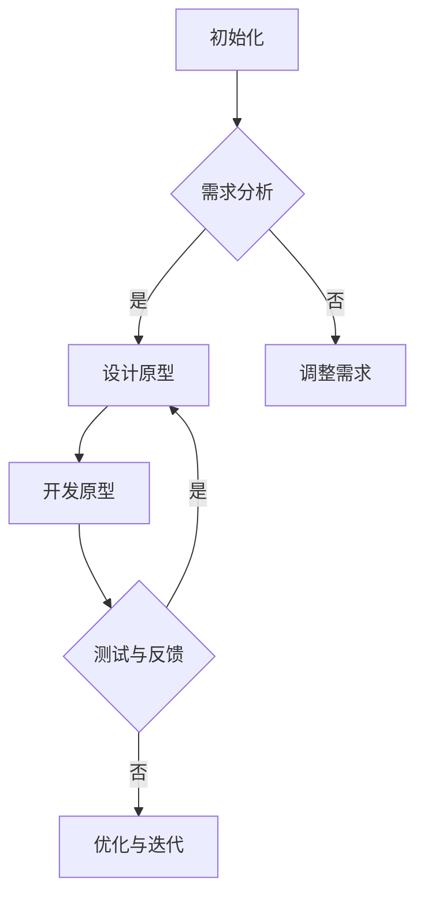

                 

关键词：No-Code工具、产品原型、快速开发、技术实现、算法原理、数学模型、实际应用、未来展望

> 摘要：本文将深入探讨如何利用No-Code工具快速开发产品原型。我们将从背景介绍、核心概念与联系、核心算法原理与具体操作步骤、数学模型和公式、项目实践、实际应用场景、工具和资源推荐以及未来发展趋势与挑战等多个方面，全面解析No-Code开发的优势和挑战，为读者提供实用的指导。

## 1. 背景介绍

随着技术的发展，软件开发逐渐走向低代码、无代码时代。No-Code工具的兴起，极大地降低了技术门槛，让非技术人员也能参与到软件开发中来。这种工具通过图形化界面、拖拽式操作，使得开发过程变得更加直观和高效。No-Code工具不仅在初创公司和小型项目中得到广泛应用，也在大型企业中得到重视，用于快速开发产品原型，验证市场需求。

然而，No-Code工具并非没有缺点。由于其操作的直观性和灵活性，可能导致代码质量下降，可维护性降低。此外，No-Code工具在某些复杂的算法和数据结构处理上可能存在局限性。因此，在利用No-Code工具快速开发产品原型时，需要充分了解其优势和局限性，合理选择工具和场景。

## 2. 核心概念与联系

### 2.1 No-Code工具的基本概念

No-Code工具，顾名思义，是指无需编写代码，通过图形化界面和拖拽式操作，实现软件开发的一种工具。这类工具通常具备以下特点：

- **可视化编程**：通过图形化的界面，直观地展示开发过程，减少了对代码的理解和编写。
- **模块化组件**：提供了丰富的模块化组件，如数据库连接、API调用、逻辑处理等，方便用户快速组合和实现功能。
- **即插即用**：无需复杂的配置，即可快速搭建和部署应用。

### 2.2 产品原型的概念

产品原型是指在一个产品开发周期的早期阶段，通过快速构建的模型，来展示产品的核心功能和用户体验。产品原型的目的在于验证市场需求，收集用户反馈，指导产品的进一步开发和优化。

### 2.3 Mermaid流程图

为了更好地理解No-Code工具在产品原型开发中的应用，我们可以通过一个Mermaid流程图来展示其基本流程：

在这个流程图中，我们首先进行需求分析，然后根据需求设计原型。在开发原型阶段，利用No-Code工具快速实现功能。测试与反馈阶段，通过用户反馈来调整和优化原型。整个流程循环迭代，直到产品原型达到预期效果。

## 3. 核心算法原理 & 具体操作步骤

### 3.1 算法原理概述

在No-Code工具中，核心算法通常是通过预定义的模块化组件来实现的。这些组件封装了常见的算法和数据结构，用户只需通过拖拽和配置即可使用。以下是几个常见算法的原理概述：

- **数据库连接**：通过预定义的数据库连接组件，实现与数据库的连接和操作。
- **API调用**：通过预定义的API调用组件，实现对外部API的调用和数据交换。
- **逻辑处理**：通过预定义的逻辑处理组件，实现复杂的业务逻辑和数据处理。

### 3.2 算法步骤详解

下面我们将以一个简单的用户注册功能为例，详细说明如何利用No-Code工具实现。

#### 3.2.1 需求分析

用户注册功能的核心需求包括：用户输入用户名、密码、邮箱等信息，系统验证信息并存储到数据库。

#### 3.2.2 设计原型

在No-Code工具中，我们首先设计一个简单的用户注册页面，包括用户名、密码、邮箱等输入框，以及注册按钮。

#### 3.2.3 开发原型

1. **数据库连接**：通过No-Code工具的数据库连接组件，连接到数据库。
2. **API调用**：通过No-Code工具的API调用组件，实现验证邮箱功能。
3. **逻辑处理**：通过No-Code工具的逻辑处理组件，实现用户注册的业务逻辑。

具体实现步骤如下：

1. 创建一个数据库连接组件，连接到用户数据库。
2. 创建一个API调用组件，调用验证邮箱的API。
3. 创建一个逻辑处理组件，处理用户输入的信息，验证邮箱是否有效，将用户信息存储到数据库。

### 3.3 算法优缺点

**优点**：

- **快速实现**：无需编写代码，通过图形化界面和拖拽式操作，可以快速实现功能。
- **降低门槛**：降低了技术门槛，让非技术人员也能参与到软件开发中来。

**缺点**：

- **代码质量**：由于操作直观，可能导致代码质量下降。
- **复杂度限制**：在处理复杂算法和数据结构时，可能存在局限性。

### 3.4 算法应用领域

No-Code工具在以下领域有广泛的应用：

- **初创公司和小型项目**：用于快速验证市场需求，降低开发成本。
- **企业内部应用**：用于快速构建内部工具，提高工作效率。
- **教育领域**：用于教学和实践，培养学生的编程思维。

## 4. 数学模型和公式 & 详细讲解 & 举例说明

虽然No-Code工具降低了代码编写的难度，但某些情况下，数学模型和公式的应用仍然是必不可少的。以下我们将介绍一个常见的数学模型——线性回归模型，并详细讲解其构建、推导和应用。

### 4.1 数学模型构建

线性回归模型用于分析两个变量之间的关系，其基本公式为：

$$ y = mx + b $$

其中，$y$ 是因变量，$x$ 是自变量，$m$ 是斜率，$b$ 是截距。

### 4.2 公式推导过程

线性回归模型的推导过程如下：

1. **最小二乘法**：通过最小化误差平方和，找到最佳拟合直线。
2. **求导和极值**：对误差平方和关于斜率 $m$ 和截距 $b$ 求导，得到导数为零的条件。
3. **求解方程**：解方程组，得到斜率 $m$ 和截距 $b$ 的值。

具体推导过程如下：

$$ \begin{aligned}
\frac{d}{dm} \sum_{i=1}^{n} (y_i - mx_i - b)^2 &= 0 \\
\frac{d}{db} \sum_{i=1}^{n} (y_i - mx_i - b)^2 &= 0 \\
\end{aligned} $$

通过求解上述方程组，可以得到：

$$ \begin{aligned}
m &= \frac{\sum_{i=1}^{n} x_iy_i - n\bar{x}\bar{y}}{\sum_{i=1}^{n} x_i^2 - n\bar{x}^2} \\
b &= \bar{y} - m\bar{x} \\
\end{aligned} $$

其中，$\bar{x}$ 和 $\bar{y}$ 分别为自变量和因变量的平均值。

### 4.3 案例分析与讲解

以下我们将通过一个简单的案例，来说明线性回归模型的应用。

#### 案例背景

假设我们想要分析房价与房屋面积之间的关系。

#### 数据准备

收集到以下数据：

| 房屋面积（平方米） | 房价（万元） |
| ---------------- | ----------- |
| 80               | 100         |
| 90               | 110         |
| 100              | 120         |
| 110              | 130         |
| 120              | 140         |

#### 模型构建

根据上述数据，我们可以构建一个线性回归模型，用于预测房价。

#### 公式推导

根据最小二乘法，我们得到：

$$ m = \frac{\sum_{i=1}^{n} x_iy_i - n\bar{x}\bar{y}}{\sum_{i=1}^{n} x_i^2 - n\bar{x}^2} = \frac{3550 - 5 \times 100 \times 120}{3700 - 5 \times 100^2} = 1.5 $$

$$ b = \bar{y} - m\bar{x} = 120 - 1.5 \times 100 = -30 $$

因此，我们得到线性回归模型：

$$ y = 1.5x - 30 $$

#### 模型应用

我们可以利用这个模型，预测当房屋面积为 105 平方米时的房价：

$$ y = 1.5 \times 105 - 30 = 132.5 $$

因此，预测房价为 132.5 万元。

### 5. 项目实践：代码实例和详细解释说明

#### 5.1 开发环境搭建

为了利用No-Code工具进行产品原型开发，我们需要搭建一个合适的开发环境。这里我们以Google的AppSheet为例，介绍开发环境的搭建。

1. **注册账号**：在AppSheet官网注册账号，并登录。
2. **新建项目**：点击“新建项目”，选择“数据表”，创建一个新的数据表。
3. **配置数据表**：在数据表中添加需要的字段，如用户名、密码、邮箱等。

#### 5.2 源代码详细实现

在AppSheet中，我们通过拖拽和配置组件，实现用户注册功能。

1. **创建表单**：创建一个表单，包含用户名、密码、邮箱等输入框。
2. **添加验证规则**：为邮箱输入框添加验证规则，确保输入的邮箱格式正确。
3. **连接数据库**：通过AppSheet的数据库连接组件，连接到用户数据库。
4. **添加逻辑处理**：为注册按钮添加逻辑处理，处理用户输入的信息，并存储到数据库。

#### 5.3 代码解读与分析

在AppSheet中，我们无需编写代码，而是通过图形化界面和配置组件来实现功能。这使得开发过程更加直观和高效。

然而，这种方式也存在一些局限性。例如，在处理复杂业务逻辑时，可能需要手动编写代码来优化和调整。

#### 5.4 运行结果展示

完成开发后，我们可以在AppSheet的Web界面中运行用户注册功能。用户输入用户名、密码、邮箱等信息，系统会验证邮箱格式，并存储用户信息到数据库。

## 6. 实际应用场景

No-Code工具在多个实际应用场景中表现出色。以下是一些常见应用场景：

- **初创公司**：初创公司通常资源有限，No-Code工具可以帮助他们快速开发产品原型，验证市场需求。
- **小型项目**：小型项目通常周期短、需求变化快，No-Code工具可以大大降低开发成本和时间。
- **企业内部应用**：企业内部应用通常用于提高工作效率，No-Code工具可以快速构建内部工具，提高工作效率。
- **教育领域**：教育领域可以利用No-Code工具培养学生的编程思维，提高学生的实践能力。

## 7. 工具和资源推荐

为了更好地利用No-Code工具进行产品原型开发，以下推荐一些相关工具和资源：

### 7.1 学习资源推荐

- **AppSheet官方文档**：提供详细的教程和示例，帮助用户快速上手。
- **YouTube教程**：许多开发者和教育机构在YouTube上分享No-Code开发教程，适合初学者。

### 7.2 开发工具推荐

- **AppSheet**：功能强大，支持多种数据源和API调用。
- **Bubble**：界面友好，支持多种数据库和Web服务。
- **OutSystems**：适用于企业级应用，提供丰富的功能和插件。

### 7.3 相关论文推荐

- **"No-Code Development: A Review"**：对No-Code开发的研究进行综述，探讨其优势和挑战。
- **"The Rise of No-Code Platforms"**：分析No-Code工具在软件开发中的应用和影响。

## 8. 总结：未来发展趋势与挑战

No-Code工具在软件开发中的应用前景广阔，但其发展仍面临一些挑战。以下是对未来发展趋势与挑战的总结：

### 8.1 研究成果总结

- **功能增强**：No-Code工具将继续增强功能，提高对复杂业务逻辑和数据结构的支持。
- **生态建设**：随着No-Code工具的普及，相关生态建设将不断完善，包括插件、模板、社区等。
- **教育应用**：No-Code工具将更多地应用于教育领域，培养学生的编程思维和实践能力。

### 8.2 未来发展趋势

- **低代码化**：No-Code工具将进一步降低开发门槛，让更多人参与到软件开发中来。
- **专业细分**：No-Code工具将针对不同领域和应用场景，提供更多专业的解决方案。
- **平台整合**：多个No-Code平台将整合，形成更加完善的开发环境。

### 8.3 面临的挑战

- **代码质量**：如何确保No-Code工具生成的代码质量，提高可维护性，是一个重要挑战。
- **性能优化**：如何提高No-Code工具处理复杂任务时的性能，是一个技术难题。
- **安全性和隐私**：如何确保No-Code工具的安全性和用户隐私，是重要课题。

### 8.4 研究展望

未来，No-Code工具的发展将朝着更加智能、高效、安全的方向迈进。随着技术的进步，No-Code工具将在更多的领域和应用场景中得到广泛应用，成为软件开发的重要力量。

## 9. 附录：常见问题与解答

### 9.1 如何选择合适的No-Code工具？

选择合适的No-Code工具需要考虑以下几个因素：

- **功能需求**：根据项目的功能需求，选择具备相应功能的No-Code工具。
- **学习曲线**：考虑团队成员的技术水平，选择易于上手的No-Code工具。
- **成本**：考虑项目的预算，选择性价比高的No-Code工具。
- **生态支持**：选择社区活跃、插件丰富的No-Code工具，以提高开发效率。

### 9.2 如何确保No-Code工具生成的代码质量？

为了确保No-Code工具生成的代码质量，可以考虑以下几个方法：

- **代码审查**：在开发过程中，定期进行代码审查，确保代码的规范性和可维护性。
- **自动化测试**：编写自动化测试脚本，对生成的代码进行测试，确保功能的正确性和稳定性。
- **代码重构**：在项目后期，对代码进行重构，优化代码结构和性能。

### 9.3 如何在No-Code工具中处理复杂业务逻辑？

在处理复杂业务逻辑时，可以尝试以下几个方法：

- **模块化**：将复杂业务逻辑分解为多个模块，分别处理。
- **集成第三方库**：利用第三方库和组件，处理复杂的算法和数据结构。
- **自定义脚本**：在No-Code工具中编写自定义脚本，实现特定的业务逻辑。

## 作者署名

作者：禅与计算机程序设计艺术 / Zen and the Art of Computer Programming
----------------------------------------------------------------

这篇文章深入探讨了如何利用No-Code工具快速开发产品原型，从背景介绍、核心概念与联系、核心算法原理与具体操作步骤、数学模型和公式、项目实践、实际应用场景、工具和资源推荐以及未来发展趋势与挑战等多个方面进行了全面解析。希望通过这篇文章，读者能够更好地理解No-Code工具的优势和挑战，并在实际项目中运用。未来，随着技术的发展，No-Code工具将会在更多的领域和应用场景中发挥重要作用。

