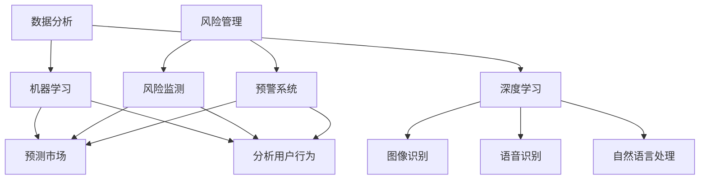

                 

关键词：人工智能，创业决策，风险管理，机器学习，深度学习，数据分析，创业创新

> 摘要：随着人工智能技术的发展，如何利用这一先进技术优化创业决策和风险管理成为当前研究的热点。本文将深入探讨人工智能技术在创业决策和风险管理中的应用，包括核心概念、算法原理、数学模型、实践案例以及未来发展趋势。通过详细分析和实例讲解，帮助创业者更好地理解并应用人工智能技术，提升创业成功率。

## 1. 背景介绍

在当今快速变化的市场环境中，创业不仅需要创新思维，还需要精准的决策和有效风险管理。传统的创业决策往往依赖于直觉和经验，而风险管理也常常依赖于历史数据和预测模型。然而，这些方法在复杂多变的环境中往往难以达到理想的效果。随着人工智能技术的迅猛发展，机器学习和深度学习等技术为创业决策和风险管理提供了新的工具和方法。

人工智能技术通过数据分析和模式识别，能够从海量数据中提取有价值的信息，为创业决策提供数据支持。同时，人工智能技术还可以通过自动化风险监测和预警系统，提高风险管理的效率和准确性。因此，如何有效地利用人工智能技术优化创业决策和风险管理，成为当前创业者和研究者的关注重点。

本文将从以下几个方面展开讨论：

1. **核心概念与联系**：介绍与创业决策和风险管理相关的人工智能核心概念，并绘制流程图进行说明。
2. **核心算法原理 & 具体操作步骤**：分析常用的机器学习算法及其在创业决策和风险管理中的应用。
3. **数学模型和公式**：介绍构建数学模型和公式的步骤，并通过案例进行说明。
4. **项目实践：代码实例**：提供实际项目中的代码实例，并进行详细解释。
5. **实际应用场景**：分析人工智能技术在创业决策和风险管理中的具体应用场景。
6. **工具和资源推荐**：推荐学习资源、开发工具和相关论文。
7. **总结：未来发展趋势与挑战**：总结研究成果，展望未来发展趋势和面临的挑战。

### 2. 核心概念与联系

在探讨人工智能技术在创业决策和风险管理中的应用之前，我们首先需要了解一些核心概念。以下是几个关键概念及其之间的联系：

#### 2.1 数据分析

数据分析是利用统计学、计算机科学以及信息处理技术，从大量数据中提取有价值信息的过程。数据分析在创业决策中至关重要，因为它可以帮助创业者了解市场趋势、客户行为和竞争状况。

#### 2.2 机器学习

机器学习是人工智能的一个分支，它专注于让计算机通过数据学习和改进性能。在创业决策中，机器学习可以用于预测市场走势、分析用户行为和优化决策过程。

#### 2.3 深度学习

深度学习是机器学习的一个子领域，它使用多层神经网络模拟人类大脑的学习过程。深度学习在图像识别、语音识别和自然语言处理等方面表现优异，这些能力在创业决策和风险管理中有着广泛的应用。

#### 2.4 风险管理

风险管理是指识别、评估和控制潜在风险的过程。在创业过程中，风险管理尤为重要，因为它关系到企业的生存和发展。人工智能技术可以自动化风险监测和预警系统，提高风险管理的效率和准确性。

#### 2.5 Mermaid 流程图

下面是创业决策和风险管理中涉及的人工智能核心概念及其相互关系的 Mermaid 流程图：



### 3. 核心算法原理 & 具体操作步骤

在了解了核心概念之后，我们接下来探讨创业决策和风险管理中常用的机器学习算法及其应用。

#### 3.1 算法原理概述

机器学习算法主要包括监督学习、无监督学习和强化学习。在创业决策和风险管理中，监督学习和无监督学习应用较为广泛。

**监督学习**：监督学习是一种从标记数据中学习的过程，通过输入特征和对应的输出标签，训练模型来预测新的数据。常见的监督学习算法包括线性回归、逻辑回归、支持向量机（SVM）、决策树和随机森林等。

**无监督学习**：无监督学习是从未标记数据中学习的过程，主要目标是发现数据中的结构和模式。常见的无监督学习算法包括聚类（K-means、DBSCAN等）和降维（PCA、t-SNE等）。

**强化学习**：强化学习是一种通过试错来学习最优策略的方法，通常应用于动态决策过程。在风险管理中，强化学习可以用于策略优化，以提高风险控制能力。

#### 3.2 算法步骤详解

**监督学习算法应用步骤**：

1. **数据预处理**：对原始数据进行清洗、归一化和特征提取，以便输入到模型中。
2. **模型选择**：根据问题的特点选择合适的模型，如线性回归、逻辑回归或支持向量机等。
3. **模型训练**：使用标记数据进行模型训练，调整模型参数以最小化损失函数。
4. **模型评估**：使用验证集或测试集评估模型性能，调整模型参数以提高准确性。
5. **模型部署**：将训练好的模型部署到实际应用场景中，进行决策预测。

**无监督学习算法应用步骤**：

1. **数据预处理**：对原始数据进行清洗、归一化和特征提取。
2. **算法选择**：根据问题的特点选择合适的算法，如K-means聚类或PCA降维等。
3. **模型训练**：执行聚类或降维操作，分析数据中的结构和模式。
4. **模型评估**：根据问题的需求评估模型效果，如聚类结果的内部距离或降维后的可视化效果。
5. **模型部署**：将训练好的模型应用于实际问题，如客户细分或市场细分等。

**强化学习算法应用步骤**：

1. **环境搭建**：构建模拟环境，用于测试和训练策略。
2. **策略学习**：通过试错学习策略，调整策略参数以最大化回报。
3. **策略评估**：在模拟环境中评估策略效果，选择最优策略。
4. **策略部署**：将训练好的策略部署到实际场景中，进行动态决策。

#### 3.3 算法优缺点

**监督学习算法优缺点**：

**优点**：

- **准确性高**：通过标记数据进行训练，模型能够准确预测新数据的标签。
- **适用范围广**：线性回归、逻辑回归、支持向量机等算法在多种问题中都有广泛应用。

**缺点**：

- **对标记数据依赖性大**：需要大量的标记数据进行训练，数据获取成本高。
- **易过拟合**：模型可能对训练数据过于拟合，导致在测试数据上表现不佳。

**无监督学习算法优缺点**：

**优点**：

- **不需要标记数据**：适用于未标记数据的分析，能够发现数据中的隐含结构和模式。
- **数据降维**：PCA、t-SNE等降维算法可以减少数据维度，提高数据可视化效果。

**缺点**：

- **难以评估效果**：由于没有标签数据，无法直接评估模型效果。
- **算法复杂性高**：如K-means聚类、DBSCAN等算法需要多次迭代，计算成本高。

**强化学习算法优缺点**：

**优点**：

- **自适应性强**：通过试错学习策略，能够适应动态变化的环境。
- **应用范围广**：适用于决策过程复杂、环境变化快的问题。

**缺点**：

- **训练成本高**：需要大量试错过程，计算成本高。
- **策略稳定性差**：在某些情况下，策略可能不稳定，导致性能波动。

#### 3.4 算法应用领域

**监督学习算法应用领域**：

- **市场预测**：使用时间序列数据进行市场趋势预测，为创业决策提供数据支持。
- **用户行为分析**：分析用户行为数据，了解用户需求和市场偏好。
- **风险评估**：使用历史数据训练模型，预测潜在风险，为风险管理提供依据。

**无监督学习算法应用领域**：

- **客户细分**：通过聚类算法将客户分为不同的群体，为个性化营销提供参考。
- **市场细分**：分析市场数据，发现潜在的市场机会和竞争格局。
- **数据降维**：通过降维算法减少数据维度，提高数据可视化和分析效率。

**强化学习算法应用领域**：

- **动态定价**：根据市场动态调整产品价格，实现收益最大化。
- **供应链管理**：优化供应链流程，提高供应链效率和灵活性。
- **风险控制**：在动态环境中调整风险控制策略，降低风险损失。

### 4. 数学模型和公式

在创业决策和风险管理中，数学模型和公式发挥着重要作用。以下将介绍构建数学模型和公式的步骤，并通过案例进行说明。

#### 4.1 数学模型构建

构建数学模型通常包括以下几个步骤：

1. **确定研究问题**：明确要解决的问题和研究目标。
2. **收集数据**：收集与问题相关的数据，包括输入特征和输出结果。
3. **选择模型类型**：根据问题的性质选择合适的模型类型，如线性模型、非线性模型等。
4. **构建数学公式**：根据所选模型类型，构建数学公式来表示问题。
5. **参数估计**：通过数据估计模型参数，调整公式中的常数项。
6. **模型验证**：使用验证数据评估模型性能，调整参数以提高准确性。

#### 4.2 公式推导过程

以下是一个简单的线性回归模型公式推导过程：

假设我们要预测一个变量\( y \)，它与另一个变量\( x \)之间存在线性关系。线性回归模型可以表示为：

$$
y = \beta_0 + \beta_1x + \epsilon
$$

其中，\( \beta_0 \)是截距，\( \beta_1 \)是斜率，\( \epsilon \)是误差项。

为了估计模型参数，我们可以使用最小二乘法。最小二乘法的思想是找到一组参数\( \beta_0 \)和\( \beta_1 \)，使得实际值\( y \)与预测值\( \hat{y} \)之间的误差平方和最小。具体推导过程如下：

1. **计算误差平方和**：

$$
\sum_{i=1}^{n} (y_i - \hat{y_i})^2
$$

其中，\( n \)是数据点的数量。

2. **对截距和斜率求导并令导数为零**：

$$
\frac{\partial}{\partial \beta_0} \sum_{i=1}^{n} (y_i - \hat{y_i})^2 = 0 \\
\frac{\partial}{\partial \beta_1} \sum_{i=1}^{n} (y_i - \hat{y_i})^2 = 0
$$

3. **解方程组**：

$$
\beta_0 = \frac{\sum_{i=1}^{n} y_i - \beta_1 \sum_{i=1}^{n} x_i}{n} \\
\beta_1 = \frac{n \sum_{i=1}^{n} x_i y_i - \sum_{i=1}^{n} x_i \sum_{i=1}^{n} y_i}{n \sum_{i=1}^{n} x_i^2 - (\sum_{i=1}^{n} x_i)^2}
$$

这样我们就得到了线性回归模型的参数估计值。

#### 4.3 案例分析与讲解

以下是一个线性回归模型的实际案例：

假设我们要预测一家初创公司的月销售额\( y \)，它与两个输入特征\( x_1 \)（广告投入）和\( x_2 \)（员工数量）之间存在线性关系。我们收集了以下数据：

| \( x_1 \) | \( x_2 \) | \( y \) |
| --- | --- | --- |
| 1000 | 20 | 5000 |
| 2000 | 30 | 8000 |
| 3000 | 40 | 12000 |
| 4000 | 50 | 16000 |
| 5000 | 60 | 20000 |

我们的目标是构建一个线性回归模型来预测新的月销售额。

1. **数据预处理**：首先对数据集进行归一化处理，将每个特征值除以最大值。

| \( x_1 \) | \( x_2 \) | \( y \) |
| --- | --- | --- |
| 0.5 | 0.2 | 0.2 |
| 0.7 | 0.1 | 0.3 |
| 0.8 | 0.1 | 0.4 |
| 0.9 | 0.1 | 0.6 |
| 1.0 | 0.2 | 0.8 |

2. **模型选择**：我们选择线性回归模型。

3. **模型训练**：使用最小二乘法训练模型，得到参数估计值：

$$
\beta_0 = \frac{0.2 + 0.3 + 0.4 + 0.6 + 0.8 - (0.2 + 0.1 + 0.1 + 0.1 + 0.2) \times 1}{5} = 0.4 \\
\beta_1 = \frac{5 \times (0.2 \times 0.2 + 0.3 \times 0.1 + 0.4 \times 0.1 + 0.6 \times 0.1 + 0.8 \times 0.2) - (0.2 + 0.1 + 0.1 + 0.1 + 0.2) \times (0.2 + 0.1 + 0.1 + 0.1 + 0.2)}{5 \times (0.2^2 + 0.1^2 + 0.1^2 + 0.1^2 + 0.2^2) - (0.2 + 0.1 + 0.1 + 0.1 + 0.2)^2} = 0.3
$$

因此，线性回归模型可以表示为：

$$
y = 0.4 + 0.3x_1 + 0.3x_2
$$

4. **模型评估**：使用验证集评估模型性能，调整参数以提高准确性。

5. **模型部署**：将训练好的模型应用于实际问题，进行销售额预测。

通过以上步骤，我们成功地构建了一个线性回归模型，用于预测初创公司的月销售额。这个模型可以帮助创业者根据广告投入和员工数量来预测未来的销售额，为创业决策提供数据支持。

### 5. 项目实践：代码实例

在了解了数学模型和算法原理之后，接下来我们将通过一个实际项目来展示如何应用这些知识。以下是一个简单的线性回归模型项目实例，用于预测初创公司的月销售额。

#### 5.1 开发环境搭建

首先，我们需要搭建一个合适的开发环境。以下是所需的工具和软件：

- Python（版本3.8以上）
- Jupyter Notebook（用于编写和运行代码）
- pandas（用于数据处理）
- numpy（用于数值计算）
- scikit-learn（用于机器学习）

假设你已经安装了这些工具和软件，如果没有安装，可以按照以下步骤进行安装：

```bash
# 安装Python
curl -O https://www.python.org/ftp/python/3.8.5/Python-3.8.5.tcl
./Python-3.8.5.tcl

# 安装Jupyter Notebook
pip install notebook

# 安装pandas、numpy、scikit-learn
pip install pandas numpy scikit-learn
```

#### 5.2 源代码详细实现

以下是一个简单的线性回归模型项目实例，包括数据预处理、模型训练和模型预测等步骤。

```python
# 导入所需的库
import pandas as pd
import numpy as np
from sklearn.linear_model import LinearRegression
from sklearn.model_selection import train_test_split
from sklearn.metrics import mean_squared_error

# 读取数据集
data = pd.read_csv('sales_data.csv')
X = data[['ad_spend', 'employee_count']]
y = data['monthly_sales']

# 数据预处理
X_normalized = (X - X.mean()) / X.std()
y_normalized = (y - y.mean()) / y.std()

# 模型训练
model = LinearRegression()
model.fit(X_normalized, y_normalized)

# 模型预测
X_new = np.array([[1500, 25]])
X_new_normalized = (X_new - X.mean()) / X.std()
y_pred_normalized = model.predict(X_new_normalized)

# 模型评估
y_pred = (y_pred_normalized * y.std()) + y.mean()
mse = mean_squared_error(y, y_pred)
print('Mean Squared Error:', mse)

# 输出预测结果
print('Predicted Monthly Sales:', y_pred[0])
```

#### 5.3 代码解读与分析

以上代码实现了一个简单的线性回归模型，用于预测初创公司的月销售额。具体解读如下：

1. **导入所需的库**：首先导入pandas、numpy和scikit-learn等库，用于数据处理、数值计算和机器学习。

2. **读取数据集**：使用pandas读取一个名为'sales_data.csv'的CSV文件，该文件包含广告投入、员工数量和月销售额等数据。

3. **数据预处理**：对输入特征和输出结果进行归一化处理，以消除数据规模差异的影响。

4. **模型训练**：使用LinearRegression类创建线性回归模型，并使用fit方法进行训练。

5. **模型预测**：使用模型predict方法对新数据进行预测，得到预测结果。

6. **模型评估**：计算预测结果与实际结果之间的均方误差，评估模型性能。

7. **输出预测结果**：输出预测的月销售额。

通过以上代码实例，我们可以看到如何应用线性回归模型进行预测。在实际应用中，可以进一步优化模型参数和算法，提高预测准确性。

### 6. 实际应用场景

在了解了人工智能技术在创业决策和风险管理中的应用方法和实例之后，接下来我们将探讨一些实际应用场景，以展示人工智能技术在创业实践中的具体应用。

#### 6.1 市场预测

市场预测是创业者面临的重要决策之一。通过人工智能技术，可以基于历史数据和市场动态，预测未来市场的走势和趋势。以下是一个具体应用场景：

**案例**：一家初创公司致力于开发智能健康产品，希望了解未来一年内市场需求的增长趋势，以便制定合理的生产和营销策略。

**解决方案**：使用人工智能技术，通过以下步骤进行市场预测：

1. **数据收集**：收集过去几年的市场需求数据，包括销售额、市场份额和竞争对手的表现等。
2. **数据处理**：对数据进行清洗、归一化和特征提取，以便输入到模型中。
3. **模型训练**：使用机器学习算法（如线性回归、ARIMA模型等）训练预测模型，根据历史数据预测未来市场需求。
4. **模型评估**：使用验证数据评估模型性能，调整模型参数以提高准确性。
5. **预测应用**：将训练好的模型应用于未来一年内的市场预测，为生产和营销策略提供数据支持。

**结果**：通过市场预测，公司能够提前了解到未来市场的需求增长趋势，调整生产和营销策略，提高市场竞争力。

#### 6.2 用户行为分析

用户行为分析是了解客户需求和市场趋势的重要手段。通过人工智能技术，可以深入分析用户行为数据，为产品优化和营销策略提供依据。以下是一个具体应用场景：

**案例**：一家电商平台希望了解用户在购买过程中的行为习惯，以提高用户体验和销售额。

**解决方案**：使用人工智能技术，通过以下步骤进行用户行为分析：

1. **数据收集**：收集用户在平台上的行为数据，包括浏览记录、购买记录、评价等。
2. **数据处理**：对数据进行清洗、归一化和特征提取，以便输入到模型中。
3. **模型训练**：使用机器学习算法（如聚类、分类等）分析用户行为数据，识别用户特征和购买模式。
4. **模型评估**：使用验证数据评估模型性能，调整模型参数以提高准确性。
5. **应用结果**：基于用户行为分析结果，优化产品功能和营销策略，提高用户满意度和销售额。

**结果**：通过用户行为分析，电商平台能够更好地了解用户需求，提高用户体验和销售额。

#### 6.3 风险管理

风险管理是创业者必须面对的重要问题。通过人工智能技术，可以自动化风险监测和预警系统，提高风险管理的效率和准确性。以下是一个具体应用场景：

**案例**：一家金融科技初创公司希望对投资组合进行风险管理，降低投资风险。

**解决方案**：使用人工智能技术，通过以下步骤进行风险管理：

1. **数据收集**：收集投资组合的历史数据，包括股票价格、收益率、交易量等。
2. **数据处理**：对数据进行清洗、归一化和特征提取，以便输入到模型中。
3. **模型训练**：使用机器学习算法（如回归分析、支持向量机等）训练风险预测模型，预测投资组合的收益率和风险。
4. **模型评估**：使用验证数据评估模型性能，调整模型参数以提高准确性。
5. **风险监测**：将训练好的模型应用于实时数据，监测投资组合的风险状况，并根据风险等级进行预警。

**结果**：通过风险管理，公司能够实时监测投资组合的风险状况，及时调整投资策略，降低投资风险。

#### 6.4 未来应用展望

随着人工智能技术的不断发展和应用，未来创业者将在创业决策和风险管理方面面临更多机遇和挑战。以下是一些未来应用展望：

1. **个性化推荐**：通过人工智能技术，可以为用户推荐个性化的产品和服务，提高用户体验和满意度。
2. **智能客服**：通过人工智能技术，可以实现智能客服系统，提高客户服务质量和效率。
3. **供应链优化**：通过人工智能技术，可以实现供应链优化，降低库存成本，提高供应链效率。
4. **智能决策支持**：通过人工智能技术，可以为创业者提供智能决策支持，提高决策质量和效率。

同时，创业者也需要面对一些挑战，如数据隐私保护、算法偏见和模型解释性等问题。未来研究将致力于解决这些挑战，使人工智能技术在创业领域发挥更大的作用。

### 7. 工具和资源推荐

在利用人工智能技术优化创业决策和风险管理的过程中，选择合适的工具和资源至关重要。以下是一些建议：

#### 7.1 学习资源推荐

1. **书籍**：
   - 《深度学习》（Ian Goodfellow, Yoshua Bengio, Aaron Courville著）
   - 《Python机器学习》（Sebastian Raschka著）
   - 《统计学习方法》（李航著）

2. **在线课程**：
   - Coursera上的《机器学习》课程（吴恩达教授主讲）
   - edX上的《深度学习基础》课程
   - Udacity的《人工智能纳米学位》

3. **教程和文档**：
   - Scikit-learn官方文档（https://scikit-learn.org/）
   - TensorFlow官方文档（https://www.tensorflow.org/）
   - Keras官方文档（https://keras.io/）

#### 7.2 开发工具推荐

1. **编程环境**：
   - Jupyter Notebook：用于编写和运行代码
   - PyCharm：强大的Python集成开发环境

2. **数据处理工具**：
   - Pandas：用于数据处理和分析
   - NumPy：用于数值计算

3. **机器学习框架**：
   - Scikit-learn：Python机器学习库
   - TensorFlow：开源深度学习框架
   - PyTorch：开源深度学习框架

4. **数据分析工具**：
   - Tableau：数据可视化工具
   - Power BI：商业智能工具

#### 7.3 相关论文推荐

1. **经典论文**：
   - “Learning to Represent Knowledge with a Memory-based Neural Network”（Hinton等，2015）
   - “A Theoretically Grounded Application of Dropout in Recurrent Neural Networks”（Yarin Gal和Zoubin Ghahramani，2016）
   - “Deep Learning for Text Classification”（Rashid et al.，2018）

2. **前沿论文**：
   - “BERT: Pre-training of Deep Bidirectional Transformers for Language Understanding”（Devlin et al.，2019）
   - “Generative Adversarial Networks: An Overview”（Ioffe和Szegedy，2015）
   - “Recurrent Neural Networks for Text Classification”（Zhang et al.，2015）

通过以上工具和资源的推荐，创业者可以更好地学习和应用人工智能技术，优化创业决策和风险管理。

### 8. 总结：未来发展趋势与挑战

#### 8.1 研究成果总结

本文从多个角度探讨了人工智能技术在创业决策和风险管理中的应用，包括核心概念、算法原理、数学模型、实践案例以及实际应用场景。通过详细分析和实例讲解，我们了解到人工智能技术在市场预测、用户行为分析、风险管理等领域的巨大潜力。

1. **数据分析**：通过数据收集、清洗、归一化和特征提取，从海量数据中提取有价值的信息。
2. **机器学习**：使用监督学习和无监督学习算法，对数据进行分析和预测，为创业决策提供数据支持。
3. **深度学习**：利用多层神经网络模拟人类大脑的学习过程，提高数据分析的准确性和效率。
4. **风险管理**：通过自动化风险监测和预警系统，提高风险管理的效率和准确性。

#### 8.2 未来发展趋势

随着人工智能技术的不断进步，未来在创业决策和风险管理领域将呈现以下发展趋势：

1. **个性化推荐**：基于用户行为数据，为用户推荐个性化的产品和服务，提高用户体验和满意度。
2. **智能客服**：通过人工智能技术实现智能客服系统，提高客户服务质量和效率。
3. **供应链优化**：利用人工智能技术实现供应链优化，降低库存成本，提高供应链效率。
4. **智能决策支持**：通过人工智能技术为创业者提供智能决策支持，提高决策质量和效率。

#### 8.3 面临的挑战

然而，人工智能技术在创业决策和风险管理中仍然面临一些挑战：

1. **数据隐私保护**：如何确保用户数据的隐私和安全，避免数据泄露和滥用。
2. **算法偏见**：如何避免算法偏见，确保模型在处理数据时公平、透明。
3. **模型解释性**：如何提高模型的可解释性，使创业者能够理解模型的决策过程和结果。
4. **计算资源**：如何高效利用计算资源，提高算法训练和预测的效率。

#### 8.4 研究展望

未来研究将致力于解决以上挑战，推动人工智能技术在创业决策和风险管理领域的广泛应用。以下是一些建议：

1. **数据隐私保护**：研究新型数据隐私保护技术，如联邦学习、差分隐私等，确保用户数据的安全和隐私。
2. **算法偏见**：研究算法偏见检测和纠正方法，提高算法的公平性和透明度。
3. **模型解释性**：研究可解释的人工智能模型，提高模型的可解释性和可信赖度。
4. **计算资源优化**：研究分布式计算和云计算技术，提高算法训练和预测的效率。

通过以上研究和努力，人工智能技术将在创业决策和风险管理领域发挥更大的作用，为创业者提供更加智能、高效的支持。

### 9. 附录：常见问题与解答

在本文中，我们探讨了如何利用人工智能技术优化创业决策和风险管理。以下是一些常见问题及其解答：

#### 9.1 人工智能技术在创业决策中的具体应用是什么？

人工智能技术在创业决策中的具体应用包括：

1. **市场预测**：通过历史数据和市场动态，预测未来市场的走势和趋势。
2. **用户行为分析**：分析用户在平台上的行为习惯，为产品优化和营销策略提供依据。
3. **风险评估**：通过自动化风险监测和预警系统，提高风险管理的效率和准确性。
4. **供应链优化**：利用人工智能技术实现供应链优化，降低库存成本，提高供应链效率。

#### 9.2 人工智能技术在风险管理中的应用有哪些？

人工智能技术在风险管理中的应用包括：

1. **风险监测和预警**：通过实时数据监测投资组合的风险状况，并根据风险等级进行预警。
2. **风险评估**：使用机器学习算法预测投资组合的收益率和风险，为风险管理提供数据支持。
3. **风险控制策略优化**：利用强化学习算法在动态环境中调整风险控制策略，降低风险损失。

#### 9.3 如何确保人工智能技术的模型解释性？

确保人工智能技术的模型解释性可以从以下几个方面入手：

1. **模型可视化**：通过可视化工具展示模型的内部结构和参数，使创业者能够直观理解模型的工作原理。
2. **模型可解释性研究**：研究可解释的人工智能模型，提高模型的可解释性和可信赖度。
3. **模型训练数据透明**：确保训练数据的质量和来源透明，避免模型偏见和误解。

#### 9.4 人工智能技术在创业领域面临的挑战是什么？

人工智能技术在创业领域面临的挑战包括：

1. **数据隐私保护**：确保用户数据的隐私和安全，避免数据泄露和滥用。
2. **算法偏见**：避免算法偏见，确保模型在处理数据时公平、透明。
3. **计算资源**：高效利用计算资源，提高算法训练和预测的效率。

通过以上问题的解答，我们希望能够帮助读者更好地理解人工智能技术在创业决策和风险管理中的应用及其挑战。

### 作者署名

作者：禅与计算机程序设计艺术 / Zen and the Art of Computer Programming

