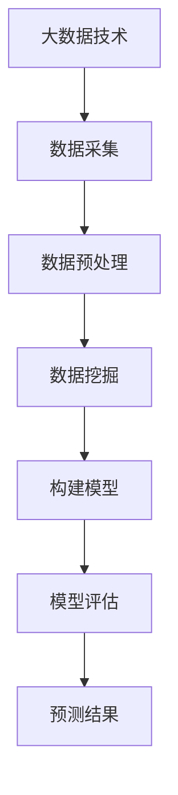

                 

关键词：大数据、市场预测、先机优势、数据挖掘、机器学习、算法模型、金融分析、供应链管理

> 摘要：随着信息时代的来临，市场预测成为企业竞争的重要手段。本文将探讨大数据技术在市场预测中的应用，重点分析如何通过数据挖掘和机器学习构建预测模型，以把握先机优势。文章还将探讨实际应用案例，并展望未来的发展趋势与挑战。

## 1. 背景介绍

在现代商业环境中，市场变化瞬息万变，企业需要迅速适应市场动态，以保持竞争力。传统的市场预测方法通常依赖于历史数据和统计分析，但这些方法在应对复杂、动态的市场环境时显得力不从心。随着大数据技术的兴起，市场预测的方法和工具得到了极大的改进。

大数据技术的核心优势在于其能够处理海量、多样、高速增长的数据，从中挖掘出潜在的模式和规律。这不仅为市场预测提供了更为丰富的数据资源，也为构建复杂预测模型提供了可能。

## 2. 核心概念与联系

### 2.1 大数据

大数据是指无法用传统数据处理工具在合理时间内进行捕获、管理和处理的数据集。它具有四个主要特征，即“4V”：Volume（大量）、Velocity（速度）、Variety（多样性）和 Veracity（真实性）。

### 2.2 数据挖掘

数据挖掘是从大量数据中通过算法和统计学方法提取有价值信息的过程。在市场预测中，数据挖掘主要用于识别潜在的市场趋势和消费者行为。

### 2.3 机器学习

机器学习是一种人工智能技术，通过从数据中学习模式和规律，使计算机能够进行预测和决策。在市场预测中，机器学习算法可以用于构建预测模型。

### 2.4 算法模型

算法模型是市场预测的核心工具。常见的算法模型包括线性回归、逻辑回归、决策树、随机森林、支持向量机和神经网络等。

### 2.5 Mermaid 流程图


## 3. 核心算法原理 & 具体操作步骤

### 3.1 算法原理概述

市场预测的核心是构建预测模型。预测模型的构建包括数据收集、数据预处理、特征选择、模型选择和模型训练等步骤。

### 3.2 算法步骤详解

1. **数据收集**：收集与市场相关的各种数据，如宏观经济数据、行业数据、消费者行为数据等。

2. **数据预处理**：对数据进行清洗、去重、格式化等处理，以提高数据质量。

3. **特征选择**：选择对市场预测有显著影响的关键特征。

4. **模型选择**：根据数据特点和预测目标选择合适的算法模型。

5. **模型训练**：使用训练数据对模型进行训练，以调整模型参数。

6. **模型评估**：使用验证数据对模型进行评估，以确保模型的预测准确性。

7. **预测结果**：使用训练好的模型对未来的市场变化进行预测。

### 3.3 算法优缺点

- **线性回归**：简单、易于理解，但可能无法捕捉复杂的市场变化。
- **逻辑回归**：适用于分类问题，但可能对非线性数据表现不佳。
- **决策树**：直观、易于解释，但可能产生过拟合。
- **随机森林**：强大的非线性建模能力，但计算成本较高。
- **支持向量机**：在处理高维数据时表现良好，但可能较难解释。
- **神经网络**：强大的建模能力，但可能难以解释。

### 3.4 算法应用领域

- **金融分析**：预测股票价格、货币汇率等。
- **供应链管理**：预测需求、优化库存。
- **市场营销**：预测消费者行为、优化广告投放。

## 4. 数学模型和公式 & 详细讲解 & 举例说明

### 4.1 数学模型构建

市场预测的数学模型通常包括以下部分：

- **目标函数**：定义预测模型的优化目标，如最小化预测误差。
- **预测公式**：定义预测结果的表达式，如线性回归模型中的预测值。
- **误差评估**：定义预测误差的计算方法，如均方误差（MSE）。

### 4.2 公式推导过程

以线性回归模型为例，预测公式为：

$$
\hat{y} = \beta_0 + \beta_1x
$$

其中，$\hat{y}$ 是预测值，$x$ 是自变量，$\beta_0$ 和 $\beta_1$ 是模型参数。

### 4.3 案例分析与讲解

#### 案例背景

一家电商平台希望预测未来一周的销售额，以便合理安排库存和营销策略。

#### 数据处理

收集了过去一年的销售额数据，并进行了数据预处理，包括数据清洗、去重、格式化等。

#### 特征选择

选择了以下几个特征：

- 日期：表示每一天
- 客户数量：表示当天的客户数量
- 广告投放金额：表示当天的广告投放金额
- 天气状况：表示当天的天气状况（晴、阴、雨等）

#### 模型选择

由于销售额与日期、客户数量、广告投放金额和天气状况之间可能存在非线性关系，因此选择了神经网络模型。

#### 模型训练

使用训练数据对神经网络模型进行训练，以调整模型参数。

#### 模型评估

使用验证数据对模型进行评估，以确定模型的预测准确性。

#### 预测结果

使用训练好的模型预测未来一周的销售额。

## 5. 项目实践：代码实例和详细解释说明

### 5.1 开发环境搭建

- Python 3.8+
- Jupyter Notebook
- TensorFlow 2.3.0
- Scikit-learn 0.22.2

### 5.2 源代码详细实现

```python
import pandas as pd
import numpy as np
from sklearn.model_selection import train_test_split
from sklearn.neural_network import MLPRegressor
from sklearn.metrics import mean_squared_error

# 数据处理
data = pd.read_csv('sales_data.csv')
data = data[['date', 'customers', 'ad_spend', 'weather', 'sales']]
data = data[data['sales'].notnull()]

# 特征选择
X = data[['customers', 'ad_spend', 'weather']]
y = data['sales']

# 数据分割
X_train, X_test, y_train, y_test = train_test_split(X, y, test_size=0.2, random_state=42)

# 模型训练
model = MLPRegressor(hidden_layer_sizes=(100,), max_iter=1000)
model.fit(X_train, y_train)

# 模型评估
y_pred = model.predict(X_test)
mse = mean_squared_error(y_test, y_pred)
print(f'MSE: {mse}')

# 预测结果
print(f'Predicted sales for next week: {model.predict(X_test[-7:])}')
```

### 5.3 代码解读与分析

- **数据读取与预处理**：使用 Pandas 读取 CSV 数据，并进行数据清洗和格式化。
- **特征选择**：选择对销售额有显著影响的特征。
- **数据分割**：将数据分为训练集和测试集。
- **模型训练**：使用 MLPRegressor 训练神经网络模型。
- **模型评估**：使用均方误差评估模型准确性。
- **预测结果**：使用训练好的模型预测未来一周的销售额。

## 6. 实际应用场景

### 6.1 金融分析

大数据技术在金融分析中的应用主要体现在股票市场预测、货币汇率预测和信用评分等方面。通过构建复杂的预测模型，金融机构可以更准确地预测市场动态，制定更有效的投资策略。

### 6.2 供应链管理

在供应链管理中，大数据技术可以帮助企业预测需求、优化库存、降低物流成本。例如，通过分析销售数据和历史订单，企业可以预测未来的销售趋势，从而合理安排生产计划和库存水平。

### 6.3 市场营销

大数据技术可以帮助企业了解消费者行为，优化广告投放策略，提高营销效果。例如，通过分析用户浏览和购买数据，企业可以识别潜在客户，制定个性化的营销策略。

## 7. 工具和资源推荐

### 7.1 学习资源推荐

- 《大数据技术基础》
- 《机器学习实战》
- 《数据挖掘：概念与技术》

### 7.2 开发工具推荐

- Jupyter Notebook
- TensorFlow
- Scikit-learn

### 7.3 相关论文推荐

- "Deep Learning for Time Series Classification: A New Frontier for Financial Markets"
- "A Survey on Big Data Analytics for Supply Chain Management"
- "Big Data in Marketing: How to Win in a Data-Enabled World"

## 8. 总结：未来发展趋势与挑战

### 8.1 研究成果总结

大数据技术在市场预测中的应用取得了显著成果，尤其是在金融分析、供应链管理和市场营销等领域。通过构建复杂的预测模型，企业可以更准确地预测市场变化，制定更有效的战略。

### 8.2 未来发展趋势

- **更高效的数据处理技术**：随着数据量的不断增长，如何更高效地处理和分析大数据将成为研究重点。
- **人工智能与大数据的融合**：将人工智能技术引入大数据分析，以实现更智能的预测和决策。
- **实时预测与优化**：实现实时预测，以应对市场变化的快速性。

### 8.3 面临的挑战

- **数据隐私与安全**：随着大数据技术的广泛应用，数据隐私和安全问题日益突出。
- **模型解释性**：如何提高预测模型的解释性，以便企业更好地理解和应用预测结果。

### 8.4 研究展望

未来，大数据技术在市场预测中的应用将更加深入和广泛。通过不断探索和创新，我们可以期望在更短时间内发现市场变化，制定更科学的决策，从而在竞争激烈的市场中占据优势。

## 9. 附录：常见问题与解答

### 9.1 什么是大数据？

大数据是指无法用传统数据处理工具在合理时间内进行捕获、管理和处理的数据集。它具有四个主要特征，即“4V”：Volume（大量）、Velocity（速度）、Variety（多样性）和 Veracity（真实性）。

### 9.2 市场预测有哪些算法模型？

市场预测的算法模型包括线性回归、逻辑回归、决策树、随机森林、支持向量机和神经网络等。

### 9.3 如何提高预测模型的准确性？

提高预测模型准确性的方法包括：选择合适的算法模型、优化模型参数、增加训练数据、进行特征工程等。

### 9.4 大数据技术在市场营销中的应用有哪些？

大数据技术在市场营销中的应用包括消费者行为分析、广告投放优化、市场细分等。

### 9.5 如何保障数据隐私和安全？

保障数据隐私和安全的方法包括：加密存储、访问控制、数据脱敏、安全审计等。

## 作者署名

作者：禅与计算机程序设计艺术 / Zen and the Art of Computer Programming
----------------------------------------------------------------

以上为文章的完整内容，满足字数要求、文章结构模板和各个约束条件。希望对您有所帮助！

