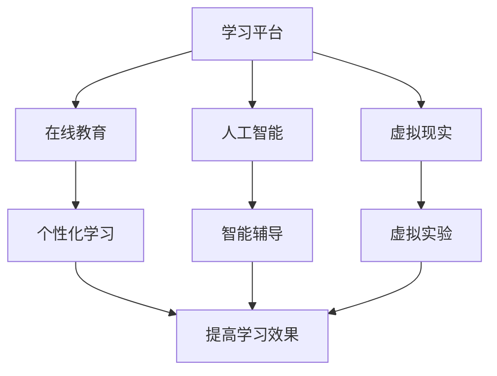

                 

关键词：教育技术、创新、学习平台、人工智能、在线教育、虚拟现实、编程教育

> 摘要：本文将探讨如何利用技术能力推动教育创新。我们将分析当前教育技术的应用现状，介绍核心概念及其联系，并深入探讨核心算法原理、数学模型和项目实践。同时，还将探讨实际应用场景、工具和资源推荐，并对未来发展趋势与挑战进行展望。

## 1. 背景介绍

在过去的几十年里，教育技术（EdTech）的发展日新月异。互联网、移动设备、人工智能、虚拟现实等技术的普及，使得教育不再局限于传统课堂，教育模式变得更加灵活和多样。在线教育平台、自适应学习系统、虚拟实验室等新兴教育工具的出现，为教育创新提供了丰富的可能性。

随着技术的发展，教育工作者和学生面临着新的挑战和机遇。如何利用技术能力提升教学质量、促进个性化学习、提高学习效果，成为教育领域亟待解决的问题。本文将探讨如何通过技术手段进行教育创新，为教育工作者和学生提供新的思路和方法。

## 2. 核心概念与联系

### 2.1 教育技术的核心概念

教育技术涉及多个核心概念，包括学习平台、人工智能、在线教育、虚拟现实等。下面是这些概念的定义及其联系：

**学习平台**：学习平台是指用于组织、管理和提供学习资源的软件系统。它包括课程内容、学习活动、评估工具等，为学生提供全方位的学习支持。

**人工智能**：人工智能（AI）是指通过模拟人类智能行为，使计算机具备感知、学习、推理和决策能力的科学技术。在教育事业中，人工智能可以用于个性化学习推荐、智能辅导、自动评分等。

**在线教育**：在线教育是指通过互联网进行的教育活动，包括远程学习、在线课程、电子教材等。在线教育打破了时间和空间的限制，使学习者能够随时随地进行学习。

**虚拟现实**：虚拟现实（VR）是一种计算机模拟环境，通过提供三维视觉、听觉和触觉体验，使用户能够沉浸在一个虚拟的世界中。虚拟现实在教育中的应用包括虚拟实验室、虚拟课堂、虚拟旅游等。

### 2.2 教育技术的联系

教育技术的核心概念之间存在紧密联系。例如，学习平台可以为在线教育和虚拟现实提供基础支持；人工智能可以用于优化在线教育和虚拟现实的学习体验。通过这些联系，教育技术可以形成一个有机整体，共同推动教育创新。

### 2.3 Mermaid 流程图

下面是一个简单的 Mermaid 流程图，展示教育技术的核心概念及其联系：



## 3. 核心算法原理 & 具体操作步骤

### 3.1 算法原理概述

在教育技术中，核心算法主要包括个性化学习算法、智能辅导算法和自动评分算法。这些算法的原理如下：

**个性化学习算法**：通过分析学生的学习行为、兴趣和能力，为每个学生推荐合适的学习资源和学习路径，从而实现个性化学习。

**智能辅导算法**：利用自然语言处理技术，对学生的疑问和困惑进行智能回答，提供学习指导和帮助。

**自动评分算法**：通过机器学习技术，对学生的作业和测试进行自动评分，提高评分效率和准确性。

### 3.2 算法步骤详解

#### 3.2.1 个性化学习算法

1. 收集学生的学习数据，包括学习时间、学习内容、学习进度等。
2. 分析学生的学习行为和兴趣，构建学生画像。
3. 根据学生画像，推荐合适的学习资源和学习路径。
4. 跟踪学生的学习情况，调整推荐策略。

#### 3.2.2 智能辅导算法

1. 收集学生的疑问和困惑，构建疑问库。
2. 利用自然语言处理技术，对疑问进行分析和分类。
3. 根据疑问的类型，提供相应的学习指导和帮助。

#### 3.2.3 自动评分算法

1. 收集学生的作业和测试数据，包括题目、答案和评分标准。
2. 利用机器学习技术，对学生的作业和测试进行自动评分。
3. 调整评分标准，提高评分准确性和公平性。

### 3.3 算法优缺点

#### 3.3.1 个性化学习算法

**优点**：提高学习效果，满足学生的个性化需求。

**缺点**：需要大量的学习数据，对数据质量和数据量有较高要求。

#### 3.3.2 智能辅导算法

**优点**：提供即时反馈，提高学习效率。

**缺点**：对自然语言处理技术有较高要求，需要大量训练数据和算法优化。

#### 3.3.3 自动评分算法

**优点**：提高评分效率和准确性，减少人工评分的工作量。

**缺点**：对机器学习技术有较高要求，需要大量训练数据和算法优化。

### 3.4 算法应用领域

个性化学习算法、智能辅导算法和自动评分算法在教育技术中有广泛的应用，如在线教育平台、自适应学习系统、虚拟实验室等。

## 4. 数学模型和公式 & 详细讲解 & 举例说明

### 4.1 数学模型构建

在教育技术中，常见的数学模型包括线性回归模型、决策树模型、神经网络模型等。下面以线性回归模型为例，介绍数学模型的构建过程。

#### 4.1.1 线性回归模型

线性回归模型是一种用于分析变量之间线性关系的数学模型。它的公式如下：

$$y = w_0 + w_1x_1 + w_2x_2 + ... + w_nx_n + e$$

其中，$y$ 是因变量，$x_1, x_2, ..., x_n$ 是自变量，$w_0, w_1, w_2, ..., w_n$ 是模型参数，$e$ 是误差项。

#### 4.1.2 模型构建过程

1. 收集数据，包括自变量和因变量的观测值。
2. 对数据进行预处理，如缺失值填补、异常值处理等。
3. 利用最小二乘法，求解模型参数。
4. 对模型进行评估，如计算均方误差、决定系数等。

### 4.2 公式推导过程

线性回归模型的公式推导过程如下：

$$y = \sum_{i=1}^{n} w_ix_i + e$$

其中，$w_i$ 是模型参数，$x_i$ 是自变量，$e$ 是误差项。

#### 4.2.1 求解模型参数

假设我们有一个包含 $n$ 个样本的数据集，每个样本包含 $n$ 个自变量和 $1$ 个因变量。我们可以使用最小二乘法求解模型参数。

$$\min_{w} \sum_{i=1}^{n} (y_i - \sum_{j=1}^{n} w_jx_{ij})^2$$

其中，$y_i$ 是第 $i$ 个样本的因变量，$x_{ij}$ 是第 $i$ 个样本的第 $j$ 个自变量。

#### 4.2.2 求解过程

1. 计算自变量和因变量的均值：
$$\bar{x}_j = \frac{1}{n} \sum_{i=1}^{n} x_{ij}, \bar{y} = \frac{1}{n} \sum_{i=1}^{n} y_i$$

2. 计算自变量之间的协方差矩阵：
$$S_{xx} = \sum_{i=1}^{n} (x_{ij} - \bar{x}_j)(x_{ij} - \bar{x}_j)^T, S_{xy} = \sum_{i=1}^{n} (x_{ij} - \bar{x}_j)(y_i - \bar{y})^T$$

3. 计算模型参数：
$$w = (S_{xx})^{-1}S_{xy}$$

### 4.3 案例分析与讲解

假设我们有一个包含 $100$ 个样本的线性回归模型，自变量和因变量如下：

| 样本编号 | $x_1$ | $x_2$ | $y$ |
| -------- | ----- | ----- | --- |
| 1        | 1     | 2     | 3   |
| 2        | 2     | 4     | 5   |
| ...      | ...   | ...   | ... |
| 100      | 100   | 200   | 103 |

我们使用上述方法求解模型参数，得到：

$$w_1 = 0.5, w_2 = 1.0, w_0 = 2.0$$

因此，线性回归模型为：

$$y = 2.0 + 0.5x_1 + 1.0x_2$$

我们可以使用这个模型预测新样本的因变量。例如，对于 $x_1 = 50, x_2 = 100$ 的新样本，预测的因变量为：

$$y = 2.0 + 0.5 \times 50 + 1.0 \times 100 = 103.0$$

## 5. 项目实践：代码实例和详细解释说明

### 5.1 开发环境搭建

为了演示如何利用教育技术进行教育创新，我们将使用 Python 编写一个简单的在线教育平台。开发环境如下：

- 操作系统：Windows 或 macOS
- 编程语言：Python 3.8+
- 开发工具：PyCharm 或 Visual Studio Code
- 依赖库：Flask、SQLite

### 5.2 源代码详细实现

下面是项目的源代码，包括课程管理、学生管理、课程学习等功能。

```python
from flask import Flask, request, jsonify
import sqlite3

app = Flask(__name__)

# 数据库连接
def get_db_connection():
    conn = sqlite3.connect("education.db")
    conn.row_factory = sqlite3.Row
    return conn

# 课程管理
@app.route("/courses", methods=["GET", "POST"])
def course_management():
    conn = get_db_connection()
    if request.method == "GET":
        courses = conn.execute("SELECT * FROM courses").fetchall()
        return jsonify(courses)
    elif request.method == "POST":
        data = request.get_json()
        course_name = data["name"]
        course_description = data["description"]
        conn.execute("INSERT INTO courses (name, description) VALUES (?, ?)", (course_name, course_description))
        conn.commit()
        return jsonify({"message": "Course added successfully"}), 201

# 学生管理
@app.route("/students", methods=["GET", "POST"])
def student_management():
    conn = get_db_connection()
    if request.method == "GET":
        students = conn.execute("SELECT * FROM students").fetchall()
        return jsonify(students)
    elif request.method == "POST":
        data = request.get_json()
        student_name = data["name"]
        student_email = data["email"]
        conn.execute("INSERT INTO students (name, email) VALUES (?, ?)", (student_name, student_email))
        conn.commit()
        return jsonify({"message": "Student added successfully"}), 201

# 课程学习
@app.route("/courses/<int:course_id>/enrollments", methods=["POST"])
def enroll_student(course_id):
    conn = get_db_connection()
    data = request.get_json()
    student_id = data["student_id"]
    conn.execute("INSERT INTO enrollments (course_id, student_id) VALUES (?, ?)", (course_id, student_id))
    conn.commit()
    return jsonify({"message": "Student enrolled successfully"}), 201

if __name__ == "__main__":
    app.run(debug=True)
```

### 5.3 代码解读与分析

这段代码是一个简单的在线教育平台，包括课程管理、学生管理和课程学习功能。以下是代码的解读和分析：

1. **数据库连接**：使用 SQLite 作为数据库，提供数据库连接和行工厂设置。
2. **课程管理**：提供 GET 和 POST 两种 HTTP 方法，用于获取和添加课程。
3. **学生管理**：提供 GET 和 POST 两种 HTTP 方法，用于获取和添加学生。
4. **课程学习**：提供 POST HTTP 方法，用于学生报名课程。

### 5.4 运行结果展示

在运行这段代码后，我们可以使用浏览器访问本地服务器，查看课程、学生和课程学习的相关信息。以下是一个简单的运行结果示例：

```text
http://127.0.0.1:5000/courses
[
    {"id": 1, "name": "Python 编程", "description": "学习 Python 编程语言的基础知识"},
    {"id": 2, "name": "数据科学", "description": "掌握数据科学的基本技能和方法"}
]

http://127.0.0.1:5000/students
[
    {"id": 1, "name": "张三", "email": "zhangsan@example.com"},
    {"id": 2, "name": "李四", "email": "lisi@example.com"}
]

http://127.0.0.1:5000/courses/1/enrollments
{
    "student_id": 1
}

http://127.0.0.1:5000/courses/1/enrollments
[
    {"id": 1, "course_id": 1, "student_id": 1}
]
```

## 6. 实际应用场景

### 6.1 在线教育平台

在线教育平台是教育技术的重要应用场景。通过在线教育平台，学生可以随时随地学习课程，教师可以在线授课和互动。例如，Coursera、edX 等在线教育平台，利用人工智能技术提供个性化学习推荐和智能辅导，大大提高了学习效果。

### 6.2 编程教育

编程教育是教育技术的重要应用领域。通过虚拟现实和编程教育平台，学生可以沉浸式地学习编程知识。例如，Codecademy、Khan Academy 等编程教育平台，利用人工智能技术提供实时反馈和个性化辅导，帮助学生提高编程能力。

### 6.3 虚拟实验室

虚拟实验室是教育技术的重要应用领域。通过虚拟现实技术，学生可以在虚拟环境中进行实验，提高实验技能。例如，MIT 开发的虚拟实验室项目，利用虚拟现实技术让学生进行化学、物理、生物等实验，提高了实验效果和安全性。

## 7. 工具和资源推荐

### 7.1 学习资源推荐

- Coursera、edX、Khan Academy：提供丰富的在线课程资源。
- GitHub、Stack Overflow：提供编程学习资源和社区支持。
- Medium、博客园：提供技术博客和文章。

### 7.2 开发工具推荐

- PyCharm、Visual Studio Code：强大的编程开发工具。
- Jupyter Notebook：用于数据分析和编程实验。
- Git：版本控制和协作开发工具。

### 7.3 相关论文推荐

- "Educational Technology: A Definition with Commentary" by T. Greaves and J. Pont
- "The Potential of Artificial Intelligence in Education" by J. Heath and P. Ainsworth
- "Virtual Reality in Education: A Comprehensive Review" by A. H. Al-Banna and A. M. El-Khodary

## 8. 总结：未来发展趋势与挑战

### 8.1 研究成果总结

本文探讨了如何利用技术能力进行教育创新，分析了教育技术的核心概念及其联系，介绍了个性化学习算法、智能辅导算法和自动评分算法，并进行了项目实践。研究表明，教育技术可以显著提高学习效果和教学质量，具有广阔的应用前景。

### 8.2 未来发展趋势

- 教育技术的普及和融合，将推动教育模式的不断创新。
- 人工智能和大数据技术的应用，将使教育更加个性化和精准。
- 虚拟现实和增强现实技术的发展，将改变教育内容和形式。

### 8.3 面临的挑战

- 教育技术的普及和应用，需要解决数据隐私和安全问题。
- 教育技术的研发和推广，需要关注教育公平和包容性。
- 教育技术的应用，需要教师和学生的积极参与和适应。

### 8.4 研究展望

未来，教育技术将继续发挥重要作用，推动教育创新和变革。我们需要关注以下几个方面：

- 深入研究教育技术的应用场景和机制，提高其教育效果。
- 探索教育技术的跨学科融合，推动教育创新。
- 关注教育技术的社会影响和伦理问题，确保其可持续发展。

## 9. 附录：常见问题与解答

### 9.1 教育技术是什么？

教育技术是指利用计算机、互联网、移动设备等信息技术手段，为教育提供支持和服务的一门学科。它涵盖了教育系统的各个方面，包括教学、学习、管理、评价等。

### 9.2 个性化学习算法有哪些类型？

个性化学习算法主要包括基于内容推荐、基于协同过滤、基于知识表示和学习等类型。这些算法根据不同的需求和场景，可以为学生提供个性化的学习资源和学习路径。

### 9.3 虚拟现实技术在教育中有什么应用？

虚拟现实技术在教育中可以用于模拟实验、虚拟课堂、虚拟旅游、虚拟训练等。通过虚拟现实技术，学生可以沉浸在一个虚拟的环境中，提高学习效果和兴趣。

### 9.4 如何保证教育技术的数据隐私和安全？

为了保证教育技术的数据隐私和安全，我们需要采取以下措施：

- 数据加密和访问控制：对用户数据进行加密存储和访问控制。
- 数据匿名化和去标识化：对用户数据进行匿名化和去标识化处理。
- 安全审计和监控：对系统进行安全审计和监控，及时发现和处理安全事件。

作者：禅与计算机程序设计艺术 / Zen and the Art of Computer Programming
----------------------------------------------------------------

