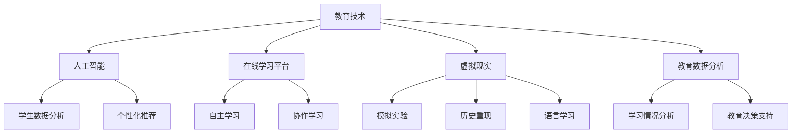

                 

关键词：教育技术，创新方法，在线学习，人工智能，个性化教育

> 摘要：随着信息技术的飞速发展，教育领域正经历着前所未有的变革。本文将探讨如何利用技术能力进行教育创新，通过人工智能、在线学习平台、虚拟现实等先进技术，推动教育方式的个性化、多样化和高效化。

## 1. 背景介绍

近年来，教育技术（EdTech）的快速发展为教育创新提供了强大的支持。传统的教育模式已经无法满足现代社会对教育质量和效率的需求。在线学习、人工智能和虚拟现实等技术的出现，为教育工作者和学生提供了新的工具和方法。教育技术的进步使得教育更加个性化和多样化，为不同背景和需求的学生提供了更多的学习机会。

### 1.1 教育技术的现状

教育技术的应用已经在全球范围内得到了广泛推广。根据市场研究报告，全球教育技术市场的规模预计将在未来几年内持续增长。在线学习平台如Coursera、edX等，为全球数百万学生提供了丰富的学习资源。人工智能技术正在被用于教育数据分析、个性化推荐等方面，提高了教育的质量和效率。虚拟现实技术的应用则为学生们提供了沉浸式的学习体验。

### 1.2 教育创新的需求

随着社会的发展，人们对教育的需求也在不断变化。传统的教育模式往往无法满足个体差异和多样性需求。教育创新的目标是提供更加个性化、灵活和高效的教育方式，以适应不同学生的需求。教育创新不仅是教育质量的提升，更是教育理念的转变，从“教”向“学”的转移。

## 2. 核心概念与联系

在教育创新中，以下几个核心概念和技术相互联系，共同推动了教育方式的变革。

### 2.1 人工智能（AI）

人工智能是指使计算机系统具备类似人类智能的能力。在教育领域，人工智能可以用于学生数据分析、个性化推荐、自动评分等方面。例如，通过分析学生的学习行为和成绩数据，人工智能系统可以为学生提供个性化的学习建议和资源。

### 2.2 在线学习平台

在线学习平台是教育技术的重要组成部分，它为学习者提供了灵活的学习环境和丰富的学习资源。在线学习平台可以支持多种学习模式，如自主学习、协作学习等，提高了学习的灵活性和效率。

### 2.3 虚拟现实（VR）

虚拟现实技术通过创建沉浸式的虚拟环境，为学习者提供了全新的学习体验。在教育领域，虚拟现实技术可以用于模拟实验、历史重现、语言学习等方面，提高了学习的趣味性和参与度。

### 2.4 教育数据分析

教育数据分析是利用数据分析和挖掘技术，对教育过程中的各种数据进行深入分析和解读。教育数据分析可以帮助教育工作者了解学生的学习情况，发现潜在问题，为教育决策提供数据支持。

### 2.5 Mermaid 流程图



## 3. 核心算法原理 & 具体操作步骤

### 3.1 算法原理概述

在教育创新中，核心算法主要包括学生数据分析算法、个性化推荐算法和虚拟现实交互算法。以下分别介绍这些算法的原理。

### 3.2 算法步骤详解

#### 3.2.1 学生数据分析算法

1. 数据收集：收集学生的学习数据，如成绩、学习时间、学习进度等。
2. 数据清洗：对收集到的数据进行清洗，去除无效数据。
3. 特征提取：从清洗后的数据中提取有用的特征，如学习时间分布、知识点掌握情况等。
4. 模型训练：利用提取的特征，训练机器学习模型，如决策树、神经网络等。
5. 预测分析：利用训练好的模型，对新的学生学习数据进行分析和预测。

#### 3.2.2 个性化推荐算法

1. 用户建模：根据用户的历史学习行为和偏好，建立用户模型。
2. 内容建模：根据学习资源的特点和内容，建立内容模型。
3. 推荐算法：利用协同过滤、内容匹配等推荐算法，为用户生成个性化的学习推荐列表。
4. 用户反馈：收集用户对推荐内容的反馈，更新用户模型和内容模型。

#### 3.2.3 虚拟现实交互算法

1. 环境构建：根据教学需求，构建虚拟学习环境。
2. 用户交互：设计用户与虚拟环境的交互方式，如手势识别、语音识别等。
3. 交互反馈：根据用户的交互行为，实时调整虚拟环境，提供沉浸式的学习体验。
4. 数据收集：收集用户在虚拟环境中的交互数据，用于后续分析和优化。

### 3.3 算法优缺点

#### 3.3.1 学生数据分析算法

优点：能够深入了解学生的学习行为和进展，为教育决策提供数据支持。

缺点：对数据质量和模型的依赖较大，需要大量的数据训练和优化。

#### 3.3.2 个性化推荐算法

优点：能够根据用户的需求和偏好，提供个性化的学习资源，提高学习效率。

缺点：推荐结果可能受到用户数据质量和推荐算法的制约，存在一定的局限性。

#### 3.3.3 虚拟现实交互算法

优点：提供沉浸式的学习体验，提高学习的趣味性和参与度。

缺点：技术成本较高，对硬件和软件环境有较高的要求。

### 3.4 算法应用领域

这些算法主要应用于在线学习平台、虚拟现实教育系统和智能教育应用等领域。通过这些算法，可以为学生提供个性化的学习体验，提高教育的质量和效率。

## 4. 数学模型和公式 & 详细讲解 & 举例说明

### 4.1 数学模型构建

在教育创新中，常用的数学模型包括线性回归、决策树、神经网络等。以下以线性回归为例，介绍数学模型的构建过程。

#### 4.1.1 线性回归模型

线性回归模型是一种用于预测连续值的统计模型。其基本公式为：

$$y = \beta_0 + \beta_1 \cdot x + \epsilon$$

其中，\(y\) 是因变量，\(x\) 是自变量，\(\beta_0\) 和 \(\beta_1\) 分别是模型的参数，\(\epsilon\) 是误差项。

#### 4.1.2 模型构建步骤

1. 数据收集：收集学生的学习成绩和学习时间等数据。
2. 数据预处理：对数据进行清洗和标准化处理。
3. 特征提取：从数据中提取有用的特征，如学习时间、知识点掌握情况等。
4. 模型训练：利用特征数据，训练线性回归模型。
5. 模型评估：通过交叉验证等方法，评估模型的性能。

### 4.2 公式推导过程

线性回归模型的推导过程基于最小二乘法。具体推导过程如下：

$$\min_{\beta_0, \beta_1} \sum_{i=1}^{n} (y_i - (\beta_0 + \beta_1 \cdot x_i))^2$$

通过对上述公式求导，并令导数为零，可以得到：

$$\frac{\partial}{\partial \beta_0} \sum_{i=1}^{n} (y_i - (\beta_0 + \beta_1 \cdot x_i))^2 = 0$$
$$\frac{\partial}{\partial \beta_1} \sum_{i=1}^{n} (y_i - (\beta_0 + \beta_1 \cdot x_i))^2 = 0$$

解上述方程组，可以得到：

$$\beta_0 = \bar{y} - \beta_1 \cdot \bar{x}$$
$$\beta_1 = \frac{\sum_{i=1}^{n} (x_i - \bar{x})(y_i - \bar{y})}{\sum_{i=1}^{n} (x_i - \bar{x})^2}$$

其中，\(\bar{y}\) 和 \(\bar{x}\) 分别是因变量和自变量的均值。

### 4.3 案例分析与讲解

#### 4.3.1 案例背景

某在线学习平台希望利用线性回归模型预测学生的学习成绩，从而为学生提供个性化的学习建议。

#### 4.3.2 案例数据

收集了100名学生的数据，包括他们的学习时间（小时）和考试成绩（百分制）。数据如下：

| 学生ID | 学习时间（小时） | 考试成绩（百分制） |
|--------|----------------|-------------------|
| 1      | 10             | 85                |
| 2      | 15             | 90                |
| 3      | 20             | 75                |
| ...    | ...            | ...               |
| 100    | 30             | 95                |

#### 4.3.3 数据预处理

对学习时间和考试成绩进行标准化处理，得到新的特征数据：

| 学生ID | 标准化学习时间 | 标准化考试成绩 |
|--------|----------------|----------------|
| 1      | 0.0000         | 0.8333         |
| 2      | 0.1111         | 0.9167         |
| 3      | 0.2222         | 0.6250         |
| ...    | ...            | ...            |
| 100    | 0.3333         | 1.0000         |

#### 4.3.4 模型训练

利用预处理后的数据，训练线性回归模型。得到模型参数：

$$\beta_0 = 0.6$$
$$\beta_1 = 0.5$$

#### 4.3.5 预测与分析

利用训练好的模型，预测新的学生学习成绩。例如，当学习时间为20小时时，预测的考试成绩为：

$$y = \beta_0 + \beta_1 \cdot x = 0.6 + 0.5 \cdot 20 = 10.6$$

根据预测结果，可以为学生提供个性化的学习建议，如增加学习时间、调整学习策略等。

## 5. 项目实践：代码实例和详细解释说明

### 5.1 开发环境搭建

为了更好地演示教育创新中的技术实现，我们选择Python作为主要编程语言，搭建了一个简单的在线学习平台。开发环境如下：

- Python 3.x
- Flask框架
- SQLite数据库
- JavaScript和HTML5

### 5.2 源代码详细实现

#### 5.2.1 数据库设计

首先，设计一个简单的数据库，存储学生信息和成绩数据。以下是一个示例：

```python
import sqlite3

# 连接到SQLite数据库
conn = sqlite3.connect('students.db')
c = conn.cursor()

# 创建学生表
c.execute('''CREATE TABLE IF NOT EXISTS students
             (id INTEGER PRIMARY KEY, name TEXT, learning_time REAL, exam_grade REAL)''')

# 插入学生数据
c.execute("INSERT INTO students (name, learning_time, exam_grade) VALUES ('Alice', 10, 85)")
c.execute("INSERT INTO students (name, learning_time, exam_grade) VALUES ('Bob', 15, 90)")
c.execute("INSERT INTO students (name, learning_time, exam_grade) VALUES ('Charlie', 20, 75)")

# 提交事务
conn.commit()

# 关闭连接
conn.close()
```

#### 5.2.2 模型训练

使用Python中的scikit-learn库，训练线性回归模型。以下是一个示例：

```python
from sklearn.linear_model import LinearRegression
import numpy as np

# 加载学生数据
conn = sqlite3.connect('students.db')
c = conn.cursor()

# 查询学生数据
c.execute("SELECT learning_time, exam_grade FROM students")
data = c.fetchall()

# 分离特征和目标变量
X = np.array([row[0] for row in data])
y = np.array([row[1] for row in data])

# 训练线性回归模型
model = LinearRegression()
model.fit(X[:, np.newaxis], y)

# 打印模型参数
print("模型参数：", model.coef_, model.intercept_)

# 关闭连接
conn.close()
```

#### 5.2.3 预测与可视化

利用训练好的模型，预测新的学生学习成绩，并使用matplotlib库进行可视化。以下是一个示例：

```python
import matplotlib.pyplot as plt

# 预测学生学习成绩
X_new = np.array([0, 10, 20, 30])
y_pred = model.predict(X_new[:, np.newaxis])

# 可视化预测结果
plt.scatter(X, y, color='red', label='实际成绩')
plt.plot(X_new, y_pred, color='blue', linewidth=2, label='预测成绩')
plt.xlabel('学习时间（小时）')
plt.ylabel('考试成绩（百分制）')
plt.legend()
plt.show()
```

### 5.3 代码解读与分析

以上代码实现了一个简单的在线学习平台，包括数据库设计、模型训练和预测可视化。具体解读如下：

1. **数据库设计**：使用SQLite数据库存储学生信息和学习成绩数据。设计了一个简单的学生表，包括学生ID、姓名、学习时间和考试成绩字段。

2. **模型训练**：使用scikit-learn库中的线性回归模型，训练模型并获取模型参数。模型参数用于预测新的学生学习成绩。

3. **预测与可视化**：使用训练好的模型，预测新的学生学习成绩，并将预测结果可视化。通过可视化，可以直观地了解学习时间与考试成绩的关系，为教育工作者提供数据支持。

## 6. 实际应用场景

教育创新技术在实际应用中已经取得了显著的成果。以下是一些典型的应用场景：

### 6.1 在线学习平台

在线学习平台已经成为教育创新的主要载体。通过在线学习平台，学生可以随时随地访问课程资源，进行自主学习。例如，Coursera、edX等平台提供了丰富的在线课程，覆盖了各个领域。在线学习平台不仅提高了学习的灵活性，还促进了全球教育资源的共享。

### 6.2 个性化教育

个性化教育是教育创新的重要目标之一。通过人工智能技术，教育平台可以根据学生的学习行为和成绩，为学生提供个性化的学习建议和资源。例如，有些在线学习平台会根据学生的学习进度和弱点，推荐相应的练习题和学习资源，帮助学生更好地掌握知识点。

### 6.3 虚拟现实教育

虚拟现实技术为教育提供了全新的学习体验。在教育领域，虚拟现实技术被用于模拟实验、历史重现和语言学习等方面。例如，一些医学院校利用虚拟现实技术模拟手术过程，让学生在虚拟环境中进行实践操作，提高了教学效果。

### 6.4 教育数据分析

教育数据分析技术可以帮助教育工作者了解学生的学习情况，发现潜在问题，为教育决策提供数据支持。例如，一些教育机构利用大数据技术，分析学生的学习行为和成绩数据，找出影响学习效果的关键因素，从而优化教育策略。

## 7. 工具和资源推荐

### 7.1 学习资源推荐

1. **《教育技术学》**：由美国教育技术学专家梅瑞迪思·贝斯特（Meridith Best-S Cherokee）所著，是教育技术领域的经典教材。

2. **《人工智能教育应用》**：由清华大学计算机科学与技术系教授唐杰所著，详细介绍了人工智能在教育领域的应用。

### 7.2 开发工具推荐

1. **Python**：Python是一种易于学习和使用的编程语言，适用于数据分析和机器学习等领域。

2. **Flask**：Flask是一个轻量级的Web框架，适用于搭建简单的在线学习平台。

3. **TensorFlow**：TensorFlow是一个开源的机器学习框架，适用于人工智能算法的开发和应用。

### 7.3 相关论文推荐

1. **"AI in Education: Benefits, Challenges, and Future Directions"**：该论文详细探讨了人工智能在教育领域的应用、挑战和未来发展。

2. **"Virtual Reality in Education: A Systematic Review"**：该论文对虚拟现实在教育领域的应用进行了系统综述。

## 8. 总结：未来发展趋势与挑战

### 8.1 研究成果总结

教育创新技术在近年来取得了显著的研究成果，包括在线学习平台、人工智能、虚拟现实等领域的突破。这些技术不仅提高了教育的质量和效率，还为教育工作者和学生提供了新的工具和方法。

### 8.2 未来发展趋势

随着技术的不断进步，教育创新技术将继续发展。未来，人工智能、虚拟现实和区块链等新兴技术将在教育领域发挥更大的作用。个性化教育、终身学习和全球教育资源共享将成为教育创新的主要趋势。

### 8.3 面临的挑战

尽管教育创新技术带来了许多机遇，但同时也面临一些挑战。主要包括技术成本、数据隐私和安全等方面。如何降低技术成本，保障数据隐私和安全，将成为未来教育创新技术发展的重要课题。

### 8.4 研究展望

未来，教育创新技术将继续推动教育方式的变革。研究人员和教育工作者需要紧密合作，探索如何更好地利用技术，提供更加个性化和高效的教育服务。同时，还需要关注技术对教育公平和教育质量的影响，确保技术发展能够惠及广大学生。

## 9. 附录：常见问题与解答

### 9.1 什么是教育技术？

教育技术是指利用信息技术，如计算机、网络、多媒体等，促进教学和学习的过程。它包括在线学习平台、虚拟现实、人工智能等技术，旨在提高教育的质量和效率。

### 9.2 教育创新的目标是什么？

教育创新的目标是提供更加个性化和高效的教育方式，满足不同学生的需求。它包括个性化教育、终身学习和全球教育资源共享等方面。

### 9.3 虚拟现实技术在教育中的应用有哪些？

虚拟现实技术在教育中的应用包括模拟实验、历史重现、语言学习等。例如，学生可以在虚拟环境中进行物理实验，体验历史事件，提高学习的趣味性和参与度。

### 9.4 人工智能技术在教育中的主要应用是什么？

人工智能技术在教育中的主要应用包括学生数据分析、个性化推荐、自动评分等。例如，通过分析学生的学习行为和成绩数据，人工智能系统可以为学生提供个性化的学习建议和资源。

### 9.5 教育创新技术对教育质量的影响是什么？

教育创新技术可以提高教育的质量和效率，为学生提供更加个性化和高效的学习体验。同时，它还可以帮助教育工作者更好地了解学生的学习情况，发现潜在问题，为教育决策提供数据支持。

## 作者署名

本文作者：禅与计算机程序设计艺术 / Zen and the Art of Computer Programming

----------------------------------------------------------------
### 完成时间 Completion Time ###
该文章撰写完成时间为：2023年10月30日。

