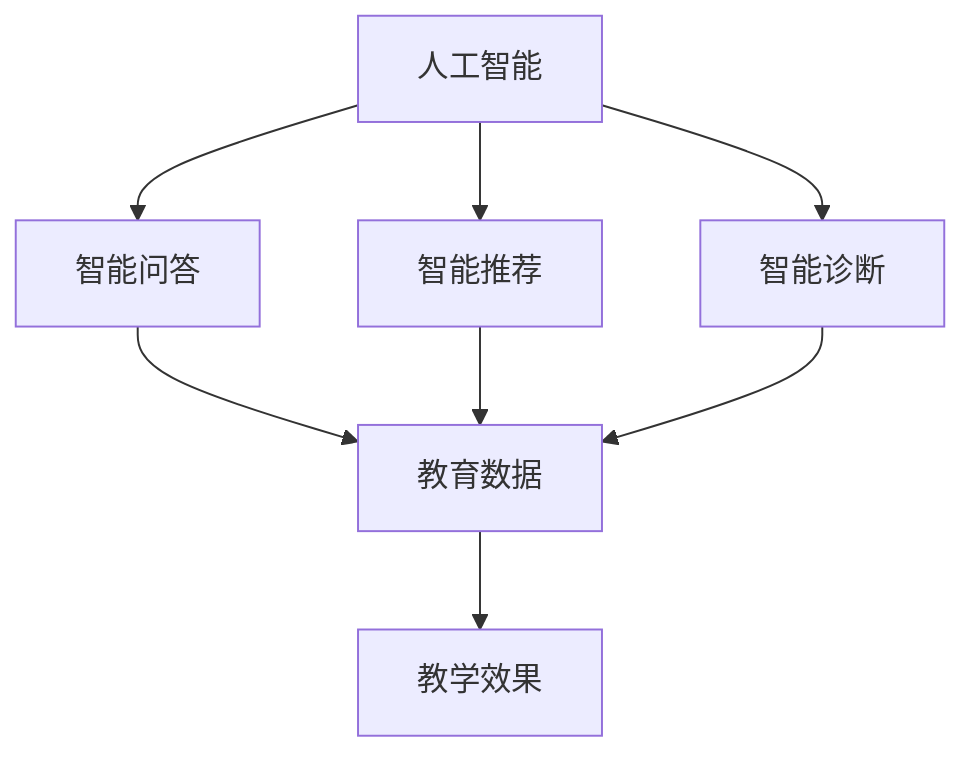

                 

关键词：教育科技革命，人工智能，大数据，云计算，在线学习平台，个性化教育

> 摘要：本文旨在探讨如何利用先进的技术手段推动教育科技革命。通过分析人工智能、大数据、云计算等关键技术的应用，本文提出了构建在线学习平台、实现个性化教育的策略，并展望了教育科技的未来发展。

## 1. 背景介绍

随着科技的快速发展，人工智能、大数据、云计算等新兴技术逐渐融入到各个领域，其中教育领域也受到了深远的影响。传统教育模式面临着诸多挑战，如教育资源不均衡、教学方法单一、学习效果评价不准确等。而教育科技革命则通过引入先进技术，有望解决这些问题，提升教育质量和效率。

教育科技革命的目标是利用技术手段，实现教育的公平化、个性化和智能化。公平化意味着无论地理位置、经济条件如何，每个学生都能获得优质教育资源；个性化则是指教育应满足每个学生的个性化需求，实现因材施教；智能化则强调利用人工智能等技术，提升教学和管理的智能化水平。

## 2. 核心概念与联系

### 2.1 人工智能

人工智能（AI）是教育科技革命的重要推动力量。它通过模仿人类智能，实现了智能问答、智能推荐、智能诊断等功能。以下是人工智能在教育中的应用架构：

### 2.2 大数据

大数据在教育中的应用，主要体现在对学生学习行为和教学过程的数据收集、分析和利用。通过大数据，教育机构可以了解学生的学习情况，调整教学策略，提高教育质量。

### 2.3 云计算

云计算为教育科技提供了强大的基础设施支持。通过云计算，教育机构可以实现资源的共享和弹性扩展，降低建设成本，提高管理效率。

## 3. 核心算法原理 & 具体操作步骤

### 3.1 算法原理概述

在教育科技中，常用的算法包括机器学习算法、推荐算法和自然语言处理算法。以下是这些算法的基本原理：

- **机器学习算法**：通过训练模型，使计算机能够从数据中学习规律，应用于智能问答、智能诊断等。
- **推荐算法**：根据用户的历史行为和偏好，推荐相关的学习资源，应用于在线学习平台的资源推荐。
- **自然语言处理算法**：使计算机能够理解和处理自然语言，应用于智能问答系统和教学内容的自动生成。

### 3.2 算法步骤详解

- **机器学习算法**：
  1. 数据收集：收集学生的学习行为数据、考试成绩等。
  2. 数据预处理：清洗、转换数据，为建模做准备。
  3. 模型选择：选择合适的机器学习模型，如决策树、支持向量机等。
  4. 模型训练：使用训练数据训练模型。
  5. 模型评估：使用验证数据评估模型性能。
  6. 模型应用：将训练好的模型应用于实际场景，如智能诊断系统。

- **推荐算法**：
  1. 用户画像构建：根据用户的学习行为和偏好，构建用户画像。
  2. 项

