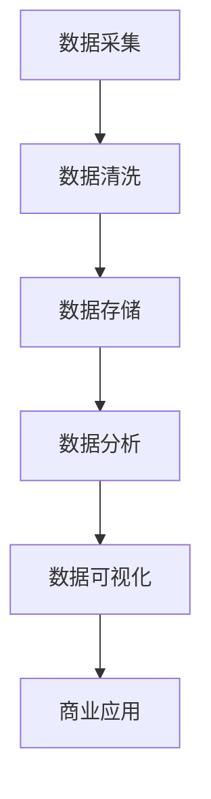

                 

关键词：数据变现、技术能力、数据驱动、商业模式创新、机器学习、大数据分析、云计算、区块链

> 摘要：随着大数据和人工智能技术的发展，数据已经成为一种新的生产要素。本文将探讨如何通过技术手段，充分利用数据资源进行变现，实现商业价值最大化。从数据采集、处理到分析，再到商业应用的各个环节，我们将揭示数据变现的路径和策略。

## 1. 背景介绍

随着互联网的普及和信息技术的发展，数据已经成为现代商业社会的核心资源。数据不仅可以提供市场洞察，优化决策过程，还可以直接转化为商业价值。然而，如何有效地利用数据资源，实现数据变现，一直是企业和研究机构关注的焦点。

数据变现是指通过数据采集、处理、分析和应用，将数据转化为商业价值的过程。这个过程涉及多个技术环节，包括数据采集、数据清洗、数据存储、数据分析和数据可视化等。随着技术的进步，数据变现的路径和策略也在不断演变。

## 2. 核心概念与联系

### 2.1 数据采集

数据采集是数据变现的基础，它决定了数据的数量和质量。数据采集的方式可以分为主动采集和被动采集。主动采集通常需要借助传感器、摄像头、网络爬虫等技术手段；被动采集则依赖于用户行为数据、社交媒体数据等。

### 2.2 数据清洗

数据清洗是数据处理的重要环节，它涉及数据去重、数据格式转换、数据缺失值处理等。数据清洗的目的是提高数据质量，为后续的分析和应用奠定基础。

### 2.3 数据存储

数据存储是数据管理的重要环节，它涉及数据存储方式的选择、数据安全性和数据访问效率等。目前，常用的数据存储技术包括关系型数据库、NoSQL数据库、分布式存储系统等。

### 2.4 数据分析

数据分析是数据变现的核心环节，它包括数据挖掘、机器学习、统计分析等方法。通过数据分析，可以挖掘数据中的潜在价值，为商业决策提供支持。

### 2.5 数据可视化

数据可视化是将数据转换为图形、图像等形式，以便更直观地理解和分析数据。数据可视化技术包括图表、仪表盘、虚拟现实等。

下面是一个简单的 Mermaid 流程图，展示数据变现的基本流程：



## 3. 核心算法原理 & 具体操作步骤

### 3.1 算法原理概述

数据变现的核心算法包括数据挖掘、机器学习、深度学习等。这些算法通过对海量数据进行处理和分析，挖掘数据中的潜在价值。

- **数据挖掘**：通过统计方法和算法，从大量数据中发现规律和模式。
- **机器学习**：利用历史数据，训练模型，预测未来趋势。
- **深度学习**：基于人工神经网络，模拟人脑的决策过程，实现复杂的数据处理。

### 3.2 算法步骤详解

- **数据挖掘**：数据预处理 → 特征提取 → 模型选择 → 模型评估。
- **机器学习**：数据预处理 → 特征提取 → 模型训练 → 预测。
- **深度学习**：数据预处理 → 网络构建 → 模型训练 → 预测。

### 3.3 算法优缺点

- **数据挖掘**：简单易用，但可能存在过拟合问题。
- **机器学习**：适用范围广，但需要大量的训练数据。
- **深度学习**：处理能力强大，但计算资源消耗大。

### 3.4 算法应用领域

- **金融领域**：风险评估、投资预测。
- **电商领域**：推荐系统、价格预测。
- **医疗领域**：疾病预测、个性化治疗。

## 4. 数学模型和公式 & 详细讲解 & 举例说明

### 4.1 数学模型构建

数据变现的数学模型主要包括回归模型、分类模型和时间序列模型等。

- **回归模型**：用于预测连续值，如价格、销售额等。
- **分类模型**：用于预测离散值，如用户标签、产品分类等。
- **时间序列模型**：用于预测时间序列数据，如股票价格、天气情况等。

### 4.2 公式推导过程

以回归模型为例，其公式推导如下：

$$
y = \beta_0 + \beta_1x_1 + \beta_2x_2 + ... + \beta_nx_n + \epsilon
$$

其中，$y$ 为预测值，$x_1, x_2, ..., x_n$ 为特征值，$\beta_0, \beta_1, ..., \beta_n$ 为模型参数，$\epsilon$ 为误差项。

### 4.3 案例分析与讲解

以电商领域的用户行为预测为例，我们可以利用回归模型预测用户的购买概率。

- **数据采集**：采集用户的浏览历史、购买历史、优惠券使用情况等数据。
- **数据清洗**：去除重复数据、处理缺失值等。
- **特征提取**：将原始数据转换为模型可处理的特征。
- **模型训练**：使用历史数据训练回归模型。
- **模型评估**：使用交叉验证等方法评估模型性能。
- **预测**：使用训练好的模型预测新用户的购买概率。

## 5. 项目实践：代码实例和详细解释说明

### 5.1 开发环境搭建

- Python 3.x
- Scikit-learn 库
- Pandas 库

### 5.2 源代码详细实现

```python
import pandas as pd
from sklearn.linear_model import LinearRegression
from sklearn.model_selection import train_test_split
from sklearn.metrics import mean_squared_error

# 读取数据
data = pd.read_csv('user_data.csv')

# 数据清洗
data.drop_duplicates(inplace=True)
data.fillna(0, inplace=True)

# 特征提取
X = data[[' browsing_history', ' purchase_history', ' coupon_usage']]
y = data[' purchase_probability']

# 模型训练
X_train, X_test, y_train, y_test = train_test_split(X, y, test_size=0.2, random_state=42)
model = LinearRegression()
model.fit(X_train, y_train)

# 模型评估
y_pred = model.predict(X_test)
mse = mean_squared_error(y_test, y_pred)
print('MSE:', mse)

# 预测
new_user = pd.DataFrame([[10, 20, 30]], columns=[' browsing_history', ' purchase_history', ' coupon_usage'])
purchase_probability = model.predict(new_user)
print('Purchase Probability:', purchase_probability)
```

### 5.3 代码解读与分析

这段代码实现了用户行为预测的回归模型。首先，我们读取用户数据，并进行数据清洗。然后，我们提取特征，并使用 Scikit-learn 库的 LinearRegression 类训练模型。接着，我们使用交叉验证方法评估模型性能。最后，我们使用训练好的模型预测新用户的购买概率。

## 6. 实际应用场景

数据变现的应用场景非常广泛，包括但不限于以下几个方面：

- **金融领域**：通过数据挖掘，预测市场趋势，进行投资决策。
- **电商领域**：通过用户行为预测，实现精准营销和个性化推荐。
- **医疗领域**：通过疾病预测，优化医疗资源配置，提高医疗服务质量。
- **零售领域**：通过供应链数据分析和预测，实现库存优化和需求预测。

## 6.4 未来应用展望

随着大数据和人工智能技术的不断进步，数据变现的领域将更加广泛。未来，我们将看到更多基于数据驱动的商业模式和创新。同时，数据安全和隐私保护也将成为重要的研究课题。

## 7. 工具和资源推荐

### 7.1 学习资源推荐

- 《Python数据分析基础教程：Numpy学习指南》
- 《机器学习实战》
- 《深度学习》

### 7.2 开发工具推荐

- Jupyter Notebook
- TensorFlow
- PyTorch

### 7.3 相关论文推荐

- "Deep Learning for Data Mining" by Max Pumperla, et al.
- "Data-Driven Business: The Power of Big Data, Analytics, and Your Data-Driven Organization" by Bill Schmarzo, David Stodder, and Dr. Michael Brown
- "Data Science for Business: What You Need to Know About Data Mining and Data-analytic Thinking" by Foster Provost and Tom Fawcett

## 8. 总结：未来发展趋势与挑战

数据变现作为一项新兴的技术手段，已经展现出巨大的商业潜力。然而，我们也面临着数据安全和隐私保护、数据质量、算法透明度等挑战。未来，我们需要在技术创新和伦理道德之间找到平衡，实现数据价值的最大化。

### 8.1 研究成果总结

本文从数据采集、处理、分析到应用的全过程，探讨了数据变现的路径和策略。通过实例演示，我们展示了如何利用技术手段实现数据变现。

### 8.2 未来发展趋势

随着大数据和人工智能技术的不断发展，数据变现的领域将更加广泛。未来，我们将看到更多基于数据驱动的商业模式和创新。

### 8.3 面临的挑战

数据安全和隐私保护、数据质量、算法透明度等是当前数据变现面临的主要挑战。

### 8.4 研究展望

未来，我们需要在技术创新和伦理道德之间找到平衡，实现数据价值的最大化。

## 9. 附录：常见问题与解答

### 9.1 什么是数据变现？

数据变现是指通过数据采集、处理、分析和应用，将数据转化为商业价值的过程。

### 9.2 数据变现的关键技术是什么？

数据变现的关键技术包括数据挖掘、机器学习、深度学习等。

### 9.3 数据变现有哪些应用领域？

数据变现的应用领域包括金融、电商、医疗、零售等。

### 9.4 如何保障数据安全和隐私？

通过数据加密、访问控制、数据脱敏等技术手段，保障数据安全和隐私。

### 9.5 数据变现的未来发展趋势是什么？

未来，数据变现的领域将更加广泛，基于数据驱动的商业模式和创新将不断涌现。

### 作者署名

作者：禅与计算机程序设计艺术 / Zen and the Art of Computer Programming
``` 
----------------------------------------------------------------
通过本文的探讨，我们深入理解了数据变现的概念、原理和应用，为企业和个人利用技术能力进行数据变现提供了理论和实践指导。未来，随着技术的不断进步，数据变现将在更多领域发挥重要作用，为商业社会带来新的机遇和挑战。

