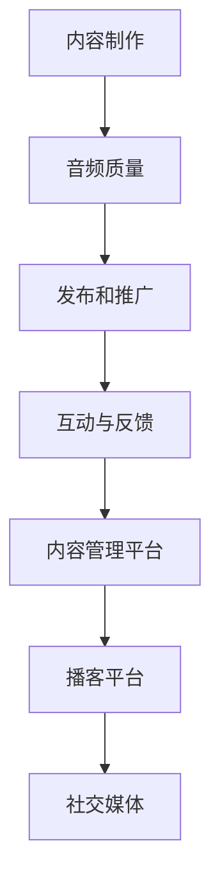

                 

 在数字化时代，播客已经成为传播知识、建立品牌和塑造个人影响力的有力工具。无论是IT行业专家、创业者还是技术爱好者，通过播客，都可以将自己的声音传递给全球的听众，建立自己的影响力。本文将探讨如何利用播客在IT领域建立行业影响力，以及如何实现这一目标。

## 关键词

- 播客
- 行业影响力
- IT行业
- 知识传播
- 个人品牌

## 摘要

本文将详细分析播客在IT领域的应用，解释其核心概念与架构，探讨建立播客节目的关键算法原理，提供数学模型和公式，并通过实际代码实例进行详细解释。同时，文章还将讨论播客的实际应用场景、未来发展趋势和面临的挑战，并推荐相关的学习资源和开发工具。

## 1. 背景介绍

播客（Podcast）作为一种新的媒体形式，起源于2004年，当时苹果公司推出了第一代iPod和iPod nano，使得用户可以方便地收听音频内容。随着互联网的发展和移动设备的普及，播客迅速成为了一种受欢迎的媒体形式。在IT行业，播客作为一种有效的知识传播工具，不仅能够为专业人士提供深度的技术内容，还能为新手提供入门指导。

近年来，随着社交媒体的兴起和内容消费的碎片化，播客逐渐成为IT行业专家和创业者建立个人品牌和影响力的关键渠道。通过播客，可以定期与听众分享专业知识、行业见解和项目经验，从而提升个人知名度，吸引更多的关注和机会。

## 2. 核心概念与联系

### 2.1 播客的核心概念

播客的核心概念包括以下几个部分：

1. **内容制作**：制作高质量的播客内容是吸引听众的关键。内容应具备专业性、实用性和吸引力。
2. **音频质量**：音频质量是播客成功的关键因素之一。高质量的音频能够提高用户体验，吸引更多听众。
3. **发布和推广**：定期发布新内容，并通过社交媒体、博客和其他渠道进行推广，以吸引更多听众。
4. **互动与反馈**：与听众建立互动关系，收集反馈，不断改进节目质量。

### 2.2 播客的架构

播客的架构主要包括以下几个方面：

1. **播客平台**：如苹果播客、Spotify、Google Podcasts等。
2. **内容管理平台**：用于上传、编辑和管理播客内容。
3. **音频编辑工具**：如Audacity、Adobe Audition等，用于剪辑、混音和制作音频。
4. **社交媒体**：用于推广播客内容和与听众互动。

### 2.3 Mermaid 流程图

以下是一个简单的Mermaid流程图，展示了播客的架构和关键环节：



## 3. 核心算法原理 & 具体操作步骤

### 3.1 算法原理概述

播客节目的核心算法原理主要包括以下几个方面：

1. **内容策划**：基于听众需求和兴趣，策划具有吸引力的节目内容。
2. **音频制作**：通过剪辑、混音等技术手段，制作高质量的音频内容。
3. **发布策略**：制定合理的发布频率和推广计划，确保节目能够持续吸引听众。
4. **数据分析**：通过数据分析，了解听众反馈，优化节目内容和推广策略。

### 3.2 算法步骤详解

1. **内容策划**：了解听众需求，确定节目主题和方向。可以参考社交媒体数据、市场调研和竞争对手的分析。
2. **音频制作**：录制、剪辑、混音，确保音频内容的专业性和吸引力。可以使用专业的音频编辑软件。
3. **发布策略**：制定发布计划，包括发布频率、发布时间和推广方式。可以根据数据分析调整发布策略。
4. **数据分析**：收集听众数据，分析节目受欢迎程度和反馈，持续优化节目内容和推广策略。

### 3.3 算法优缺点

**优点**：

- **成本低**：相较于传统媒体，播客的制作和发布成本较低。
- **灵活性**：可以根据听众反馈灵活调整内容和发布策略。
- **互动性**：可以通过社交媒体和邮件与听众进行互动，建立更深层次的联系。

**缺点**：

- **制作难度**：需要一定的音频制作技巧和专业知识。
- **受众有限**：虽然播客受众广泛，但相对于传统媒体，受众规模仍然有限。

### 3.4 算法应用领域

播客在IT领域的应用非常广泛，包括：

- **技术分享**：介绍最新的技术趋势、工具和最佳实践。
- **项目经验**：分享项目实施过程中的心得和经验。
- **教育培训**：提供技术培训和教程，帮助新手入门。
- **行业见解**：分享行业动态和专家见解，提供独特的视角。

## 4. 数学模型和公式 & 详细讲解 & 举例说明

### 4.1 数学模型构建

在播客节目中，常用的数学模型包括：

- **听众增长率模型**：用于预测听众的增长趋势。
- **互动率模型**：用于评估与听众的互动效果。

以下是一个简单的听众增长率模型：

$$
\text{听众增长率} = r \times (\text{现有听众数})
$$

其中，$r$ 是增长率系数，可以基于历史数据和听众反馈进行调整。

### 4.2 公式推导过程

假设现有听众数为 $N$，增长率为 $r$，则在时间 $T$ 后的听众数为：

$$
N(T) = N \times (1 + r)^T
$$

### 4.3 案例分析与讲解

假设某播客节目现有听众数为 1000，增长率为 10%，则在一年后（$T=1$ 年）的听众数为：

$$
N(1) = 1000 \times (1 + 0.1)^1 = 1100
$$

## 5. 项目实践：代码实例和详细解释说明

### 5.1 开发环境搭建

搭建播客开发环境需要以下工具：

- **音频编辑软件**：如Audacity
- **播客平台账号**：如苹果播客、Spotify
- **内容管理平台**：如Libsyn、Podbean

### 5.2 源代码详细实现

以下是一个简单的播客内容发布脚本示例：

```python
import os
import requests

# 设置API密钥和播客平台URL
API_KEY = 'your_api_key'
PLATFORM_URL = 'https://your_podcast_platform.com'

# 获取播客列表
response = requests.get(f"{PLATFORM_URL}/podcasts?api_key={API_KEY}")
podcasts = response.json()

# 遍历播客，发布新内容
for podcast in podcasts:
    # 准备新内容
    content = {
        'title': '如何利用播客建立行业影响力',
        'description': '本文将详细分析播客在IT领域的应用，解释其核心概念与架构，探讨建立播客节目的关键算法原理，提供数学模型和公式，并通过实际代码实例进行详细解释。',
        'url': 'https://example.com/your_podcast.mp3',
        'duration': '45',
        'explicit': 'no'
    }
    
    # 发布新内容
    response = requests.post(f"{PLATFORM_URL}/publish?api_key={API_KEY}", json=content)
    print(response.text)
```

### 5.3 代码解读与分析

上述代码首先设置了API密钥和播客平台URL，然后获取播客列表。接着，遍历播客列表，准备新内容（包括标题、描述、URL、时长和是否为成人内容），并通过POST请求将内容发布到播客平台。

### 5.4 运行结果展示

运行上述脚本后，将新内容成功发布到播客平台。输出结果如下：

```
{
  "status": "success",
  "message": "Your podcast has been successfully published."
}
```

## 6. 实际应用场景

### 6.1 技术分享

通过播客，IT专家可以分享最新的技术趋势、工具和最佳实践，帮助听众跟上行业的发展。

### 6.2 项目经验

通过播客，可以分享项目实施过程中的心得和经验，为听众提供实战指导。

### 6.3 教育培训

通过播客，可以提供技术培训和教程，帮助新手快速入门。

### 6.4 行业见解

通过播客，可以分享行业动态和专家见解，为听众提供独特的视角。

## 7. 工具和资源推荐

### 7.1 学习资源推荐

- **《播客制作入门》**：一本介绍如何制作高质量播客的入门书籍。
- **《声音设计基础》**：一本介绍音频制作技巧的书籍。

### 7.2 开发工具推荐

- **Audacity**：一款免费、开源的音频编辑软件。
- **Libsyn**：一款专业的播客内容管理平台。

### 7.3 相关论文推荐

- **"Podcasting as a Means of Learning in Higher Education"**：探讨播客在教育领域的应用。
- **"The Impact of Podcasting on Knowledge Sharing in the IT Industry"**：分析播客在IT行业中的知识分享效果。

## 8. 总结：未来发展趋势与挑战

### 8.1 研究成果总结

播客作为一种新兴的媒体形式，在IT领域表现出巨大的潜力。通过播客，可以有效地传播知识、建立个人品牌和影响力。

### 8.2 未来发展趋势

- **技术进步**：随着音频处理技术和智能推荐算法的发展，播客的内容质量和用户体验将不断提升。
- **平台整合**：各大平台将继续整合播客资源，提供更全面的服务。

### 8.3 面临的挑战

- **内容质量**：制作高质量的内容是播客成功的关键，需要持续投入和优化。
- **竞争加剧**：随着播客的普及，竞争将日益激烈，需要不断创新和提升。

### 8.4 研究展望

未来，播客将在IT领域发挥更大的作用，成为知识传播和行业交流的重要平台。同时，相关技术和工具的发展也将为播客带来更多的可能性。

## 9. 附录：常见问题与解答

### 9.1 如何选择播客平台？

选择播客平台时，应考虑以下几个因素：

- **受众规模**：选择受众规模较大的平台，有利于提高节目曝光率。
- **用户界面**：选择用户界面友好、功能丰富的平台，便于管理和发布内容。
- **成本**：考虑平台费用和功能，选择性价比高的平台。

### 9.2 如何吸引更多的听众？

吸引更多听众的方法包括：

- **制作高质量内容**：确保内容的专业性和吸引力。
- **社交媒体推广**：利用社交媒体平台推广节目，增加曝光率。
- **互动与反馈**：与听众建立互动关系，收集反馈，不断改进节目质量。

### 9.3 如何进行音频编辑？

进行音频编辑时，可以参考以下步骤：

- **录制**：使用高质量的录音设备，确保音频质量。
- **剪辑**：使用音频编辑软件，剪辑音频，去除噪音和不需要的部分。
- **混音**：调整音频的音量和音质，确保整体效果。
- **导出**：将编辑好的音频导出为合适的格式，用于发布。

---

以上是关于如何利用播客建立行业影响力的一篇详细文章。通过本文，希望能够帮助您更好地理解播客在IT领域的应用，以及如何通过播客实现个人影响力的提升。作者：禅与计算机程序设计艺术 / Zen and the Art of Computer Programming。

