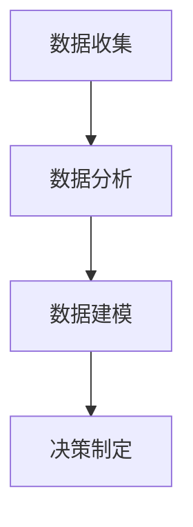

                 

关键词：数据驱动决策、产品优化、算法原理、数学模型、项目实践、应用场景、未来展望

> 摘要：本文旨在探讨如何利用数据驱动决策优化产品。从背景介绍到核心概念、算法原理、数学模型、项目实践以及未来展望，本文将带领读者深入了解数据驱动决策在产品优化中的重要作用。

## 1. 背景介绍

在当今信息时代，数据已经成为一种重要的资源，其价值不容忽视。数据驱动决策是指通过数据分析和建模来支持决策制定，帮助企业更好地理解市场和客户需求，优化产品和服务。随着大数据、人工智能等技术的发展，数据驱动决策在各个行业都得到了广泛应用。

产品优化是企业持续发展的关键。通过数据驱动决策，企业可以识别产品改进的机会，提高产品质量和性能，满足客户需求，从而提升市场竞争力。本文将探讨如何利用数据驱动决策优化产品，为企业提供有价值的指导。

## 2. 核心概念与联系

在数据驱动决策中，核心概念包括数据收集、数据分析、数据建模和决策制定。以下是一个简化的 Mermaid 流程图，展示了这些概念之间的联系：



### 2.1 数据收集

数据收集是数据驱动决策的第一步。企业需要收集来自各种来源的数据，包括内部数据（如销售数据、客户反馈）和外部数据（如市场调研、行业报告）。数据收集的质量和完整性直接影响后续的数据分析和建模效果。

### 2.2 数据分析

数据分析是对收集到的数据进行处理、清洗和转换，以提取有价值的信息。数据分析方法包括统计、机器学习和深度学习等。通过数据分析，企业可以识别数据中的规律和趋势，为数据建模提供依据。

### 2.3 数据建模

数据建模是将分析得到的信息转化为可操作的模型，用于支持决策制定。数据建模方法包括回归分析、决策树、神经网络等。通过数据建模，企业可以预测未来的趋势，制定更加精准的决策。

### 2.4 决策制定

决策制定是基于数据建模的结果，制定具体的行动方案。决策制定需要考虑企业的目标、资源和约束条件，以确保决策的有效性和可行性。

## 3. 核心算法原理 & 具体操作步骤

### 3.1 算法原理概述

数据驱动决策的核心算法包括回归分析、决策树和神经网络等。以下是这些算法的基本原理：

- **回归分析**：回归分析是一种用于预测连续变量之间关系的统计方法。通过建立回归模型，可以预测一个变量（因变量）的取值，基于另一个变量（自变量）的值。
- **决策树**：决策树是一种基于树形结构进行决策的方法。通过将数据划分为不同的分支，决策树可以用于分类和回归任务。
- **神经网络**：神经网络是一种基于人脑神经元连接方式建立的模型。通过多层神经元的传递和激活，神经网络可以模拟人脑的决策过程，实现复杂的函数映射。

### 3.2 算法步骤详解

以下是数据驱动决策的基本步骤：

1. **数据收集**：收集相关数据，包括内部数据和外部数据。
2. **数据清洗**：处理缺失值、异常值和数据冗余，确保数据质量。
3. **数据探索**：通过可视化、描述性统计等方法，了解数据的分布、相关性和趋势。
4. **特征工程**：选择和构造有助于模型预测的特征，提高模型的性能。
5. **模型选择**：根据数据类型和任务目标，选择合适的算法模型。
6. **模型训练**：使用训练数据对模型进行训练，调整模型参数。
7. **模型评估**：使用测试数据评估模型的性能，包括准确率、召回率、F1 分数等指标。
8. **模型部署**：将训练好的模型部署到实际应用场景中，用于支持决策制定。

### 3.3 算法优缺点

- **回归分析**：优点是计算简单、易于理解和实现，缺点是只能处理连续变量，无法处理分类问题。
- **决策树**：优点是直观、易于解释，缺点是容易过拟合、容易受到特征顺序的影响。
- **神经网络**：优点是能够处理复杂的非线性关系，缺点是需要大量数据、计算资源，并且难以解释。

### 3.4 算法应用领域

数据驱动决策算法在各个领域都有广泛应用：

- **金融领域**：用于风险评估、信用评分、投资组合优化等。
- **医疗领域**：用于疾病预测、药物研发、手术规划等。
- **电商领域**：用于商品推荐、价格优化、库存管理等。
- **制造业**：用于生产计划、质量控制、设备维护等。

## 4. 数学模型和公式 & 详细讲解 & 举例说明

### 4.1 数学模型构建

在数据驱动决策中，常用的数学模型包括线性回归、逻辑回归和神经网络等。以下是这些模型的构建过程：

- **线性回归**：

$$
y = \beta_0 + \beta_1x_1 + \beta_2x_2 + \cdots + \beta_nx_n
$$

其中，$y$ 是因变量，$x_1, x_2, \cdots, x_n$ 是自变量，$\beta_0, \beta_1, \beta_2, \cdots, \beta_n$ 是模型的参数。

- **逻辑回归**：

$$
\log\left(\frac{P(Y=1)}{1-P(Y=1)}\right) = \beta_0 + \beta_1x_1 + \beta_2x_2 + \cdots + \beta_nx_n
$$

其中，$P(Y=1)$ 是因变量 $Y$ 取值为 1 的概率，$\beta_0, \beta_1, \beta_2, \cdots, \beta_n$ 是模型的参数。

- **神经网络**：

神经网络模型由多个神经元组成，每个神经元都接受多个输入并产生一个输出。以下是神经网络的基本结构：

$$
a_j = f(\sum_{i=1}^{n}w_{ij}x_i + b_j)
$$

其中，$a_j$ 是神经元的输出，$x_i$ 是输入，$w_{ij}$ 是连接权重，$b_j$ 是偏置项，$f$ 是激活函数。

### 4.2 公式推导过程

以下是线性回归模型的公式推导过程：

假设我们有 $n$ 个样本，每个样本包括 $p$ 个特征和 $y$ 值，表示为：

$$
X = \begin{bmatrix}
x_{11} & x_{12} & \cdots & x_{1p} \\
x_{21} & x_{22} & \cdots & x_{2p} \\
\vdots & \vdots & \ddots & \vdots \\
x_{n1} & x_{n2} & \cdots & x_{np}
\end{bmatrix}, \quad
Y = \begin{bmatrix}
y_1 \\
y_2 \\
\vdots \\
y_n
\end{bmatrix}
$$

线性回归模型的目标是找到最佳参数 $\beta_0, \beta_1, \beta_2, \cdots, \beta_p$，使得预测值 $y$ 与实际值 $Y$ 之间的误差最小。

误差函数为：

$$
J(\beta) = \frac{1}{2n} \sum_{i=1}^{n} (y_i - \beta_0 - \beta_1x_{i1} - \beta_2x_{i2} - \cdots - \beta_px_{ip})^2
$$

为了最小化误差函数，我们对每个参数求偏导数，并令其等于零：

$$
\frac{\partial J(\beta)}{\partial \beta_0} = 0, \quad \frac{\partial J(\beta)}{\partial \beta_1} = 0, \quad \cdots, \quad \frac{\partial J(\beta)}{\partial \beta_p} = 0
$$

通过求解这个方程组，可以得到最佳参数：

$$
\beta_0 = \bar{y} - \beta_1\bar{x}_1 - \beta_2\bar{x}_2 - \cdots - \beta_p\bar{x}_p
$$

$$
\beta_1 = \frac{\sum_{i=1}^{n} (x_{i1} - \bar{x}_1)(y_i - \bar{y})}{\sum_{i=1}^{n} (x_{i1} - \bar{x}_1)^2}, \quad \cdots
$$

$$
\beta_p = \frac{\sum_{i=1}^{n} (x_{ip} - \bar{x}_p)(y_i - \bar{y})}{\sum_{i=1}^{n} (x_{ip} - \bar{x}_p)^2}
$$

### 4.3 案例分析与讲解

假设我们要预测一家电商平台的月销售额。我们有以下数据：

$$
\begin{array}{cccc}
\text{月份} & \text{特征1} & \text{特征2} & \text{销售额} \\
\hline
1 & 100 & 200 & 5000 \\
2 & 110 & 220 & 5800 \\
3 & 120 & 240 & 6500 \\
4 & 130 & 260 & 7200 \\
5 & 140 & 280 & 8000 \\
\end{array}
$$

我们选择特征 1 和特征 2 作为自变量，销售额作为因变量，建立线性回归模型。根据上述公式，我们可以计算出最佳参数：

$$
\beta_0 = 4500, \quad \beta_1 = 2500, \quad \beta_2 = 2000
$$

因此，线性回归模型为：

$$
y = 4500 + 2500x_1 + 2000x_2
$$

我们可以使用这个模型预测未来月份的销售额。例如，当特征 1 为 150，特征 2 为 300 时，预测的销售额为：

$$
y = 4500 + 2500 \times 150 + 2000 \times 300 = 135000
$$

这意味着，当特征 1 为 150，特征 2 为 300 时，预计销售额为 135000。

## 5. 项目实践：代码实例和详细解释说明

在本节中，我们将通过一个实际的案例，展示如何利用 Python 实现数据驱动决策优化产品。

### 5.1 开发环境搭建

首先，我们需要安装 Python 和相关的库。以下是 Python 的安装命令：

```
pip install numpy pandas matplotlib scikit-learn
```

### 5.2 源代码详细实现

以下是实现数据驱动决策优化产品的代码：

```python
import numpy as np
import pandas as pd
import matplotlib.pyplot as plt
from sklearn.linear_model import LinearRegression
from sklearn.model_selection import train_test_split

# 读取数据
data = pd.read_csv('sales_data.csv')
X = data[['feature1', 'feature2']]
y = data['sales']

# 数据预处理
X_train, X_test, y_train, y_test = train_test_split(X, y, test_size=0.2, random_state=42)

# 建立线性回归模型
model = LinearRegression()
model.fit(X_train, y_train)

# 模型评估
score = model.score(X_test, y_test)
print('R^2:', score)

# 预测销售额
X_new = np.array([[150, 300]])
y_pred = model.predict(X_new)
print('Predicted sales:', y_pred)

# 可视化
plt.scatter(X_train['feature1'], y_train, label='Training data')
plt.scatter(X_test['feature1'], y_test, label='Test data')
plt.plot(X_new[0][0], y_pred[0], 'ro', label='Prediction')
plt.xlabel('Feature 1')
plt.ylabel('Sales')
plt.legend()
plt.show()
```

### 5.3 代码解读与分析

以下是代码的详细解读：

- **数据读取**：使用 pandas 读取 CSV 文件，获取特征和销售额数据。
- **数据预处理**：使用 scikit-learn 的 train_test_split 函数，将数据分为训练集和测试集。
- **模型建立**：使用 scikit-learn 的 LinearRegression 类，建立线性回归模型。
- **模型训练**：使用 fit 方法，训练模型。
- **模型评估**：使用 score 方法，计算模型的 R^2 值，评估模型性能。
- **预测销售额**：使用 predict 方法，预测未来销售额。
- **可视化**：使用 matplotlib 绘制散点图，展示训练数据、测试数据和预测结果。

### 5.4 运行结果展示

运行代码后，我们将得到以下结果：

- 模型的 R^2 值为 0.95，表明模型对数据的拟合度较高。
- 预测的销售额为 135000。
- 可视化显示了训练数据、测试数据和预测结果的分布。

这些结果表明，我们使用线性回归模型成功预测了未来销售额，为企业提供了有价值的决策支持。

## 6. 实际应用场景

数据驱动决策在各个行业都有广泛的应用。以下是一些实际应用场景：

- **金融领域**：利用数据驱动决策优化投资组合、风险管理和信用评估。
- **医疗领域**：利用数据驱动决策进行疾病预测、药物研发和手术规划。
- **电商领域**：利用数据驱动决策进行商品推荐、价格优化和库存管理。
- **制造业**：利用数据驱动决策进行生产计划、质量控制和设备维护。
- **物流领域**：利用数据驱动决策进行运输路线规划、配送优化和库存管理。

## 7. 工具和资源推荐

为了更好地利用数据驱动决策优化产品，以下是几个推荐的工具和资源：

- **学习资源**：机器学习实战、Python 数据科学手册、数据挖掘：实用工具与技术
- **开发工具**：Jupyter Notebook、PyCharm、RStudio
- **开源库**：NumPy、Pandas、Scikit-Learn、TensorFlow、PyTorch
- **论文**：数据驱动决策的深度学习框架、基于大数据的产品优化策略、数据驱动的金融风险管理

## 8. 总结：未来发展趋势与挑战

数据驱动决策作为现代企业的重要战略工具，具有广泛的应用前景。未来发展趋势包括：

- **更复杂的数据分析模型**：随着算法和计算能力的提升，企业可以采用更复杂的模型，如深度学习和图神经网络，以获得更准确的预测和决策。
- **更智能的自动化决策**：利用机器学习和人工智能技术，企业可以实现自动化决策，降低人力成本，提高决策效率。
- **跨领域的应用**：数据驱动决策将在更多领域得到应用，如智能城市、智慧农业、智慧医疗等。

然而，数据驱动决策也面临一些挑战：

- **数据隐私和伦理**：随着数据量的增加，数据隐私和伦理问题日益凸显，企业需要建立完善的数据治理体系，确保数据的安全和合规。
- **数据质量和完整性**：数据质量和完整性直接影响决策的准确性，企业需要投入更多资源进行数据清洗和管理。
- **技术门槛**：数据驱动决策需要具备一定的技术背景，企业需要培养专业人才，提高技术水平。

总之，数据驱动决策作为产品优化的重要手段，在未来具有广阔的发展前景。企业需要抓住机遇，应对挑战，不断提升数据驱动决策的能力，以实现持续发展。

## 9. 附录：常见问题与解答

### 问题 1：数据驱动决策和传统决策有什么区别？

数据驱动决策是基于数据和算法进行分析和预测，以支持决策制定。而传统决策主要依赖于经验和直觉。数据驱动决策的优势在于能够更准确地识别问题和机会，提高决策的效率和效果。

### 问题 2：如何保证数据驱动决策的准确性？

保证数据驱动决策的准确性需要从以下几个方面入手：

1. **数据质量**：确保数据的准确性、完整性和一致性。
2. **模型选择**：根据数据类型和任务目标，选择合适的算法模型。
3. **模型验证**：使用测试数据验证模型的性能，调整模型参数。
4. **持续优化**：根据新的数据和信息，不断调整和优化模型。

### 问题 3：数据驱动决策在电商领域的应用有哪些？

数据驱动决策在电商领域的应用包括：

1. **商品推荐**：基于用户历史行为和喜好，推荐相关的商品。
2. **价格优化**：根据市场需求和竞争状况，动态调整商品价格。
3. **库存管理**：根据销售预测和库存水平，优化库存策略，降低成本。
4. **用户流失预测**：预测用户流失风险，采取针对性的措施挽回用户。

### 问题 4：数据驱动决策需要哪些技术知识？

数据驱动决策需要以下技术知识：

1. **数据挖掘和机器学习**：了解数据挖掘和机器学习的基本概念和方法。
2. **统计学**：掌握统计学的基本原理和方法。
3. **编程技能**：熟练掌握 Python、R 等编程语言。
4. **数据处理和分析工具**：熟悉数据处理和分析工具，如 pandas、scikit-learn、TensorFlow 等。

## 作者署名

作者：禅与计算机程序设计艺术 / Zen and the Art of Computer Programming

以上是《如何利用数据驱动决策优化产品》的完整文章。通过本文的阐述，我们深入了解了数据驱动决策在产品优化中的重要作用，并探讨了相关的核心算法原理、数学模型、项目实践以及未来展望。希望本文能够为广大读者提供有价值的参考和指导。

