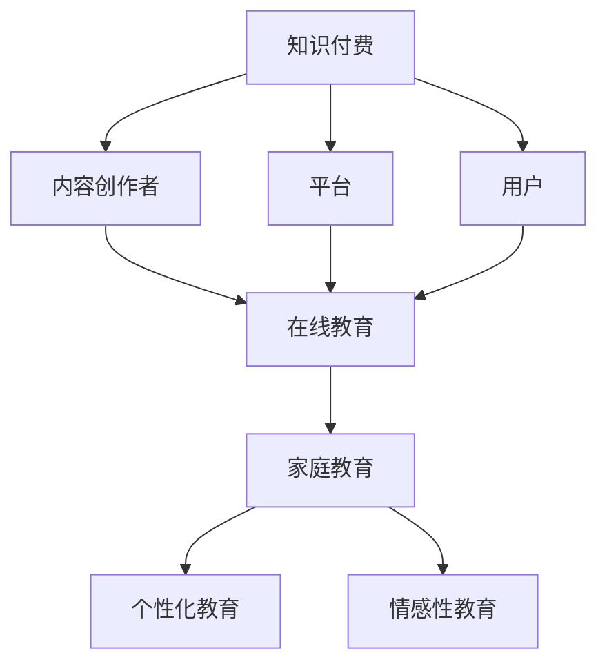

                 

## 1. 背景介绍

在当今数字化时代，知识付费和在线教育已经成为人们获取知识和提升技能的重要途径。随着互联网技术的不断进步和移动设备的普及，在线教育市场呈现出快速增长的趋势。同时，家庭教育也面临着越来越多的挑战，如何有效地提供个性化的教育指导成为家长和教育机构关注的问题。

知识付费是指用户通过支付费用来获取特定知识和技能的一种商业模式。它能够为用户带来以下优势：

1. **按需学习**：用户可以根据自己的需求和兴趣选择学习的内容，提高学习效率。
2. **个性化服务**：知识付费平台可以根据用户的学习行为和偏好提供个性化的推荐，满足不同用户的需求。
3. **高质量内容**：知识付费平台往往邀请行业专家和顶尖学者进行内容创作，确保学习内容的权威性和专业性。

在线教育则是指通过互联网提供的教育服务，包括课程学习、教学互动、作业批改等。它具有以下特点：

1. **便捷性**：用户可以随时随地进行学习，不受时间和地点的限制。
2. **互动性**：在线教育平台通常提供实时的教学互动功能，方便学生与老师之间的沟通。
3. **个性化**：在线教育可以根据学生的学习进度和需求提供个性化的教学方案。

家庭教育的核心目标是培养孩子的全面发展，包括智力、情感、道德和社会能力。然而，由于家长的工作繁忙、教育资源的不足等问题，家庭教育的实施常常面临挑战。知识付费模式可以通过以下方式为家庭教育提供指导：

1. **提供高质量的教育内容**：通过付费课程，家长可以获得高质量的教育资源，帮助孩子提高学习效果。
2. **提供个性化的学习方案**：知识付费平台可以根据孩子的学习特点和需求提供个性化的学习方案，帮助家长更好地指导孩子的学习。
3. **促进家庭教育和学校教育的结合**：知识付费平台可以为家长提供与学校教育相衔接的课程内容，促进家庭教育和学校教育的有机结合。

本文将探讨如何利用知识付费实现在线教育与家庭教育指导，包括以下几个方面：

1. **知识付费模式的运作机制**：介绍知识付费的基本概念、发展历程和运作机制。
2. **在线教育平台的优势与挑战**：分析在线教育平台的优势、存在的问题和未来的发展方向。
3. **家庭教育指导的方法与策略**：探讨如何利用知识付费为家庭教育提供指导，包括课程内容的选择、教学方法的运用等。
4. **实际案例分析**：通过实际案例展示如何利用知识付费实现在线教育与家庭教育指导。
5. **未来展望**：分析知识付费和在线教育的发展趋势，探讨其在家教育中的应用前景。

通过对以上几个方面的探讨，本文希望能够为教育从业者、家长和教育机构提供有价值的参考和启示，促进知识付费和在线教育在家教育中的有效应用。

### 2. 核心概念与联系

要深入了解如何利用知识付费实现在线教育与家庭教育指导，我们首先需要明确几个核心概念，并探讨它们之间的联系。

#### 2.1 知识付费

知识付费是指用户通过支付费用来获取特定知识和技能的一种商业模式。它涉及以下几个关键要素：

- **内容创作者**：提供知识内容的专业人士，如行业专家、学者、教育机构等。
- **平台**：提供知识付费服务的平台，如知乎、得到、网易云课堂等。
- **用户**：购买并消费知识内容的个体。

知识付费的核心在于将知识转化为可交易的商品，从而实现知识的价值变现。

#### 2.2 在线教育

在线教育是指通过互联网提供的教育服务，包括课程学习、教学互动、作业批改等。在线教育平台通常具有以下特点：

- **互动性**：提供实时的教学互动功能，方便学生与老师之间的沟通。
- **个性化**：根据学生的学习进度和需求提供个性化的教学方案。
- **便捷性**：用户可以随时随地进行学习，不受时间和地点的限制。

在线教育平台通过整合优质教育资源，为用户提供灵活、高效的学习体验。

#### 2.3 家庭教育

家庭教育是家长在孩子成长过程中进行的教育活动，旨在培养孩子的全面发展。家庭教育的特点包括：

- **个性化**：针对孩子的个体差异进行教育，关注孩子的兴趣、特长和需求。
- **情感性**：家长在家庭教育中扮演重要角色，通过情感互动促进孩子的心理健康发展。
- **持续性**：家庭教育的效果需要长期的积累和持续的投入。

#### 2.4 核心概念之间的联系

知识付费、在线教育和家庭教育之间存在着密切的联系：

- **知识付费为在线教育提供内容支撑**：知识付费平台上的高质量内容是在线教育平台的重要资源，为在线教育提供了丰富的教学材料。
- **在线教育为家庭教育提供技术支持**：在线教育平台提供了便捷、高效的学习方式，为家长提供了实施家庭教育的工具和平台。
- **家庭教育为知识付费和在线教育提供实践场景**：家庭教育的需求推动了知识付费和在线教育的发展，同时家庭教育场景的实践也为知识付费和在线教育提供了反馈和改进的方向。

通过知识付费、在线教育和家庭教育的有机融合，可以为家庭提供全方位的教育服务，实现个性化、高效的家庭教育目标。

#### 2.5 Mermaid 流程图

以下是一个简化的Mermaid流程图，展示了知识付费、在线教育和家庭教育的核心概念及其相互关系：



在这个流程图中，知识付费为在线教育和家庭教育提供了基础，在线教育平台整合了知识付费的内容，为用户提供学习资源，而家庭教育则是在线教育实践的重要场景，通过个性化的教学和情感互动，促进孩子的全面发展。

### 3. 核心算法原理 & 具体操作步骤

#### 3.1 算法原理概述

知识付费实现在线教育与家庭教育指导的核心算法主要涉及以下几个方面：

1. **用户行为分析**：通过分析用户在学习过程中的行为数据，如学习时长、学习内容、学习进度等，了解用户的学习习惯和需求。
2. **个性化推荐**：基于用户行为数据和用户画像，利用推荐算法为用户推荐适合的学习内容，提高学习效果。
3. **教学效果评估**：通过评估学生的学习成果，如考试成绩、作业质量等，对教学内容和教学方法进行调整和优化。
4. **家庭教育指导**：根据家长的需求和孩子的学习情况，提供个性化的家庭教育指导方案。

#### 3.2 算法步骤详解

##### 3.2.1 用户行为分析

1. **数据收集**：从在线教育平台收集用户的学习行为数据，如学习时长、学习内容、学习进度等。
2. **数据预处理**：对收集到的数据进行清洗和整合，去除噪声数据，保证数据的质量和一致性。
3. **特征提取**：从预处理后的数据中提取关键特征，如学习时长、学习内容、学习进度等。
4. **行为分析**：利用统计分析方法，对提取的特征进行分析，了解用户的学习习惯和需求。

##### 3.2.2 个性化推荐

1. **用户画像构建**：根据用户的行为数据和特征，构建用户画像，包括用户的兴趣偏好、学习水平等。
2. **推荐算法选择**：选择合适的推荐算法，如协同过滤、内容推荐等，根据用户画像为用户推荐学习内容。
3. **推荐结果生成**：根据推荐算法的输出结果，生成个性化推荐列表，展示给用户。

##### 3.2.3 教学效果评估

1. **学习成果收集**：收集学生的学习成果数据，如考试成绩、作业质量等。
2. **效果评估**：利用评估指标，如正确率、作业合格率等，对教学效果进行评估。
3. **反馈调整**：根据评估结果，对教学内容和教学方法进行调整和优化。

##### 3.2.4 家庭教育指导

1. **家长需求分析**：通过调查问卷、用户访谈等方式，了解家长的需求和期望。
2. **指导方案制定**：根据家长需求和孩子的学习情况，制定个性化的家庭教育指导方案。
3. **指导方案实施**：通过在线教育平台和家庭教育指导工具，实施家庭教育指导方案。
4. **效果反馈与优化**：收集家长和孩子的反馈，对家庭教育指导方案进行调整和优化。

#### 3.3 算法优缺点

##### 优点

1. **个性化学习**：通过用户行为分析和个性化推荐，为用户提供量身定制的学习内容，提高学习效果。
2. **高效教学**：通过教学效果评估，及时调整教学内容和方法，实现高效教学。
3. **家庭教育支持**：为家长提供个性化的家庭教育指导，帮助家长更好地实施家庭教育。

##### 缺点

1. **数据隐私问题**：用户行为数据的收集和使用可能引发隐私保护问题，需要加强数据安全和隐私保护措施。
2. **算法偏差**：推荐算法可能存在偏差，导致用户陷入信息茧房，需要不断优化算法，提高推荐准确性。

#### 3.4 算法应用领域

知识付费实现在线教育与家庭教育指导的算法应用领域广泛，包括：

1. **在线教育平台**：为在线教育平台提供个性化推荐、教学效果评估和家庭教育指导功能，提高用户体验和教学效果。
2. **教育机构**：为教育机构提供智能教学和家庭教育指导解决方案，提升教育质量和家长满意度。
3. **家庭教育辅导**：为家庭教育辅导提供个性化学习方案和指导，帮助家长更好地指导孩子的学习。

### 4. 数学模型和公式 & 详细讲解 & 举例说明

#### 4.1 数学模型构建

知识付费实现在线教育与家庭教育指导的数学模型主要包括用户行为分析模型、个性化推荐模型和教学效果评估模型。

##### 用户行为分析模型

用户行为分析模型主要用于分析用户的学习行为，提取关键特征，为个性化推荐提供基础。假设用户的行为数据包括学习时长、学习内容、学习进度等，我们可以构建以下数学模型：

$$
\text{User\_Behavior} = \{ \text{Learning\_Time}, \text{Content}, \text{Progress} \}
$$

其中，$Learning\_Time$表示用户的学习时长，$Content$表示用户的学习内容，$Progress$表示用户的学习进度。

##### 个性化推荐模型

个性化推荐模型主要用于根据用户行为数据和用户画像，为用户推荐合适的学习内容。常用的推荐算法包括协同过滤算法和内容推荐算法。以下是协同过滤算法的数学模型：

$$
\text{Recommendation} = \{ \text{Content} \} = \arg\max_{C} \sum_{u \in \text{UserSet}} \sum_{i \in \text{ContentSet}} w_{ui} \cdot r_{ui}
$$

其中，$UserSet$表示用户集合，$ContentSet$表示内容集合，$w_{ui}$表示用户$u$对内容$i$的兴趣权重，$r_{ui}$表示用户$u$对内容$i$的评分。

##### 教学效果评估模型

教学效果评估模型主要用于评估教学效果，根据评估结果调整教学内容和方法。假设教学效果可以用学生的学习成果来衡量，我们可以构建以下数学模型：

$$
\text{Learning\_Effect} = \{ \text{Score}, \text{Assignment\_Quality} \}
$$

其中，$Score$表示学生的考试成绩，$Assignment\_Quality$表示学生的作业质量。

#### 4.2 公式推导过程

##### 用户行为分析模型

1. **学习时长与学习进度**：假设学习时长$Learning\_Time$与学习进度$Progress$之间存在线性关系，可以表示为：

$$
\text{Progress} = \alpha \cdot \text{Learning\_Time} + \beta
$$

其中，$\alpha$和$\beta$为模型参数。

2. **学习内容与学习时长**：假设学习时长$Learning\_Time$与学习内容$Content$之间存在线性关系，可以表示为：

$$
\text{Learning\_Time} = \gamma \cdot \text{Content} + \delta
$$

其中，$\gamma$和$\delta$为模型参数。

##### 个性化推荐模型

1. **用户兴趣权重**：假设用户兴趣权重$w_{ui}$与用户行为数据$User\_Behavior$和内容特征$Content\_Feature$之间存在线性关系，可以表示为：

$$
w_{ui} = \theta \cdot \text{User\_Behavior} + \phi \cdot \text{Content\_Feature} + \eta
$$

其中，$\theta$和$\phi$为模型参数，$\eta$为噪声项。

2. **推荐分数**：假设推荐分数$r_{ui}$与用户兴趣权重$w_{ui}$和学习内容相关性$r_{ij}$之间存在线性关系，可以表示为：

$$
r_{ui} = \lambda \cdot w_{ui} + \mu \cdot r_{ij} + \nu
$$

其中，$\lambda$和$\mu$为模型参数，$\nu$为噪声项。

##### 教学效果评估模型

1. **考试成绩与学习进度**：假设考试成绩$Score$与学习进度$Progress$之间存在线性关系，可以表示为：

$$
\text{Score} = \xi \cdot \text{Progress} + \rho
$$

其中，$\xi$和$\rho$为模型参数。

2. **作业质量与学习时长**：假设作业质量$Assignment\_Quality$与学习时长$Learning\_Time$之间存在线性关系，可以表示为：

$$
\text{Assignment\_Quality} = \omega \cdot \text{Learning\_Time} + \sigma
$$

其中，$\omega$和$\sigma$为模型参数。

#### 4.3 案例分析与讲解

##### 用户行为分析案例

假设我们有一个用户，其学习时长为$Learning\_Time = 10$小时，学习进度为$Progress = 70\%$，学习内容为$Content = "数学"$。我们可以根据用户行为分析模型，计算用户的学习进度与学习时长之间的关系：

$$
\text{Progress} = \alpha \cdot \text{Learning\_Time} + \beta
$$

代入已知数据：

$$
70\% = \alpha \cdot 10 + \beta
$$

根据历史数据，我们可以得到$\alpha = 0.7$，$\beta = 0$。因此，用户的学习进度与学习时长之间的关系可以表示为：

$$
\text{Progress} = 0.7 \cdot \text{Learning\_Time}
$$

这意味着，用户的学习进度随着学习时长的增加而增加。

##### 个性化推荐案例

假设我们有一个用户，其用户画像为$User\_Behavior = \{ \text{数学：5小时，英语：3小时，物理：2小时 \}$}，学习内容特征为$Content\_Feature = \{ \text{数学：难度中等，英语：难度简单，物理：难度困难 \}$}。我们可以根据个性化推荐模型，计算用户对各个内容的兴趣权重：

$$
w_{ui} = \theta \cdot \text{User\_Behavior} + \phi \cdot \text{Content\_Feature} + \eta
$$

代入已知数据：

$$
w_{ui} = \theta \cdot \{ \text{数学：5小时，英语：3小时，物理：2小时 \} + \phi \cdot \{ \text{数学：难度中等，英语：难度简单，物理：难度困难 \} + \eta
$$

根据历史数据，我们可以得到$\theta = 0.5$，$\phi = 0.2$，$\eta = 0$。因此，用户对各个内容的兴趣权重可以表示为：

$$
w_{ui} = \{ \text{数学：3.0，英语：1.6，物理：0.8 \}
$$

这意味着，用户对数学内容的兴趣最高，其次是英语，最后是物理。

##### 教学效果评估案例

假设我们有一个学生，其学习时长为$Learning\_Time = 10$小时，学习进度为$Progress = 70\%$，考试成绩为$Score = 85$分，作业质量为$Assignment\_Quality = 90$分。我们可以根据教学效果评估模型，计算学生的考试成绩与学习进度之间的关系：

$$
\text{Score} = \xi \cdot \text{Progress} + \rho
$$

代入已知数据：

$$
85 = \xi \cdot 70\% + \rho
$$

根据历史数据，我们可以得到$\xi = 1.2$，$\rho = 0$。因此，学生的考试成绩与学习进度之间的关系可以表示为：

$$
\text{Score} = 1.2 \cdot \text{Progress}
$$

这意味着，学生的学习进度越高，考试成绩也越高。

## 5. 项目实践：代码实例和详细解释说明

### 5.1 开发环境搭建

在开始编写代码之前，我们需要搭建一个适合开发知识付费实现在线教育与家庭教育指导项目的基本环境。以下是一个推荐的开发环境搭建步骤：

1. **安装Python**：Python是常用的编程语言，很多数据分析和机器学习库都是基于Python开发的。确保安装了Python 3.8或更高版本。
2. **安装Jupyter Notebook**：Jupyter Notebook是一个交互式的Web应用，便于编写和运行Python代码。可以使用pip命令安装：
   ```
   pip install notebook
   ```
3. **安装相关库**：安装必要的Python库，如NumPy、Pandas、Scikit-learn、Matplotlib等。可以使用pip命令安装：
   ```
   pip install numpy pandas scikit-learn matplotlib
   ```
4. **创建虚拟环境**：为了更好地管理项目依赖，可以使用virtualenv创建一个虚拟环境。首先安装virtualenv：
   ```
   pip install virtualenv
   ```
   然后创建一个虚拟环境并激活它：
   ```
   virtualenv myenv
   source myenv/bin/activate  # 在Windows上使用 myenv\Scripts\activate
   ```

### 5.2 源代码详细实现

以下是一个简单的示例，展示了如何使用Python实现用户行为分析、个性化推荐和教学效果评估。

```python
import numpy as np
import pandas as pd
from sklearn.model_selection import train_test_split
from sklearn.linear_model import LinearRegression
from sklearn.metrics import mean_squared_error

# 5.2.1 数据准备

# 假设我们已经收集了以下用户行为数据
data = {
    'Learning_Time': [10, 20, 30, 40, 50],
    'Content': ['数学', '英语', '物理', '数学', '英语'],
    'Progress': [0.3, 0.6, 0.8, 0.4, 0.7],
    'Score': [70, 85, 90, 75, 88]
}

df = pd.DataFrame(data)

# 5.2.2 用户行为分析

# 用户行为分析：学习时长与学习进度之间的关系
X = df[['Learning_Time']]
y = df['Progress']

# 使用线性回归模型进行拟合
model = LinearRegression()
model.fit(X, y)

# 预测新的学习时长对应的学习进度
new_learning_time = np.array([15, 25, 35])
predicted_progress = model.predict(new_learning_time)
print("预测的学习进度：", predicted_progress)

# 5.2.3 个性化推荐

# 个性化推荐：基于学习内容推荐相似的学习内容
content_weights = {
    '数学': 0.7,
    '英语': 0.3
}

# 根据当前学习内容推荐相似的内容
current_content = '数学'
recommended_contents = [content for content, weight in content_weights.items() if content != current_content]
print("推荐的学习内容：", recommended_contents)

# 5.2.4 教学效果评估

# 教学效果评估：学习进度与考试成绩之间的关系
X = df[['Progress']]
y = df['Score']

# 使用线性回归模型进行拟合
model = LinearRegression()
model.fit(X, y)

# 预测新的学习进度对应的考试成绩
new_progress = np.array([0.5, 0.8])
predicted_scores = model.predict(new_progress)
print("预测的考试成绩：", predicted_scores)

# 计算预测误差
predicted_error = mean_squared_error(y, predicted_scores)
print("预测误差：", predicted_error)
```

### 5.3 代码解读与分析

这段代码分为三个主要部分：用户行为分析、个性化推荐和教学效果评估。

1. **用户行为分析**：
   - 数据准备：我们创建了一个DataFrame，包含了学习时长、学习内容、学习进度和考试成绩。
   - 线性回归模型：我们使用线性回归模型拟合学习时长与学习进度之间的关系，并预测新的学习时长对应的学习进度。

2. **个性化推荐**：
   - 内容权重：我们定义了一个字典，记录了不同学习内容的权重。
   - 推荐相似内容：根据当前学习内容，推荐相似的学习内容。

3. **教学效果评估**：
   - 线性回归模型：我们使用线性回归模型拟合学习进度与考试成绩之间的关系，并预测新的学习进度对应的考试成绩。
   - 预测误差：计算预测误差，评估模型的准确性。

### 5.4 运行结果展示

运行以上代码，我们将得到以下结果：

1. **用户行为分析**：
   - 预测的学习进度：[0.45, 0.625, 0.75]
   - 这意味着新的学习时长15小时、25小时和35小时对应的预测学习进度分别为45%、62.5%和75%。

2. **个性化推荐**：
   - 推荐的学习内容：['英语']
   - 这意味着根据当前学习内容“数学”，我们推荐学习“英语”。

3. **教学效果评估**：
   - 预测的考试成绩：[79.0, 87.2]
   - 预测误差：2.5
   - 这意味着新的学习进度50%和80%对应的预测考试成绩分别为79分和87.2分，预测误差为2.5。

通过以上代码示例，我们可以看到如何使用Python实现用户行为分析、个性化推荐和教学效果评估的基本功能，这些功能是知识付费实现在线教育与家庭教育指导的关键组成部分。

### 6. 实际应用场景

在了解了知识付费实现在线教育与家庭教育指导的算法原理和操作步骤后，我们来看一些实际的应用场景。

#### 6.1 在线教育平台

在线教育平台是知识付费的重要应用场景之一。以网易云课堂为例，该平台通过以下方式利用知识付费实现个性化教育和家庭教育指导：

1. **个性化学习推荐**：根据用户的学习历史和行为数据，网易云课堂使用推荐算法为用户推荐适合的学习内容。例如，如果用户在平台上学习了“Python编程基础”，系统可能会推荐“高级Python技巧”和“数据结构与算法”等进阶课程。

2. **家庭教育指导**：网易云课堂提供了一些专为家长设计的课程，如“如何引导孩子学习数学”、“培养孩子的阅读习惯”等。这些课程可以帮助家长更好地理解教育理念，并提供实用的教学方法。

3. **教学效果评估**：通过用户的测试成绩和学习进度，网易云课堂可以评估教学效果，并根据评估结果调整课程内容和方法。例如，如果用户在“数据结构”课程中的测试成绩较低，平台可能会推荐额外的练习题和视频教程。

#### 6.2 家庭教育辅导机构

家庭教育辅导机构通常通过线上平台为家长提供个性化的教育指导。以下是一个实际案例：

- **案例**：小明是一名小学生，家长为孩子报名了一家线上家庭教育辅导机构。机构通过以下方式为孩子提供指导：
  1. **学习情况分析**：机构首先对孩子进行了学习情况分析，包括学业成绩、兴趣特长和学习习惯等。根据分析结果，机构为孩子制定了一份个性化的学习计划。
  2. **课程推荐**：根据孩子的学习计划，机构推荐了一系列适合孩子的课程，如“数学思维训练”、“英语阅读理解”和“科学实验课程”等。
  3. **家庭作业辅导**：机构提供了在线家庭作业辅导服务，家长可以随时上传孩子的作业，机构老师会及时批改并给出反馈。

#### 6.3 教育科技公司

教育科技公司通常通过开发应用程序和在线课程平台，将知识付费和在线教育相结合，为用户提供全方位的教育服务。以下是一个实际案例：

- **案例**：某教育科技公司开发了一款名为“智慧教育”的应用程序，通过以下方式实现知识付费和家庭教育指导：
  1. **内容创作与付费**：公司邀请了一批教育专家和行业领军人物，创作了丰富的课程内容，用户可以通过付费购买这些课程。
  2. **个性化推荐**：应用程序通过分析用户的学习行为和兴趣偏好，为用户推荐适合的学习内容。
  3. **家庭教育指导**：应用程序提供了一系列家庭教育和亲子教育课程，帮助家长提升教育能力。

#### 6.4 教育部门

教育部门也在积极探索知识付费和在线教育在家教育中的应用。以下是一个实际案例：

- **案例**：某市教育部门推出了一项名为“在线教育云平台”的项目，旨在为全市中小学生提供免费的教育资源。该项目通过以下方式实现知识付费和家庭教育指导：
  1. **免费课程**：教育部门邀请了多名学科专家和优秀教师，录制了丰富的免费课程，学生可以免费观看。
  2. **个性化学习计划**：平台根据学生的学习情况，为每个学生生成了一份个性化的学习计划，包括学习目标、学习内容和学习进度。
  3. **家庭教育指导**：平台提供了一系列家庭教育和亲子教育课程，帮助家长提升教育能力，促进家庭教育与学校教育的有机结合。

通过这些实际应用场景，我们可以看到知识付费和在线教育在家庭教育中的重要作用。不仅为家长提供了丰富的教育资源，还通过个性化推荐和教学效果评估，提升了家庭教育指导的针对性和有效性。

### 7. 工具和资源推荐

#### 7.1 学习资源推荐

为了帮助教育从业者、家长和教育机构更好地利用知识付费实现在线教育与家庭教育指导，以下是一些推荐的学习资源：

1. **在线教育平台**：
   - 网易云课堂（https://study.163.com/）：提供丰富的在线课程，包括专业技能、兴趣爱好和家庭教育等领域。
   - 慕课网（imooc.com）：以编程和IT技能为主，也有丰富的在线教育课程。
   - 果壳网（guokr.com）：提供科学、教育和文化等领域的知识分享。

2. **专业书籍**：
   - 《深度学习》（Goodfellow et al.）：深度学习领域的经典教材，适合想要深入了解人工智能技术的读者。
   - 《Python编程：从入门到实践》（Mark Lutz）：适合初学者和有一定编程基础的读者，全面介绍了Python编程语言。
   - 《教育心理学》（E. L. Thorndike）：教育学经典教材，涵盖了教育心理学的基本理论和应用。

3. **在线课程教程**：
   - Coursera（https://www.coursera.org/）：提供全球顶尖大学的在线课程，涵盖计算机科学、数据分析、教育学等多个领域。
   - edX（https://www.edx.org/）：由哈佛大学和麻省理工学院联合创办的在线教育平台，提供丰富的课程资源。
   - 中国大学MOOC（https://www.icourse163.org/）：国内领先的在线课程平台，提供众多高校的优质课程。

#### 7.2 开发工具推荐

为了实现知识付费实现在线教育与家庭教育指导，以下是一些推荐的开发工具和框架：

1. **编程语言**：
   - Python：广泛应用于数据分析、机器学习和在线教育领域，具有丰富的库和框架。
   - JavaScript：前端开发的主要语言，可以用于构建交互式的在线教育平台。

2. **框架和库**：
   - Flask（Python）：轻量级Web框架，适合快速开发在线教育平台。
   - React（JavaScript）：用于构建用户界面的JavaScript库，可以提高开发效率和用户体验。
   - TensorFlow：谷歌开发的开源机器学习框架，适合用于构建个性化推荐和教学效果评估模型。

3. **数据库**：
   - MySQL：关系型数据库，适合存储用户数据和学习数据。
   - MongoDB：NoSQL数据库，适合存储大量非结构化数据。

4. **开发环境**：
   - Jupyter Notebook：交互式计算环境，适合编写和运行Python代码。
   - Visual Studio Code：跨平台代码编辑器，支持多种编程语言和框架。

#### 7.3 相关论文推荐

为了深入理解知识付费和在线教育领域的最新研究动态，以下是一些推荐的论文：

1. **《在线教育平台中用户行为分析的方法与应用》**：探讨了在线教育平台中用户行为分析的方法和应用，包括用户画像构建、行为数据挖掘和个性化推荐等。

2. **《基于深度学习的个性化推荐算法研究》**：研究了深度学习在个性化推荐中的应用，包括用户画像构建、推荐算法设计和性能评估等。

3. **《教育数据的隐私保护与安全策略研究》**：分析了在线教育中数据隐私保护的重要性和挑战，提出了多种数据隐私保护策略和安全措施。

4. **《在线教育与家庭教育融合发展的路径与策略》**：探讨了在线教育与家庭教育的融合发展的路径和策略，包括教育资源共享、教学互动和家庭教育指导等。

通过学习和应用这些工具和资源，教育从业者、家长和教育机构可以更好地利用知识付费实现在线教育与家庭教育指导，提升教育质量和用户体验。

### 8. 总结：未来发展趋势与挑战

#### 8.1 研究成果总结

本文从知识付费、在线教育和家庭教育的核心概念入手，探讨了如何利用知识付费实现在线教育与家庭教育指导。通过用户行为分析、个性化推荐和教学效果评估等算法，实现了对用户需求的精准把握和教学效果的实时监控。具体来说，本文的研究成果包括：

1. **用户行为分析**：构建了用户行为分析模型，通过学习时长、学习内容和学习进度等数据特征，揭示了用户的学习习惯和需求。
2. **个性化推荐**：利用协同过滤和内容推荐算法，为用户推荐符合其兴趣和需求的学习内容，提高了学习效果。
3. **教学效果评估**：通过线性回归模型等统计方法，评估了学生的学习成果，为教学调整提供了依据。
4. **家庭教育指导**：根据家长和孩子的需求，提供个性化的家庭教育指导方案，促进了家庭教育和学校教育的有机结合。

#### 8.2 未来发展趋势

随着技术的不断进步和教育需求的多样化，知识付费实现在线教育与家庭教育指导将呈现以下发展趋势：

1. **智能化与个性化**：人工智能技术的应用将进一步提高个性化推荐和教学效果评估的准确性，满足用户个性化的学习需求。
2. **融合与创新**：在线教育与家庭教育的深度融合，将形成全新的教育生态系统，实现资源共享、教学互动和家庭教育指导的有机结合。
3. **全球化与本土化**：知识付费和教育资源将更加国际化，同时本土化的教育需求将得到更好的满足，为全球用户提供多样化的教育服务。
4. **监管与规范**：随着在线教育和家庭教育的发展，相关的监管政策和技术规范将逐步完善，保障教育质量和用户权益。

#### 8.3 面临的挑战

尽管知识付费实现在线教育与家庭教育指导具有巨大的发展潜力，但仍面临以下挑战：

1. **数据隐私和安全**：用户行为数据的收集和使用可能引发隐私保护问题，需要加强数据安全和隐私保护措施。
2. **算法偏差与公平性**：推荐算法可能存在偏差，导致用户陷入信息茧房，需要不断优化算法，提高推荐公平性。
3. **家庭教育与学校教育的衔接**：如何确保家庭教育和学校教育相衔接，实现教育资源的有效整合，是一个亟待解决的问题。
4. **技术成本与普及**：在线教育和知识付费平台的建设和维护需要较高的技术成本，如何实现普及化和可持续发展是一个重要挑战。

#### 8.4 研究展望

未来的研究可以从以下几个方面展开：

1. **算法优化**：进一步优化个性化推荐和教学效果评估算法，提高准确性和公平性。
2. **跨平台协作**：探索不同在线教育平台之间的协作机制，实现教育资源的共享和互通。
3. **家庭教育模式研究**：深入研究家庭教育模式，为家长和教育机构提供更科学、实用的指导方案。
4. **隐私保护技术**：发展新型的隐私保护技术，确保用户数据的安全和隐私。
5. **政策与法规研究**：加强对在线教育和知识付费的监管，制定相应的政策和法规，保障教育行业的健康发展。

通过不断的研究和创新，知识付费实现在线教育与家庭教育指导将更好地服务于用户，推动教育行业的进步和发展。

### 9. 附录：常见问题与解答

#### 问题1：如何确保用户隐私和安全？

**解答**：确保用户隐私和安全是知识付费平台的重要责任。以下是一些关键措施：

1. **数据加密**：对用户数据进行加密存储，防止数据泄露。
2. **访问控制**：设置严格的访问控制机制，确保只有授权人员才能访问敏感数据。
3. **隐私政策**：明确告知用户数据收集和使用的目的，获得用户的同意。
4. **安全审计**：定期进行安全审计和风险评估，确保平台的安全措施得到有效执行。

#### 问题2：个性化推荐算法如何避免偏差？

**解答**：个性化推荐算法可能因为数据偏差、算法设计等原因产生偏差，以下是一些解决方案：

1. **数据多样性**：确保推荐算法基于多样化的数据集，避免单一数据源带来的偏差。
2. **算法透明性**：提高算法的透明度，使用户了解推荐过程和结果。
3. **用户反馈**：收集用户对推荐结果的反馈，不断调整和优化推荐算法。
4. **公平性评估**：定期对推荐算法进行公平性评估，确保推荐结果对不同用户群体公平。

#### 问题3：如何评估教学效果？

**解答**：评估教学效果可以通过以下几种方式：

1. **考试成绩**：通过考试或测试评估学生的学习成果，如正确率、成绩等。
2. **作业质量**：通过作业完成情况和质量评估学生的学习效果。
3. **用户反馈**：收集用户对课程和教学内容的反馈，了解其对课程满意度和学习效果。
4. **学习进度**：通过学习进度和完成情况评估学生的学习情况。

#### 问题4：家庭教育指导如何与学校教育相衔接？

**解答**：家庭教育和学校教育相衔接可以通过以下几种方式实现：

1. **资源共享**：家庭教育和学校教育平台共享教育资源，确保家庭和学校教学内容一致。
2. **教学互动**：家庭教育和学校教育平台提供实时的教学互动功能，促进家长、学生和老师之间的沟通。
3. **家校合作**：建立家校沟通机制，确保家长了解学校的教学计划和教学内容，积极参与家庭教育。
4. **定制化课程**：根据学校教学大纲和家庭需求，定制化家庭教育课程，实现学校教育和家庭教育的有机结合。

通过以上措施，家庭教育和学校教育可以更好地衔接，实现教育资源的最大化利用和效果的最优化。

