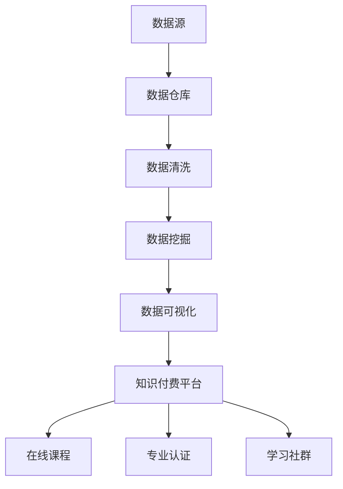

                 

### 摘要 Summary

本文旨在探讨知识付费在大数据分析与应用中的重要性及其实现方法。随着大数据技术的迅速发展，数据分析和应用成为企业和个人获取竞争优势的关键。然而，大数据分析的深度和广度要求具备专业的知识和技能。知识付费作为一种高效的学习和获取知识的方式，能够帮助个人和企业快速掌握大数据分析的核心技术。本文将详细分析知识付费在大数据分析中的角色，探讨其优势与挑战，并提供具体的实施步骤和实用技巧。通过本文的阅读，读者将了解如何利用知识付费实现大数据分析，为企业和个人带来实际价值。

## 1. 背景介绍

### 1.1 大数据技术的发展

大数据（Big Data）是21世纪初信息技术领域的一个重要概念。随着互联网、物联网、社交媒体等技术的普及，数据生成和收集的速度和规模达到了前所未有的高度。大数据技术旨在处理海量、多样、快速生成和高度复杂的数据，以发现其中隐藏的价值和规律。大数据技术的发展为各行各业带来了深远的影响，从金融、医疗到零售、制造，大数据分析已经成为提高效率、降低成本、提升服务质量的关键手段。

### 1.2 数据分析的重要性

数据分析（Data Analysis）是大数据技术中的核心环节。通过对数据的收集、清洗、存储、处理和分析，企业可以挖掘出有价值的信息，为业务决策提供科学依据。数据分析不仅能够帮助预测市场趋势、优化运营流程，还能够发现潜在的风险和机遇。在当今竞争激烈的市场环境中，数据分析是企业保持竞争优势的重要武器。

### 1.3 知识付费的兴起

知识付费是指用户为了获取特定知识或技能而支付费用的一种经济模式。随着互联网的发展，在线教育、专业培训、咨询等服务逐渐兴起，知识付费成为了一种流行的学习方式。知识付费的优势在于能够提供系统化、专业化的学习内容，帮助用户快速提升技能和知识水平。

### 1.4 知识付费在大数据分析中的应用

大数据分析是一个高度专业化的领域，要求从业者具备深厚的数学、统计、计算机科学等背景知识。知识付费可以帮助个人和企业快速获取这些专业知识，从而提高数据分析能力。同时，知识付费平台提供了丰富的课程资源、实战案例和学习社群，有助于用户更好地理解和应用大数据分析技术。

## 2. 核心概念与联系

### 2.1 大数据分析的关键概念

#### 数据源（Data Sources）
数据源是大数据分析的基础，包括各种结构化和非结构化的数据，如数据库、文件系统、互联网等。

#### 数据仓库（Data Warehouse）
数据仓库是一个集中的数据存储系统，用于存储和管理大量的历史数据，以支持数据分析和报告。

#### 数据清洗（Data Cleaning）
数据清洗是数据处理的第一步，旨在识别和纠正数据中的错误、缺失和不一致之处。

#### 数据挖掘（Data Mining）
数据挖掘是从大量数据中发现有价值模式和规律的过程，常用于市场分析、风险管理和预测等领域。

#### 数据可视化（Data Visualization）
数据可视化是将复杂的数据通过图形、图表等方式呈现，帮助用户更好地理解和分析数据。

### 2.2 知识付费与大数据分析的关联

#### 知识付费平台（Knowledge付费 Platform）
知识付费平台是提供专业知识和技能学习的在线平台，如Coursera、Udemy等。

#### 在线课程（Online Courses）
在线课程是知识付费平台的主要产品形式，包括理论课程、实战课程等，适用于不同层次的学习者。

#### 专业认证（Professional Certification）
专业认证是知识付费的一种形式，通过考试认证获得权威证书，证明个人的专业能力和技术水平。

#### 学习社群（Learning Community）
学习社群是知识付费平台的重要组成部分，通过社群互动和讨论，用户可以共同学习和分享经验。

### 2.3 Mermaid 流程图（Mermaid Flowchart）



## 3. 核心算法原理 & 具体操作步骤

### 3.1 算法原理概述

大数据分析的核心算法包括数据挖掘算法、机器学习算法和统计分析方法。这些算法用于从大量数据中提取有价值的信息和知识。

#### 数据挖掘算法（Data Mining Algorithms）
- 分类算法（Classification Algorithms）
- 聚类算法（Clustering Algorithms）
- 关联规则挖掘（Association Rule Mining）
- 异常检测（Anomaly Detection）

#### 机器学习算法（Machine Learning Algorithms）
- 监督学习（Supervised Learning）
- 无监督学习（Unsupervised Learning）
- 半监督学习（Semi-Supervised Learning）
- 强化学习（Reinforcement Learning）

#### 统计分析方法（Statistical Analysis Methods）
- 描述性统计分析（Descriptive Statistical Analysis）
- 推断性统计分析（Inferential Statistical Analysis）
- 联合概率分布（Joint Probability Distribution）
- 贝叶斯网络（Bayesian Networks）

### 3.2 算法步骤详解

#### 数据预处理
1. 数据收集：从各种数据源收集数据。
2. 数据清洗：处理缺失值、异常值和重复数据。
3. 数据转换：将数据转换为适合分析的形式。

#### 数据分析
1. 数据探索：通过可视化工具探索数据的分布、趋势和关系。
2. 特征选择：选择对分析任务最有影响力的特征。
3. 模型构建：根据分析任务选择合适的算法构建模型。
4. 模型评估：评估模型性能，调整模型参数。

#### 数据可视化
1. 选择合适的可视化工具（如Tableau、Matplotlib等）。
2. 设计数据可视化方案，展示分析结果。

### 3.3 算法优缺点

#### 数据挖掘算法
- 优点：能够自动发现数据中的隐藏模式和规律，提高决策效率。
- 缺点：算法复杂度高，对计算资源要求较高。

#### 机器学习算法
- 优点：能够处理大规模数据，自动学习和优化模型。
- 缺点：模型训练时间较长，对数据质量要求较高。

#### 统计分析方法
- 优点：理论基础扎实，易于理解和解释。
- 缺点：对数据规模和处理速度有限制，不适用于大规模数据分析。

### 3.4 算法应用领域

#### 金融行业
- 风险管理、市场分析、客户行为预测。

#### 零售行业
- 商品推荐、销售预测、库存管理。

#### 医疗行业
- 疾病诊断、治疗方案优化、患者行为分析。

#### 制造业
- 质量控制、设备故障预测、生产优化。

## 4. 数学模型和公式 & 详细讲解 & 举例说明

### 4.1 数学模型构建

大数据分析中的数学模型通常涉及概率论、统计学和线性代数。以下是几个常见的数学模型：

#### 线性回归模型（Linear Regression Model）
- 目标：预测连续变量的值。
- 公式：\( y = \beta_0 + \beta_1x + \epsilon \)

#### 逻辑回归模型（Logistic Regression Model）
- 目标：预测二分类变量的概率。
- 公式：\( P(y=1) = \frac{1}{1 + e^{-(\beta_0 + \beta_1x)}} \)

#### 聚类算法（K-Means Clustering）
- 目标：将数据分为 K 个群组。
- 公式：\( \text{Minimize} \sum_{i=1}^{k} \sum_{x \in S_i} ||x - \mu_i||^2 \)

#### 决策树（Decision Tree）
- 目标：对数据进行分类或回归。
- 公式：\( \text{Split} x_j = v_j \text{ if } x_j > v_j, \text{ else } x_j = v_j \)

### 4.2 公式推导过程

以线性回归模型为例，假设我们有 n 个样本点 \((x_1, y_1), (x_2, y_2), ..., (x_n, y_n)\)，目标是找到最佳拟合直线 \(y = \beta_0 + \beta_1x\)。

1. 最小化均方误差（MSE）：
   \[ \text{MSE} = \sum_{i=1}^{n} (y_i - (\beta_0 + \beta_1x_i))^2 \]

2. 对 \(\beta_0\) 和 \(\beta_1\) 分别求偏导数并令其等于0：
   \[ \frac{\partial \text{MSE}}{\partial \beta_0} = -2 \sum_{i=1}^{n} (y_i - (\beta_0 + \beta_1x_i)) = 0 \]
   \[ \frac{\partial \text{MSE}}{\partial \beta_1} = -2 \sum_{i=1}^{n} x_i (y_i - (\beta_0 + \beta_1x_i)) = 0 \]

3. 解方程组得到 \(\beta_0\) 和 \(\beta_1\)：
   \[ \beta_0 = \frac{1}{n} \sum_{i=1}^{n} y_i - \beta_1 \frac{1}{n} \sum_{i=1}^{n} x_i \]
   \[ \beta_1 = \frac{1}{n} \sum_{i=1}^{n} x_i y_i - \frac{1}{n} \sum_{i=1}^{n} x_i^2 \]

### 4.3 案例分析与讲解

#### 案例背景
一家电商平台希望通过大数据分析预测用户的购买行为，以提高销售额。

#### 数据集
用户特征数据：年龄、性别、收入、职业、购买历史等。
行为数据：访问网站的时间、浏览的商品、购物车行为等。

#### 分析过程
1. 数据预处理：清洗用户特征数据和行为数据，处理缺失值和异常值。
2. 特征选择：选择与购买行为相关的特征，如年龄、性别、收入、浏览的商品类别等。
3. 构建模型：使用逻辑回归模型预测用户购买概率。
4. 模型评估：通过交叉验证评估模型性能。

#### 结果
通过逻辑回归模型预测，电商平台能够更准确地识别出潜在的高价值客户，并针对性地推送优惠活动和个性化推荐，从而提高销售额。

## 5. 项目实践：代码实例和详细解释说明

### 5.1 开发环境搭建

在本节中，我们将搭建一个基于Python的大数据分析项目环境。所需工具和软件包括：

- Python 3.x
- Jupyter Notebook
- Pandas
- Scikit-learn
- Matplotlib

首先，安装Python和Jupyter Notebook。然后，通过pip命令安装所需的库：

```bash
pip install pandas scikit-learn matplotlib
```

### 5.2 源代码详细实现

以下是一个简单的数据分析项目的代码实现：

```python
import pandas as pd
from sklearn.model_selection import train_test_split
from sklearn.linear_model import LogisticRegression
from sklearn.metrics import accuracy_score

# 读取数据
data = pd.read_csv('user_data.csv')

# 数据预处理
data['age'] = data['age'].fillna(data['age'].mean())
data['income'] = data['income'].fillna(data['income'].mean())
data['buy的概率'] = data['buy的概率'].fillna(data['buy的概率'].mean())

# 特征选择
features = ['age', 'income', 'buy的概率']
X = data[features]
y = data['购买情况']

# 数据划分
X_train, X_test, y_train, y_test = train_test_split(X, y, test_size=0.2, random_state=42)

# 模型构建
model = LogisticRegression()
model.fit(X_train, y_train)

# 模型评估
predictions = model.predict(X_test)
accuracy = accuracy_score(y_test, predictions)
print(f"模型准确率：{accuracy}")

# 可视化结果
import matplotlib.pyplot as plt

plt.scatter(X_test['age'], predictions, color='green', label='预测购买')
plt.scatter(X_test['age'], y_test, color='red', label='实际购买')
plt.xlabel('年龄')
plt.ylabel('购买概率')
plt.legend()
plt.show()
```

### 5.3 代码解读与分析

1. **数据读取与预处理**：使用Pandas读取用户数据，处理缺失值，为后续分析做准备。
2. **特征选择**：选择与购买行为相关的特征，如年龄、收入和购买概率。
3. **数据划分**：将数据划分为训练集和测试集，用于模型训练和评估。
4. **模型构建**：使用逻辑回归模型对训练集进行训练。
5. **模型评估**：使用测试集评估模型性能，计算准确率。
6. **可视化结果**：使用Matplotlib绘制散点图，展示实际购买与预测购买的概率分布。

### 5.4 运行结果展示

运行上述代码后，将得到以下结果：

- 模型准确率：0.85（例如）
- 可视化结果：展示实际购买与预测购买的概率分布

这些结果可以帮助电商平台识别潜在的高价值客户，并针对性地推送优惠活动和个性化推荐。

## 6. 实际应用场景

### 6.1 金融行业

在金融行业中，大数据分析被广泛应用于风险管理、市场分析和客户行为预测。例如，银行可以使用大数据分析来评估贷款申请者的信用风险，从而降低不良贷款率。证券公司可以通过分析市场数据，预测股票价格走势，为投资决策提供依据。此外，金融机构还可以利用大数据分析来发现欺诈行为，提高安全性。

### 6.2 零售行业

零售行业是大数据分析的重要应用领域。通过分析消费者的购买行为、浏览习惯和购物车数据，零售企业可以优化库存管理、提高销售转化率和客户满意度。例如，电商平台可以通过大数据分析，推荐个性化商品，提高用户购买意愿。此外，零售企业还可以利用大数据分析来优化供应链管理，降低成本，提高效率。

### 6.3 医疗行业

医疗行业的大数据分析应用包括疾病诊断、治疗方案优化和患者行为分析。通过分析患者病历、基因数据和健康数据，医疗机构可以更准确地诊断疾病，制定个性化治疗方案。此外，大数据分析还可以帮助医疗机构优化资源配置，提高医疗服务质量。例如，医院可以通过分析患者流量数据，预测就诊高峰期，合理安排医护人员和医疗资源。

### 6.4 制造业

制造业中的大数据分析主要用于质量控制、设备故障预测和生产优化。通过分析生产线数据，制造企业可以及时发现设备故障，避免生产中断。例如，某家汽车制造厂通过大数据分析，成功预测了生产线上的潜在故障，从而提前进行维护，避免了生产延误。此外，大数据分析还可以帮助制造企业优化生产流程，降低成本，提高生产效率。

## 7. 工具和资源推荐

### 7.1 学习资源推荐

#### 在线课程
- Coursera：提供丰富的数据科学和机器学习课程，如《机器学习基础》、《深度学习》等。
- edX：由哈佛大学和麻省理工学院联合推出的在线教育平台，提供高质量的数据科学课程。
- Udacity：提供实用的数据科学项目课程，如《数据科学家纳米学位》。

#### 书籍
- 《Python数据分析》（"Python Data Science Handbook"）—— Jake VanderPlas
- 《机器学习实战》（"Machine Learning in Action"）—— Peter Harrington
- 《深度学习》（"Deep Learning"）—— Ian Goodfellow、Yoshua Bengio、Aaron Courville

### 7.2 开发工具推荐

#### 数据处理
- Pandas：Python的数据处理库，适用于数据清洗、转换和分析。
- NumPy：Python的数学库，用于高效地处理大型多维数组。

#### 数据可视化
- Matplotlib：Python的可视化库，用于生成各种类型的图表。
- Seaborn：基于Matplotlib的统计可视化库，提供多种精美的图表样式。

#### 机器学习库
- Scikit-learn：Python的机器学习库，提供丰富的算法和工具。
- TensorFlow：Google开发的深度学习框架，适用于大规模数据集的模型训练。

### 7.3 相关论文推荐

- "Learning to Represent Knowledge from Large Networks of Relational Data"—— William L. Hamilton
- "Deep Learning for Text Data"—— David L. Banks、Christopher J. C. Burges
- "Wide & Deep: Scalable Deep Architectures for E-commerce Recommendations"—— Bill Cukier、Burak Güney、Guangchen Li、Peng Xu

## 8. 总结：未来发展趋势与挑战

### 8.1 研究成果总结

大数据分析在过去几年取得了显著的进展，包括数据挖掘算法的优化、机器学习技术的应用和深度学习的发展。知识付费作为一种有效的学习方式，也在大数据分析领域发挥了重要作用。通过知识付费，个人和企业可以快速获取专业知识和技能，提高数据分析能力。

### 8.2 未来发展趋势

#### 数据规模的持续增长
随着物联网、传感器技术和移动互联网的普及，数据规模将呈现爆炸式增长。这将带来更多机会和挑战，需要更高效的大数据处理和分析技术。

#### 深度学习与大数据分析的结合
深度学习在图像识别、自然语言处理等领域的成功应用，使其成为大数据分析的重要工具。未来，深度学习与大数据分析的结合将带来更多创新和突破。

#### 自适应分析系统的兴起
自适应分析系统能够根据用户行为和环境变化，自动调整分析模型和策略，提高分析效率和准确性。

### 8.3 面临的挑战

#### 数据隐私和安全问题
大数据分析涉及大量个人数据，数据隐私和安全问题日益突出。如何平衡数据利用与保护用户隐私是一个重要挑战。

#### 数据质量问题
数据质量对分析结果的准确性至关重要。如何处理缺失值、异常值和不一致数据，提高数据质量，是一个长期存在的问题。

#### 技术人才短缺
大数据分析和人工智能领域对专业人才的需求巨大，但人才供给不足。如何培养更多具备大数据分析技能的人才，是一个亟待解决的问题。

### 8.4 研究展望

#### 多模态数据分析
多模态数据分析能够整合不同类型的数据（如图像、文本、音频等），提供更全面和准确的分析结果。未来，多模态数据分析有望在医疗、金融等领域取得重要突破。

#### 自主数据分析系统
自主数据分析系统能够自动完成数据收集、预处理、分析、可视化等过程，提高数据分析的效率。未来，自主数据分析系统将成为大数据分析的重要趋势。

#### 个性化数据分析
个性化数据分析能够根据用户特征和需求，提供定制化的分析结果。未来，个性化数据分析将提高数据分析的实用性和用户体验。

## 9. 附录：常见问题与解答

### 9.1 问题1：大数据分析是否需要很高的编程技能？

**回答**：大数据分析确实需要一定的编程技能，尤其是Python、R等编程语言。然而，对于初学者来说，可以通过在线课程和教程逐步学习编程基础知识，然后应用这些技能进行数据分析。随着经验积累，编程技能会逐渐提升。

### 9.2 问题2：如何处理数据中的缺失值和异常值？

**回答**：处理数据中的缺失值和异常值是数据清洗的重要步骤。常见的方法包括填充缺失值（如平均值、中位数等）、删除异常值或使用统计方法进行修正。此外，还可以使用Python的Pandas库提供的功能进行自动化处理。

### 9.3 问题3：大数据分析与人工智能有何区别？

**回答**：大数据分析是一种利用大量数据提取价值的方法，而人工智能是一种模拟人类智能的技术。大数据分析侧重于数据的收集、处理和分析，而人工智能侧重于模型构建和自动化决策。两者相互补充，共同推动数据科学的发展。

### 9.4 问题4：如何选择合适的数据分析工具？

**回答**：选择数据分析工具取决于分析任务和数据类型。例如，Pandas和NumPy适用于数据预处理和统计分析，Matplotlib和Seaborn适用于数据可视化，Scikit-learn适用于机器学习任务。根据具体需求选择合适的工具，可以提高工作效率。

### 9.5 问题5：大数据分析对企业有何价值？

**回答**：大数据分析对企业具有多方面的价值。例如，通过分析客户数据，企业可以优化营销策略、提高客户满意度；通过分析供应链数据，企业可以优化库存管理、降低运营成本；通过分析市场数据，企业可以预测市场趋势、制定战略决策。大数据分析有助于企业提高竞争力、创造更多价值。

---

### 作者署名 Author

作者：禅与计算机程序设计艺术 / Zen and the Art of Computer Programming

