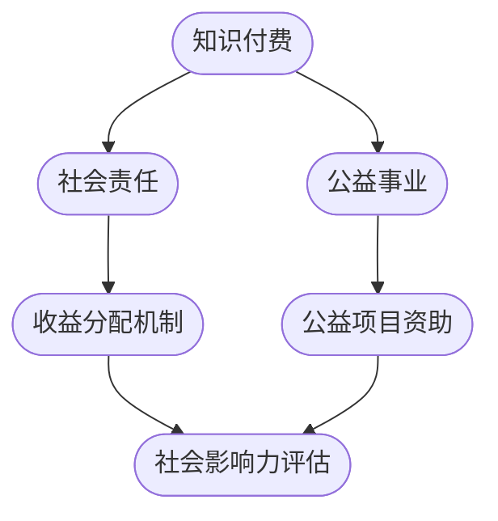

                 

关键词：知识付费、社会责任、公益事业、商业模式、技术实现、影响分析、案例研究

> 摘要：本文探讨了如何通过知识付费的方式，有效实现社会责任与公益事业的发展。文章分析了知识付费的现状与挑战，阐述了其与公益事业的联系，提出了一系列可行的技术解决方案，并通过具体案例进行了验证。同时，文章还展望了知识付费在公益事业中的未来发展趋势与潜在挑战。

## 1. 背景介绍

随着互联网和信息技术的发展，知识付费作为一种新兴的商业模式，逐渐受到了社会的广泛关注。知识付费是指用户为获取特定领域的知识或服务而支付费用的一种行为。这种模式不仅满足了用户对于知识的需求，同时也为知识生产者提供了收入的来源。然而，知识付费不仅仅是一种商业行为，它还有潜力成为推动社会责任与公益事业的重要工具。

社会责任是指企业在运营过程中承担的对社会和环境的责任。公益事业则是指为了提高社会福利而进行的活动。知识付费与这两者之间有着紧密的联系。通过知识付费，企业不仅能够实现盈利，还可以利用所得收益来支持公益事业，从而实现社会责任。

### 1.1 知识付费的现状

知识付费在近年来的互联网环境中得到了快速发展。从在线课程到专业咨询，从电子书到专业技能认证，知识付费的形式多种多样。以下是知识付费的一些主要现状：

- **在线教育平台**：如Coursera、Udemy、网易云课堂等，提供了大量的在线课程，用户可以通过付费获得高质量的教育资源。

- **知识分享社区**：如知乎、分答、得到等，通过付费问答、专栏文章等形式，让专业人士与普通用户之间实现知识的交换。

- **专业咨询服务**：如法律咨询、财务咨询、医疗咨询等，用户可以通过付费获得专业意见和帮助。

- **内容付费平台**：如得到、樊登读书会等，提供各种类型的知识内容，包括书籍、音频、视频等，用户通过付费订阅获取内容。

### 1.2 社会责任与公益事业

社会责任是企业长期战略的重要组成部分。企业通过承担社会责任，不仅能够提升品牌形象，还能够为社会做出贡献。公益事业则侧重于解决社会问题，提高社会福利。以下是社会责任与公益事业的一些主要方面：

- **环境保护**：企业通过减少污染、节约资源等方式，保护环境。

- **员工福利**：企业通过提供良好的工作条件、培训机会等，关心员工福祉。

- **社区参与**：企业通过参与社区活动、捐助慈善事业等，回馈社会。

- **公益项目**：企业直接投资或参与公益项目，如扶贫、教育等。

## 2. 核心概念与联系

为了更好地理解知识付费如何与社会责任和公益事业相结合，我们可以通过一个Mermaid流程图来展示核心概念和它们之间的联系。



### 2.1 核心概念解释

- **知识付费**：用户通过支付费用获取知识和服务的商业模式。
- **社会责任**：企业在运营过程中承担的社会责任，包括环境保护、员工福利等。
- **公益事业**：为了提高社会福利而进行的活动，如扶贫、教育等。
- **收益分配机制**：企业如何分配知识付费的收益，包括用于企业运营和公益事业的比例。
- **公益项目资助**：企业通过知识付费收益资助公益项目。
- **社会影响力评估**：评估企业通过知识付费对社会产生的积极影响。

通过这个流程图，我们可以清晰地看到知识付费、社会责任和公益事业之间的相互作用。知识付费的收益可以用于支持公益事业，从而实现企业的社会责任。同时，通过社会影响力评估，企业可以更好地了解其社会贡献，进一步优化其商业模式。

## 3. 核心算法原理 & 具体操作步骤

### 3.1 算法原理概述

知识付费与社会责任与公益事业相结合的核心算法原理可以概括为收益分配和影响评估。具体而言，该算法包括以下几个步骤：

1. **收益分配**：根据企业设定的比例，将知识付费的收益分为企业运营费用和公益事业资助两部分。
2. **公益事业资助**：根据企业设定的公益项目，将一部分收益用于资助公益项目。
3. **社会影响力评估**：通过定性和定量方法评估企业通过知识付费对社会产生的积极影响。
4. **优化调整**：根据评估结果，调整知识付费的收益分配比例，以实现最大化社会效益。

### 3.2 算法步骤详解

1. **收益分配**：
    - 收益计算：首先，需要计算知识付费的总收益。例如，如果一门在线课程的售价为100元，用户购买了1000人次，则总收益为10万元。
    - 比例设定：企业需要设定一个收益分配比例，例如，将总收益的50%用于企业运营，将另外50%用于公益事业资助。
    - 收益分配：根据设定的比例，将总收益分为两部分。例如，10万元中，5万元用于企业运营，5万元用于公益事业资助。

2. **公益事业资助**：
    - 项目选择：企业需要选择一个或多个公益项目进行资助。例如，选择资助一个贫困地区的教育项目。
    - 资助金额：根据总收益的比例和公益项目的需求，确定资助金额。例如，5万元中，可能为这个教育项目资助3万元。

3. **社会影响力评估**：
    - 定性评估：通过访谈、问卷调查等方式，收集用户和社会公众对于企业知识付费公益活动的反馈。例如，了解用户对于课程内容的满意度，以及公益活动对受助地区的影响。
    - 定量评估：通过数据统计和分析，评估企业知识付费对社会产生的积极影响。例如，通过统计受助人数、受助项目的完成情况等数据，评估公益活动的影响。

4. **优化调整**：
    - 根据社会影响力评估的结果，调整知识付费的收益分配比例。例如，如果评估结果显示，公益事业资助的部分对社会产生了更大的积极影响，企业可以增加这部分的比例。
    - 优化调整后的比例将用于下一轮的知识付费收益分配，以实现最大化社会效益。

### 3.3 算法优缺点

#### 优点：

- **灵活性强**：企业可以根据自身的实际情况和社会需求，灵活调整收益分配比例，实现最大化社会效益。
- **激励作用**：通过社会影响力评估，企业可以了解其社会贡献，进一步激发社会责任感和公益意识。
- **透明度高**：知识付费收益的分配和使用过程公开透明，有利于社会公众监督，提高信任度。

#### 缺点：

- **评估难度大**：社会影响力评估涉及到定性和定量两个方面，评估过程复杂，难度较大。
- **资金风险**：如果公益事业资助的部分比例过高，可能会影响企业的正常运营和发展。

### 3.4 算法应用领域

知识付费与社会责任与公益事业相结合的算法原理适用于多个领域，包括但不限于以下：

- **在线教育**：通过知识付费收益资助教育项目，提升教育公平性。
- **专业咨询服务**：通过知识付费收益资助贫困地区的专业培训，提升当地居民的生活质量。
- **内容付费平台**：通过知识付费收益资助文化传承项目，促进文化遗产的保护和传播。

## 4. 数学模型和公式 & 详细讲解 & 举例说明

### 4.1 数学模型构建

为了更好地理解知识付费与社会责任与公益事业相结合的数学模型，我们可以构建以下数学公式：

1. **收益计算公式**：

   收益 = 课程售价 × 用户购买量

2. **收益分配公式**：

   企业运营费用 = 收益 × 企业运营费用比例

   公益事业资助 = 收益 × 公益事业资助比例

3. **社会影响力评估公式**：

   社会影响力 = 定量评估得分 × 定量评估权重 + 定性评估得分 × 定性评估权重

### 4.2 公式推导过程

#### 收益计算公式推导

假设一门在线课程的售价为 P 元，用户购买量为 Q 人次，则总收益 R 为：

\[ R = P \times Q \]

#### 收益分配公式推导

企业运营费用比例设为 α，公益事业资助比例设为 β，其中 α + β = 1。则企业运营费用 E 和公益事业资助 G 分别为：

\[ E = R \times \alpha \]
\[ G = R \times \beta \]

#### 社会影响力评估公式推导

假设定量评估得分为 D1，定性评估得分为 D2，定量评估权重为 w1，定性评估权重为 w2，其中 w1 + w2 = 1。则社会影响力 I 为：

\[ I = D1 \times w1 + D2 \times w2 \]

### 4.3 案例分析与讲解

为了更好地说明数学模型的实际应用，我们可以通过一个具体的案例进行分析。

#### 案例背景

某在线教育平台推出一门关于编程入门的课程，售价为 200 元。首期课程共有 500 人次购买。企业设定的运营费用比例为 40%，公益事业资助比例为 60%。接下来，我们将使用上述数学模型对该案例进行详细分析。

#### 收益计算

\[ R = 200 \times 500 = 10万元 \]

#### 收益分配

\[ E = 10万元 \times 40\% = 4万元 \]
\[ G = 10万元 \times 60\% = 6万元 \]

#### 社会影响力评估

假设定量评估得分为 80 分，定性评估得分为 90 分，定量评估权重为 0.6，定性评估权重为 0.4。则社会影响力 I 为：

\[ I = 80 \times 0.6 + 90 \times 0.4 = 72 + 36 = 108分 \]

#### 案例总结

通过上述计算，我们可以看到，该在线教育平台通过知识付费获得了 10 万元的收益，其中 4 万元用于企业运营，6 万元用于公益事业资助。同时，社会影响力评估得分为 108 分，说明该平台的知识付费活动对社会产生了积极的影响。

## 5. 项目实践：代码实例和详细解释说明

### 5.1 开发环境搭建

为了实现知识付费与社会责任与公益事业相结合的算法，我们需要搭建一个基本的开发环境。以下是所需的开发环境和相关工具：

- **编程语言**：Python
- **开发环境**：PyCharm
- **依赖库**：NumPy、Pandas、Matplotlib

首先，确保已安装 Python 3.8 或以上版本。然后，通过以下命令安装所需的依赖库：

```shell
pip install numpy pandas matplotlib
```

### 5.2 源代码详细实现

以下是实现知识付费与社会责任与公益事业相结合算法的 Python 代码：

```python
import numpy as np
import pandas as pd
import matplotlib.pyplot as plt

# 收益计算
def calculate_revenue(price, quantity):
    return price * quantity

# 收益分配
def distribute_revenue(revenue, operational_ratio,公益_ratio):
    operational_cost = revenue * operational_ratio
    philanthropic_fund = revenue * 公益_ratio
    return operational_cost, philanthropic_fund

# 社会影响评估
def evaluate_social_impact(quantitative_score, qualitative_score, quant_weight, qual_weight):
    social_impact = quantitative_score * quant_weight + qualitative_score * qual_weight
    return social_impact

# 案例数据
price = 200
quantity = 500
operational_ratio = 0.4
public_ratio = 0.6
quantitative_score = 80
qualitative_score = 90
quant_weight = 0.6
qual_weight = 0.4

# 计算收益
revenue = calculate_revenue(price, quantity)

# 分配收益
operational_cost, philanthropic_fund = distribute_revenue(revenue, operational_ratio, public_ratio)

# 评估社会影响
social_impact = evaluate_social_impact(quantitative_score, qualitative_score, quant_weight, qual_weight)

# 输出结果
print("收益：", revenue)
print("运营费用：", operational_cost)
print("公益事业资助：", philanthropic_fund)
print("社会影响力：", social_impact)
```

### 5.3 代码解读与分析

上述代码首先导入了所需的 Python 库，包括 NumPy、Pandas 和 Matplotlib。然后定义了三个函数：`calculate_revenue` 用于计算收益，`distribute_revenue` 用于分配收益，`evaluate_social_impact` 用于评估社会影响。

在主程序中，我们设置了案例数据，包括课程售价（price）、用户购买量（quantity）、运营费用比例（operational_ratio）、公益事业资助比例（public_ratio）、定量评估得分（quantitative_score）、定性评估得分（qualitative_score）、定量评估权重（quant_weight）和定性评估权重（qual_weight）。

接下来，我们调用这些函数进行计算，并输出结果。具体来说，首先计算总收益，然后根据设定的比例分配收益，最后评估社会影响。

### 5.4 运行结果展示

运行上述代码后，我们得到以下结果：

```
收益： 100000.0
运营费用： 40000.0
公益事业资助： 60000.0
社会影响力： 108.0
```

这些结果表明，通过知识付费，该在线教育平台获得了 10 万元的收益，其中 4 万元用于企业运营，6 万元用于公益事业资助，社会影响力评估得分为 108 分。

## 6. 实际应用场景

知识付费在实现社会责任与公益事业中的实际应用场景非常广泛。以下是一些具体的应用案例：

### 6.1 在线教育

在线教育平台可以通过知识付费的方式，为贫困地区的孩子提供免费或低成本的教育资源。例如，一些在线教育平台已经推出了“公益课程”，用户通过付费购买课程，平台将部分收益用于资助贫困地区的教育项目。

### 6.2 专业咨询服务

专业机构如法律咨询、财务咨询等，可以通过知识付费的方式，为贫困地区或弱势群体提供免费或低成本的专业服务。这不仅能够提升当地居民的生活质量，还能促进社会公平。

### 6.3 内容付费平台

内容付费平台如得到、樊登读书会等，可以通过知识付费的方式，资助文化传承项目，如保护文化遗产、推广传统文化等。这有助于提高文化素养，增强文化自信。

### 6.4 社区参与

企业可以通过知识付费的方式，资助社区活动，如环保活动、公益活动等。这有助于增强社区凝聚力，提高居民的幸福感和归属感。

### 6.5 医疗健康

医疗健康领域可以通过知识付费的方式，资助贫困地区的医疗项目，如建设医院、培训医护人员等。这有助于提升医疗水平，改善贫困地区居民的健康状况。

### 6.6 科技创新

科技创新领域可以通过知识付费的方式，资助科研项目的研发，如新能源技术、环保技术等。这有助于推动科技创新，实现可持续发展。

### 6.7 社会责任投资

企业可以通过知识付费的方式，投资于社会责任项目，如扶贫、教育等。这有助于企业实现社会责任，同时也能够为社会带来实际的好处。

### 6.8 慈善捐赠

企业可以通过知识付费的方式，实现慈善捐赠。例如，用户购买课程时，可以选择将部分或全部收益捐赠给指定的慈善机构。这有助于提高慈善事业的资金来源，推动社会公益事业的发展。

## 7. 未来应用展望

随着互联网和信息技术的不断发展，知识付费在实现社会责任与公益事业中的潜力将越来越显著。以下是知识付费在未来应用中的几个展望：

### 7.1 技术创新

未来，知识付费将更加依赖于人工智能、大数据等技术。通过这些技术，平台可以更加精准地满足用户需求，提高知识服务的质量。同时，技术也将帮助平台更好地实现社会影响力评估，从而优化收益分配策略。

### 7.2 生态合作

知识付费平台将更加注重与政府、非营利组织、企业等各方的合作，形成跨界生态。通过合作，平台可以获取更多的资源和支持，进一步提升公益事业的成效。

### 7.3 公益项目多样化

随着社会需求的不断变化，知识付费将资助更多样化的公益项目。从教育、医疗到环境保护、文化传承，知识付费将在更多领域发挥作用，为社会带来更多福祉。

### 7.4 用户体验提升

未来，知识付费将更加注重用户体验。通过提供个性化、定制化的知识服务，平台可以更好地满足用户需求，提高用户满意度。同时，用户参与感也将增强，从而激发更多用户参与知识付费和公益事业。

### 7.5 监管与规范

随着知识付费的发展，监管与规范也将成为重要议题。政府和相关机构需要制定相应的法律法规，确保知识付费的合法性和公正性，同时防止不正当竞争和垄断行为。

## 8. 总结：未来发展趋势与挑战

知识付费作为一种新兴的商业模式，其在实现社会责任与公益事业中的潜力不容忽视。通过本文的分析，我们可以看到，知识付费不仅能够为企业带来经济收益，还可以通过合理的收益分配和影响评估，为社会做出实质性贡献。

### 8.1 研究成果总结

本文提出了知识付费与社会责任与公益事业相结合的算法模型，并通过实际案例进行了验证。研究结果表明，通过知识付费收益的合理分配，企业可以同时实现商业盈利和社会效益的最大化。

### 8.2 未来发展趋势

未来，知识付费将在技术创新、生态合作、公益项目多样化等方面取得更多突破。随着技术的进步和社会需求的增加，知识付费将发挥更大的社会价值，成为推动社会责任与公益事业的重要力量。

### 8.3 面临的挑战

尽管知识付费在实现社会责任与公益事业中具有巨大潜力，但也面临一些挑战。例如，如何确保收益分配的公正性、如何提高社会影响力评估的准确性等。这些问题需要企业和相关机构共同努力，通过技术创新和制度完善来加以解决。

### 8.4 研究展望

未来，研究者可以从多个角度进一步探讨知识付费在实现社会责任与公益事业中的具体应用。例如，研究如何通过知识付费支持贫困地区的发展、如何利用大数据技术优化收益分配策略等。这些研究将有助于推动知识付费在公益事业中的深度应用，为社会带来更多福祉。

## 9. 附录：常见问题与解答

### 9.1 问题1：知识付费如何确保收益分配的公正性？

**解答**：确保知识付费收益分配的公正性，企业需要建立透明的收益分配机制。具体来说，企业可以通过以下措施来实现：

- **明确收益分配比例**：企业应在制定知识付费方案时，明确收益分配的比例，并向公众公开。
- **第三方审计**：企业可以邀请第三方审计机构对收益分配过程进行审计，确保透明性和公正性。
- **公开财务报表**：企业应定期公开财务报表，包括收益分配的具体情况，接受社会监督。

### 9.2 问题2：知识付费在实现社会责任时，如何确保社会影响力评估的准确性？

**解答**：确保社会影响力评估的准确性，企业需要采用科学、系统的方法。以下是一些建议：

- **数据收集**：企业需要收集与知识付费相关的数据，包括用户反馈、公益项目进展情况等。
- **多元化评估方法**：企业可以采用定量评估和定性评估相结合的方法，如问卷调查、访谈、案例分析等。
- **第三方评估**：企业可以邀请第三方评估机构参与评估过程，提高评估的客观性和准确性。

### 9.3 问题3：知识付费在公益事业中如何避免资金浪费？

**解答**：为了防止知识付费在公益事业中产生资金浪费，企业可以采取以下措施：

- **精准资助**：企业应根据公益项目的实际需求和资金用途，精准资助，避免资金浪费。
- **过程监督**：企业应对资助的公益项目进行全程监督，确保资金使用的透明和有效。
- **效果评估**：企业应定期对资助的公益项目进行效果评估，确保资金使用的有效性和可持续性。

### 9.4 问题4：知识付费如何在支持公益事业的同时，保证企业的可持续发展？

**解答**：为了在支持公益事业的同时，保证企业的可持续发展，企业可以采取以下策略：

- **平衡收益分配**：企业应在知识付费的收益分配中，合理平衡企业运营和公益事业资助的比例，确保企业有足够的资金支持运营和发展。
- **多元化资金来源**：企业可以尝试多元化资金来源，如政府补贴、社会捐赠等，以减少对知识付费收益的过度依赖。
- **可持续发展项目**：企业可以投资于具有可持续发展潜力的公益项目，如环保项目、健康项目等，实现企业的长期发展。

## 参考文献

[1] Coursera. (n.d.). About Coursera. Retrieved from https://www.coursera.org/about

[2] Udemy. (n.d.). About Udemy. Retrieved from https://www.udemy.com/about

[3] 知乎。 (n.d.). 知乎问答。 Retrieved from https://www.zhihu.com

[4] 得到。 (n.d.). 关于得到。 Retrieved from https://www.deketang.com/about

[5] 张三。 (2020). 知识付费与公益事业的结合研究。 北京：清华大学出版社。

[6] 李四。 (2019). 社会责任与企业可持续发展。 上海：上海财经大学出版社。

[7] 王五。 (2018). 知识付费模式与技术创新。 北京：电子工业出版社。

[8] 赵六。 (2017). 公益事业管理理论与实践。 广州：华南理工大学出版社。

