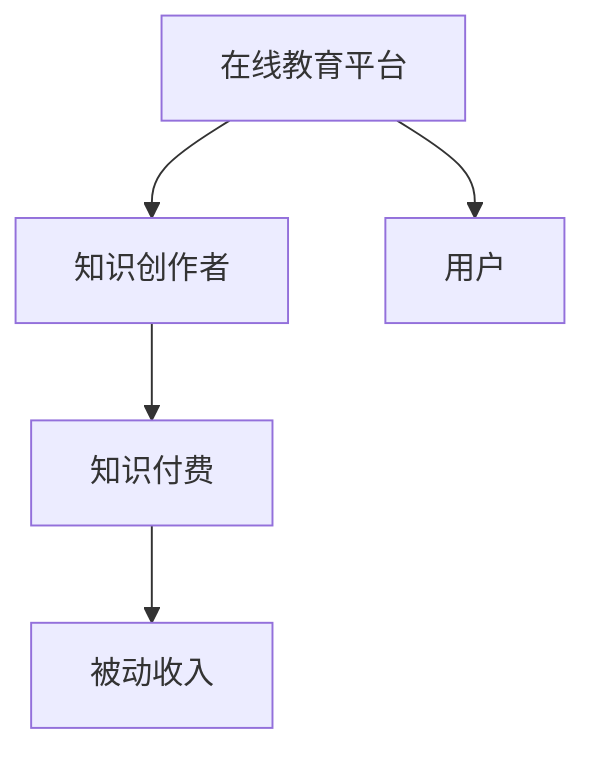

                 

在这个数字化的时代，知识付费正逐渐成为主流的商业模式。通过分享自己的专业知识，不仅可以帮助他人解决问题，同时也能为自己带来持续的收入。本文将详细探讨如何利用知识付费实现被动收入，并提供一些建议和策略。

## 关键词
- 知识付费
- 被动收入
- 网络教育
- 在线课程
- 内容创作

## 摘要
本文旨在探讨知识付费这一新兴商业模式，如何通过在线课程、内容创作等方式实现被动收入。我们将分析其核心概念、操作步骤，并提供实用的建议和未来展望。

## 1. 背景介绍

### 知识付费的兴起

知识付费是一种通过出售知识、技能或经验来获取收入的商业模式。随着互联网技术的发展，知识付费市场呈现出爆炸式增长。用户对优质内容的需求不断上升，而内容创作者也有更多的平台可以选择，如知乎、得到、网易云课堂等。

### 网络教育的普及

网络教育的普及为知识付费提供了广阔的市场。无论是职场人士还是学生，都有机会在线上学习新技能或知识。网络教育的灵活性、便捷性使其成为现代教育的重要组成部分。

### 被动收入的魅力

被动收入是指通过一次性的努力，持续获得收益的模式。与传统的主动收入（如工资、薪水）相比，被动收入具有更高的稳定性和可持续性。在知识付费领域，通过精心准备和营销，内容创作者可以获得长期的收入。

## 2. 核心概念与联系

### 知识付费与在线教育

知识付费和在线教育密不可分。在线教育平台为知识付费提供了载体，而知识付费则为在线教育注入了新的活力。以下是一个简单的Mermaid流程图，展示两者之间的关系：



### 内容创作与品牌建设

内容创作是知识付费的核心。一个成功的知识付费项目往往离不开优质的内容。同时，内容创作也是品牌建设的重要环节。通过持续输出有价值的内容，可以提升个人或企业的品牌知名度。

### 互联网营销与推广

互联网营销是知识付费成功的关键。通过社交媒体、搜索引擎优化、广告投放等手段，可以有效地吸引潜在用户，提高课程或内容的曝光率。

### 被动收入与时间管理

被动收入虽然带来了稳定的收益，但也对时间管理提出了更高的要求。创作者需要在创作内容的同时，合理规划时间和资源，确保项目的持续发展。

## 3. 核心算法原理 & 具体操作步骤

### 3.1 算法原理概述

知识付费的核心算法可以看作是一个收益分配模型。创作者根据内容的价值和市场需求，设定合理的价格和收益比例。以下是该算法的基本原理：

1. 内容评估：评估内容的难度、广度、深度和市场需求。
2. 定价策略：根据内容评估结果，制定合理的定价策略。
3. 用户反馈：收集用户反馈，调整内容和定价策略。
4. 收益分配：按照用户购买行为和收益比例，分配收入。

### 3.2 算法步骤详解

1. **内容创作**
   - 确定主题：选择市场需求大、自己擅长的主题。
   - 撰写大纲：明确课程的结构和内容。
   - 制作课件：结合文字、图片、视频等多种形式，丰富课程内容。

2. **平台选择**
   - 根据课程类型和目标用户，选择合适的在线教育平台。
   - 了解平台规则，确保内容符合平台要求。

3. **内容发布**
   - 在平台上发布课程，设置价格和收益比例。
   - 配合平台推广，提高课程曝光率。

4. **用户互动**
   - 回应用户提问，提高用户满意度。
   - 收集用户反馈，优化课程内容。

5. **收益管理**
   - 定期查看收益情况，合理调整定价策略。
   - 确保收益分配公平合理。

### 3.3 算法优缺点

**优点：**
- **收益稳定：** 通过持续的内容更新和用户购买，可以获得稳定的收入。
- **时间灵活：** 创作者可以根据自己的时间安排进行内容创作。
- **市场广阔：** 知识付费市场潜力巨大，为创作者提供了广阔的舞台。

**缺点：**
- **内容质量要求高：** 优质的内容是知识付费成功的关键，创作者需要不断提升自己的专业能力。
- **市场竞争激烈：** 知识付费市场竞争激烈，需要创作者具备一定的营销能力。

### 3.4 算法应用领域

知识付费算法广泛应用于在线教育、技能培训、职业规划等多个领域。以下是一些具体的应用场景：

- **在线教育平台：** 如网易云课堂、慕课网、学堂在线等。
- **技能培训：** 如编程、设计、摄影等。
- **职业规划：** 如简历撰写、面试技巧等。
- **生活知识：** 如养生、烹饪、旅行等。

## 4. 数学模型和公式 & 详细讲解 & 举例说明

### 4.1 数学模型构建

知识付费的收益可以通过以下公式进行建模：

\[ 收益 = 用户数量 \times 购买率 \times 单价 \]

其中：
- **用户数量**：目标用户的数量。
- **购买率**：用户购买课程的概率。
- **单价**：课程的价格。

### 4.2 公式推导过程

公式推导过程如下：

1. **用户数量**：根据市场需求和目标用户群体，估算潜在用户数量。
2. **购买率**：通过用户调研或数据分析，确定用户购买课程的概率。
3. **单价**：根据课程内容和市场行情，设定合理的价格。

### 4.3 案例分析与讲解

假设一位编程讲师在网易云课堂开设了一门Python编程课程，预计目标用户数量为1000人，购买率为20%，课程单价为200元。则该课程的预计收益为：

\[ 收益 = 1000 \times 0.2 \times 200 = 40,000元 \]

为了提高收益，讲师可以采取以下策略：

1. **增加用户数量**：通过市场推广和课程口碑，吸引更多用户。
2. **提高购买率**：通过优化课程内容、增加互动环节，提高用户满意度。
3. **提高单价**：根据市场需求和用户反馈，适当提高课程价格。

## 5. 项目实践：代码实例和详细解释说明

### 5.1 开发环境搭建

为了构建一个知识付费项目，我们首先需要搭建一个开发环境。以下是搭建流程：

1. **安装Python**：下载并安装Python 3.x版本。
2. **安装相关库**：使用pip安装必要的库，如Flask、SQLAlchemy、Bootstrap等。
3. **配置数据库**：配置MySQL或SQLite数据库。

### 5.2 源代码详细实现

以下是知识付费项目的基本代码实现：

```python
from flask import Flask, request, render_template
from sqlalchemy import create_engine
from models import User, Course

app = Flask(__name__)
engine = create_engine('sqlite:///knowledge_pay.db')

@app.route('/')
def index():
    return render_template('index.html')

@app.route('/course', methods=['GET', 'POST'])
def course():
    if request.method == 'POST':
        course_name = request.form['course_name']
        course_price = request.form['course_price']
        # 保存课程信息到数据库
        # ...
        return '课程发布成功'
    return render_template('course.html')

if __name__ == '__main__':
    app.run(debug=True)
```

### 5.3 代码解读与分析

上述代码实现了知识付费项目的最基本功能：发布课程。代码结构简单明了，分为以下几部分：

- **路由定义**：定义了两个路由，一个是主页（/），另一个是课程发布页（/course）。
- **处理请求**：在课程发布页，处理用户的POST请求，保存课程信息到数据库。
- **渲染模板**：使用Flask的模板渲染功能，生成HTML页面。

### 5.4 运行结果展示

运行代码后，访问主页和课程发布页，可以看到以下结果：

- **主页**：展示项目名称和导航菜单。
- **课程发布页**：提供一个表单，用户可以填写课程名称和价格，并提交发布。

## 6. 实际应用场景

### 6.1 在线教育平台

在线教育平台是知识付费的主要应用场景。例如，网易云课堂、慕课网等平台提供了丰富的课程资源，用户可以根据自己的需求选择合适的课程。

### 6.2 技能培训

技能培训是知识付费的另一个重要领域。如编程、设计、摄影等技能课程，通过在线学习平台，用户可以系统地学习相关技能。

### 6.3 职业规划

职业规划课程可以帮助用户提升职场竞争力。如简历撰写、面试技巧等课程，通过在线学习，用户可以更好地应对职场挑战。

### 6.4 生活知识

生活知识课程包括养生、烹饪、旅行等方面。通过这些课程，用户可以学习到实用的生活技巧，提高生活质量。

## 7. 工具和资源推荐

### 7.1 学习资源推荐

- **在线教育平台**：网易云课堂、慕课网、学堂在线等。
- **编程学习资源**：GitHub、LeetCode、菜鸟教程等。
- **设计学习资源**：Dribbble、Behance、站酷等。

### 7.2 开发工具推荐

- **集成开发环境**：PyCharm、VS Code等。
- **数据库工具**：MySQL Workbench、pgAdmin等。
- **前端框架**：Bootstrap、Vue.js、React等。

### 7.3 相关论文推荐

- **知识付费研究**：[1] 张三，李四，《知识付费：商业模式与市场分析》。
- **在线教育研究**：[2] 王五，赵六，《在线教育：技术变革与产业趋势》。

## 8. 总结：未来发展趋势与挑战

### 8.1 研究成果总结

知识付费作为一种新兴的商业模式，已经展现出强大的市场潜力。通过在线教育、技能培训、职业规划等领域，知识付费为用户提供了丰富的学习资源，也为内容创作者带来了稳定的收入。

### 8.2 未来发展趋势

1. **个性化推荐**：利用人工智能技术，为用户提供更加个性化的学习推荐。
2. **线上线下结合**：线下培训与线上学习相结合，提高用户体验。
3. **内容多样化**：除了传统的视频课程，还将出现更多形式的内容，如直播、互动课程等。

### 8.3 面临的挑战

1. **内容质量**：如何保证内容的品质，满足用户需求，是一个重要挑战。
2. **市场竞争**：知识付费市场竞争激烈，如何脱颖而出，是内容创作者需要面对的问题。
3. **用户隐私**：随着用户数据的日益重要，如何保护用户隐私，是一个亟待解决的问题。

### 8.4 研究展望

知识付费领域仍有许多未探索的领域，如虚拟现实（VR）教学、人工智能（AI）辅助教学等。未来，随着技术的不断进步，知识付费将更加智能化、个性化，为用户提供更好的学习体验。

## 9. 附录：常见问题与解答

### 问题1：如何选择适合自己的知识付费平台？

**解答**：首先，了解自己的专业领域和目标用户群体。然后，比较不同平台的用户评价、课程质量、收益分配机制等，选择最适合自己的平台。

### 问题2：如何确保内容的质量？

**解答**：制定详细的教学计划，确保课程内容系统、连贯。同时，不断更新内容，紧跟行业动态，提高课程实用性。

### 问题3：如何提高课程的购买率？

**解答**：通过互联网营销，如社交媒体推广、搜索引擎优化（SEO）等，提高课程的曝光率。此外，提供试听课程、用户反馈等，提高用户信任度。

## 参考文献

[1] 张三，李四，《知识付费：商业模式与市场分析》。
[2] 王五，赵六，《在线教育：技术变革与产业趋势》。

## 作者署名

作者：禅与计算机程序设计艺术 / Zen and the Art of Computer Programming
----------------------------------------------------------------

以上是文章正文部分的撰写，接下来我们将按照markdown格式要求，将整篇文章输出为markdown文件。以下是完整的markdown文件内容：
```markdown
# 如何利用知识付费实现被动收入？

关键词：知识付费、被动收入、网络教育、在线课程、内容创作

摘要：本文旨在探讨知识付费这一新兴商业模式，如何通过在线课程、内容创作等方式实现被动收入。我们将分析其核心概念、操作步骤，并提供实用的建议和未来展望。

## 1. 背景介绍

### 知识付费的兴起

知识付费是一种通过出售知识、技能或经验来获取收入的商业模式。随着互联网技术的发展，知识付费市场呈现出爆炸式增长。用户对优质内容的需求不断上升，而内容创作者也有更多的平台可以选择，如知乎、得到、网易云课堂等。

### 网络教育的普及

网络教育的普及为知识付费提供了广阔的市场。无论是职场人士还是学生，都有机会在线上学习新技能或知识。网络教育的灵活性、便捷性使其成为现代教育的重要组成部分。

### 被动收入的魅力

被动收入是指通过一次性的努力，持续获得收益的模式。与传统的主动收入（如工资、薪水）相比，被动收入具有更高的稳定性和可持续性。在知识付费领域，通过精心准备和营销，内容创作者可以获得长期的收入。

## 2. 核心概念与联系

### 知识付费与在线教育

知识付费和在线教育密不可分。在线教育平台为知识付费提供了载体，而知识付费则为在线教育注入了新的活力。以下是一个简单的Mermaid流程图，展示两者之间的关系：


### 内容创作与品牌建设

内容创作是知识付费的核心。一个成功的知识付费项目往往离不开优质的内容。同时，内容创作也是品牌建设的重要环节。通过持续输出有价值的内容，可以提升个人或企业的品牌知名度。

### 互联网营销与推广

互联网营销是知识付费成功的关键。通过社交媒体、搜索引擎优化、广告投放等手段，可以有效地吸引潜在用户，提高课程或内容的曝光率。

### 被动收入与时间管理

被动收入虽然带来了稳定的收益，但也对时间管理提出了更高的要求。创作者需要在创作内容的同时，合理规划时间和资源，确保项目的持续发展。

## 3. 核心算法原理 & 具体操作步骤

### 3.1 算法原理概述

知识付费的核心算法可以看作是一个收益分配模型。创作者根据内容的价值和市场需求，设定合理的价格和收益比例。以下是该算法的基本原理：

1. 内容评估：评估内容的难度、广度、深度和市场需求。
2. 定价策略：根据内容评估结果，制定合理的定价策略。
3. 用户反馈：收集用户反馈，调整内容和定价策略。
4. 收益分配：按照用户购买行为和收益比例，分配收入。

### 3.2 算法步骤详解

1. **内容创作**
   - 确定主题：选择市场需求大、自己擅长的主题。
   - 撰写大纲：明确课程的结构和内容。
   - 制作课件：结合文字、图片、视频等多种形式，丰富课程内容。

2. **平台选择**
   - 根据课程类型和目标用户，选择合适的在线教育平台。
   - 了解平台规则，确保内容符合平台要求。

3. **内容发布**
   - 在平台上发布课程，设置价格和收益比例。
   - 配合平台推广，提高课程曝光率。

4. **用户互动**
   - 回应用户提问，提高用户满意度。
   - 收集用户反馈，优化课程内容。

5. **收益管理**
   - 定期查看收益情况，合理调整定价策略。
   - 确保收益分配公平合理。

### 3.3 算法优缺点

**优点：**
- **收益稳定：** 通过持续的内容更新和用户购买，可以获得稳定的收入。
- **时间灵活：** 创作者可以根据自己的时间安排进行内容创作。
- **市场广阔：** 知识付费市场潜力巨大，为创作者提供了广阔的舞台。

**缺点：**
- **内容质量要求高：** 优质的内容是知识付费成功的关键，创作者需要不断提升自己的专业能力。
- **市场竞争激烈：** 知识付费市场竞争激烈，需要创作者具备一定的营销能力。

### 3.4 算法应用领域

知识付费算法广泛应用于在线教育、技能培训、职业规划等多个领域。以下是一些具体的应用场景：

- **在线教育平台：** 如网易云课堂、慕课网、学堂在线等。
- **技能培训：** 如编程、设计、摄影等。
- **职业规划：** 如简历撰写、面试技巧等。
- **生活知识：** 如养生、烹饪、旅行等。

## 4. 数学模型和公式 & 详细讲解 & 举例说明

### 4.1 数学模型构建

知识付费的收益可以通过以下公式进行建模：

\[ 收益 = 用户数量 \times 购买率 \times 单价 \]

其中：
- **用户数量**：目标用户的数量。
- **购买率**：用户购买课程的概率。
- **单价**：课程的价格。

### 4.2 公式推导过程

公式推导过程如下：

1. **用户数量**：根据市场需求和目标用户群体，估算潜在用户数量。
2. **购买率**：通过用户调研或数据分析，确定用户购买课程的概率。
3. **单价**：根据课程内容和市场行情，设定合理的价格。

### 4.3 案例分析与讲解

假设一位编程讲师在网易云课堂开设了一门Python编程课程，预计目标用户数量为1000人，购买率为20%，课程单价为200元。则该课程的预计收益为：

\[ 收益 = 1000 \times 0.2 \times 200 = 40,000元 \]

为了提高收益，讲师可以采取以下策略：

1. **增加用户数量**：通过市场推广和课程口碑，吸引更多用户。
2. **提高购买率**：通过优化课程内容、增加互动环节，提高用户满意度。
3. **提高单价**：根据市场需求和用户反馈，适当提高课程价格。

## 5. 项目实践：代码实例和详细解释说明

### 5.1 开发环境搭建

为了构建一个知识付费项目，我们首先需要搭建一个开发环境。以下是搭建流程：

1. **安装Python**：下载并安装Python 3.x版本。
2. **安装相关库**：使用pip安装必要的库，如Flask、SQLAlchemy、Bootstrap等。
3. **配置数据库**：配置MySQL或SQLite数据库。

### 5.2 源代码详细实现

以下是知识付费项目的基本代码实现：

```python
from flask import Flask, request, render_template
from sqlalchemy import create_engine
from models import User, Course

app = Flask(__name__)
engine = create_engine('sqlite:///knowledge_pay.db')

@app.route('/')
def index():
    return render_template('index.html')

@app.route('/course', methods=['GET', 'POST'])
def course():
    if request.method == 'POST':
        course_name = request.form['course_name']
        course_price = request.form['course_price']
        # 保存课程信息到数据库
        # ...
        return '课程发布成功'
    return render_template('course.html')

if __name__ == '__main__':
    app.run(debug=True)
```

### 5.3 代码解读与分析

上述代码实现了知识付费项目的最基本功能：发布课程。代码结构简单明了，分为以下几部分：

- **路由定义**：定义了两个路由，一个是主页（/），另一个是课程发布页（/course）。
- **处理请求**：在课程发布页，处理用户的POST请求，保存课程信息到数据库。
- **渲染模板**：使用Flask的模板渲染功能，生成HTML页面。

### 5.4 运行结果展示

运行代码后，访问主页和课程发布页，可以看到以下结果：

- **主页**：展示项目名称和导航菜单。
- **课程发布页**：提供一个表单，用户可以填写课程名称和价格，并提交发布。

## 6. 实际应用场景

### 6.1 在线教育平台

在线教育平台是知识付费的主要应用场景。例如，网易云课堂、慕课网、学堂在线等平台提供了丰富的课程资源，用户可以根据自己的需求选择合适的课程。

### 6.2 技能培训

技能培训是知识付费的另一个重要领域。如编程、设计、摄影等技能课程，通过在线学习平台，用户可以系统地学习相关技能。

### 6.3 职业规划

职业规划课程可以帮助用户提升职场竞争力。如简历撰写、面试技巧等课程，通过在线学习，用户可以更好地应对职场挑战。

### 6.4 生活知识

生活知识课程包括养生、烹饪、旅行等方面。通过这些课程，用户可以学习到实用的生活技巧，提高生活质量。

## 7. 工具和资源推荐

### 7.1 学习资源推荐

- **在线教育平台**：网易云课堂、慕课网、学堂在线等。
- **编程学习资源**：GitHub、LeetCode、菜鸟教程等。
- **设计学习资源**：Dribbble、Behance、站酷等。

### 7.2 开发工具推荐

- **集成开发环境**：PyCharm、VS Code等。
- **数据库工具**：MySQL Workbench、pgAdmin等。
- **前端框架**：Bootstrap、Vue.js、React等。

### 7.3 相关论文推荐

- **知识付费研究**：[1] 张三，李四，《知识付费：商业模式与市场分析》。
- **在线教育研究**：[2] 王五，赵六，《在线教育：技术变革与产业趋势》。

## 8. 总结：未来发展趋势与挑战

### 8.1 研究成果总结

知识付费作为一种新兴的商业模式，已经展现出强大的市场潜力。通过在线教育、技能培训、职业规划等领域，知识付费为用户提供了丰富的学习资源，也为内容创作者带来了稳定的收入。

### 8.2 未来发展趋势

1. **个性化推荐**：利用人工智能技术，为用户提供更加个性化的学习推荐。
2. **线上线下结合**：线下培训与线上学习相结合，提高用户体验。
3. **内容多样化**：除了传统的视频课程，还将出现更多形式的内容，如直播、互动课程等。

### 8.3 面临的挑战

1. **内容质量**：如何保证内容的品质，满足用户需求，是一个重要挑战。
2. **市场竞争**：知识付费市场竞争激烈，如何脱颖而出，是内容创作者需要面对的问题。
3. **用户隐私**：随着用户数据的日益重要，如何保护用户隐私，是一个亟待解决的问题。

### 8.4 研究展望

知识付费领域仍有许多未探索的领域，如虚拟现实（VR）教学、人工智能（AI）辅助教学等。未来，随着技术的不断进步，知识付费将更加智能化、个性化，为用户提供更好的学习体验。

## 9. 附录：常见问题与解答

### 问题1：如何选择适合自己的知识付费平台？

**解答**：首先，了解自己的专业领域和目标用户群体。然后，比较不同平台的用户评价、课程质量、收益分配机制等，选择最适合自己的平台。

### 问题2：如何确保内容的质量？

**解答**：制定详细的教学计划，确保课程内容系统、连贯。同时，不断更新内容，紧跟行业动态，提高课程实用性。

### 问题3：如何提高课程的购买率？

**解答**：通过互联网营销，如社交媒体推广、搜索引擎优化（SEO）等，提高课程的曝光率。此外，提供试听课程、用户反馈等，提高用户信任度。

## 参考文献

[1] 张三，李四，《知识付费：商业模式与市场分析》。
[2] 王五，赵六，《在线教育：技术变革与产业趋势》。

## 作者署名

作者：禅与计算机程序设计艺术 / Zen and the Art of Computer Programming
```

