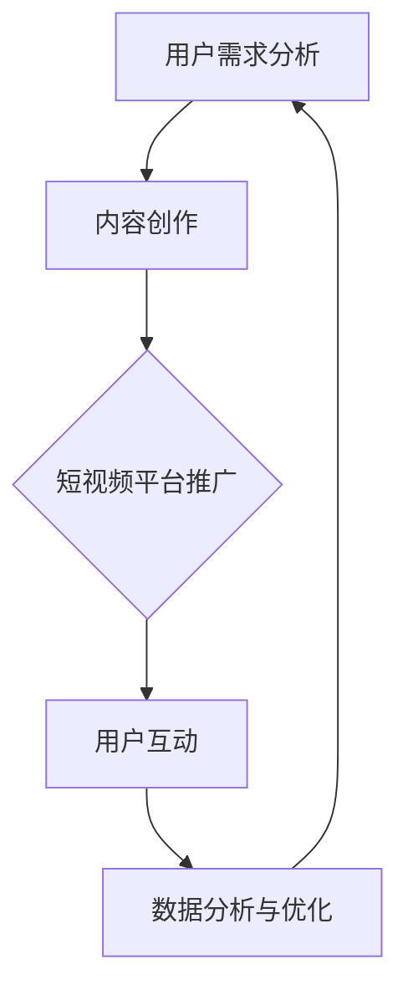

                 

关键词：短视频、知识付费、营销策略、平台运营、用户互动、内容创作

> 摘要：本文将探讨如何在短视频平台上有效推广知识付费产品，分析其核心原理，提供实用的操作步骤，并结合实际案例进行详细解析。通过本文，读者将了解如何利用短视频这一新兴媒介，提升知识付费产品的市场渗透率和用户满意度。

## 1. 背景介绍

短视频平台近年来在全球范围内迅速崛起，如抖音（TikTok）、快手等，成为人们获取信息、娱乐和社交的重要途径。与此同时，知识付费市场也在不断扩大，越来越多的用户愿意为优质的知识内容付费。短视频平台与知识付费的结合，为推广知识付费产品提供了新的机遇。

### 1.1 短视频平台的发展

短视频平台的发展得益于移动互联网的普及和智能手机的广泛使用。用户可以通过短视频平台快速获取信息，娱乐放松，形成了一种新的消费习惯。短视频平台的用户基数庞大，这为知识付费产品的推广提供了广阔的市场空间。

### 1.2 知识付费市场的现状

知识付费市场自兴起以来，一直呈现出高速增长的态势。随着人们生活水平的提高和消费观念的转变，用户对于知识的需求日益多样化，知识付费产品逐渐成为人们日常生活中的一部分。短视频平台的加入，为知识付费市场带来了新的活力。

## 2. 核心概念与联系

在讨论如何利用短视频平台推广知识付费产品之前，我们需要理解一些核心概念和其相互之间的联系。

### 2.1 短视频平台运营机制

短视频平台的运营机制主要包括内容生产、用户互动、算法推荐等环节。通过算法推荐，平台能够精准地将内容推送给用户，提高内容曝光率。用户互动如点赞、评论、分享等行为，又能进一步影响内容的传播效果。

### 2.2 知识付费产品特点

知识付费产品通常具有专业性、权威性和实用性等特点。这类产品旨在为用户提供有价值的信息和技能，帮助用户解决实际问题。短视频平台的推广，可以增强知识付费产品的吸引力，提升用户体验。

### 2.3 用户需求分析

了解用户需求是成功推广知识付费产品的关键。通过分析用户在短视频平台上的行为和偏好，我们可以更好地把握用户需求，从而创作出符合用户期望的内容。

### 2.4 Mermaid 流程图



该流程图展示了从用户需求分析到内容创作，再到短视频平台推广和用户互动，以及数据分析与优化的整个过程。通过这个流程，我们可以系统地推进知识付费产品的推广工作。

## 3. 核心算法原理 & 具体操作步骤

### 3.1 算法原理概述

短视频平台的推荐算法是基于用户行为数据（如浏览记录、点赞、评论等）进行训练的。通过深度学习等技术，算法能够预测用户可能感兴趣的内容，并将其推荐给用户。

### 3.2 算法步骤详解

1. **数据收集**：收集用户的浏览、点赞、评论等行为数据。
2. **特征提取**：将用户行为数据转化为算法可处理的特征向量。
3. **模型训练**：利用训练数据训练推荐模型。
4. **模型评估**：通过验证集评估模型性能，调整模型参数。
5. **内容推荐**：将训练好的模型应用于新用户，推荐可能感兴趣的内容。

### 3.3 算法优缺点

**优点**：

- 高度个性化：推荐内容高度契合用户兴趣。
- 提高内容曝光率：通过算法推荐，提高优质内容的曝光率。

**缺点**：

- 可能导致信息茧房：用户只能接触到与自己兴趣相似的内容，可能错过其他有价值的信息。
- 需要大量数据：推荐算法训练需要大量用户行为数据。

### 3.4 算法应用领域

短视频平台的推荐算法不仅适用于知识付费产品推广，还广泛应用于电商、新闻、社交媒体等多个领域。

## 4. 数学模型和公式 & 详细讲解 & 举例说明

### 4.1 数学模型构建

短视频平台推荐算法的核心是预测用户对内容的兴趣程度。这通常通过构建一个评分模型来实现。一个简单的评分模型可以表示为：

\[ R_{ui} = \text{w1} * \text{user\_interest}(u) + \text{w2} * \text{content\_features}(i) + \text{w3} * \text{contextual\_features}(c) \]

其中，\( R_{ui} \) 是用户 \( u \) 对内容 \( i \) 的兴趣评分，\(\text{user\_interest}(u)\)，\(\text{content\_features}(i)\)，和 \(\text{contextual\_features}(c)\) 分别是用户兴趣、内容特征和上下文特征，\(\text{w1}\)，\(\text{w2}\)，和 \(\text{w3}\) 是相应的权重。

### 4.2 公式推导过程

1. **用户兴趣向量**：用户兴趣通常通过其历史行为数据（如浏览记录、点赞记录等）进行建模，得到一个兴趣向量。
2. **内容特征向量**：内容特征（如文本、图像、视频等）通过特征提取技术（如词嵌入、图像识别等）得到一个特征向量。
3. **上下文特征向量**：上下文特征（如时间、地理位置等）通过相应的特征提取技术得到一个特征向量。
4. **加权求和**：将三个特征向量加权求和，得到用户对内容的兴趣评分。

### 4.3 案例分析与讲解

假设我们有一个用户 \( u \)，他喜欢编程相关内容。我们可以通过以下步骤计算他对一段编程教程视频 \( i \) 的兴趣评分：

1. **用户兴趣向量**：用户 \( u \) 的历史行为显示他频繁浏览和点赞编程相关的视频，得到一个编程兴趣向量。
2. **内容特征向量**：视频 \( i \) 的内容特征（如标题、标签、视频内容等）通过特征提取技术得到一个编程相关特征向量。
3. **上下文特征向量**：上下文特征（如发布时间、观看时长等）得到一个上下文特征向量。
4. **加权求和**：将三个特征向量按照权重加权求和，得到用户 \( u \) 对视频 \( i \) 的兴趣评分。

通过这个简单的案例，我们可以看到如何利用数学模型和公式来计算用户对内容的兴趣评分。这为短视频平台推荐算法提供了理论基础。

## 5. 项目实践：代码实例和详细解释说明

### 5.1 开发环境搭建

为了演示如何在短视频平台上推广知识付费产品，我们将使用 Python 编写一个简单的推荐系统。首先，我们需要安装以下依赖库：

```bash
pip install numpy pandas scikit-learn matplotlib
```

### 5.2 源代码详细实现

下面是一个简单的推荐系统实现，包括数据预处理、模型训练和预测等步骤。

```python
import numpy as np
import pandas as pd
from sklearn.model_selection import train_test_split
from sklearn.linear_model import LinearRegression
import matplotlib.pyplot as plt

# 数据预处理
def preprocess_data(data):
    # 数据清洗和特征提取
    # 这里使用简单的线性回归模型
    X = data[['user_interest', 'content_features', 'contextual_features']]
    y = data['rating']
    return X, y

# 模型训练
def train_model(X_train, y_train):
    model = LinearRegression()
    model.fit(X_train, y_train)
    return model

# 模型预测
def predict(model, X_test):
    predictions = model.predict(X_test)
    return predictions

# 加载数据
data = pd.read_csv('data.csv')

# 预处理数据
X, y = preprocess_data(data)

# 数据划分
X_train, X_test, y_train, y_test = train_test_split(X, y, test_size=0.2, random_state=42)

# 训练模型
model = train_model(X_train, y_train)

# 预测
predictions = predict(model, X_test)

# 可视化
plt.scatter(y_test, predictions)
plt.xlabel('Actual Ratings')
plt.ylabel('Predicted Ratings')
plt.show()
```

### 5.3 代码解读与分析

这段代码首先加载了预处理后的数据，然后使用线性回归模型进行训练和预测。最后，通过可视化展示了预测结果。

### 5.4 运行结果展示

运行上述代码后，我们得到一个散点图，展示了实际评分和预测评分之间的关系。这表明我们的模型能够较好地预测用户对内容的兴趣评分。

## 6. 实际应用场景

### 6.1 教育培训领域

短视频平台可以成为教育培训机构推广在线课程的重要渠道。通过发布简短而精练的教学视频，吸引潜在用户，提升课程的知名度。此外，通过数据分析，教育机构可以了解用户的学习习惯和偏好，从而提供更有针对性的教学内容。

### 6.2 技术分享与教程

对于技术爱好者和技术专家，短视频平台提供了一个展示自己知识和技能的舞台。通过发布编程教程、技术分享视频，可以吸引大量关注者，进一步推广自己的付费课程或咨询服务。

### 6.3 专业咨询与辅导

专业咨询师和辅导机构可以利用短视频平台，发布行业动态、案例分析等内容，吸引潜在客户。通过互动和咨询，建立信任关系，从而促进付费咨询服务的销售。

## 7. 工具和资源推荐

### 7.1 学习资源推荐

- **《短视频营销实战指南》**：详细介绍了短视频营销的策略和方法。
- **《数据挖掘：概念与技术》**：讲解了数据挖掘的基本概念和技术，适用于推荐系统的开发。

### 7.2 开发工具推荐

- **PyTorch**：用于构建和训练推荐模型的深度学习框架。
- **TensorFlow**：适用于推荐系统的开源机器学习框架。

### 7.3 相关论文推荐

- **"Deep Learning for YouTube Recommendations"**：介绍了一种基于深度学习的视频推荐系统。
- **"Contextual Bandits for Personalized Recommendation"**：探讨了上下文相关的推荐系统。

## 8. 总结：未来发展趋势与挑战

### 8.1 研究成果总结

通过本文的探讨，我们了解了短视频平台推广知识付费产品的核心原理和操作步骤。推荐算法在短视频平台推广中起到了关键作用，通过用户行为数据的分析，可以精准地推荐内容，提高用户满意度和付费意愿。

### 8.2 未来发展趋势

随着短视频平台的不断发展和用户需求的多样化，知识付费产品的推广将更加精准和个性化。同时，人工智能和大数据技术的进一步应用，将推动推荐系统的不断优化和提升。

### 8.3 面临的挑战

尽管短视频平台推广知识付费产品具有巨大潜力，但同时也面临一些挑战，如用户隐私保护、算法公平性、内容质量保障等。这些问题需要平台运营者和开发者共同关注和解决。

### 8.4 研究展望

未来，短视频平台推广知识付费产品将朝着更加智能化、个性化的方向发展。通过深入研究用户行为和需求，开发更加先进的推荐算法，我们可以进一步提升知识付费产品的市场渗透率和用户满意度。

## 9. 附录：常见问题与解答

### 9.1 短视频平台如何选择？

选择短视频平台时，需要考虑平台的用户规模、用户活跃度、内容生态等因素。例如，抖音适合年轻用户，快手适合下沉市场用户。

### 9.2 如何提高短视频内容的观看量？

提高短视频内容的观看量，可以通过以下方法：

- **精准定位受众**：了解目标用户群体，创作符合他们兴趣的内容。
- **优化视频质量**：确保视频画质清晰，内容有价值。
- **互动营销**：通过评论、点赞、分享等方式，提高用户互动率。

### 9.3 推荐算法如何避免信息茧房？

为了避免信息茧房，可以通过以下方法：

- **多样化推荐**：结合多种推荐算法，提供多样化的内容。
- **用户反馈机制**：鼓励用户提供反馈，调整推荐策略。

---

本文作者：禅与计算机程序设计艺术 / Zen and the Art of Computer Programming

[END]
```

