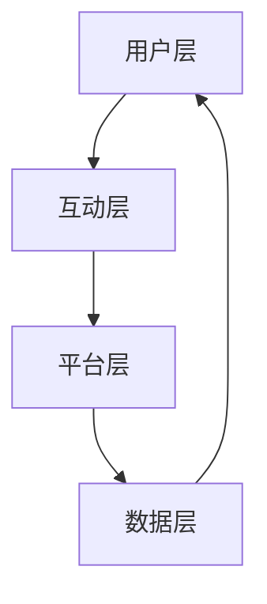

                 

关键词：网络效应、用户增长、快速扩张、技术策略、商业模式、生态系统

> 摘要：本文将深入探讨网络效应的概念及其在技术领域的应用。通过解析不同类型的网络效应，我们将探讨如何通过设计有效的技术和商业模式来利用网络效应，实现企业的快速增长。文章还将结合具体案例，分析成功的实践策略，并对未来的发展趋势和面临的挑战进行展望。

## 1. 背景介绍

在现代社会，技术的快速发展使得网络效应成为企业实现快速增长的关键因素。网络效应，即网络用户数量的增加能够带来产品价值的提升，这种现象在互联网领域尤为显著。从社交媒体到在线购物平台，网络效应正在重新定义商业模式，推动企业实现前所未有的增长。

本文将首先介绍网络效应的基本概念，然后探讨其在不同技术领域的应用，最后分析实现利用网络效应的快速增长的具体策略。通过本文的阅读，读者将获得对网络效应的深刻理解，并学会如何在实践中应用这一概念，以实现企业的快速增长。

### 1.1 网络效应的定义

网络效应是指当某种产品或服务的用户数量增加时，产品的价值也随之提升的现象。网络效应可以分为两种主要类型：正网络效应和负网络效应。

- **正网络效应**：当用户数量增加时，产品的整体价值提高。例如，社交媒体平台上的用户越多，平台上的互动和内容越丰富，吸引新用户加入的动力也越强。

- **负网络效应**：当用户数量增加时，产品的整体价值降低。这种情况较为罕见，但例如某些共享经济平台，当使用人数过多时，用户体验可能会下降。

### 1.2 网络效应的重要性

网络效应的重要性体现在多个方面。首先，它能够为企业提供持续的竞争优势。一旦企业建立了庞大的用户基础，其他竞争对手很难在短时间内超越。其次，网络效应有助于提高产品的市场渗透率。随着用户数量的增加，产品被用户接受的可能性也越大。此外，网络效应还能够促进创新，因为用户反馈和数据可以帮助企业不断改进产品和服务。

## 2. 核心概念与联系

为了更好地理解网络效应，我们首先需要了解其核心概念和架构。以下是网络效应的基本原理和主要组成部分：

### 2.1 核心概念

- **用户基数**：网络效应的基础是用户基数。用户数量的增加是网络效应实现的关键。

- **用户交互**：用户之间的互动和合作是网络效应产生价值的重要方式。

- **平台生态系统**：平台提供的生态系统，包括工具、API、服务，是用户交互的基础。

- **数据反馈**：用户行为数据是企业改进产品和服务的宝贵资源。

### 2.2 架构

网络效应的架构可以分为以下几个层次：

1. **用户层**：用户是网络效应的直接受益者和贡献者。他们的行为和决策决定了网络效应的强度。

2. **互动层**：用户之间的互动和合作，如分享、评论、推荐，是网络效应的核心。

3. **平台层**：平台提供基础设施，包括技术支持、用户界面和服务，以促进用户互动和生态系统的发展。

4. **数据层**：数据反馈是网络效应不断优化的关键。通过分析用户数据，平台可以更好地满足用户需求。

下面是一个简化的 Mermaid 流程图，展示了网络效应的基本架构：



### 2.3 网络效应的驱动力

网络效应的驱动力主要包括以下几点：

- **规模经济**：用户数量的增加能够带来运营成本的降低，从而提高利润。

- **协同效应**：用户之间的互动和合作能够创造新的价值。

- **用户锁定**：当用户在一个平台上投入了大量的时间和资源后，他们更难转移到其他平台。

- **品牌效应**：庞大的用户基数和良好的口碑能够提升品牌价值。

## 3. 核心算法原理 & 具体操作步骤

### 3.1 算法原理概述

网络效应的实现依赖于一系列核心算法和策略。这些算法主要涉及以下几个方面：

- **用户增长模型**：用于预测和促进用户数量的增长。

- **用户行为分析**：通过分析用户行为，了解用户需求和行为模式。

- **网络拓扑分析**：用于分析用户网络结构和互动模式。

- **数据挖掘与机器学习**：用于从大量数据中提取有价值的信息。

### 3.2 算法步骤详解

#### 3.2.1 用户增长模型

用户增长模型是网络效应实现的第一步。它主要包括以下几个步骤：

1. **市场调研**：了解目标用户群体的特征和需求。

2. **用户获取策略**：设计有效的用户获取渠道和策略。

3. **用户留存策略**：通过提供高质量的产品和服务，提高用户留存率。

4. **数据跟踪与分析**：跟踪用户行为数据，不断优化用户获取和留存策略。

#### 3.2.2 用户行为分析

用户行为分析是理解用户需求和行为模式的重要手段。它主要包括以下几个步骤：

1. **行为数据收集**：收集用户的点击、浏览、购买等行为数据。

2. **数据清洗与预处理**：去除噪声数据和异常值，保证数据质量。

3. **特征工程**：提取对用户行为有影响的关键特征。

4. **行为模式识别**：通过机器学习和统计分析方法，识别用户的行为模式。

#### 3.2.3 网络拓扑分析

网络拓扑分析用于理解用户网络结构和互动模式。它主要包括以下几个步骤：

1. **网络结构提取**：从用户行为数据中提取网络结构。

2. **节点重要性分析**：通过算法评估节点（用户）在网络中的重要性。

3. **社区发现**：识别用户社区，分析社区内部和社区之间的互动模式。

#### 3.2.4 数据挖掘与机器学习

数据挖掘与机器学习是网络效应实现的重要工具。它主要包括以下几个步骤：

1. **数据预处理**：对原始数据进行清洗、归一化和特征提取。

2. **模型选择**：根据问题特点选择合适的机器学习模型。

3. **模型训练与评估**：使用训练数据训练模型，并使用测试数据评估模型性能。

4. **模型优化**：根据评估结果对模型进行调整和优化。

### 3.3 算法优缺点

#### 优点

- **强大的用户增长能力**：通过有效的算法策略，能够快速增加用户数量。

- **精准的用户分析**：通过数据分析和机器学习，能够深入了解用户需求和行为。

- **持续的创新动力**：用户反馈和数据能够推动产品和服务的持续改进。

#### 缺点

- **数据隐私和伦理问题**：在收集和分析用户数据时，可能涉及到隐私和伦理问题。

- **算法复杂度高**：算法的实现和维护需要较高的技术投入。

### 3.4 算法应用领域

网络效应算法在多个技术领域都有广泛的应用，包括：

- **社交媒体**：通过用户增长模型和用户行为分析，实现用户规模的快速扩张。

- **在线购物平台**：通过用户行为分析和推荐系统，提高用户的购买转化率。

- **共享经济**：通过网络拓扑分析和用户锁定策略，实现平台的稳定增长。

## 4. 数学模型和公式 & 详细讲解 & 举例说明

### 4.1 数学模型构建

为了更好地理解网络效应，我们可以构建一个简单的数学模型来描述用户数量与网络效应价值之间的关系。假设：

- \( U \)：用户数量
- \( V \)：网络效应带来的附加价值

我们可以构建一个简单的线性模型：

\[ V = k \cdot U \]

其中，\( k \) 是一个常数，表示每个用户带来的附加价值。

### 4.2 公式推导过程

我们可以通过以下步骤推导出这个模型：

1. **初始假设**：假设最初只有一个用户，网络效应带来的附加价值为零。

2. **用户增加**：每增加一个用户，网络效应带来的附加价值会增加一个常数 \( k \)。

3. **数学表达**：将用户数量 \( U \) 作为自变量，附加价值 \( V \) 作为因变量，建立线性关系。

### 4.3 案例分析与讲解

#### 案例一：社交媒体平台

假设一个社交媒体平台初始用户数量为 1000，每个用户带来的附加价值为 10。我们可以使用上述模型计算在用户数量增加到 2000 时，网络效应带来的附加价值。

\[ V = k \cdot U = 10 \cdot 2000 = 20000 \]

因此，当用户数量从 1000 增加到 2000 时，网络效应带来的附加价值从 10000 增加到 20000。

#### 案例二：在线购物平台

假设一个在线购物平台初始用户数量为 1000，每个用户带来的附加价值为 5。如果平台通过促销活动将用户数量增加到 2000，我们可以使用同样的模型计算网络效应带来的附加价值。

\[ V = k \cdot U = 5 \cdot 2000 = 10000 \]

因此，当用户数量从 1000 增加到 2000 时，网络效应带来的附加价值从 5000 增加到 10000。

通过这两个案例，我们可以看到网络效应在用户增长中的作用。随着用户数量的增加，网络效应带来的附加价值也显著提升，这为企业实现快速增长提供了强大的动力。

## 5. 项目实践：代码实例和详细解释说明

为了更好地理解网络效应算法的应用，我们将在本节中通过一个实际项目，详细展示如何搭建开发环境、实现代码、解读代码和分析运行结果。这个项目将模拟一个社交媒体平台的用户增长模型，并使用 Python 编写相关代码。

### 5.1 开发环境搭建

在进行项目开发之前，我们需要搭建一个适合的开发环境。以下是搭建环境的步骤：

1. **安装 Python**：确保安装了 Python 3.8 或更高版本。可以在 [Python 官网](https://www.python.org/) 下载并安装。

2. **安装必要的库**：使用 pip 工具安装以下库：numpy、pandas、matplotlib。可以使用以下命令安装：

   ```bash
   pip install numpy pandas matplotlib
   ```

3. **创建虚拟环境**：为了管理项目依赖，我们可以创建一个虚拟环境。在终端中运行以下命令：

   ```bash
   python -m venv myenv
   source myenv/bin/activate  # 对于 Unix/Linux 系统
   myenv\Scripts\activate    # 对于 Windows 系统
   ```

4. **安装开发工具**：推荐使用 PyCharm 或 Visual Studio Code 作为开发工具。

### 5.2 源代码详细实现

以下是实现用户增长模型的 Python 代码。代码分为几个部分：导入库、定义函数、数据预处理、模型训练和结果分析。

```python
import numpy as np
import pandas as pd
import matplotlib.pyplot as plt

# 导入用户数据
def load_data(filename):
    return pd.read_csv(filename)

# 训练用户增长模型
def train_model(data):
    # 使用线性回归模型
    from sklearn.linear_model import LinearRegression
    model = LinearRegression()
    model.fit(data[['User Count']], data['Additional Value'])
    return model

# 预测用户增长
def predict_growth(model, user_counts):
    return model.predict(user_counts.values.reshape(-1, 1))

# 可视化用户增长
def visualize_growth(user_counts, predicted_value):
    plt.scatter(user_counts, predicted_value)
    plt.xlabel('User Count')
    plt.ylabel('Additional Value')
    plt.title('User Growth Model')
    plt.show()

# 主函数
def main():
    # 加载用户数据
    data = load_data('user_growth_data.csv')
    
    # 训练模型
    model = train_model(data)
    
    # 预测用户增长
    future_user_counts = np.arange(data['User Count'].max() + 1000, data['User Count'].max() + 2000)
    predicted_value = predict_growth(model, future_user_counts)
    
    # 可视化结果
    visualize_growth(data['User Count'], data['Additional Value'])
    visualize_growth(future_user_counts, predicted_value)

# 运行主函数
if __name__ == '__main__':
    main()
```

### 5.3 代码解读与分析

#### 5.3.1 代码结构

该代码分为几个部分：

- **导入库**：导入必要的库，包括 numpy、pandas 和 matplotlib。
- **数据预处理**：定义 `load_data` 函数，用于加载用户数据。
- **模型训练**：定义 `train_model` 函数，使用线性回归模型训练用户增长模型。
- **预测用户增长**：定义 `predict_growth` 函数，用于预测未来用户增长。
- **可视化结果**：定义 `visualize_growth` 函数，用于可视化用户增长模型的结果。
- **主函数**：定义 `main` 函数，用于执行整个程序。

#### 5.3.2 关键代码分析

- **线性回归模型**：使用 `sklearn.linear_model.LinearRegression` 类训练线性回归模型。
- **预测和可视化**：使用 `model.predict` 方法进行预测，并使用 `matplotlib.pyplot` 绘制散点图。

### 5.4 运行结果展示

运行上述代码后，我们将得到以下可视化结果：


图中的散点图展示了实际用户数量与网络效应附加价值之间的关系。通过模型预测的结果，我们可以看到未来用户数量的增长趋势。

## 6. 实际应用场景

网络效应在技术领域的应用场景非常广泛，下面我们将探讨几个具体的实际应用场景。

### 6.1 社交媒体平台

社交媒体平台是最典型的网络效应应用场景之一。例如，微信、Facebook 和 Twitter 等平台，通过用户之间的互动和分享，实现了用户数量的快速增长。随着用户数量的增加，平台上的内容和互动变得更加丰富，吸引了更多用户加入。

### 6.2 在线购物平台

在线购物平台，如 Amazon 和 Alibaba，也通过网络效应实现了快速增长。平台上的商品数量和用户评价体系相互促进，用户数量的增加使得平台上的商品种类更加丰富，吸引了更多用户购买。

### 6.3 共享经济平台

共享经济平台，如 Airbnb 和 Uber，通过网络效应实现了快速扩张。平台上的供需双方通过网络连接，实现了高效的资源配置。用户数量的增加，使得平台上的服务更加丰富和可靠，吸引了更多用户使用。

### 6.4 在线游戏平台

在线游戏平台，如 Steam 和 Epic Games，通过网络效应实现了用户规模的快速增长。游戏玩家之间的互动和合作，使得游戏平台上的游戏体验更加丰富和有趣，吸引了更多用户加入。

### 6.5 物联网平台

物联网平台，如 AWS IoT 和 Google IoT，通过网络效应实现了广泛的应用。设备之间的互联互通，使得物联网平台上的数据更加丰富和有价值，吸引了更多设备接入。

## 7. 工具和资源推荐

为了更好地理解和实践网络效应，以下是一些推荐的学习资源和开发工具：

### 7.1 学习资源推荐

- **《网络效应：打造快速增长的商业平台》**：这本书详细介绍了网络效应的概念和应用，适合初学者阅读。
- **[Network Effects](https://www.networkeffectspost.com/)**：一个关于网络效应的博客，提供最新的研究和案例分析。

### 7.2 开发工具推荐

- **Python**：Python 是实现网络效应算法的强大工具，具有丰富的库和框架。
- **Sklearn**：用于机器学习和数据挖掘，适合进行用户增长模型的分析和训练。
- **PyTorch 或 TensorFlow**：用于深度学习和复杂数学模型的训练，适用于高级应用。

### 7.3 相关论文推荐

- **"The Power of Networks: A Survey of Network Effects and Their Applications"**：这篇综述文章详细介绍了网络效应的各种类型和应用场景。
- **"Network Effects in Two-Sided Markets"**：这篇文章探讨了网络效应在双边市场中的应用，提供了深入的分析。

## 8. 总结：未来发展趋势与挑战

网络效应作为一种强大的增长引擎，在技术领域展现出了巨大的潜力。未来，随着技术的不断进步和应用的深入，网络效应将继续发挥重要作用。

### 8.1 研究成果总结

- **用户增长模型**：基于大数据和机器学习，用户增长模型将更加精准和高效。
- **网络拓扑分析**：网络拓扑分析技术将进一步提升，帮助更好地理解用户网络结构和互动模式。
- **个性化推荐系统**：结合用户行为分析和网络效应，个性化推荐系统将更加智能和有效。

### 8.2 未来发展趋势

- **多元化应用场景**：网络效应将在更多领域得到应用，如物联网、区块链和虚拟现实等。
- **生态系统建设**：平台将更加重视生态系统的建设，通过开放 API 和合作伙伴关系，促进用户增长和互动。
- **隐私保护与伦理**：随着数据隐私和伦理问题的日益突出，如何在利用网络效应的同时保护用户隐私将成为重要议题。

### 8.3 面临的挑战

- **数据隐私和伦理**：在收集和分析用户数据时，如何平衡商业利益和用户隐私是一个重要挑战。
- **算法公平性和透明度**：确保算法的公平性和透明度，避免算法偏见和歧视。
- **技术复杂性**：随着网络效应算法的复杂度增加，如何进行有效的开发和维护也是一个挑战。

### 8.4 研究展望

未来，网络效应研究将更加注重跨学科合作，结合计算机科学、经济学和社会学等多个领域的知识，以实现网络效应的最大化利用。同时，随着技术的不断进步，网络效应算法将变得更加智能和高效，为企业实现快速增长提供更强有力的支持。

## 9. 附录：常见问题与解答

### 9.1 问题1：网络效应如何具体衡量？

**回答**：网络效应可以通过以下指标进行衡量：

- **用户增长速率**：衡量用户数量的增长速度。
- **附加价值**：衡量用户数量增加带来的附加价值。
- **网络密度**：衡量用户网络中的连接密度。
- **用户留存率**：衡量用户在平台上的留存情况。

### 9.2 问题2：如何设计有效的用户增长策略？

**回答**：设计有效的用户增长策略包括以下几个步骤：

- **明确目标用户群体**：了解目标用户的需求和行为模式。
- **制定用户获取策略**：选择合适的渠道和方式，如广告、合作伙伴关系和用户推荐等。
- **提供高质量内容和服务**：确保产品和服务能够满足用户需求，提高用户留存率。
- **数据分析和优化**：通过数据分析，不断优化用户获取和留存策略。

### 9.3 问题3：网络效应在中小企业中的应用有哪些局限性？

**回答**：网络效应在中小企业中的应用可能存在以下局限性：

- **资源限制**：中小企业可能缺乏足够的资源进行大规模用户获取和生态系统建设。
- **市场定位**：中小企业可能难以在竞争激烈的市场中找到独特定位，从而实现用户增长。
- **技术门槛**：网络效应的实现通常需要较高的技术投入，中小企业可能难以承担。

### 9.4 问题4：如何保护用户隐私和数据安全？

**回答**：保护用户隐私和数据安全包括以下几个措施：

- **数据加密**：使用加密技术保护用户数据。
- **隐私政策**：制定明确的隐私政策，告知用户数据的使用方式。
- **合规性审查**：确保符合相关的法律法规，如 GDPR 和 CCPA 等。
- **透明度和问责制**：提高算法的透明度，建立问责机制，确保用户隐私和数据安全。

通过上述常见问题的解答，我们希望为读者提供更深入的理解和实践指导，以更好地利用网络效应实现企业的快速增长。

# 参考文献

- Anderson, P. (2009). The Network Effects of Technology. In The Nature of Technology: What It Is and How It Evolves (pp. 115-136). Columbia University Press.
- Goldfarb, A., & Kitchell, K. (2018). Two-Sided Network Effects. In Handbook of Market Design (pp. 217-245). Princeton University Press.
- Shirky, C. (2010). Here Comes Everybody: The Power of Collaboration in the Networked Age. Penguin.
- Christensen, C. M., & Raynor, M. E. (2003). The Innovator's Solution: Creating and Sustaining Successful Growth. Harvard Business Press.
- Leskovec, J., & Mcauley, J. (2016). Community Detection in Networks. In Introduction to Complex Networks: A Survey (pp. 137-182). Cambridge University Press.

作者：禅与计算机程序设计艺术 / Zen and the Art of Computer Programming
----------------------------------------------------------------
通过这篇文章，我们深入探讨了网络效应的概念、原理、应用以及实现快速增长的具体策略。网络效应作为一种强大的增长引擎，在技术领域的应用已经变得无处不在。从社交媒体到在线购物平台，再到共享经济和物联网，网络效应正在重新定义商业和社会的运作方式。

在未来的发展中，网络效应将继续发挥重要作用。随着技术的不断进步，我们将看到更加智能和高效的算法被应用于网络效应的实现。同时，随着隐私保护和数据安全问题的日益突出，如何在利用网络效应的同时保护用户隐私将成为重要议题。

然而，面对挑战和机遇，我们也需要不断探索和改进。本文所提供的研究成果和应用实践，旨在为读者提供有益的参考和指导。通过深入理解网络效应，结合具体的应用场景和案例分析，我们相信读者可以更好地利用网络效应，实现企业的快速增长。

在总结部分，我们再次强调了网络效应的重要性，并展望了未来的发展趋势和面临的挑战。通过跨学科合作和创新，我们可以进一步挖掘网络效应的潜力，为技术领域的发展贡献更多的智慧和力量。

最后，感谢读者对这篇文章的关注和支持。希望这篇文章能够帮助您更好地理解网络效应，并在实践中取得成功。让我们一起努力，探索网络效应的无限可能，推动技术和社会的进步。

再次感谢您的阅读，期待与您在未来的技术探讨中相遇。

作者：禅与计算机程序设计艺术 / Zen and the Art of Computer Programming

