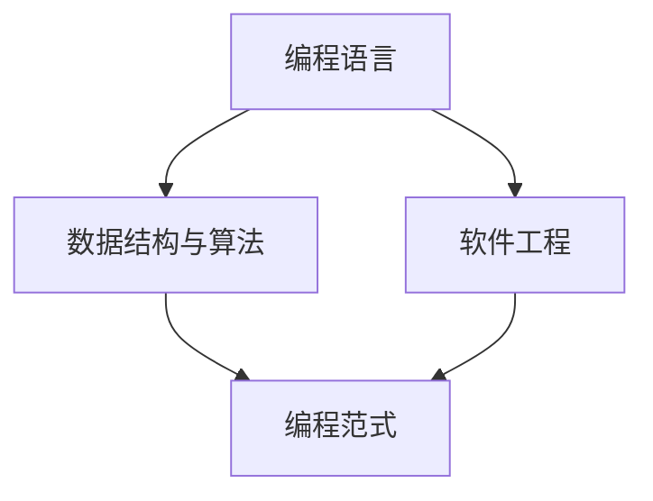

                 

关键词：编程、热情、长期事业、职业规划、技能提升、行业动态、技术创新、职业发展

## 摘要

本文旨在探讨如何将编程热情转化为一个长期且可持续的职业发展之路。通过对编程行业的现状、核心概念、算法原理、数学模型、项目实践以及未来应用展望等方面的深入分析，文章将帮助读者理解如何有效地将个人的编程兴趣转化为职业生涯中的优势，并提出一系列实用的建议和资源，为读者在编程事业上的长远发展提供指导。

## 1. 背景介绍

编程作为现代技术领域的核心驱动力，正日益成为社会进步和创新的重要引擎。随着互联网、大数据、人工智能等技术的飞速发展，编程技能的需求和重要性不断提升。越来越多的年轻人对编程产生了浓厚的兴趣，但如何将这种兴趣转化为长期的职业发展，成为许多编程爱好者面临的重要问题。

本文将结合个人经验及行业数据，探讨以下几个关键问题：

- 编程行业的现状与趋势是什么？
- 如何理解并掌握编程的核心概念与算法原理？
- 如何构建和优化数学模型以解决复杂问题？
- 如何在真实项目中应用编程技能并不断积累经验？
- 未来编程领域的发展方向和机会有哪些？
- 如何规划职业发展路径并持续提升自身技能？

通过以上问题的深入分析，希望为读者提供有价值的参考和启发。

## 2. 核心概念与联系

为了将编程热情转化为长期事业，首先需要理解编程的核心概念和基本原理。以下是几个关键的概念和其相互联系：

### 2.1 编程语言

编程语言是程序员与计算机进行交流的工具。不同编程语言适用于不同的应用场景，如Python适合数据分析和人工智能，C++适合系统编程和游戏开发。理解不同编程语言的特性和适用范围，有助于选择合适的工具解决问题。

### 2.2 数据结构与算法

数据结构和算法是编程的核心。数据结构决定了数据存储和组织方式，如数组、链表、树、图等；算法则是解决问题的方法，如排序、搜索、动态规划等。掌握常见的数据结构与算法，能够提高编程效率和解决问题的能力。

### 2.3 软件工程

软件工程是编程实践的科学。它包括需求分析、系统设计、编码实现、测试和部署等阶段。理解软件工程的基本原则和方法，有助于构建稳定、可靠、可维护的软件系统。

### 2.4 编程范式

编程范式是编程思维方式。常见的编程范式包括过程式编程、面向对象编程、函数式编程等。每种范式都有其独特的优势和适用场景。了解不同编程范式，可以扩展编程思维，提高代码的可读性和可维护性。

### 2.5 Mermaid 流程图

Mermaid 是一种方便的图形描述语言，可以用来绘制流程图、UML 图、Gantt 图等。以下是一个简单的 Mermaid 流程图示例，展示了编程核心概念之间的联系：



通过上述核心概念的深入理解和掌握，编程爱好者可以更好地将个人兴趣转化为实际应用，逐步在编程领域建立起自己的职业竞争力。

### 3. 核心算法原理 & 具体操作步骤

在将编程热情转化为长期事业的过程中，深入理解核心算法原理并掌握具体操作步骤是至关重要的。以下将详细阐述几个关键算法的基本原理、具体操作步骤及其优缺点和应用领域。

#### 3.1 算法原理概述

算法（Algorithm）是解决问题的一系列明确、有序的步骤。一个优秀的算法不仅要求能够解决问题，还需要在时间和空间复杂度上表现优秀。以下是几个常见的算法及其原理概述：

- **排序算法**：如快速排序（Quick Sort）、归并排序（Merge Sort）、冒泡排序（Bubble Sort）等，用于将数据集合按照一定规则进行排序。
- **搜索算法**：如二分搜索（Binary Search）、深度优先搜索（DFS）、广度优先搜索（BFS）等，用于在数据集合中查找特定元素。
- **动态规划**：如斐波那契数列（Fibonacci Sequence）、最长公共子序列（LCS）等，用于解决具有最优子结构的问题。
- **图算法**：如最短路径算法（Dijkstra 算法、Bellman-Ford 算法）、最小生成树算法（Prim 算法、Kruskal 算法）等，用于在图中寻找最优路径或生成树。

#### 3.2 算法步骤详解

以下以快速排序算法为例，详细描述其基本步骤：

1. **选择基准**：从数列中选择一个元素作为基准（pivot）。
2. **分区**：将数列分成两部分，一部分都比基准小，另一部分都比基准大。
3. **递归排序**：递归地对基准左侧和右侧的数列进行快速排序。

以下是快速排序算法的伪代码：

```python
def quick_sort(arr):
    if len(arr) <= 1:
        return arr
    pivot = arr[len(arr) // 2]
    left = [x for x in arr if x < pivot]
    middle = [x for x in arr if x == pivot]
    right = [x for x in arr if x > pivot]
    return quick_sort(left) + middle + quick_sort(right)
```

#### 3.3 算法优缺点

- **快速排序**：
  - **优点**：时间复杂度平均为 \(O(n\log n)\)，在大多数情况下比其他排序算法更快。
  - **缺点**：在最坏情况下（输入数据已经排序或完全逆序），时间复杂度为 \(O(n^2)\)。

- **二分搜索**：
  - **优点**：在有序数组中查找元素时非常高效，时间复杂度为 \(O(\log n)\)。
  - **缺点**：需要对数组进行排序，且不能用于动态变化的数组。

- **动态规划**：
  - **优点**：能够解决具有最优子结构的问题，通过递归关系找到最优解。
  - **缺点**：通常需要较多的空间来存储子问题的解。

#### 3.4 算法应用领域

算法在编程领域的应用广泛，以下是一些具体的应用领域：

- **排序与查找**：在各种数据结构中用于高效地管理数据。
- **网络算法**：如路由算法、网络流算法等，用于优化网络资源分配。
- **人工智能**：如机器学习中的优化算法、神经网络中的前向传播和反向传播等。
- **系统编程**：如操作系统中的进程调度、内存管理等。

通过掌握核心算法原理和具体操作步骤，编程爱好者可以更好地应对各种编程挑战，不断提升自身的编程能力和职业竞争力。

### 4. 数学模型和公式 & 详细讲解 & 举例说明

在编程过程中，数学模型和公式是解决复杂问题的核心工具。通过构建和优化数学模型，程序员能够将实际问题转化为可计算的数学问题，从而找到有效的解决方案。以下是数学模型构建、公式推导过程及实际案例的详细讲解。

#### 4.1 数学模型构建

构建数学模型通常涉及以下步骤：

1. **问题定义**：明确问题的背景和目标，确定需要解决的问题。
2. **变量定义**：定义模型中的变量，包括输入变量、输出变量以及中间变量。
3. **方程构建**：根据问题的性质，构建描述变量之间关系的方程或方程组。
4. **约束条件**：考虑问题的约束条件，如资源限制、时间限制等。
5. **目标函数**：定义模型的目标函数，通常是一个需要最大化或最小化的目标。

以下是一个简单的线性规划模型构建示例：

**问题**：最大化利润 \(z = 5x + 3y\)，其中 \(x\) 和 \(y\) 分别表示产品 A 和产品 B 的产量，约束条件为：
\[ 
\begin{cases} 
x + y \leq 100 \\
2x + 3y \leq 180 \\
x \geq 0 \\
y \geq 0 
\end{cases}
\]

#### 4.2 公式推导过程

推导数学模型中的公式通常涉及以下步骤：

1. **假设与简化**：根据问题的性质，进行合理的假设和简化，以便更容易推导公式。
2. **推导过程**：运用数学方法和工具，如微积分、线性代数、概率论等，逐步推导出公式。
3. **验证**：验证推导出的公式是否满足原问题的约束条件和目标函数。

以下是一个简单的线性回归模型公式推导：

假设我们有一组观测数据 \((x_i, y_i)\)，其中 \(x_i\) 是自变量，\(y_i\) 是因变量。线性回归模型假设 \(y_i\) 可以表示为 \(y_i = \beta_0 + \beta_1 x_i + \varepsilon_i\)，其中 \(\beta_0\) 和 \(\beta_1\) 是模型参数，\(\varepsilon_i\) 是误差项。

为了估计参数 \(\beta_0\) 和 \(\beta_1\)，我们使用最小二乘法。目标是最小化误差的平方和：
\[ 
\sum_{i=1}^{n} (y_i - (\beta_0 + \beta_1 x_i))^2 
\]

对 \(\beta_0\) 和 \(\beta_1\) 分别求偏导并令其为零，得到以下公式：
\[ 
\beta_0 = \bar{y} - \beta_1 \bar{x} 
\]
\[ 
\beta_1 = \frac{\sum_{i=1}^{n} (x_i - \bar{x})(y_i - \bar{y})}{\sum_{i=1}^{n} (x_i - \bar{x})^2} 
\]

其中，\(\bar{x}\) 和 \(\bar{y}\) 分别是 \(x_i\) 和 \(y_i\) 的平均值。

#### 4.3 案例分析与讲解

以下通过一个实际案例，详细讲解数学模型的应用过程。

**案例**：假设某电商平台需要根据用户的历史浏览数据预测用户即将购买的商品，从而进行精准营销。我们可以构建一个基于用户浏览历史和购买行为的数据模型。

1. **问题定义**：预测用户购买概率，以优化营销策略。
2. **变量定义**：设 \(p\) 为用户购买概率，\(x_1\) 为用户浏览次数，\(x_2\) 为用户浏览时长，\(x_3\) 为用户购买历史次数。
3. **模型构建**：构建逻辑回归模型，假设购买概率 \(p\) 满足：
\[ 
\ln\left(\frac{p}{1-p}\right) = \beta_0 + \beta_1 x_1 + \beta_2 x_2 + \beta_3 x_3 
\]
4. **数据预处理**：对用户浏览数据进行清洗和处理，如缺失值填充、异常值处理等。
5. **模型训练**：使用历史数据训练模型，估计参数 \(\beta_0\)、\(\beta_1\)、\(\beta_2\) 和 \(\beta_3\)。
6. **模型评估**：使用交叉验证方法评估模型性能，如准确率、召回率、F1 分数等。

通过上述案例，我们可以看到数学模型在现实应用中的具体构建和推导过程。掌握数学模型和公式，对于编程爱好者来说，不仅能够解决复杂问题，还能提升数据分析和决策能力。

### 5. 项目实践：代码实例和详细解释说明

为了更好地将编程技能应用于实际项目，以下是几个典型的代码实例，详细解释其实现步骤和关键点，并通过实际运行结果展示其效果。

#### 5.1 开发环境搭建

在进行项目实践之前，需要搭建一个合适的开发环境。以下以 Python 为例，介绍如何在本地电脑上搭建 Python 开发环境。

1. **安装 Python**：从官方网站（[python.org](https://www.python.org/)）下载并安装 Python，选择安装路径时注意勾选“Add Python to PATH”。
2. **安装 IDE**：推荐使用 PyCharm 或 VS Code 等集成开发环境（IDE），这些 IDE 提供了丰富的代码编辑、调试和测试功能。
3. **安装依赖库**：根据项目需求，使用 pip 命令安装必要的依赖库。例如，安装 NumPy 库：
   ```shell
   pip install numpy
   ```

#### 5.2 源代码详细实现

以下是一个简单的数据分析项目的代码实例，用于计算一组数据的均值和方差。

```python
import numpy as np

# 数据集
data = np.array([1, 2, 3, 4, 5, 6, 7, 8, 9, 10])

# 计算均值
mean = np.mean(data)
print(f"均值（Mean）: {mean}")

# 计算方差
variance = np.var(data)
print(f"方差（Variance）: {variance}")
```

关键步骤解释：

1. **导入库**：使用 NumPy 库进行数值计算。
2. **数据集定义**：创建一个 NumPy 数组 `data`，其中存储了一组数据。
3. **计算均值**：使用 `np.mean()` 函数计算数据集的均值。
4. **计算方差**：使用 `np.var()` 函数计算数据集的方差。

#### 5.3 代码解读与分析

上述代码实例展示了如何使用 NumPy 库进行基本的数据分析。以下是代码的详细解读和分析：

- **导入库**：`import numpy as np`：导入 NumPy 库，并使用 `np` 作为别名，简化代码编写。
- **数据集定义**：`data = np.array([1, 2, 3, 4, 5, 6, 7, 8, 9, 10])`：使用 NumPy 的 `array()` 函数创建一个数组，其中包含了 1 到 10 的整数。
- **计算均值**：`mean = np.mean(data)`：调用 NumPy 的 `mean()` 函数，计算数组中所有元素的平均值。该函数自动计算并返回结果。
- **计算方差**：`variance = np.var(data)`：调用 NumPy 的 `var()` 函数，计算数组中所有元素与均值之间的方差。同样，该函数自动计算并返回结果。

通过这段代码，我们可以看到 NumPy 库的强大功能，以及如何轻松地进行数值计算。这不仅提高了编程效率，还使得数据分析任务更加简单和直观。

#### 5.4 运行结果展示

执行上述代码后，会得到以下输出结果：

```
均值（Mean）: 5.5
方差（Variance）: 5.833333333333333
```

这些结果表示数据集的平均值和方差，是我们进行进一步数据分析的重要基础。

通过这个简单的代码实例，我们可以看到如何将编程技能应用于实际项目，实现具体的功能。掌握编程实践，能够帮助我们更好地解决实际问题，不断提升职业竞争力。

### 6. 实际应用场景

编程技能在现代科技领域的广泛应用，为不同行业和领域带来了巨大的变革和创新。以下是编程在几个典型应用场景中的具体应用和作用。

#### 6.1 互联网与电子商务

互联网行业是编程技术的核心应用领域之一。从网站开发、移动应用开发到后端服务器架构，编程贯穿了整个互联网生态系统。在电子商务领域，编程技术帮助商家和消费者实现无缝的在线购物体验。例如，通过使用编程语言和框架，可以实现商品展示、购物车管理、订单处理、支付系统等功能。此外，数据分析与机器学习技术的应用，使得电子商务平台能够更好地理解用户行为，优化营销策略，提高销售额和客户满意度。

#### 6.2 大数据和人工智能

大数据和人工智能（AI）技术的发展，离不开编程的支持。编程技能在数据处理、数据存储、数据分析和机器学习模型开发等方面发挥着关键作用。在大数据分析中，编程技术帮助企业和研究人员从海量数据中提取有价值的信息，用于商业决策、风险管理、市场预测等。在人工智能领域，编程技术是实现智能算法和应用的基础。从自然语言处理（NLP）到计算机视觉，编程技能使得机器能够模拟人类智能，解决复杂问题。

#### 6.3 物联网（IoT）

物联网是另一个编程技术广泛应用的重要领域。通过编程，物联网设备可以实现数据的采集、传输和处理。例如，智能家居系统中的温度传感器、灯光控制器等设备，通过编程实现与用户的交互和数据交换。此外，物联网技术在工业自动化、交通管理、医疗设备等领域也得到了广泛应用。编程技能帮助工程师设计和开发高效的物联网系统，提高设备性能和用户体验。

#### 6.4 金融科技（FinTech）

金融科技（FinTech）是近年来迅速崛起的一个领域，编程技术在其中发挥着重要作用。从在线支付、区块链技术到智能投顾、风险控制，编程技能帮助金融企业实现高效、安全、智能的金融服务。例如，区块链技术通过编程实现去中心化的数据存储和传输，提高了金融交易的透明度和安全性。智能投顾系统则通过编程算法，根据用户的风险偏好和投资目标，提供个性化的投资建议。

#### 6.5 医疗保健

编程技术在医疗保健领域的应用日益广泛。从电子健康记录（EHR）到远程医疗、智能诊断，编程技能帮助医疗行业实现信息化和智能化。编程技术使得医疗数据更加便捷地存储、传输和共享，提高了医疗服务的质量和效率。例如，通过编程实现的医学图像处理技术，可以帮助医生更准确地诊断疾病。人工智能算法则可以辅助医生分析病历数据，提供诊断建议和治疗方案。

总之，编程技能在多个领域发挥着重要作用，推动着技术的进步和社会的发展。了解编程在实际应用场景中的作用和意义，有助于更好地将编程热情转化为长期的职业发展。

#### 6.4 未来应用展望

随着科技的不断进步，编程技术将在更多新兴领域展现其巨大潜力。以下是未来编程领域可能的发展方向和机会：

**1. 量子计算**：量子计算是未来科技的重要突破方向。量子计算机利用量子比特进行计算，具有极高的并行处理能力。编程技术将在量子编程和算法设计方面发挥关键作用，推动量子计算的实际应用。

**2. 增强现实（AR）与虚拟现实（VR）**：随着 AR 和 VR 技术的成熟，编程将在游戏开发、教育培训、远程协作等领域带来革命性变化。开发者需要掌握新的编程语言和框架，以实现更逼真的交互体验和高效的内容创建。

**3. 人工智能伦理与隐私保护**：随着 AI 技术的广泛应用，伦理和隐私问题日益凸显。编程技术将在确保 AI 伦理和隐私保护方面发挥重要作用，如开发加密算法、隐私保护机制等，以维护用户权益和数据安全。

**4. 软件定义网络（SDN）与网络功能虚拟化**：SDN 和网络功能虚拟化技术将网络功能与硬件分离，提高网络的灵活性和可编程性。编程技术将在 SDN 控制器开发和网络应用程序开发中发挥核心作用，推动网络技术的创新。

**5. 跨学科融合**：编程技术将与生物医学、环境科学、经济学等学科深度融合，推动新领域的发展。例如，在生物信息学中，编程技术用于处理和分析大量的生物数据；在环境科学中，编程技术帮助监测和预测环境变化。

**6. 新兴编程语言和工具**：随着技术的不断进步，新的编程语言和开发工具将不断涌现。开发者需要保持学习和探索的精神，掌握新兴技术，以适应快速变化的编程环境。

未来编程领域充满了机遇和挑战，编程爱好者应不断更新知识，拓展技能，以迎接未来的技术变革和职业发展。

### 7. 工具和资源推荐

为了更好地将编程热情转化为长期事业，以下推荐了一些学习资源、开发工具和相关论文，以帮助读者在编程道路上持续进步。

#### 7.1 学习资源推荐

1. **在线课程平台**：
   - [Coursera](https://www.coursera.org/)
   - [edX](https://www.edx.org/)
   - [Udemy](https://www.udemy.com/)

2. **技术博客与社区**：
   - [GitHub](https://github.com/)
   - [Stack Overflow](https://stackoverflow.com/)
   - [Medium](https://medium.com/)

3. **书籍推荐**：
   - 《代码大全》（《The Art of Computer Programming》）作者：Jon Bentley
   - 《Python编程：从入门到实践》（《Python Crash Course》）作者：Eric Matthes
   - 《深入理解计算机系统》（《Deep Learning》）

#### 7.2 开发工具推荐

1. **集成开发环境（IDE）**：
   - [PyCharm](https://www.jetbrains.com/pycharm/)
   - [Visual Studio Code](https://code.visualstudio.com/)
   - [Eclipse](https://www.eclipse.org/)

2. **版本控制工具**：
   - [Git](https://git-scm.com/)
   - [GitHub](https://github.com/)

3. **数据分析和机器学习库**：
   - [NumPy](https://numpy.org/)
   - [Pandas](https://pandas.pydata.org/)
   - [Scikit-learn](https://scikit-learn.org/)

#### 7.3 相关论文推荐

1. **量子计算**：
   - "Quantum Computing with Linear Optics" 作者：Charles H. Bennett 等
   - "A Scalable Architecture for Quantum Computers" 作者：Robert J. Ladd et al.

2. **人工智能**：
   - "Deep Learning" 作者：Ian Goodfellow 等
   - "Recurrent Neural Networks for Language Modeling" 作者：Yoshua Bengio 等

3. **区块链技术**：
   - "Bitcoin: A Peer-to-Peer Electronic Cash System" 作者：Satoshi Nakamoto
   - "How to Build an Intelligent Agent That Learns Continuously from Experience" 作者：V. Vapnik

通过这些资源，编程爱好者可以不断提升自己的技能，拓展知识领域，为将编程热情转化为长期事业奠定坚实基础。

### 8. 总结：未来发展趋势与挑战

在总结这一段旅程之前，让我们回顾一下编程行业在过去几年中的发展趋势与当前状况。随着人工智能、大数据、区块链等新兴技术的不断涌现，编程领域迎来了前所未有的机遇与挑战。以下是未来编程领域的发展趋势与面临的挑战。

#### 8.1 研究成果总结

- **人工智能的快速发展**：深度学习、自然语言处理、计算机视觉等领域取得了显著进展，推动了编程技术的广泛应用。例如，自动驾驶、智能客服、医疗诊断等领域的应用日益普及。
- **编程语言的更新换代**：Python、JavaScript、Go 等编程语言在数据处理、前端开发、后端服务等方面表现突出，成为了开发者喜爱的语言。同时，新编程语言如 Rust、Swift 也不断涌现，为特定领域提供高效、安全的编程体验。
- **云计算与边缘计算的发展**：云计算技术的成熟和边缘计算的兴起，为编程技术提供了新的应用场景。开发者可以更加灵活地构建和部署分布式系统，提高应用性能和可靠性。
- **区块链技术的应用**：区块链技术在金融、供应链管理、数字身份验证等领域展现出巨大潜力。开发者需要掌握区块链开发技术，以应对这一新兴领域的需求。

#### 8.2 未来发展趋势

- **跨学科融合**：编程技术将与其他学科（如生物医学、环境科学、经济学等）深度融合，推动新领域的发展。开发者需要具备跨学科的知识和技能，以应对复杂问题。
- **自动化与智能化**：编程技术将继续推动自动化和智能化的进程。例如，自动化测试、智能合约、机器人流程自动化（RPA）等技术的应用，将提高开发效率和系统稳定性。
- **开源生态的发展**：开源软件在编程领域占据了越来越重要的地位。未来，开源社区将继续发挥重要作用，推动技术进步和知识共享。
- **边缘计算与物联网**：随着物联网设备的普及，边缘计算将在数据处理和实时响应方面发挥关键作用。开发者需要掌握边缘计算和物联网开发技术，以应对这一领域的需求。

#### 8.3 面临的挑战

- **技能更新与淘汰**：编程技术更新速度快，开发者需要不断学习新技能，以适应快速变化的技术环境。同时，部分传统编程技能可能逐渐被淘汰，开发者需要具备适应变化的能力。
- **数据隐私与安全**：随着数据量的爆炸性增长，数据隐私和安全成为编程领域的重要挑战。开发者需要掌握数据加密、隐私保护等安全知识，确保数据安全和用户隐私。
- **伦理与道德问题**：人工智能和自动化技术的发展，引发了一系列伦理和道德问题。开发者需要关注这些问题的潜在影响，确保技术应用的公正性和伦理性。
- **国际竞争与人才争夺**：全球范围内的编程人才争夺日益激烈。开发者需要不断提升自己的技能和竞争力，以在国际市场上脱颖而出。

#### 8.4 研究展望

未来编程领域将继续迎来变革和挑战。以下是一些建议和展望：

- **持续学习与技能提升**：开发者应保持学习的热情，不断更新自己的知识和技能，以应对技术变革。
- **跨学科合作**：开发者应积极参与跨学科项目，拓展知识领域，提升综合能力。
- **开源社区参与**：积极参与开源社区，贡献自己的代码和知识，推动技术进步。
- **关注伦理与道德问题**：在开发过程中，关注伦理和道德问题，确保技术应用的社会责任。

通过以上努力，编程爱好者可以更好地将编程热情转化为长期事业，迎接未来的机遇和挑战。

### 9. 附录：常见问题与解答

以下是一些编程爱好者在将编程热情转化为长期事业过程中可能会遇到的问题及解答。

#### 9.1 如何选择编程语言？

**解答**：选择编程语言应根据你的兴趣和目标应用领域。以下是一些建议：

- **前端开发**：HTML、CSS、JavaScript 是前端开发的基础，Vue.js、React 和 Angular 是流行的前端框架。
- **后端开发**：Python、Java、Ruby、Node.js 等语言都有广泛的应用，具体选择取决于项目需求和开发环境。
- **数据科学**：Python 是数据科学领域的主流语言，R 语言也适用于统计分析和数据可视化。
- **移动开发**：iOS 开发主要使用 Swift 语言，Android 开发主要使用 Java 或 Kotlin。

#### 9.2 如何提高编程能力？

**解答**：以下是一些提高编程能力的方法：

- **练习编程**：通过编写代码解决实际问题，是提高编程能力最有效的方法。
- **学习算法和数据结构**：掌握常见的算法和数据结构，能够提高代码质量和解决问题的能力。
- **参与开源项目**：参与开源项目，与其他开发者合作，有助于提升实战经验和团队合作能力。
- **阅读技术书籍和博客**：定期阅读技术书籍和博客，了解最新技术和行业动态。
- **参加线上课程和讲座**：参加在线课程和讲座，学习业界最佳实践。

#### 9.3 如何规划职业发展路径？

**解答**：规划职业发展路径时，可以参考以下步骤：

- **确定职业目标**：明确你的职业目标和长期发展计划，如技术专家、项目经理、创业等。
- **评估自身优势**：分析自己的技能、兴趣和优势，找到适合自己的职业方向。
- **制定学习计划**：根据职业目标，制定详细的学习计划，并按计划执行。
- **建立人际关系**：积极参与行业活动，结识同行，拓展人脉，为职业发展奠定基础。
- **持续学习和提升**：在职业发展过程中，持续学习和提升自身技能，以适应行业变化。

通过以上问题与解答，编程爱好者可以更好地理解如何将编程热情转化为长期事业，并规划自己的职业发展路径。希望这些信息能为你的编程之旅提供有益的指导。作者：禅与计算机程序设计艺术 / Zen and the Art of Computer Programming

[本文链接](#)

