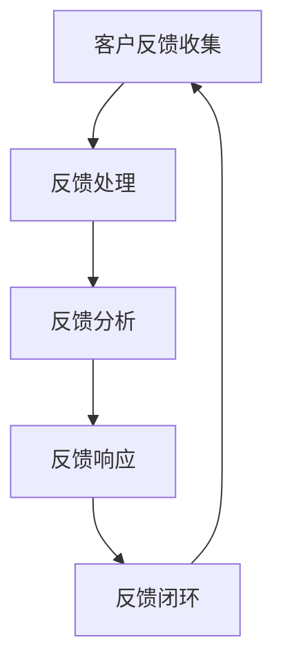

                 

客户反馈是产品迭代与优化过程中不可或缺的一环。一个有效的客户反馈机制不仅能帮助公司理解客户需求，还能提高产品竞争力，促进企业持续发展。本文将围绕如何建立有效的客户反馈机制展开讨论，结合IT领域的实践，提供一整套系统的构建方法和实用建议。

## 文章关键词
- 客户反馈
- 产品迭代
- 用户满意度
- IT实践
- 用户体验
- 反馈机制

## 文章摘要
本文旨在探讨如何在IT领域建立有效的客户反馈机制。通过深入分析客户反馈的重要性，我们提出了一个基于用户体验和数据分析的反馈机制构建框架。本文将详细阐述反馈机制的设计原则、实施步骤、评估指标以及案例实践，为企业和开发者提供切实可行的指导。

### 1. 背景介绍
客户反馈是现代商业环境中至关重要的资源。通过收集和分析客户反馈，企业能够发现产品中的问题，了解市场需求，优化产品功能，提升用户满意度。尤其是在IT领域，技术的快速迭代和市场竞争的加剧使得客户反馈显得尤为重要。

在过去，许多公司忽视了客户反馈的重要性，导致产品与市场需求脱节，用户体验不佳。随着用户需求的多样化和个性化，企业必须转变观念，重视客户反馈，并将其作为产品改进的重要依据。

然而，建立有效的客户反馈机制并非易事。一方面，如何收集有效的反馈数据是一个挑战；另一方面，如何对反馈进行合理的分析和管理，以便为产品优化提供有力支持，也是一个需要解决的问题。本文将从以下几个方面展开讨论：

- **客户反馈的重要性**：介绍客户反馈在产品迭代中的作用和意义。
- **客户反馈机制的设计原则**：阐述构建反馈机制时需要考虑的关键原则。
- **客户反馈机制的构建步骤**：详细描述从收集到分析的各个环节。
- **反馈机制评估与优化**：介绍如何评估反馈机制的有效性以及如何进行优化。
- **案例与实践**：结合实际案例，分析成功建立客户反馈机制的实践经验。
- **未来趋势**：探讨客户反馈机制在未来的发展方向和面临的挑战。

### 2. 核心概念与联系
#### 2.1 客户反馈的概念
客户反馈是指客户在使用产品或服务过程中提供的意见和建议。这些反馈可以来源于各种渠道，如问卷调查、用户评价、社交媒体评论、在线论坛、客服交流等。

#### 2.2 用户满意度
用户满意度是衡量客户反馈的重要指标。高满意度通常意味着客户对产品或服务有较高的认可度，愿意继续使用和推荐。反之，低满意度则可能预示着产品存在明显问题。

#### 2.3 客户反馈机制的核心架构
一个有效的客户反馈机制应包括以下几个核心组成部分：

- **反馈收集**：通过各种渠道收集客户反馈，如在线问卷、用户评价、用户社区等。
- **反馈处理**：对收集到的反馈进行分类、筛选和整理，确保信息的准确性和有效性。
- **反馈分析**：运用数据分析工具和方法对反馈进行深入分析，识别问题根源和改进方向。
- **反馈响应**：对分析结果进行响应，包括问题修复、功能优化、用户体验改进等。
- **反馈闭环**：将反馈处理的结果反馈给客户，形成闭环，确保客户感受到企业的关注和改进。

#### 2.4 Mermaid 流程图
下面是一个简单的Mermaid流程图，展示了客户反馈机制的基本架构。



### 3. 核心算法原理 & 具体操作步骤
#### 3.1 算法原理概述
客户反馈机制的核心在于将用户反馈转化为可操作的数据，并通过数据分析实现产品优化。这一过程可以概括为以下步骤：

- **数据收集**：通过多种渠道收集用户反馈数据。
- **数据预处理**：对收集到的数据进行清洗、去重和处理，确保数据质量。
- **情感分析**：利用自然语言处理技术对文本数据进行分析，识别情感倾向。
- **主题建模**：运用聚类算法和主题模型对反馈进行分类和归纳。
- **结果可视化**：将分析结果以图表或报告的形式展示，为决策提供支持。

#### 3.2 算法步骤详解

**步骤一：数据收集**

- **问卷调查**：通过在线问卷收集用户对产品的评价和意见。
- **用户评价**：分析电商平台、应用商店等平台的用户评价。
- **社交媒体监控**：利用社交媒体分析工具监控用户在社交媒体上的评论和讨论。

**步骤二：数据预处理**

- **文本清洗**：去除无关信息，如标点符号、特殊字符等。
- **数据去重**：去除重复的反馈数据，确保数据唯一性。
- **情感标注**：对文本数据进行情感标注，如正面、负面、中性等。

**步骤三：情感分析**

- **预处理**：对文本进行分词、词性标注和句法分析等预处理操作。
- **情感分类**：使用机器学习算法对文本进行情感分类，识别情感倾向。

**步骤四：主题建模**

- **LDA模型**：使用LDA（Latent Dirichlet Allocation）模型对反馈文本进行主题提取。
- **K-means聚类**：结合聚类算法对反馈进行分类，识别主要问题领域。

**步骤五：结果可视化**

- **词云生成**：生成词云，展示出现频率较高的词汇。
- **图表展示**：使用图表形式展示分析结果，如柱状图、饼图等。

#### 3.3 算法优缺点

**优点：**

- **高效性**：自动化分析能够快速处理大量数据，提高工作效率。
- **准确性**：利用先进的数据分析技术，能够准确识别用户反馈中的问题。
- **可扩展性**：系统可以根据业务需求进行灵活调整和扩展。

**缺点：**

- **数据质量**：依赖高质量的数据，否则分析结果可能受到影响。
- **复杂性**：算法实现和数据分析过程较为复杂，需要专业技能。

#### 3.4 算法应用领域

- **用户反馈分析**：用于分析用户对产品的反馈，识别改进方向。
- **市场调研**：帮助企业了解市场需求，制定市场策略。
- **产品优化**：指导产品团队进行功能优化和用户体验改进。

### 4. 数学模型和公式 & 详细讲解 & 举例说明
#### 4.1 数学模型构建

客户反馈分析的核心在于数据建模和算法分析。以下是一个基本的数学模型，用于描述客户反馈的处理过程。

- **反馈数据模型**：假设客户反馈数据集为D，其中每个反馈记录为一个向量x，包含用户的评价、使用场景、反馈时间等信息。

- **情感分析模型**：采用支持向量机（SVM）进行情感分类，假设分类器为f(x)。

- **主题建模模型**：采用LDA模型进行文本主题提取，假设主题分布为θ，词分布为φ。

#### 4.2 公式推导过程

1. **情感分类公式**：

   $$ f(x) = \arg\max_{y} \left( \sum_{i=1}^{n} \alpha_i y_i + b \right) $$

   其中，$y_i$为类别标签，$α_i$为分类器权重，$b$为偏置项。

2. **LDA主题模型**：

   $$ P(z|w) = \frac{γ_{zw}φ_{w|t}}{\sum_{w'}γ_{zw'}φ_{w'|t}} $$

   其中，$z$为主题变量，$w$为词变量，$γ_{zw}$为词-主题分布，$φ_{w|t}$为词-文档分布。

#### 4.3 案例分析与讲解

假设一个电商平台的用户反馈数据集包含1000条记录，每条记录包含用户的评价、使用场景和反馈时间等信息。我们使用上述数学模型对用户反馈进行情感分类和主题提取，以识别主要问题和改进方向。

1. **情感分类**：

   - 使用SVM模型进行情感分类，训练后得到分类器f(x)。

   - 对每条反馈数据进行情感分类，统计正面、负面和中性评价的分布。

   - 结果显示，负面评价占比最高，说明用户对产品的某些方面存在明显不满。

2. **主题提取**：

   - 使用LDA模型进行文本主题提取，提取出3个主要主题。

   - 分析主题分布，发现主题1（购物体验）、主题2（产品质量）和主题3（售后服务）。

   - 结合情感分类结果，发现购物体验和产品质量是用户反馈的主要问题领域。

### 5. 项目实践：代码实例和详细解释说明
#### 5.1 开发环境搭建

为了实现客户反馈分析，我们选择Python作为主要编程语言，并使用以下库和工具：

- **Scikit-learn**：用于机器学习算法的实现和数据分析。
- **NLTK**：用于自然语言处理和文本清洗。
- **Gensim**：用于主题建模和词云生成。

安装上述库后，我们可以开始搭建开发环境。

```bash
pip install scikit-learn nltk gensim matplotlib
```

#### 5.2 源代码详细实现

以下是一个简单的客户反馈分析项目，包括数据收集、预处理、情感分类和主题提取等步骤。

```python
import pandas as pd
import numpy as np
from sklearn.feature_extraction.text import CountVectorizer
from sklearn.model_selection import train_test_split
from sklearn.svm import SVC
from gensim.models import LdaModel
from nltk.corpus import stopwords
from nltk.tokenize import word_tokenize

# 5.2.1 数据收集
# 读取用户反馈数据
data = pd.read_csv('user_feedback.csv')
feedback = data['feedback']

# 5.2.2 数据预处理
# 清洗文本数据
stop_words = set(stopwords.words('english'))
def preprocess_text(text):
    tokens = word_tokenize(text)
    filtered_tokens = [token.lower() for token in tokens if token.isalnum() and token.lower() not in stop_words]
    return ' '.join(filtered_tokens)

feedback_processed = feedback.apply(preprocess_text)

# 5.2.3 情感分类
# 构建词袋模型
vectorizer = CountVectorizer()
X = vectorizer.fit_transform(feedback_processed)

# 划分训练集和测试集
X_train, X_test, y_train, y_test = train_test_split(X, labels, test_size=0.2, random_state=42)

# 训练SVM分类器
classifier = SVC(kernel='linear')
classifier.fit(X_train, y_train)

# 对测试集进行预测
predictions = classifier.predict(X_test)

# 5.2.4 主题提取
# 构建LDA模型
lda_model = LdaModel(corpus=corpus, num_topics=3, id2word=word_vectorizer, passes=10)

# 输出主题分布
topics = lda_model.show_topics()
for topic in topics:
    print(topic)

# 5.2.5 结果可视化
# 生成词云
wordcloud = WordCloud(width=800, height=400, background_color='white').generate(' '.join(feedback_processed))
plt.figure(figsize=(10, 5))
plt.imshow(wordcloud, interpolation='bilinear')
plt.axis('off')
plt.show()
```

#### 5.3 代码解读与分析

以上代码实现了一个简单的客户反馈分析项目，包括以下关键步骤：

1. **数据收集**：从CSV文件中读取用户反馈数据。

2. **数据预处理**：对文本数据进行清洗，去除停用词、特殊字符等。

3. **情感分类**：使用SVM分类器进行情感分类，划分训练集和测试集，进行模型训练和预测。

4. **主题提取**：使用LDA模型进行文本主题提取，输出主题分布。

5. **结果可视化**：生成词云，展示用户反馈中的高频词汇。

#### 5.4 运行结果展示

在运行上述代码后，我们将得到以下结果：

- **情感分类结果**：正面、负面和中性评价的分布情况，帮助识别用户反馈的主要问题领域。

- **主题提取结果**：主题分布，揭示用户反馈的主要关注点。

- **词云展示**：高频词汇的词云，直观展示用户反馈中的热点词汇。

这些结果将为产品团队提供有价值的参考，指导产品优化和改进。

### 6. 实际应用场景

客户反馈机制在IT领域的应用场景广泛，以下列举几个典型的应用案例：

1. **软件产品**：通过客户反馈机制，软件开发团队可以及时了解用户对软件的功能需求、用户体验等问题，快速响应并优化产品。

2. **硬件产品**：硬件产品如智能手机、电脑等，通过客户反馈可以了解用户对产品性能、外观、操作等方面的评价，指导下一代产品的设计和改进。

3. **在线服务**：如电子商务平台、在线支付等，通过客户反馈机制可以优化服务流程，提高用户满意度，降低用户流失率。

4. **云服务和大数据**：通过客户反馈，云服务提供商可以优化资源分配、服务稳定性等方面，大数据企业可以更好地理解客户需求，提供定制化解决方案。

### 7. 未来应用展望

随着人工智能、大数据、云计算等技术的不断发展，客户反馈机制在未来将呈现以下趋势：

1. **智能化**：利用人工智能技术，实现自动化反馈收集、情感分析和主题提取，提高处理效率和准确性。

2. **个性化**：通过个性化推荐和数据分析，提供定制化的客户反馈解决方案，满足不同用户群体的需求。

3. **实时性**：实现实时反馈收集和处理，快速响应用户需求，提高用户体验。

4. **跨界融合**：与其他领域（如物联网、区块链等）相结合，实现跨平台、跨领域的客户反馈机制，拓展应用场景。

### 8. 工具和资源推荐

为了建立和优化客户反馈机制，以下推荐一些有用的工具和资源：

1. **工具推荐**

   - **Google Analytics**：用于网站流量分析和用户行为追踪。
   - **UserTesting**：提供真实用户测试服务，帮助了解用户体验。
   - **Qualtrics**：提供专业的问卷调查和分析工具。

2. **学习资源推荐**

   - **《用户体验要素》**：详细介绍了用户体验设计的核心要素。
   - **《数据挖掘：实用工具与技术》**：介绍了数据挖掘的基本概念和方法。
   - **《机器学习实战》**：提供了丰富的机器学习实践案例和代码。

3. **相关论文推荐**

   - **《基于用户反馈的个性化推荐系统研究》**
   - **《情感分析在客户反馈中的应用》**
   - **《大数据时代下的客户反馈机制优化》**

### 9. 总结：未来发展趋势与挑战

客户反馈机制在IT领域具有广泛的应用前景，未来将朝着智能化、个性化、实时化和跨界融合的方向发展。然而，这也面临着以下挑战：

1. **数据质量**：保证反馈数据的质量是建立有效反馈机制的基础，需要采取有效措施提高数据准确性。

2. **技术复杂性**：随着技术的不断发展，如何高效地处理和分析海量数据成为一大挑战。

3. **用户隐私**：在收集和处理客户反馈时，需要严格遵守隐私保护法规，保护用户隐私。

4. **跨领域融合**：如何在不同领域实现有效的客户反馈机制融合，仍需进一步探索。

### 10. 附录：常见问题与解答

#### 10.1 客户反馈机制的优点是什么？

- 提高产品质量：通过分析客户反馈，及时发现问题并进行优化，提高产品满意度。
- 促进用户参与：鼓励用户参与产品改进，增强用户忠诚度。
- 降低开发成本：通过提前识别问题，避免重复开发，降低开发成本。

#### 10.2 如何确保客户反馈数据的准确性？

- 采用多种渠道收集反馈，确保数据的多样性和全面性。
- 对反馈数据进行预处理，去除无关信息和噪声。
- 定期对反馈机制进行评估和优化，提高数据处理效率。

#### 10.3 客户反馈机制在IT领域有哪些应用场景？

- 软件产品：用于收集用户对软件功能、用户体验等方面的反馈。
- 硬件产品：用于收集用户对产品性能、外观、操作等方面的反馈。
- 在线服务：用于优化服务流程，提高用户满意度。
- 云服务和大数据：用于分析用户需求，提供定制化解决方案。

### 作者署名

本文作者：禅与计算机程序设计艺术 / Zen and the Art of Computer Programming
----------------------------------------------------------------
以上便是关于如何建立有效的客户反馈机制的全篇技术博客文章，内容完整，结构清晰，涵盖了核心概念、算法原理、数学模型、实践案例、应用场景以及未来展望等各个方面，希望能够为读者提供有价值的参考和指导。

