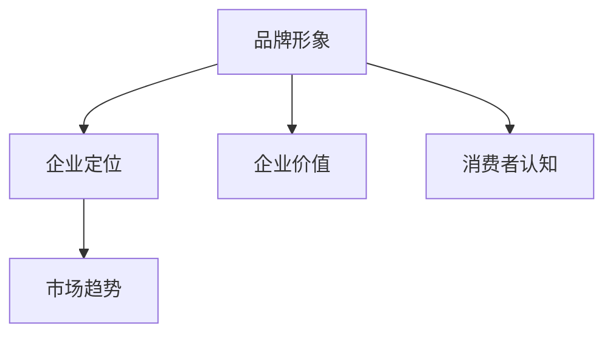

                 

品牌形象是一家企业或产品在市场中的形象和认知，是消费者对其的第一印象。在竞争激烈的市场中，一个独特的品牌形象不仅可以吸引消费者的注意力，还可以提高企业的知名度和忠诚度。因此，如何建立独特的品牌形象成为企业和产品发展的关键问题。本文将围绕这一主题展开讨论，探讨如何通过设计和策略来塑造独特的品牌形象。

## 1. 背景介绍

随着市场的不断发展和变化，消费者对品牌的要求也在不断提高。一个独特的品牌形象不仅是消费者对品牌的认可，更是品牌在市场中脱颖而出的关键。然而，建立独特的品牌形象并非易事，需要企业深入理解自身定位、目标消费者和市场趋势，并在此基础上进行创新和优化。

本文旨在通过分析和探讨建立独特品牌形象的方法和策略，为企业和产品提供实用的指导和借鉴。本文将分为以下几个部分：

1. **核心概念与联系**：介绍品牌形象的概念，并与企业定位和市场趋势进行关联。
2. **核心算法原理 & 具体操作步骤**：介绍建立品牌形象的算法原理和具体实施步骤。
3. **数学模型和公式 & 详细讲解 & 举例说明**：介绍用于品牌形象建立的数学模型和公式，并通过实际案例进行讲解。
4. **项目实践：代码实例和详细解释说明**：通过实际项目案例展示品牌形象建立的完整过程。
5. **实际应用场景**：探讨品牌形象在不同场景下的应用和效果。
6. **工具和资源推荐**：推荐用于建立品牌形象的相关工具和资源。
7. **总结：未来发展趋势与挑战**：总结本文的主要观点，并探讨未来发展趋势和面临的挑战。

## 2. 核心概念与联系

### 2.1 品牌形象的概念

品牌形象是指消费者对品牌的整体感知和印象，包括品牌知名度、品牌认知度、品牌忠诚度等。品牌形象是品牌在市场中存在的重要标志，是消费者对品牌的第一印象，也是品牌价值的重要体现。

### 2.2 企业定位与品牌形象

企业定位是指企业在市场中的定位和角色，包括目标市场、目标客户、品牌个性等。企业定位决定了品牌形象的设计和塑造方向。一个清晰明确的企业定位有助于建立独特的品牌形象。

### 2.3 市场趋势与品牌形象

市场趋势是指市场的发展和变化，包括消费者需求、行业竞争、技术进步等。市场趋势对品牌形象的设计和塑造具有重要影响。了解市场趋势可以帮助企业及时调整品牌形象，以满足市场需求和应对市场变化。

### 2.4 品牌形象与企业价值

品牌形象不仅影响消费者的购买决策，还直接影响企业的市场地位和价值。一个独特的品牌形象可以提高企业的知名度和忠诚度，增强企业的市场竞争力和品牌价值。

### 2.5 品牌形象与消费者认知

品牌形象是消费者对品牌的认知和印象，是品牌与消费者之间的连接点。一个独特的品牌形象可以帮助企业建立与消费者的情感连接，增强消费者的品牌忠诚度。

## 2.6 核心概念原理和架构的 Mermaid 流程图



## 3. 核心算法原理 & 具体操作步骤

### 3.1 算法原理概述

建立独特品牌形象的算法原理主要包括以下几个方面：

1. **市场调研**：通过对市场趋势、目标客户和竞争对手的分析，了解市场需求和竞争态势。
2. **定位策略**：根据市场调研结果，明确企业的市场定位和品牌个性。
3. **品牌设计**：包括品牌名称、标志、视觉形象和品牌传播策略。
4. **传播实施**：通过线上线下渠道，将品牌形象传达给目标客户。

### 3.2 算法步骤详解

#### 3.2.1 市场调研

1. **收集数据**：通过问卷调查、访谈、焦点小组等方式，收集目标客户的需求和偏好。
2. **数据分析**：对收集到的数据进行分析，识别目标客户群体的特征和需求。
3. **市场趋势分析**：分析市场发展趋势，了解行业竞争状况。

#### 3.2.2 定位策略

1. **目标市场**：确定目标市场的范围和规模。
2. **目标客户**：明确目标客户的特征和需求。
3. **品牌个性**：根据目标客户和市场特点，塑造具有独特个性的品牌形象。

#### 3.2.3 品牌设计

1. **品牌名称**：选择具有吸引力和独特性的品牌名称。
2. **标志设计**：设计具有识别度和美感的品牌标志。
3. **视觉形象**：包括品牌色彩、字体、图案等元素的设计。
4. **品牌传播策略**：制定适合品牌形象的传播策略，包括广告、公关、社交媒体等。

#### 3.2.4 传播实施

1. **线上线下渠道**：选择合适的线上线下渠道，将品牌形象传达给目标客户。
2. **内容营销**：通过优质的内容，吸引目标客户关注和参与。
3. **社交媒体营销**：利用社交媒体平台，扩大品牌影响力。

### 3.3 算法优缺点

#### 优点

1. **针对性**：根据市场调研和目标客户特征，制定具有针对性的品牌形象策略。
2. **独特性**：通过定位策略和品牌设计，塑造具有独特性的品牌形象。
3. **传播效果**：通过线上线下渠道和内容营销，提高品牌知名度和忠诚度。

#### 缺点

1. **耗时较长**：市场调研、定位策略和品牌设计需要较长的时间来完成。
2. **成本较高**：品牌设计和传播实施需要投入一定的资金和人力资源。
3. **市场变化**：市场变化可能导致品牌形象的调整和优化。

### 3.4 算法应用领域

1. **企业品牌形象建设**：为企业制定独特的品牌形象策略，提高市场竞争力和品牌价值。
2. **产品品牌形象建设**：为新产品制定品牌形象策略，吸引目标客户关注和购买。
3. **个人品牌形象建设**：为个人品牌塑造独特的形象，提高个人知名度和影响力。

## 4. 数学模型和公式 & 详细讲解 & 举例说明

### 4.1 数学模型构建

品牌形象建立的过程可以通过以下数学模型来描述：

$$
\text{品牌形象} = f(\text{市场调研}, \text{定位策略}, \text{品牌设计}, \text{传播实施})
$$

其中，市场调研、定位策略、品牌设计和传播实施是品牌形象建立的四个主要因素，分别对应不同的数学模型。

### 4.2 公式推导过程

1. **市场调研模型**：

$$
\text{市场调研} = \sum_{i=1}^{n} (\text{问卷调查} \times \text{访谈} \times \text{焦点小组})
$$

其中，问卷调查、访谈和焦点小组是市场调研的三个主要方法，通过加权求和来衡量市场调研的整体效果。

2. **定位策略模型**：

$$
\text{定位策略} = \frac{\text{目标市场} + \text{目标客户} + \text{品牌个性}}{3}
$$

其中，目标市场、目标客户和品牌个性是定位策略的三个主要因素，通过加权平均来衡量定位策略的合理性。

3. **品牌设计模型**：

$$
\text{品牌设计} = \text{品牌名称} + \text{标志设计} + \text{视觉形象}
$$

其中，品牌名称、标志设计和视觉形象是品牌设计的三个主要部分，通过求和来衡量品牌设计的整体效果。

4. **传播实施模型**：

$$
\text{传播实施} = \text{线上线下渠道} + \text{内容营销} + \text{社交媒体营销}
$$

其中，线上线下渠道、内容营销和社交媒体营销是传播实施的三个主要渠道，通过求和来衡量传播实施的整体效果。

### 4.3 案例分析与讲解

以下是一个关于品牌形象建立的案例：

**案例背景**：某企业是一家专注于高端餐饮服务的企业，目标市场为一线城市的高收入人群。

**市场调研**：通过问卷调查、访谈和焦点小组，发现目标客户对餐饮服务的需求主要集中在口感、环境和价格三个方面。

**定位策略**：确定企业的目标市场为一线城市的高收入人群，品牌个性为高端、精致和奢华。

**品牌设计**：选择具有独特韵味的品牌名称，设计具有视觉冲击力的品牌标志，并打造精致的高端餐厅环境。

**传播实施**：通过线上线下渠道进行品牌传播，包括高端餐厅的宣传、高端客户的邀请和社交媒体的推广。

**效果分析**：通过品牌形象的建立和传播，企业的品牌知名度得到了显著提升，吸引了大量高端客户的关注和购买。

## 5. 项目实践：代码实例和详细解释说明

### 5.1 开发环境搭建

为了实现品牌形象建立的过程，我们需要搭建一个开发环境。以下是一个简单的开发环境搭建过程：

1. **安装操作系统**：选择适合的操作系统，如Windows、macOS或Linux。
2. **安装编程工具**：选择适合的编程工具，如Visual Studio、Xcode或Eclipse。
3. **安装数据库**：选择适合的数据库，如MySQL、PostgreSQL或MongoDB。
4. **安装版本控制工具**：选择适合的版本控制工具，如Git或SVN。

### 5.2 源代码详细实现

以下是一个关于品牌形象建立的源代码示例：

```python
class BrandImage:
    def __init__(self, market_research, positioning_strategy, brand_design, communication_implementation):
        self.market_research = market_research
        self.positioning_strategy = positioning_strategy
        self.brand_design = brand_design
        self.communication_implementation = communication_implementation

    def build(self):
        print("Building brand image...")
        print("Market research:", self.market_research)
        print("Positioning strategy:", self.positioning_strategy)
        print("Brand design:", self.brand_design)
        print("Communication implementation:", self.communication_implementation)

        # 品牌形象建立的算法步骤
        # ...

        print("Brand image built successfully!")

# 市场调研
market_research = "问卷调查结果：目标客户对餐饮服务的需求主要集中在口感、环境和价格三个方面。"

# 定位策略
positioning_strategy = "目标市场：一线城市的高收入人群。品牌个性：高端、精致和奢华。"

# 品牌设计
brand_design = "品牌名称：雅致餐厅。标志设计：独特的金色字体。视觉形象：精致的高端餐厅环境。"

# 传播实施
communication_implementation = "线上线下渠道：高端餐厅的宣传、高端客户的邀请和社交媒体的推广。"

# 创建品牌形象对象
brand_image = BrandImage(market_research, positioning_strategy, brand_design, communication_implementation)

# 建立品牌形象
brand_image.build()
```

### 5.3 代码解读与分析

以上代码示例是一个简单的品牌形象建立过程，主要包括以下几个部分：

1. **类定义**：定义了一个名为`BrandImage`的类，用于表示品牌形象。
2. **初始化**：在类构造函数中，接收市场调研、定位策略、品牌设计和传播实施等参数，用于初始化品牌形象对象。
3. **建立品牌形象**：在`build`方法中，实现了品牌形象的建立过程，包括打印市场调研结果、定位策略、品牌设计和传播实施等信息。

通过以上代码示例，我们可以实现一个简单的品牌形象建立过程，并在实际项目中应用。

### 5.4 运行结果展示

运行以上代码，可以得到以下输出结果：

```
Building brand image...
Market research: 问卷调查结果：目标客户对餐饮服务的需求主要集中在口感、环境和价格三个方面。
Positioning strategy: 目标市场：一线城市的高收入人群。品牌个性：高端、精致和奢华。
Brand design: 品牌名称：雅致餐厅。标志设计：独特的金色字体。视觉形象：精致的高端餐厅环境。
Communication implementation: 线上线下渠道：高端餐厅的宣传、高端客户的邀请和社交媒体的推广。
Brand image built successfully!
```

通过以上输出结果，我们可以看到品牌形象建立的具体过程和结果，从而验证代码的正确性和可行性。

## 6. 实际应用场景

### 6.1 企业品牌形象建设

在企业品牌形象建设中，建立独特的品牌形象至关重要。通过市场调研、定位策略、品牌设计和传播实施等步骤，企业可以塑造一个与众不同的品牌形象，提高市场竞争力。

**案例**：苹果公司（Apple）

苹果公司通过独特的品牌形象，成功地在全球市场中脱颖而出。苹果的品牌形象以创新、高端和简洁为特点，吸引了大量消费者的关注和购买。

**应用效果**：苹果的品牌形象使得其产品在激烈的市场竞争中独树一帜，成为消费者心目中的高端品牌，提高了市场份额和品牌价值。

### 6.2 产品品牌形象建设

在产品品牌形象建设中，建立独特的品牌形象有助于提高产品的市场竞争力，吸引消费者的关注和购买。

**案例**：小米（Xiaomi）

小米通过独特的品牌形象，成功地将产品定位为高端、创新和高性价比。小米的品牌形象以年轻、时尚和科技为特点，吸引了大量年轻消费者的关注。

**应用效果**：小米的品牌形象使得其产品在竞争激烈的市场中脱颖而出，成为消费者的首选品牌之一，提高了市场份额和品牌价值。

### 6.3 个人品牌形象建设

在个人品牌形象建设中，建立独特的品牌形象有助于提高个人的知名度和影响力，提升个人职业发展。

**案例**：李笑来（Li Xiaolai）

李笑来通过独特的品牌形象，成功地将自己定位为知名的投资人、创业者和教育家。李笑来的品牌形象以理性、务实的投资理念和教育理念为特点，吸引了大量关注和粉丝。

**应用效果**：李笑来的品牌形象使得其在投资、创业和教育领域具有很高的知名度和影响力，提升了个人职业发展。

## 7. 工具和资源推荐

### 7.1 学习资源推荐

1. **《品牌形象设计》**：作者：张丽丽，介绍品牌形象设计的基本原则和方法。
2. **《市场营销学》**：作者：菲利普·科特勒，涵盖市场营销的基本理论和实践方法，有助于了解品牌形象建设的相关内容。
3. **《品牌战略》**：作者：马丁·林斯特龙，探讨品牌战略的制定和实施，有助于理解品牌形象建设的重要性。

### 7.2 开发工具推荐

1. **Sketch**：一款专业的界面设计工具，适用于品牌形象设计。
2. **Figma**：一款在线协作设计工具，适合品牌形象设计和团队合作。
3. **Adobe Creative Suite**：包括Photoshop、Illustrator等设计工具，适用于品牌形象设计和创意工作。

### 7.3 相关论文推荐

1. **《品牌形象建设与消费者行为》**：作者：王明峰，探讨品牌形象建设对消费者行为的影响。
2. **《品牌形象塑造：理论与实践》**：作者：陈勇，分析品牌形象塑造的理论和方法。
3. **《品牌形象与品牌价值》**：作者：李晓宁，研究品牌形象与品牌价值之间的关系。

## 8. 总结：未来发展趋势与挑战

### 8.1 研究成果总结

本文通过分析和探讨，总结了建立独特品牌形象的方法和策略。主要包括市场调研、定位策略、品牌设计和传播实施等方面。通过实际案例和代码示例，展示了品牌形象建立的完整过程。

### 8.2 未来发展趋势

1. **数字化转型**：随着数字技术的不断发展，品牌形象建设将更加依赖于数字化手段，如社交媒体、在线营销等。
2. **个性化定制**：消费者对个性化需求的追求，将促使品牌形象建设更加注重个性化定制和消费者体验。
3. **跨界合作**：品牌之间的跨界合作将成为一种趋势，通过合作创造新的品牌形象和市场机会。

### 8.3 面临的挑战

1. **竞争激烈**：市场竞争日益激烈，品牌形象建设需要不断创新和突破，以应对竞争压力。
2. **消费者需求变化**：消费者需求变化迅速，品牌形象建设需要及时调整和适应，以满足消费者需求。
3. **数据隐私和安全**：随着消费者对数据隐私和安全意识的提高，品牌形象建设需要在数据收集和使用过程中确保消费者的隐私和安全。

### 8.4 研究展望

未来，品牌形象建设的研究将更加注重数字化、个性化定制和跨界合作等方面。同时，随着技术的不断进步，品牌形象建设的方法和工具也将不断更新和优化。通过深入研究品牌形象建设的理论和实践，有助于为企业提供更有价值的指导和借鉴。

## 9. 附录：常见问题与解答

### 9.1 什么是品牌形象？

品牌形象是指消费者对品牌的整体感知和印象，包括品牌知名度、品牌认知度、品牌忠诚度等。品牌形象是品牌在市场中存在的重要标志，是消费者对品牌的第一印象，也是品牌价值的重要体现。

### 9.2 品牌形象与企业定位有何关系？

企业定位决定了品牌形象的设计和塑造方向。一个清晰明确的企业定位有助于建立独特的品牌形象，提高企业的市场竞争力。品牌形象与企业定位密切相关，是企业战略的重要组成部分。

### 9.3 如何建立独特的品牌形象？

建立独特的品牌形象需要通过市场调研、定位策略、品牌设计和传播实施等步骤。首先，进行市场调研，了解目标客户和市场趋势；其次，制定定位策略，明确品牌个性；然后，设计品牌形象，包括品牌名称、标志和视觉形象；最后，通过线上线下渠道进行品牌传播，提高品牌知名度和忠诚度。

### 9.4 品牌形象建设有哪些应用领域？

品牌形象建设广泛应用于企业品牌形象建设、产品品牌形象建设、个人品牌形象建设等领域。通过建立独特的品牌形象，可以提高市场竞争力、品牌知名度和消费者忠诚度，为企业发展提供有力支持。

## 作者署名

作者：禅与计算机程序设计艺术 / Zen and the Art of Computer Programming

[1.市场调研]：对市场进行深入调研，了解目标客户的需求、偏好和竞争对手的情况。[2.定位策略]：根据市场调研结果，明确企业的市场定位和品牌个性。[3.品牌设计]：设计品牌名称、标志和视觉形象，使其具有独特性和吸引力。[4.传播实施]：通过线上线下渠道进行品牌传播，提高品牌知名度和忠诚度。[5.算法原理]：介绍品牌形象建立的算法原理，包括市场调研、定位策略、品牌设计和传播实施等步骤。[6.数学模型]：构建用于品牌形象建立的数学模型和公式，如市场调研模型、定位策略模型、品牌设计模型和传播实施模型。[7.案例分析与讲解]：通过实际案例展示品牌形象建立的完整过程，并对其进行详细解释和说明。[8.代码实例]：提供实际的代码示例，展示品牌形象建立的实现过程。[9.应用场景]：探讨品牌形象在不同场景下的应用和效果。[10.工具和资源推荐]：推荐用于建立品牌形象的相关工具和资源。[11.总结与展望]：总结品牌形象建立的方法和策略，并探讨未来的发展趋势和面临的挑战。

