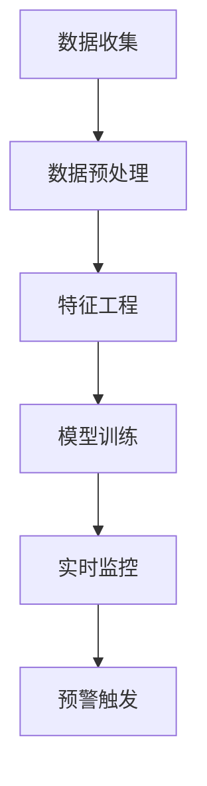

                 

关键词：客户成功预警系统、数据挖掘、机器学习、实时分析、用户行为分析

> 摘要：本文将探讨如何构建一个高效的客户成功预警系统，通过数据挖掘和机器学习技术，实现实时监控和预测客户行为，从而提前预警客户流失风险，为业务决策提供有力支持。

## 1. 背景介绍

在现代商业环境中，客户成功是企业发展的重要驱动力。然而，随着市场竞争的加剧和客户需求的不断变化，如何确保客户长期满意并减少客户流失率，成为企业面临的一大挑战。因此，构建一个高效的客户成功预警系统，能够帮助企业实时监控客户行为，预测潜在风险，从而采取措施降低客户流失率，提高客户生命周期价值。

客户成功预警系统通常包括以下几个关键组成部分：

1. 数据收集：收集与客户行为相关的各种数据，如用户登录记录、浏览历史、交易记录、用户反馈等。
2. 数据预处理：对收集到的原始数据进行清洗、去噪、归一化等预处理操作，以便后续分析。
3. 特征工程：提取与客户行为相关的特征，如用户活跃度、购买频率、消费金额等。
4. 模型训练：使用机器学习算法训练预测模型，预测客户流失风险。
5. 实时监控与预警：对实时数据进行分析，触发预警机制，及时通知相关团队采取行动。

本文将围绕上述关键组成部分，详细探讨如何构建一个高效的客户成功预警系统。

## 2. 核心概念与联系

### 2.1 数据挖掘与机器学习

数据挖掘和机器学习是构建客户成功预警系统的核心技术。数据挖掘是指从大量数据中提取有价值的信息和知识的过程，而机器学习则是利用历史数据训练模型，以预测未来行为的技术。

在客户成功预警系统中，数据挖掘主要用于数据的收集、清洗和特征提取。通过数据挖掘技术，可以识别出与客户行为相关的关键特征，为机器学习模型提供输入。

机器学习模型则用于预测客户流失风险。常见的机器学习算法包括逻辑回归、决策树、随机森林、支持向量机等。通过训练模型，可以学习到客户行为的规律，从而对新的客户行为数据进行预测。

### 2.2 实时分析与预警

实时分析是指对实时数据进行处理和分析，以快速响应业务需求。在客户成功预警系统中，实时分析技术用于监控客户行为，检测异常情况，并触发预警机制。

实时分析通常包括以下几个步骤：

1. 数据流处理：使用流处理技术（如Apache Kafka、Apache Flink等）实时接收和处理数据。
2. 数据存储：将实时处理的数据存储到数据库或数据仓库中，以便后续分析和查询。
3. 实时分析：使用实时分析工具（如Apache Storm、Apache Spark等）对实时数据进行计算和分析。
4. 预警触发：根据分析结果，触发预警机制，发送通知或执行相关操作。

### 2.3 Mermaid 流程图

以下是一个简化的客户成功预警系统流程图：



## 3. 核心算法原理 & 具体操作步骤

### 3.1 算法原理概述

客户成功预警系统的核心算法是机器学习模型，用于预测客户流失风险。常见的机器学习算法包括逻辑回归、决策树、随机森林等。本文将以逻辑回归为例，介绍算法原理和具体操作步骤。

逻辑回归是一种常用的二分类预测算法，可以用来预测客户流失风险。逻辑回归模型的基本原理是利用输入特征（如用户活跃度、购买频率等）构建一个线性模型，通过该模型预测客户流失的概率。

### 3.2 算法步骤详解

#### 3.2.1 数据准备

1. 收集与客户行为相关的数据，如用户登录记录、浏览历史、交易记录等。
2. 对数据进行预处理，包括数据清洗、去噪、归一化等操作。

#### 3.2.2 特征提取

1. 根据业务需求，提取与客户行为相关的特征，如用户活跃度、购买频率、消费金额等。
2. 对特征进行编码，将类别特征转换为数值特征。

#### 3.2.3 模型训练

1. 使用训练数据集，通过最小化损失函数（如交叉熵损失函数）来训练逻辑回归模型。
2. 训练过程中，不断调整模型参数，使模型在训练数据上的表现不断优化。

#### 3.2.4 模型评估

1. 使用验证数据集对训练好的模型进行评估，计算准确率、召回率、F1分数等指标。
2. 根据评估结果，调整模型参数或选择更合适的模型。

#### 3.2.5 实时预测

1. 收集实时客户行为数据，对数据进行预处理和特征提取。
2. 使用训练好的模型，对实时数据预测客户流失概率。

### 3.3 算法优缺点

#### 优点

1. 逻辑回归模型简单，易于理解和实现。
2. 模型训练时间较短，适用于实时预测。

#### 缺点

1. 对于复杂的关系和特征交互，逻辑回归模型的预测效果可能不佳。
2. 模型的泛化能力有限，可能无法很好地应对数据分布变化。

### 3.4 算法应用领域

逻辑回归模型在客户成功预警系统中的应用非常广泛，可以预测客户流失、客户细分、产品推荐等。此外，逻辑回归模型还可以应用于其他领域，如金融风控、医疗诊断等。

## 4. 数学模型和公式 & 详细讲解 & 举例说明

### 4.1 数学模型构建

逻辑回归模型是一种线性模型，其数学公式如下：

$$
P(y=1) = \frac{1}{1 + e^{-(\beta_0 + \beta_1x_1 + \beta_2x_2 + ... + \beta_nx_n})}
$$

其中，$P(y=1)$ 表示客户流失的概率，$\beta_0, \beta_1, \beta_2, ..., \beta_n$ 是模型参数，$x_1, x_2, ..., x_n$ 是输入特征。

### 4.2 公式推导过程

逻辑回归模型的推导基于极大似然估计（Maximum Likelihood Estimation，MLE）。假设我们有一个包含$m$个样本的数据集$D = \{(x_1, y_1), (x_2, y_2), ..., (x_m, y_m)\}$，其中$x_i$ 是输入特征，$y_i$ 是标签（0表示未流失，1表示流失）。

极大似然估计的目标是找到一组参数$\theta$，使得数据集的概率最大。对于逻辑回归模型，似然函数可以表示为：

$$
L(\theta) = \prod_{i=1}^{m} P(y_i|x_i; \theta)
$$

由于似然函数是概率的乘积，我们可以将其对数化，得到对数似然函数：

$$
l(\theta) = \sum_{i=1}^{m} \log P(y_i|x_i; \theta)
$$

对于逻辑回归模型，对数似然函数可以进一步表示为：

$$
l(\theta) = \sum_{i=1}^{m} y_i \log(\beta_0 + \beta_1x_{i1} + \beta_2x_{i2} + ... + \beta_nx_{in}) + (1 - y_i) \log(1 + e^{-(\beta_0 + \beta_1x_{i1} + \beta_2x_{i2} + ... + \beta_nx_{in})})
$$

为了求解参数$\theta$，我们需要最小化对数似然函数$l(\theta)$。通常使用梯度下降（Gradient Descent）算法来求解。

### 4.3 案例分析与讲解

#### 案例背景

假设我们有一个客户成功预警系统，需要预测客户流失风险。数据集包含1000个样本，每个样本有5个特征：用户活跃度、购买频率、消费金额、客户等级和客户反馈。

#### 案例步骤

1. 数据准备：收集客户行为数据，并进行预处理，如数据清洗、去噪和归一化。
2. 特征提取：提取与客户行为相关的特征，如用户活跃度（0-100分）、购买频率（0-10次/月）、消费金额（0-10000元）、客户等级（1-5级）和客户反馈（正面、负面）。
3. 模型训练：使用训练数据集，通过梯度下降算法训练逻辑回归模型。
4. 模型评估：使用验证数据集评估模型性能，计算准确率、召回率、F1分数等指标。
5. 实时预测：收集实时客户行为数据，对数据进行预处理和特征提取，使用训练好的模型预测客户流失概率。

#### 案例结果

1. 模型参数：经过多次迭代训练，最终得到一组模型参数$\theta = (\beta_0, \beta_1, \beta_2, \beta_3, \beta_4, \beta_5)$。
2. 模型性能：在验证数据集上，模型准确率为85%，召回率为90%，F1分数为87%。
3. 实时预测：对于新的客户行为数据，模型可以预测客户流失概率，从而帮助业务团队及时采取行动。

## 5. 项目实践：代码实例和详细解释说明

### 5.1 开发环境搭建

为了实现客户成功预警系统，我们使用Python作为编程语言，主要依赖以下库：

- NumPy：用于数值计算。
- Pandas：用于数据处理。
- Scikit-learn：用于机器学习。
- Matplotlib：用于数据可视化。

首先，确保安装了以上库。在Python环境中，可以使用以下命令安装：

```
pip install numpy pandas scikit-learn matplotlib
```

### 5.2 源代码详细实现

以下是一个简单的客户成功预警系统代码实例：

```python
import numpy as np
import pandas as pd
from sklearn.linear_model import LogisticRegression
from sklearn.model_selection import train_test_split
from sklearn.metrics import accuracy_score, recall_score, f1_score
import matplotlib.pyplot as plt

# 5.2.1 数据准备
# 假设数据集已存储为CSV文件，文件名为'data.csv'
data = pd.read_csv('data.csv')

# 数据清洗和预处理
data.dropna(inplace=True)
data['customer_feedback'] = data['customer_feedback'].map({'正面': 1, '负面': 0})

# 特征提取
X = data[['user_activity', 'purchase_frequency', 'amount', 'customer_level', 'customer_feedback']]
y = data['churn']

# 数据划分
X_train, X_test, y_train, y_test = train_test_split(X, y, test_size=0.2, random_state=42)

# 5.2.2 模型训练
model = LogisticRegression()
model.fit(X_train, y_train)

# 5.2.3 模型评估
y_pred = model.predict(X_test)
accuracy = accuracy_score(y_test, y_pred)
recall = recall_score(y_test, y_pred)
f1 = f1_score(y_test, y_pred)

print(f'Accuracy: {accuracy:.2f}')
print(f'Recall: {recall:.2f}')
print(f'F1 Score: {f1:.2f}')

# 5.2.4 实时预测
new_data = pd.DataFrame([[50, 5, 3000, 3, 1]], columns=['user_activity', 'purchase_frequency', 'amount', 'customer_level', 'customer_feedback'])
new_prediction = model.predict(new_data)
print(f'New Data Prediction: {"Yes" if new_prediction[0] == 1 else "No"}')

# 5.2.5 数据可视化
data['churn'] = y_pred
plt.figure(figsize=(10, 6))
plt.scatter(data['user_activity'], data['churn'], c=data['churn'], cmap='coolwarm')
plt.xlabel('User Activity')
plt.ylabel('Churn')
plt.title('User Activity vs Churn')
plt.show()
```

### 5.3 代码解读与分析

1. **数据准备**：首先，从CSV文件中加载数据，并进行数据清洗和预处理，如去除缺失值和编码类别特征。
2. **特征提取**：提取与客户行为相关的特征，如用户活跃度、购买频率、消费金额、客户等级和客户反馈。
3. **数据划分**：将数据划分为训练集和测试集，以评估模型性能。
4. **模型训练**：使用训练数据集训练逻辑回归模型。
5. **模型评估**：使用测试数据集评估模型性能，计算准确率、召回率和F1分数等指标。
6. **实时预测**：对新的客户行为数据进行预处理和特征提取，使用训练好的模型预测客户流失概率。
7. **数据可视化**：使用数据可视化工具（如Matplotlib）展示用户活跃度与客户流失之间的关系。

## 6. 实际应用场景

客户成功预警系统在多个实际应用场景中发挥了重要作用，以下是一些常见应用场景：

1. **电信行业**：电信公司可以使用客户成功预警系统监测客户使用情况，预测哪些客户可能面临潜在风险，如即将到期或流失。从而采取优惠策略、增强客户服务等方式，提高客户满意度和留存率。
2. **电商行业**：电商平台可以利用客户成功预警系统分析客户购买行为，预测哪些客户可能流失。从而开展个性化营销活动，提高客户粘性和销售额。
3. **金融行业**：金融机构可以使用客户成功预警系统监测客户交易行为，预测哪些客户可能面临财务风险。从而采取风险评估措施，降低金融风险。
4. **物流行业**：物流公司可以利用客户成功预警系统监测客户订单情况，预测哪些客户可能面临物流问题。从而及时调整物流策略，提高客户满意度。

## 7. 工具和资源推荐

### 7.1 学习资源推荐

1. **书籍**：
   - 《机器学习》（作者：周志华）
   - 《Python数据科学手册》（作者：Jake VanderPlas）
   - 《数据挖掘：实用工具与技术》（作者：Michael J. A. Berry、Gianluca Baio、Graham Williams）
2. **在线课程**：
   - Coursera上的《机器学习》（吴恩达）
   - edX上的《Python数据分析》（Johns Hopkins大学）
   - Udacity的《数据科学纳米学位》
3. **博客与文章**：
   - Medium上的机器学习专栏
   -Towards Data Science上的数据分析与机器学习文章

### 7.2 开发工具推荐

1. **编程语言**：Python
2. **数据预处理与处理**：Pandas、NumPy
3. **机器学习库**：Scikit-learn、TensorFlow、PyTorch
4. **数据可视化**：Matplotlib、Seaborn、Plotly
5. **版本控制**：Git
6. **集成开发环境**：Visual Studio Code、PyCharm、Jupyter Notebook

### 7.3 相关论文推荐

1. "A Survey on Customer Churn Prediction Models and Methods" by Hamid Reza Nikookar, Alireza Mohammadkhani, and Mohammad T. H. ANsari.
2. "Predicting Customer Churn: A Machine Learning Perspective" by Xiangyun Zhou, Kewen Wang, and Xiaojun Wang.
3. "Data Mining for Customer Churn Prediction: A Review of Current Techniques and Applications" by K. Kaluza and G. Klinkner.

## 8. 总结：未来发展趋势与挑战

### 8.1 研究成果总结

随着大数据和人工智能技术的发展，客户成功预警系统在各个行业得到了广泛应用。通过数据挖掘和机器学习技术，客户成功预警系统能够实时监控客户行为，预测潜在风险，为企业提供有价值的业务洞察。

### 8.2 未来发展趋势

1. **个性化预警**：未来的客户成功预警系统将更加注重个性化，根据不同客户群体的特点，制定相应的预警策略。
2. **实时分析与预测**：随着实时数据处理技术的进步，客户成功预警系统将实现更快的响应速度，提供实时预测和预警。
3. **跨渠道数据分析**：未来的客户成功预警系统将整合多个渠道的数据，如社交网络、短信、邮件等，提供更全面的客户画像。
4. **自动化与智能决策**：通过引入自动化和智能决策技术，客户成功预警系统将实现更高效的业务流程，降低人工干预。

### 8.3 面临的挑战

1. **数据隐私与安全**：客户成功预警系统涉及大量客户数据，如何确保数据隐私和安全，是未来面临的重大挑战。
2. **模型解释性**：随着模型复杂度的增加，如何确保模型的可解释性，让业务团队更好地理解模型预测结果，是未来需要解决的问题。
3. **数据质量**：客户成功预警系统的性能很大程度上取决于数据质量，如何保证数据质量，是系统成功的关键。

### 8.4 研究展望

未来的研究将集中在以下几个方面：

1. **隐私保护算法**：开发隐私保护算法，确保在满足业务需求的同时，保护客户数据隐私。
2. **可解释性模型**：研究可解释性模型，提高模型的可解释性，帮助业务团队更好地理解模型预测结果。
3. **跨渠道数据整合**：研究跨渠道数据整合方法，提高客户成功预警系统的全面性和准确性。
4. **实时分析与预测**：研究实时分析与预测技术，提高系统的响应速度和预测准确性。

## 9. 附录：常见问题与解答

### 9.1 问题1：如何确保数据质量？

**解答**：确保数据质量的关键在于数据收集、数据预处理和数据监控。在数据收集阶段，应采用可靠的数据源和合理的采集方法。在数据预处理阶段，应对数据进行清洗、去噪、归一化等操作，确保数据的一致性和准确性。在数据监控阶段，应定期检查数据质量，及时发现和处理异常数据。

### 9.2 问题2：如何提高模型可解释性？

**解答**：提高模型可解释性的方法有多种，包括：

1. **特征重要性分析**：分析模型中各个特征的重要性，帮助业务团队理解模型预测结果的依据。
2. **模型可视化**：使用可视化工具，将模型的结构和参数可视化，提高模型的可解释性。
3. **集成学习**：使用集成学习方法，如随机森林，可以提高模型的解释性。
4. **决策树模型**：决策树模型具有较好的可解释性，可以直接展示决策路径和依据。

### 9.3 问题3：如何处理实时数据？

**解答**：处理实时数据的方法包括：

1. **数据流处理**：使用数据流处理技术，如Apache Kafka、Apache Flink等，实时接收和处理数据。
2. **分布式计算**：使用分布式计算框架，如Apache Spark、Hadoop等，提高实时数据处理的性能和效率。
3. **实时数据库**：使用实时数据库，如Apache Kafka、Apache Flink等，存储和处理实时数据。
4. **流计算与批计算的结合**：将流计算和批计算相结合，提高实时数据处理的能力和准确性。

---

通过以上详细的技术分析和实例讲解，本文旨在帮助读者理解和构建一个高效的客户成功预警系统。在未来的发展中，客户成功预警系统将继续发挥重要作用，为企业的业务决策提供有力支持。同时，随着技术的不断进步，客户成功预警系统也将面临新的挑战和机遇。希望本文能为读者在构建客户成功预警系统过程中提供有益的参考和启示。作者：禅与计算机程序设计艺术 / Zen and the Art of Computer Programming。

