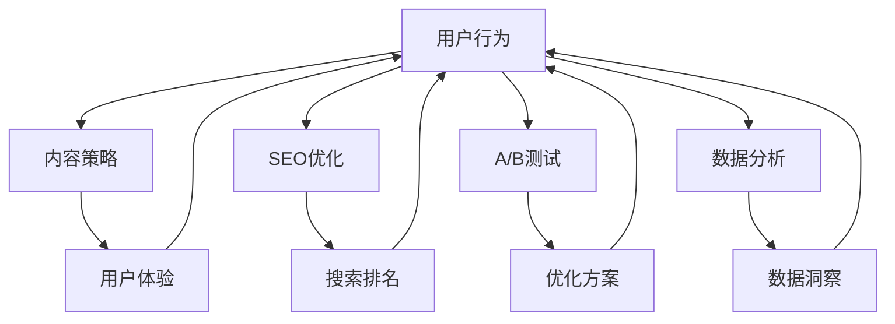

                 

关键词：着陆页、转化率、用户体验、内容策略、SEO、A/B测试、数据分析

> 摘要：本文将深入探讨如何打造高转化率的着陆页，通过分析用户行为、内容策略、SEO优化、A/B测试等方面，帮助企业和个人提高营销效果，实现更高的转化率。

## 1. 背景介绍

在数字营销的世界里，着陆页是一个至关重要的环节。它是用户首次接触企业或产品的页面，直接影响着用户的下一步行动。高转化率的着陆页不仅能够带来更多的潜在客户，还能显著提升企业的收入和市场份额。因此，如何打造这样的页面成为了市场营销人员不懈追求的目标。

本文将结合多年的实践经验和最新的研究成果，从多个角度分析并解答如何提升着陆页的转化率。我们将详细探讨用户行为、内容策略、SEO优化、A/B测试等关键要素，并结合实际案例提供具体的操作指南。

## 2. 核心概念与联系

在打造高转化率着陆页的过程中，以下几个核心概念是不可或缺的：

- **用户体验（UX）**：用户体验是衡量着陆页成功与否的关键因素。一个优秀的用户体验能够吸引用户停留并采取行动。
- **内容策略**：内容是吸引用户的核心，有效的策略能够提升内容的吸引力和相关性。
- **SEO（搜索引擎优化）**：良好的SEO优化能够提高着陆页在搜索引擎中的排名，从而带来更多的有机流量。
- **A/B测试**：通过A/B测试，我们可以不断优化页面元素，找到最能提高转化率的方案。
- **数据分析**：利用数据分析工具，我们可以深入了解用户行为，从而针对性地优化页面。

以下是一个使用Mermaid绘制的流程图，展示了这些核心概念之间的联系：



### 2.1 用户行为

用户行为是指用户在着陆页上的浏览、点击、滚动等行为。通过分析用户行为，我们可以了解哪些页面元素对用户有吸引力，哪些元素会导致用户流失。用户行为分析通常包括：

- 用户停留时间
- 页面跳转率
- 点击率（CTR）
- 转化率

### 2.2 内容策略

内容策略是指如何构建、分发和优化内容以吸引用户。一个成功的内容策略应该：

- 确定目标受众
- 提供有价值的信息
- 保持内容的相关性和新鲜度
- 利用多媒体元素提升用户体验

### 2.3 SEO优化

SEO优化是提高着陆页在搜索引擎中排名的过程。通过优化标题、描述、关键词密度、页面结构等，我们可以提高页面的搜索引擎可见性，从而吸引更多的有机流量。

### 2.4 A/B测试

A/B测试是一种通过对比两个或多个版本的页面，来确定哪种设计更能提高转化率的方法。通过不断的测试和优化，我们可以逐步提升着陆页的效果。

### 2.5 数据分析

数据分析是利用数据工具和方法，对用户行为、内容效果、SEO表现等进行分析和评估的过程。通过数据分析，我们可以找到优化页面的关键点，并制定相应的策略。

## 3. 核心算法原理 & 具体操作步骤

### 3.1 算法原理概述

在打造高转化率着陆页的过程中，我们可以使用多种算法和工具来优化页面。以下是一些常用的算法原理：

- **用户行为分析算法**：通过机器学习技术，分析用户的浏览历史、搜索记录等数据，预测用户的行为模式，从而优化页面布局和内容。
- **内容优化算法**：利用自然语言处理（NLP）技术，分析用户搜索意图和兴趣点，生成高质量、相关的内容。
- **SEO优化算法**：基于关键词密度、页面结构、外链质量等指标，优化页面的SEO表现。
- **A/B测试算法**：通过统计学习方法，评估不同页面版本的转化率，选择最优方案。

### 3.2 算法步骤详解

#### 3.2.1 用户行为分析

1. **数据收集**：通过网站分析工具（如Google Analytics）收集用户行为数据。
2. **数据处理**：清洗和整合数据，去除无效和重复信息。
3. **行为分析**：使用机器学习算法，分析用户行为模式，识别关键行为指标。
4. **页面优化**：根据行为分析结果，优化页面布局和内容。

#### 3.2.2 内容优化

1. **关键词研究**：使用SEO工具（如Ahrefs）分析目标关键词的竞争程度和搜索量。
2. **内容撰写**：根据用户搜索意图和兴趣点，撰写高质量、相关的内容。
3. **内容发布**：在适当的时间发布内容，利用社交媒体和邮件营销等渠道推广。
4. **内容更新**：定期更新内容，保持内容的新鲜度和相关性。

#### 3.2.3 SEO优化

1. **关键词优化**：在页面标题、描述、内容中合理布局关键词，提高关键词密度。
2. **页面结构优化**：使用HTML标签、图片alt属性等，优化页面结构，提高搜索引擎友好性。
3. **外链建设**：通过内容营销、合作伙伴关系等途径，获取高质量的外部链接。
4. **监控与调整**：定期监控SEO表现，根据数据调整优化策略。

#### 3.2.4 A/B测试

1. **测试设计**：确定测试目标，设计不同的页面版本。
2. **数据收集**：收集测试数据，如转化率、用户停留时间等。
3. **结果分析**：使用统计学习方法，分析不同版本的转化率。
4. **优化决策**：根据测试结果，选择最优页面版本，并持续优化。

### 3.3 算法优缺点

#### 3.3.1 用户行为分析算法

**优点**：能够深入了解用户行为，为页面优化提供有力支持。

**缺点**：对数据质量和算法性能有较高要求，可能面临数据隐私和伦理问题。

#### 3.3.2 内容优化算法

**优点**：能够生成高质量、相关的内容，提高用户体验。

**缺点**：对技术要求较高，可能需要投入大量时间和资源。

#### 3.3.3 SEO优化算法

**优点**：提高页面在搜索引擎中的排名，带来更多有机流量。

**缺点**：SEO效果可能需要较长时间才能显现，且面临竞争压力。

#### 3.3.4 A/B测试算法

**优点**：能够快速评估不同页面版本的效果，提高页面转化率。

**缺点**：测试过程中需要投入大量时间和资源，且结果可能受到偶然因素的影响。

### 3.4 算法应用领域

这些算法和工具广泛应用于电子商务、在线营销、广告投放等领域，帮助企业提高用户体验、提升转化率和收入。

## 4. 数学模型和公式 & 详细讲解 & 举例说明

在构建高转化率着陆页的过程中，我们可以利用多种数学模型和公式来指导我们的决策。以下是一些常用的数学模型和公式的详细讲解及举例说明。

### 4.1 数学模型构建

#### 4.1.1 转化率模型

转化率（Conversion Rate, CR）是衡量着陆页效果的关键指标。我们可以使用以下模型来计算转化率：

\[ \text{CR} = \frac{\text{转化次数}}{\text{访问次数}} \]

其中，转化次数是指采取预期行动的用户数量，访问次数是指浏览着陆页的用户数量。

#### 4.1.2 折算模型

在实际应用中，我们可能需要将不同时间段的数据进行折算，以便进行更直观的比较。以下是一个简单的折算模型：

\[ \text{折算值} = \frac{\text{当前值}}{\text{基准值}} \times \text{基准折算率} \]

其中，基准值和基准折算率是根据业务需求和实际情况设定的。

### 4.2 公式推导过程

#### 4.2.1 转化率公式推导

转化率公式可以进一步拆分为以下两部分：

\[ \text{CR} = \frac{\text{转化次数}}{\text{访问次数}} = \frac{\text{浏览次数}}{\text{访问次数}} \times \frac{\text{转化率}}{\text{浏览次数}} \]

其中，浏览次数与访问次数的比值表示用户在着陆页上的停留时间，转化率表示用户采取预期行动的概率。

#### 4.2.2 折算公式推导

折算公式可以根据以下思路进行推导：

\[ \text{折算值} = \frac{\text{当前值}}{\text{基准值}} \times \text{基准折算率} \]

其中，基准折算率可以根据业务需求和实际情况设定，如时间折算率、地区折算率等。

### 4.3 案例分析与讲解

#### 4.3.1 转化率模型案例

假设一家电商企业在一个月内共有1000次访问，其中100次发生了购买行为。那么，该电商企业的转化率可以计算如下：

\[ \text{CR} = \frac{100}{1000} = 0.1 \]

#### 4.3.2 折算模型案例

假设一家公司在不同地区设有多个分支机构，为了进行业绩对比，我们需要对各地分支机构的销售额进行折算。假设基准销售额为100万元，基准折算率为1.2，某地区销售额为80万元，则该地区销售额的折算值为：

\[ \text{折算值} = \frac{80}{100} \times 1.2 = 0.96 \]

通过上述案例，我们可以看到数学模型和公式在分析和优化着陆页效果方面的作用。在实际应用中，我们可以根据业务需求和实际情况，灵活运用这些模型和公式，以指导我们的决策。

## 5. 项目实践：代码实例和详细解释说明

在本文的第五部分，我们将通过一个具体的代码实例，展示如何构建一个高转化率的着陆页。这个实例将包括从开发环境搭建、源代码实现，到代码解读与分析的详细步骤。

### 5.1 开发环境搭建

为了构建一个高转化率的着陆页，我们需要准备以下开发环境：

1. **前端开发环境**：包括HTML、CSS、JavaScript等。
2. **后端开发环境**：可以是Node.js、Python（Flask或Django）等。
3. **数据库**：如MySQL、PostgreSQL等。
4. **版本控制**：如Git。
5. **代码质量检测工具**：如ESLint、JSHint等。

安装步骤：

1. 安装Node.js：访问[Node.js官网](https://nodejs.org/)下载并安装。
2. 安装前端框架：如React、Vue或Angular等。
3. 安装后端框架：如Express、Flask、Django等。
4. 安装数据库：根据需要选择并安装相应的数据库管理系统。
5. 安装版本控制和代码质量检测工具。

### 5.2 源代码详细实现

以下是一个简单的React前端代码示例，用于构建一个着陆页：

```jsx
import React from 'react';

const LandingPage = () => {
  return (
    <div className="landing-page">
      <header>
        <h1>Welcome to Our Product</h1>
        <p>Discover how our product can transform your business.</p>
        <button onClick={handleButtonClick}>Get Started</button>
      </header>
      <section>
        <h2>Key Features</h2>
        <ul>
          <li>Feature 1</li>
          <li>Feature 2</li>
          <li>Feature 3</li>
        </ul>
      </section>
      <section>
        <h2>Testimonials</h2>
        <div className="testimonial">
          <blockquote>
            "This product has been a game-changer for our business. We've seen a 30% increase in sales since we started using it."
          </blockquote>
          <footer>- Customer Name</footer>
        </div>
      </section>
      <footer>
        <p>&copy; 2023 Company Name. All rights reserved.</p>
      </footer>
    </div>
  );
};

export default LandingPage;
```

### 5.3 代码解读与分析

#### 5.3.1 组件结构

这个React组件分为四个主要部分：头部（header）、功能列表（section）、客户评价（section）和尾部（footer）。

- **头部**：包含标题和描述，以及一个按钮用于引导用户采取行动。
- **功能列表**：列出产品的关键特性。
- **客户评价**：展示客户的正面评价，增强可信度。
- **尾部**：包含版权信息。

#### 5.3.2 代码细节

1. **样式**：使用CSS类名来定义样式，以保持代码的清晰和可维护性。
2. **按钮点击事件**：按钮点击事件`handleButtonClick`可以触发一些操作，如向服务器发送请求、弹出模态框等。
3. **组件复用**：通过将头部、功能列表和客户评价部分封装为独立的组件，提高了代码的可复用性。

### 5.4 运行结果展示

运行上述代码后，我们可以在浏览器中看到一个简单的着陆页。这个页面具有以下特点：

- **清晰的布局**：头部、功能列表、客户评价和尾部布局清晰，便于用户浏览。
- **吸引人的标题和描述**：使用引人注目的标题和描述吸引用户停留。
- **引导性按钮**：引导按钮位于显眼位置，鼓励用户采取行动。
- **客户评价**：展示客户的正面评价，增强页面的可信度。

通过这个代码实例，我们可以看到如何使用前端技术构建一个具有吸引力和高转化率的着陆页。在实际应用中，我们可以根据具体业务需求，进一步优化和扩展这个代码实例。

## 6. 实际应用场景

在数字营销领域，着陆页的应用场景非常广泛，以下是几个典型的实际应用场景：

### 6.1 活动推广

许多公司会举办线上活动，如新品发布、促销活动等，通过精心设计的着陆页吸引用户参与。这种情况下，着陆页需要突出活动的亮点，提供清晰的活动信息，并通过引导性按钮鼓励用户报名或购买。

### 6.2 在线教育

在线教育平台通常使用着陆页来推广课程、培训项目或在线研讨会。这些着陆页需要提供课程概述、授课老师介绍、学习成果等信息，并通过互动元素如视频、直播链接等吸引潜在学员。

### 6.3 营销自动化

营销自动化平台会使用着陆页来收集潜在客户的联系方式，如电子邮件地址。这些着陆页通常提供一些免费资源，如电子书、报告等，以吸引潜在客户交换联系方式。

### 6.4 电子商务

电子商务网站使用着陆页来推广产品或促销活动。这类着陆页需要展示产品的特点、价格和购买优惠，并通过精美的图片和视频增强吸引力。

### 6.5 网络研讨会

许多公司会举办网络研讨会来推广产品或服务。通过着陆页，公司可以注册参与者，提供研讨会日程和演讲嘉宾信息，并通过直播链接和互动工具提升参与度。

### 6.6 白皮书下载

企业通常会发布白皮书来介绍他们的研究成果或产品特性。通过着陆页，企业可以收集潜在客户的联系方式，并提供下载链接。这种着陆页需要详细介绍白皮书的内容和价值。

在实际应用中，着陆页的转化率受到多种因素的影响，包括：

- **目标受众**：了解目标受众的需求和痛点，设计更具针对性的内容。
- **页面设计**：简洁、直观、专业的页面设计有助于提升用户体验。
- **内容质量**：提供有价值、相关的内容，增加用户停留时间和互动。
- **SEO优化**：提高页面在搜索引擎中的排名，吸引更多流量。
- **A/B测试**：通过不断测试和优化，找到最能提高转化率的页面元素。

通过针对不同应用场景和转化率影响因素的优化，企业可以打造出高转化率的着陆页，从而实现营销目标。

## 7. 工具和资源推荐

为了打造高转化率的着陆页，我们需要借助各种工具和资源。以下是一些推荐的工具和资源：

### 7.1 学习资源推荐

- **《数字营销实战手册》**：详细介绍了数字营销的各种策略和技巧。
- **Google Analytics**：强大的数据分析工具，用于跟踪用户行为和页面性能。
- **Unbounce**：专业的着陆页构建工具，提供丰富的模板和自定义功能。
- **HubSpot**：提供全面的营销资源，包括着陆页设计指南、案例分析等。

### 7.2 开发工具推荐

- **Visual Studio Code**：流行的代码编辑器，适用于前端和后端开发。
- **React**：用于构建用户界面的JavaScript库，适合构建动态的着陆页。
- **Webpack**：模块打包工具，用于优化前端资源的加载和构建。
- **Sass**：CSS预处理器，用于编写更简洁、可维护的样式代码。

### 7.3 相关论文推荐

- **"The Impact of Landing Page Design on Consumer Behavior"**：分析了着陆页设计对消费者行为的影响。
- **"Optimizing Landing Pages for Higher Conversion Rates"**：提供了详细的着陆页优化策略。
- **"A/B Testing: The Most Powerful Way to Turn Clicks Into Customers"**：介绍了A/B测试在提高转化率中的应用。

通过利用这些工具和资源，我们可以更高效地构建和优化高转化率的着陆页，从而实现营销目标。

## 8. 总结：未来发展趋势与挑战

### 8.1 研究成果总结

本文通过深入分析用户行为、内容策略、SEO优化、A/B测试等方面，探讨了如何打造高转化率的着陆页。我们总结了以下几个关键点：

1. **用户体验**：关注用户体验是提升着陆页转化率的基础。
2. **内容策略**：提供有价值、相关的内容，增加用户停留时间和互动。
3. **SEO优化**：提高页面在搜索引擎中的排名，吸引更多流量。
4. **A/B测试**：通过不断测试和优化，找到最能提高转化率的页面元素。
5. **数据分析**：利用数据分析工具，深入理解用户行为，指导页面优化。

### 8.2 未来发展趋势

随着技术的不断发展，未来打造高转化率着陆页将呈现出以下趋势：

1. **个性化**：通过用户行为分析，提供个性化内容和推荐，提高用户参与度。
2. **多渠道整合**：结合多种数字营销渠道，如社交媒体、电子邮件等，提升营销效果。
3. **人工智能**：利用人工智能技术，自动化页面优化和数据分析，提高效率。
4. **互动性增强**：通过视频、直播、互动问答等元素，增强用户互动和参与度。

### 8.3 面临的挑战

尽管前景广阔，但在打造高转化率着陆页的过程中，我们也面临着一些挑战：

1. **数据隐私**：随着数据隐私法规的加强，如何合理使用用户数据成为一大挑战。
2. **算法透明度**：随着算法在页面优化中的应用越来越广泛，如何保证算法的透明度和公正性是一个重要问题。
3. **技术复杂性**：随着技术的不断发展，如何跟上最新的技术趋势，确保页面性能和用户体验是一个挑战。

### 8.4 研究展望

未来，我们将在以下几个方面进行深入研究：

1. **用户行为分析**：探索更多先进的方法，如深度学习、自然语言处理等，以更准确地预测用户行为。
2. **内容策略**：研究如何利用大数据和人工智能技术，实现更精准的内容推荐和个性化服务。
3. **SEO优化**：探索新的SEO策略和技术，以应对搜索引擎算法的不断更新。
4. **A/B测试**：研究更高效的A/B测试方法，减少测试时间和成本。

通过不断的研究和实践，我们有信心能够打造出更高转化率的着陆页，为企业带来更大的价值。

## 9. 附录：常见问题与解答

### 9.1 如何提高着陆页的加载速度？

**解答**：提高着陆页的加载速度可以从以下几个方面入手：

1. **优化图片**：使用压缩工具减小图片大小，并选择合适的图片格式。
2. **减少HTTP请求**：减少页面中的HTTP请求，如合并CSS和JavaScript文件。
3. **使用CDN**：使用内容分发网络（CDN）加快内容的加载速度。
4. **浏览器缓存**：合理利用浏览器缓存，减少重复资源的请求。

### 9.2 如何确保着陆页的可访问性？

**解答**：确保着陆页的可访问性，应遵循以下原则：

1. **遵循WAI-ARIA标准**：使用WAI-ARIA属性，提高页面的可访问性。
2. **使用适当的颜色对比度**：确保文本和背景之间的对比度足够，方便视力障碍者阅读。
3. **提供屏幕阅读器的支持**：确保页面内容能够被屏幕阅读器正确读取。
4. **避免使用过多的JavaScript**：减少JavaScript的使用，确保页面在JavaScript禁用的情况下仍能正常访问。

### 9.3 如何评估着陆页的SEO效果？

**解答**：评估着陆页的SEO效果可以从以下几个方面入手：

1. **搜索引擎排名**：检查着陆页在主要搜索引擎中的排名，了解页面的搜索引擎可见性。
2. **访问流量**：通过Google Analytics等工具，分析着陆页的访问流量，了解流量来源和用户行为。
3. **关键词表现**：检查目标关键词的排名和搜索量，评估关键词策略的有效性。
4. **页面性能**：使用SEO分析工具，如Google Search Console，检查页面的SEO表现，如标题、描述、关键词密度等。

通过上述方法，我们可以全面评估着陆页的SEO效果，并针对性地进行优化。

