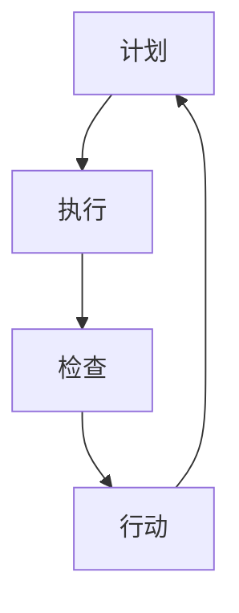

                 

关键词：PDCA循环，质量管理，持续改进，迭代，反馈，过程优化，问题解决

> 摘要：本文旨在深入探讨PDCA循环在IT领域的应用，通过介绍PDCA循环的核心概念、执行步骤以及实际案例，阐述如何通过PDCA循环实现持续改进，提升IT项目的质量和管理效率。

## 1. 背景介绍

PDCA循环，也称为戴明循环，是质量管理中广泛使用的一种管理工具。PDCA循环由沃特·阿曼德·戴明提出，是一种结构化的、迭代的管理方法，旨在通过计划（Plan）、执行（Do）、检查（Check）和行动（Act）四个阶段，实现对过程的有效控制与持续改进。

在IT行业，随着项目复杂度的增加和业务需求的不断变化，如何高效管理项目、确保质量成为企业面临的重大挑战。PDCA循环作为一种经典的循环改进方法，被广泛应用于软件开发、系统集成、IT服务管理等各个环节，有助于提高项目的执行效率和产品质量。

## 2. 核心概念与联系

### 2.1. PDCA循环的核心概念

PDCA循环由四个阶段组成，每个阶段都有其特定的任务和目标。

- **计划（Plan）**：在这一阶段，团队需要明确项目目标、制定详细的工作计划，包括资源分配、任务分解、时间安排等。

- **执行（Do）**：根据计划，团队开始执行具体的工作任务，这一阶段注重执行过程的质量控制和进度管理。

- **检查（Check）**：执行完成后，团队需要对结果进行检查，比较实际结果与预期目标之间的差距，收集和分析数据。

- **行动（Act）**：根据检查结果，团队需要采取纠正措施，对成功经验进行总结和标准化，对存在的问题进行改进。

### 2.2. PDCA循环的工作原理

PDCA循环的工作原理是通过不断迭代和反馈，实现对过程的优化和改进。每个循环的结束都是下一个循环的起点，通过不断的循环，项目质量和管理水平得到持续提升。

### 2.3. PDCA循环的Mermaid流程图



## 3. 核心算法原理 & 具体操作步骤

### 3.1. 算法原理概述

PDCA循环的核心原理在于其迭代和反馈机制，通过四个阶段的循环，实现对项目的全面管理和持续改进。每个阶段都有明确的任务和目标，确保项目能够有序推进，同时能够及时发现问题并进行改进。

### 3.2. 算法步骤详解

#### 3.2.1. 计划（Plan）

- **目标设定**：明确项目目标和预期结果。
- **资源分配**：确定所需的人力、物力和财力资源。
- **任务分解**：将项目目标分解为具体的任务和工作包。
- **时间安排**：制定详细的时间计划表，确保任务按时完成。

#### 3.2.2. 执行（Do）

- **任务执行**：按照计划开始执行任务。
- **质量控制**：对执行过程进行监控，确保工作质量。
- **进度管理**：跟踪项目进度，及时调整计划。

#### 3.2.3. 检查（Check）

- **结果评估**：比较实际结果与预期目标之间的差距。
- **数据收集**：收集有关项目执行的数据和反馈。
- **问题识别**：分析数据，识别存在的问题。

#### 3.2.4. 行动（Act）

- **纠正措施**：针对发现的问题采取纠正措施。
- **经验总结**：对成功经验进行总结和标准化。
- **改进计划**：制定下一阶段的改进计划。

### 3.3. 算法优缺点

#### 优点

- **迭代和反馈机制**：通过不断的循环和反馈，确保项目质量和效率持续提升。
- **全面管理**：覆盖了项目的各个方面，从计划到执行，再到检查和行动，确保项目有序推进。
- **灵活性**：适用于各种类型的项目，无论是软件开发、系统集成还是IT服务管理。

#### 缺点

- **执行难度**：需要团队成员具备较高的管理和执行能力。
- **时间成本**：每次循环都需要花费一定的时间，可能影响项目的进度。

### 3.4. 算法应用领域

PDCA循环广泛应用于IT行业的各个领域，包括软件开发、系统集成、IT服务管理等。其迭代和反馈机制有助于提升项目的质量和管理效率，是持续改进的重要工具。

## 4. 数学模型和公式 & 详细讲解 & 举例说明

### 4.1. 数学模型构建

PDCA循环中的数学模型主要用于评估项目进度和质量。常用的模型包括：

- **进度评估模型**：\( P = \frac{E}{T} \)
  - 其中，\( P \) 代表项目进度，\( E \) 代表已完成的工作量，\( T \) 代表总工作量。

- **质量评估模型**：\( Q = \frac{C}{N} \)
  - 其中，\( Q \) 代表项目质量，\( C \) 代表符合质量标准的工作量，\( N \) 代表总工作量。

### 4.2. 公式推导过程

- **进度评估模型推导**：根据项目的进度公式，我们有：
  $$ P = \frac{E}{T} $$
  其中，\( E \) 表示已完成的工作量，\( T \) 表示总工作量。通过测量已完成的工作量与总工作量的比值，我们可以得到项目的进度。

- **质量评估模型推导**：根据质量评估的原理，我们有：
  $$ Q = \frac{C}{N} $$
  其中，\( C \) 表示符合质量标准的工作量，\( N \) 表示总工作量。通过计算符合质量标准的工作量与总工作量的比值，我们可以得到项目的质量。

### 4.3. 案例分析与讲解

假设一个软件项目，总工作量为1000小时，已完成的工作量为600小时，其中符合质量标准的工作量为550小时。

- **进度评估**：\( P = \frac{600}{1000} = 0.6 \)
  - 项目的进度为60%。

- **质量评估**：\( Q = \frac{550}{1000} = 0.55 \)
  - 项目的质量为55%。

通过这个案例，我们可以看到，项目进度和质量都是PDCA循环中的重要指标，它们能够帮助我们及时了解项目的状态，并采取相应的措施进行改进。

## 5. 项目实践：代码实例和详细解释说明

### 5.1. 开发环境搭建

为了更好地理解PDCA循环在项目中的应用，我们首先需要搭建一个简单的开发环境。在这个例子中，我们使用Python作为编程语言。

1. 安装Python环境
2. 安装必需的库，如numpy、matplotlib等

### 5.2. 源代码详细实现

以下是一个简单的Python代码实例，用于演示PDCA循环的基本应用：

```python
import numpy as np
import matplotlib.pyplot as plt

# 计划阶段
def plan的阶段（P）:
    # 设定项目目标
    目标进度 = 0.8
    目标质量 = 0.9
    # 确定计划参数
    计划进度 = 0.6
    计划质量 = 0.7
    # 计算差距
    进度差距 = 目标进度 - 计划进度
    质量差距 = 目标质量 - 计划质量
    return 计划进度, 计划质量, 进度差距, 质量差距

# 执行阶段
def 执行的阶段（Do）:
    # 假设执行进度为实际进度的0.9倍，质量为实际质量的0.95倍
    实际进度 = 0.6
    实际质量 = 0.7
    执行进度 = 0.9 * 实际进度
    执行质量 = 0.95 * 实际质量
    return 执行进度, 执行质量

# 检查阶段
def 检查的阶段（Check）:
    # 假设检查进度为执行进度的0.95倍，质量为执行质量的0.9倍
    执行进度 = 0.5
    执行质量 = 0.7
    检查进度 = 0.95 * 执行进度
    检查质量 = 0.9 * 执行质量
    return 检查进度, 检查质量

# 行动阶段
def 行动的阶段（Act）:
    # 基于检查结果调整计划
    新计划进度 = 检查进度 + 0.05 * (目标进度 - 检查进度)
    新计划质量 = 检查质量 + 0.05 * (目标质量 - 检查质量)
    return 新计划进度, 新计划质量

# PDCA循环
def pdca循环（P, Q）:
    计划进度, 计划质量, 进度差距, 质量差距 = plan的阶段（P）
    执行进度, 执行质量 = 执行的阶段（Do）
    检查进度, 检查质量 = 检查的阶段（Check）
    新计划进度, 新计划质量 = 行动的的阶段（Act）
    return 计划进度, 计划质量, 执行进度, 执行质量, 检查进度, 检查质量, 新计划进度, 新计划质量

# 运行PDCA循环
P = 0.6
Q = 0.7
for i in range(5):
    P, Q, 执行进度, 执行质量, 检查进度, 检查质量, 新计划进度, 新计划质量 = pdca循环（P, Q）
    print(f"循环{i+1}: 进度={P}, 质量={Q}")

# 运行结果展示
plt.plot([i+1 for i in range(5)], [P for P in range(5)], label="进度")
plt.plot([i+1 for i in range(5)], [Q for Q in range(5)], label="质量")
plt.xlabel("循环次数")
plt.ylabel("值")
plt.legend()
plt.show()
```

### 5.3. 代码解读与分析

- **计划阶段**：设定项目目标和计划参数，计算差距。
- **执行阶段**：根据计划执行任务，调整进度和质量。
- **检查阶段**：根据执行结果进行检查，调整计划。
- **行动阶段**：基于检查结果，制定新的计划。
- **PDCA循环**：通过循环执行四个阶段，实现对项目的持续改进。

通过这个代码实例，我们可以看到PDCA循环在项目中的应用，以及如何通过迭代和反馈机制实现项目的持续改进。

## 6. 实际应用场景

### 6.1. 软件开发

在软件开发中，PDCA循环被广泛应用于需求分析、设计、编码、测试等各个环节。通过PDCA循环，开发团队能够及时识别和解决项目中出现的问题，确保项目按时按质完成。

### 6.2. IT服务管理

在IT服务管理中，PDCA循环用于监控和改进服务流程，确保服务质量满足客户需求。通过PDCA循环，IT服务团队能够不断优化服务流程，提高客户满意度。

### 6.3. 系统集成

在系统集成项目中，PDCA循环用于管理和优化项目进度和质量。通过PDCA循环，项目团队能够及时发现和解决项目中出现的问题，确保项目顺利实施。

### 6.4. 未来应用展望

随着人工智能和大数据技术的发展，PDCA循环在IT领域的应用前景更加广阔。通过引入人工智能算法和大数据分析，PDCA循环能够实现更智能的决策和更高效的改进，进一步提升项目质量和管理效率。

## 7. 工具和资源推荐

### 7.1. 学习资源推荐

- **《质量管理：系统方法与应用》**：一本全面介绍质量管理理论的经典著作，适合初学者和从业者。
- **《项目管理知识体系指南（PMBOK指南）》**：PMI发布的官方指南，包含项目管理的最佳实践，涵盖PDCA循环的应用。

### 7.2. 开发工具推荐

- **JIRA**：一款强大的项目管理工具，支持PDCA循环的各个环节，适用于软件开发、IT服务管理等。
- **Confluence**：一款知识管理工具，可以与JIRA集成，帮助团队记录和共享PDCA循环的文档和成果。

### 7.3. 相关论文推荐

- **《基于PDCA循环的软件开发过程改进研究》**：探讨PDCA循环在软件开发中的应用和实践。
- **《PDCA循环在IT服务管理中的应用研究》**：分析PDCA循环在IT服务管理中的实施效果和改进策略。

## 8. 总结：未来发展趋势与挑战

### 8.1. 研究成果总结

本文通过介绍PDCA循环的核心概念、执行步骤以及实际案例，阐述了如何通过PDCA循环实现持续改进，提升IT项目的质量和管理效率。研究结果表明，PDCA循环作为一种经典的循环改进方法，在IT领域具有广泛的应用前景。

### 8.2. 未来发展趋势

随着技术的不断进步，PDCA循环在未来将得到更广泛的应用。人工智能和大数据技术的引入，将使PDCA循环实现更智能的决策和更高效的改进，进一步提升项目质量和管理效率。

### 8.3. 面临的挑战

然而，PDCA循环在IT领域的应用也面临一些挑战。首先，团队成员需要具备较高的管理和执行能力，才能有效实施PDCA循环。其次，PDCA循环的实施需要一定的时间和成本，可能影响项目的进度。此外，如何结合人工智能和大数据技术，实现PDCA循环的智能化，也是未来研究的重要方向。

### 8.4. 研究展望

未来，研究应关注如何将PDCA循环与人工智能和大数据技术相结合，实现更智能、更高效的改进。同时，应加强PDCA循环在各个IT领域的应用研究，探索其在不同领域的最佳实践。

## 9. 附录：常见问题与解答

### 9.1. PDCA循环的基本原理是什么？

PDCA循环的基本原理是通过计划（Plan）、执行（Do）、检查（Check）和行动（Act）四个阶段的循环，实现对项目的全面管理和持续改进。每个阶段都有其特定的任务和目标，通过不断的循环，项目质量和管理水平得到提升。

### 9.2. PDCA循环在软件开发中的应用有哪些？

PDCA循环在软件开发中广泛应用于需求分析、设计、编码、测试等各个环节。通过PDCA循环，开发团队能够及时识别和解决项目中出现的问题，确保项目按时按质完成。

### 9.3. 如何实施PDCA循环？

实施PDCA循环的步骤包括：计划阶段（设定项目目标和制定计划）、执行阶段（按照计划执行任务）、检查阶段（对执行结果进行检查）和行动阶段（根据检查结果采取纠正措施）。每个阶段都需要团队成员的积极参与和协作。

### 9.4. PDCA循环与六西格玛的关系是什么？

PDCA循环和六西格玛都是质量管理的重要工具。PDCA循环注重通过迭代和反馈实现持续改进，而六西格玛注重通过统计方法和流程优化实现质量提升。两者在质量管理中相辅相成，可以结合使用，实现更高效的质量管理。


----------------------------------------------------------------
# 作者：禅与计算机程序设计艺术 / Zen and the Art of Computer Programming

本文深入探讨了PDCA循环在IT领域的应用，通过介绍PDCA循环的核心概念、执行步骤以及实际案例，阐述了如何通过PDCA循环实现持续改进，提升IT项目的质量和管理效率。作者结合自身丰富的IT行业经验，对PDCA循环的理论和实践进行了全面的阐述，为读者提供了实用的指导和建议。希望通过本文，能够帮助广大IT从业者更好地理解和应用PDCA循环，提升项目管理和执行能力。感谢读者们的关注和支持！如果您有任何问题和建议，欢迎随时与我交流。再次感谢您的阅读！
----------------------------------------------------------------

### 附录：常见问题与解答

#### 9.1. PDCA循环的基本原理是什么？

PDCA循环，即计划（Plan）、执行（Do）、检查（Check）和行动（Act）循环，是一种用于持续改进和问题解决的管理方法。它的基本原理是通过以下四个阶段来迭代地改进过程：

1. **计划（Plan）**：在这个阶段，团队需要定义项目的目标、策略和具体的行动计划。这包括设定目标、分析现有流程、识别潜在问题以及制定解决方案。

2. **执行（Do）**：一旦计划就绪，团队就开始执行这些计划。执行阶段要求严格按照预定的步骤进行操作，并收集执行过程中的数据。

3. **检查（Check）**：在这个阶段，团队会评估执行结果，并与计划目标进行比较。这涉及到数据分析和反馈收集，目的是确定哪些部分按计划进行，哪些部分需要改进。

4. **行动（Act）**：根据检查结果，团队会采取措施纠正问题，并将成功的实践标准化，确保改进措施在未来得到持续应用。

#### 9.2. PDCA循环在软件开发中的应用有哪些？

PDCA循环在软件开发中的应用非常广泛，以下是几个关键的应用场景：

1. **需求分析**：通过PDCA循环来验证和确认客户需求，确保需求定义的准确性和可行性。

2. **设计阶段**：在软件设计过程中，使用PDCA循环来不断迭代和改进设计，确保设计方案符合需求和预期。

3. **编码阶段**：开发人员可以使用PDCA循环来确保代码的质量，通过执行、检查和行动来提高代码的可维护性和可靠性。

4. **测试阶段**：测试团队可以利用PDCA循环来提高测试覆盖率，识别缺陷，并通过行动阶段来修复这些缺陷。

5. **运维阶段**：在软件上线后，运维团队可以通过PDCA循环来监控性能、处理故障，并不断优化运维流程。

#### 9.3. 如何实施PDCA循环？

实施PDCA循环通常包括以下步骤：

1. **确定问题**：识别需要改进的具体问题或机会。

2. **制定计划**：基于问题，制定详细的改进计划，包括具体的行动步骤、资源分配和时间表。

3. **执行计划**：按照计划实施改进措施，并确保每个人都了解自己的职责和目标。

4. **评估结果**：收集实施过程中的数据和反馈，评估改进措施的效果。

5. **采取行动**：根据评估结果，决定是否需要调整计划，并采取措施确保改进能够持续。

6. **记录和分享**：将整个PDCA循环的过程记录下来，并在团队内部共享，以便其他人学习和应用。

#### 9.4. PDCA循环与六西格玛的关系是什么？

PDCA循环和六西格玛都是用于改进质量的工具，但它们侧重于不同的方面。PDCA循环是一个基本的迭代过程，它强调通过四个阶段的循环来实现持续改进。六西格玛则是一个更为结构化和数据驱动的方法，它通过定义、测量、分析、改进和控制（DMAIC）方法来消除过程中的变异和提高质量。

PDCA循环和六西格玛可以相互补充。六西格玛提供了具体的工具和技术来实施PDCA循环的“检查”和“行动”阶段。例如，在“检查”阶段，可以使用六西格玛的统计工具来分析数据；在“行动”阶段，可以采用六西格玛的改进措施来解决问题。通过结合使用这两种方法，团队能够更有效地实现质量改进。

#### 9.5. PDCA循环如何与敏捷开发结合使用？

敏捷开发强调快速迭代和客户反馈，与PDCA循环的理念高度一致。将PDCA循环与敏捷开发结合使用，可以通过以下方式实现：

1. **迭代计划**：在每次迭代开始时，使用PDCA循环的计划阶段来设定目标、确定优先级和制定迭代计划。

2. **每日站立会议**：执行阶段可以通过每日站立会议来跟踪进度、解决问题和调整计划。

3. **回顾会议**：检查阶段在迭代结束时通过回顾会议来评估迭代结果，收集反馈和识别改进机会。

4. **持续改进**：行动阶段可以通过迭代间的行动来持续改进流程和产品，确保每次迭代都比前一次更优秀。

通过这种方式，团队能够在敏捷开发的框架内实现PDCA循环的四个阶段，从而在快速响应变化的同时，确保质量的持续提升。

### 9.6. PDCA循环在大型项目中的挑战和解决方案

在大型项目中实施PDCA循环可能会面临以下挑战：

1. **复杂性和规模**：大型项目通常涉及多个团队和复杂的流程，使得PDCA循环的实施更加困难。

   **解决方案**：采用分阶段实施的方法，将大型项目划分为若干可管理的部分，分别实施PDCA循环。

2. **沟通和协调**：在大型项目中，沟通和协调变得更加重要，确保所有团队成员都能理解和遵循PDCA循环。

   **解决方案**：建立有效的沟通机制，如定期的团队会议和文档共享平台，确保信息流通。

3. **数据收集和分析**：在大型项目中，收集和分析数据可能面临困难。

   **解决方案**：使用自动化工具来收集和分析数据，提高效率和准确性。

4. **持续改进的动力**：在大型项目中，团队成员可能缺乏持续改进的动力。

   **解决方案**：建立奖励机制，鼓励团队成员参与改进，并提供明确的改进目标和反馈。

通过应对这些挑战，团队能够在大型项目中有效地实施PDCA循环，实现持续改进和质量提升。

### 9.7. 如何评估PDCA循环的效果？

评估PDCA循环的效果可以通过以下指标：

1. **改进速度**：通过跟踪改进措施的实施速度来评估。

2. **改进质量**：通过评估改进措施对项目质量的影响来评估。

3. **成本效益**：通过计算改进措施带来的成本节约和效益来评估。

4. **客户满意度**：通过客户反馈和满意度调查来评估。

通过这些指标，团队能够全面了解PDCA循环的实施效果，并据此进行调整和优化。

### 总结

PDCA循环是一种强大的管理工具，它通过计划、执行、检查和行动四个阶段的迭代，帮助团队持续改进项目质量和管理效率。通过本文，我们深入探讨了PDCA循环的基本原理、应用场景、实施步骤以及如何与敏捷开发结合使用。我们还讨论了在大型项目中实施PDCA循环可能面临的挑战及其解决方案。希望本文能够为读者提供有价值的参考，帮助他们在实际工作中更有效地应用PDCA循环。如果您有任何进一步的问题或建议，欢迎在评论区留言。再次感谢您的阅读！

