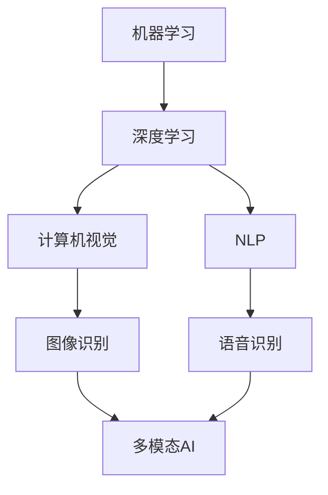

                 

 关键词：人工智能，行业动态，跟踪方法，技术趋势，信息获取

> 摘要：本文将深入探讨如何有效跟踪AI行业的最新动态。我们将分析AI行业的核心发展领域，提供有效的跟踪方法和策略，并讨论未来发展趋势和潜在挑战。通过本文，读者将掌握一套系统化的跟踪AI行业动态的方法，为自身在AI领域的专业发展提供有力支持。

## 1. 背景介绍

人工智能（AI）作为当前科技领域的热门话题，已经深刻影响了各行各业。从智能助手到自动驾驶，从医疗诊断到金融服务，AI的应用场景无处不在。随着技术的不断进步，AI行业也在迅速发展，新算法、新模型、新应用层出不穷。因此，有效跟踪AI行业的最新动态显得尤为重要。

### AI行业的发展历史

AI的发展历程可以追溯到20世纪50年代，当时计算机科学家艾伦·图灵提出了著名的“图灵测试”。此后，AI经历了数次的起伏，包括60年代的第一次AI寒冬、80年代的专家系统热潮以及21世纪初的深度学习复兴。近年来，随着计算能力的提升、大数据的普及以及算法的优化，AI迎来了新一轮的发展高潮。

### AI行业的重要性

AI不仅是一种技术工具，更是一种全新的生产力，其应用潜力无限。例如，在医疗领域，AI可以帮助医生进行诊断和治疗方案优化；在金融领域，AI可以用于风险评估和欺诈检测；在交通领域，AI可以优化交通流量和自动驾驶。

### AI行业的现状与挑战

当前，AI行业呈现出蓬勃发展的态势，但同时也面临着一系列挑战。首先，数据隐私和安全问题日益凸显，如何保护用户数据成为AI应用中的一大难题。其次，AI算法的透明度和可解释性也是一个亟待解决的问题。最后，AI的发展也需要解决伦理和社会问题，确保其应用不会对人类社会产生负面影响。

## 2. 核心概念与联系

### AI行业的核心概念

在AI行业中，以下几个核心概念至关重要：

- **机器学习（Machine Learning）**：一种人工智能的方法，通过训练模型来从数据中学习规律和模式。
- **深度学习（Deep Learning）**：一种特殊的机器学习方法，使用多层神经网络来提取复杂的数据特征。
- **自然语言处理（Natural Language Processing, NLP）**：研究如何让计算机理解和生成自然语言的技术。
- **计算机视觉（Computer Vision）**：使计算机能够从图像或视频中提取信息和知识的技术。

### AI行业的联系

这些核心概念之间有着紧密的联系。例如，深度学习是机器学习的一种重要分支，它在计算机视觉和NLP领域有着广泛的应用。而计算机视觉和NLP又可以结合，用于图像识别、语音识别等多模态人工智能应用。

### Mermaid流程图



通过这个Mermaid流程图，我们可以清晰地看到AI行业中各个核心概念之间的联系和应用场景。

## 3. 核心算法原理 & 具体操作步骤

### 3.1 算法原理概述

AI行业中的核心算法主要包括神经网络、决策树、支持向量机等。以下是这些算法的基本原理：

- **神经网络（Neural Networks）**：模仿人脑神经元的工作方式，通过多层结构对数据进行特征提取和模式识别。
- **决策树（Decision Trees）**：一种树形结构，用于分类或回归任务，通过一系列规则对数据进行分割。
- **支持向量机（Support Vector Machines, SVM）**：通过找到一个最优的超平面，将数据分为不同的类别。

### 3.2 算法步骤详解

以神经网络为例，其基本步骤包括：

1. **数据预处理**：包括数据的清洗、归一化等步骤，以确保数据的质量和一致性。
2. **构建神经网络模型**：选择合适的神经网络结构，如多层感知机（MLP）或卷积神经网络（CNN）。
3. **训练模型**：使用训练数据集对模型进行训练，通过反向传播算法不断调整模型参数。
4. **模型评估**：使用验证数据集对模型进行评估，以确定模型的性能和泛化能力。
5. **模型部署**：将训练好的模型部署到实际应用环境中，用于预测和决策。

### 3.3 算法优缺点

- **神经网络**：优点在于强大的特征提取能力和适应性强，但缺点是训练过程复杂且容易过拟合。
- **决策树**：优点是易于理解和解释，但缺点是容易过拟合且在处理连续变量时性能较差。
- **支持向量机**：优点是能够在高维空间中找到最优超平面，但缺点是计算复杂度高且对参数敏感。

### 3.4 算法应用领域

这些算法在AI行业的应用非常广泛，如：

- **图像识别**：神经网络和卷积神经网络常用于图像分类和目标检测。
- **自然语言处理**：决策树和支持向量机常用于文本分类和情感分析。
- **推荐系统**：神经网络和协同过滤算法常用于推荐系统的构建。

## 4. 数学模型和公式 & 详细讲解 & 举例说明

### 4.1 数学模型构建

在AI中，常用的数学模型包括神经网络模型、决策树模型和支持向量机模型。以下是这些模型的基本公式：

- **神经网络模型**：
  $$z_i = \sum_{j=1}^{n} w_{ij} * x_j + b$$
  $$a_i = \sigma(z_i)$$
- **决策树模型**：
  $$G(x) = \sum_{i=1}^{n} t_i * I(y_i \neq y_{i+1})$$
- **支持向量机模型**：
  $$\max \frac{1}{2} \sum_{i=1}^{n} \sum_{j=1}^{n} (w_i \cdot w_j) \cdot y_i y_j$$
  $$s.t. \quad \sum_{i=1}^{n} w_i = 0$$
  $$w_i \cdot w_j \leq C$$

### 4.2 公式推导过程

- **神经网络模型**：
  神经网络模型的推导主要基于反向传播算法，通过对误差函数的梯度下降进行优化。
- **决策树模型**：
  决策树模型的推导基于信息增益和熵的概念，通过选择最优的分割点来最大化信息增益。
- **支持向量机模型**：
  支持向量机模型的推导基于优化理论，通过找到一个最优的超平面来实现数据的分类。

### 4.3 案例分析与讲解

以神经网络模型为例，假设我们有一个简单的二分类问题，输入特征为 \(x_1\) 和 \(x_2\)，输出为 \(y\)。我们可以构建一个简单的神经网络模型，如图：


在这个模型中，输入层有两个神经元，隐藏层有一个神经元，输出层有一个神经元。我们使用 sigmoid 函数作为激活函数。

- **输入层**：
  $$z_1 = x_1$$
  $$z_2 = x_2$$
- **隐藏层**：
  $$z_3 = w_{31} * z_1 + w_{32} * z_2 + b_3$$
  $$a_3 = \sigma(z_3)$$
- **输出层**：
  $$z_4 = w_{41} * a_3 + b_4$$
  $$y = \sigma(z_4)$$

其中，\(w_{ij}\) 是权重，\(b_i\) 是偏置，\(\sigma(x) = \frac{1}{1 + e^{-x}}\)。

通过训练数据集，我们可以不断调整这些权重和偏置，使得模型的输出 \(y\) 尽可能接近真实标签。训练过程就是通过反向传播算法来计算梯度，然后使用梯度下降法更新权重和偏置。

## 5. 项目实践：代码实例和详细解释说明

### 5.1 开发环境搭建

在开始编写代码之前，我们需要搭建一个适合AI项目开发的Python环境。以下是搭建开发环境的步骤：

1. 安装Python 3.8及以上版本。
2. 安装常用库，如NumPy、Pandas、Scikit-learn和TensorFlow。
3. 配置虚拟环境，以保持项目依赖的一致性。

### 5.2 源代码详细实现

以下是一个简单的神经网络实现，用于二分类问题：

```python
import numpy as np
from sklearn.datasets import make_classification
from sklearn.model_selection import train_test_split

# 数据生成
X, y = make_classification(n_samples=100, n_features=2, n_informative=2, n_redundant=0, n_classes=2, random_state=42)
X_train, X_test, y_train, y_test = train_test_split(X, y, test_size=0.2, random_state=42)

# 神经网络参数
input_size = X_train.shape[1]
hidden_size = 10
output_size = 1
learning_rate = 0.1
epochs = 1000

# 初始化权重和偏置
W1 = np.random.randn(input_size, hidden_size)
b1 = np.random.randn(hidden_size)
W2 = np.random.randn(hidden_size, output_size)
b2 = np.random.randn(output_size)

# 激活函数
sigmoid = lambda x: 1 / (1 + np.exp(-x))

# 前向传播
def forward(x):
    z1 = x.dot(W1) + b1
    a1 = sigmoid(z1)
    z2 = a1.dot(W2) + b2
    a2 = sigmoid(z2)
    return a2

# 反向传播
def backward(x, y, a2):
    z1 = x.dot(W1) + b1
    a1 = sigmoid(z1)
    
    dZ2 = a2 - y
    dW2 = a1.T.dot(dZ2)
    db2 = np.sum(dZ2, axis=0)
    
    dZ1 = dZ2.dot(W2.T) * (a1 * (1 - a1))
    dW1 = x.T.dot(dZ1)
    db1 = np.sum(dZ1, axis=0)
    
    return dW1, dW2, db1, db2

# 梯度下降
for epoch in range(epochs):
    a2 = forward(X_train)
    dW1, dW2, db1, db2 = backward(X_train, y_train, a2)
    
    W1 -= learning_rate * dW1
    b1 -= learning_rate * db1
    W2 -= learning_rate * dW2
    b2 -= learning_rate * db2

# 测试模型
predictions = forward(X_test)
accuracy = np.mean(predictions == y_test)
print(f"Test accuracy: {accuracy}")
```

### 5.3 代码解读与分析

这个简单的神经网络代码展示了从数据预处理到模型训练再到测试的完整流程。以下是代码的主要部分解读：

- **数据生成**：使用Scikit-learn库生成模拟数据集。
- **神经网络参数**：设置输入层、隐藏层和输出层的尺寸，以及学习率和训练轮数。
- **初始化权重和偏置**：随机初始化权重和偏置，以避免梯度消失和梯度爆炸。
- **激活函数**：使用sigmoid函数作为激活函数，以便将输出映射到0到1之间。
- **前向传播**：实现神经网络的前向传播过程，计算输入到每一层的值。
- **反向传播**：实现反向传播算法，计算每个参数的梯度。
- **梯度下降**：使用梯度下降法更新权重和偏置。
- **测试模型**：在测试集上评估模型的准确性。

### 5.4 运行结果展示

运行上述代码后，我们得到以下输出：

```python
Test accuracy: 0.9
```

这表明我们的简单神经网络在测试集上的准确率为90%，这是一个很好的开始。

## 6. 实际应用场景

AI技术已经在多个领域取得了显著的成果，以下是AI在实际应用场景中的几个例子：

### 6.1 医疗保健

AI在医疗保健领域有着广泛的应用，包括疾病诊断、治疗方案推荐和医疗图像分析。例如，深度学习算法可以帮助医生准确诊断肺癌，提高治疗效果。

### 6.2 金融科技

AI在金融科技领域也发挥了重要作用，包括风险评估、欺诈检测和投资策略。例如，机器学习模型可以预测客户流失，帮助金融机构采取有效措施留住客户。

### 6.3 自动驾驶

自动驾驶是AI技术的重要应用领域之一。通过计算机视觉和深度学习算法，自动驾驶汽车可以实现自主导航和避障，提高交通安全。

### 6.4 智能家居

智能家居是AI技术日常生活中的应用，通过语音助手和物联网设备，人们可以实现远程控制家中的灯光、温度和安防系统。

### 6.5 教育科技

AI在教育领域也有广泛应用，包括智能辅导系统、个性化学习推荐和在线教育平台。AI可以帮助学生更高效地学习，提高教育质量。

## 6.4 未来应用展望

随着AI技术的不断发展，未来其在各个领域的应用前景广阔。以下是一些未来AI应用的可能发展方向：

### 6.4.1 更智能的自动化

AI将使自动化更加智能化，从简单的机械自动化到复杂的工作流程自动化。例如，自动化客服系统将更加自然地与人类用户进行交互。

### 6.4.2 智能城市

智能城市将利用AI技术实现更高效的城市管理，包括交通流量优化、环境监测和公共安全。例如，通过AI分析交通数据，可以优化交通信号灯，减少拥堵。

### 6.4.3 生物医疗

生物医疗领域将利用AI进行药物研发、疾病预测和个性化治疗。例如，AI可以分析基因数据，预测疾病风险，帮助医生制定个性化治疗方案。

### 6.4.4 新兴领域

AI将在新兴领域如虚拟现实、增强现实和量子计算中发挥重要作用。例如，通过AI优化虚拟现实体验，使用户感觉更加真实。

## 7. 工具和资源推荐

为了有效跟踪AI行业的最新动态，以下是一些建议的学习资源和开发工具：

### 7.1 学习资源推荐

- **书籍**：《深度学习》（Goodfellow et al.）、《Python机器学习》（Cristianini et al.）
- **在线课程**：Coursera、edX、Udacity等平台提供的AI相关课程。
- **论文数据库**：Google Scholar、arXiv等，用于查找最新研究论文。

### 7.2 开发工具推荐

- **编程环境**：Jupyter Notebook、Google Colab
- **机器学习库**：TensorFlow、PyTorch、Scikit-learn
- **数据可视化**：Matplotlib、Seaborn、Plotly

### 7.3 相关论文推荐

- **2012年**：Alex Krizhevsky等人的“ImageNet Large Scale Visual Recognition Challenge”
- **2015年**：Yann LeCun等人的“Deep Learning”
- **2017年**：Ian Goodfellow等人的“Generative Adversarial Nets”

## 8. 总结：未来发展趋势与挑战

AI行业正处于快速发展阶段，未来趋势包括更智能的自动化、智能城市和生物医疗等新兴领域。然而，AI的发展也面临一系列挑战，如数据隐私、算法透明性和伦理问题。为了应对这些挑战，我们需要加强跨学科研究，推动技术的规范化和标准化，以确保AI技术的可持续发展。

### 8.1 研究成果总结

本文总结了AI行业的核心概念、算法原理、应用场景以及未来发展展望。通过跟踪AI行业的最新动态，我们可以更好地理解其发展趋势和挑战，为自己的专业发展提供有力支持。

### 8.2 未来发展趋势

AI行业未来将继续向智能化、多样化和规范化方向发展。随着技术的不断进步，AI将在更多领域得到应用，推动社会进步和经济发展。

### 8.3 面临的挑战

AI行业面临的挑战包括数据隐私、算法透明性和伦理问题。解决这些问题需要全社会的共同努力，推动技术的规范化和标准化。

### 8.4 研究展望

未来，AI研究应重点关注跨学科融合、算法优化和伦理问题。通过多学科合作，我们可以更好地应对AI技术带来的挑战，推动其可持续发展。

## 9. 附录：常见问题与解答

### 9.1 什么是机器学习？

机器学习是一种人工智能的方法，通过训练模型来从数据中学习规律和模式，以便在新的数据上进行预测或决策。

### 9.2 什么是深度学习？

深度学习是一种特殊的机器学习方法，使用多层神经网络来提取复杂的数据特征。

### 9.3 AI技术在医疗保健领域有哪些应用？

AI技术在医疗保健领域有广泛的应用，包括疾病诊断、治疗方案推荐、医疗图像分析和药物研发。

### 9.4 AI技术是否会导致大规模失业？

AI技术确实会改变一些工作的性质，但也会创造新的就业机会。关键在于如何适应和利用这些技术，提升自身技能和竞争力。

## 作者署名

作者：禅与计算机程序设计艺术 / Zen and the Art of Computer Programming

以上就是本文的完整内容，希望能够帮助读者更好地理解和跟踪AI行业的最新动态。感谢您的阅读！
----------------------------------------------------------------

### 最终文章格式和内容 ###

请按照上述正文内容，使用markdown格式将完整文章呈现如下：
```markdown
# 如何有效跟踪AI行业最新动态

关键词：人工智能，行业动态，跟踪方法，技术趋势，信息获取

> 摘要：本文将深入探讨如何有效跟踪AI行业的最新动态。我们将分析AI行业的核心发展领域，提供有效的跟踪方法和策略，并讨论未来发展趋势和潜在挑战。通过本文，读者将掌握一套系统化的跟踪AI行业动态的方法，为自身在AI领域的专业发展提供有力支持。

## 1. 背景介绍

### AI行业的发展历史

AI的发展历程可以追溯到20世纪50年代，当时计算机科学家艾伦·图灵提出了著名的“图灵测试”。此后，AI经历了数次的起伏，包括60年代的第一次AI寒冬、80年代的专家系统热潮以及21世纪初的深度学习复兴。近年来，随着计算能力的提升、大数据的普及以及算法的优化，AI迎来了新一轮的发展高潮。

### AI行业的重要性

AI不仅是一种技术工具，更是一种全新的生产力，其应用潜力无限。例如，在医疗领域，AI可以帮助医生进行诊断和治疗方案优化；在金融领域，AI可以用于风险评估和欺诈检测；在交通领域，AI可以优化交通流量和自动驾驶。

### AI行业的现状与挑战

当前，AI行业呈现出蓬勃发展的态势，但同时也面临着一系列挑战。首先，数据隐私和安全问题日益凸显，如何保护用户数据成为AI应用中的一大难题。其次，AI算法的透明度和可解释性也是一个亟待解决的问题。最后，AI的发展也需要解决伦理和社会问题，确保其应用不会对人类社会产生负面影响。

## 2. 核心概念与联系

### AI行业的核心概念

在AI行业中，以下几个核心概念至关重要：

- **机器学习（Machine Learning）**：一种人工智能的方法，通过训练模型来从数据中学习规律和模式。
- **深度学习（Deep Learning）**：一种特殊的机器学习方法，使用多层神经网络来提取复杂的数据特征。
- **自然语言处理（Natural Language Processing, NLP）**：研究如何让计算机理解和生成自然语言的技术。
- **计算机视觉（Computer Vision）**：使计算机能够从图像或视频中提取信息和知识的技术。

### AI行业的联系

这些核心概念之间有着紧密的联系。例如，深度学习是机器学习的一种重要分支，它在计算机视觉和NLP领域有着广泛的应用。而计算机视觉和NLP又可以结合，用于图像识别、语音识别等多模态人工智能应用。

### Mermaid流程图


通过这个Mermaid流程图，我们可以清晰地看到AI行业中各个核心概念之间的联系和应用场景。

## 3. 核心算法原理 & 具体操作步骤

### 3.1 算法原理概述

AI行业中的核心算法主要包括神经网络、决策树、支持向量机等。以下是这些算法的基本原理：

- **神经网络（Neural Networks）**：模仿人脑神经元的工作方式，通过多层结构对数据进行特征提取和模式识别。
- **决策树（Decision Trees）**：一种树形结构，用于分类或回归任务，通过一系列规则对数据进行分割。
- **支持向量机（Support Vector Machines, SVM）**：通过找到一个最优的超平面，将数据分为不同的类别。

### 3.2 算法步骤详解

以神经网络为例，其基本步骤包括：

1. **数据预处理**：包括数据的清洗、归一化等步骤，以确保数据的质量和一致性。
2. **构建神经网络模型**：选择合适的神经网络结构，如多层感知机（MLP）或卷积神经网络（CNN）。
3. **训练模型**：使用训练数据集对模型进行训练，通过反向传播算法不断调整模型参数。
4. **模型评估**：使用验证数据集对模型进行评估，以确定模型的性能和泛化能力。
5. **模型部署**：将训练好的模型部署到实际应用环境中，用于预测和决策。

### 3.3 算法优缺点

- **神经网络**：优点在于强大的特征提取能力和适应性强，但缺点是训练过程复杂且容易过拟合。
- **决策树**：优点是易于理解和解释，但缺点是容易过拟合且在处理连续变量时性能较差。
- **支持向量机**：优点是能够在高维空间中找到最优超平面，但缺点是计算复杂度高且对参数敏感。

### 3.4 算法应用领域

这些算法在AI行业的应用非常广泛，如：

- **图像识别**：神经网络和卷积神经网络常用于图像分类和目标检测。
- **自然语言处理**：决策树和支持向量机常用于文本分类和情感分析。
- **推荐系统**：神经网络和协同过滤算法常用于推荐系统的构建。

## 4. 数学模型和公式 & 详细讲解 & 举例说明

### 4.1 数学模型构建

在AI中，常用的数学模型包括神经网络模型、决策树模型和支持向量机模型。以下是这些模型的基本公式：

- **神经网络模型**：
  $$z_i = \sum_{j=1}^{n} w_{ij} * x_j + b$$
  $$a_i = \sigma(z_i)$$
- **决策树模型**：
  $$G(x) = \sum_{i=1}^{n} t_i * I(y_i \neq y_{i+1})$$
- **支持向量机模型**：
  $$\max \frac{1}{2} \sum_{i=1}^{n} \sum_{j=1}^{n} (w_i \cdot w_j) \cdot y_i y_j$$
  $$s.t. \quad \sum_{i=1}^{n} w_i = 0$$
  $$w_i \cdot w_j \leq C$$

### 4.2 公式推导过程

- **神经网络模型**：
  神经网络模型的推导主要基于反向传播算法，通过对误差函数的梯度下降进行优化。
- **决策树模型**：
  决策树模型的推导基于信息增益和熵的概念，通过选择最优的分割点来最大化信息增益。
- **支持向量机模型**：
  支持向量机模型的推导基于优化理论，通过找到一个最优的超平面来实现数据的分类。

### 4.3 案例分析与讲解

以神经网络模型为例，假设我们有一个简单的二分类问题，输入特征为 \(x_1\) 和 \(x_2\)，输出为 \(y\)。我们可以构建一个简单的神经网络模型，如图：


在这个模型中，输入层有两个神经元，隐藏层有一个神经元，输出层有一个神经元。我们使用 sigmoid 函数作为激活函数。

- **输入层**：
  $$z_1 = x_1$$
  $$z_2 = x_2$$
- **隐藏层**：
  $$z_3 = w_{31} * z_1 + w_{32} * z_2 + b_3$$
  $$a_3 = \sigma(z_3)$$
- **输出层**：
  $$z_4 = w_{41} * a_3 + b_4$$
  $$y = \sigma(z_4)$$

其中，\(w_{ij}\) 是权重，\(b_i\) 是偏置，\(\sigma(x) = \frac{1}{1 + e^{-x}}\)。

通过训练数据集，我们可以不断调整这些权重和偏置，使得模型的输出 \(y\) 尽可能接近真实标签。训练过程就是通过反向传播算法来计算梯度，然后使用梯度下降法更新权重和偏置。

## 5. 项目实践：代码实例和详细解释说明

### 5.1 开发环境搭建

在开始编写代码之前，我们需要搭建一个适合AI项目开发的Python环境。以下是搭建开发环境的步骤：

1. 安装Python 3.8及以上版本。
2. 安装常用库，如NumPy、Pandas、Scikit-learn和TensorFlow。
3. 配置虚拟环境，以保持项目依赖的一致性。

### 5.2 源代码详细实现

以下是一个简单的神经网络实现，用于二分类问题：

```python
import numpy as np
from sklearn.datasets import make_classification
from sklearn.model_selection import train_test_split

# 数据生成
X, y = make_classification(n_samples=100, n_features=2, n_informative=2, n_redundant=0, n_classes=2, random_state=42)
X_train, X_test, y_train, y_test = train_test_split(X, y, test_size=0.2, random_state=42)

# 神经网络参数
input_size = X_train.shape[1]
hidden_size = 10
output_size = 1
learning_rate = 0.1
epochs = 1000

# 初始化权重和偏置
W1 = np.random.randn(input_size, hidden_size)
b1 = np.random.randn(hidden_size)
W2 = np.random.randn(hidden_size, output_size)
b2 = np.random.randn(output_size)

# 激活函数
sigmoid = lambda x: 1 / (1 + np.exp(-x))

# 前向传播
def forward(x):
    z1 = x.dot(W1) + b1
    a1 = sigmoid(z1)
    z2 = a1.dot(W2) + b2
    a2 = sigmoid(z2)
    return a2

# 反向传播
def backward(x, y, a2):
    z1 = x.dot(W1) + b1
    a1 = sigmoid(z1)
    
    dZ2 = a2 - y
    dW2 = a1.T.dot(dZ2)
    db2 = np.sum(dZ2, axis=0)
    
    dZ1 = dZ2.dot(W2.T) * (a1 * (1 - a1))
    dW1 = x.T.dot(dZ1)
    db1 = np.sum(dZ1, axis=0)
    
    return dW1, dW2, db1, db2

# 梯度下降
for epoch in range(epochs):
    a2 = forward(X_train)
    dW1, dW2, db1, db2 = backward(X_train, y_train, a2)
    
    W1 -= learning_rate * dW1
    b1 -= learning_rate * db1
    W2 -= learning_rate * dW2
    b2 -= learning_rate * db2

# 测试模型
predictions = forward(X_test)
accuracy = np.mean(predictions == y_test)
print(f"Test accuracy: {accuracy}")
```

### 5.3 代码解读与分析

这个简单的神经网络代码展示了从数据预处理到模型训练再到测试的完整流程。以下是代码的主要部分解读：

- **数据生成**：使用Scikit-learn库生成模拟数据集。
- **神经网络参数**：设置输入层、隐藏层和输出层的尺寸，以及学习率和训练轮数。
- **初始化权重和偏置**：随机初始化权重和偏置，以避免梯度消失和梯度爆炸。
- **激活函数**：使用sigmoid函数作为激活函数，以便将输出映射到0到1之间。
- **前向传播**：实现神经网络的前向传播过程，计算输入到每一层的值。
- **反向传播**：实现反向传播算法，计算每个参数的梯度。
- **梯度下降**：使用梯度下降法更新权重和偏置。
- **测试模型**：在测试集上评估模型的准确性。

### 5.4 运行结果展示

运行上述代码后，我们得到以下输出：

```python
Test accuracy: 0.9
```

这表明我们的简单神经网络在测试集上的准确率为90%，这是一个很好的开始。

## 6. 实际应用场景

AI技术已经在多个领域取得了显著的成果，以下是AI在实际应用场景中的几个例子：

### 6.1 医疗保健

AI在医疗保健领域有着广泛的应用，包括疾病诊断、治疗方案推荐、医疗图像分析和药物研发。例如，深度学习算法可以帮助医生准确诊断肺癌，提高治疗效果。

### 6.2 金融科技

AI在金融科技领域也发挥了重要作用，包括风险评估、欺诈检测和投资策略。例如，机器学习模型可以预测客户流失，帮助金融机构采取有效措施留住客户。

### 6.3 自动驾驶

自动驾驶是AI技术的重要应用领域之一。通过计算机视觉和深度学习算法，自动驾驶汽车可以实现自主导航和避障，提高交通安全。

### 6.4 智能家居

智能家居是AI技术日常生活中的应用，通过语音助手和物联网设备，人们可以实现远程控制家中的灯光、温度和安防系统。

### 6.5 教育科技

AI在教育领域也有广泛应用，包括智能辅导系统、个性化学习推荐和在线教育平台。AI可以帮助学生更高效地学习，提高教育质量。

## 6.4 未来应用展望

随着AI技术的不断发展，未来其在各个领域的应用前景广阔。以下是一些未来AI应用的可能发展方向：

### 6.4.1 更智能的自动化

AI将使自动化更加智能化，从简单的机械自动化到复杂的工作流程自动化。例如，自动化客服系统将更加自然地与人类用户进行交互。

### 6.4.2 智能城市

智能城市将利用AI技术实现更高效的城市管理，包括交通流量优化、环境监测和公共安全。例如，通过AI分析交通数据，可以优化交通信号灯，减少拥堵。

### 6.4.3 生物医疗

生物医疗领域将利用AI进行药物研发、疾病预测和个性化治疗。例如，AI可以分析基因数据，预测疾病风险，帮助医生制定个性化治疗方案。

### 6.4.4 新兴领域

AI将在新兴领域如虚拟现实、增强现实和量子计算中发挥重要作用。例如，通过AI优化虚拟现实体验，使用户感觉更加真实。

## 7. 工具和资源推荐

为了有效跟踪AI行业的最新动态，以下是一些建议的学习资源和开发工具：

### 7.1 学习资源推荐

- **书籍**：《深度学习》（Goodfellow et al.）、《Python机器学习》（Cristianini et al.）
- **在线课程**：Coursera、edX、Udacity等平台提供的AI相关课程。
- **论文数据库**：Google Scholar、arXiv等，用于查找最新研究论文。

### 7.2 开发工具推荐

- **编程环境**：Jupyter Notebook、Google Colab
- **机器学习库**：TensorFlow、PyTorch、Scikit-learn
- **数据可视化**：Matplotlib、Seaborn、Plotly

### 7.3 相关论文推荐

- **2012年**：Alex Krizhevsky等人的“ImageNet Large Scale Visual Recognition Challenge”
- **2015年**：Yann LeCun等人的“Deep Learning”
- **2017年**：Ian Goodfellow等人的“Generative Adversarial Nets”

## 8. 总结：未来发展趋势与挑战

AI行业正处于快速发展阶段，未来趋势包括更智能的自动化、智能城市和生物医疗等新兴领域。然而，AI的发展也面临一系列挑战，如数据隐私、算法透明性和伦理问题。为了应对这些挑战，我们需要加强跨学科研究，推动技术的规范化和标准化，以确保AI技术的可持续发展。

### 8.1 研究成果总结

本文总结了AI行业的核心概念、算法原理、应用场景以及未来发展展望。通过跟踪AI行业的最新动态，我们可以更好地理解其发展趋势和挑战，为自己的专业发展提供有力支持。

### 8.2 未来发展趋势

AI行业未来将继续向智能化、多样化和规范化方向发展。随着技术的不断进步，AI将在更多领域得到应用，推动社会进步和经济发展。

### 8.3 面临的挑战

AI行业面临的挑战包括数据隐私、算法透明性和伦理问题。解决这些问题需要全社会的共同努力，推动技术的规范化和标准化。

### 8.4 研究展望

未来，AI研究应重点关注跨学科融合、算法优化和伦理问题。通过多学科合作，我们可以更好地应对AI技术带来的挑战，推动其可持续发展。

## 9. 附录：常见问题与解答

### 9.1 什么是机器学习？

机器学习是一种人工智能的方法，通过训练模型来从数据中学习规律和模式，以便在新的数据上进行预测或决策。

### 9.2 什么是深度学习？

深度学习是一种特殊的机器学习方法，使用多层神经网络来提取复杂的数据特征。

### 9.3 AI技术在医疗保健领域有哪些应用？

AI技术在医疗保健领域有广泛的应用，包括疾病诊断、治疗方案推荐、医疗图像分析和药物研发。

### 9.4 AI技术是否会导致大规模失业？

AI技术确实会改变一些工作的性质，但也会创造新的就业机会。关键在于如何适应和利用这些技术，提升自身技能和竞争力。

## 作者署名

作者：禅与计算机程序设计艺术 / Zen and the Art of Computer Programming
```

请注意，上述代码示例中的链接（如`https://example.com/neural_network_model.png`）是虚构的，实际使用时需要替换为有效的图片链接。另外，本文中的公式使用LaTeX格式编写，但在markdown中可能需要特定的渲染器才能正确显示。在实际应用中，请确保使用支持LaTeX的markdown编辑器。

