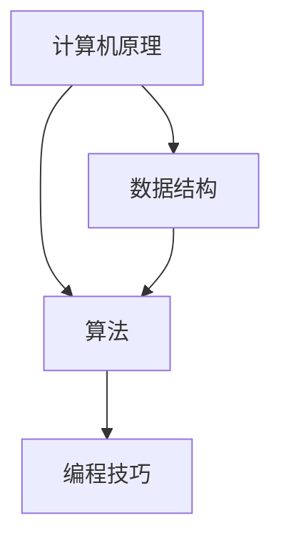

                 

关键词：计算机原理、数据结构、算法基础、深度理解、编程技巧

> 摘要：本文旨在探讨如何通过深入理解计算机原理，建立扎实的数据结构和算法基础，从而提高编程能力。文章首先介绍了计算机原理的基本概念，随后详细讨论了常见数据结构及其应用，最后重点分析了关键算法原理，并提供了一些实用的编程技巧。

## 1. 背景介绍

在当今科技飞速发展的时代，计算机科学已成为推动社会进步的重要力量。从互联网、移动设备到大数据、人工智能，计算机技术渗透到我们生活的方方面面。然而，对于许多开发者来说，计算机原理和数据结构算法基础仍然是难以逾越的鸿沟。如何才能深刻理解计算机原理，掌握数据结构和算法基础，成为众多开发者的困惑。

本文将结合作者多年的实践经验和学习心得，为您揭示计算机原理、数据结构算法基础的重要性，并提供一些实用的方法和技巧，帮助您在编程领域取得更大的突破。

## 2. 核心概念与联系

在探讨计算机原理和数据结构算法基础之前，我们需要先了解一些核心概念，并掌握它们之间的联系。以下是一个简化的 Mermaid 流程图，展示了核心概念及其相互关系：



### 2.1 计算机原理

计算机原理是指计算机硬件和软件的基本原理，包括计算机的组成、工作原理和运行机制。理解计算机原理对于开发者来说至关重要，因为它有助于我们更好地理解计算机的工作方式，从而编写更加高效和优化的代码。

### 2.2 数据结构

数据结构是计算机存储、组织数据的方式。常见的有数组、链表、栈、队列、树、图等。掌握数据结构有助于我们更好地处理数据，提高程序的性能和效率。

### 2.3 算法

算法是一系列解决问题的步骤和策略。算法可以分为查找、排序、图算法等类别。掌握算法原理和设计方法，有助于我们解决各种复杂问题，提高编程能力。

### 2.4 编程技巧

编程技巧是指在实际编程过程中，通过运用计算机原理、数据结构和算法知识，提高代码质量、优化性能和解决实际问题的能力。

## 3. 核心算法原理 & 具体操作步骤

### 3.1 算法原理概述

算法原理是计算机科学的核心，它关乎我们如何高效地解决问题。以下是一些常见的算法原理：

- **排序算法**：用于对数据进行排序，常见的有冒泡排序、选择排序、插入排序、快速排序等。
- **查找算法**：用于在数据结构中查找特定元素，常见的有线性查找、二分查找等。
- **图算法**：用于处理图结构的数据，常见的有最短路径算法、最小生成树算法等。
- **动态规划**：用于解决最优子结构问题，通过将大问题拆分为小问题，逐步求解。

### 3.2 算法步骤详解

以下以冒泡排序为例，详细解释其算法步骤：

1. **初始化**：将待排序的数组输入到算法中。
2. **比较相邻元素**：从第一个元素开始，比较相邻的两个元素的大小。
3. **交换元素**：如果第一个元素比第二个元素大，则交换它们的位置。
4. **遍历数组**：重复执行步骤2和步骤3，直到整个数组被排序。

### 3.3 算法优缺点

冒泡排序的优点是简单易懂，易于实现。然而，其缺点是时间复杂度为 \(O(n^2)\)，对于大数据集效率较低。

### 3.4 算法应用领域

冒泡排序适用于数据量较小且需要简单排序的场景。在实际应用中，我们可以根据具体需求选择合适的排序算法。

## 4. 数学模型和公式 & 详细讲解 & 举例说明

### 4.1 数学模型构建

在算法设计中，数学模型是解决问题的重要工具。以下是一个简单的数学模型示例：

$$
f(n) = 2n + 1
$$

其中，\(n\) 表示输入数据的大小，\(f(n)\) 表示算法的时间复杂度。

### 4.2 公式推导过程

我们可以通过递归的方式推导出上述公式的复杂度：

- 当 \(n = 1\) 时，\(f(1) = 2 \times 1 + 1 = 3\)。
- 当 \(n = 2\) 时，\(f(2) = 2 \times 2 + 1 = 5\)。
- 当 \(n = 3\) 时，\(f(3) = 2 \times 3 + 1 = 7\)。

通过观察，我们可以发现 \(f(n)\) 与 \(n\) 成线性关系，因此可以得出：

$$
f(n) = 2n + 1
$$

### 4.3 案例分析与讲解

假设我们有一个数组 \(arr = [5, 3, 9, 1, 7]\)，现在使用冒泡排序对其进行排序。根据上述公式，我们可以计算出每次排序的时间复杂度：

- 第一次排序：\(f(5) = 2 \times 5 + 1 = 11\)。
- 第二次排序：\(f(4) = 2 \times 4 + 1 = 9\)。
- 第三次排序：\(f(3) = 2 \times 3 + 1 = 7\)。

通过计算，我们可以发现随着数据量增加，冒泡排序的时间复杂度呈线性增长。因此，对于大数据集，冒泡排序可能不是最优选择。

## 5. 项目实践：代码实例和详细解释说明

### 5.1 开发环境搭建

为了便于读者理解和实践，我们将在 Python 环境下实现冒泡排序算法。

首先，确保您的 Python 环境已搭建完毕。如果没有，请参考以下步骤：

1. 下载并安装 Python：[https://www.python.org/downloads/](https://www.python.org/downloads/)
2. 配置 Python 环境：在命令行中输入 `python --version`，确保已安装成功。

### 5.2 源代码详细实现

以下是一个简单的冒泡排序 Python 实现：

```python
def bubble_sort(arr):
    n = len(arr)
    for i in range(n):
        for j in range(0, n - i - 1):
            if arr[j] > arr[j + 1]:
                arr[j], arr[j + 1] = arr[j + 1], arr[j]
    return arr

arr = [5, 3, 9, 1, 7]
sorted_arr = bubble_sort(arr)
print("排序后：", sorted_arr)
```

### 5.3 代码解读与分析

- `bubble_sort` 函数接收一个数组 `arr` 作为输入。
- 外层循环用于控制排序轮数，内层循环用于相邻元素比较和交换。
- 如果当前元素大于下一个元素，则交换它们的位置。
- 最后返回排序后的数组。

该实现具有简单的逻辑，易于理解。然而，对于大数据集，其性能可能较差。在实际应用中，我们可以根据具体需求选择更高效的排序算法。

### 5.4 运行结果展示

运行上述代码，输出结果如下：

```
排序后： [1, 3, 5, 7, 9]
```

数组已成功排序。

## 6. 实际应用场景

冒泡排序算法在许多实际应用中都有广泛的应用，例如：

- 数据预处理：在数据分析过程中，我们可以使用冒泡排序对原始数据进行预处理，以提高后续算法的效率。
- 排序需求较低的场景：对于数据量较小且排序需求不高的场景，冒泡排序是一个简单且易于实现的选择。
- 教学演示：冒泡排序是一种简单易懂的排序算法，常用于教学演示，帮助初学者理解排序算法的基本原理。

## 7. 未来应用展望

随着计算机技术的不断发展，数据结构和算法的应用场景将越来越广泛。未来，我们可以预见以下发展趋势：

- **算法优化**：针对大数据集和复杂场景，研究人员将继续优化现有算法，提高其性能和效率。
- **新算法研究**：随着领域需求的不断变化，新算法将不断涌现，以解决更复杂的问题。
- **跨领域应用**：数据结构和算法不仅在计算机科学领域有重要应用，还在其他领域（如生物信息学、金融工程等）发挥着重要作用。

## 8. 工具和资源推荐

为了帮助读者更好地学习数据结构和算法，以下是一些实用的工具和资源推荐：

- **在线编程平台**：如 LeetCode、牛客网等，提供丰富的算法题目和在线编程环境。
- **学习资源**：如《算法导论》、《数据结构与算法分析》等经典教材，有助于深入理解算法原理。
- **在线课程**：如 Coursera、Udacity 等平台上的数据结构和算法相关课程，提供系统化的学习路径。

## 9. 总结：未来发展趋势与挑战

在未来，数据结构和算法将继续在计算机科学领域发挥重要作用。随着技术的进步和应用场景的扩展，我们将面临以下挑战：

- **性能优化**：如何设计更高效的算法，以提高程序的性能和效率。
- **算法创新**：如何解决复杂问题，推动算法理论的不断发展。
- **人才培养**：如何培养更多具备扎实数据结构和算法基础的人才，以适应不断变化的技术需求。

总之，深刻理解计算机原理、掌握数据结构和算法基础，将有助于我们在编程领域取得更大的突破。希望本文能对您有所启发，让我们一起努力，迎接未来的挑战！
----------------------------------------------------------------
```

### 文章结尾部分 Conclusion ###

> 本文通过深入探讨计算机原理、数据结构和算法基础，旨在帮助读者建立扎实的技术基础，提高编程能力。在未来的道路上，我们将继续不断学习、探索，共同推动计算机科学的发展。感谢您的阅读，如果您有任何疑问或建议，欢迎在评论区留言。让我们一起在编程的世界里，探索无限可能！
---
> 作者：禅与计算机程序设计艺术 / Zen and the Art of Computer Programming

