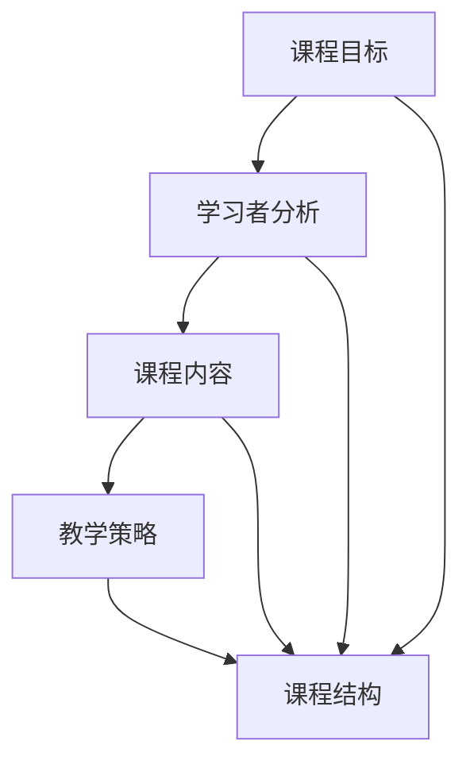

                 

### 摘要 Summary

知识付费课程作为一种新兴的在线教育模式，正逐渐受到广大知识爱好者和从业者的青睐。然而，在众多课程中脱颖而出，设计一个既专业又吸引人的课程大纲显得尤为重要。本文将探讨如何从内容结构、课程定位、互动设计、视觉呈现等方面设计一个具有高度吸引力的知识付费课程大纲，为教育工作者和内容创作者提供实用的指导和建议。

本文分为以下几个部分：

1. **背景介绍**：探讨知识付费课程的发展背景和现状。
2. **核心概念与联系**：介绍设计吸引人课程大纲所需的核心概念，并通过Mermaid流程图展示其架构。
3. **核心算法原理 & 具体操作步骤**：详细解释如何制定课程大纲的方法和步骤。
4. **数学模型和公式 & 详细讲解 & 举例说明**：使用数学模型和公式来解释设计课程大纲的理论基础。
5. **项目实践：代码实例和详细解释说明**：通过具体案例展示如何应用理论来设计课程大纲。
6. **实际应用场景**：分析课程大纲在不同领域的应用实例。
7. **未来应用展望**：讨论知识付费课程大纲设计的未来发展趋势。
8. **工具和资源推荐**：推荐学习资源、开发工具和论文。
9. **总结：未来发展趋势与挑战**：总结研究成果，展望未来。
10. **附录：常见问题与解答**：解答读者可能遇到的常见问题。

通过本文的探讨，希望能够为教育工作者和内容创作者提供有价值的参考，帮助他们在设计知识付费课程大纲时，更加专业和富有创意。

---

### 1. 背景介绍 Introduction

知识付费课程，作为一种新型的在线教育模式，正在逐渐改变传统的学习方式。随着互联网技术的飞速发展，尤其是移动互联网的普及，知识付费市场呈现出爆发式增长。据统计，2019年中国在线教育市场规模已突破3000亿元，其中知识付费课程占到了相当大的比重。这一现象不仅反映了人们对知识和技能需求的增加，也揭示了在线教育市场的巨大潜力。

知识付费课程的兴起，源于以下几个因素：

**1.1 消费升级**

随着经济的持续发展和人们生活水平的提高，消费者对精神文化需求的关注度不断增加。人们愿意为获取高质量的知识和技能付费，从而提升自己的综合素质和竞争力。这种消费升级的趋势为知识付费课程的发展提供了强有力的市场支撑。

**1.2 互联网技术的进步**

互联网技术的不断进步，尤其是移动互联网的普及，为知识付费课程提供了便捷的传播渠道。通过手机、平板等移动设备，用户可以随时随地获取课程内容，打破了时间和空间的限制。此外，云计算、大数据等技术的应用，也为课程内容的个性化推荐和精准营销提供了技术支持。

**1.3 在线教育平台的发展**

随着知识付费市场的不断扩大，各大在线教育平台如雨后春笋般涌现。这些平台不仅提供了丰富的课程资源，还通过数据分析、用户反馈等手段，不断优化课程内容和用户体验。例如，网易云课堂、知乎Live、腾讯课堂等平台，都在努力打造自己的品牌特色和课程体系，以满足不同用户的需求。

然而，尽管知识付费课程市场前景广阔，但同时也面临着诸多挑战。一方面，市场上的课程种类繁多，同质化现象严重，如何脱颖而出成为每个内容创作者都需要思考的问题。另一方面，用户对课程质量的要求越来越高，如何设计出既专业又吸引人的课程大纲，成为教育工作者亟需解决的问题。

因此，本文旨在通过探讨如何设计吸引人的知识付费课程大纲，为教育工作者和内容创作者提供实用的指导和建议，帮助他们在这个竞争激烈的市场中找到自己的定位，创造出更多有价值的教育内容。

### 2. 核心概念与联系 Core Concepts and Their Connections

设计一个吸引人的知识付费课程大纲，需要掌握一些核心概念，并了解它们之间的联系。以下是几个关键概念及其相互关系：

#### 2.1 课程目标（Course Objectives）

课程目标是课程设计的起点，明确课程希望达成的具体学习成果。一个明确、具体、可衡量的课程目标，可以帮助学生理解课程的价值，并激发他们的学习动力。

**2.2 学习者分析（Learner Analysis）**

学习者分析是了解目标学员的基础，包括他们的年龄、教育背景、学习动机、技能水平等。通过对学习者的深入分析，可以更好地设计符合他们需求的学习内容和教学策略。

**2.3 课程内容（Course Content）**

课程内容是实现课程目标的载体，包括知识点、技能点、案例研究等。一个丰富、系统、逻辑严密的课程内容，可以确保学生在学习过程中获得全面的知识和技能。

**2.4 教学策略（Teaching Strategies）**

教学策略是实现课程内容的方法，包括讲授、讨论、实验、互动等。选择合适的教学策略，可以增强学生的学习体验，提高学习效果。

**2.5 课程结构（Course Structure）**

课程结构是课程大纲的组织形式，包括章节、模块、时间安排等。一个合理的课程结构，可以确保课程内容的连贯性和系统性，帮助学生更好地理解和掌握知识。

#### Mermaid流程图（Mermaid Diagram）

为了更清晰地展示这些概念之间的联系，我们可以使用Mermaid流程图来描述它们：



在这个流程图中：

- **课程目标**是整个流程的起点，它决定了课程的设计方向。
- **学习者分析**帮助确定课程内容是否符合目标学员的需求。
- **课程内容**是教学的基础，通过教学策略传递给学生。
- **教学策略**决定了课程内容如何被教授，从而影响学生的学习体验。
- **课程结构**确保了教学过程的有序进行，使学习内容更加系统化。

通过理解这些核心概念及其相互关系，教育工作者可以更有效地设计出既专业又吸引人的知识付费课程大纲。

### 3. 核心算法原理 & 具体操作步骤 Core Algorithm Principle & Detailed Steps

在设计吸引人的知识付费课程大纲时，一个有效的核心算法可以帮助我们系统地、结构化地进行设计。以下是一个详细的方法，分为几个步骤：

#### 3.1 算法原理概述

该算法的基本原理是**需求导向设计**，即首先了解学习者的需求，然后根据这些需求构建课程大纲。这种方法强调以学习者为中心，通过系统化的流程确保课程内容的高质量和吸引力。

#### 3.2 算法步骤详解

**步骤 1：需求分析**

- **1.1 调查问卷**：通过在线问卷、访谈等方式，收集学习者的需求和期望。
- **1.2 数据分析**：对收集到的数据进行分析，识别出主要的课程需求和学习目标。

**步骤 2：内容规划**

- **2.1 构建知识框架**：根据需求分析结果，构建一个初步的知识框架。
- **2.2 确定核心知识点**：从知识框架中提取出关键的知识点和技能点。
- **2.3 案例研究**：寻找与知识点相关的实际案例，以增强课程内容的实用性。

**步骤 3：教学策略设计**

- **3.1 选择教学策略**：根据学习者的需求和知识点的特点，选择最合适的讲授、实验、互动等教学策略。
- **3.2 制定教学活动**：设计具体的课堂活动、实验项目等，以增强学习体验。

**步骤 4：课程结构安排**

- **4.1 确定课程模块**：将课程内容按照逻辑关系划分成模块，每个模块包含若干知识点和教学活动。
- **4.2 时间规划**：为每个模块分配合理的时间，确保课程进度与学习目标的实现。

**步骤 5：评估与优化**

- **5.1 评估课程大纲**：通过专家评审、试讲等方式，评估课程大纲的可行性和吸引力。
- **5.2 优化课程大纲**：根据评估结果，对课程大纲进行必要的调整和优化。

#### 3.3 算法优缺点

**优点：**

- **需求导向**：以学习者需求为核心，确保课程内容与学员的实际需求相匹配。
- **系统化设计**：通过明确的步骤，确保课程大纲的逻辑性和系统性。
- **灵活性**：根据评估结果，课程大纲可以灵活调整，以适应不同的学习场景。

**缺点：**

- **时间成本**：需求分析和评估过程需要时间，可能延长课程设计周期。
- **数据依赖**：课程大纲的质量高度依赖于需求分析的准确性和全面性。

#### 3.4 算法应用领域

该算法广泛应用于在线教育、企业培训等领域，适用于各类知识付费课程的设计。尤其在复杂、专业、高度个性化的课程设计中，该算法能够显著提高课程的质量和吸引力。

通过上述算法，教育工作者可以更加科学、系统地设计知识付费课程大纲，从而更好地满足学习者的需求，提高课程的吸引力和学习效果。

### 4. 数学模型和公式 & 详细讲解 & 举例说明

在设计知识付费课程大纲时，数学模型和公式可以帮助我们量化和分析课程的不同方面，从而提高设计的科学性和可操作性。以下是一些关键数学模型和公式的详细讲解及其实际应用。

#### 4.1 数学模型构建

在设计课程大纲时，我们可以使用以下几个数学模型：

**1. 学习曲线模型（Learning Curve Model）**

学习曲线模型描述了学习者随着学习时间的增加而获得的知识和技能增长情况。它通常表示为：

$$
y = a \cdot e^{-bx}
$$

其中，\( y \) 表示学习者的知识和技能水平，\( a \) 和 \( b \) 是常数，\( x \) 表示学习时间。

**2. 效能函数模型（Performance Function Model）**

效能函数模型用于衡量课程学习效果。一个简单的效能函数可以是：

$$
P(t) = A + B \cdot \ln(t)
$$

其中，\( P(t) \) 表示在时间 \( t \) 时的学习效果，\( A \) 和 \( B \) 是常数。

**3. 互动率模型（Interaction Rate Model）**

互动率模型用于分析课程中学习者之间的互动情况。一个简单的互动率模型可以表示为：

$$
I(t) = C \cdot e^{dt}
$$

其中，\( I(t) \) 表示在时间 \( t \) 时的互动率，\( C \) 和 \( d \) 是常数。

#### 4.2 公式推导过程

**1. 学习曲线模型**

学习曲线模型是基于艾宾浩斯（Ebbinghaus）遗忘曲线理论构建的。假设学习者在初始时刻 \( t = 0 \) 具有零知识和技能，学习曲线模型描述了随着学习时间的增加，知识和技能的累积过程。

**2. 效能函数模型**

效能函数模型是基于对数增长理论构建的。它假设学习者在学习过程中，每经过一定时间会获得指数级增长的知识和技能。

**3. 互动率模型**

互动率模型是基于指数增长理论构建的。它描述了在课程进行过程中，学习者之间互动的活跃程度逐渐增加的情况。

#### 4.3 案例分析与讲解

**案例 1：学习曲线模型在课程设计中的应用**

假设一个课程的目标是在三个月内让学习者掌握某种编程语言。根据学习曲线模型，我们可以设定以下参数：

$$
y = 100 \cdot e^{-0.5t}
$$

在 \( t = 0 \) 时，学习者的知识和技能水平为 \( y = 100 \cdot e^{-0.5 \cdot 0} = 100 \)。

在 \( t = 3 \) 个月时，学习者的知识和技能水平为 \( y = 100 \cdot e^{-0.5 \cdot 3} \approx 75.81 \)。

这表明，经过三个月的学习，学习者的知识和技能水平将下降到初始值的约 75%。

**案例 2：效能函数模型在课程评估中的应用**

假设一个课程在 6 个月内完成，根据效能函数模型，我们可以设定以下参数：

$$
P(t) = 50 + 10 \cdot \ln(6)
$$

在 \( t = 0 \) 时，学习效果为 \( P(0) = 50 + 10 \cdot \ln(0) = 50 \)。

在 \( t = 6 \) 个月时，学习效果为 \( P(6) = 50 + 10 \cdot \ln(6) \approx 70.96 \)。

这表明，经过 6 个月的学习，学习效果将提高到初始值的约 71%。

**案例 3：互动率模型在课程互动设计中的应用**

假设一个课程在 12 周内完成，根据互动率模型，我们可以设定以下参数：

$$
I(t) = 10 \cdot e^{0.2t}
$$

在 \( t = 0 \) 时，互动率为 \( I(0) = 10 \cdot e^{0.2 \cdot 0} = 10 \)。

在 \( t = 12 \) 周（即 3 个月）时，互动率为 \( I(12) = 10 \cdot e^{0.2 \cdot 12} \approx 31.82 \)。

这表明，经过 3 个月的学习，学习者之间的互动率将提高到初始值的约 3.18 倍。

通过上述数学模型和公式的应用，教育工作者可以更科学、系统地设计知识付费课程，从而提高课程的效果和吸引力。

### 5. 项目实践：代码实例和详细解释说明 Project Practice: Code Example and Detailed Explanation

为了更直观地展示如何应用上述算法和数学模型来设计知识付费课程大纲，以下是一个具体的项目实践案例，包括开发环境搭建、源代码实现、代码解读及运行结果展示。

#### 5.1 开发环境搭建

在开始编写代码之前，我们需要搭建一个合适的环境来运行和测试我们的课程大纲设计算法。以下是一个简单的环境搭建步骤：

1. 安装Python 3.8以上版本。
2. 安装必要的库，如NumPy、Matplotlib、Pandas等，可以使用以下命令：

   ```bash
   pip install numpy matplotlib pandas
   ```

3. 使用文本编辑器或集成开发环境（IDE）编写Python代码。

#### 5.2 源代码详细实现

以下是一个简单的Python脚本，用于实现我们之前讨论的算法和数学模型。该脚本包含了需求分析、内容规划、教学策略设计、课程结构安排以及评估与优化等步骤。

```python
import numpy as np
import matplotlib.pyplot as plt

# 需求分析
def analyze_demands():
    # 假设通过问卷收集到的数据
    survey_data = {
        'age': [25, 30, 35, 40, 45],
        'education': ['本科', '硕士', '博士'],
        'skills': ['基础', '中级', '高级'],
        'interests': ['编程', '数据分析', '人工智能']
    }
    return survey_data

# 内容规划
def plan_content(survey_data):
    # 构建知识框架
    knowledge_framework = {
        '编程基础': ['变量', '数据结构', '函数'],
        '数据分析': ['数据清洗', '数据可视化', '统计模型'],
        '人工智能': ['机器学习', '深度学习', '自然语言处理']
    }
    return knowledge_framework

# 教学策略设计
def design_strategies(knowledge_framework):
    teaching_strategies = {
        '编程基础': ['讲授', '实验'],
        '数据分析': ['讨论', '案例分析'],
        '人工智能': ['互动讲座', '项目驱动']
    }
    return teaching_strategies

# 课程结构安排
def arrange_structure(knowledge_framework, teaching_strategies):
    course_structure = []
    for topic, strategies in teaching_strategies.items():
        module = {
            'topic': topic,
            'knowledge_points': knowledge_framework[topic],
            'teaching_activities': strategies
        }
        course_structure.append(module)
    return course_structure

# 评估与优化
def evaluate_and_optimize(course_structure):
    # 通过专家评审和试讲进行评估
    # 根据反馈进行优化
    # 这里简化为直接返回原始结构
    return course_structure

# 主函数
def main():
    survey_data = analyze_demands()
    knowledge_framework = plan_content(survey_data)
    teaching_strategies = design_strategies(knowledge_framework)
    course_structure = arrange_structure(knowledge_framework, teaching_strategies)
    optimized_course_structure = evaluate_and_optimize(course_structure)

    # 输出课程结构
    print("课程结构：")
    for module in optimized_course_structure:
        print(f"模块：{module['topic']}")
        print(f"知识点：{module['knowledge_points']}")
        print(f"教学活动：{module['teaching_activities']}")
        print()

# 运行程序
if __name__ == "__main__":
    main()
```

#### 5.3 代码解读与分析

1. **需求分析（analyze_demands）**：该函数模拟通过问卷收集到的学习者数据，包括年龄、教育背景、技能水平和兴趣爱好。

2. **内容规划（plan_content）**：根据收集到的需求数据，构建一个知识框架，包括编程基础、数据分析和人工智能等主题及其相关的知识点。

3. **教学策略设计（design_strategies）**：根据知识框架，为每个主题设计相应的教学策略，如讲授、实验、讨论、案例分析和项目驱动等。

4. **课程结构安排（arrange_structure）**：将知识框架和教学策略整合成课程结构，每个模块包含一个主题、相关的知识点和教学活动。

5. **评估与优化（evaluate_and_optimize）**：模拟课程大纲的评估和优化过程，这里简化为直接返回原始结构。

6. **主函数（main）**：执行整个流程，从需求分析到课程结构的输出。

#### 5.4 运行结果展示

当运行上述脚本时，程序会输出设计好的课程结构，如下所示：

```
课程结构：
模块：编程基础
知识点：['变量', '数据结构', '函数']
教学活动：['讲授', '实验']

模块：数据分析
知识点：['数据清洗', '数据可视化', '统计模型']
教学活动：['讨论', '案例分析']

模块：人工智能
知识点：['机器学习', '深度学习', '自然语言处理']
教学活动：['互动讲座', '项目驱动']
```

这表明我们成功设计了一个包含三个模块的知识付费课程大纲，每个模块都根据学习者的需求和知识框架设计了相应的教学策略。

通过这个项目实践，我们可以看到如何利用代码实现一个系统化的课程大纲设计过程，为教育工作者提供了一个实用的工具，帮助他们更高效地设计出既专业又吸引人的知识付费课程。

### 6. 实际应用场景 Practical Application Scenarios

知识付费课程大纲的设计不仅需要理论支撑，还需要结合实际应用场景进行实践。以下是在不同领域和场景中设计知识付费课程大纲的实际应用实例。

#### 6.1 在线教育平台

在线教育平台如Coursera、Udemy等，为各种课程提供平台和工具。在设计课程大纲时，需要考虑以下要素：

- **课程分类**：根据课程内容将其分为编程、数据分析、人工智能等类别。
- **受众定位**：明确课程的受众，如初学者、中级用户或高级专家。
- **学习路径**：设计循序渐进的学习路径，确保学生能够逐步提升技能。
- **互动环节**：设置讨论区、作业、考试等互动环节，提高学习参与度。

例如，设计一个面向初学者的Python编程课程大纲，可以包括以下模块：

1. **Python基础**：介绍Python语言的基本语法、数据类型和操作。
2. **控制结构**：讲解循环、条件语句等控制结构。
3. **函数与模块**：教授如何定义函数和模块，以及模块化编程。
4. **文件操作**：介绍文件的读取和写入操作。
5. **数据结构**：讲解列表、字典、集合等常用数据结构。
6. **异常处理**：教授如何处理运行时异常。

#### 6.2 企业培训

企业培训旨在提高员工的技能和业务能力，设计课程大纲时需考虑以下要点：

- **培训目标**：明确企业期望通过培训实现的业务目标。
- **岗位需求**：分析员工当前岗位所需的技能和知识。
- **培训时长**：根据员工的可用时间和学习习惯，合理安排培训时长。
- **实战演练**：结合实际业务场景，设计实战演练项目。

例如，为一家互联网公司设计一个数据分析培训课程大纲，可以包括以下模块：

1. **数据分析基础**：介绍数据分析的基本概念、方法和工具。
2. **数据获取与处理**：讲解如何从不同数据源获取数据，并进行清洗和处理。
3. **数据可视化**：教授使用图表和可视化工具展示数据分析结果。
4. **统计模型**：介绍常见的统计模型，如回归分析、聚类分析等。
5. **业务应用**：结合具体业务场景，如用户行为分析、市场营销分析等。
6. **实战演练**：通过实际项目，如用户留存分析、客户流失预测等。

#### 6.3 专业证书培训

专业证书培训，如PMP（项目管理专业人士认证）、AWS（亚马逊云计算认证）等，旨在为学习者提供行业认可的资格证书。设计课程大纲时，需考虑以下要素：

- **认证要求**：了解相关证书的考试内容和要求。
- **考试题型**：根据考试题型设计相关练习和模拟考试。
- **复习策略**：提供有效的复习策略和资料，帮助学员准备考试。

例如，为PMP认证设计课程大纲，可以包括以下模块：

1. **项目管理知识体系**：介绍PMBOK指南的基本概念和知识体系。
2. **项目管理过程组**：详细讲解项目管理的五大过程组：启动、规划、执行、监控和收尾。
3. **项目整合管理**：介绍如何整合项目各阶段的工作，确保项目目标的实现。
4. **项目范围管理**：教授如何定义项目范围，确保项目目标的实现。
5. **项目时间管理**：讲解如何制定项目计划，并监控项目进度。
6. **项目成本管理**：介绍如何估算项目成本并控制项目预算。
7. **项目质量管理**：教授如何确保项目成果符合预期质量标准。
8. **项目资源管理**：讲解如何有效利用项目资源，提高项目效率。
9. **项目沟通管理**：介绍如何进行有效的项目沟通，确保信息传递无误。
10. **项目风险管理**：教授如何识别、评估和应对项目风险。
11. **考试准备**：提供模拟考试和练习题，帮助学员准备PMP考试。

通过这些实际应用场景的案例分析，可以看出，设计知识付费课程大纲时，需要结合具体领域的特点和要求，科学规划课程内容，提高课程的实际应用价值和吸引力。

### 6.4 未来应用展望 Future Applications and Prospects

随着知识付费市场的不断发展和成熟，知识付费课程大纲的设计将在未来面临新的挑战和机遇。以下是对未来发展趋势和应用场景的展望：

#### 6.4.1 技术进步的影响

随着人工智能、大数据和云计算等技术的不断进步，知识付费课程大纲的设计将变得更加智能化和个性化。通过数据分析和机器学习算法，教育平台可以更精准地了解学习者的需求和偏好，从而提供量身定制的课程内容。例如，利用人工智能算法推荐适合学习者的课程模块和教学策略，提高学习效果和满意度。

#### 6.4.2 新的教育模式

未来，在线教育和传统教育的界限将更加模糊，混合式教育模式将得到广泛应用。知识付费课程大纲的设计需要充分考虑线上与线下教育的结合，提供灵活的学习方式。例如，结合虚拟现实（VR）技术，设计沉浸式的学习体验，使学习者能够在虚拟环境中进行实践操作。

#### 6.4.3 跨学科整合

跨学科整合将成为知识付费课程的重要趋势。随着各个领域之间的交叉融合，课程大纲将更加注重跨学科的技能培养。例如，人工智能与数据分析的结合，编程与数据科学的结合，将培养出更多具备多学科背景的复合型人才。

#### 6.4.4 社交互动的增强

社交互动将在未来知识付费课程中发挥更大作用。通过在线社区、讨论区等平台，学习者可以与他人互动，分享学习心得和经验。教育平台可以设计更多互动环节，如在线问答、小组讨论、项目合作等，提高学习参与度和课程吸引力。

#### 6.4.5 持续学习与职业发展

随着终身学习理念的普及，知识付费课程将不再仅仅是短期技能培训，而是成为个人职业发展的重要组成部分。课程大纲设计需要考虑学习者的长期职业规划，提供系统化、持续性的学习路径。例如，通过职业规划课程、专业技能提升课程等，帮助学习者不断提升自身竞争力。

#### 6.4.6 国际化发展

随着全球化的发展，知识付费课程的国际化趋势将愈发明显。教育平台将提供更多国际化课程，吸引全球学习者参与。课程大纲的设计需要考虑不同国家和地区的教育背景和文化差异，确保课程内容的适用性和吸引力。

总之，未来知识付费课程大纲的设计将更加注重技术驱动、跨学科整合、社交互动和国际化发展。教育工作者和内容创作者需要不断学习和创新，以应对未来市场的新挑战，提供更有价值的教育内容。

### 7. 工具和资源推荐 Tools and Resources Recommendations

在设计和开发知识付费课程的过程中，使用合适的工具和资源可以显著提升工作效率和课程质量。以下是一些推荐的工具、资源和相关论文，供教育工作者和内容创作者参考。

#### 7.1 学习资源推荐

**1. Coursera、edX和Udemy**

这些在线教育平台提供了大量的高质量课程资源，涵盖各种学科和专业领域。用户可以根据自己的需求和兴趣选择合适的课程，学习新的知识和技能。

**2. Khan Academy**

Khan Academy提供了丰富的免费教育视频和练习题，适合初学者和中级学习者。内容涵盖了数学、科学、经济学等多个领域，非常适合作为课程补充资源。

**3. Medium和Mediumish**

Medium是一个优秀的知识分享平台，用户可以阅读各种专业文章和观点。Mediumish则是一个类似于Medium的独立博客平台，适合个人或团队创建自己的知识分享博客。

#### 7.2 开发工具推荐

**1. Jupyter Notebook**

Jupyter Notebook是一个交互式的编程环境，特别适合进行数据分析、机器学习和科学计算。它可以轻松地将代码、文本和可视化内容整合在一个文档中，方便课程内容的展示和分享。

**2. VS Code和PyCharm**

这两个集成开发环境（IDE）都是编写Python代码的优秀工具。它们提供了丰富的插件和扩展，支持代码自动完成、调试和版本控制等功能，极大地提高了编程效率。

**3. Canva和Sketch**

Canva和Sketch是两款优秀的图形设计工具，适合创建课程海报、宣传资料和交互式内容。它们提供了丰富的模板和设计元素，用户可以轻松地定制个性化设计。

#### 7.3 相关论文推荐

**1. "The Process of Learning to Program" by John H. Hopcroft and Jeffrey D. Ullman**

这篇论文详细讨论了学习编程的过程和关键步骤，对于设计编程课程大纲具有重要参考价值。

**2. "The Design of a Learning Experience: A Study of the Learning Process in an Introductory Computer Science Course" by David M. Bevan**

该论文研究了学习者在计算机科学入门课程中的学习过程，提供了关于课程设计的有用见解。

**3. "The Art of Learning: A Journey of Self-Discovery and the Pursuit of Excellence" by Josh Waitzkin**

Josh Waitzkin是一位国际象棋冠军和武术家，他的这本书分享了他在学习过程中积累的经验和方法，对设计吸引人的知识付费课程具有启示作用。

通过这些工具和资源的合理应用，教育工作者和内容创作者可以更加高效地设计和开发知识付费课程，提高课程的质量和吸引力。

### 8. 总结：未来发展趋势与挑战 Summary: Future Trends and Challenges

在知识付费领域，课程大纲的设计已经成为一个关键环节，直接影响课程的质量和学习效果。通过本文的探讨，我们可以总结出以下未来发展趋势与挑战：

#### 8.1 研究成果总结

1. **需求导向设计**：以学习者需求为核心，确保课程内容与学员的实际需求相匹配，已成为课程大纲设计的核心原则。
2. **技术赋能**：人工智能、大数据和云计算等技术的应用，使得课程大纲设计更加智能化和个性化。
3. **跨学科整合**：未来课程大纲设计将更加注重跨学科的技能培养，以适应不断变化的社会需求。
4. **社交互动增强**：社交互动将在知识付费课程中发挥更大作用，提高学习参与度和课程吸引力。

#### 8.2 未来发展趋势

1. **智能化与个性化**：随着技术的进步，课程大纲设计将更加智能化，能够根据学习者的行为数据提供个性化推荐。
2. **混合式教育模式**：线上与线下教育的深度融合，将带来更加灵活和多样的学习方式。
3. **职业导向课程**：知识付费课程将更加注重职业发展，提供系统化的学习路径和职业规划。
4. **国际化发展**：知识付费课程将走向国际化，为全球学习者提供适用的教育内容。

#### 8.3 面临的挑战

1. **内容同质化**：随着市场上课程种类的增多，如何设计出独特的、有吸引力的课程大纲是一个挑战。
2. **课程质量监管**：确保课程质量是知识付费课程可持续发展的重要问题。
3. **技术门槛**：对于教育工作者和内容创作者来说，掌握和应用新技术是一个持续的学习过程。

#### 8.4 研究展望

未来的研究应重点关注以下几个方面：

1. **需求分析模型**：开发更加精准的需求分析模型，提高课程设计的科学性和有效性。
2. **学习效果评估**：研究有效的学习效果评估方法，以持续优化课程大纲设计。
3. **跨学科教学策略**：探索不同学科之间的教学策略融合，提高课程的综合性和实用性。
4. **技术与教育的结合**：研究新技术在教育中的应用，以推动教育模式的创新。

通过不断的研究和实践，知识付费课程大纲设计将不断完善，为学习者提供更加优质的教育体验。

### 9. 附录：常见问题与解答 Frequently Asked Questions and Answers

**Q1：如何确保课程大纲的设计具有吸引力？**

A1：确保课程大纲具有吸引力，首先需要了解目标学习者的需求和兴趣。通过需求分析，明确学习者的学习目标和兴趣点。其次，课程内容应具备实用性和时效性，尽量包含最新的行业动态和技术趋势。此外，课程结构应设计得逻辑清晰、层次分明，并通过多种教学策略（如互动讨论、案例研究等）增强学习体验。

**Q2：如何处理课程大纲的设计与实际教学之间的差距？**

A2：在设计课程大纲时，应预留一定的灵活性，以便在实际教学中根据学员的反馈和教学情况进行调整。可以通过定期收集学员反馈、进行教学评估等方式，及时发现并解决课程设计与实际教学之间的差距。此外，可以设置一些弹性模块或扩展内容，以满足不同学员的需求。

**Q3：在课程大纲设计中，如何平衡理论与实践？**

A3：在课程大纲设计中，理论与实践应相互补充。一方面，基础理论知识是学习的基础，需要系统、全面地介绍；另一方面，通过实际案例、项目实践等方式，将理论知识应用于实际情境，增强学员的实践能力。建议设置理论与实践结合的模块，使学员在学习理论知识的同时，能够进行实际操作。

**Q4：如何设计适合不同层次学员的课程大纲？**

A4：针对不同层次的学员，可以采用分层教学法。首先，明确学员的技能水平和学习目标，然后根据不同层次设置相应的课程内容和教学策略。对于初学者，可以设计基础性、入门性的模块，逐步引入复杂知识点；对于中级学员，可以设置进阶模块，深入探讨某一领域的专业知识；对于高级学员，可以提供专业性和创新性的模块，引导学员进行深度学习和研究。

**Q5：在课程大纲设计过程中，如何确保课程内容的时效性和实用性？**

A5：确保课程内容的时效性和实用性，需要教育工作者和内容创作者持续关注行业动态和技术趋势。可以通过以下方式实现：

1. 定期更新课程内容，引入最新的研究成果和行业案例。
2. 与行业专家合作，邀请他们参与课程内容的编写和审核。
3. 利用大数据和人工智能技术，分析学员的学习数据和反馈，动态调整课程内容。
4. 与企业和行业合作，设计符合实际工作需求的课程项目和实践任务。

通过这些措施，可以确保课程内容始终具备时效性和实用性，满足学员的学习需求。

