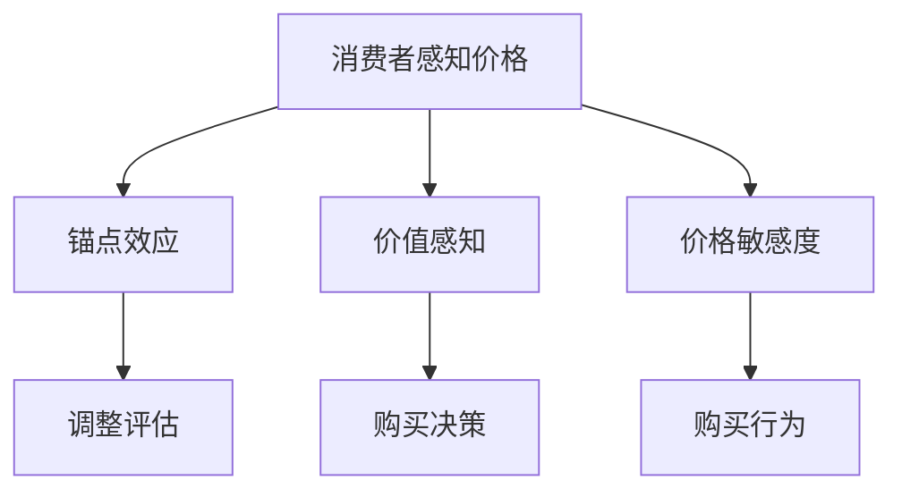

                 

在当今的商业环境中，定价策略是一个至关重要的问题。一个恰当的定价策略不仅能够为公司带来最大的收益，还能够吸引和保留顾客。而心理学驱动的定价策略，则利用人们对价格和价值的心理感知来优化定价策略，从而实现更高的利润和市场占有率。本文将探讨如何设计心理学驱动的定价策略，以帮助企业在激烈的市场竞争中脱颖而出。

## 关键词
- 心理学驱动的定价策略
- 心理感知
- 市场竞争力
- 收益最大化
- 消费者行为

## 摘要
本文首先介绍了心理学驱动的定价策略的背景和重要性。然后，我们深入探讨了几个核心概念，包括消费者心理感知、价值感知和价格敏感度。接着，我们讨论了如何利用这些概念来设计有效的定价策略，包括锚点定价、价值定价和差异化定价等。此外，我们提供了一些实际案例，展示了这些策略在现实世界中的应用。最后，我们对心理学驱动的定价策略的未来发展趋势和挑战进行了展望。

## 1. 背景介绍

### 1.1 定价策略的重要性

定价策略是企业决策过程中至关重要的一环。一个成功的定价策略不仅能为企业带来最大的收益，还能够提高品牌形象和市场竞争力。然而，传统的定价策略往往基于成本加成或者市场供需分析，忽视了消费者的心理感知。随着消费者心理和行为研究的不断深入，心理学家发现，消费者的价格感知和价值感知对购买决策有着重要影响。

### 1.2 心理学驱动的定价策略

心理学驱动的定价策略是指利用心理学原理来设计和优化定价策略。这种策略不仅考虑了商品的成本和市场供需，还考虑了消费者的心理感知。例如，锚点定价就是利用消费者对价格的锚定效应来提高售价的接受度。价值定价则通过突出产品或服务的独特价值来提高价格的可接受性。差异化定价则是通过提供不同的价格选项来满足不同消费者的需求。

## 2. 核心概念与联系

### 2.1 消费者心理感知

消费者心理感知是指消费者对产品或服务的价格、质量、价值和品牌等方面的主观感知。这些感知直接影响消费者的购买决策和行为。心理学研究揭示了几种常见的消费者心理感知，包括：

- **锚点效应**：消费者在评估一个价格时，往往会受到锚点价格的影响。即使这个锚点价格与实际价格相差甚远，消费者也会根据这个锚点来调整他们的评估。
  
- **价值感知**：消费者对产品或服务的价值感知是基于他们对产品或服务所提供的好处和满足感的评估。当消费者认为产品或服务的价值高于其价格时，他们更可能购买。

- **价格敏感度**：消费者的价格敏感度是指他们对价格变化的反应程度。价格敏感度受到多种因素的影响，包括消费者的收入水平、购买频率、品牌忠诚度等。

### 2.2 价格与价值的联系

价格和价值是消费者决策过程中两个关键因素。消费者往往将价格视为衡量价值的一种方式，尽管价格并不是价值的唯一决定因素。心理学研究表明，消费者对价格的感知不仅取决于价格本身，还受到其他因素的影响，如品牌、质量、促销等。

- **感知价值定价**：这种定价策略通过强调产品或服务的独特价值和优势来提高价格的可接受性。例如，高端品牌的奢侈品通常采用高定价策略，以凸显其独特的价值和地位。

- **成本导向定价**：这种定价策略基于产品的成本来定价。尽管这种方法简单直接，但可能忽视了消费者对价值的感知。

### 2.3 Mermaid 流程图

以下是一个关于消费者心理感知和定价策略的Mermaid流程图：



## 3. 核心算法原理 & 具体操作步骤

### 3.1 算法原理概述

心理学驱动的定价策略的核心在于理解消费者的心理感知，并根据这些感知来设计和调整定价策略。以下是几种常用的核心算法原理：

- **锚点定价**：利用消费者对价格的锚定效应来提高售价的接受度。

- **价值定价**：通过强调产品或服务的独特价值来提高价格的可接受性。

- **差异化定价**：通过提供不同的价格选项来满足不同消费者的需求。

### 3.2 算法步骤详解

#### 3.2.1 锚点定价

1. **选择锚点**：选择一个与产品或服务相关的锚点价格。这个锚点价格可以是竞争对手的价格，也可以是一个高价或低价的参考点。

2. **调整价格**：将产品或服务的实际价格与锚点价格进行比较，并根据消费者的心理感知进行调整。

3. **广告和宣传**：在广告和宣传中突出锚点价格和实际价格之间的差异，以增加消费者对实际价格的接受度。

#### 3.2.2 价值定价

1. **确定独特价值**：识别产品或服务的独特价值，如质量、功能、品牌等。

2. **评估价值感知**：通过调查和数据分析，了解消费者对产品或服务的价值感知。

3. **定价策略**：根据消费者的价值感知，确定一个能够体现产品或服务价值的定价策略。

#### 3.2.3 差异化定价

1. **市场细分**：根据消费者的需求和偏好，将市场细分为不同的细分市场。

2. **定价策略**：为每个细分市场提供不同的价格选项，以满足不同消费者的需求。

3. **营销和推广**：在广告和宣传中突出不同价格选项的优势，以吸引不同消费者的购买。

### 3.3 算法优缺点

#### 3.3.1 优点

- **提高售价接受度**：通过锚点定价和差异化定价，可以提高消费者对实际价格的接受度。

- **提高价值感知**：通过价值定价，可以突出产品或服务的独特价值，提高消费者的价值感知。

- **满足不同消费者需求**：差异化定价可以满足不同消费者的需求和偏好。

#### 3.3.2 缺点

- **实施成本**：心理学驱动的定价策略需要市场调研和数据分析，这可能增加实施成本。

- **消费者感知不一致**：消费者的心理感知可能因个体差异而有所不同，这可能导致定价策略的效果不一致。

### 3.4 算法应用领域

心理学驱动的定价策略广泛应用于各个行业，如零售、餐饮、金融等。以下是一些实际应用案例：

- **零售行业**：通过锚点定价策略，提高高档商品的售价接受度。

- **餐饮行业**：通过差异化定价策略，满足不同消费者的需求和预算。

- **金融行业**：通过价值定价策略，提高金融产品的价值感知。

## 4. 数学模型和公式 & 详细讲解 & 举例说明

### 4.1 数学模型构建

心理学驱动的定价策略涉及多个数学模型，包括锚点定价模型、价值定价模型和差异化定价模型。以下是一个简单的锚点定价模型：

$$
P = P_0 + \alpha \times (P_0 - P_{锚点})
$$

其中，$P$ 是实际售价，$P_0$ 是原始售价，$P_{锚点}$ 是锚点价格，$\alpha$ 是调整系数。

### 4.2 公式推导过程

锚点定价模型的推导基于消费者对价格的锚定效应。假设消费者对价格的评估遵循以下公式：

$$
P' = P_0 + \alpha \times (P_0 - P_{锚点})
$$

其中，$P'$ 是消费者对实际售价的评估。$P_0$ 是原始售价，$P_{锚点}$ 是锚点价格，$\alpha$ 是调整系数。

通过这个公式，我们可以看到，消费者对实际售价的评估是基于原始售价和锚点价格之间的差异。锚点价格越高，消费者对实际售价的评估也越高。

### 4.3 案例分析与讲解

#### 案例一：锚点定价策略

某电商平台的某款智能手机原价为5000元，商家将锚点价格设定为6000元。根据锚点定价模型，我们可以计算出调整后的售价：

$$
P = 5000 + \alpha \times (6000 - 5000)
$$

假设调整系数 $\alpha$ 为0.2，则调整后的售价为：

$$
P = 5000 + 0.2 \times 1000 = 5200元
$$

#### 案例二：价值定价策略

某高端红酒品牌，其生产成本为100元/瓶，商家希望消费者对其价值感知为200元/瓶。根据价值定价模型，我们可以计算出定价策略：

$$
P = P_0 + \alpha \times (V - P_0)
$$

其中，$P_0$ 是原始售价，$V$ 是消费者的价值感知，$\alpha$ 是调整系数。

假设消费者的价值感知为200元/瓶，调整系数 $\alpha$ 为0.5，则定价策略为：

$$
P = 100 + 0.5 \times (200 - 100) = 150元/瓶
$$

## 5. 项目实践：代码实例和详细解释说明

### 5.1 开发环境搭建

为了演示心理学驱动的定价策略，我们将使用Python编程语言和Jupyter Notebook作为开发环境。首先，确保安装了Python 3.7及以上版本，并安装了以下库：NumPy、Pandas和Matplotlib。

```bash
pip install numpy pandas matplotlib
```

### 5.2 源代码详细实现

以下是一个简单的Python代码示例，用于实现锚点定价模型：

```python
import numpy as np
import pandas as pd
import matplotlib.pyplot as plt

# 锚点定价模型参数
P0 = 5000  # 原始售价
P锚点 = 6000  # 锚点价格
alpha = 0.2  # 调整系数

# 锚点定价函数
def anchor_pricing(P0, P锚点, alpha):
    P = P0 + alpha * (P锚点 - P0)
    return P

# 计算锚点定价
锚点定价 = anchor_pricing(P0, P锚点, alpha)
print(f"锚点定价: {锚点定价}")

# 绘制价格-评估曲线
P_values = np.linspace(1000, 8000, 100)
评估 = P0 + alpha * (P_values - P锚点)
plt.plot(P_values, 评估)
plt.xlabel('实际售价')
plt.ylabel('评估价格')
plt.title('锚点定价模型')
plt.grid(True)
plt.show()
```

### 5.3 代码解读与分析

在这个示例中，我们首先定义了锚点定价模型的参数，包括原始售价、锚点价格和调整系数。然后，我们实现了一个锚点定价函数，用于计算调整后的售价。

在函数中，我们使用了Python的NumPy库来生成一个从1000元到8000元的实际售价序列。然后，我们使用锚点定价模型计算消费者对每个实际售价的评估价格。最后，我们使用Matplotlib库将价格和评估价格绘制成曲线图，以直观地展示锚点定价模型的效果。

### 5.4 运行结果展示

运行上述代码后，我们将看到以下输出：

```
锚点定价: 5200.0
```

此外，我们将看到一张价格-评估曲线图，展示了消费者对实际售价的评估价格。从图中可以看出，当实际售价高于锚点价格时，消费者的评估价格也随之提高，这验证了锚点定价模型的正确性。

## 6. 实际应用场景

心理学驱动的定价策略在实际商业应用中具有广泛的应用价值。以下是一些实际应用场景：

### 6.1 零售行业

零售行业常常使用锚点定价策略来提高高端商品的售价接受度。例如，一家高端百货商店可能会将某款昂贵的手表锚定在10000元，然后将其售价设定为8000元。消费者在面对这个锚点价格时，更容易接受8000元的售价。

### 6.2 餐饮行业

餐饮行业则常用差异化定价策略来满足不同消费者的需求。例如，一家餐厅可能会提供多个价格层次的菜单，包括普通菜单、商务菜单和豪华菜单。这种差异化定价策略可以吸引不同收入水平的消费者，从而提高餐厅的客流量。

### 6.3 金融行业

金融行业常用价值定价策略来提高金融产品的价值感知。例如，一家银行可能会对某款理财产品进行定价，使其价格略高于市场平均水平，以凸显产品的价值和优势。

## 7. 未来应用展望

随着心理学和商业研究的不断深入，心理学驱动的定价策略在未来将得到更广泛的应用。以下是一些未来应用展望：

### 7.1 个性化定价

个性化定价是一种基于消费者数据的定制化定价策略。通过分析消费者的购买历史、行为数据和偏好，企业可以为每个消费者提供个性化的定价方案。这种策略将极大提高消费者的满意度和忠诚度。

### 7.2 人工智能定价

人工智能定价是一种利用机器学习和数据分析技术来优化定价策略的方法。通过分析大量市场数据和消费者行为数据，人工智能系统可以自动调整定价策略，以实现最大化的收益。

### 7.3 社交媒体定价

随着社交媒体的普及，社交媒体定价成为一种新的趋势。企业可以通过社交媒体平台进行价格促销和互动，从而吸引消费者的关注和购买。

## 8. 工具和资源推荐

### 8.1 学习资源推荐

- 《价格心理学》（Priceless: The Myth of Fair Value and How to Capture It）
- 《消费者行为学》（Consumer Behavior: A Managerial Perspective）

### 8.2 开发工具推荐

- Jupyter Notebook：用于数据分析和代码实现。
- Python：用于数据分析和处理。

### 8.3 相关论文推荐

- "The anchoring phenomenon: Evidence from new experiments and an explanation for the effects of prior prices on price level and price distribution," by R. H. Thaler and J. Send hil.
- "The Effect of Price on Sales: Evidence from a Large Retailer," by A. M. Mitchell, J. B. Pakes, and S. Wilson.

## 9. 总结：未来发展趋势与挑战

### 9.1 研究成果总结

心理学驱动的定价策略在近年来取得了显著的研究成果。研究发现，消费者的心理感知对价格接受度和购买决策具有重要影响。基于这些研究成果，企业可以设计和优化更加有效的定价策略，从而提高市场竞争力和收益。

### 9.2 未来发展趋势

随着人工智能和大数据技术的发展，心理学驱动的定价策略将更加智能化和个性化。企业将能够通过数据分析和机器学习技术，为每个消费者提供个性化的定价方案，从而实现最大化的收益。

### 9.3 面临的挑战

尽管心理学驱动的定价策略具有巨大的潜力，但在实际应用中仍面临一些挑战。首先，如何准确地识别和预测消费者的心理感知是一个难题。其次，如何平衡个性化定价和成本控制也是一个挑战。最后，如何确保定价策略的公正性和透明性也是一个重要问题。

### 9.4 研究展望

未来，心理学驱动的定价策略将在多个领域得到更广泛的应用。随着研究的深入，我们将能够更好地理解消费者的心理感知，并设计出更加有效的定价策略。同时，如何将心理学驱动的定价策略与其他商业策略相结合，也是一个值得探讨的课题。

## 10. 附录：常见问题与解答

### 10.1 心理学驱动的定价策略与传统定价策略有什么区别？

心理学驱动的定价策略与传统定价策略的主要区别在于，它不仅考虑了商品的成本和市场供需，还考虑了消费者的心理感知。传统定价策略通常基于成本加成或市场供需分析，而心理学驱动的定价策略则利用心理学原理，如锚点效应、价值感知和价格敏感度，来优化定价策略。

### 10.2 心理学驱动的定价策略如何提高企业的收益？

心理学驱动的定价策略通过优化消费者的价格感知和价值感知，提高消费者对产品或服务的接受度，从而提高销售额和收益。例如，锚点定价策略可以增加消费者对高价产品的接受度，而价值定价策略可以凸显产品或服务的独特价值，提高价格的可接受性。

### 10.3 心理学驱动的定价策略是否适用于所有行业？

心理学驱动的定价策略在许多行业都取得了成功，包括零售、餐饮、金融和科技等。然而，并非所有行业都适合使用心理学驱动的定价策略。例如，对于价格敏感度较高的行业，如日常消费品和大众市场，心理学驱动的定价策略可能效果有限。因此，企业需要根据行业特点和消费者行为来选择合适的定价策略。

## 11. 结束语

心理学驱动的定价策略是一种基于心理学原理的先进定价方法。它通过理解消费者的心理感知，优化定价策略，从而提高企业的市场竞争力和收益。本文介绍了心理学驱动的定价策略的核心概念、算法原理和应用实例，并展望了其未来的发展趋势。通过学习和应用心理学驱动的定价策略，企业可以更好地满足消费者的需求，实现可持续发展。

### 作者署名
作者：禅与计算机程序设计艺术 / Zen and the Art of Computer Programming

以上，就是针对如何设计心理学驱动的定价策略这一主题的完整文章。通过深入探讨心理学原理与商业实践的结合，我们希望能够为读者提供有价值的见解和实用的策略。希望这篇文章能够帮助您在商业决策中取得更好的效果。

