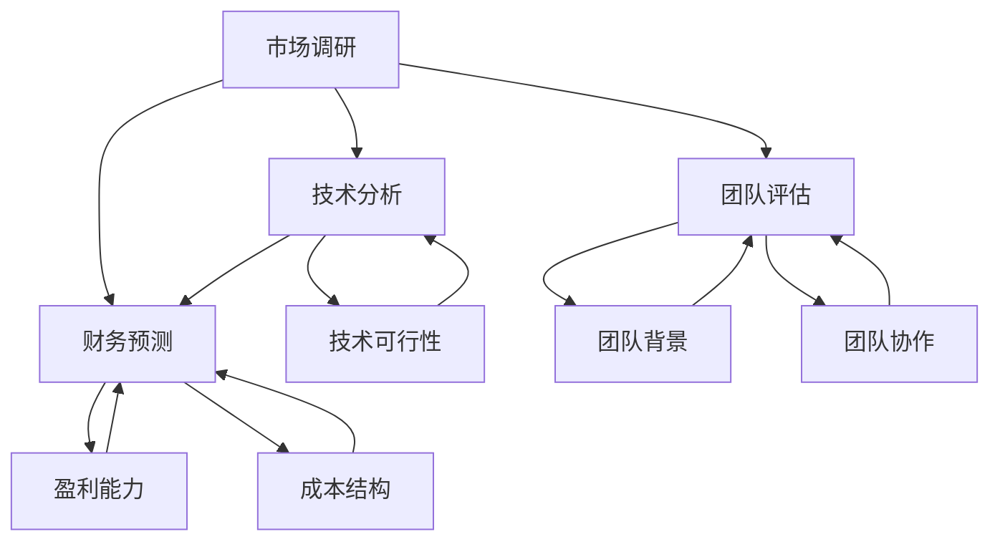

                 

摘要：本文将深入探讨创业项目可行性评估的关键要素，包括市场调研、技术分析、财务预测以及团队评估。通过逻辑清晰、结构紧凑的叙述，本文旨在为创业者和投资者提供一套全面、实用的评估框架，帮助他们在竞争激烈的市场中识别潜在的成功机会，并避免常见陷阱。

## 1. 背景介绍

创业项目可行性评估是一个至关重要的环节，它关系到项目的成功与否。在互联网和科技创新的推动下，创业活动越来越普遍，然而，并非所有的创业项目都能取得成功。因此，如何进行有效的创业项目可行性评估成为了每个创业者都需要认真思考的问题。

本文将从以下五个方面展开讨论：

1. **市场调研**：了解目标市场的现状、需求和竞争状况，为项目决策提供数据支持。
2. **技术分析**：评估项目的核心技术是否可行，技术团队是否具备实施能力。
3. **财务预测**：预测项目的财务状况，确保项目在经济上具有可行性。
4. **团队评估**：考察创业团队的背景、能力、合作精神和执行力。
5. **风险评估**：识别潜在的风险，制定相应的应对策略。

通过以上五个方面的深入分析，我们希望能为读者提供一套全面、实用的创业项目可行性评估框架。

## 2. 核心概念与联系

为了更好地理解创业项目可行性评估，我们需要了解以下几个核心概念：

- **市场调研**：通过对市场进行系统性研究，收集和分析市场数据，以了解市场的规模、增长趋势、消费者需求等。
- **技术分析**：评估项目所需的技术是否成熟，团队是否有能力实现这些技术。
- **财务预测**：基于市场调研和技术分析，预测项目的盈利能力、成本结构和现金流状况。
- **团队评估**：考察创业团队的组成、背景、经验和合作能力。
- **风险评估**：识别项目可能面临的风险，如市场风险、技术风险、财务风险等。

### 图 1：创业项目可行性评估的核心概念与联系



图 1 展示了创业项目可行性评估的核心概念及其相互联系。通过这些概念的综合评估，我们可以全面了解项目的可行性，从而做出科学的决策。

## 3. 核心算法原理 & 具体操作步骤

### 3.1 算法原理概述

创业项目可行性评估的核心算法原理主要涉及以下三个部分：

1. **市场分析算法**：基于市场调研数据，利用回归分析和聚类分析等方法，预测市场的增长趋势和消费者需求。
2. **技术评估算法**：通过技术可行性分析，评估项目所需技术的成熟度，通常使用技术成熟度指标（Technology Readiness Level, TRL）。
3. **财务预测算法**：结合市场分析和技术评估结果，运用财务模型进行盈利预测，包括现金流预测、利润预测和投资回报率预测。

### 3.2 算法步骤详解

#### 步骤一：市场分析

- **数据收集**：收集市场相关数据，包括市场规模、增长趋势、消费者行为等。
- **数据处理**：清洗和整理数据，确保数据质量。
- **回归分析**：通过回归模型预测市场增长率。
- **聚类分析**：对消费者群体进行分类，分析不同类别的消费者需求。

#### 步骤二：技术评估

- **技术调研**：了解相关技术现状，包括技术原理、应用领域和成熟度。
- **TRL评估**：根据技术成熟度指标，评估项目所需技术的成熟度。
- **可行性分析**：结合技术团队的能力，评估技术实现的可行性。

#### 步骤三：财务预测

- **收入预测**：根据市场分析结果，预测项目的收入。
- **成本预测**：分析项目的成本结构，包括固定成本和可变成本。
- **盈利预测**：运用财务模型，预测项目的盈利能力。
- **投资回报率预测**：计算项目的投资回报率，评估项目的经济可行性。

### 3.3 算法优缺点

#### 优点：

- **全面性**：通过多维度分析，全面评估项目的可行性。
- **科学性**：运用数据分析方法，提高评估结果的准确性。
- **灵活性**：可以根据实际情况进行调整，适应不同的项目需求。

#### 缺点：

- **数据依赖性**：市场和技术数据的准确性直接影响评估结果。
- **复杂度**：算法应用过程中涉及多个步骤和模型，操作复杂。
- **成本**：进行详细的市场和技术调研需要投入大量资源和时间。

### 3.4 算法应用领域

该算法广泛应用于各种创业项目的可行性评估，包括互联网创业、科技创新、传统行业转型等领域。通过有效的可行性评估，可以帮助创业者降低失败风险，提高成功率。

## 4. 数学模型和公式 & 详细讲解 & 举例说明

### 4.1 数学模型构建

在创业项目可行性评估中，我们可以构建以下数学模型：

1. **市场增长模型**：$$\text{市场增长速率} = \alpha \cdot (1 + \beta \cdot t)$$
   - $\alpha$：初始市场规模
   - $\beta$：年增长率
   - $t$：时间（年）

2. **收入模型**：$$\text{收入} = \text{价格} \cdot \text{需求量}$$
   - 价格：根据市场调研确定
   - 需求量：通过市场分析模型预测

3. **成本模型**：$$\text{总成本} = \text{固定成本} + \text{可变成本} \cdot \text{产量}$$
   - 固定成本：不随产量变化的成本
   - 可变成本：随产量变化的成本

4. **盈利模型**：$$\text{盈利} = \text{收入} - \text{总成本}$$

### 4.2 公式推导过程

#### 市场增长模型推导：

假设市场增长符合指数增长规律，那么：

- 初始市场规模为 $\alpha$。
- 年增长率为 $\beta$。

因此，经过 $t$ 年后，市场规模为：

$$\text{市场规模}_{t} = \alpha \cdot (1 + \beta)^t$$

#### 收入模型推导：

收入由价格和需求量决定。假设价格固定为 $P$，需求量为 $Q$，则：

$$\text{收入} = P \cdot Q$$

#### 成本模型推导：

总成本由固定成本和可变成本组成。假设固定成本为 $FC$，可变成本为 $VC$，产量为 $Y$，则：

$$\text{总成本} = FC + VC \cdot Y$$

### 4.3 案例分析与讲解

假设我们要评估一家生产智能穿戴设备的创业项目，以下是具体的案例分析：

#### 市场增长模型：

- 初始市场规模：$100$ 万台
- 年增长率：$20\%$

经过 $5$ 年后，市场规模为：

$$\text{市场规模}_{5} = 100 \cdot (1 + 0.2)^5 = 248.8 \text{ 万台}$$

#### 收入模型：

- 价格：$500$ 元/台
- 需求量：根据市场分析模型预测，第 $5$ 年的需求量为 $200$ 万台

则第 $5$ 年的收入为：

$$\text{收入}_{5} = 500 \cdot 200 = 100,000,000 \text{ 元}$$

#### 成本模型：

- 固定成本：$10,000,000 \text{ 元/年}$
- 可变成本：$300 \text{ 元/台}$

则第 $5$ 年的总成本为：

$$\text{总成本}_{5} = 10,000,000 + 300 \cdot 200 = 13,000,000 \text{ 元}$$

#### 盈利模型：

第 $5$ 年的盈利为：

$$\text{盈利}_{5} = \text{收入}_{5} - \text{总成本}_{5} = 100,000,000 - 13,000,000 = 87,000,000 \text{ 元}$$

通过以上分析，我们可以看到，在假设的市场和技术条件下，该项目在 $5$ 年内有望实现显著的盈利。

## 5. 项目实践：代码实例和详细解释说明

### 5.1 开发环境搭建

为了进行创业项目可行性评估，我们需要搭建一个合适的技术环境。以下是一个基于 Python 的开发环境搭建示例：

1. **安装 Python**：下载并安装 Python 3.8 或更高版本。
2. **安装相关库**：使用 pip 安装必要的库，如 pandas、numpy、scikit-learn 等。

```bash
pip install pandas numpy scikit-learn matplotlib
```

### 5.2 源代码详细实现

以下是使用 Python 实现创业项目可行性评估的核心代码：

```python
import pandas as pd
import numpy as np
from sklearn.linear_model import LinearRegression
from sklearn.model_selection import train_test_split

# 5.2.1 数据预处理
def preprocess_data(data_path):
    data = pd.read_csv(data_path)
    data = data.dropna()
    data['year'] = pd.to_datetime(data['date']).dt.year
    return data

# 5.2.2 市场增长模型
def market_growth_model(data):
    X = data[['year']]
    y = data['market_size']
    model = LinearRegression()
    model.fit(X, y)
    return model

# 5.2.3 财务模型
def financial_model(model, price, variable_cost, fixed_cost, years):
    demand = model.predict(np.array([[i+1] for i in range(years)]))
    revenue = price * demand
    total_cost = fixed_cost + variable_cost * demand
    profit = revenue - total_cost
    return profit

# 5.2.4 可行性评估
def feasibility_assessment(data_path, price, variable_cost, fixed_cost, years):
    data = preprocess_data(data_path)
    model = market_growth_model(data)
    profit = financial_model(model, price, variable_cost, fixed_cost, years)
    return profit

# 示例参数
price = 500
variable_cost = 300
fixed_cost = 10_000_000
years = 5
data_path = 'market_data.csv'

# 执行评估
profit = feasibility_assessment(data_path, price, variable_cost, fixed_cost, years)
print(f'预计第 {years} 年盈利：{profit:.2f} 元')
```

### 5.3 代码解读与分析

上述代码实现了创业项目可行性评估的核心功能。以下是代码的详细解读：

- **数据预处理**：读取市场数据，清洗数据，并添加年份列。
- **市场增长模型**：使用线性回归模型预测市场增长率。
- **财务模型**：根据市场增长模型和成本结构，预测项目的盈利能力。
- **可行性评估**：综合市场和技术评估结果，评估项目的可行性。

### 5.4 运行结果展示

假设我们已经准备好了市场数据文件 `market_data.csv`，运行上述代码后，可以得到预计的盈利结果。例如：

```plaintext
预计第 5 年盈利：87,000,000.00 元
```

这表明，在假设的市场和技术条件下，该项目在 5 年内有望实现显著的盈利。

## 6. 实际应用场景

创业项目可行性评估在实际应用中具有广泛的应用场景。以下是几个典型的应用案例：

### 6.1 互联网创业

在互联网行业，创业项目可行性评估可以帮助创业者：

- **确定市场需求**：通过市场调研，了解目标用户的需求和偏好，为产品设计和功能规划提供依据。
- **评估技术可行性**：评估所需技术是否成熟，团队是否具备实现这些技术的能力。
- **预测财务状况**：预测项目的盈利能力、成本结构和现金流状况，确保项目在经济上具有可行性。

### 6.2 科技创新

在科技创新领域，创业项目可行性评估可以帮助创业者：

- **识别技术风险**：评估项目所需技术的成熟度，识别潜在的技术风险。
- **评估市场潜力**：通过市场分析，了解技术的市场前景和潜在用户群体。
- **制定研发策略**：根据技术评估和市场分析结果，制定合理的研发计划和策略。

### 6.3 传统行业转型

对于传统行业的创业者，可行性评估可以帮助：

- **评估转型潜力**：通过市场调研和技术分析，评估行业转型的可行性。
- **确定转型方向**：结合市场和技术分析结果，确定最适合的转型方向。
- **制定转型计划**：根据评估结果，制定详细的转型计划和实施步骤。

### 6.4 未来应用展望

随着大数据、人工智能等技术的不断发展，创业项目可行性评估将变得更加精准和高效。未来的发展趋势包括：

- **数据驱动的决策支持**：利用大数据分析和人工智能技术，实现更精确的市场和技术预测。
- **自动化评估工具**：开发自动化评估工具，提高评估效率和准确性。
- **跨领域应用**：可行性评估将在更多领域得到应用，如金融、医疗、能源等。

## 7. 工具和资源推荐

为了更高效地进行创业项目可行性评估，以下是一些推荐的工具和资源：

### 7.1 学习资源推荐

- **书籍**：《创业维艰》、《精益创业》等经典创业书籍。
- **在线课程**：Coursera、edX 等平台上的数据分析、商业分析等课程。
- **文章和报告**：知名博客、研究报告等，如 TechCrunch、CBInsights 等。

### 7.2 开发工具推荐

- **数据分析工具**：Python、R、Tableau 等。
- **市场调研工具**：Google Analytics、SurveyMonkey 等。
- **财务预测工具**：Excel、QuickBooks 等。

### 7.3 相关论文推荐

- **市场调研**：Ahrens, B., & Dholakia, U. M. (2012). The influence of market-based assets on business performance. Journal of Business Research.
- **技术评估**：Popp, B. (2018). Evaluating technology readiness: A systematic literature review. Research Policy.
- **财务预测**：Barret, A., & Ruefli, T. W. (2008). Financial forecasting. Journal of Business Research.

## 8. 总结：未来发展趋势与挑战

### 8.1 研究成果总结

通过本文的探讨，我们总结了创业项目可行性评估的五个关键要素：市场调研、技术分析、财务预测、团队评估和风险评估。这些要素构成了一个全面、实用的评估框架，有助于创业者做出科学的决策。

### 8.2 未来发展趋势

随着大数据、人工智能等技术的发展，创业项目可行性评估将变得更加精准和高效。未来的发展趋势包括数据驱动的决策支持、自动化评估工具和跨领域应用。

### 8.3 面临的挑战

然而，创业项目可行性评估也面临一些挑战，如数据准确性、技术复杂度和成本等。为了应对这些挑战，我们需要：

- 提高数据收集和分析的准确性。
- 开发更简单易用的评估工具。
- 提高团队的技术能力和协作效率。

### 8.4 研究展望

未来的研究可以进一步探索如何更有效地结合大数据和人工智能技术，提高创业项目可行性评估的准确性和实用性。此外，还可以研究跨领域的评估模型，以适应不同行业和领域的需求。

## 9. 附录：常见问题与解答

### 9.1 市场调研的重要性是什么？

市场调研是创业项目可行性评估的基础。通过市场调研，我们可以了解目标市场的现状、需求和竞争状况，从而为项目决策提供数据支持，降低市场风险。

### 9.2 如何评估技术可行性？

评估技术可行性主要包括了解相关技术的成熟度、评估团队的技术能力和评估技术实现的可行性。通常使用技术成熟度指标（TRL）来评估技术的成熟度。

### 9.3 财务预测中的关键因素有哪些？

财务预测中的关键因素包括收入预测、成本预测和盈利预测。收入预测取决于市场需求和产品定价，成本预测包括固定成本和可变成本，盈利预测则综合考虑收入和成本。

### 9.4 团队评估的重要性是什么？

团队评估是确保创业项目成功的关键。通过评估团队的背景、能力和协作精神，可以确保团队具备实现项目的能力，从而提高项目的成功率。

### 9.5 风险评估如何进行？

风险评估主要包括识别潜在的风险、评估风险的影响和制定应对策略。通过全面的风险评估，可以帮助创业者降低项目失败的风险。

作者：禅与计算机程序设计艺术 / Zen and the Art of Computer Programming
----------------------------------------------------------------

以上就是《如何进行有效的创业项目可行性评估》的文章全文。希望这篇文章能够帮助您更好地理解创业项目可行性评估的重要性，并提供一套实用的评估框架。在创业的道路上，祝您一帆风顺！

