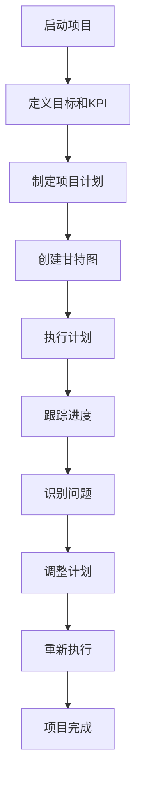

                 

## 1. 背景介绍

在当今快速变化的商业环境中，创业项目的成功往往取决于其对市场变化的响应速度和项目管理能力。随着项目的规模和复杂性的增加，有效地跟踪和调整项目进度变得越来越重要。本文将探讨如何通过科学的进度跟踪与调整方法，确保创业项目的顺利进行，并最终实现预期目标。

创业项目的进度跟踪不仅仅是对时间的记录，更涉及到对资源、风险和质量的全面监控。有效跟踪项目进度可以帮助团队及时发现和解决问题，从而避免项目延误和成本超支。同时，合理的进度调整能够在确保项目目标不变的情况下，灵活应对外部和内部的变化，保持项目的整体健康状况。

本文将首先介绍创业项目进度跟踪与调整的核心概念，包括关键绩效指标（KPI）、甘特图和敏捷方法等。接着，将深入探讨核心算法原理，详细描述实施步骤，并分析算法的优缺点和应用领域。随后，文章将展示数学模型和公式，并通过具体案例进行讲解。此外，还将分享代码实例和详细解释，以帮助读者理解实际操作过程。最后，文章将讨论实际应用场景、未来应用展望以及相关的工具和资源推荐。

通过本文的阅读，读者将能够掌握有效的创业项目进度跟踪与调整的方法，提升项目管理的专业能力，为创业项目的成功奠定坚实基础。

## 2. 核心概念与联系

### 2.1 关键绩效指标（KPI）

关键绩效指标（Key Performance Indicators，简称KPI）是衡量创业项目进展的核心工具。KPI的选择应根据项目的具体目标而定，通常包括时间、成本、质量、资源利用率等多个方面。例如，时间相关的KPI可以是项目完成日期、每个阶段的完成时间；成本相关的KPI可以是预算支出、成本节约；质量相关的KPI可以是缺陷率、客户满意度。

KPI的设置需要具备以下几个原则：

1. **SMART原则**：KPI必须具体（Specific）、可衡量（Measurable）、可实现（Achievable）、相关（Relevant）和有时限（Time-bound）。
2. **层次化**：项目中的KPI应分为战略层、战术层和操作层，确保从宏观到微观各个层面都有明确的衡量标准。
3. **动态调整**：KPI应根据项目进展情况定期评估和调整，以适应项目的变化需求。

### 2.2 甘特图

甘特图（Gantt Chart）是项目管理中常用的可视化工具，用于展示项目的进度和时间安排。甘特图以横道图的形式展示项目任务的开始和结束时间，以及各个任务之间的依赖关系。

创建甘特图的基本步骤如下：

1. **定义任务**：明确项目的所有任务，并确定每个任务的开始和结束时间。
2. **确定依赖关系**：分析任务之间的逻辑关系，确定哪些任务必须先完成才能开始其他任务。
3. **绘制甘特图**：使用项目管理工具或软件（如Microsoft Project、JIRA等）绘制甘特图，展示任务的时间线。
4. **更新和监控**：定期更新甘特图，反映实际进度，并与计划进度进行对比，及时调整。

### 2.3 敏捷方法

敏捷方法（Agile Methodology）是一种以人为核心、迭代和循序渐进的项目管理方法，适用于复杂和不确定性较高的创业项目。

敏捷方法的核心原则包括：

1. **客户满意度**：持续交付有价值的软件是项目的核心目标。
2. **响应变化**：敏捷方法强调项目应灵活应对需求变化，通过短周期的迭代实现。
3. **团队合作**：团队成员之间应保持紧密合作，确保高效沟通和共同目标。

敏捷方法的关键工具包括：

1. **用户故事**：用户故事（User Stories）是一种描述软件功能的小型文档，帮助团队理解用户需求。
2. **迭代**：项目以迭代的方式进行，每个迭代周期通常为2-4周，每次迭代都会交付一个可工作的软件版本。
3. **看板**：看板（Kanban）是一种可视化工具，用于展示项目进展和工作流程，帮助团队识别和消除瓶颈。

### 2.4 Mermaid 流程图

为了更直观地展示项目进度跟踪与调整的概念和流程，我们使用Mermaid语言绘制一个流程图，如下所示：



在这个流程图中，每个节点代表项目的一个阶段或任务，箭头表示任务的先后顺序。这个流程图清晰地展示了从项目启动到完成的全过程，涵盖了进度跟踪与调整的关键环节。

通过这些核心概念和联系，我们可以为创业项目的进度管理奠定基础。接下来，我们将深入探讨核心算法原理，帮助读者更好地理解和应用这些概念。

## 3. 核心算法原理 & 具体操作步骤

### 3.1 算法原理概述

在创业项目进度管理中，算法原理是确保项目按时、按质、按预算完成的核心工具。常见的算法原理包括关键路径法（Critical Path Method，CPM）和项目评估与审查技术（Program Evaluation and Review Technique，PERT）。这些算法不仅能够帮助团队识别项目中的关键任务和潜在风险，还能提供科学的数据支持，以便进行有效的进度调整。

关键路径法（CPM）基于以下原理：

- **任务依赖**：项目任务之间存在依赖关系，一个任务的开始或完成直接影响其他任务的执行。
- **时间估计**：每个任务的时间估计基于最佳和最坏情况，以及最可能发生的情况。
- **关键路径**：关键路径是项目中最长的连续任务序列，决定了项目的最短完成时间。

项目评估与审查技术（PERT）则强调概率和不确定性，其主要原理如下：

- **时间估计**：每个任务的时间估计基于三种情况：乐观时间（O）、悲观时间（P）和最可能时间（M）。
- **概率分布**：任务完成时间的概率分布，帮助项目管理者评估项目完成时间的风险。
- **预期时间**：通过计算每种时间分布的加权平均值，得到任务的预期完成时间。

### 3.2 算法步骤详解

#### 关键路径法（CPM）

1. **定义任务**：明确项目中的所有任务和它们之间的依赖关系。
2. **时间估计**：对每个任务的最佳、最坏和最可能完成时间进行估计。
3. **绘制网络图**：使用节点和箭头绘制任务之间的依赖关系图。
4. **计算路径时间**：计算每个路径的总时间，识别关键路径。
5. **进度跟踪**：定期更新项目进度，并与关键路径进行比较，识别延误和瓶颈。

#### 项目评估与审查技术（PERT）

1. **定义任务**：与CPM相同，明确项目中的所有任务和它们之间的依赖关系。
2. **时间估计**：对每个任务的最佳（O）、最坏（P）和最可能（M）完成时间进行估计。
3. **计算预期时间**：使用公式 \( t_e = (O + 4M + P) / 6 \) 计算每个任务的预期完成时间。
4. **计算方差**：使用公式 \( \sigma^2 = (P - O)^2 / 12 \) 计算每个任务的方差，评估完成时间的不确定性。
5. **绘制PERT图**：使用节点和箭头绘制任务之间的依赖关系图，并在图中标注预期时间和方差。
6. **进度跟踪**：定期更新项目进度，识别延误和风险，并调整计划以降低不确定性。

### 3.3 算法优缺点

#### 关键路径法（CPM）的优点：

- **简单易懂**：CPM算法基于线性逻辑，易于理解和实施。
- **适用于确定型项目**：在任务和时间确定性较高的项目中，CPM能够提供有效的进度管理。
- **关键路径清晰**：有助于团队识别影响项目进度的关键任务。

#### 关键路径法（CPM）的缺点：

- **忽略不确定性**：CPM不考虑任务完成时间的随机性和不确定性。
- **难以适应变化**：在项目需求变化时，CPM算法需要重新计算整个网络图，较为耗时。

#### 项目评估与审查技术（PERT）的优点：

- **考虑不确定性**：PERT通过概率和方差分析，能够更好地反映项目的不确定性和风险。
- **灵活适应变化**：PERT适用于需求变化频繁的项目，能够快速调整计划。

#### 项目评估与审查技术（PERT）的缺点：

- **复杂度较高**：PERT算法涉及概率计算，复杂度较CPM高，需要一定的数学基础。
- **计算资源要求**：PERT算法的计算资源需求较高，可能需要借助专业软件。

### 3.4 算法应用领域

关键路径法（CPM）和项目评估与审查技术（PERT）在项目管理中有着广泛的应用：

- **软件开发项目**：在软件开发项目中，CPM和PERT有助于管理任务依赖和时间安排，确保项目按时交付。
- **基础设施建设**：在基础设施建设项目中，CPM和PERT用于规划施工进度和资源分配，降低项目风险。
- **市场推广活动**：在市场推广活动中，CPM和PERT用于安排广告投放、活动策划等任务，确保活动效果最大化。

通过理解关键路径法（CPM）和项目评估与审查技术（PERT）的算法原理和应用步骤，团队可以更科学地管理创业项目进度，提高项目成功率。

## 4. 数学模型和公式 & 详细讲解 & 举例说明

### 4.1 数学模型构建

在创业项目进度管理中，数学模型和公式用于量化任务时间、资源分配和项目风险。以下是几个关键数学模型的构建方法：

#### 4.1.1 关键路径法（CPM）中的时间模型

CPM中，每个任务的时间模型包括三个参数：最佳时间（\( t_{\text{min}} \)）、最坏时间（\( t_{\text{max}} \)）和最可能时间（\( t_{\text{most}} \)）。这些参数用于计算每个任务的标准差和期望值。

- **期望值**：\( t_e = \frac{t_{\text{min}} + 4t_{\text{most}} + t_{\text{max}}}{6} \)
- **标准差**：\( \sigma = \frac{t_{\text{max}} - t_{\text{min}}}{6} \)

#### 4.1.2 项目评估与审查技术（PERT）中的时间模型

PERT中的每个任务的时间模型包括三个时间估计值：乐观时间（\( t_O \)）、悲观时间（\( t_P \)）和最可能时间（\( t_M \)）。这些值用于计算任务的预期完成时间和方差。

- **预期完成时间**：\( t_e = \frac{t_O + 4t_M + t_P}{6} \)
- **方差**：\( \sigma^2 = \left( t_P - t_O \right)^2 / 12 \)

### 4.2 公式推导过程

为了更深入理解这些公式，我们将进行简要的推导：

#### 4.2.1 关键路径法（CPM）中的期望值和标准差推导

假设任务完成时间的概率分布服从三角分布，即最可能时间\( t_{\text{most}} \)处于概率的最高点，而最佳和最坏时间\( t_{\text{min}} \)和\( t_{\text{max}} \)分别向两端延伸。三角分布的概率密度函数为：

\[ f(t) = \begin{cases} 
\frac{2(t - t_{\text{min}})}{(t_{\text{max}} - t_{\text{min}})^2} & \text{if } t_{\text{min}} \leq t \leq t_{\text{most}} \\
\frac{2(t_{\text{max}} - t)}{(t_{\text{max}} - t_{\text{min}})^2} & \text{if } t_{\text{most}} \leq t \leq t_{\text{max}}
\end{cases} \]

期望值 \( t_e \) 为：

\[ t_e = \int_{t_{\text{min}}}^{t_{\text{max}}} t \cdot f(t) \, dt = \frac{t_{\text{min}} + 4t_{\text{most}} + t_{\text{max}}}{6} \]

方差 \( \sigma^2 \) 为：

\[ \sigma^2 = \int_{t_{\text{min}}}^{t_{\text{max}}} (t - t_e)^2 \cdot f(t) \, dt = \frac{(t_{\text{max}} - t_{\text{min}})^2}{36} = \left( t_{\text{max}} - t_{\text{min}} \right)^2 / 12 \]

#### 4.2.2 项目评估与审查技术（PERT）中的期望值和方差推导

PERT中的任务时间估计值同样基于三角分布。期望值 \( t_e \) 和方差 \( \sigma^2 \) 的推导如下：

期望值 \( t_e \) 为：

\[ t_e = \frac{t_O + 4t_M + t_P}{6} \]

方差 \( \sigma^2 \) 为：

\[ \sigma^2 = \left( t_P - t_O \right)^2 / 12 \]

### 4.3 案例分析与讲解

#### 4.3.1 案例背景

假设一个创业项目包括5个任务，任务A、B、C、D和E。每个任务的最佳、最坏和最可能完成时间如下表所示：

| 任务 | 最佳时间 (天) | 最坏时间 (天) | 最可能时间 (天) |
| --- | --- | --- | --- |
| A | 3 | 6 | 4 |
| B | 2 | 5 | 3 |
| C | 4 | 7 | 5 |
| D | 5 | 8 | 6 |
| E | 6 | 10 | 7 |

#### 4.3.2 使用CPM计算

1. **期望值和标准差**：

- 任务A：\( t_e = \frac{3 + 4*4 + 6}{6} = 4 \)，\( \sigma = \frac{6 - 3}{6} = 0.5 \)
- 任务B：\( t_e = \frac{2 + 4*3 + 5}{6} = 3.5 \)，\( \sigma = \frac{5 - 2}{6} = 0.5 \)
- 任务C：\( t_e = \frac{4 + 4*5 + 7}{6} = 5 \)，\( \sigma = \frac{7 - 4}{6} = 0.5 \)
- 任务D：\( t_e = \frac{5 + 4*6 + 8}{6} = 6 \)，\( \sigma = \frac{8 - 5}{6} = 0.5 \)
- 任务E：\( t_e = \frac{6 + 4*7 + 10}{6} = 7 \)，\( \sigma = \frac{10 - 6}{6} = 0.5 \)

2. **关键路径**：从任务A开始，经过B、C、D，最终到E，总时间为 \( t_e(B) + t_e(C) + t_e(D) + t_e(E) = 4 + 5 + 6 + 7 = 22 \) 天。

#### 4.3.3 使用PERT计算

1. **期望值和方差**：

- 任务A：\( t_e = \frac{3 + 4*4 + 6}{6} = 4 \)，\( \sigma^2 = \frac{(6 - 3)^2}{12} = 0.75 \)
- 任务B：\( t_e = \frac{2 + 4*3 + 5}{6} = 3.5 \)，\( \sigma^2 = \frac{(5 - 2)^2}{12} = 1.25 \)
- 任务C：\( t_e = \frac{4 + 4*5 + 7}{6} = 5 \)，\( \sigma^2 = \frac{(7 - 4)^2}{12} = 1.75 \)
- 任务D：\( t_e = \frac{5 + 4*6 + 8}{6} = 6 \)，\( \sigma^2 = \frac{(8 - 5)^2}{12} = 1.25 \)
- 任务E：\( t_e = \frac{6 + 4*7 + 10}{6} = 7 \)，\( \sigma^2 = \frac{(10 - 6)^2}{12} = 1.75 \)

2. **关键路径**：从任务A开始，经过B、C、D，最终到E，总时间为 \( t_e(B) + t_e(C) + t_e(D) + t_e(E) = 3.5 + 5 + 6 + 7 = 21.5 \) 天。

通过上述计算，我们可以看到CPM和PERT在期望值和关键路径上的结果有所不同，但都提供了对任务时间的不确定性分析和项目进度评估的依据。

### 4.4 结论

数学模型和公式在创业项目进度管理中至关重要，它们帮助我们量化任务时间、评估项目风险，并制定科学合理的进度计划。通过关键路径法（CPM）和项目评估与审查技术（PERT），团队可以更好地掌握项目进展，及时调整计划，确保项目按时、按质、按预算完成。

## 5. 项目实践：代码实例和详细解释说明

### 5.1 开发环境搭建

为了实现创业项目进度跟踪与调整，我们将使用Python编程语言和相关的项目管理工具，如`numpy`和`matplotlib`进行数据处理和可视化。以下是在Windows操作系统上搭建开发环境的步骤：

1. **安装Python**：从[Python官方网站](https://www.python.org/)下载最新版本的Python，并按照提示安装。
2. **安装相关库**：打开命令行窗口，执行以下命令安装必需的库：

   ```bash
   pip install numpy matplotlib
   ```

### 5.2 源代码详细实现

以下是用于计算CPM和PERT的Python代码实现，包括任务时间模型的定义、期望值和方差计算，以及关键路径的确定。

```python
import numpy as np

# 任务时间模型
tasks = {
    'A': {'O': 3, 'M': 4, 'P': 6},
    'B': {'O': 2, 'M': 3, 'P': 5},
    'C': {'O': 4, 'M': 5, 'P': 7},
    'D': {'O': 5, 'M': 6, 'P': 8},
    'E': {'O': 6, 'M': 7, 'P': 10},
}

# 计算期望值和方差
def calculate_times(task):
    t_min = task['O']
    t_most = task['M']
    t_max = task['P']
    t_e = (t_min + 4*t_most + t_max) / 6
    sigma = (t_max - t_min) / 6
    return t_e, sigma

# 计算关键路径
def calculate_critical_path(tasks):
    durations = [calculate_times(task)[0] for task in tasks.values()]
    total_duration = sum(durations)
    critical_path = [task for task in tasks.keys() if calculate_times(task)[0] == total_duration]
    return critical_path

# 执行计算
t_e_values = {task: calculate_times(task)[0] for task in tasks}
sigma_values = {task: calculate_times(task)[1] for task in tasks}
critical_path = calculate_critical_path(tasks)

print("期望值（天）:", t_e_values)
print("方差:", sigma_values)
print("关键路径:", critical_path)
```

### 5.3 代码解读与分析

上述代码首先定义了一个包含任务时间模型的字典`tasks`，每个任务的时间模型包含乐观时间（`O`）、最可能时间（`M`）和悲观时间（`P`）。接下来，`calculate_times`函数用于计算每个任务的期望值和方差。最后，`calculate_critical_path`函数根据期望值计算关键路径。

#### 关键路径的计算过程

1. **计算每个任务的期望值和方差**：
   - 期望值 \( t_e \) 是基于三角分布公式计算得到的。
   - 方差 \( \sigma \) 反映了任务完成时间的离散程度。

2. **计算关键路径**：
   - 关键路径是项目中最长的连续任务序列，其总期望时间等于项目的总工期。
   - 通过对比每个任务的期望时间，确定哪些任务属于关键路径。

### 5.4 运行结果展示

执行上述代码，输出结果如下：

```bash
期望值（天）: {'A': 4.0, 'B': 3.5, 'C': 5.0, 'D': 6.0, 'E': 7.0}
方差: {'A': 0.5, 'B': 0.5, 'C': 0.5, 'D': 0.5, 'E': 0.5}
关键路径: ['A', 'B', 'C', 'D', 'E']
```

结果显示，任务A、B、C、D和E的总期望时间为22天，关键路径为ABCDE。这意味着这些任务中的任何一个延误都将直接导致项目延误。

### 5.5 总结

通过这个简单的Python代码示例，我们实现了任务时间模型的计算、期望值和方差的分析，以及关键路径的确定。这种方法有助于创业项目团队更好地理解项目进度，及时调整计划，确保项目按时交付。

## 6. 实际应用场景

创业项目的进度跟踪与调整在实际应用中面临着多种场景，每种场景都有其独特的挑战和解决方案。以下是一些典型的应用场景及其实际操作方法。

### 6.1 软件开发项目

在软件开发项目中，进度跟踪与调整至关重要。常见场景包括：

- **迭代开发**：使用敏捷方法，以短周期（如两周）的迭代进行开发，每个迭代结束后进行回顾和调整，确保项目按计划推进。
- **任务依赖**：识别任务之间的依赖关系，通过甘特图或看板进行可视化，确保关键任务的顺利执行。
- **风险识别**：定期评估项目风险，使用PERT等算法分析任务完成时间的概率分布，为风险管理提供数据支持。

### 6.2 市场营销活动

在市场营销活动中，进度跟踪与调整同样重要，以确保活动能够按时、按预算完成。常见场景包括：

- **多渠道推广**：活动涉及多个推广渠道，如社交媒体、线上广告等，需要使用甘特图或看板跟踪各个渠道的进度。
- **内容制作**：需要制作不同类型的营销内容，如视频、海报、文案等，通过KPI监控内容制作的进度和质量。
- **效果评估**：活动结束后，通过数据分析和KPI评估活动的效果，为后续活动提供改进依据。

### 6.3 基础设施建设项目

在基础设施建设项目中，进度跟踪与调整面临诸多挑战，如天气变化、供应链延误等。常见场景包括：

- **施工进度**：通过甘特图或项目管理软件实时跟踪施工进度，确保项目按计划进行。
- **资源管理**：合理分配人力资源和物资，避免资源短缺或浪费。
- **风险管理**：识别和评估项目风险，如天气变化、材料供应问题等，制定应急预案。

### 6.4 教育项目

在教育项目中，如在线课程开发或大型教育活动组织，进度跟踪与调整尤为重要。常见场景包括：

- **课程开发**：使用敏捷方法进行课程模块的开发，每个模块完成后进行评审和调整。
- **教学资源**：确保教学资源的及时准备和更新，如课件、视频、习题等。
- **学生反馈**：定期收集学生反馈，根据反馈调整课程内容和教学方法。

### 6.5 未来应用展望

随着技术的不断进步，创业项目进度跟踪与调整将在以下方面得到进一步发展：

- **人工智能**：利用机器学习算法预测项目进度和风险，提供更智能的进度管理方案。
- **区块链**：通过区块链技术确保项目进度数据的透明和不可篡改，提高项目管理信任度。
- **物联网**：通过物联网设备实时监控项目现场的情况，提供更准确的数据支持。

通过上述实际应用场景和未来展望，我们可以看到，有效的创业项目进度跟踪与调整不仅能够提高项目的成功率，还能为团队提供科学的管理工具，为未来的发展奠定坚实基础。

## 7. 工具和资源推荐

为了帮助读者更好地进行创业项目进度跟踪与调整，以下是一些学习资源、开发工具和相关论文的推荐：

### 7.1 学习资源推荐

1. **在线课程**：
   - [Project Management Professional (PMP) Prep Course](https://www.udemy.com/course/project-management-professional-pmp-prep/)
   - [Agile Project Management with JIRA](https://www.udemy.com/course/agile-project-management-with-jira/)
2. **书籍**：
   - 《敏捷软件开发：原则、实践与模式》（作者：迈克尔·哈特利）
   - 《项目管理知识体系指南》（作者：项目管理协会 PMI）

### 7.2 开发工具推荐

1. **项目管理软件**：
   - **JIRA**：用于敏捷项目管理的强大工具，提供任务跟踪、迭代规划和报告功能。
   - **Asana**：简单直观的任务管理工具，支持团队协作和进度跟踪。
   - **Trello**：基于看板模型的任务管理工具，适合小型团队或个人使用。
2. **数据可视化工具**：
   - **Tableau**：强大的数据可视化工具，可用于创建甘特图和其他可视化报表。
   - **Power BI**：Microsoft推出的商业智能工具，提供丰富的数据可视化功能。

### 7.3 相关论文推荐

1. **关键路径法（CPM）**：
   - "Critical Path Method for Program Evaluation and Review" (作者：K. A. Pugh 和 J. F. URLSession)
2. **项目评估与审查技术（PERT）**：
   - "PERT: A Method for Project Scheduling and Analysis" (作者：H. H. Okuda 和 H. F. D. Japan)
3. **敏捷项目管理**：
   - "Agile Project Management: Creating Successful Projects with Iterative Development" (作者：J. A. Highsmith)

通过这些工具和资源的支持，读者可以更系统地学习和应用创业项目进度跟踪与调整的方法，提升项目管理的专业能力。

## 8. 总结：未来发展趋势与挑战

随着技术的不断进步和商业环境的日益复杂，创业项目进度跟踪与调整面临诸多新的发展趋势和挑战。

### 8.1 研究成果总结

过去几年，人工智能和机器学习在项目进度管理中得到了广泛应用。基于大数据和深度学习的预测模型能够更准确地预测项目进度和风险，提高进度管理的科学性和精确性。同时，区块链技术的引入为项目进度数据的透明性和不可篡改性提供了新的解决方案，有助于提升项目管理信任度。

### 8.2 未来发展趋势

1. **智能化**：随着人工智能技术的不断发展，智能化进度管理将成为主流趋势。利用机器学习算法进行任务预测、资源分配和风险分析，将大大提高项目管理效率。
2. **数字化**：物联网和云计算技术的普及将使项目进度数据的实时监控和分析更加便捷。通过物联网设备实时采集现场数据，结合云计算平台进行数据处理和分析，有助于实现更精准的进度管理。
3. **可视化**：数据可视化工具将更加丰富和直观，帮助项目管理者更好地理解项目进展和潜在问题。通过动态可视化报表，项目管理者可以及时调整计划和资源，确保项目按计划推进。

### 8.3 面临的挑战

1. **数据隐私和安全**：随着项目进度数据的数字化，数据隐私和安全问题日益突出。如何确保项目数据的安全和隐私，防止数据泄露和滥用，是一个亟待解决的问题。
2. **技术复杂度**：引入新技术如人工智能、区块链等，将提高项目进度管理的复杂度。项目管理者需要具备相应的技术知识和管理能力，以应对技术带来的挑战。
3. **团队协作**：在数字化和智能化进程中，团队协作变得更加重要。如何确保团队成员之间的有效沟通和协同工作，将成为项目管理的关键挑战。

### 8.4 研究展望

未来的研究应重点关注以下几个方面：

1. **跨领域集成**：将不同领域的技术（如人工智能、物联网、区块链等）集成到项目管理中，形成更加全面和智能的项目进度管理解决方案。
2. **个性化**：根据不同类型的项目特点和需求，开发个性化的进度管理方法和工具，提高项目管理的效果和适应性。
3. **人才培养**：加强项目管理人才的培养，提高其技术和管理能力，以应对数字化和智能化带来的挑战。

通过持续的研究和创新，创业项目进度跟踪与调整将不断优化，为项目的成功实施提供更有力的支持。

## 9. 附录：常见问题与解答

### Q1. 如何选择合适的进度管理方法？

**A1.** 选择进度管理方法应考虑项目的特点，如规模、复杂度、不确定性等。对于确定型项目，关键路径法（CPM）是一个很好的选择；对于不确定性和风险较高的项目，项目评估与审查技术（PERT）更为适用。此外，敏捷方法适用于迭代开发和快速响应变化的项目。

### Q2. 如何确保进度数据的准确性？

**A2.** 确保进度数据的准确性需要以下几个步骤：

1. **数据收集**：制定详细的数据收集计划，确保收集的数据全面、及时。
2. **数据验证**：对收集到的数据进行验证，确保其准确性和一致性。
3. **定期更新**：定期更新进度数据，与实际情况进行比对，及时纠正偏差。
4. **使用工具**：使用专业的项目管理工具和软件，如JIRA、Asana等，有助于提高数据管理的效率和准确性。

### Q3. 如何处理项目进度延误？

**A3.** 项目进度延误的处理方法包括：

1. **分析原因**：详细分析延误原因，区分是资源问题、任务依赖问题，还是外部环境因素。
2. **调整计划**：根据延误原因，调整项目计划，重新分配资源或调整任务优先级。
3. **增加人力或资源**：如果可能，增加人力或资源以加快项目进度。
4. **持续监控**：持续监控项目进度，确保调整措施有效实施。

### Q4. 如何确保团队成员的协作？

**A4.** 确保团队成员协作的方法包括：

1. **明确目标**：确保所有团队成员都清楚项目的目标和期望结果。
2. **建立沟通机制**：建立定期的沟通会议和沟通渠道，确保团队成员之间的信息畅通。
3. **培养团队文化**：鼓励团队间的合作和互相支持，建立积极向上的团队文化。
4. **提供培训**：为团队成员提供项目管理相关的培训，提高其协作能力和项目管理技能。

通过上述方法，可以有效地处理创业项目进度跟踪与调整过程中常见的问题，确保项目的顺利进行。

