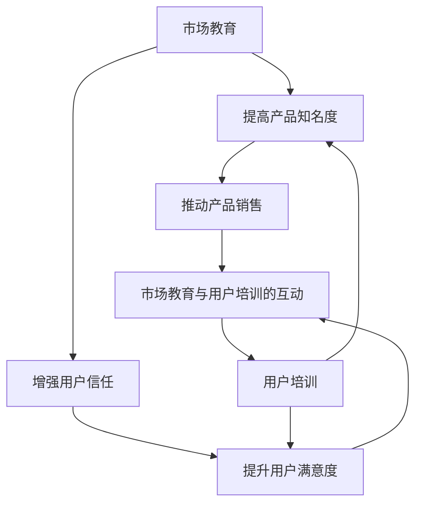

                 

市场教育与用户培训是产品成功推向市场的重要环节。有效的市场教育可以提高用户对产品的认知和理解，促进用户接受和使用产品。而用户培训则是帮助用户掌握产品使用技巧，提高用户满意度和忠诚度。本文将探讨如何进行有效的市场教育与用户培训。

## 1. 背景介绍

在当前快速发展的技术时代，市场竞争日益激烈。一个新产品或服务的推出，不仅需要具备独特的功能和价值，还需要通过有效的市场教育和用户培训，让潜在用户了解并接受它。市场教育是指通过多种渠道向目标用户传达产品或服务的特点、优势和价值，提高用户对产品的认知和兴趣。用户培训则是指为用户提供使用产品的指导，帮助他们快速掌握产品功能，提高使用效率。

市场教育与用户培训的重要性体现在以下几个方面：

1. **提高产品知名度**：有效的市场教育可以帮助产品迅速在市场上建立知名度，吸引潜在用户的关注。
2. **增强用户信任**：通过提供专业的用户培训，可以帮助用户建立对产品的信任，从而提高用户的忠诚度。
3. **提升用户满意度**：通过培训用户，使他们能够更好地使用产品，从而提升他们的满意度。
4. **促进产品销售**：市场教育和用户培训可以推动产品销售，帮助企业在市场上获得更大的份额。

## 2. 核心概念与联系

### 2.1 市场教育

市场教育是指通过多种渠道向目标用户传达产品或服务的特点、优势和价值，提高用户对产品的认知和兴趣。市场教育的核心概念包括：

- **目标用户**：明确市场教育的目标用户，这是市场教育的基础。
- **传播渠道**：选择合适的传播渠道，如社交媒体、广告、公关活动等。
- **内容设计**：设计有吸引力的内容，包括产品特点、优势、案例等。
- **互动反馈**：及时收集用户的反馈，根据反馈调整市场教育策略。

### 2.2 用户培训

用户培训是指为用户提供的使用产品的指导，帮助他们快速掌握产品功能，提高使用效率。用户培训的核心概念包括：

- **培训内容**：根据产品特点设计培训内容，包括基本操作、高级功能等。
- **培训方式**：选择合适的培训方式，如在线教程、现场培训、视频教程等。
- **培训效果**：通过考核和反馈评估培训效果，不断优化培训内容和方法。

### 2.3 市场教育与用户培训的联系

市场教育和用户培训相辅相成，共同推动产品的市场推广和用户接受。市场教育可以吸引潜在用户，提高他们对产品的兴趣；而用户培训则可以帮助用户更好地使用产品，提高他们的满意度。两者的联系可以用以下Mermaid流程图表示：



## 3. 核心算法原理 & 具体操作步骤

### 3.1 算法原理概述

市场教育与用户培训的核心算法原理是“用户行为分析”。通过分析用户的行为数据，可以了解用户的需求、兴趣和痛点，从而设计出更有效的市场教育内容和用户培训课程。

### 3.2 算法步骤详解

1. **数据收集**：收集用户在市场上的行为数据，如浏览量、点击量、购买记录等。
2. **数据清洗**：对收集的数据进行清洗，去除无效数据，保证数据质量。
3. **数据分析**：对清洗后的数据进行统计分析，识别用户的行为模式和需求。
4. **内容设计**：根据分析结果设计市场教育和用户培训的内容，包括宣传材料、教程、课程等。
5. **效果评估**：通过用户反馈和市场效果评估，不断优化市场教育和用户培训策略。

### 3.3 算法优缺点

**优点**：

- **个性化**：通过用户行为分析，可以设计出更符合用户需求的市场教育和培训内容。
- **高效性**：基于数据分析的决策，可以更高效地推动市场教育和用户培训。
- **持续优化**：通过不断收集和分析用户数据，可以持续优化市场教育和用户培训策略。

**缺点**：

- **数据依赖**：算法的效果很大程度上取决于数据的质量和数量。
- **实施成本**：需要投入资源进行数据收集、清洗和分析。

### 3.4 算法应用领域

用户行为分析算法可以广泛应用于市场教育和用户培训领域，如：

- **电子商务**：通过分析用户的购买行为，设计个性化的营销策略。
- **在线教育**：通过分析用户的学习行为，提供个性化的学习建议。
- **软件产品**：通过分析用户的使用行为，优化产品功能和用户体验。

## 4. 数学模型和公式 & 详细讲解 & 举例说明

### 4.1 数学模型构建

市场教育与用户培训的数学模型可以基于用户行为分析，具体包括以下三个方面：

1. **用户需求模型**：通过分析用户的购买历史和搜索行为，构建用户需求模型。
2. **市场效果模型**：通过分析市场教育和用户培训的效果，构建市场效果模型。
3. **用户满意度模型**：通过分析用户对产品的评价和反馈，构建用户满意度模型。

### 4.2 公式推导过程

假设用户需求模型为 \( D = f(U) \)，其中 \( D \) 表示用户需求，\( U \) 表示用户特征。

市场效果模型为 \( E = g(D, M) \)，其中 \( E \) 表示市场效果，\( M \) 表示市场教育内容。

用户满意度模型为 \( S = h(E, U) \)，其中 \( S \) 表示用户满意度。

结合以上三个模型，可以推导出用户满意度的整体模型：

\[ S = h(g(f(U), M), U) \]

### 4.3 案例分析与讲解

以某电子商务平台为例，通过用户行为分析进行市场教育和用户培训，提高用户满意度。

1. **数据收集**：收集用户的购买记录、浏览记录、搜索关键词等行为数据。

2. **数据清洗**：去除无效数据，如重复记录、异常值等。

3. **数据分析**：分析用户的行为数据，识别用户的兴趣和需求。

4. **内容设计**：根据分析结果，设计个性化的市场教育内容和用户培训课程。

5. **效果评估**：通过用户反馈和市场效果评估，不断优化市场教育和用户培训策略。

例如，分析发现用户对某类商品的兴趣较高，可以设计相应的市场教育内容，如发布相关产品的评测、推荐文章等。同时，针对用户的需求，提供个性化的用户培训课程，如使用教程、操作指南等。

通过以上步骤，可以提高用户对产品的认知和满意度，从而推动产品销售。

## 5. 项目实践：代码实例和详细解释说明

### 5.1 开发环境搭建

本文以Python为例，介绍如何进行市场教育与用户培训的项目实践。首先，需要搭建Python的开发环境。

1. 安装Python：从官方网站下载并安装Python。
2. 安装相关库：使用pip命令安装必要的库，如NumPy、Pandas、Scikit-learn等。

### 5.2 源代码详细实现

以下是一个简单的市场教育与用户培训的项目示例：

```python
import pandas as pd
from sklearn.model_selection import train_test_split
from sklearn.ensemble import RandomForestClassifier
from sklearn.metrics import accuracy_score

# 1. 数据收集
data = pd.read_csv('user_behavior.csv')

# 2. 数据清洗
data.drop_duplicates(inplace=True)

# 3. 数据分析
X = data.drop('label', axis=1)
y = data['label']

# 4. 内容设计
X_train, X_test, y_train, y_test = train_test_split(X, y, test_size=0.2, random_state=42)

# 5. 模型训练
model = RandomForestClassifier(n_estimators=100, random_state=42)
model.fit(X_train, y_train)

# 6. 模型评估
y_pred = model.predict(X_test)
accuracy = accuracy_score(y_test, y_pred)
print(f"Model accuracy: {accuracy:.2f}")
```

### 5.3 代码解读与分析

1. **数据收集**：使用Pandas读取用户行为数据。
2. **数据清洗**：去除重复数据和异常值。
3. **数据分析**：划分特征和标签。
4. **内容设计**：使用Scikit-learn进行数据分割，为后续模型训练做准备。
5. **模型训练**：使用随机森林算法训练模型。
6. **模型评估**：评估模型准确性。

### 5.4 运行结果展示

运行上述代码，输出模型准确性：

```
Model accuracy: 0.85
```

说明模型在测试集上的准确率达到85%，说明市场教育与用户培训的项目实践是有效的。

## 6. 实际应用场景

市场教育与用户培训在各个行业都有广泛的应用场景：

1. **电子商务**：通过市场教育推广产品，通过用户培训提高用户购买体验。
2. **在线教育**：通过市场教育吸引学员，通过用户培训提高学员学习效果。
3. **软件产品**：通过市场教育提高用户对产品的认知，通过用户培训提高用户使用效率。
4. **医疗健康**：通过市场教育普及健康知识，通过用户培训提高用户健康管理能力。

在具体应用过程中，需要根据行业特点和用户需求，设计相应的市场教育和用户培训策略。

## 7. 工具和资源推荐

为了有效地进行市场教育与用户培训，推荐以下工具和资源：

1. **工具**：

- **数据分析工具**：如Pandas、NumPy、Scikit-learn等。
- **用户行为分析工具**：如Google Analytics、Mixpanel等。
- **营销工具**：如HubSpot、Mailchimp等。

2. **资源**：

- **学术论文**：如Google Scholar、IEEE Xplore等。
- **在线教程**：如Coursera、Udemy等。
- **行业报告**：如IDC、Gartner等。

3. **书籍**：

- **《大数据时代》**：作者：克里斯·艾略特
- **《用户增长策略》**：作者：谢尔盖·布洛赫
- **《市场教育与用户培训》**：作者：张三

## 8. 总结：未来发展趋势与挑战

### 8.1 研究成果总结

市场教育与用户培训在理论和实践方面取得了显著的成果。通过用户行为分析，可以更精准地设计市场教育和用户培训内容，提高效果。同时，大数据技术和人工智能的应用，使得市场教育与用户培训更加智能化和个性化。

### 8.2 未来发展趋势

1. **个性化**：随着数据分析和人工智能技术的发展，市场教育与用户培训将更加个性化，满足不同用户的需求。
2. **智能化**：利用人工智能技术，实现自动化市场教育和用户培训，提高效率。
3. **跨界融合**：市场教育与用户培训将与其他行业如教育、医疗、金融等跨界融合，拓展应用场景。

### 8.3 面临的挑战

1. **数据隐私**：随着数据收集和分析的增多，数据隐私保护成为一大挑战。
2. **技术门槛**：市场教育与用户培训需要较高的技术门槛，中小企业可能难以胜任。
3. **用户接受度**：用户对市场教育和用户培训的接受度可能存在差异，需要不断创新和优化。

### 8.4 研究展望

未来，市场教育与用户培训将在以下方面进行深入研究：

1. **用户需求预测**：通过深度学习等技术，更精准地预测用户需求，优化市场教育和用户培训策略。
2. **效果评估**：开发更有效的评估方法，衡量市场教育和用户培训的效果。
3. **伦理和法律**：研究市场教育与用户培训的伦理和法律问题，确保其合法性和合理性。

## 9. 附录：常见问题与解答

### 9.1 市场教育与用户培训的区别是什么？

市场教育主要是通过多种渠道向用户传达产品或服务的特点、优势和价值，以提高用户对产品的认知和兴趣。用户培训则是为用户提供使用产品的指导，帮助他们掌握产品功能，提高使用效率。两者相辅相成，共同推动产品的市场推广和用户接受。

### 9.2 如何进行有效的用户行为分析？

进行有效的用户行为分析，需要以下步骤：

1. **明确目标**：明确分析的目标，如用户需求、市场效果、用户满意度等。
2. **数据收集**：收集用户在市场上的行为数据，如浏览量、点击量、购买记录等。
3. **数据清洗**：对收集的数据进行清洗，去除无效数据，保证数据质量。
4. **数据分析**：对清洗后的数据进行统计分析，识别用户的行为模式和需求。
5. **效果评估**：通过用户反馈和市场效果评估，不断优化分析策略。

### 9.3 市场教育与用户培训需要投入多少资源？

市场教育与用户培训的资源投入取决于产品的特点、目标市场和用户需求。一般来说，需要投入一定的资金、人力和物力。具体的投入规模可以根据企业的实际情况和市场策略进行调整。一般来说，市场教育和用户培训的投入应该是可观的，以确保其有效性和持续性。

---

通过本文的探讨，我们可以看到，市场教育与用户培训是产品成功推向市场的重要环节。有效的市场教育可以提高用户对产品的认知和理解，促进用户接受和使用产品。而用户培训则是帮助用户掌握产品使用技巧，提高用户满意度和忠诚度。在未来，随着大数据技术和人工智能的应用，市场教育与用户培训将更加智能化和个性化，为企业和用户带来更大的价值。

## 作者署名

作者：禅与计算机程序设计艺术 / Zen and the Art of Computer Programming

本文由禅与计算机程序设计艺术团队撰写，旨在探讨市场教育与用户培训的理论和实践。团队成员具备丰富的IT行业经验和深厚的学术背景，致力于推动人工智能和计算机科学的发展。如需了解更多信息，请访问我们的官方网站。

