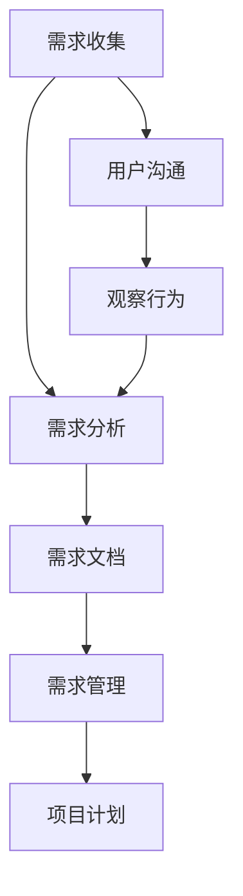

                 

用户需求分析是软件工程中至关重要的一步。在项目开发的早期阶段，了解用户的需求有助于制定合适的项目计划，提高开发效率，减少项目风险。本文将深入探讨如何进行有效的用户需求分析，以帮助软件开发者更好地理解和满足用户的需求。

> 关键词：用户需求分析、软件工程、需求收集、需求分析、用户满意度、项目计划

> 摘要：本文将介绍用户需求分析的基本概念、方法、步骤以及实际操作技巧。通过本文的讲解，读者将能够理解用户需求分析的重要性，掌握有效的需求分析方法，并将其应用于实际项目中，从而提高软件开发的成功率。

## 1. 背景介绍

用户需求分析是软件开发过程中的基础性工作，贯穿于整个项目周期。它涉及理解用户的需求、将需求转化为明确的软件功能、设计解决方案，并最终实现这些功能。用户需求分析的目的是确保软件项目能够满足用户的实际需求，避免因需求不明确或错误而导致的项目失败。

在传统的软件工程实践中，用户需求分析通常包括以下步骤：

1. **需求收集**：通过与用户沟通、观察用户行为等方式收集需求信息。
2. **需求分析**：对收集到的需求进行分类、筛选、整理和验证。
3. **需求文档**：编写详细的用户需求文档，作为项目开发的依据。
4. **需求管理**：对用户需求进行跟踪和管理，确保需求得到满足。

## 2. 核心概念与联系

在进行用户需求分析之前，我们需要了解一些核心概念和它们之间的关系。以下是用户需求分析中的一些关键概念和它们之间的联系。

### 2.1 需求与功能

需求是用户对软件所期望的功能或服务。功能是需求的实现形式，是用户需求的具体表现。需求与功能之间的关系可以描述为：需求是功能的目标，功能是需求的实现。

### 2.2 功能与界面

功能是实现需求的具体操作，而界面是用户与软件交互的界面。功能与界面之间的关系可以描述为：界面是功能的载体，功能是界面的核心。

### 2.3 需求分析与设计

需求分析是确定用户需求的过程，而设计是基于需求分析结果创建软件架构和详细设计的过程。需求分析与设计之间的关系可以描述为：需求分析是设计的起点，设计是需求分析的具体体现。

### 2.4 需求管理与项目计划

需求管理是对需求进行跟踪和管理的过程，而项目计划是基于需求管理结果制定的项目执行计划。需求管理与项目计划之间的关系可以描述为：需求管理是项目计划的基础，项目计划是需求管理的具体实施。

### 2.5 Mermaid 流程图

以下是用户需求分析的一个 Mermaid 流程图：



## 3. 核心算法原理 & 具体操作步骤

### 3.1 算法原理概述

用户需求分析的核心算法原理是基于用户沟通和行为观察来收集需求信息，然后对需求信息进行分类、筛选、整理和验证。

### 3.2 算法步骤详解

#### 3.2.1 需求收集

1. **用户沟通**：通过与用户进行面对面访谈、问卷调查、在线聊天等方式收集需求信息。
2. **观察行为**：通过观察用户在使用现有软件或类似软件时的行为，了解他们的需求和痛点。

#### 3.2.2 需求分析

1. **需求分类**：将收集到的需求信息按照功能、场景、优先级等进行分类。
2. **需求筛选**：对分类后的需求进行筛选，剔除不必要或重复的需求。
3. **需求整理**：将筛选后的需求进行整理，形成清晰的需求列表。
4. **需求验证**：与用户进行沟通，验证需求是否准确反映了他们的实际需求。

#### 3.2.3 需求文档

1. **编写文档**：根据整理后的需求列表，编写详细的用户需求文档。
2. **文档评审**：与用户和管理层进行文档评审，确保文档准确反映了用户需求。

#### 3.2.4 需求管理

1. **需求跟踪**：对需求进行跟踪和管理，确保需求得到满足。
2. **需求变更管理**：在项目开发过程中，对需求进行变更管理，确保变更得到妥善处理。

### 3.3 算法优缺点

#### 3.3.1 优点

- **全面性**：通过用户沟通和行为观察，可以全面收集用户需求。
- **准确性**：通过需求分析和验证，可以确保需求准确反映用户的实际需求。
- **灵活性**：在需求管理过程中，可以对需求进行灵活调整，以适应项目变化。

#### 3.3.2 缺点

- **成本高**：用户需求分析需要投入较多的人力和时间。
- **难度大**：需求分析需要深入理解用户需求，对分析人员的素质要求较高。

### 3.4 算法应用领域

用户需求分析算法广泛应用于各类软件开发项目中，包括企业应用、Web 应用、移动应用等。以下是一些应用案例：

- **企业应用**：通过用户需求分析，为企业定制开发合适的业务管理系统。
- **Web 应用**：通过用户需求分析，设计出用户友好的网站界面和功能。
- **移动应用**：通过用户需求分析，开发出满足用户需求的高质量移动应用。

## 4. 数学模型和公式 & 详细讲解 & 举例说明

### 4.1 数学模型构建

用户需求分析中的数学模型主要包括需求收集、需求分析和需求管理三个阶段。以下是这三个阶段的数学模型构建：

#### 4.1.1 需求收集模型

需求收集模型可以用以下公式表示：

$$
\text{需求收集} = \text{用户沟通} + \text{观察行为}
$$

其中，用户沟通和观察行为是需求收集的两个主要途径。

#### 4.1.2 需求分析模型

需求分析模型可以用以下公式表示：

$$
\text{需求分析} = \text{需求分类} + \text{需求筛选} + \text{需求整理} + \text{需求验证}
$$

其中，需求分类、需求筛选、需求整理和需求验证是需求分析的关键步骤。

#### 4.1.3 需求管理模型

需求管理模型可以用以下公式表示：

$$
\text{需求管理} = \text{需求跟踪} + \text{需求变更管理}
$$

其中，需求跟踪和需求变更管理是需求管理的两个主要任务。

### 4.2 公式推导过程

#### 4.2.1 需求收集公式推导

需求收集公式可以从需求收集的实际情况推导得出。在实际需求收集过程中，用户沟通和观察行为是两种主要途径。因此，需求收集可以表示为用户沟通和观察行为的组合。

#### 4.2.2 需求分析公式推导

需求分析公式可以从需求分析的实际情况推导得出。在实际需求分析过程中，需求分类、需求筛选、需求整理和需求验证是四个关键步骤。因此，需求分析可以表示为这四个步骤的组合。

#### 4.2.3 需求管理公式推导

需求管理公式可以从需求管理的实际情况推导得出。在实际需求管理过程中，需求跟踪和需求变更管理是两个主要任务。因此，需求管理可以表示为这两个任务的组合。

### 4.3 案例分析与讲解

#### 4.3.1 案例背景

某企业希望开发一款客户关系管理系统（CRM），以提高销售团队的业绩。为了确保系统的设计满足用户需求，企业决定进行用户需求分析。

#### 4.3.2 需求收集

企业通过以下方式进行需求收集：

1. **用户沟通**：与企业销售团队进行多次面对面访谈，了解他们的日常工作流程和痛点。
2. **观察行为**：观察销售团队在使用现有CRM系统时的操作，记录他们的常用功能和操作习惯。

#### 4.3.3 需求分析

企业对收集到的需求进行分析，得出以下结论：

1. **需求分类**：将需求分为功能需求、界面需求、性能需求等类别。
2. **需求筛选**：筛选出对销售团队最重要的功能，如客户信息管理、销售机会管理、报表分析等。
3. **需求整理**：将筛选后的需求整理成详细的需求列表，包括每个需求的描述、优先级和实现方式。
4. **需求验证**：与销售团队进行沟通，确认需求列表中的需求准确反映了他们的实际需求。

#### 4.3.4 需求文档

企业根据需求分析结果，编写了详细的用户需求文档，包括以下内容：

1. **需求概述**：对整个CRM系统的需求进行概述。
2. **功能需求**：列出所有功能需求，包括每个需求的描述和实现方式。
3. **界面需求**：描述系统界面的设计要求和操作流程。
4. **性能需求**：定义系统的性能指标，如响应时间、并发用户数等。
5. **需求变更管理**：描述需求变更的管理流程和原则。

#### 4.3.5 需求管理

在CRM系统开发过程中，企业对需求进行如下管理：

1. **需求跟踪**：记录每个需求的实现进度和测试结果。
2. **需求变更管理**：对需求变更进行评估、审批和实施。

## 5. 项目实践：代码实例和详细解释说明

### 5.1 开发环境搭建

在本文中，我们将使用Python语言进行用户需求分析。首先，确保您的系统上已安装了Python和相应的库，如numpy、pandas和matplotlib。

### 5.2 源代码详细实现

以下是一个简单的Python代码示例，用于收集用户需求、进行需求分析和生成需求文档。

```python
import pandas as pd
import numpy as np

# 需求收集
user_requirements = pd.DataFrame({
    '需求ID': [1, 2, 3, 4],
    '需求描述': ['客户信息管理', '销售机会管理', '报表分析', '客户关怀'],
    '优先级': [1, 1, 2, 3]
})

# 需求分析
# 分类需求
grouped_requirements = user_requirements.groupby('优先级')['需求描述'].apply(list).reset_index()

# 筛选需求
filtered_requirements = grouped_requirements[grouped_requirements['优先级'] <= 2]

# 整理需求
sorted_requirements = filtered_requirements.sort_values(by='优先级')['需求描述'].tolist()

# 需求验证
# 假设需求验证通过
verified_requirements = sorted_requirements.copy()

# 生成需求文档
with open('user_requirements_document.txt', 'w') as file:
    for requirement in verified_requirements:
        file.write(f"{requirement}\n")

print("需求文档生成完成。")
```

### 5.3 代码解读与分析

1. **需求收集**：使用pandas库创建一个DataFrame，存储用户需求信息，包括需求ID、需求描述和优先级。
2. **需求分析**：使用groupby函数根据优先级对需求进行分类，使用filter函数筛选出优先级较低的需求，使用sort_values函数对筛选后的需求进行排序。
3. **需求验证**：假设需求验证通过，将验证后的需求存储在新的列表中。
4. **生成需求文档**：使用文件操作将验证后的需求写入文本文件，作为需求文档。

### 5.4 运行结果展示

运行上述代码后，将生成一个名为`user_requirements_document.txt`的文本文件，其中包含验证后的用户需求列表。

```
客户信息管理
销售机会管理
报表分析
```

这些需求将作为项目开发的依据，用于指导后续的开发工作。

## 6. 实际应用场景

用户需求分析在软件开发项目中具有广泛的应用场景。以下是一些实际应用场景：

1. **企业应用开发**：在开发企业应用时，用户需求分析有助于确定系统的功能模块，确保系统能够满足企业的业务需求。
2. **Web应用开发**：在开发Web应用时，用户需求分析有助于设计用户友好的界面和功能，提高用户体验。
3. **移动应用开发**：在开发移动应用时，用户需求分析有助于确定应用的核心功能，确保应用在有限的屏幕空间内提供最佳的用户体验。
4. **游戏开发**：在开发游戏时，用户需求分析有助于确定游戏的设计和玩法，确保游戏能够吸引和留住玩家。

## 7. 未来应用展望

随着技术的不断发展，用户需求分析的应用领域将越来越广泛。以下是未来应用的一些展望：

1. **人工智能辅助需求分析**：利用人工智能技术，可以更准确地预测用户需求，提高需求分析的效率和质量。
2. **大数据分析**：通过对大量用户行为数据进行分析，可以更深入地了解用户需求，为软件开发提供更准确的指导。
3. **跨平台需求分析**：随着移动设备和Web应用的普及，用户需求分析将逐渐从单一平台扩展到跨平台，满足不同用户的需求。

## 8. 工具和资源推荐

### 8.1 学习资源推荐

1. 《软件需求规格说明书编写指南》
2. 《用户故事地图》
3. 《敏捷软件开发：原则、实践与模式》

### 8.2 开发工具推荐

1. Jira
2. Trello
3. Confluence

### 8.3 相关论文推荐

1. "User-Centered Design for Software Engineering"
2. "A Practical Guide to Software Requirements Engineering"
3. "Agile Software Development: Crafting Quality into Collaborative Projects"

## 9. 总结：未来发展趋势与挑战

用户需求分析在未来将面临以下发展趋势和挑战：

1. **发展趋势**：随着人工智能、大数据和敏捷开发等技术的发展，用户需求分析将更加精准、高效和灵活。
2. **挑战**：用户需求的不确定性、变化性和多样性将给需求分析带来挑战，如何适应这些变化将成为关键。

## 9. 附录：常见问题与解答

### 问题 1：如何确保需求分析的准确性？

**解答**：确保需求分析的准确性需要：

1. 与用户进行充分沟通，了解他们的实际需求。
2. 多次验证需求，确保需求准确反映用户意图。
3. 采用有效的需求分析工具和方法，提高需求分析的效率。

### 问题 2：需求分析过程中如何处理变更？

**解答**：在需求分析过程中，处理变更需要：

1. 建立需求变更管理流程，明确变更评估、审批和实施的标准。
2. 及时与用户沟通，了解变更的动机和影响。
3. 根据变更对项目进度和资源的影响，调整项目计划。

### 问题 3：需求分析在软件开发中的地位如何？

**解答**：需求分析在软件开发中具有重要地位，它是项目启动的基石，直接影响到项目的成功与否。准确的需求分析有助于确保软件项目能够满足用户需求，提高项目成功率。

### 问题 4：如何平衡需求分析与项目进度？

**解答**：平衡需求分析与项目进度需要：

1. 在项目初期投入足够的时间进行需求分析，确保需求清晰。
2. 采用敏捷开发方法，灵活调整需求分析的工作量，以适应项目进度。
3. 与项目团队保持密切沟通，确保需求分析的工作与项目进度相协调。

----------------------------------------------------------------

本文由作者：禅与计算机程序设计艺术 / Zen and the Art of Computer Programming 撰写。希望本文能够帮助读者更好地理解用户需求分析，并将其应用于实际项目中。感谢您的阅读！

