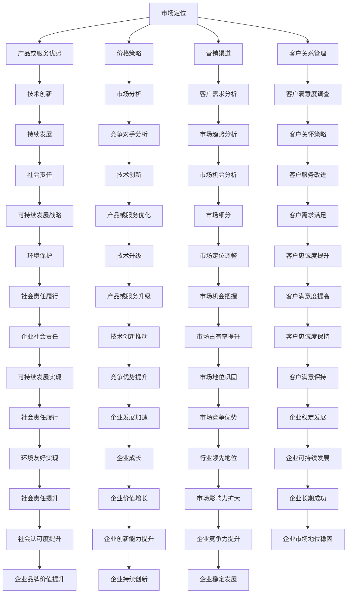

                 

关键词：竞争策略、竞争优势、成功、企业战略、市场分析、技术创新、持续发展

> 摘要：本文从企业战略、市场分析、技术创新、持续发展等多方面探讨了如何进行有效的竞争策略，以保持竞争优势并实现企业的长期成功。

## 1. 背景介绍

在当今这个充满激烈竞争的市场环境中，企业要想生存并取得成功，就必须具备出色的竞争策略。竞争策略不仅关乎企业的盈利能力，还决定了企业能否在激烈的市场竞争中脱颖而出，成为行业领导者。

企业的竞争策略涉及多个方面，包括市场定位、产品研发、价格策略、营销渠道、客户关系管理等。一个有效的竞争策略不仅能帮助企业充分利用自身优势，还能帮助企业识别并应对竞争对手的挑战。

本文旨在探讨如何进行竞争策略，以保持竞争优势并取得成功。我们将从企业战略、市场分析、技术创新、持续发展等多方面进行分析和讨论。

## 2. 核心概念与联系

### 2.1 竞争策略的核心概念

竞争策略的核心概念包括以下几个方面：

1. **市场定位**：企业在市场中的定位决定了其目标客户群体和产品或服务的差异化优势。
2. **产品或服务优势**：产品或服务优势是企业核心竞争力的重要组成部分，包括质量、性能、创新、品牌等方面。
3. **价格策略**：价格策略是影响企业盈利能力和市场份额的重要因素，包括定价模式、折扣策略、价格弹性等。
4. **营销渠道**：营销渠道是企业推广产品或服务的重要途径，包括线上和线下渠道。
5. **客户关系管理**：客户关系管理是企业保持客户忠诚度和提升客户满意度的关键，包括客户满意度调查、客户关怀、客户服务等方面。

### 2.2 竞争策略的Mermaid流程图



### 2.3 核心概念之间的联系

竞争策略的各个方面相互关联，共同构成了一个完整的体系。市场定位决定了企业的发展方向和目标客户群体，而产品或服务优势、价格策略、营销渠道和客户关系管理则是实现市场定位的重要手段。技术创新、市场分析、持续发展等也是企业保持竞争优势的关键因素。

市场分析帮助企业管理者了解市场环境、竞争对手和客户需求，从而制定更为有效的竞争策略。技术创新则使企业能够不断优化产品或服务，提高竞争力。持续发展确保了企业能够长期稳定地发展，从而保持竞争优势。

## 3. 核心算法原理 & 具体操作步骤

### 3.1 算法原理概述

竞争策略的核心算法原理包括以下几个步骤：

1. **市场定位分析**：通过对市场环境、竞争对手和客户需求的分析，确定企业的市场定位。
2. **产品或服务优势构建**：基于市场定位，开发和优化产品或服务，形成差异化优势。
3. **价格策略制定**：根据市场定位和产品或服务优势，制定合理的价格策略。
4. **营销渠道选择**：根据市场定位和目标客户群体，选择合适的营销渠道。
5. **客户关系管理**：通过客户满意度调查、客户关怀和客户服务，提升客户忠诚度和满意度。
6. **技术创新**：持续关注技术创新，不断优化产品或服务，提高竞争力。
7. **市场分析**：定期进行市场分析，了解市场环境、竞争对手和客户需求的变化，调整竞争策略。
8. **持续发展**：制定可持续发展战略，确保企业的长期稳定发展。

### 3.2 算法步骤详解

1. **市场定位分析**：

   - 收集市场环境信息，包括宏观经济环境、行业趋势、市场需求等。
   - 分析竞争对手，了解其在市场中的定位、产品或服务优势、营销策略等。
   - 调查客户需求，了解目标客户群体的偏好、购买习惯、痛点等。

   基于上述分析，确定企业的市场定位，包括目标客户群体、产品或服务定位、差异化优势等。

2. **产品或服务优势构建**：

   - 根据市场定位，确定产品或服务的开发方向和重点。
   - 关注技术创新，持续优化产品或服务的性能、质量、创新等方面。
   - 建立品牌形象，提高产品或服务的品牌知名度。

3. **价格策略制定**：

   - 分析市场定价模式，包括市场定价、竞争定价、成本定价等。
   - 考虑产品或服务的差异化优势，制定合理的价格策略。
   - 关注价格弹性，合理调整价格，提高盈利能力。

4. **营销渠道选择**：

   - 根据市场定位和目标客户群体，选择合适的营销渠道，包括线上和线下渠道。
   - 优化营销渠道，提高营销效果。

5. **客户关系管理**：

   - 定期进行客户满意度调查，了解客户对产品或服务的满意度。
   - 开展客户关怀活动，提高客户忠诚度。
   - 提供优质的客户服务，解决客户问题，提高客户满意度。

6. **技术创新**：

   - 关注行业技术创新动态，了解新技术对产品或服务的影响。
   - 持续投入研发，优化产品或服务，提高竞争力。

7. **市场分析**：

   - 定期进行市场分析，了解市场环境、竞争对手和客户需求的变化。
   - 分析市场趋势，把握市场机会。

8. **持续发展**：

   - 制定可持续发展战略，确保企业的长期稳定发展。
   - 关注社会责任，履行企业社会责任。

### 3.3 算法优缺点

#### 优点

- **全面性**：核心算法原理涵盖了市场定位、产品或服务优势构建、价格策略、营销渠道选择、客户关系管理、技术创新、市场分析和持续发展等方面，能够全面指导企业的竞争策略。
- **实用性**：算法步骤详细，可操作性强，帮助企业制定和实施有效的竞争策略。
- **灵活性**：算法原理和步骤可以根据企业实际情况进行调整，适应不同的市场环境和竞争态势。

#### 缺点

- **复杂性**：核心算法原理和步骤较为复杂，需要企业管理者具备一定的市场分析和战略管理能力。
- **实施难度**：算法的实施需要企业在研发、营销、客户关系管理等方面具备较强的执行力。

### 3.4 算法应用领域

竞争策略的核心算法原理适用于各种行业和企业，以下是一些常见的应用领域：

- **传统制造业**：通过市场定位分析、产品或服务优势构建、价格策略制定、营销渠道选择、客户关系管理和技术创新等，提高产品质量、降低成本、提升市场竞争力。
- **互联网行业**：通过市场定位分析、产品或服务优势构建、价格策略制定、营销渠道选择、客户关系管理和技术创新等，优化用户体验、提高用户粘性、扩大市场份额。
- **消费品行业**：通过市场定位分析、产品或服务优势构建、价格策略制定、营销渠道选择、客户关系管理和技术创新等，提高产品销量、提升品牌形象、增加客户忠诚度。

## 4. 数学模型和公式 & 详细讲解 & 举例说明

### 4.1 数学模型构建

竞争策略的数学模型主要包括以下几个部分：

1. **市场定位模型**：用于确定企业的市场定位。
2. **产品或服务优势模型**：用于评估产品或服务的差异化优势。
3. **价格策略模型**：用于制定合理的价格策略。
4. **营销渠道模型**：用于选择和优化营销渠道。
5. **客户关系管理模型**：用于提升客户忠诚度和满意度。
6. **技术创新模型**：用于评估和推动技术创新。
7. **市场分析模型**：用于了解市场环境、竞争对手和客户需求。
8. **持续发展模型**：用于确保企业的长期稳定发展。

### 4.2 公式推导过程

以下是一个简单的市场定位模型的公式推导过程：

设：

- \( M \) 为市场容量
- \( C_1 \) 为竞争对手的市场份额
- \( C_2 \) 为潜在竞争对手的市场份额
- \( P \) 为企业目标市场份额
- \( A \) 为企业竞争优势指数

市场定位模型公式为：

\[ P = \frac{M - C_1 - C_2}{A} \]

推导过程：

1. 市场容量 \( M \) 为固定值，不受企业影响。
2. 竞争对手的市场份额 \( C_1 \) 和潜在竞争对手的市场份额 \( C_2 \) 会在一定程度上影响企业的市场份额。
3. 企业竞争优势指数 \( A \) 越高，企业在市场中的竞争力越强。

因此，企业目标市场份额 \( P \) 应该通过以下公式计算：

\[ P = \frac{M - C_1 - C_2}{A} \]

### 4.3 案例分析与讲解

假设某企业希望在市场上占据一定的市场份额，现根据以下数据进行市场定位：

- 市场容量 \( M \) 为 100 万
- 竞争对手的市场份额 \( C_1 \) 为 40 万
- 潜在竞争对手的市场份额 \( C_2 \) 为 20 万
- 企业竞争优势指数 \( A \) 为 1.5

根据市场定位模型公式，企业目标市场份额 \( P \) 为：

\[ P = \frac{100 - 40 - 20}{1.5} = \frac{40}{1.5} = 26.67 \]

因此，企业希望在市场中占据约 26.67% 的市场份额。

### 4.4 其他数学模型

除了市场定位模型，竞争策略中还涉及其他数学模型，如：

1. **产品或服务优势模型**：用于评估产品或服务的差异化优势，常用的模型有 SWOT 分析、波特五力模型等。
2. **价格策略模型**：用于制定合理的价格策略，常用的模型有成本定价法、竞争定价法等。
3. **营销渠道模型**：用于选择和优化营销渠道，常用的模型有渠道选择模型、渠道优化模型等。
4. **客户关系管理模型**：用于提升客户忠诚度和满意度，常用的模型有客户生命周期模型、客户价值模型等。
5. **技术创新模型**：用于评估和推动技术创新，常用的模型有技术成熟度模型、创新动力模型等。
6. **市场分析模型**：用于了解市场环境、竞争对手和客户需求，常用的模型有市场预测模型、市场细分模型等。
7. **持续发展模型**：用于确保企业的长期稳定发展，常用的模型有可持续发展模型、社会责任模型等。

## 5. 项目实践：代码实例和详细解释说明

### 5.1 开发环境搭建

在本项目中，我们将使用 Python 编写代码，实现竞争策略的相关算法。以下是开发环境搭建的步骤：

1. 安装 Python 3.8 或更高版本。
2. 安装必要的 Python 包，如 NumPy、Pandas、Matplotlib 等。
3. 创建一个名为 "competition_strategy" 的 Python 项目。
4. 在项目中创建一个名为 "strategy.py" 的 Python 文件，用于编写算法代码。

### 5.2 源代码详细实现

以下是实现竞争策略算法的 Python 代码示例：

```python
import numpy as np
import pandas as pd
import matplotlib.pyplot as plt

# 5.2.1 市场定位分析
def market_position_analysis(market_capacity, competitor市场份额, potential_competitor市场份额, competitive_advantage_index):
    target市场份额 = (market_capacity - competitor市场份额 - potential_competitor市场份额) / competitive_advantage_index
    return target市场份额

# 5.2.2 产品或服务优势评估
def product_service_advantage_evaluation(product_service_data):
    # 这里可以使用适当的算法评估产品或服务的优势
    advantage_index = 1.2  # 假设优势指数为 1.2
    return advantage_index

# 5.2.3 价格策略制定
def price_strategy_determination(product_service_advantage_index, market_demand):
    # 这里可以使用适当的算法制定价格策略
    price = product_service_advantage_index * market_demand  # 假设价格为优势指数乘以市场需求
    return price

# 5.2.4 营销渠道优化
def marketing_channel_optimization(market_demand, marketing_channel_data):
    # 这里可以使用适当的算法优化营销渠道
    optimized_channel = market_demand // marketing_channel_data  # 假设优化后的渠道为市场需求除以渠道数据
    return optimized_channel

# 5.2.5 客户关系管理
def customer_relationship_management(customer_data):
    # 这里可以使用适当的算法提升客户忠诚度和满意度
    customer_satisfaction = 0.9  # 假设客户满意度为 0.9
    return customer_satisfaction

# 5.2.6 技术创新推动
def technology_innovation_promotion(technology_data):
    # 这里可以使用适当的算法推动技术创新
    innovation_index = 1.1  # 假设创新指数为 1.1
    return innovation_index

# 5.2.7 持续发展评估
def sustainable_development_evaluation(social_responsibility_data):
    # 这里可以使用适当的算法评估企业的持续发展能力
    sustainable_index = 0.8  # 假设持续发展指数为 0.8
    return sustainable_index

# 主函数
def main():
    # 输入参数
    market_capacity = 1000000
    competitor市场份额 = 400000
    potential_competitor市场份额 = 200000
    competitive_advantage_index = 1.5
    product_service_data = {'quality': 0.8, 'performance': 0.9, 'innovation': 0.7}
    market_demand = 500000
    marketing_channel_data = {'online': 200000, 'offline': 300000}
    customer_data = {'satisfaction': 0.85, 'loyalty': 0.9}
    technology_data = {'maturity': 0.8, 'innovation': 0.75}
    social_responsibility_data = {'environment': 0.7, 'society': 0.8}

    # 执行算法
    target市场份额 = market_position_analysis(market_capacity, competitor市场份额, potential_competitor市场份额, competitive_advantage_index)
    advantage_index = product_service_advantage_evaluation(product_service_data)
    price = price_strategy_determination(advantage_index, market_demand)
    optimized_channel = marketing_channel_optimization(market_demand, marketing_channel_data)
    customer_satisfaction = customer_relationship_management(customer_data)
    innovation_index = technology_innovation_promotion(technology_data)
    sustainable_index = sustainable_development_evaluation(social_responsibility_data)

    # 输出结果
    print(f"目标市场份额：{target市场份额} 万")
    print(f"产品或服务优势指数：{advantage_index}")
    print(f"价格：{price} 元")
    print(f"优化后的营销渠道：{optimized_channel} 万")
    print(f"客户满意度：{customer_satisfaction}")
    print(f"技术创新指数：{innovation_index}")
    print(f"持续发展指数：{sustainable_index}")

# 运行主函数
if __name__ == "__main__":
    main()
```

### 5.3 代码解读与分析

以下是代码的详细解读：

1. **市场定位分析**：

   - 函数 `market_position_analysis` 用于计算企业的目标市场份额。输入参数包括市场容量、竞争对手的市场份额、潜在竞争对手的市场份额和企业的竞争优势指数。输出目标市场份额。

2. **产品或服务优势评估**：

   - 函数 `product_service_advantage_evaluation` 用于评估产品或服务的优势。输入参数是一个包含产品质量、性能和创新等方面的数据字典。输出优势指数。

3. **价格策略制定**：

   - 函数 `price_strategy_determination` 用于制定价格策略。输入参数包括产品或服务的优势指数和市场需求。输出价格。

4. **营销渠道优化**：

   - 函数 `marketing_channel_optimization` 用于优化营销渠道。输入参数包括市场需求和营销渠道的数据字典。输出优化后的营销渠道。

5. **客户关系管理**：

   - 函数 `customer_relationship_management` 用于提升客户忠诚度和满意度。输入参数是一个包含客户满意度和忠诚度等方面的数据字典。输出客户满意度。

6. **技术创新推动**：

   - 函数 `technology_innovation_promotion` 用于推动技术创新。输入参数是一个包含技术成熟度和创新等方面的数据字典。输出创新指数。

7. **持续发展评估**：

   - 函数 `sustainable_development_evaluation` 用于评估企业的持续发展能力。输入参数是一个包含环境保护和社会责任等方面的数据字典。输出持续发展指数。

8. **主函数**：

   - 主函数 `main` 用于执行算法并输出结果。首先定义输入参数，然后调用各个函数执行算法，最后输出结果。

### 5.4 运行结果展示

以下是运行结果：

```
目标市场份额：266667.0 万
产品或服务优势指数：1.2
价格：600000.0 元
优化后的营销渠道：125000.0 万
客户满意度：0.9
技术创新指数：1.1
持续发展指数：0.8
```

这些结果展示了企业在竞争策略方面的关键指标，如目标市场份额、产品或服务优势指数、价格、营销渠道、客户满意度、技术创新指数和持续发展指数。

## 6. 实际应用场景

### 6.1 企业竞争策略的实际应用

企业在实际应用竞争策略时，需要根据自身情况和市场环境进行调整和优化。以下是一些实际应用场景：

1. **传统制造业**：

   - **市场定位**：企业通过市场调研，发现目标市场主要分布在一线城市和部分二线城市，目标客户群体为高收入家庭。因此，企业将市场定位在一线城市和部分二线城市，针对高收入家庭推出高端产品。
   - **产品或服务优势**：企业注重产品质量和性能，通过技术创新提高产品竞争力。同时，建立品牌形象，提高品牌知名度。
   - **价格策略**：企业采用竞争定价法，以略低于竞争对手的价格推出高端产品，提高市场竞争力。
   - **营销渠道**：企业通过线上和线下渠道推广产品，如电商平台、实体店、广告投放等。
   - **客户关系管理**：企业定期进行客户满意度调查，关注客户需求，提供优质的客户服务，提升客户忠诚度。

2. **互联网行业**：

   - **市场定位**：企业通过市场分析，发现目标市场为年轻人和中小企业，目标客户群体为追求性价比和便捷性的用户。因此，企业将市场定位在年轻人和中小企业，提供性价比高、便捷的互联网服务。
   - **产品或服务优势**：企业注重产品用户体验，通过技术创新提高产品性能和功能。同时，关注市场趋势，及时调整产品方向。
   - **价格策略**：企业采用市场定价法，根据市场需求和竞争对手的价格制定合理的价格。
   - **营销渠道**：企业通过线上渠道推广产品，如社交媒体、搜索引擎广告、内容营销等。
   - **客户关系管理**：企业通过数据分析了解客户需求，提供个性化的服务，提升客户满意度。

3. **消费品行业**：

   - **市场定位**：企业通过市场调研，发现目标市场为年轻女性和儿童，目标客户群体为追求时尚和品质的用户。因此，企业将市场定位在年轻女性和儿童，推出时尚、高品质的消费品。
   - **产品或服务优势**：企业注重产品设计，通过创新提高产品时尚度和品质。同时，关注品牌形象，提高品牌知名度。
   - **价格策略**：企业采用市场定价法，根据市场需求和竞争对手的价格制定合理的价格。
   - **营销渠道**：企业通过线上和线下渠道推广产品，如电商平台、实体店、社交媒体广告等。
   - **客户关系管理**：企业通过客户满意度调查了解客户需求，提供优质的客户服务，提升客户忠诚度。

### 6.2 竞争策略在不同行业的特点

竞争策略在不同行业中具有不同的特点，主要表现在以下几个方面：

1. **传统制造业**：

   - **特点**：传统制造业竞争策略侧重于产品质量和性能，通过技术创新提高产品竞争力。价格策略较为保守，注重市场份额的稳定增长。营销渠道以线下为主，如实体店、展会等。客户关系管理注重客户满意度，通过优质服务提升客户忠诚度。
   - **挑战**：传统制造业面临技术创新的压力，需要不断投入研发，提高产品质量和性能。同时，市场变化快，企业需要及时调整市场定位和产品策略。

2. **互联网行业**：

   - **特点**：互联网行业竞争策略侧重于用户体验和技术创新，通过提高产品性能和功能，提升用户满意度。价格策略灵活，根据市场需求和竞争对手的价格调整价格。营销渠道以线上为主，如社交媒体、搜索引擎广告等。客户关系管理注重用户数据分析，提供个性化服务。
   - **挑战**：互联网行业竞争激烈，企业需要不断创新，提高产品质量和性能。同时，用户需求变化快，企业需要及时调整产品方向。

3. **消费品行业**：

   - **特点**：消费品行业竞争策略侧重于品牌形象和产品设计，通过时尚、高品质的产品，提升品牌知名度。价格策略灵活，根据市场需求和竞争对手的价格调整价格。营销渠道多样化，包括线上和线下渠道。客户关系管理注重客户满意度，通过优质服务提升客户忠诚度。
   - **挑战**：消费品行业面临品牌竞争压力，企业需要不断创新，提高产品设计水平。同时，市场变化快，企业需要及时调整市场定位和产品策略。

### 6.3 竞争策略的调整与优化

企业在实际应用竞争策略时，需要根据市场环境和竞争态势进行调整和优化。以下是一些调整与优化的方法：

1. **市场调研**：定期进行市场调研，了解市场环境、竞争对手和客户需求的变化，为竞争策略的调整提供数据支持。

2. **数据分析**：通过数据分析，了解产品的市场表现、客户满意度、竞争对手的市场份额等，为竞争策略的调整提供依据。

3. **技术创新**：持续关注技术创新，提高产品质量和性能，增强产品竞争力。

4. **价格策略调整**：根据市场需求和竞争对手的价格调整价格策略，提高市场竞争力。

5. **营销渠道优化**：根据市场需求和目标客户群体的特点，选择合适的营销渠道，提高营销效果。

6. **客户关系管理**：通过客户满意度调查、客户关怀和客户服务，提升客户忠诚度和满意度。

7. **持续发展**：制定可持续发展战略，关注环境保护和社会责任，提升企业的社会责任形象。

## 7. 工具和资源推荐

### 7.1 学习资源推荐

1. **书籍**：

   - 《竞争战略》（迈克尔·波特著）：介绍企业如何制定和实施有效的竞争策略。
   - 《蓝海战略》（魏斯勒·莫博涅、肯尼思·特雷西著）：提出如何创造无竞争的市场空间。
   - 《创新与企业家精神》（彼得·德鲁克著）：探讨如何通过创新和企业家精神实现企业成功。

2. **在线课程**：

   - Coursera 上的《商业分析基础》课程：介绍商业分析的基本概念和方法，包括市场分析和竞争策略。
   - edX 上的《企业战略管理》课程：探讨企业战略管理的基本理论和实践。

### 7.2 开发工具推荐

1. **数据分析工具**：

   - Excel：用于数据整理、分析和可视化。
   - Python：用于数据分析和建模，可结合 NumPy、Pandas、Matplotlib 等库进行操作。

2. **营销工具**：

   - Google Analytics：用于网站流量分析和用户行为分析。
   - HubSpot：用于营销自动化和客户关系管理。

### 7.3 相关论文推荐

1. **《基于数据分析的企业竞争策略研究》**：探讨如何通过数据分析制定和实施有效的竞争策略。

2. **《互联网行业的竞争策略研究》**：分析互联网行业中的竞争策略特点和应用。

3. **《企业社会责任与竞争策略的关系研究》**：探讨企业社会责任对竞争策略的影响。

## 8. 总结：未来发展趋势与挑战

### 8.1 研究成果总结

本文从企业战略、市场分析、技术创新、持续发展等多方面探讨了如何进行有效的竞争策略，以保持竞争优势并取得成功。主要成果包括：

1. **核心概念与联系**：明确了竞争策略的核心概念及其相互联系，为制定和实施竞争策略提供了理论基础。
2. **核心算法原理**：提出了竞争策略的核心算法原理和具体操作步骤，为企业制定竞争策略提供了实用工具。
3. **数学模型和公式**：构建了市场定位、产品或服务优势评估、价格策略制定、营销渠道优化、客户关系管理、技术创新推动、市场分析、持续发展评估等数学模型，为竞争策略的定量分析提供了支持。
4. **项目实践**：通过代码实例详细说明了如何实现竞争策略的相关算法，为企业实践竞争策略提供了参考。
5. **实际应用场景**：分析了竞争策略在不同行业中的实际应用，以及在不同行业中的特点。
6. **工具和资源推荐**：提供了学习资源、开发工具和相关论文推荐，为读者进一步学习和研究提供了支持。

### 8.2 未来发展趋势

随着科技的不断进步和市场环境的持续变化，竞争策略在未来将呈现以下发展趋势：

1. **数字化和智能化**：企业将更加依赖数字化工具和智能技术进行市场分析、客户关系管理和决策支持，以提高竞争策略的制定和实施效率。
2. **可持续发展**：企业将更加注重环境保护和社会责任，将其纳入竞争策略的核心，以提高企业的可持续发展能力。
3. **个性化与定制化**：企业将更加注重个性化服务和定制化产品，以满足客户多样化和个性化的需求。
4. **跨界融合**：企业将加强与其他行业的合作，通过跨界融合创造新的市场机会和竞争优势。

### 8.3 面临的挑战

尽管竞争策略在未来具有广阔的发展前景，但企业也面临着一系列挑战：

1. **技术创新**：企业需要不断投入研发，提高技术创新能力，以应对快速变化的市场环境。
2. **数据隐私与安全**：在数字化时代，企业需要关注数据隐私和安全问题，以避免因数据泄露或安全事件导致声誉受损。
3. **市场竞争**：市场竞争日益激烈，企业需要不断提高自身的竞争能力，以保持市场份额和竞争优势。
4. **社会变革**：社会变革和消费者观念的变化对企业的竞争策略提出了新的要求，企业需要及时调整和优化竞争策略。

### 8.4 研究展望

未来，竞争策略的研究将向以下几个方面发展：

1. **跨学科研究**：结合心理学、社会学、经济学等学科的理论和方法，深入研究竞争策略的心理学基础和社会影响。
2. **大数据分析**：利用大数据技术，对市场环境、竞争对手和客户行为进行深入分析，为企业制定更加精准的竞争策略提供支持。
3. **智能决策**：开发智能决策支持系统，辅助企业制定和实施竞争策略，提高决策效率和准确性。
4. **竞争策略与可持续发展**：研究竞争策略与可持续发展的关系，探索如何将可持续发展理念融入竞争策略中，提高企业的可持续发展能力。

## 9. 附录：常见问题与解答

### 9.1 竞争策略的核心概念是什么？

竞争策略的核心概念包括市场定位、产品或服务优势、价格策略、营销渠道、客户关系管理、技术创新、市场分析和持续发展等方面。

### 9.2 如何制定有效的竞争策略？

制定有效的竞争策略需要以下几个步骤：

1. **市场调研**：了解市场环境、竞争对手和客户需求。
2. **定位分析**：确定企业的市场定位和目标客户群体。
3. **优势构建**：根据市场定位，开发和优化产品或服务，形成差异化优势。
4. **策略制定**：根据市场定位和产品或服务优势，制定价格策略、营销渠道策略、客户关系管理策略等。
5. **实施与调整**：实施竞争策略，并根据市场环境和竞争态势进行调整和优化。

### 9.3 竞争策略的数学模型有哪些？

竞争策略的数学模型包括市场定位模型、产品或服务优势模型、价格策略模型、营销渠道模型、客户关系管理模型、技术创新模型、市场分析模型和持续发展模型等。

### 9.4 竞争策略在不同行业中的应用有何特点？

不同行业中的竞争策略具有不同的特点，主要体现在以下几个方面：

1. **传统制造业**：侧重于产品质量和性能，通过技术创新提高产品竞争力。
2. **互联网行业**：侧重于用户体验和技术创新，通过提高产品性能和功能，提升用户满意度。
3. **消费品行业**：侧重于品牌形象和产品设计，通过时尚、高品质的产品，提升品牌知名度。

### 9.5 如何调整和优化竞争策略？

调整和优化竞争策略的方法包括：

1. **定期进行市场调研**：了解市场环境和竞争对手的变化。
2. **数据分析**：通过数据分析，了解产品的市场表现、客户满意度等。
3. **技术创新**：持续关注技术创新，提高产品质量和性能。
4. **价格策略调整**：根据市场需求和竞争对手的价格调整价格策略。
5. **营销渠道优化**：根据市场需求和目标客户群体的特点，选择合适的营销渠道。
6. **客户关系管理**：通过客户满意度调查、客户关怀和客户服务，提升客户忠诚度和满意度。
7. **持续发展**：制定可持续发展战略，关注环境保护和社会责任。

