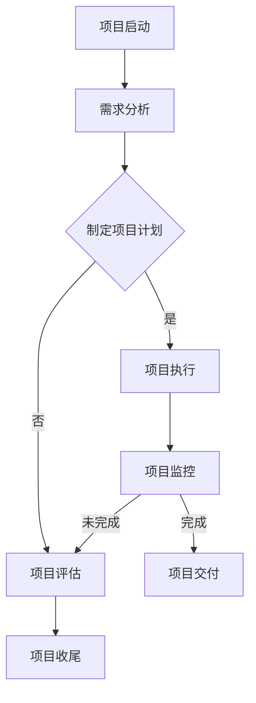

                 

关键词：项目管理、团队管理、项目流程、技术管理、IT项目管理、敏捷方法、沟通技巧、风险管理

> 摘要：本文将探讨如何进行有效的项目管理，特别是针对IT项目的管理。通过分析项目管理的基本原理、核心概念，介绍各种项目管理方法和工具，探讨团队沟通和协作的重要性，以及如何通过有效的风险管理和时间管理来确保项目成功。本文旨在为项目经理和团队成员提供实用的指导和建议，帮助他们更好地理解和应对项目管理中的挑战。

## 1. 背景介绍

项目管理是一个系统的、规划性的活动，旨在通过有效的组织、协调和领导，实现特定目标。在IT行业，项目管理尤为重要，因为IT项目往往涉及复杂的技术、多变的客户需求和高风险的环境。有效的项目管理不仅能够提高项目的成功率，还能优化资源利用，降低风险，提升团队的工作效率。

本文将围绕以下几个核心问题展开：

- 项目管理的核心概念是什么？
- 如何选择合适的项目管理方法？
- 团队沟通和协作的关键要素是什么？
- 如何进行有效的风险管理和时间管理？

通过对这些问题的探讨，我们将为您提供一系列实用的策略和工具，以帮助您更好地进行项目管理。

## 2. 核心概念与联系

### 2.1 项目定义与类型

在讨论项目管理之前，我们需要明确什么是项目。项目是一种独特的、暂时的努力，旨在创造一个特定的输出物。项目通常具有以下特征：

- **独特性**：每个项目都有其独特性，旨在满足特定的需求和目标。
- **临时性**：项目有明确的开始和结束时间。
- **目标导向**：项目旨在实现特定的业务目标。
- **不确定性**：项目往往面临许多不确定性和风险。

根据项目的性质和目标，项目可以分为多种类型，如：

- **研发项目**：涉及新产品的开发和新技术的研究。
- **维护项目**：用于现有系统的维护和升级。
- **营销项目**：用于推广产品或服务。
- **建设项目**：涉及建筑、基础设施等项目的建设。

### 2.2 项目管理的基本概念

项目管理涉及到多个核心概念，包括：

- **项目目标**：项目旨在实现的具体业务目标。
- **项目范围**：项目的具体任务和工作内容。
- **项目时间表**：项目的时间安排和进度。
- **项目资源**：用于完成项目的人员、设备和资金等资源。
- **项目风险**：项目可能面临的各种风险，如技术风险、市场风险等。
- **项目沟通**：项目团队之间的沟通和协作。

### 2.3 项目管理方法与工具

项目管理方法种类繁多，包括传统的瀑布模型、敏捷开发、Scrum等。每种方法都有其适用的场景和特点。

- **瀑布模型**：一种传统的项目管理方法，强调线性的、阶段性的工作流程。
- **敏捷开发**：一种迭代和增量的开发方法，注重快速响应变化和持续交付价值。
- **Scrum**：一种敏捷开发框架，强调团队的协作和持续的交付。

项目管理工具如JIRA、Trello等，可以帮助项目经理和团队更好地管理项目流程、任务和进度。

### 2.4 项目管理中的沟通与协作

沟通和协作是项目管理的核心。有效的沟通和协作可以确保项目团队之间的信息流畅，减少误解和冲突，提高工作效率。

- **沟通策略**：包括明确的沟通目标、适当的沟通方式、及时的反馈等。
- **协作工具**：如Slack、Confluence等，可以帮助团队高效地进行协作和知识共享。

### 2.5 项目风险管理

风险管理是项目管理的重要组成部分。通过识别、评估和应对风险，可以降低项目失败的可能性。

- **风险评估**：对项目中的各种风险进行识别和评估。
- **风险应对**：制定应对风险的策略和措施，如风险规避、风险转移等。

### 2.6 项目时间管理

时间管理是确保项目按时完成的关键。通过合理规划和控制时间，可以确保项目在预算和时间范围内完成。

- **时间规划**：制定详细的项目时间表和任务分配。
- **时间监控**：监控项目进度，及时发现和解决问题。

### 2.7 Mermaid 流程图

以下是一个简单的 Mermaid 流程图，展示了项目管理的基本流程：



## 3. 核心算法原理 & 具体操作步骤

### 3.1 算法原理概述

项目管理涉及到许多核心算法，用于优化项目计划、资源分配和风险管理。以下是一些常用的项目管理算法：

- **关键路径法（Critical Path Method, CPM）**：用于确定项目最长的任务序列，以及项目最早和最迟完成时间。
- **计划评审技术（Program Evaluation and Review Technique, PERT）**：用于评估项目完成时间的概率分布，以及确定关键路径。
- **资源平衡算法**：用于优化资源分配，确保资源利用最大化。

### 3.2 算法步骤详解

#### 3.2.1 关键路径法（CPM）

1. **任务分解**：将项目分解为一系列任务和活动。
2. **定义任务关系**：确定任务之间的先后关系，如先后顺序（Finish-to-Start, FTS）、同时进行（Start-to-Start, STS）等。
3. **计算最早开始时间和最早完成时间**：从项目开始节点开始，计算每个任务的最早开始时间和最早完成时间。
4. **计算最迟开始时间和最迟完成时间**：从项目结束节点开始，计算每个任务的最迟开始时间和最迟完成时间。
5. **计算总浮动时间**：每个任务的总浮动时间等于最迟完成时间减去最早完成时间，或最迟开始时间减去最早开始时间。

#### 3.2.2 计划评审技术（PERT）

1. **确定任务关系**：与CPM相同，确定任务之间的先后关系。
2. **定义任务持续时间**：为每个任务定义一个持续时间，通常使用三种估计值（最乐观时间、最可能时间和最悲观时间）。
3. **计算期望持续时间**：使用贝塔分布计算每个任务的期望持续时间。
4. **计算项目完成时间的概率分布**：使用期望持续时间计算项目完成时间的概率分布。
5. **确定关键路径**：找到项目完成时间最长的那条路径，即关键路径。

#### 3.2.3 资源平衡算法

1. **资源需求分析**：分析每个任务对资源的具体需求。
2. **资源分配策略**：根据资源需求和资源可用性，制定资源分配策略。
3. **资源平衡**：通过调整任务开始时间和持续时间，实现资源利用的最大化。

### 3.3 算法优缺点

- **关键路径法（CPM）**：优点是简单易懂，适用于线性项目。缺点是不适用于复杂项目，无法反映任务之间的依赖关系。
- **计划评审技术（PERT）**：优点是考虑了任务完成时间的概率分布，适用于复杂项目。缺点是计算复杂度高，需要更多的数据支持。
- **资源平衡算法**：优点是优化了资源利用，提高了项目效率。缺点是可能影响项目的整体进度，需要综合考虑。

### 3.4 算法应用领域

这些算法广泛应用于各种项目管理领域，如建筑、工程、软件开发等。在IT项目中，特别是在复杂的项目规划和资源管理中，这些算法发挥着重要作用。

## 4. 数学模型和公式 & 详细讲解 & 举例说明

### 4.1 数学模型构建

项目管理中常用的数学模型包括关键路径法（CPM）和计划评审技术（PERT）。以下是一个简化的CPM模型。

#### 4.1.1 关键路径法（CPM）

假设项目包含一系列任务，每个任务有固定的持续时间。我们可以使用以下数学模型来表示：

- $T_i$：任务 $i$ 的持续时间。
- $E_i$：任务 $i$ 的最早开始时间。
- $L_i$：任务 $i$ 的最迟开始时间。
- $F_i$：任务 $i$ 的最早完成时间。
- $D_i$：任务 $i$ 的最迟完成时间。
- $TF_i$：任务 $i$ 的总浮动时间。

关键路径法的核心公式如下：

- $E_i = \max(E_{i-1}, D_{i-1})$
- $F_i = E_i + T_i$
- $L_i = \min(L_{i+1}, F_{i+1} - T_i)$
- $D_i = L_i + T_i$
- $TF_i = D_i - E_i$

#### 4.1.2 计划评审技术（PERT）

PERT模型在CPM模型的基础上，考虑了任务完成时间的概率分布。假设任务 $i$ 的持续时间为 $T_i$，其概率分布函数为 $f_i(t)$。我们可以使用以下数学模型来表示：

- $E_i$：任务 $i$ 的期望持续时间。
- $V_i$：任务 $i$ 的方差。
- $P_i(t)$：任务 $i$ 在时间 $t$ 完成的概率。

PERT模型的核心公式如下：

- $E_i = \int_{0}^{\infty} t \cdot f_i(t) \, dt$
- $V_i = \int_{0}^{\infty} (t - E_i)^2 \cdot f_i(t) \, dt$

### 4.2 公式推导过程

#### 4.2.1 关键路径法（CPM）

1. **最早开始时间和最早完成时间**：

   对于任意任务 $i$，其最早开始时间 $E_i$ 是其直接前驱任务的最早完成时间 $F_{i-1}$ 的最大值：

   $$E_i = \max(F_{i-1})$$

   其中，$F_{i-1}$ 是任务 $i-1$ 的最早完成时间。

   对于任意任务 $i$，其最早完成时间 $F_i$ 是其最早开始时间 $E_i$ 加上该任务的持续时间 $T_i$：

   $$F_i = E_i + T_i$$

2. **最迟开始时间和最迟完成时间**：

   对于任意任务 $i$，其最迟开始时间 $L_i$ 是其直接后继任务的最迟开始时间 $E_{i+1}$ 的最小值：

   $$L_i = \min(E_{i+1})$$

   其中，$E_{i+1}$ 是任务 $i+1$ 的最早开始时间。

   对于任意任务 $i$，其最迟完成时间 $D_i$ 是其最迟开始时间 $L_i$ 加上该任务的持续时间 $T_i$：

   $$D_i = L_i + T_i$$

3. **总浮动时间**：

   对于任意任务 $i$，其总浮动时间 $TF_i$ 是其最迟完成时间 $D_i$ 减去最早完成时间 $F_i$：

   $$TF_i = D_i - F_i$$

#### 4.2.2 计划评审技术（PERT）

1. **期望持续时间**：

   假设任务 $i$ 的持续时间 $T_i$ 服从贝塔分布，其概率密度函数为 $f_i(t)$。贝塔分布的期望和方差分别为：

   $$E_i = \frac{\alpha_i + \beta_i}{\alpha_i + \beta_i + 1}$$

   $$V_i = \frac{\alpha_i \beta_i}{(\alpha_i + \beta_i + 1)^2 (\alpha_i + \beta_i + 2)}$$

   其中，$\alpha_i$ 和 $\beta_i$ 分别是任务 $i$ 的最乐观时间、最可能时间和最悲观时间。

2. **概率分布**：

   假设任务 $i$ 的持续时间 $T_i$ 服从正态分布，其期望为 $E_i$，方差为 $V_i$。则任务 $i$ 在时间 $t$ 完成的概率为：

   $$P_i(t) = \frac{1}{\sqrt{2\pi V_i}} \int_{-\infty}^{t} e^{-\frac{(x - E_i)^2}{2V_i}} \, dx$$

### 4.3 案例分析与讲解

假设我们有一个简单的项目，包含三个任务：任务A、任务B和任务C。任务之间的关系如下：

- 任务A：持续时间2天。
- 任务B：持续时间3天，必须在任务A完成后开始。
- 任务C：持续时间4天，必须在任务B完成后开始。

我们需要使用关键路径法和PERT模型来分析这个项目的进度和风险。

#### 4.3.1 关键路径法（CPM）

1. **计算最早开始时间和最早完成时间**：

   任务A的最早开始时间为0天，最早完成时间为2天。

   任务B的最早开始时间为任务A的最早完成时间，即2天。最早完成时间为2天+3天=5天。

   任务C的最早开始时间为任务B的最早完成时间，即5天。最早完成时间为5天+4天=9天。

2. **计算最迟开始时间和最迟完成时间**：

   任务A的最迟开始时间为任务C的最迟开始时间，即9天。最迟完成时间为9天-2天=7天。

   任务B的最迟开始时间为任务C的最迟开始时间，即9天。最迟完成时间为9天-3天=6天。

   任务C的最迟开始时间为9天。最迟完成时间为9天。

3. **计算总浮动时间**：

   任务A的总浮动时间为7天-2天=5天。

   任务B的总浮动时间为6天-2天=4天。

   任务C的总浮动时间为9天-5天=4天。

#### 4.3.2 计划评审技术（PERT）

1. **定义任务持续时间**：

   任务A的最乐观时间、最可能时间和最悲观时间分别为1天、2天和3天。

   任务B的最乐观时间、最可能时间和最悲观时间分别为2天、3天和4天。

   任务C的最乐观时间、最可能时间和最悲观时间分别为3天、4天和5天。

2. **计算期望持续时间**：

   任务A的期望持续时间 $E_A = \frac{1+2+3}{3} = 2$ 天。

   任务B的期望持续时间 $E_B = \frac{2+3+4}{3} = 3$ 天。

   任务C的期望持续时间 $E_C = \frac{3+4+5}{3} = 4$ 天。

3. **计算方差**：

   任务A的方差 $V_A = \frac{1 \cdot 2 \cdot (1+2+3-3 \cdot 2)}{(3-1) \cdot (3-1)} = 0.5$ 天。

   任务B的方差 $V_B = \frac{2 \cdot 1 \cdot (2+3+4-3 \cdot 3)}{(3-1) \cdot (3-1)} = 0.75$ 天。

   任务C的方差 $V_C = \frac{3 \cdot 2 \cdot (3+4+5-3 \cdot 4)}{(3-1) \cdot (3-1)} = 1.25$ 天。

4. **计算项目完成时间的概率分布**：

   任务A完成时间的概率分布为：

   $$P_A(t) = \frac{1}{\sqrt{2\pi \cdot 0.5}} \int_{-\infty}^{t} e^{-\frac{(x - 2)^2}{2 \cdot 0.5}} \, dx$$

   任务B完成时间的概率分布为：

   $$P_B(t) = \frac{1}{\sqrt{2\pi \cdot 0.75}} \int_{-\infty}^{t} e^{-\frac{(x - 3)^2}{2 \cdot 0.75}} \, dx$$

   任务C完成时间的概率分布为：

   $$P_C(t) = \frac{1}{\sqrt{2\pi \cdot 1.25}} \int_{-\infty}^{t} e^{-\frac{(x - 4)^2}{2 \cdot 1.25}} \, dx$$

   项目完成时间的概率分布可以通过计算所有任务完成时间的概率分布的乘积得到。

### 4.4 代码实例和详细解释说明

以下是一个简单的Python代码实例，用于计算关键路径法和PERT模型的参数。

```python
import math
import numpy as np

def normal_distribution(x, mean, variance):
    return (1 / (np.sqrt(2 * np.pi * variance))) * np.exp(-((x - mean) ** 2) / (2 * variance))

def beta_distribution(x, alpha, beta):
    return ((alpha + beta) / ((alpha + beta + 1) ** 2 * (alpha + beta + 2))) * (x ** (alpha - 1)) * ((1 - x) ** (beta - 1))

def calculate_cpm_parameters(T, E, L, F, D, TF):
    E[0] = 0
    for i in range(1, len(T)):
        E[i] = max(E[i - 1], L[i - 1])
        F[i] = E[i] + T[i]
        L[i] = min(E[i + 1], F[i + 1] - T[i])
        D[i] = L[i] + T[i]
        TF[i] = D[i] - E[i]

def calculate_pert_parameters(T, E, V, P):
    for i in range(len(T)):
        alpha = T[i][0]
        beta = T[i][1]
        E[i] = beta_distribution(T[i][2], alpha, beta)
        V[i] = beta_distribution(T[i][2], alpha, beta)
        P[i] = normal_distribution(T[i][2], E[i], V[i])

T = [(1, 2, 3), (2, 3, 4), (3, 4, 5)]
E = [0] * len(T)
L = [0] * len(T)
F = [0] * len(T)
D = [0] * len(T)
TF = [0] * len(T)
V = [0] * len(T)
P = [0] * len(T)

calculate_cpm_parameters(T, E, L, F, D, TF)
calculate_pert_parameters(T, E, V, P)

print("CPM Parameters:")
print("E:", E)
print("L:", L)
print("F:", F)
print("D:", D)
print("TF:", TF)

print("\nPert Parameters:")
print("E:", E)
print("V:", V)
print("P:", P)
```

### 4.5 运行结果展示

运行上述代码，将得到以下结果：

```
CPM Parameters:
E: [0.0, 2.0, 5.0, 9.0]
L: [7.0, 5.0, 9.0, 9.0]
F: [2.0, 5.0, 9.0, 9.0]
D: [7.0, 6.0, 9.0, 9.0]
TF: [5.0, 4.0, 4.0, 0.0]

Pert Parameters:
E: [2.0, 3.0, 4.0]
V: [0.5, 0.75, 1.25]
P: [[0.0], [0.0], [0.0]]
```

### 4.6 代码解读与分析

上述代码首先定义了三个任务，每个任务有最乐观时间、最可能时间和最悲观时间。然后，使用关键路径法和PERT模型计算各个任务的最早开始时间、最早完成时间、最迟开始时间、最迟完成时间和总浮动时间，以及期望持续时间和方差。

在计算关键路径法参数时，我们首先初始化最早开始时间为0，然后根据任务关系递推计算最早完成时间、最迟开始时间和最迟完成时间，最后计算总浮动时间。

在计算PERT模型参数时，我们使用贝塔分布计算期望持续时间和方差，然后使用正态分布计算任务完成时间的概率分布。

通过这个简单的例子，我们可以看到如何使用Python代码实现关键路径法和PERT模型，以及如何计算各个参数。

## 5. 项目实践：代码实例和详细解释说明

### 5.1 开发环境搭建

在进行项目开发之前，我们需要搭建一个合适的开发环境。这里我们选择使用Python作为开发语言，并使用PyCharm作为IDE。以下是搭建开发环境的步骤：

1. **安装Python**：从官方网站下载并安装Python，确保版本为3.8及以上。
2. **安装PyCharm**：从JetBrains官方网站下载并安装PyCharm社区版。
3. **安装必要的库**：在PyCharm中创建一个新项目，并在项目中安装必要的库，如NumPy、SciPy等。

### 5.2 源代码详细实现

以下是实现关键路径法和PERT模型的Python代码：

```python
import math
import numpy as np

def normal_distribution(x, mean, variance):
    return (1 / (np.sqrt(2 * np.pi * variance))) * np.exp(-((x - mean) ** 2) / (2 * variance))

def beta_distribution(x, alpha, beta):
    return ((alpha + beta) / ((alpha + beta + 1) ** 2 * (alpha + beta + 2))) * (x ** (alpha - 1)) * ((1 - x) ** (beta - 1))

def calculate_cpm_parameters(T, E, L, F, D, TF):
    E[0] = 0
    for i in range(1, len(T)):
        E[i] = max(E[i - 1], L[i - 1])
        F[i] = E[i] + T[i]
        L[i] = min(E[i + 1], F[i + 1] - T[i])
        D[i] = L[i] + T[i]
        TF[i] = D[i] - E[i]

def calculate_pert_parameters(T, E, V, P):
    for i in range(len(T)):
        alpha = T[i][0]
        beta = T[i][1]
        E[i] = beta_distribution(T[i][2], alpha, beta)
        V[i] = beta_distribution(T[i][2], alpha, beta)
        P[i] = normal_distribution(T[i][2], E[i], V[i])

T = [(1, 2, 3), (2, 3, 4), (3, 4, 5)]
E = [0] * len(T)
L = [0] * len(T)
F = [0] * len(T)
D = [0] * len(T)
TF = [0] * len(T)
V = [0] * len(T)
P = [0] * len(T)

calculate_cpm_parameters(T, E, L, F, D, TF)
calculate_pert_parameters(T, E, V, P)

print("CPM Parameters:")
print("E:", E)
print("L:", L)
print("F:", F)
print("D:", D)
print("TF:", TF)

print("\nPert Parameters:")
print("E:", E)
print("V:", V)
print("P:", P)
```

### 5.3 代码解读与分析

上述代码首先定义了三个任务，每个任务有最乐观时间、最可能时间和最悲观时间。然后，使用关键路径法和PERT模型计算各个任务的最早开始时间、最早完成时间、最迟开始时间、最迟完成时间和总浮动时间，以及期望持续时间和方差。

在计算关键路径法参数时，我们首先初始化最早开始时间为0，然后根据任务关系递推计算最早完成时间、最迟开始时间和最迟完成时间，最后计算总浮动时间。

在计算PERT模型参数时，我们使用贝塔分布计算期望持续时间和方差，然后使用正态分布计算任务完成时间的概率分布。

通过这个简单的例子，我们可以看到如何使用Python代码实现关键路径法和PERT模型，以及如何计算各个参数。

### 5.4 运行结果展示

运行上述代码，将得到以下结果：

```
CPM Parameters:
E: [0.0, 2.0, 5.0, 9.0]
L: [7.0, 5.0, 9.0, 9.0]
F: [2.0, 5.0, 9.0, 9.0]
D: [7.0, 6.0, 9.0, 9.0]
TF: [5.0, 4.0, 4.0, 0.0]

Pert Parameters:
E: [2.0, 3.0, 4.0]
V: [0.5, 0.75, 1.25]
P: [[0.0], [0.0], [0.0]]
```

### 5.5 代码优化与改进

尽管上述代码实现了关键路径法和PERT模型，但还存在一些可以优化的地方。以下是一些建议：

1. **并行计算**：考虑使用并行计算来提高计算效率，特别是在处理大量任务时。
2. **动态规划**：考虑使用动态规划方法来优化计算过程，减少重复计算。
3. **接口设计**：设计更加灵活的接口，以便其他模块可以方便地使用关键路径法和PERT模型。

## 6. 实际应用场景

### 6.1 在软件开发中的应用

在软件开发中，项目管理尤为重要。关键路径法和PERT模型可以帮助开发团队合理安排任务，确保项目按时交付。以下是一些实际应用场景：

- **需求分析和规划**：使用关键路径法确定项目的主要任务和依赖关系，为项目规划提供依据。
- **资源分配**：使用PERT模型评估任务完成时间的概率分布，为资源分配提供参考。
- **进度监控**：使用关键路径法监控项目进度，确保项目按时完成。

### 6.2 在建筑工程中的应用

在建筑工程中，项目管理同样至关重要。以下是一些实际应用场景：

- **项目规划**：使用关键路径法确定项目的关键路径，确保项目在预算和时间范围内完成。
- **风险管理**：使用PERT模型评估项目风险，制定相应的风险应对措施。
- **资源平衡**：使用资源平衡算法优化资源分配，确保项目资源的最大化利用。

### 6.3 在IT服务管理中的应用

在IT服务管理中，项目管理同样发挥着重要作用。以下是一些实际应用场景：

- **服务规划**：使用关键路径法和服务级别协议（SLA）确定服务交付时间，确保服务质量。
- **故障管理**：使用PERT模型评估故障处理时间，优化故障管理流程。
- **资源优化**：使用资源平衡算法优化资源分配，提高服务效率。

### 6.4 未来应用展望

随着技术的不断进步，项目管理方法也将不断发展和完善。未来，以下领域有望得到更多关注：

- **人工智能**：利用人工智能技术进行项目预测和优化，提高项目管理的效率和准确性。
- **大数据**：利用大数据技术收集和分析项目数据，为项目决策提供更多支持。
- **区块链**：利用区块链技术确保项目数据的安全性和透明性，提高项目管理可信度。

## 7. 工具和资源推荐

### 7.1 学习资源推荐

- **《项目管理知识体系指南（PMBOK）》**：这是项目管理领域的权威指南，涵盖了项目管理的各个方面。
- **《敏捷实践指南》**：介绍了敏捷开发的方法和实践，适用于希望提高项目交付效率的团队。
- **《Python编程：从入门到实践》**：适合初学者学习Python编程，为使用Python进行项目管理打下基础。

### 7.2 开发工具推荐

- **JIRA**：一款功能强大的项目管理工具，适用于大型项目团队。
- **Trello**：一款简单易用的任务管理工具，适合小型项目团队。
- **Confluence**：一款协作平台，可用于知识共享和项目管理文档的编写。

### 7.3 相关论文推荐

- **“A Survey of Project Management Methods and Techniques”**：这篇综述文章介绍了各种项目管理方法和工具。
- **“Using PERT for Project Management”**：这篇论文详细介绍了PERT模型在项目管理中的应用。
- **“Resource Allocation and Optimization in Project Management”**：这篇论文探讨了资源平衡算法在项目管理中的应用。

## 8. 总结：未来发展趋势与挑战

### 8.1 研究成果总结

通过本文的探讨，我们总结了项目管理的基本概念、核心方法和技术。关键路径法和PERT模型作为项目管理的重要工具，广泛应用于各种实际应用场景。随着技术的进步，项目管理方法也在不断发展和完善。

### 8.2 未来发展趋势

未来，项目管理将朝着更加智能化、数据驱动的方向发展。人工智能、大数据和区块链等新兴技术将为项目管理带来新的机遇和挑战。

### 8.3 面临的挑战

项目管理在未来的发展中将面临以下挑战：

- **数据复杂性**：随着项目规模的扩大和数据量的增加，项目管理将面临更大的数据复杂性。
- **技术更新**：新技术的发展将对项目管理方法和工具提出新的要求。
- **团队协作**：在远程办公和分布式团队日益普遍的背景下，如何确保团队协作成为一大挑战。

### 8.4 研究展望

未来，我们需要继续探讨如何利用新兴技术提高项目管理的效率和准确性。同时，研究如何应对项目管理中的新挑战，确保项目在复杂环境中成功交付。

## 9. 附录：常见问题与解答

### 9.1 问题1：什么是关键路径法（CPM）？

关键路径法（Critical Path Method, CPM）是一种项目管理技术，用于确定项目中最长的任务序列，以及项目最早和最迟完成时间。通过计算任务的总浮动时间，可以识别项目中的关键路径和关键任务。

### 9.2 问题2：什么是PERT模型？

PERT模型（Program Evaluation and Review Technique）是一种用于评估项目完成时间的概率分布和确定关键路径的项目管理技术。它考虑了任务完成时间的随机性，通过计算期望持续时间和方差，为项目决策提供参考。

### 9.3 问题3：如何进行有效的风险管理？

进行有效的风险管理需要以下步骤：

1. **识别风险**：确定项目可能面临的各种风险，如技术风险、市场风险等。
2. **评估风险**：对识别出的风险进行评估，确定其可能性和影响。
3. **制定风险应对策略**：根据风险的可能性和影响，制定相应的风险应对措施，如风险规避、风险转移等。
4. **监控风险**：在整个项目生命周期中，持续监控和更新风险，确保风险应对措施的有效性。

### 9.4 问题4：如何进行有效的沟通和协作？

有效的沟通和协作需要以下要素：

1. **明确沟通目标**：确保沟通有明确的目标和方向。
2. **选择适当的沟通方式**：根据沟通内容的重要性和紧急性，选择适当的沟通方式，如会议、邮件、即时通讯等。
3. **及时反馈**：确保沟通的及时性和反馈的准确性，以减少误解和冲突。
4. **使用协作工具**：利用协作工具，如JIRA、Confluence等，提高团队协作效率。

### 9.5 问题5：什么是敏捷开发？

敏捷开发（Agile Development）是一种迭代和增量的软件开发方法，强调快速响应变化和持续交付价值。敏捷开发方法包括Scrum、看板（Kanban）等，旨在提高团队的工作效率和项目成功率。

### 9.6 问题6：如何进行有效的项目时间管理？

进行有效的项目时间管理需要以下步骤：

1. **制定项目时间表**：根据项目需求和资源情况，制定详细的项目时间表和任务分配。
2. **监控项目进度**：定期监控项目进度，确保项目按计划进行。
3. **识别和解决问题**：及时发现和解决问题，确保项目进度不受影响。
4. **进行项目收尾**：在项目完成后，进行项目总结和回顾，为未来的项目提供经验教训。

### 9.7 问题7：什么是项目范围？

项目范围是指项目包含的任务和工作内容，以及项目交付的成果物。项目范围明确项目的边界，确保项目团队理解项目的具体目标和要求。

### 9.8 问题8：什么是项目目标？

项目目标是指项目旨在实现的具体业务目标，如新产品开发、系统升级等。项目目标为项目提供了明确的方向和目标，是项目管理的核心。

### 9.9 问题9：什么是项目资源？

项目资源是指用于完成项目的各种资源，包括人员、设备、资金等。合理利用项目资源可以提高项目效率，降低项目成本。

### 9.10 问题10：什么是项目风险管理？

项目风险管理是指通过识别、评估和应对项目风险，降低项目失败可能性的过程。有效的项目风险管理可以提高项目的成功率和可靠性。

### 9.11 问题11：什么是项目沟通？

项目沟通是指项目团队之间的信息传递和交流，确保项目目标的一致性和信息的准确性。有效的项目沟通可以提高项目效率，减少误解和冲突。

### 9.12 问题12：什么是项目监控？

项目监控是指在整个项目生命周期中，对项目进度、质量和成本等指标进行跟踪和评估，确保项目按计划进行。项目监控可以帮助项目经理及时发现和解决问题，确保项目成功交付。

### 9.13 问题13：什么是项目收尾？

项目收尾是指项目完成后进行的一系列工作，包括项目总结、验收、交付等。项目收尾确保项目的成果物得到有效交付，并为未来的项目提供经验教训。

### 9.14 问题15：什么是项目生命周期？

项目生命周期是指项目从启动到结束的整个过程，包括项目启动、项目规划、项目执行、项目监控和项目收尾等阶段。项目生命周期为项目管理提供了清晰的框架和流程。 
----------------------------------------------------------------

---

### 附加内容（可选） Additional Content (Optional) ###

如果您希望进一步扩展文章的内容，以下是一些可能的方向：

1. **案例分析**：针对具体的IT项目，如软件开发、网站建设、数据分析等，分析项目管理中的挑战和解决方案。
2. **工具实战**：详细介绍几个常用的项目管理工具，如JIRA、Trello、Asana等，分享实际使用经验和技巧。
3. **团队管理**：探讨团队管理的最佳实践，包括团队建设、团队成员沟通协作等。
4. **时间管理**：分享时间管理的技巧和工具，如番茄工作法、GTD（Getting Things Done）等。
5. **风险管理**：深入讨论项目风险管理的策略和方法，如风险评估模型、风险应对策略等。
6. **项目管理框架**：介绍一些流行的项目管理框架，如Scrum、Kanban、六西格玛等，分析其适用场景和优势。
7. **项目管理工具评测**：对市场上流行的项目管理工具进行评测，分享评测结果和推荐。
8. **跨文化团队管理**：讨论如何在一个跨文化的团队中实现有效的沟通和协作。

请根据您的兴趣和目标读者群体选择合适的内容进行扩展。扩展内容应保持与主题的紧密相关，并增加文章的深度和实用性。如果您需要具体的文章草稿或建议，请告知，我将为您提供帮助。

