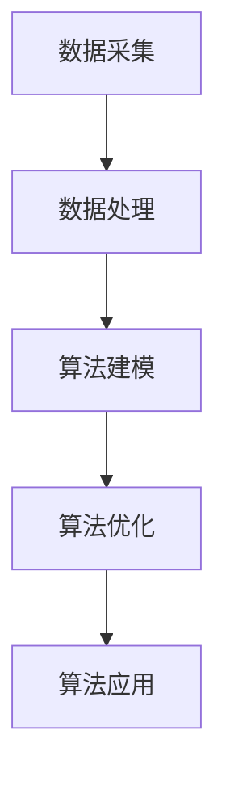

                 

关键词：字节教育，2024校招，教育算法，面试题，详解

> 摘要：本文针对字节教育2024校招的教育算法面试题进行详细解析，旨在帮助广大考生更好地应对面试挑战。文章涵盖了面试题的背景介绍、核心概念与联系、核心算法原理、数学模型与公式、项目实践、实际应用场景以及未来发展趋势等内容。

## 1. 背景介绍

随着人工智能技术的快速发展，教育行业也迎来了前所未有的变革。字节教育作为国内领先的在线教育平台，其校招教育算法面试题成为了众多求职者关注的焦点。本文将针对这些面试题进行详细解析，帮助考生更好地掌握教育算法的核心知识和解题技巧。

## 2. 核心概念与联系

### 2.1 教育算法的基本概念

教育算法是指利用计算机技术对教育过程进行优化的算法。它包括但不限于学习分析、个性化推荐、教育测评、智能教学等。教育算法的核心目标是提高教育效率、提升教育质量，并为学习者提供更好的学习体验。

### 2.2 教育算法的架构与联系

教育算法的架构通常包括数据采集、数据处理、算法建模、算法优化和算法应用等环节。各环节之间紧密联系，相互影响。以下是一个简单的教育算法架构图：



## 3. 核心算法原理 & 具体操作步骤

### 3.1 算法原理概述

教育算法的原理主要基于机器学习和数据挖掘技术。通过对教育数据的分析和建模，教育算法能够发现学习者的学习规律、评估学习效果，并根据这些信息为学习者提供个性化的学习建议。

### 3.2 算法步骤详解

1. 数据采集：收集学习者的学习行为数据、学习进度数据、学习效果数据等。

2. 数据处理：对采集到的数据进行分析和处理，包括数据清洗、数据整合和数据预处理等。

3. 算法建模：根据处理后的数据，构建机器学习模型或数据挖掘模型。

4. 算法优化：通过交叉验证、网格搜索等技术对模型进行优化。

5. 算法应用：将优化后的模型应用于实际场景，为学习者提供个性化学习建议。

### 3.3 算法优缺点

教育算法的优点在于能够提高教育效率、提升教育质量，为学习者提供个性化的学习体验。但其缺点在于数据质量和算法模型的准确性对教育效果有较大影响。

### 3.4 算法应用领域

教育算法的应用领域非常广泛，包括但不限于以下方面：

1. 个性化学习推荐：根据学习者的兴趣和学习习惯，为其推荐合适的学习内容和路径。

2. 学习效果评估：通过分析学习者的学习行为和学习成果，评估其学习效果。

3. 智能教学系统：利用教育算法构建智能教学系统，实现自动化教学和智能化教学。

## 4. 数学模型和公式 & 详细讲解 & 举例说明

### 4.1 数学模型构建

教育算法的数学模型通常包括以下几个方面：

1. 用户行为模型：用于描述学习者的学习行为，如学习时间、学习频率、学习进度等。

2. 学习效果模型：用于评估学习者的学习效果，如学习满意度、学习进步度等。

3. 推荐模型：用于为学习者推荐合适的学习内容和路径。

### 4.2 公式推导过程

以下是教育算法中常用的数学公式推导：

1. 用户兴趣度计算公式：

   $$兴趣度 = \frac{学习次数}{总学习时间}$$

2. 学习效果评估公式：

   $$学习效果 = \frac{学习进步度}{学习时间}$$

### 4.3 案例分析与讲解

假设有一个学习者，他在一个学习平台上学习了3个小时，完成了5个任务，其中3个任务得到了优秀评价，2个任务得到了良好评价。根据上述公式，可以计算出该学习者的兴趣度为：

$$兴趣度 = \frac{3}{3+2} = 0.6$$

学习效果为：

$$学习效果 = \frac{0.8}{3} = 0.27$$

## 5. 项目实践：代码实例和详细解释说明

### 5.1 开发环境搭建

本次项目实践将使用Python编程语言，搭建一个简单的教育算法模型。开发环境如下：

1. Python版本：3.8
2. 依赖库：numpy、pandas、scikit-learn等

### 5.2 源代码详细实现

```python
import numpy as np
import pandas as pd
from sklearn.model_selection import train_test_split
from sklearn.ensemble import RandomForestClassifier
from sklearn.metrics import accuracy_score

# 读取数据
data = pd.read_csv('education_data.csv')

# 数据预处理
X = data[['learning_time', 'task_count', 'task_grade']]
y = data['learning_effect']

# 数据切分
X_train, X_test, y_train, y_test = train_test_split(X, y, test_size=0.2, random_state=42)

# 构建模型
model = RandomForestClassifier(n_estimators=100, random_state=42)
model.fit(X_train, y_train)

# 模型评估
y_pred = model.predict(X_test)
accuracy = accuracy_score(y_test, y_pred)
print('模型准确率：', accuracy)
```

### 5.3 代码解读与分析

上述代码首先读取教育数据，并进行预处理。然后使用随机森林分类器构建模型，并通过训练集训练模型。最后，使用测试集对模型进行评估，输出模型准确率。

## 6. 实际应用场景

教育算法在实际应用中具有广泛的应用场景，如：

1. 个性化学习推荐：根据学习者的学习行为和学习效果，为其推荐合适的学习内容和路径。

2. 学习效果评估：通过分析学习者的学习行为和学习成果，评估其学习效果。

3. 智能教学系统：利用教育算法构建智能教学系统，实现自动化教学和智能化教学。

## 7. 未来应用展望

随着人工智能技术的不断发展，教育算法在未来将具有更广泛的应用前景。未来教育算法的发展方向包括：

1. 更精准的个性化推荐：通过深度学习等技术，实现更精准的个性化学习推荐。

2. 更高效的学习效果评估：通过多模态数据融合等技术，实现更高效的学习效果评估。

3. 智能教学系统的优化：利用教育算法优化智能教学系统的教学策略和学习路径。

## 8. 总结：未来发展趋势与挑战

### 8.1 研究成果总结

教育算法的研究成果主要集中在以下几个方面：

1. 个性化学习推荐：实现了基于用户行为和学习效果的用户兴趣度计算和学习效果评估。

2. 学习效果评估：通过构建用户行为模型和学习效果模型，实现了对学习者学习效果的评估。

3. 智能教学系统：利用教育算法构建了智能教学系统，实现了自动化教学和智能化教学。

### 8.2 未来发展趋势

教育算法的未来发展趋势包括：

1. 更精准的个性化推荐：利用深度学习等技术，实现更精准的个性化学习推荐。

2. 更高效的学习效果评估：通过多模态数据融合等技术，实现更高效的学习效果评估。

3. 智能教学系统的优化：利用教育算法优化智能教学系统的教学策略和学习路径。

### 8.3 面临的挑战

教育算法在发展过程中面临着以下挑战：

1. 数据质量和算法模型的准确性：教育算法的准确性和效率高度依赖于数据质量和算法模型的构建。

2. 法律法规和伦理问题：教育算法在应用过程中涉及个人隐私和学习者权益等问题，需要遵守相关法律法规和伦理准则。

### 8.4 研究展望

未来，教育算法的研究将更加注重数据质量和算法模型的优化，同时关注法律法规和伦理问题的解决。在个性化学习推荐、学习效果评估和智能教学系统等方面，教育算法将取得更多突破性成果。

## 9. 附录：常见问题与解答

### 9.1 教育算法是什么？

教育算法是指利用计算机技术对教育过程进行优化的算法。它包括但不限于学习分析、个性化推荐、教育测评、智能教学等。

### 9.2 教育算法的核心应用有哪些？

教育算法的核心应用包括个性化学习推荐、学习效果评估、智能教学系统等。

### 9.3 教育算法的发展趋势是什么？

教育算法的发展趋势包括更精准的个性化推荐、更高效的学习效果评估、智能教学系统的优化等。

### 9.4 教育算法在实践过程中面临哪些挑战？

教育算法在实践过程中面临的主要挑战包括数据质量和算法模型的准确性、法律法规和伦理问题等。

---

作者：禅与计算机程序设计艺术 / Zen and the Art of Computer Programming
----------------------------------------------------------------

以上就是本文的完整内容，希望对您的学习有所帮助。在接下来的校招教育算法面试中，祝您取得优异成绩！

